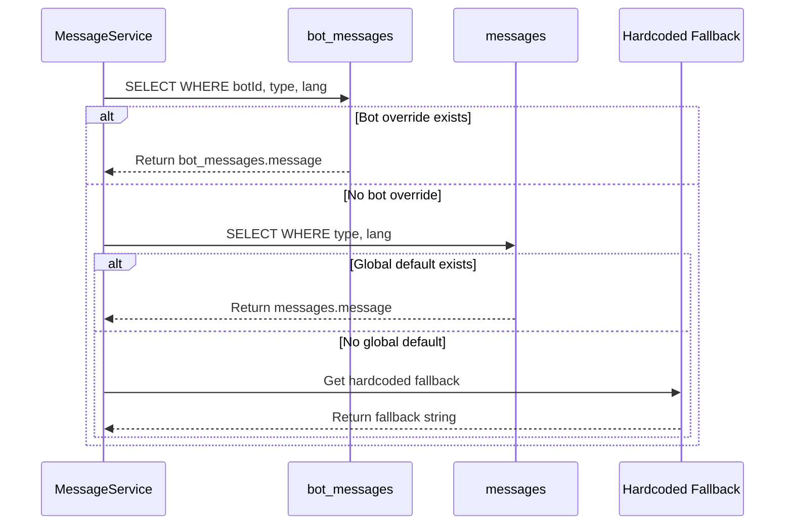
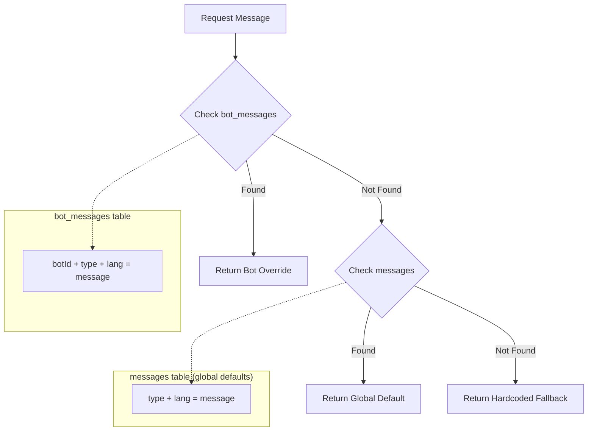
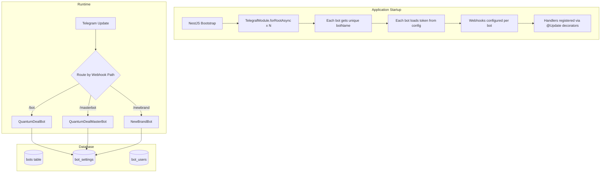
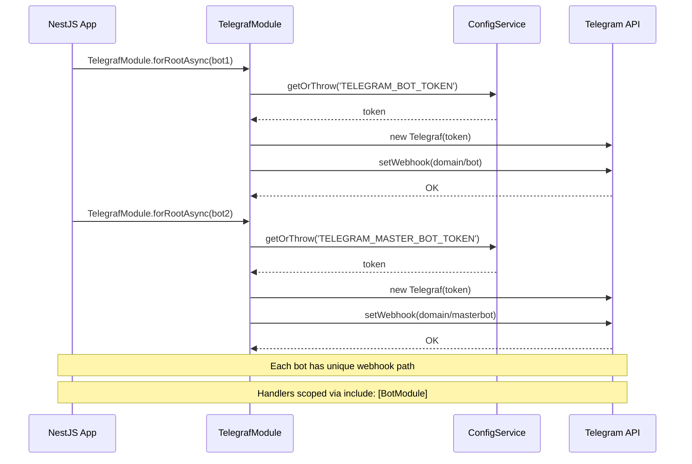

# ADR-004: Multi-Bot Database Architecture

## Status

Proposed

## Context

The Quantum Deal platform currently operates with a single-bot architecture where all users, subscriptions, and settings are implicitly tied to one bot instance. The business model is expanding to serve multiple broker partners through different branded Telegram bots, requiring architectural changes to support:

1. **Multiple independent bots** - Each bot serves a different broker/brand with its own identity
2. **User presence across bots** - A single Telegram user may interact with multiple bots
3. **Per-bot subscriptions** - Users subscribe independently to each bot's services
4. **Bot-specific settings** - Each bot has its own token, name, messages, and payment configuration
5. **Message customization** - Bots can use default messages or override with custom ones

### Technical Constraints

- **Tech Stack**: NestJS, Drizzle ORM, PostgreSQL, Telegraf.js + nest-telegraf
- **Team Structure**: Solo developer with AI assistance
- **No Admin UI**: All configuration through database (SQL, migrations, Drizzle ORM scripts)
- **Existing Schema**: Current single-bot schema with users, subscriptions, codes, messages tables
- **Real-time Requirements**: Signal delivery within 5 seconds of MT5 event

### Related Documents

- PRD: `docs/prd/multi-bot-architecture-prd.md` (v1.2.0)
- Existing ADRs: ADR-001 (Feature Flags), ADR-002 (Subscription Scope Migration), ADR-003 (User Settings JSONB)
- **ADR-005**: `docs/adr/ADR-005-telegram-bot-framework.md` - Framework decision (Telegraf.js + nest-telegraf)

## Decisions

This ADR documents six key architectural decisions for multi-bot support:

1. [User Identity Model](#decision-1-user-identity-model)
2. [Subscription Architecture](#decision-2-subscription-architecture)
3. [Message Override Strategy](#decision-3-message-override-strategy)
4. [Bot Token Storage](#decision-4-bot-token-storage)
5. [Feature Flags Storage](#decision-5-feature-flags-storage)
6. [Dynamic Bot Registration](#decision-6-dynamic-bot-registration)

---

## Decision 1: User Identity Model

### Selected Option: Global User Profile + Per-Bot Settings Table (Option C)

Implement a two-table design:
- `users` table: Global user profile (telegramId as PK, username, firstName, lastName, isPremium)
- `bot_users` table: Per-bot settings (userId, botId, lang, preferences, state, isActive)

### Options Considered

#### Option A: Single User Record + Multiple Bot Associations (via bot_users table only)

- **Overview**: Minimal users table with all per-bot data in junction table
- **Pros**:
  - Simple foreign key structure
  - Clear separation from start
  - No legacy field management
- **Cons**:
  - Loses global user preferences concept
  - Duplicates common user data across bots
  - No single source of truth for user identity
- **Effort**: 3 days

#### Option B: Separate User Record Per Bot

- **Overview**: Create new user record for each bot interaction, linked by telegramId
- **Pros**:
  - Complete isolation between bots
  - Simple queries within single bot context
  - No schema changes to existing users table
- **Cons**:
  - Data duplication (username, firstName repeated per bot)
  - Difficult to aggregate cross-bot user data
  - Violates DRY principle at data level
  - Complex migrations if user data changes
- **Effort**: 2 days

#### Option C (Selected): Global User Profile + Per-Bot Settings Table

- **Overview**: Keep users table for identity, add bot_users for per-bot customization
- **Pros**:
  - **Single source of truth**: User identity centralized, synchronized with Telegram
  - **Per-bot flexibility**: Language, preferences, conversation state isolated per bot
  - **Backward compatible**: Existing users table structure preserved
  - **Efficient queries**: Global user lookup O(1), per-bot settings via indexed FK
  - **Clean separation**: Identity vs configuration clearly distinguished
  - **Migration friendly**: Existing data remains valid, new fields added progressively
- **Cons**:
  - Requires JOIN for complete user context
  - Must manage field migration (users.lang becomes fallback for bot_users.lang)
  - Two tables to maintain
- **Effort**: 4 days

### Comparison Matrix

| Evaluation Axis | Option A | Option B | Option C (Selected) |
|-----------------|----------|----------|---------------------|
| Data Normalization | Medium | Low | High |
| Query Complexity | Low | Low | Medium |
| Cross-bot Analytics | Difficult | Difficult | Easy |
| Migration Effort | Medium | Low | Medium |
| Backward Compatibility | Low | Medium | High |
| Scalability | High | Low | High |
| Single Source of Truth | No | No | Yes |

### Rationale

Option C provides the optimal balance between data normalization and flexibility. The global user profile maintains a single source of truth for user identity (synchronized with Telegram), while per-bot settings enable complete customization per bot without data duplication. The existing `users` table structure is preserved, enabling a gradual migration path where legacy fields (`lang`, `subscribeId`, `subscribeExpirationDate`) become fallbacks during transition.

---

## Decision 2: Subscription Architecture

### Selected Option: Per-Bot Subscriptions (Option B)

Implement per-bot subscription scoping by adding `botId` foreign key to `user_subscriptions` table with appropriate constraints.

### Options Considered

#### Option A: Global Subscriptions (One Subscription Valid Across All Bots)

- **Overview**: Single subscription grants access to all bots
- **Pros**:
  - Simple user experience (pay once, access all)
  - No botId complexity in queries
  - Single payment transaction covers all bots
- **Cons**:
  - Cannot implement per-bot pricing strategies
  - Revenue attribution unclear across broker partners
  - No flexibility for different subscription tiers per bot
  - Business model mismatch (different brands = different products)
- **Effort**: 1 day

#### Option B (Selected): Per-Bot Subscriptions (Separate Subscription Per Bot)

- **Overview**: Each subscription is scoped to a specific bot via `user_subscriptions.botId`
- **Pros**:
  - **Business alignment**: Each broker partner controls their pricing independently
  - **Revenue clarity**: Clear attribution of payments to specific bots/partners
  - **Flexible pricing**: Different tariffs, trial periods, features per bot
  - **Independent lifecycle**: Bot A subscription expiry doesn't affect Bot B
  - **Clean analytics**: Per-bot subscription metrics and retention tracking
  - **Consistent with feature flags**: Aligns with existing ADR-001 pattern
- **Cons**:
  - Users must subscribe separately to each bot
  - More complex subscription queries (require botId filter)
  - Payment flow must track bot context
- **Effort**: 3 days

#### Option C: Hybrid (Some Global, Some Per-Bot)

- **Overview**: Base subscriptions global, premium features per-bot
- **Pros**:
  - Maximum flexibility
  - Could support both B2C (global) and B2B (per-bot) models
- **Cons**:
  - Complex subscription resolution logic
  - Unclear which features are global vs per-bot
  - Difficult to explain to users
  - Over-engineering for current requirements
- **Effort**: 5 days

### Comparison Matrix

| Evaluation Axis | Option A | Option B (Selected) | Option C |
|-----------------|----------|---------------------|----------|
| Business Model Fit | Low | High | Medium |
| Implementation Complexity | Low | Medium | High |
| Revenue Attribution | Poor | Excellent | Good |
| User Experience | Simple | Clear | Confusing |
| Partner Independence | None | Full | Partial |
| Future Flexibility | Low | High | Medium |

### Rationale

Per-bot subscriptions (Option B) directly aligns with the multi-brand business model where each bot represents a different broker partnership. Revenue attribution, pricing flexibility, and independent subscription lifecycle are essential for partner relationships. The additional query complexity is manageable with proper indexing (`idx_user_subscriptions_user_bot`), and the pattern is consistent with the existing feature flags system (ADR-001).

---

## Decision 3: Message Override Strategy

### Selected Option: Global Defaults + Per-Bot Overrides (Option C)

Implement message resolution hierarchy: `bot_messages(botId, type, lang)` > `messages(type, lang)` > fallback.

### Options Considered

#### Option A: Global Messages Only

- **Overview**: Single messages table used by all bots
- **Pros**:
  - Simplest implementation
  - No message duplication
  - Single point of maintenance
- **Cons**:
  - No bot-specific branding in messages
  - All bots share identical messaging
  - Cannot personalize user experience per brand
  - Misses key differentiation opportunity
- **Effort**: 0 days (status quo)

#### Option B: Per-Bot Messages Only (Full Duplication)

- **Overview**: Each bot has complete set of messages in bot_messages table
- **Pros**:
  - Complete independence between bots
  - No resolution logic needed
  - Simple queries (direct bot_messages lookup)
- **Cons**:
  - Massive data duplication (all messages x all bots)
  - Maintenance nightmare (update global message = update in all bots)
  - Inconsistency risk between bots
  - Storage inefficiency
- **Effort**: 2 days

#### Option C (Selected): Global Defaults + Per-Bot Overrides

- **Overview**: bot_messages contains only overrides; missing messages fall back to global messages table
- **Pros**:
  - **DRY principle**: Common messages stored once
  - **Brand flexibility**: Override only what needs to be different
  - **Easy maintenance**: Update global message affects all bots without overrides
  - **Efficient storage**: Only differences stored in bot_messages
  - **Graceful fallback**: System always has a message to display
  - **Clear resolution**: Predictable hierarchy (specific > general > default)
- **Cons**:
  - Message resolution requires two-step lookup
  - Must handle null gracefully in resolution chain
  - Slightly more complex caching strategy
- **Effort**: 3 days

### Comparison Matrix

| Evaluation Axis | Option A | Option B | Option C (Selected) |
|-----------------|----------|----------|---------------------|
| Brand Customization | None | Full | Selective |
| Data Efficiency | Best | Worst | Good |
| Maintenance Burden | Low | High | Low |
| Implementation Complexity | None | Low | Medium |
| Message Consistency | Enforced | Manual | Inherited |
| Update Propagation | Automatic | Manual | Automatic for defaults |

### Message Resolution Algorithm (Detailed)

The message resolution follows a hierarchical fallback pattern: **Bot-specific override > Global default > Hardcoded fallback**.

#### Step-by-Step Resolution Flow

```
function resolveMessage(botId, type, lang):
  1. Query bot_messages WHERE botId = $botId AND type = $type AND lang = $lang
  2. If found, return bot_messages.message
  3. Query messages WHERE type = $type AND lang = $lang
  4. If found, return messages.message
  5. Return hardcoded fallback for type
```

#### Sequence Diagram



#### Database Query Implementation

```sql
-- Single optimized query with COALESCE fallback
SELECT COALESCE(
    (SELECT message FROM bot_messages
     WHERE bot_id = $1 AND type = $2 AND lang = $3),
    (SELECT message FROM messages
     WHERE type = $2 AND lang = $3)
) AS resolved_message;
```

#### TypeScript Service Implementation

```typescript
interface MessageResolutionParams {
  botId: string
  type: string
  lang: string
}

async function resolveMessage(
  db: Database,
  params: MessageResolutionParams
): Promise<string> {
  const { botId, type, lang } = params

  // Step 1: Check bot-specific override
  const botOverride = await db
    .select({ message: botMessages.message })
    .from(botMessages)
    .where(
      and(
        eq(botMessages.botId, botId),
        eq(botMessages.type, type),
        eq(botMessages.lang, lang)
      )
    )
    .limit(1)

  if (botOverride.length > 0) {
    return botOverride[0].message
  }

  // Step 2: Fall back to global default
  const globalDefault = await db
    .select({ message: messages.message })
    .from(messages)
    .where(
      and(
        eq(messages.type, type),
        eq(messages.lang, lang)
      )
    )
    .limit(1)

  if (globalDefault.length > 0) {
    return globalDefault[0].message
  }

  // Step 3: Hardcoded fallback (should rarely happen)
  return getHardcodedFallback(type, lang)
}
```

#### Example Scenarios

**Scenario 1: Bot has override**

```
Bot: "CryptoSignals" (id: bot-123)
Message type: "welcome"
Language: "en"

Database state:
- bot_messages: { botId: "bot-123", type: "welcome", lang: "en", message: "Welcome to CryptoSignals! Get real-time crypto alerts." }
- messages: { type: "welcome", lang: "en", message: "Welcome to our trading signals service!" }

Resolution:
1. Query bot_messages for (bot-123, welcome, en) → FOUND
2. Return: "Welcome to CryptoSignals! Get real-time crypto alerts."
```

**Scenario 2: Bot uses global default**

```
Bot: "ForexPro" (id: bot-456)
Message type: "welcome"
Language: "en"

Database state:
- bot_messages: (no entry for bot-456, welcome, en)
- messages: { type: "welcome", lang: "en", message: "Welcome to our trading signals service!" }

Resolution:
1. Query bot_messages for (bot-456, welcome, en) → NOT FOUND
2. Query messages for (welcome, en) → FOUND
3. Return: "Welcome to our trading signals service!"
```

**Scenario 3: Bot overrides only specific messages**

```
Bot: "BrandBot" (id: bot-789)

Database state (bot_messages for bot-789):
- { type: "welcome", lang: "en", message: "Custom welcome!" }      -- Override
- { type: "welcome", lang: "ru", message: "Custom приветствие!" }  -- Override
- (no entry for "subscription_expired")                             -- Uses global

When fetching "subscription_expired" for bot-789:
1. Query bot_messages → NOT FOUND
2. Query messages → Return global default
```

#### Data Flow Diagram



### Rationale

Global defaults with per-bot overrides (Option C) provides the optimal balance between brand customization and maintenance efficiency. The existing `messages` table serves as the single source of truth for default messages, while `bot_messages` allows selective overrides without full duplication. This pattern is common in internationalization systems and configuration management, proven to scale well.

---

## Decision 4: Bot Token Storage

### Selected Option: Database Plain Text (Option C)

Store bot tokens in plain text in the `bots.token` column for development simplicity.

### Options Considered

#### Option A: Environment Variables Only

- **Overview**: Store each bot's token as separate environment variable (BOT_TOKEN_1, BOT_TOKEN_2, etc.)
- **Pros**:
  - Industry standard for secrets
  - No database exposure risk
  - Simple deployment with secret managers
  - Separated from application data
- **Cons**:
  - Cannot add bots without application restart
  - Environment variable limits on some platforms
  - Difficult to manage at scale (100+ bots)
  - No database-level bot configuration
  - Token-bot relationship implicit, not explicit
- **Effort**: 1 day

#### Option B: Database with Application-Level Encryption

- **Overview**: Store tokens in `bots.token` column, encrypted with AES-256 using key from environment
- **Pros**:
  - Dynamic bot management: Add/remove bots without restart
  - Encryption at rest: Tokens protected even with database access
  - Key separation: Encryption key in environment, data in database
  - Audit trail: Token changes tracked via updated_at
  - Centralized configuration: Bot token alongside other bot settings
  - Drizzle integration: Works with existing ORM patterns
- **Cons**:
  - Encryption key management required
  - Decryption overhead on each bot initialization
  - Must protect encryption key in environment
  - Significantly more complex implementation
  - Over-engineering for single-developer project
- **Effort**: 3 days

#### Option C (Selected): Database Plain Text

- **Overview**: Store tokens in plain text in database for simplicity
- **Pros**:
  - **Simplest implementation**: No encryption/decryption logic required
  - **Direct database inspection**: Easy debugging and verification
  - **No encryption overhead**: Faster bot initialization
  - **Dynamic management**: Add/remove bots without restart
  - **Token regeneration**: Compromised tokens can be easily regenerated via BotFather
  - **Single-developer context**: No need for enterprise-grade security
  - **Centralized configuration**: Bot token alongside other bot settings
- **Cons**:
  - Database breach exposes all bot tokens
  - Tokens visible in database backups
  - Not suitable for enterprise/multi-team environments
- **Effort**: 1 day

### Comparison Matrix

| Evaluation Axis | Option A | Option B | Option C (Selected) |
|-----------------|----------|----------|---------------------|
| Security Level | High | High | Acceptable |
| Dynamic Management | No | Yes | Yes |
| Operational Complexity | Low | Medium | Low |
| Scalability | Limited | Unlimited | Unlimited |
| Key Management | N/A | Required | N/A |
| Implementation Effort | Low | High | Low |
| Debugging Ease | Low | Low | High |

### Implementation Approach

```typescript
// Schema definition (Drizzle)
export const bots = pgTable('bots', {
  id: uuid('id').defaultRandom().primaryKey(),
  name: varchar('name', { length: 100 }).notNull(),
  token: varchar('token', { length: 100 }).notNull(), // Plain text storage
  isActive: boolean('is_active').default(true).notNull(),
  createdAt: timestamp('created_at').defaultNow().notNull(),
  updatedAt: timestamp('updated_at').defaultNow().notNull(),
})

// Simple bot initialization - no decryption needed
async function initializeBot(botRecord: BotRecord): Promise<Telegraf<Context>> {
  return new Telegraf(botRecord.token)
}

// Adding a new bot via SQL
// INSERT INTO bots (name, token) VALUES ('BrandBot', '7123456789:AAHdqTcv...');
```

### Rationale

Plain text database storage (Option C) is selected for the following reasons:

1. **Single-Developer Context**: This is a solo developer project with AI assistance. Enterprise-grade encryption adds complexity without proportional benefit.

2. **Token Regeneration**: If a token is compromised, it can be regenerated in seconds via Telegram BotFather. The damage window is limited and recovery is trivial.

3. **Development Velocity**: Encryption adds implementation complexity, debugging difficulty, and maintenance burden that slows development without meaningful security gains in this context.

4. **Risk Assessment**: The primary threat vector is database breach. In this scenario:
   - Attacker gains access to all bot tokens
   - Tokens can be regenerated within minutes
   - No user data or financial information is stored in tokens
   - Bots can be disabled and re-created quickly

5. **Pragmatic Security**: Security should be proportional to risk. For a single-developer project with regenerable credentials, encryption is over-engineering.

**Note**: If the project scales to multi-team or enterprise context, this decision should be revisited in favor of Option B.

---

## Decision 5: Feature Flags Storage

### Selected Option: JSONB Field in bot_settings (Option A)

Store feature flags in `bot_settings.settings->'features'` JSONB path.

### Options Considered

#### Option A (Selected): JSONB Field in bot_settings

- **Overview**: Store feature flags as nested JSONB within settings column
- **Pros**:
  - **Schema flexibility**: Add new flags without migration
  - **Consistent with ADR-001**: Follows established JSONB pattern for feature configuration
  - **Single record per bot**: All settings in one row
  - **Queryable**: PostgreSQL JSONB operators for filtering (`settings->'features'->>'trialEnabled'`)
  - **Type safe**: TypeScript interface defines expected structure
  - **Atomic updates**: Single UPDATE for multiple flag changes
- **Cons**:
  - No database-level validation of flag values
  - JSONB queries slightly slower than native columns
  - Flag documentation in code, not schema
- **Effort**: 2 days

#### Option B: Separate bot_feature_flags Table

- **Overview**: Dedicated table with (botId, flagKey, flagValue, isEnabled)
- **Pros**:
  - Normalized relational design
  - Database-level unique constraints
  - Easy to audit flag changes
  - Can index specific flags
- **Cons**:
  - Extra table and JOINs
  - Multiple rows per bot
  - Schema change for each new flag type
  - Inconsistent with existing ADR-001 pattern
- **Effort**: 3 days

#### Option C: Environment Variables Per Bot

- **Overview**: Environment variables like BOT_1_TRIAL_ENABLED, BOT_1_PAYMENTS_ENABLED
- **Pros**:
  - Familiar pattern for configuration
  - No database changes
  - Clear separation from data
- **Cons**:
  - Cannot change flags without restart
  - Environment variable pollution at scale
  - Difficult to manage across many bots
  - No persistence or audit trail
- **Effort**: 1 day

### Comparison Matrix

| Evaluation Axis | Option A (Selected) | Option B | Option C |
|-----------------|---------------------|----------|----------|
| Schema Flexibility | High | Low | Medium |
| Query Performance | Good (GIN index) | High | N/A |
| Dynamic Updates | Yes | Yes | No (requires restart) |
| Pattern Consistency | High (ADR-001) | Low | Low |
| Audit Trail | Via updated_at | Full history | None |
| Scalability | Excellent | Good | Poor |

### Feature Flags Structure

```typescript
interface BotFeatureFlags {
  trialEnabled: boolean;      // Enable free trial period
  paymentsEnabled: boolean;   // Enable Telegram Stars payments
  signalsEnabled: boolean;    // Enable MT5 signal distribution
  broadcastEnabled: boolean;  // Enable broadcast subscriptions
}

// Query pattern
SELECT settings->'features'->>'trialEnabled' FROM bot_settings WHERE bot_id = $1;

// Update pattern
UPDATE bot_settings
SET settings = jsonb_set(settings, '{features,trialEnabled}', 'false')
WHERE bot_id = $1;
```

### Rationale

JSONB storage in bot_settings (Option A) aligns with the established pattern from ADR-001 (Feature Flag Database Design) and ADR-003 (User Settings JSONB Storage). This consistency reduces cognitive load and leverages existing infrastructure. The JSONB approach provides the flexibility to add new feature flags without schema migrations while maintaining query efficiency through GIN indexes. The pattern is proven in the existing feature flags system and scales well for the anticipated number of bots.

---

## Decision 6: Dynamic Bot Registration

### Selected Option: Hybrid BotManagerService + Restart-based Loading (Option B)

Implement a BotManagerService that loads bot configurations from database on application startup, creates raw Telegraf instances programmatically, and shares handlers with nest-telegraf registered bots.

### Problem Statement

The current nest-telegraf approach requires code changes to add new bots:
1. Add environment variable for new bot token
2. Create a dedicated NestJS module for the bot
3. Register the module in AppModule with `TelegrafModule.forRootAsync()`
4. Restart the application

**User Requirement**: Add new bots by simply inserting a record into database WITHOUT code changes - ideally just `INSERT INTO bots (token, name, ...) VALUES (...)` followed by restart.

### Options Considered

#### Option A: Pure Custom BotManagerService (Bypass nest-telegraf)

- **Overview**: Completely bypass nest-telegraf for all bots. Create a custom `BotManagerService` that:
  - Loads all bot configs from database on startup
  - Creates raw `Telegraf` instances programmatically
  - Sets up webhooks dynamically (unique path per bot)
  - Manages bot lifecycle (start/stop/restart)
  - Stores instances in `Map<botId, Telegraf>`
- **Pros**:
  - **True dynamic registration**: No code changes to add new bots
  - **Full control**: Complete ownership of bot lifecycle
  - **Database-driven**: Bot configuration centralized in database
  - **Hot-reload potential**: Could add/remove bots without app restart (future)
- **Cons**:
  - **Lose nest-telegraf decorators**: `@Update()`, `@Start()`, `@InjectBot()` won't work
  - **Significant rewrite**: All existing handlers need refactoring
  - **Manual DI**: Must manually wire up dependencies
  - **Lose NestJS guards/interceptors/filters**: Must reimplement
  - **Higher maintenance burden**: Custom code vs maintained library
- **Effort**: 10+ days (significant rewrite)

#### Option B (Selected): Hybrid BotManagerService + Restart-based Loading

- **Overview**: Keep nest-telegraf for "core" bot patterns (decorators, guards, filters), add a `DynamicBotManagerService` that:
  - Loads additional bot configs from database on startup (`OnModuleInit`)
  - Creates raw `Telegraf` instances for database-defined bots
  - Reuses shared handler functions (not decorators) for common functionality
  - Sets up webhooks dynamically with unique paths
  - **Requires app restart** after database INSERT
- **Pros**:
  - **Minimal migration**: Existing nest-telegraf code continues to work
  - **Database-driven for new bots**: INSERT + restart = new bot working
  - **Shared business logic**: Handler functions reusable across both approaches
  - **Preserve NestJS patterns**: Guards, filters, interceptors for core bots
  - **Incremental adoption**: Can migrate core bots to dynamic approach later
  - **Reasonable effort**: 5-7 days implementation
- **Cons**:
  - **Restart required**: No hot-reload of new bots
  - **Two bot management patterns**: Core (nest-telegraf) vs Dynamic (custom)
  - **Handler duplication risk**: Must extract shared logic carefully
  - **Testing complexity**: Two codepaths to test
- **Effort**: 5-7 days

#### Option C: Restart-based Dynamic with Generated Modules

- **Overview**: Generate nest-telegraf module registrations from database at startup:
  - On app init, read all bots from database
  - Dynamically generate `TelegrafModule.forRootAsync()` calls
  - Use NestJS `DynamicModule` pattern
  - Still requires restart to pick up new bots
- **Pros**:
  - **Keeps nest-telegraf patterns**: All decorators work
  - **Database-driven**: Config in database, not env vars
  - **Single pattern**: All bots use same registration approach
- **Cons**:
  - **NestJS limitation**: Dynamic providers can't be added after module init
  - **Complex bootstrapping**: Must customize NestJS bootstrap process
  - **Potential memory leaks**: Dynamic module registration not designed for this
  - **Uncharted territory**: Few examples, potential edge cases
- **Effort**: 7-10 days (high uncertainty)

#### Option D: Database Config + Environment Bridge

- **Overview**: Keep nest-telegraf registration pattern, but:
  - Store bot configs in database
  - Generate `.env` file or environment variables from database on deploy
  - CI/CD pipeline reads database, generates config, deploys
  - Standard nest-telegraf registration uses generated env vars
- **Pros**:
  - **Standard patterns**: No custom bot management code
  - **Database as source of truth**: Config centralized
  - **Deploy automation**: DevOps handles bot addition
- **Cons**:
  - **Still requires code change**: New `TelegrafModule.forRootAsync()` per bot
  - **CI/CD complexity**: Pipeline must query database, generate config
  - **Not truly dynamic**: Deployment required for new bots
  - **Doesn't solve core problem**: Code changes still needed
- **Effort**: 3-4 days (but doesn't meet requirement)

### Comparison Matrix

| Evaluation Axis | Option A | Option B (Selected) | Option C | Option D |
|-----------------|----------|---------------------|----------|----------|
| No Code Changes for New Bot | Yes | Yes | Yes | No |
| Preserves nest-telegraf | No | Partial | Yes | Yes |
| Implementation Effort | 10+ days | 5-7 days | 7-10 days | 3-4 days |
| Hot-reload Potential | Yes | No (restart) | No (restart) | No (deploy) |
| Pattern Consistency | High (all custom) | Medium (hybrid) | High (all nest-telegraf) | High |
| Risk Level | High | Medium | High | Low |
| Meets User Requirement | Yes | Yes | Yes | No |

### Rationale

**Option B (Hybrid)** is selected for the following reasons:

1. **Meets Core Requirement**: After INSERT + restart, new bot works without code changes
2. **Minimal Disruption**: Existing nest-telegraf bots (QuantumDealBot, MasterBot) continue working unchanged
3. **Reasonable Effort**: 5-7 days vs 10+ days for full rewrite
4. **Lower Risk**: Proven pattern (raw Telegraf is well-documented) vs dynamic module generation
5. **Future Flexibility**: Can migrate core bots to dynamic approach incrementally
6. **Pragmatic Trade-off**: Restart requirement is acceptable for adding bots (infrequent operation)

### Implementation Architecture

```mermaid
flowchart TB
    subgraph "Application Startup"
        A[NestJS Bootstrap] --> B[nest-telegraf Modules<br/>Core Bots]
        A --> C[DynamicBotManagerService<br/>OnModuleInit]
        C --> D[Load bots from database<br/>WHERE is_dynamic = true]
        D --> E[For each bot: new Telegraf]
        E --> F[Register handlers]
        F --> G[Setup webhook]
    end

    subgraph "Runtime - Core Bots (nest-telegraf)"
        H[POST /bot] --> I[QuantumDealBot<br/>nest-telegraf handlers]
        J[POST /masterbot] --> K[MasterBot<br/>nest-telegraf handlers]
    end

    subgraph "Runtime - Dynamic Bots (BotManagerService)"
        L[POST /dynamic/:botId] --> M[DynamicBotManagerService]
        M --> N[Route to Telegraf instance]
        N --> O[Shared handler functions]
    end

    subgraph "Database"
        P[(bots table)]
        Q[is_dynamic: false<br/>Core bots]
        R[is_dynamic: true<br/>Dynamic bots]
        P --> Q
        P --> R
    end
```



### Database Schema Extension

```typescript
// libs/db/src/schema/bots.ts
export const bots = pgTable('bots', {
  id: uuid('id').defaultRandom().primaryKey(),
  name: varchar('name', { length: 100 }).notNull().unique(),
  token: varchar('token', { length: 100 }).notNull(),
  webhookPath: varchar('webhook_path', { length: 100 }).notNull().unique(),
  isDynamic: boolean('is_dynamic').default(true).notNull(), // true = managed by BotManagerService
  isActive: boolean('is_active').default(true).notNull(),
  createdAt: timestamp('created_at').defaultNow().notNull(),
  updatedAt: timestamp('updated_at').defaultNow().notNull(),
})
```

### DynamicBotManagerService Implementation

```typescript
// libs/framework/src/services/dynamic-bot-manager.service.ts
import { Injectable, OnModuleInit, OnModuleDestroy, Logger } from '@nestjs/common'
import { Telegraf, Context } from 'telegraf'
import { BotsRepository } from '@quantumdeal/db'
import { ConfigService } from '@nestjs/config'

interface BotInstance {
  bot: Telegraf<Context>
  botId: string
  webhookPath: string
}

@Injectable()
export class DynamicBotManagerService implements OnModuleInit, OnModuleDestroy {
  private readonly logger = new Logger(DynamicBotManagerService.name)
  private readonly bots = new Map<string, BotInstance>()

  constructor(
    private readonly botsRepository: BotsRepository,
    private readonly configService: ConfigService,
    // Inject shared handler services
    private readonly startHandler: SharedStartHandler,
    private readonly langHandler: SharedLangHandler,
    // ... other shared handlers
  ) {}

  async onModuleInit(): Promise<void> {
    await this.loadDynamicBots()
  }

  async onModuleDestroy(): Promise<void> {
    await this.stopAllBots()
  }

  private async loadDynamicBots(): Promise<void> {
    const dynamicBots = await this.botsRepository.findDynamic()

    for (const botRecord of dynamicBots) {
      try {
        await this.createAndStartBot(botRecord)
        this.logger.log(`Dynamic bot started: ${botRecord.name}`)
      } catch (error) {
        this.logger.error(`Failed to start bot ${botRecord.name}:`, error)
      }
    }

    this.logger.log(`Loaded ${this.bots.size} dynamic bots from database`)
  }

  private async createAndStartBot(botRecord: BotRecord): Promise<void> {
    const bot = new Telegraf(botRecord.token)

    // Register shared handlers
    this.registerHandlers(bot, botRecord.id)

    // Setup webhook
    const webhookDomain = this.configService.getOrThrow<string>('TELEGRAM_BOT_WEBHOOK_DOMAIN')
    const webhookUrl = `${webhookDomain}${botRecord.webhookPath}`

    await bot.telegram.setWebhook(webhookUrl, {
      allowed_updates: ['message', 'callback_query', 'inline_query'],
    })

    this.bots.set(botRecord.id, {
      bot,
      botId: botRecord.id,
      webhookPath: botRecord.webhookPath,
    })
  }

  private registerHandlers(bot: Telegraf<Context>, botId: string): void {
    // Register shared handlers (function-based, not decorator-based)
    bot.start((ctx) => this.startHandler.handle(ctx, botId))
    bot.command('lang', (ctx) => this.langHandler.handle(ctx, botId))
    bot.command('filter', (ctx) => this.filterHandler.handle(ctx, botId))
    bot.command('renew', (ctx) => this.renewHandler.handle(ctx, botId))

    // Register callback query handlers
    bot.on('callback_query', (ctx) => this.callbackHandler.handle(ctx, botId))

    // Register error handler
    bot.catch((err, ctx) => {
      this.logger.error(`Bot ${botId} error:`, err)
    })
  }

  // Called by webhook controller to process updates
  async handleUpdate(webhookPath: string, update: unknown): Promise<void> {
    const botInstance = this.findBotByWebhookPath(webhookPath)
    if (!botInstance) {
      this.logger.warn(`No bot found for webhook path: ${webhookPath}`)
      return
    }

    await botInstance.bot.handleUpdate(update as Update)
  }

  private findBotByWebhookPath(webhookPath: string): BotInstance | undefined {
    for (const instance of this.bots.values()) {
      if (instance.webhookPath === webhookPath) {
        return instance
      }
    }
    return undefined
  }

  getBotInstance(botId: string): Telegraf<Context> | undefined {
    return this.bots.get(botId)?.bot
  }

  private async stopAllBots(): Promise<void> {
    for (const [botId, instance] of this.bots) {
      try {
        await instance.bot.telegram.deleteWebhook()
        this.logger.log(`Stopped bot: ${botId}`)
      } catch (error) {
        this.logger.error(`Error stopping bot ${botId}:`, error)
      }
    }
    this.bots.clear()
  }
}
```

### Webhook Controller Extension

```typescript
// src/webhook.controller.ts - Add dynamic bot webhook handling
import { Controller, Post, Param, Body } from '@nestjs/common'
import { DynamicBotManagerService } from '@quantumdeal/framework'

@Controller()
export class WebhookController {
  constructor(
    private readonly dynamicBotManager: DynamicBotManagerService,
  ) {}

  // Dynamic bot webhook endpoint
  @Post('dynamic/:webhookPath')
  async handleDynamicBotUpdate(
    @Param('webhookPath') webhookPath: string,
    @Body() update: unknown,
  ): Promise<void> {
    await this.dynamicBotManager.handleUpdate(`/dynamic/${webhookPath}`, update)
  }
}
```

### Adding a New Bot (User Flow)

**Step 1**: Insert bot record into database
```sql
INSERT INTO bots (name, token, webhook_path, is_dynamic, is_active)
VALUES (
  'NewBrandBot',
  '7123456789:AAHdqTcvKxxxxx',
  '/dynamic/newbrand',
  true,  -- Managed by DynamicBotManagerService
  true
);

-- Optionally add bot settings
INSERT INTO bot_settings (bot_id, settings)
VALUES (
  (SELECT id FROM bots WHERE name = 'NewBrandBot'),
  '{"features": {"trialEnabled": true, "paymentsEnabled": false}}'::jsonb
);
```

**Step 2**: Restart application
```bash
# Docker/PM2/systemd restart
pm2 restart quantum-deal
# OR
docker-compose restart app
```

**Step 3**: Bot is now operational
- Webhook automatically registered with Telegram
- Handlers active via DynamicBotManagerService
- No code changes required

### Core Bots vs Dynamic Bots Distinction

| Aspect | Core Bots (nest-telegraf) | Dynamic Bots (BotManagerService) |
|--------|---------------------------|----------------------------------|
| Registration | `TelegrafModule.forRootAsync()` in AppModule | Loaded from `bots` table on startup |
| Handlers | `@Update()`, `@Start()` decorators | Function-based registration |
| Webhook Path | `/bot`, `/masterbot` (hardcoded) | `/dynamic/:webhookPath` (configurable) |
| Adding New | Code changes required | Database INSERT + restart |
| `is_dynamic` | `false` | `true` |
| NestJS DI | Full support | Manual injection |
| Examples | QuantumDealBot, MasterBot | Future branded bots |

### Shared Handler Pattern

To avoid code duplication, extract business logic into shared services:

```typescript
// libs/bot/src/handlers/shared-start.handler.ts
@Injectable()
export class SharedStartHandler {
  constructor(
    private readonly usersRepository: UsersRepository,
    private readonly messageService: MessageService,
    private readonly botSettingsRepository: BotSettingsRepository,
  ) {}

  async handle(ctx: Context, botId: string): Promise<void> {
    const telegramId = ctx.from?.id
    if (!telegramId) return

    // Shared business logic (works for both nest-telegraf and dynamic bots)
    const user = await this.usersRepository.findOrCreate(telegramId)
    const botSettings = await this.botSettingsRepository.findByBotId(botId)
    const message = await this.messageService.resolve(botId, 'welcome', user.lang)

    await ctx.reply(message)

    if (botSettings.features.trialEnabled) {
      // Show trial button
    }
  }
}

// Usage in nest-telegraf handler
@Update()
export class StartUpdate {
  constructor(private readonly sharedHandler: SharedStartHandler) {}

  @Start()
  async onStart(@Ctx() ctx: UserContext): Promise<void> {
    const botId = await this.resolveBotId(ctx.botInfo.username)
    await this.sharedHandler.handle(ctx, botId)
  }
}

// Usage in dynamic bot registration (DynamicBotManagerService)
bot.start((ctx) => this.sharedStartHandler.handle(ctx, botId))
```

### Migration Path

1. **Phase 1** (Current): Keep existing nest-telegraf bots unchanged
2. **Phase 2**: Implement `DynamicBotManagerService` for new bots
3. **Phase 3**: Extract shared handlers from nest-telegraf Update classes
4. **Phase 4** (Optional): Migrate core bots to dynamic approach for consistency

### Future Considerations: Hot-Reload

While restart is required in this design, future enhancement could add:
- Database polling for new bots (every N minutes)
- Signal-based reload (SIGUSR1 to reload bots)
- Admin API endpoint to trigger bot reload

This would require careful handling of:
- In-flight requests during reload
- Webhook re-registration timing
- Memory cleanup of old bot instances

---

## Multi-Bot Runtime Architecture

This section describes how multiple Telegraf bot instances are created, managed, and routed at runtime within the NestJS application using nest-telegraf. See **ADR-005** for framework selection rationale.

### Architecture Overview



### NestJS Module Structure (nest-telegraf pattern)

```
src/
├── app.module.ts                  # TelegrafModule.forRootAsync registrations
├── webhook.controller.ts          # Unified webhook handler
libs/
├── bot/
│   ├── src/
│   │   ├── bot.module.ts          # Bot-specific module with handlers
│   │   ├── commands/
│   │   │   ├── start/
│   │   │   │   └── start.update.ts    # @Update() decorated handlers
│   │   │   ├── lang/
│   │   │   │   └── lang.update.ts
│   │   │   └── filter/
│   │   │       └── filter.update.ts
│   │   ├── middleware/
│   │   │   └── user-management.middleware.ts
│   │   └── interfaces/
│   │       └── user-context.interface.ts  # Typed context
├── masterbot/
│   ├── src/
│   │   ├── masterbot.module.ts    # Separate module for admin bot
│   │   └── masterbot.update.ts
└── shared/
    └── bot-context.interface.ts   # Shared context types
```

### Multi-Bot Registration Pattern (nest-telegraf)

The nest-telegraf library uses `TelegrafModule.forRootAsync()` with unique `botName` to register multiple bots:

```typescript
// src/app.module.ts - Multi-bot registration
import { Module } from '@nestjs/common'
import { TelegrafModule } from 'nestjs-telegraf'
import { ConfigModule, ConfigService } from '@nestjs/config'
import { session } from 'telegraf'
import { BotModule, BotName, UserManagementMiddleware } from '@quantumdeal/bot'
import { MasterbotModule, ManagersMiddleware } from '@quantumdeal/masterbot'

export const sessionMiddleware = session()

@Module({
  imports: [
    ConfigModule.forRoot({ isGlobal: true }),

    // Bot 1: Main signals bot
    TelegrafModule.forRootAsync({
      botName: BotName,  // 'QuantumDealBot'
      imports: [ConfigModule, BotModule],
      inject: [ConfigService, UserManagementMiddleware],
      useFactory: (
        configService: ConfigService,
        userMiddleware: UserManagementMiddleware,
      ) => ({
        token: configService.getOrThrow<string>('TELEGRAM_BOT_TOKEN'),
        middlewares: [
          userMiddleware.use.bind(userMiddleware),
          sessionMiddleware,
        ],
        webhook: {
          domain: configService.getOrThrow<string>('TELEGRAM_BOT_WEBHOOK_DOMAIN'),
          allowedUpdates: ['message', 'callback_query', 'inline_query'],
          port: configService.get<number>('TELEGRAM_BOT_WEBHOOK_PORT', 443),
          path: '/bot',
        },
        include: [BotModule],
      }),
    }),

    // Bot 2: Admin/master bot
    TelegrafModule.forRootAsync({
      botName: 'QuantumDealMasterBot',
      imports: [ConfigModule, MasterbotModule],
      inject: [ConfigService, ManagersMiddleware],
      useFactory: (
        configService: ConfigService,
        managersMiddleware: ManagersMiddleware,
      ) => ({
        token: configService.getOrThrow<string>('TELEGRAM_MASTER_BOT_TOKEN'),
        middlewares: [
          sessionMiddleware,
          managersMiddleware.use.bind(managersMiddleware),
        ],
        webhook: {
          domain: configService.getOrThrow<string>('TELEGRAM_BOT_WEBHOOK_DOMAIN'),
          allowedUpdates: ['message', 'callback_query', 'inline_query'],
          port: configService.get<number>('TELEGRAM_BOT_WEBHOOK_PORT', 443),
          path: '/masterbot',
        },
        include: [MasterbotModule],
      }),
    }),

    // Bot 3: New branded bot (future expansion)
    // TelegrafModule.forRootAsync({
    //   botName: 'NewBrandBot',
    //   imports: [ConfigModule, NewBrandBotModule],
    //   inject: [ConfigService],
    //   useFactory: (configService: ConfigService) => ({
    //     token: configService.getOrThrow<string>('NEW_BRAND_BOT_TOKEN'),
    //     middlewares: [sessionMiddleware],
    //     webhook: {
    //       domain: configService.getOrThrow<string>('TELEGRAM_BOT_WEBHOOK_DOMAIN'),
    //       path: '/newbrand',
    //     },
    //     include: [NewBrandBotModule],
    //   }),
    // }),

    BotModule,
    MasterbotModule,
  ],
})
export class AppModule {}
```

### Bot Handler Implementation (@Update pattern)

```typescript
// libs/bot/src/commands/start/start.update.ts
import { Logger, UseFilters, UseInterceptors } from '@nestjs/common'
import { Start, Update, Ctx, Message, InjectBot } from 'nestjs-telegraf'
import { Telegraf, Context } from 'telegraf'
import { ConfigService } from '@nestjs/config'
import type { UserContext } from '../../interfaces'

@Update()
@UseInterceptors(ResponseTimeInterceptor)
@UseFilters(TelegrafExceptionFilter)
export class StartUpdate {
  private readonly logger = new Logger(StartUpdate.name)

  constructor(
    // Inject specific bot by name
    @InjectBot('QuantumDealBot')
    private readonly bot: Telegraf<UserContext>,

    // Can inject multiple bots if needed
    @InjectBot('QuantumDealMasterBot')
    private readonly masterbot: Telegraf<UserContext>,

    private readonly configService: ConfigService,
  ) {}

  @Start()
  async onStart(@Ctx() ctx: UserContext): Promise<void> {
    const user = ctx.user
    if (!user) {
      this.logger.debug('User not found in context')
      return
    }

    // Bot-specific logic using ctx.botInfo for identification
    const botUsername = ctx.botInfo.username
    this.logger.log(`Start command from ${user.telegramId} on ${botUsername}`)

    await ctx.reply(`Welcome to ${botUsername}!`)
  }
}
```

### Bot Injection in Services

```typescript
// Inject specific bot instance in any service
import { Injectable } from '@nestjs/common'
import { InjectBot } from 'nestjs-telegraf'
import { Telegraf, Context } from 'telegraf'

@Injectable()
export class NotificationService {
  constructor(
    @InjectBot('QuantumDealBot')
    private readonly signalsBot: Telegraf<Context>,

    @InjectBot('QuantumDealMasterBot')
    private readonly masterBot: Telegraf<Context>,
  ) {}

  async sendSignalNotification(userId: number, message: string): Promise<void> {
    await this.signalsBot.telegram.sendMessage(userId, message)
  }

  async sendManagerAlert(managerId: number, alert: string): Promise<void> {
    await this.masterBot.telegram.sendMessage(managerId, alert, {
      parse_mode: 'Markdown',
    })
  }
}
```

### Bot Initialization Flow (nest-telegraf)



### Adding New Branded Bots

Since nest-telegraf uses module-based configuration, adding a new branded bot requires:

1. **Add environment variable** for the new bot token:
```bash
# .env
NEW_BRAND_BOT_TOKEN=7123456789:AAHdqTcvKxxxxx
```

2. **Create a dedicated module** for the new bot:
```typescript
// libs/newbrand/src/newbrand.module.ts
@Module({
  imports: [DbModule, FrameworkModule],
  providers: [NewBrandUpdate, NewBrandMiddleware],
  exports: [NewBrandUpdate, NewBrandMiddleware],
})
export class NewBrandBotModule {}
```

3. **Register in AppModule** with unique `botName`:
```typescript
TelegrafModule.forRootAsync({
  botName: 'NewBrandBot',
  imports: [ConfigModule, NewBrandBotModule],
  inject: [ConfigService],
  useFactory: (configService: ConfigService) => ({
    token: configService.getOrThrow<string>('NEW_BRAND_BOT_TOKEN'),
    middlewares: [sessionMiddleware],
    webhook: {
      domain: configService.getOrThrow<string>('TELEGRAM_BOT_WEBHOOK_DOMAIN'),
      path: '/newbrand',
    },
    include: [NewBrandBotModule],
  }),
}),
```

4. **Insert bot record to database** (for multi-bot data model):
```sql
INSERT INTO bots (id, name, token, is_active)
VALUES (
  gen_random_uuid(),
  'NewBrandBot',
  '7123456789:AAHdqTcvKxxxxx',
  true
);

-- Optionally add bot settings
INSERT INTO bot_settings (bot_id, settings)
VALUES (
  (SELECT id FROM bots WHERE name = 'NewBrandBot'),
  '{"features": {"trialEnabled": true, "paymentsEnabled": false}}'::jsonb
);
```

5. **Restart the application** to register the new bot

**Note**: Unlike dynamic bot loading, nest-telegraf requires code changes to add new bots. This is acceptable for the multi-brand business model where new bots are infrequent.

### Bot Context Extension (Telegraf)

```typescript
// libs/bot/src/interfaces/user-context.interface.ts
import { Context, Scenes } from 'telegraf'
import type { UserWithSubscriptions } from './user.dto'

// Session data stored per user
interface SessionData extends Scenes.SceneSession<Scenes.SceneSessionData> {
  filterStep?: number
  selectedInstruments?: string[]
}

// Extended context with user data injected by middleware
interface UserContext extends Context {
  session: SessionData
  scene: Scenes.SceneContextScene<UserContext, Scenes.SceneSessionData>
  user?: UserWithSubscriptions  // Injected by UserManagementMiddleware
}

export type { UserContext, SessionData }
```

```typescript
// Usage in handlers - bot identification via ctx.botInfo
@Update()
export class StartUpdate {
  @Start()
  async onStart(@Ctx() ctx: UserContext): Promise<void> {
    // Access bot info from Telegram's response
    const { id, username, first_name } = ctx.botInfo

    // Use botInfo.username to look up bot record in database
    const botRecord = await this.botsRepository.findByName(username)
    const botSettings = await this.botSettingsRepository.findByBotId(botRecord.id)

    // Apply bot-specific behavior
    if (botSettings.features.trialEnabled) {
      // Show trial button
    }

    await ctx.reply(`Welcome to ${first_name}!`)
  }
}
```

### Runtime Architecture Diagram (nest-telegraf)

```mermaid
flowchart LR
    subgraph "Telegram"
        TG1[User A message]
        TG2[User B message]
        TG3[User C message]
    end

    subgraph "NestJS Application"
        subgraph "Webhook Routes"
            WH1[POST /bot]
            WH2[POST /masterbot]
            WH3[POST /newbrand]
        end

        subgraph "nest-telegraf Instances"
            B1[Telegraf Bot 1<br/>QuantumDealBot]
            B2[Telegraf Bot 2<br/>QuantumDealMasterBot]
            B3[Telegraf Bot 3<br/>NewBrandBot]
        end

        subgraph "Scoped Modules"
            M1[BotModule<br/>@Update handlers]
            M2[MasterbotModule<br/>@Update handlers]
            M3[NewBrandBotModule<br/>@Update handlers]
        end
    end

    subgraph "Database"
        DB[(PostgreSQL)]
    end

    TG1 -->|via webhook| WH1
    TG2 -->|via webhook| WH2
    TG3 -->|via webhook| WH3

    WH1 --> B1
    WH2 --> B2
    WH3 --> B3

    B1 --> M1
    B2 --> M2
    B3 --> M3

    M1 --> DB
    M2 --> DB
    M3 --> DB
```

### Key Design Decisions

1. **Bot-per-Module**: Each bot has a dedicated NestJS module with its own handlers. The `include: [BotModule]` option scopes handlers to specific bots.

2. **Declarative Registration**: nest-telegraf uses `TelegrafModule.forRootAsync()` for each bot, providing full NestJS DI integration (guards, interceptors, filters, pipes).

3. **Webhook Routing**: Each bot has a unique webhook path (`/bot`, `/masterbot`, `/newbrand`). nest-telegraf handles routing automatically based on configuration.

4. **Bot Injection**: Use `@InjectBot('BotName')` decorator to inject specific Telegraf instances into any service for programmatic messaging.

5. **Context Extension**: Extend Telegraf's `Context` interface with session data and custom properties. Bot identification via `ctx.botInfo` (populated by Telegram API).

6. **No Admin UI**: Bot management through code changes (new module + registration) and database operations (bot record + settings).

---

## Consequences

### Positive Consequences

- **Unified Architecture**: All six decisions work together coherently
- **Database-Driven Bot Addition**: New bots added via INSERT + restart without code changes
- **Scalability**: Schema supports unlimited bots without structural changes
- **Business Alignment**: Per-bot subscriptions and settings enable multi-brand model
- **Development Simplicity**: Plain text token storage reduces complexity
- **Flexibility**: JSONB patterns allow evolution without migrations
- **Backward Compatibility**: Existing single-bot code continues to function
- **Pattern Consistency**: Follows established ADR-001, ADR-002, ADR-003 patterns
- **Runtime Clarity**: Multi-bot architecture with clear initialization and routing via nest-telegraf

### Negative Consequences

- **Query Complexity**: Multi-table JOINs for complete user/bot context
- **Token Security Trade-off**: Plain text tokens in database (acceptable for single-developer project with regenerable credentials)
- **Application Validation**: JSONB fields validated in code, not database
- **Migration Effort**: Existing data requires migration to new structure
- **Testing Complexity**: Multi-bot scenarios require comprehensive test coverage
- **Two Bot Patterns**: Core bots (nest-telegraf) vs Dynamic bots (custom BotManagerService) - two codepaths to maintain
- **Restart Required**: Dynamic bots require application restart after database INSERT (no hot-reload)

### Neutral Consequences

- **New Tables**: bots, bot_settings, bot_users, bot_messages added to schema
- **Column Additions**: botId foreign keys added to user_subscriptions, renewal_tariffs, codes
- **Documentation**: Feature flag schemas documented in TypeScript interfaces

---

## Implementation Guidance

### Data Modeling Principles

- **Use TypeScript interfaces** to document JSONB schemas for bot_settings and bot_users
- **Leverage Drizzle ORM** `$type<T>()` for JSONB type safety in queries
- **Maintain referential integrity** with appropriate CASCADE rules on foreign keys
- **Use COALESCE patterns** for nullable botId in renewal_tariffs (global tariffs)

### Token Management Principles

- **Never log tokens** - mask in all logging output
- **Regeneration readiness** - document token regeneration procedure via BotFather
- **Token validation** - validate token format before bot initialization
- **Backup awareness** - ensure database backups are secured (tokens stored in plain text)

### Query Optimization Principles

- **Index bot_users(user_id, bot_id)** for fast user-bot lookup
- **Index user_subscriptions(user_id, bot_id)** for subscription queries
- **Use GIN index on bot_settings.settings** for JSONB queries
- **Cache message resolution** - bot_messages rarely change

### Migration Principles

- **Parallel operation period** - support both old and new paths during transition
- **Create default bot** - migrate existing data to a default bot record
- **Preserve settings** - use isActive flags instead of hard delete
- **Reversible migrations** - design rollback capability for each phase

### Error Handling Principles

- **Graceful degradation** - if bot-specific setting missing, fall back to global
- **Explicit bot context** - require botId in all bot-scoped operations
- **Validation at boundary** - validate bot existence before operations

### Multi-Bot Runtime Principles (nest-telegraf)

- **Bot-per-module** - each bot has a dedicated NestJS module with scoped handlers
- **Declarative registration** - use `TelegrafModule.forRootAsync()` with unique `botName` for each bot
- **Bot injection** - use `@InjectBot('BotName')` to inject specific Telegraf instances
- **Context extension** - extend Telegraf's Context interface with session data and custom properties
- **Webhook per bot** - unique webhook path per bot (`/bot`, `/masterbot`, etc.)
- **Bot identification** - use `ctx.botInfo` to identify which bot is handling the request

---

## Related Information

### Prerequisite Documents

- **PRD**: `docs/prd/multi-bot-architecture-prd.md` - Business requirements and data model
- **ADR-001**: `docs/adr/ADR-001-feature-flag-database-design.md` - JSONB pattern precedent
- **ADR-002**: `docs/adr/ADR-002-subscription-scope-to-sectors-migration.md` - Migration pattern
- **ADR-003**: `docs/adr/ADR-003-user-settings-jsonb-storage.md` - User settings JSONB pattern

### Schema Files (to be created)

- `libs/db/src/schema/bots.ts` - Bots table definition (including `is_dynamic` and `webhook_path` columns per Decision 6)
- `libs/db/src/schema/bot-settings.ts` - Bot settings table definition
- `libs/db/src/schema/bot-users.ts` - Bot-user relationship table
- `libs/db/src/schema/bot-messages.ts` - Bot message overrides table

### Service Files (to be created for Decision 6)

- `libs/framework/src/services/dynamic-bot-manager.service.ts` - DynamicBotManagerService for database-driven bots
- `libs/bot/src/handlers/shared-start.handler.ts` - Shared /start command handler
- `libs/bot/src/handlers/shared-lang.handler.ts` - Shared /lang command handler
- `libs/bot/src/handlers/shared-filter.handler.ts` - Shared /filter command handler
- `libs/bot/src/handlers/shared-callback.handler.ts` - Shared callback query handler

### Modified Schema Files

- `libs/db/src/schema/user-subscriptions.ts` - Add botId column
- `libs/db/src/schema/renewal-tariffs.ts` - Add botId column
- `libs/db/src/schema/codes.ts` - Add botId column

### External References

- [Telegraf.js Documentation](https://telegraf.js.org/)
- [Telegraf.js GitHub Repository](https://github.com/telegraf/telegraf)
- [nest-telegraf npm package](https://www.npmjs.com/package/nestjs-telegraf)
- [nest-telegraf Multiple Bots Documentation](https://nestjs-telegraf.0x467.com/extras/multiple-bots)
- [nest-telegraf GitHub Repository](https://github.com/bukhalo/nestjs-telegraf)
- [NestJS Lifecycle Events](https://docs.nestjs.com/fundamentals/lifecycle-events)
- [NestJS Dynamic Modules](https://docs.nestjs.com/fundamentals/dynamic-modules)
- [Telegram Bot API - setWebhook](https://core.telegram.org/bots/api#setwebhook)
- [Telegraf Multiple Bots Discussion](https://github.com/telegraf/telegraf/issues/197)
- [Advanced NestJS: Dynamic Providers](https://www.brunnerliv.io/articles/advanced-nestjs-dymaic-providers/)
- **ADR-005**: Framework selection decision (Telegraf.js + nest-telegraf)

---

## Decision Record

| Attribute | Value |
|-----------|-------|
| **Decision Date** | 2025-11-26 |
| **Decision Status** | Proposed |
| **Implementation Status** | Not Started |
| **PRD Version** | 1.2.0 |
| **Reviewed By** | Pending Architecture Review |

---

## Change History

| Version | Date | Author | Changes |
|---------|------|--------|---------|
| 1.0.0 | 2025-11-26 | Claude Code Architecture Agent | Initial version |
| 1.1.0 | 2025-11-26 | Claude Code Architecture Agent | - Changed Decision 4 (Bot Token Storage) from Option B (Encrypted) to Option C (Plain Text) for development simplicity<br/>- Added detailed Message Override Mechanism with step-by-step algorithm, code examples, sequence diagram, and example scenarios<br/>- Added new "Multi-Bot Runtime Architecture" section with bot initialization, NestJS module structure, BotManagerService implementation, and webhook routing<br/>- Updated Consequences to reflect plain text token storage trade-offs<br/>- Updated External References for runtime architecture |
| 1.2.0 | 2025-11-26 | Claude Code Architecture Agent | - **Framework Alignment**: Replaced all Grammy.js code examples with Telegraf.js + nest-telegraf equivalents per ADR-005 decision<br/>- Updated Tech Stack from "Grammy" to "Telegraf.js + nest-telegraf"<br/>- Added ADR-005 reference in Related Documents section<br/>- Rewrote "Multi-Bot Runtime Architecture" section with nest-telegraf patterns (TelegrafModule.forRootAsync, @InjectBot, @Update decorators)<br/>- Updated "Adding New Bots" section to reflect nest-telegraf module-based approach<br/>- Replaced "Bot Context Extension" with Telegraf context patterns and UserContext interface<br/>- Updated runtime architecture diagrams for nest-telegraf webhook routing<br/>- Updated "Key Design Decisions" to reflect nest-telegraf patterns (Bot-per-Module, Declarative Registration)<br/>- Updated "Multi-Bot Runtime Principles" in Implementation Guidance<br/>- Replaced External References: Grammy docs to Telegraf.js and nest-telegraf docs |
| 1.3.0 | 2025-11-26 | Claude Code Architecture Agent | - **New Decision 6: Dynamic Bot Registration** - Added comprehensive analysis of database-driven bot registration approaches<br/>- Selected Option B (Hybrid BotManagerService + Restart-based Loading) to enable adding bots via INSERT + restart without code changes<br/>- Added 4 options comparison: Pure Custom, Hybrid (selected), Generated Modules, Environment Bridge<br/>- Added DynamicBotManagerService implementation pattern with OnModuleInit lifecycle<br/>- Added database schema extension with `is_dynamic` flag and `webhook_path` column<br/>- Added Webhook Controller extension for dynamic bot routing<br/>- Added Core Bots vs Dynamic Bots comparison table<br/>- Added Shared Handler Pattern for code reuse between nest-telegraf and dynamic bots<br/>- Added Migration Path (4 phases) and Future Considerations (hot-reload)<br/>- Updated Consequences section with new positive/negative impacts<br/>- Added external references for Telegraf programmatic usage |

---

**Document Version**: 1.3.0
**Created**: 2025-11-26
**Last Updated**: 2025-11-26
**Author**: Claude Code Architecture Agent
