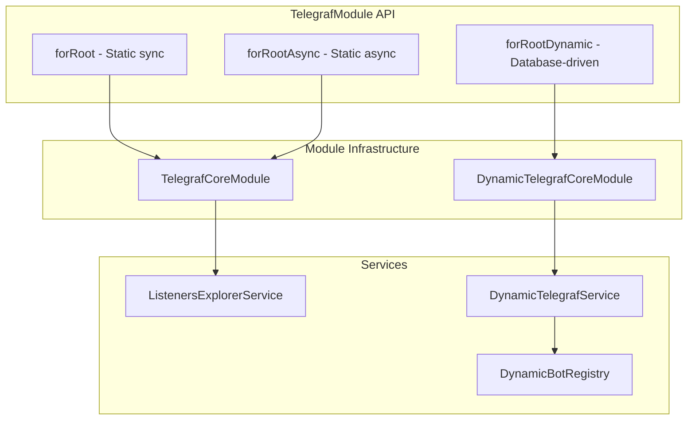
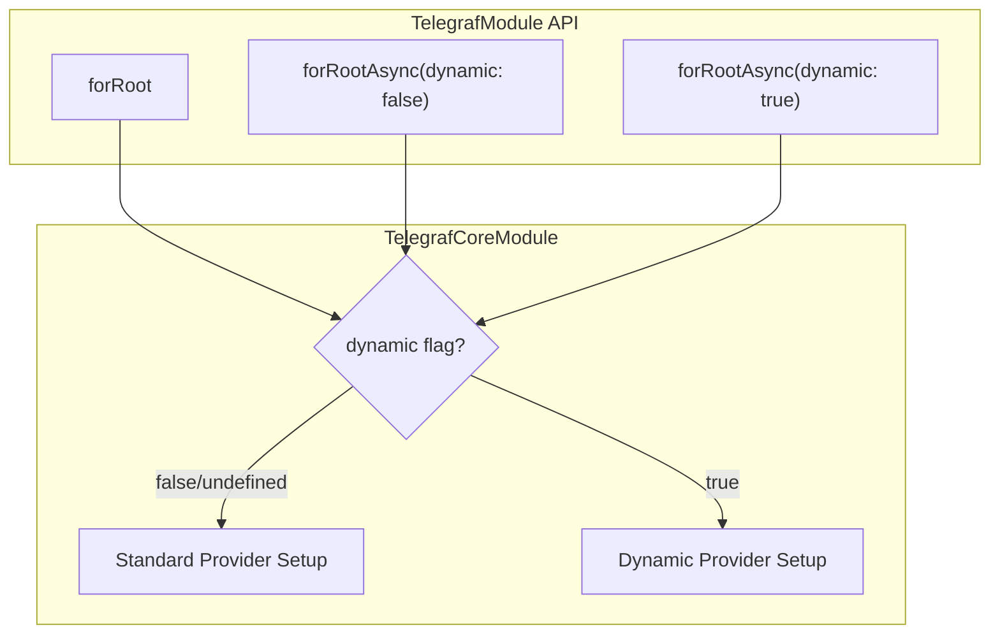
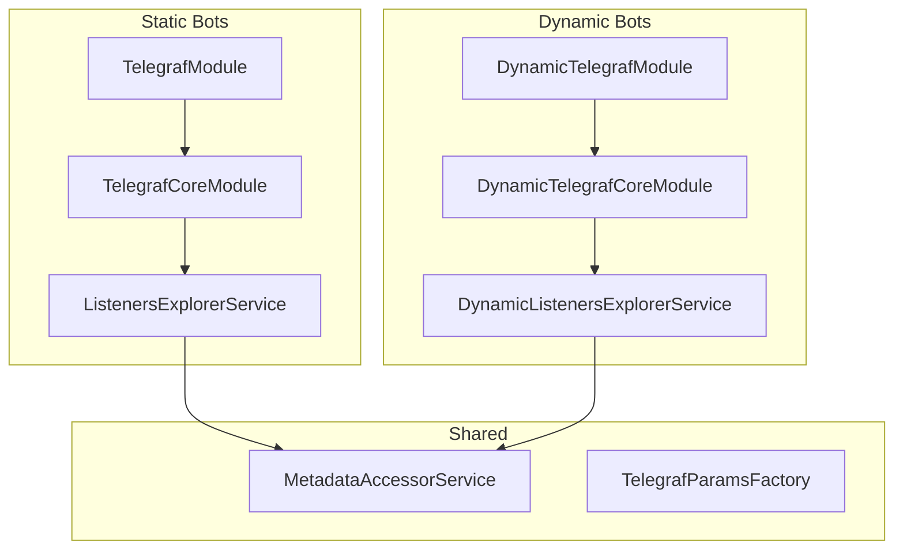
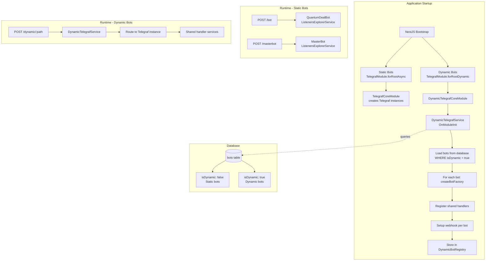
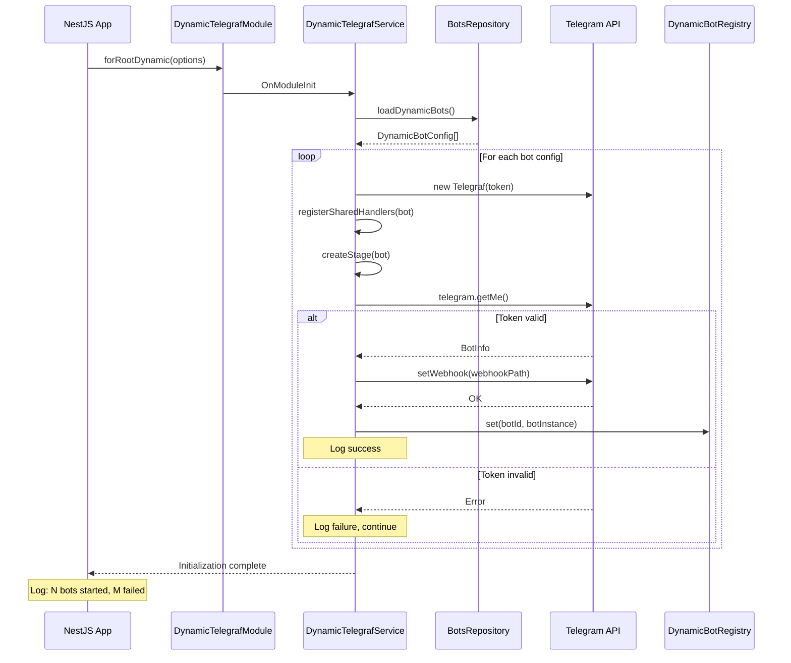

# ADR-006: Dynamic Telegraf Module Loading Pattern

## Status

Proposed

## Context

The `@libs/telegraf` NestJS module currently uses static configuration through `forRoot()` and `forRootAsync()` methods to register Telegram bots. As documented in ADR-004 (Multi-Bot Architecture) and the PRD v1.3.0, the platform needs to support dynamic bot loading from database to enable adding new branded bots without code changes.

### Current Implementation

The existing `@libs/telegraf` module provides:

```typescript
// TelegrafModule - current API
TelegrafModule.forRoot(options: TelegrafModuleOptions): DynamicModule
TelegrafModule.forRootAsync(options: TelegrafModuleAsyncOptions): DynamicModule
```

Each `forRootAsync()` call creates:
- A Telegraf bot instance with unique `botName`
- A shared `Scenes.Stage` instance for scene management
- Handler registration via `ListenersExplorerService` scanning `include` modules
- Automatic shutdown handling via `OnApplicationShutdown`

### Problem Statement

Adding new bots currently requires:
1. Adding environment variable for new bot token
2. Creating a dedicated NestJS module for bot handlers
3. Adding `TelegrafModule.forRootAsync()` registration in `AppModule`
4. Restarting the application

**User Requirement**: Add new bots by simply inserting a database record + application restart, WITHOUT code changes.

### Three-Tier Bot Architecture

The platform supports three distinct bot tiers:

| Tier | Bot Type | Configuration | Handler Approach | Stage/Scene |
|------|----------|---------------|------------------|-------------|
| 1 | Master Bot | Environment + Code | nest-telegraf decorators | Shared Stage |
| 2 | Static Bot | Environment + Code | nest-telegraf decorators | Shared Stage |
| 3 | Dynamic Bot | Database | Programmatic registration | Per-bot Stage |

### Technical Constraints

- **Framework**: NestJS 11.x, Telegraf 4.x, `@libs/telegraf` (forked nest-telegraf)
- **Loading Mode**: Application startup only (no hot-reload for MVP)
- **Backward Compatibility**: Existing `forRoot()`/`forRootAsync()` must continue working
- **Handler Scope**: Hybrid (shared handlers by default, per-bot override capability)
- **Stage Management**: Per-bot Stage instances to prevent conversation state conflicts

### Related Documents

- PRD: `docs/prd/multi-bot-architecture-prd.md` (v1.3.0)
- ADR-004: `docs/adr/ADR-004-multi-bot-architecture.md` - Multi-bot database architecture
- ADR-005: `docs/adr/ADR-005-telegram-bot-framework.md` - Framework selection (Telegraf + nest-telegraf)

## Decision

**Selected Option: Option A - `forRootDynamic()` Method**

Add a new `forRootDynamic()` static method to `TelegrafModule` that accepts a repository/service for loading bot configurations from database at application startup.

### Decision Summary

```typescript
// New API alongside existing methods
TelegrafModule.forRootDynamic(options: TelegrafDynamicModuleOptions): DynamicModule
```

This approach maintains clean separation of concerns while maximizing code reuse with existing module infrastructure.

## Options Considered

### Option A (Selected): `forRootDynamic()` Method

**Overview**: Add new `forRootDynamic()` static method to `TelegrafModule` that creates a `DynamicTelegrafService` for managing database-driven bots.

**Architecture**:



**Pros**:
- **Clear API separation**: New method explicitly indicates dynamic loading purpose
- **Minimal impact on existing code**: `forRoot`/`forRootAsync` remain unchanged
- **NestJS pattern compliance**: Follows `forRoot`/`forRootAsync`/`forFeature` convention
- **Single module ownership**: All bot configuration flows through `TelegrafModule`
- **Shared infrastructure**: Can reuse existing `createBotFactory`, `MetadataAccessorService`, etc.
- **Future extensibility**: Easy to add `forRootDynamicAsync` if needed
- **Testing isolation**: Dynamic bots can be tested independently

**Cons**:
- **Multiple entry points**: Three static methods to maintain
- **Interface expansion**: New options interface required (`TelegrafDynamicModuleOptions`)
- **Service coupling**: `DynamicTelegrafService` needs access to database layer

**Effort**: 5-7 days

**Implementation Pattern**:

```typescript
// libs/telegraf/src/interfaces/telegraf-dynamic-options.interface.ts
interface TelegrafDynamicModuleOptions {
  /**
   * Service for loading bot configurations from database
   * Must implement BotConfigurationProvider interface
   */
  botConfigProvider: Type<BotConfigurationProvider>;

  /**
   * Modules providing bot configuration provider dependencies
   */
  imports?: ModuleMetadata['imports'];

  /**
   * Modules containing shared handlers for dynamic bots
   */
  sharedHandlerModules: Function[];

  /**
   * Global middlewares applied to all dynamic bots
   */
  globalMiddlewares?: ReadonlyArray<Middleware<any>>;

  /**
   * Webhook domain for dynamic bots
   */
  webhookDomain: string;

  /**
   * Optional: Factory for creating bot-specific middlewares
   */
  middlewareFactory?: (botConfig: DynamicBotConfig) => Middleware<any>[];
}

interface BotConfigurationProvider {
  /**
   * Load all active dynamic bot configurations
   */
  loadDynamicBots(): Promise<DynamicBotConfig[]>;
}

interface DynamicBotConfig {
  id: string;
  token: string;
  name: string;
  webhookPath: string;
  settings?: BotSettings;
}
```

```typescript
// libs/telegraf/src/telegraf.module.ts - Extended
@Module({})
export class TelegrafModule {
  // ... existing forRoot, forRootAsync ...

  public static forRootDynamic(
    options: TelegrafDynamicModuleOptions,
  ): DynamicModule {
    return {
      module: TelegrafModule,
      imports: [DynamicTelegrafCoreModule.forRoot(options)],
      exports: [DynamicTelegrafCoreModule],
    };
  }
}
```

---

### Option B: Extend `forRootAsync()` with Dynamic Flag

**Overview**: Add optional `dynamic: true` flag to existing `TelegrafModuleAsyncOptions` to enable database-driven loading within the existing async configuration pattern.

**Architecture**:



**Pros**:
- **Single async entry point**: All async configuration through one method
- **Familiar API**: Developers already know `forRootAsync` pattern
- **Less code surface**: No new static method to maintain
- **Gradual adoption**: Add `dynamic: true` to convert existing async registration

**Cons**:
- **Complex conditional logic**: `TelegrafCoreModule.forRootAsync` becomes complex with branching
- **Interface pollution**: `TelegrafModuleAsyncOptions` grows with dynamic-specific properties
- **Unclear intent**: `dynamic: true` less explicit than separate method name
- **Testing complexity**: Same method handles two distinct behaviors
- **Breaking change risk**: Modifying existing interface could affect current usage
- **Documentation confusion**: Single method with conditional behavior harder to document

**Effort**: 4-6 days

**Implementation Pattern**:

```typescript
// Extended options interface
interface TelegrafModuleAsyncOptions extends Pick<ModuleMetadata, 'imports'> {
  botName?: string;
  useExisting?: Type<TelegrafOptionsFactory>;
  useClass?: Type<TelegrafOptionsFactory>;
  useFactory?: (...args: any[]) => Promise<TelegrafModuleOptions> | TelegrafModuleOptions;
  inject?: any[];

  // NEW: Dynamic loading options
  dynamic?: boolean;
  botConfigProvider?: Type<BotConfigurationProvider>;
  sharedHandlerModules?: Function[];
  webhookDomain?: string;
}
```

```typescript
// TelegrafCoreModule - Modified
public static forRootAsync(options: TelegrafModuleAsyncOptions): DynamicModule {
  if (options.dynamic) {
    return this.createDynamicProviders(options);
  }
  return this.createStaticAsyncProviders(options);
}
```

---

### Option C: Separate `DynamicTelegrafModule`

**Overview**: Create an entirely new module (`DynamicTelegrafModule`) for database-driven bots, completely separate from `TelegrafModule`.

**Architecture**:



**Pros**:
- **Complete separation**: Static and dynamic concerns never mix
- **Independent evolution**: Modules can evolve separately
- **Clear responsibility**: Each module has single purpose
- **No breaking changes**: `TelegrafModule` remains untouched
- **Simpler testing**: Each module tested in isolation

**Cons**:
- **Code duplication**: Many utilities need to be duplicated or shared via third module
- **Two module APIs**: Developers must learn two different modules
- **Import complexity**: Applications need to import both modules
- **Inconsistent patterns**: Different API styles for same domain
- **Maintenance burden**: Two separate codebases to maintain
- **Coordination overhead**: Changes affecting both require dual updates

**Effort**: 8-10 days

**Implementation Pattern**:

```typescript
// libs/telegraf/src/dynamic-telegraf.module.ts - New module
@Module({})
export class DynamicTelegrafModule {
  public static forRoot(options: DynamicTelegrafOptions): DynamicModule {
    return {
      module: DynamicTelegrafModule,
      imports: [DynamicTelegrafCoreModule.forRoot(options)],
      exports: [DynamicTelegrafCoreModule],
    };
  }

  public static forRootAsync(options: DynamicTelegrafAsyncOptions): DynamicModule {
    return {
      module: DynamicTelegrafModule,
      imports: [DynamicTelegrafCoreModule.forRootAsync(options)],
      exports: [DynamicTelegrafCoreModule],
    };
  }
}
```

```typescript
// Application usage - requires importing both modules
@Module({
  imports: [
    // Static bots
    TelegrafModule.forRootAsync({ botName: 'QuantumDealBot', ... }),
    TelegrafModule.forRootAsync({ botName: 'QuantumDealMasterBot', ... }),

    // Dynamic bots - separate module
    DynamicTelegrafModule.forRoot({
      botConfigProvider: BotsRepository,
      sharedHandlerModules: [SharedHandlersModule],
      webhookDomain: process.env.WEBHOOK_DOMAIN,
    }),
  ],
})
export class AppModule {}
```

---

## Comparison Matrix

| Evaluation Axis | Weight | Option A: forRootDynamic | Option B: Extended forRootAsync | Option C: Separate Module |
|-----------------|--------|--------------------------|--------------------------------|---------------------------|
| **NestJS Pattern Compliance** | HIGH | Excellent - follows convention | Good - extends existing | Good - separate concern |
| **Code Maintainability** | HIGH | High - clear separation | Medium - conditional logic | Low - duplication risk |
| **API Clarity** | HIGH | Excellent - explicit purpose | Medium - flag-based | Good - but two APIs |
| **Implementation Effort** | HIGH | 5-7 days | 4-6 days | 8-10 days |
| **Breaking Change Risk** | MEDIUM | None | Low | None |
| **Testing Complexity** | MEDIUM | Low | Medium | Low (but more to test) |
| **Future Extensibility** | MEDIUM | High | Medium | High |
| **Documentation Clarity** | MEDIUM | High | Medium | Medium |
| **Code Reuse** | LOW | High | High | Medium |
| **Weighted Score** | | **9/10** | **6/10** | **5/10** |

## Rationale

### Why `forRootDynamic()` (Option A)

1. **NestJS Convention Alignment**: The `forRoot`/`forRootAsync`/`forFeature` pattern is well-established in NestJS ecosystem. Adding `forRootDynamic` follows this convention and clearly communicates its database-driven nature. Similar patterns exist in `@nestjs/typeorm`, `@nestjs/mongoose`, and other official packages.

2. **Clean Separation Without Duplication**: Option A achieves separation of concerns (static vs dynamic bots) without the code duplication of Option C. The new method creates a new core module (`DynamicTelegrafCoreModule`) while sharing utilities like `MetadataAccessorService`.

3. **Backward Compatibility Guarantee**: Unlike Option B which modifies existing interface, Option A adds a completely new method. Zero risk of breaking existing `forRoot()`/`forRootAsync()` usage.

4. **API Clarity**: A developer seeing `forRootDynamic()` immediately understands this is for database-driven configuration, versus `forRootAsync({ dynamic: true })` which requires reading documentation.

5. **Single Module Ownership**: Unlike Option C, developers still interact with a single `TelegrafModule` for all bot configurations. This simplifies imports and mental model.

6. **Testability**: The `DynamicTelegrafService` can be easily mocked in tests, and the separation from static bots allows focused integration testing.

### Addressing Option B's Appeal

Option B is attractive for its minimal API surface, but the conditional logic complexity outweighs this benefit:

```typescript
// Option B: Complex conditional in core module
forRootAsync(options) {
  if (options.dynamic) {
    // Completely different provider setup
    // Different lifecycle management
    // Different handler registration
  } else {
    // Existing behavior
  }
}
```

This violates Single Responsibility Principle and creates a maintenance burden.

### Addressing Option C's Appeal

Option C provides cleanest separation but at significant cost:

- **Duplication**: `ListenersExplorerService` logic would need partial duplication for dynamic handler registration
- **Import Complexity**: Applications must import two modules for full functionality
- **API Inconsistency**: Two different modules for same domain creates confusion

## Consequences

### Positive Consequences

- **Database-Driven Bot Addition**: New bots added via `INSERT INTO bots` + restart without code changes
- **Clear API**: Three distinct methods for three distinct use cases
- **Preserved Patterns**: Existing `forRoot()`/`forRootAsync()` continue working unchanged
- **Per-Bot Stage Isolation**: Dynamic bots receive independent Stage instances
- **Shared Handler Support**: Common handlers work across static and dynamic bots
- **Fault Isolation**: Failed dynamic bot doesn't affect static bots or other dynamic bots
- **Graceful Shutdown**: `DynamicTelegrafService` handles webhook deletion on shutdown

### Negative Consequences

- **Restart Required**: No hot-reload capability (acceptable per PRD scope)
- **Two Initialization Paths**: Static bots via `ListenersExplorerService`, dynamic bots via `DynamicTelegrafService`
- **Database Dependency**: `DynamicTelegrafModule` requires database layer initialization first
- **Testing Overhead**: Need tests for both static and dynamic codepaths

### Neutral Consequences

- **New Interfaces**: `TelegrafDynamicModuleOptions`, `BotConfigurationProvider`, `DynamicBotConfig` added
- **New Service**: `DynamicTelegrafService` created
- **New Core Module**: `DynamicTelegrafCoreModule` created
- **New Provider**: `DynamicBotRegistry` (Map-based bot instance storage) created

## Implementation Guidance

### Module Structure Principles

- **Single Entry Point**: All configuration flows through `TelegrafModule` static methods
- **Core Module Separation**: `TelegrafCoreModule` for static, `DynamicTelegrafCoreModule` for dynamic
- **Shared Utilities**: `MetadataAccessorService`, `TelegrafParamsFactory`, `createBotFactory` shared across both

### `DynamicTelegrafService` Principles

- **Implement `OnModuleInit`**: Load and initialize dynamic bots at startup
- **Implement `OnApplicationShutdown`**: Clean up webhooks on graceful shutdown
- **Fault Isolation**: Catch and log errors per bot, continue initializing others
- **Registry Pattern**: Store bot instances in `Map<botId, DynamicBotInstance>`

### Handler Registration Principles

- **Shared Handlers**: Create injectable services (e.g., `SharedStartHandler`) callable from both decorator-based and programmatic registration
- **Per-Bot Context**: Pass `botId` and `botSettings` to shared handlers for bot-specific behavior
- **Feature Flags**: Check `bot_settings.features` before registering optional handlers

### Stage Management Principles

- **Per-Bot Stage**: Each dynamic bot receives its own `Scenes.Stage` instance
- **Scene Registration**: Register scenes per-bot based on configuration
- **Session Isolation**: Conversation state scoped to bot instance

### Webhook Configuration Principles

- **Unique Paths**: Each dynamic bot uses stored `webhookPath` (e.g., `/dynamic/brand1`)
- **Auto-Registration**: `DynamicTelegrafService` calls `setWebhook` at initialization
- **Validation**: Call `telegram.getMe()` to validate token before webhook setup

### Error Handling Principles

- **Graceful Degradation**: Log initialization failures, continue with other bots
- **Token Masking**: Never log bot tokens, use asterisk masking
- **Health Reporting**: Expose initialization success/failure counts

## Architecture Diagram



## Sequence Diagram: Dynamic Bot Initialization



## Related Information

### Prerequisite Documents

- **ADR-004**: `docs/adr/ADR-004-multi-bot-architecture.md` - Multi-bot database architecture (Decision 6: Dynamic Bot Registration)
- **ADR-005**: `docs/adr/ADR-005-telegram-bot-framework.md` - Framework selection (Telegraf.js + nest-telegraf)
- **PRD**: `docs/prd/multi-bot-architecture-prd.md` (v1.3.0) - FR-020 to FR-054

### Files to Create

- `libs/telegraf/src/dynamic-telegraf-core.module.ts` - Core module for dynamic bot loading
- `libs/telegraf/src/services/dynamic-telegraf.service.ts` - Bot lifecycle management
- `libs/telegraf/src/services/dynamic-bot-registry.ts` - Bot instance storage
- `libs/telegraf/src/interfaces/telegraf-dynamic-options.interface.ts` - Options interfaces

### Files to Modify

- `libs/telegraf/src/telegraf.module.ts` - Add `forRootDynamic()` method
- `libs/telegraf/src/index.ts` - Export new interfaces and services

### External References

- [NestJS Dynamic Modules Documentation](https://docs.nestjs.com/fundamentals/dynamic-modules)
- [NestJS Dynamic Modules Guide 2024](https://nooptoday.com/dynamic-modules-in-nestjs/)
- [nestjs-telegraf Multiple Bots Documentation](https://nestjs-telegraf.0x467.com/extras/multiple-bots)
- [Telegraf Multiple Bots Discussion](https://github.com/telegraf/telegraf/issues/197)
- [NestJS Dynamic Module Loading with Lazy DI](https://blog.poespas.me/posts/2025/03/01/nestjs-dynamic-module-loading-lazy-loaded-di/)
- [Dynamic Database Connections in NestJS](https://jnesis.com/en/blog/dynamic-databases-connections-with-nestjs/)

---

## Decision Record

| Attribute | Value |
|-----------|-------|
| **Decision Date** | 2025-11-27 |
| **Decision Status** | Proposed |
| **Implementation Status** | Not Started |
| **PRD Version** | 1.3.0 |
| **Supersedes** | None (new capability) |
| **Related ADRs** | ADR-004 (Decision 6), ADR-005 |

---

## Change History

| Version | Date | Author | Changes |
|---------|------|--------|---------|
| 1.0.0 | 2025-11-27 | Claude Code Architecture Agent | Initial version - Decision for `forRootDynamic()` pattern |

---

**Document Version**: 1.0.0
**Created**: 2025-11-27
**Last Updated**: 2025-11-27
**Author**: Claude Code Architecture Agent
