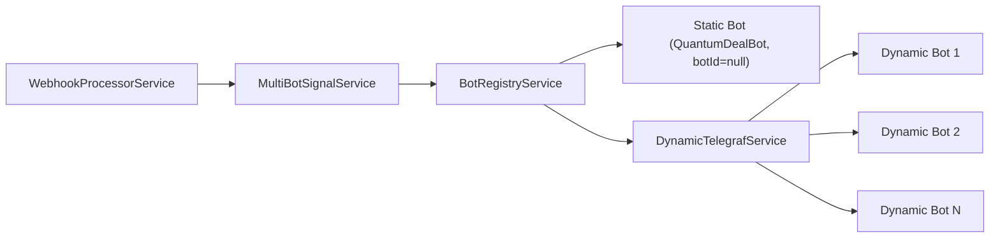
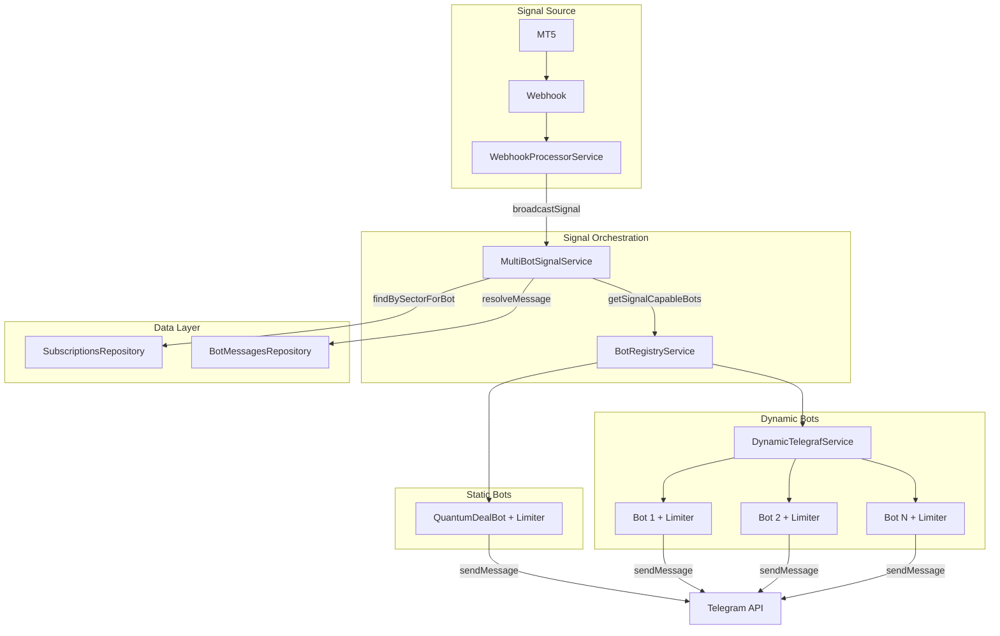

# ADR-007: Multi-Bot Signal Broadcasting Architecture

## Status

Accepted

## Context

The Quantum Deal platform currently operates a signal broadcasting system designed for a single-bot architecture. With the multi-bot infrastructure now in place (per ADR-004, ADR-006), trading signals from the MT5 source need to be distributed to users across ALL active bots simultaneously, not just a single bot.

### Current State (Single-Bot)

- `NotificationService` is injected with a single bot instance (`@InjectBot('QuantumDealBot')`)
- `NotificationService` uses a single `Bottleneck` instance for rate limiting (28 msg/sec)
- `WebhookProcessorService` sends signals through this single bot
- `SubscriptionsRepository.findBySector()` returns users without botId grouping
- No orchestration layer exists for multi-bot signal routing

### Problem Statement

The business model requires distributing a single MT5 signal source to multiple branded Telegram bots serving different broker partnerships. Users may be subscribed to multiple bots and should receive signals from EACH bot they are subscribed to (no cross-bot deduplication).

### Technical Constraints

- **Tech Stack**: NestJS, Telegraf, Bottleneck (rate limiting), PostgreSQL, Drizzle ORM
- **Performance Requirement**: Signal delivery within 5 seconds of MT5 event (per project context)
- **Telegram API Limits**: 30 messages/second per bot token
- **Existing Infrastructure**:
  - `DynamicTelegrafService` already manages multiple bot instances
  - `BotMessagesRepository.resolveMessage()` already supports bot-specific templates
  - `user_subscriptions.botId` already exists for per-bot subscription scoping

### Related Documents

- **PRD**: `docs/prd/signal-broadcasting-prd.md`
- **ADR-004**: `docs/adr/ADR-004-multi-bot-architecture.md` - Multi-bot database architecture
- **ADR-006**: `docs/adr/ADR-006-dynamic-telegraf-module-loading.md` - Dynamic bot loading pattern

---

## Decision

This ADR documents four architectural decisions for multi-bot signal broadcasting:

1. [Rate Limiting](#decision-1-rate-limiting-approach) - Per-Bot Bottleneck Instances
2. [Signal Routing](#decision-2-signal-routing-architecture) - MultiBotSignalService Orchestrator
3. [Data Flow](#decision-3-data-flow-changes) - Per-Bot User Filtering
4. [Bot Access](#decision-4-unified-bot-access-interface) - BotRegistryService

---

## Decision 1: Rate Limiting Approach

### Per-Bot Bottleneck Instances (Attached to DynamicBotInstance)

Attach a dedicated `Bottleneck` instance to each `DynamicBotInstance`. Each bot manages its own rate-limited message queue independently.

```typescript
interface DynamicBotInstance {
  botId: number;
  name: string;
  bot: Telegraf<Context>;
  stage: Scenes.Stage<Scenes.SceneContext>;
  webhookPath: string;
  settings: BotSettings | null;
  username: string;
  limiter: Bottleneck; // Per-bot rate limiter
}
```

**Rationale**:
- Natural extension of `DynamicBotInstance` pattern
- Each bot respects its own Telegram API limit (30 msg/sec)
- Fault isolation - one bot's rate limits don't block others
- Clean lifecycle management - limiter destroyed with bot instance

---

## Decision 2: Signal Routing Architecture

### MultiBotSignalService (Orchestrator Pattern)

Create a new `MultiBotSignalService` that receives signal events from `WebhookProcessorService` and orchestrates parallel distribution to all active bots.



**Interface**:

```typescript
interface MultiBotSignalService {
  broadcastSignal(
    order: OrderWithSettings,
    eventType: Mt5EventType,
    sector: string,
  ): Promise<BroadcastResult>;

  getEligibleBots(): Promise<SignalCapableBot[]>;
}
```

**Rationale**:
- Single Responsibility - `WebhookProcessorService` remains focused on event validation
- Testable - orchestration logic isolated in dedicated service
- Clear data flow: Signal → Orchestrator → Per-Bot Delivery
- Parallel by design - all bots process independently

---

## Decision 3: Data Flow Changes

### Per-Bot User Filtering with findBySectorForBot

Extend `SubscriptionsRepository` with bot-scoped query methods.

### Complete Data Flow

```
1. Signal Event arrives (sector: 'crypto', order data)
   │
   ▼
2. MultiBotSignalService.broadcastSignal(order, sector)
   │
   ▼
3. BotRegistryService.getSignalCapableBots()
   │ Returns: [Bot1(botId=null), Bot2(botId=5), Bot3(botId=7), ...]
   │          (null = static QuantumDealBot, positive integers = dynamic bots)
   │
   ▼
4. FOR EACH bot IN parallel (Promise.all):
   │
   ├─▶ 4a. SubscriptionsRepository.findBySectorForBot(sector, bot.botId)
   │       │
   │       │ ┌─────────────────────────────────────────────────────────────┐
   │       │ │ KEY FILTERING STEP: User Filtering by Bot                  │
   │       │ │                                                             │
   │       │ │ Query filters:                                              │
   │       │ │   - user_subscriptions.botId = bot.botId (or IS NULL)       │
   │       │ │   - user_subscriptions.isActive = true                      │
   │       │ │   - user_subscriptions.expiresAt > NOW()                    │
   │       │ │   - subscription.sector includes this sector                │
   │       │ │                                                             │
   │       │ │ Returns: ONLY users subscribed to THIS specific bot         │
   │       │ └─────────────────────────────────────────────────────────────┘
   │       ▼
   │
   ├─▶ 4b. BotMessagesRepository.resolveMessage(bot.botId, 'signal_report', userLang)
   │       │ Returns: Bot-specific message template (or default fallback)
   │       ▼
   │
   └─▶ 4c. NotificationService.sendToUsers(bot.instance, bot.limiter, users, message)
           │ Rate limited by per-bot Bottleneck (28 msg/sec per bot)
           ▼

5. Aggregate results from all bots
   │
   ▼
6. Return BroadcastResult with per-bot stats
```

### New Repository Method

```typescript
/**
 * Find subscriptions for a specific bot and sector.
 * @param sector - Signal sector (e.g., 'crypto', 'forex')
 * @param botId - Database bot ID (null for static bot QuantumDealBot)
 */
findBySectorForBot(
  sector: string,
  botId: number | null,
): Promise<SubscriptionWithFeatures[]>;
```

### Updated Interface

```typescript
interface SubscriptionWithFeatures {
  // Existing fields...
  subscriptionId: number;
  userId: number;
  userTelegramId: string;
  userFirstName: string;
  userLastName: string | null;
  userLang: string | null;
  hasCustomFiltering: boolean;
  userSubscriptionIsActive: boolean;
  userSubscriptionExpiresAt: Date | null;

  // NEW - for multi-bot support
  botId: number | null;  // null for static bot (QuantumDealBot)
}
```

**Rationale**:
- Per-bot queries ensure each bot only sends to its own subscribers
- `botId: null` for static bot matches `user_subscriptions.botId IS NULL` in database
- Backward compatible - existing methods remain unchanged

---

## Decision 4: Unified Bot Access Interface

### BotRegistryService (Facade Pattern)

Create `BotRegistryService` that aggregates both static and dynamic bots behind a unified interface.

```typescript
interface SignalCapableBot {
  botId: number | null;  // null for static QuantumDealBot
  name: string;
  instance: Telegraf;
  limiter: Bottleneck;
  type: 'static' | 'dynamic';
  settings?: BotSettings;
}

interface BotRegistry {
  getSignalCapableBots(): Promise<SignalCapableBot[]>;
  getBot(botId: number | null): SignalCapableBot | undefined;
  hasBot(botId: number | null): boolean;
}
```

**Implementation**:

```typescript
@Injectable()
export class BotRegistryService implements BotRegistry {
  constructor(
    @InjectBot('QuantumDealBot')
    private readonly staticBot: Telegraf,
    private readonly dynamicTelegrafService: DynamicTelegrafService,
  ) {
    this.staticBotLimiter = new Bottleneck({...});
  }

  async getSignalCapableBots(): Promise<SignalCapableBot[]> {
    const bots: SignalCapableBot[] = [];

    // Static bot (if signals enabled)
    if (this.isStaticBotSignalEnabled()) {
      bots.push({
        botId: null,
        name: 'QuantumDealBot',
        instance: this.staticBot,
        limiter: this.staticBotLimiter,
        type: 'static',
      });
    }

    // Dynamic bots
    const dynamicBots = this.dynamicTelegrafService.getAllBots();
    for (const [botId, instance] of dynamicBots) {
      if (instance.settings?.features.signalsEnabled) {
        bots.push({
          botId,
          name: instance.name,
          instance: instance.bot,
          limiter: instance.limiter,
          type: 'dynamic',
        });
      }
    }

    return bots;
  }
}
```

**Rationale**:
- Single point of access for `MultiBotSignalService`
- Abstracts static vs dynamic bot differences
- Easy to add new bot types in future
- Testable - mock single interface

---

## Consequences

### Positive

- Multi-bot signal distribution to ALL active bots
- Per-bot rate limiting respecting Telegram API limits
- Fault isolation between bots
- Bot-specific branding via message templates
- Users subscribed to multiple bots receive from EACH bot
- Clean architecture with testable components

### Negative

- Increased complexity (2 new services)
- Memory overhead (minimal - Bottleneck is lightweight)
- Per-bot database queries (mitigated by indexes)

---

## Implementation Guidance

### BotRegistry Principles

- **Static Bot Selection**: Only `QuantumDealBot` included (uses `botId=null`)
  - `QuantumDealMasterBot` is **excluded** (admin-only, no signal capability)
- **Signal Eligibility**: Only bots with `settings.features.signalsEnabled === true`

### Rate Limiting Principles

- Create limiter during bot initialization
- Configuration: 28 msg/sec per bot (reservoir pattern)
- Graceful shutdown: `limiter.stop()` when bot stops

### Per-Bot User Query Principles

- Always use `findBySectorForBot(sector, botId)` in multi-bot context
- `botId = null` → `user_subscriptions.botId IS NULL` (static bot)
- `botId = N` → `user_subscriptions.botId = N` (dynamic bot)

### Signal Routing Principles

- Use `Promise.all()` for parallel delivery
- Fail-open per bot: one bot's failure doesn't block others
- Aggregate results: N success, M failed, errors per bot

---

## Architecture Diagram



---

## Files to Create

- `libs/bot/src/services/multi-bot-signal.service.ts`
- `libs/bot/src/services/bot-registry.service.ts`
- `libs/bot/src/interfaces/bot-registry.interface.ts`
- `libs/bot/src/interfaces/multi-bot-signal.interface.ts`

## Files to Modify

- `libs/telegraf/src/interfaces/dynamic-telegraf-options.interface.ts` - Add `limiter`
- `libs/telegraf/src/services/dynamic-telegraf.service.ts` - Initialize Bottleneck
- `libs/db/src/repositories/subscriptions.repository.ts` - Add `findBySectorForBot`
- `libs/bot/src/services/notification.service.ts` - Bot-parameterized methods
- `libs/bot/src/services/webhook.service.ts` - Route to `MultiBotSignalService`

---

## Decision Record

| Attribute | Value |
|-----------|-------|
| **Decision Date** | 2025-12-01 |
| **Status** | Proposed |
| **Related ADRs** | ADR-004, ADR-006 |

---

**Document Version**: 1.3.0
**Last Updated**: 2025-12-01
