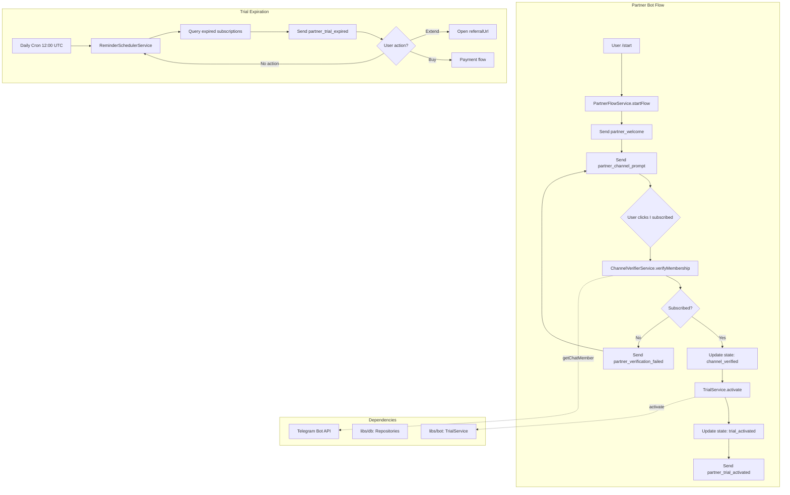

# ADR-008: Partner Bot Flow Architecture

## Status

Proposed

## Context

The Quantum Deal platform operates a multi-bot architecture (ADR-004, ADR-006) serving different broker partners for lead generation. While the main bot offers direct trial activation, **partner bots** require a specialized user journey that gates trial access behind channel subscription verification. This creates a value exchange: users must join partner Telegram channels before accessing premium features, enabling partners to build qualified trading audiences.

### Business Requirements

**Problem**: Partners need measurable lead generation through Telegram channel subscriptions, but standard bot flow doesn't verify user commitment before trial activation.

**Solution**: Implement a partner-specific flow that:
1. Requires users to subscribe to partner channels before trial activation
2. Verifies channel membership via Telegram Bot API
3. Provides trial extension mechanism through partner referral programs
4. Sends persistent reminders for expired trials until user action

### Technical Context

**Scale**: Large feature (12-15 files, libs/partner-bot library)

**Integration Points**:
- Multi-bot database architecture (ADR-004)
- Telegraf.js framework (ADR-005)
- Dynamic bot loading (ADR-006)
- Existing TrialService (`libs/bot`)
- Bot messages infrastructure (`bot_messages` table)
- Bot settings storage (`bot_settings` JSONB)

**Constraints**:
- No database schema changes (JSONB extension only)
- Reuse existing TrialService without modification
- Support 8 languages (ru, en, uk, hi, fr, kk, uz, tg)
- Must integrate with multi-bot webhook architecture

### Related Documents

- **PRD**: `docs/prd/partner-bot-flow-prd.md` (v1.1.0, Approved)
- **ADR-004**: Multi-Bot Database Architecture
- **ADR-005**: Telegram Bot Framework Selection (Telegraf.js)
- **ADR-006**: Dynamic Telegraf Module Loading

## Decisions

This ADR documents six key architecture decisions for partner bot flow:

1. [Channel Verification Approach](#decision-1-channel-verification-approach)
2. [Message Variable Interpolation Strategy](#decision-2-message-variable-interpolation-strategy)
3. [Type System Architecture](#decision-3-type-system-architecture)
4. [State Management for Verification Flow](#decision-4-state-management-for-verification-flow)
5. [Trial Expiration Reminder Mechanism](#decision-5-trial-expiration-reminder-mechanism)
6. [Integration Pattern with Existing TrialService](#decision-6-integration-pattern-with-existing-trialservice)

---

## Decision 1: Channel Verification Approach

### Selected Option: User-Initiated Verification with API Check (Option A)

Implement user-initiated verification where users click "I subscribed" button, then bot verifies via Telegram `getChatMember` API.

### Options Considered

#### Option A (Selected): User-Initiated Verification with API Check

**Overview**: User subscribes to channel at their own pace, then clicks button to trigger bot verification via `telegram.getChatMember(channelId, userId)`.

**Pros**:
- **User control**: Users subscribe at their own pace, no pressure
- **Simple state management**: Only track `awaiting_channel_subscription` -> `channel_verified`
- **Reliable verification**: Direct API call confirms actual membership
- **No polling overhead**: Verification only happens on button click
- **Retry-friendly**: Users can resubscribe and retry verification immediately
- **Bot admin not required**: `getChatMember` works for public channels and private channels where bot is member
- **Telegram API best practice**: Documented verification method in Telegram Bot API

**Cons**:
- **User friction**: Extra step (clicking button) after subscribing
- **API dependency**: Verification fails if Telegram API is unavailable
- **Channel leave undetected**: Users can leave channel after verification (out of scope for MVP)
- **Rate limit potential**: Users spamming verify button (mitigated with per-user rate limit)

**Effort**: 3 days

---

#### Option B: Auto-Polling Verification

**Overview**: Bot periodically polls Telegram API to check if user has joined channel after initial prompt.

**Pros**:
- No manual button click required
- Seamless user experience

**Cons**:
- **Polling overhead**: Continuous API calls for all pending users
- **Complex state tracking**: Must track when to stop polling per user
- **Delayed verification**: User waits for next poll cycle (15-30 seconds)
- **Rate limit risk**: High API call volume with many pending users
- **Resource waste**: Polling users who may never subscribe

**Effort**: 5 days

---

#### Option C: Webhook-Based Detection

**Overview**: Subscribe to Telegram chat member updates webhook to detect channel joins in real-time.

**Pros**:
- Real-time verification
- No polling or button click

**Cons**:
- **Bot admin required**: Webhook `chat_member` updates only sent if bot is channel admin
- **Complex webhook setup**: Additional webhook endpoint and routing
- **Partner coordination**: Each partner must add bot as channel admin
- **Operational burden**: Bot admin permissions management per channel
- **Not always possible**: Partners may refuse to grant bot admin access

**Effort**: 6 days

---

### Comparison Matrix

| Evaluation Axis | Option A (Selected) | Option B | Option C |
|-----------------|---------------------|----------|----------|
| User Experience | Good (one extra click) | Excellent (no action) | Excellent (no action) |
| Implementation Complexity | Low | Medium | High |
| API Call Volume | Low (on-demand) | High (polling) | Low (webhook) |
| Partner Requirements | None | None | Bot admin access |
| Verification Latency | Immediate | 15-30 seconds | Immediate |
| Scalability | High | Low | High |
| Operational Complexity | Low | Medium | High |

### Rationale

**Option A** is selected for the following reasons:

1. **Lowest Operational Complexity**: No polling overhead, no webhook management, no partner coordination for bot admin access.

2. **Scalability**: Verification only happens on user action (button click), not continuously for all users. Handles thousands of users without polling overhead.

3. **Telegram API Best Practice**: The `getChatMember` API method is the documented approach for membership verification per Telegram Bot API documentation.

4. **Partner Independence**: Partners don't need to grant bot admin access to their channels. Works with public channels immediately.

5. **User Control**: Users can verify multiple times if initial verification fails, retry immediately after subscribing.

6. **Reliability**: Direct API call provides accurate membership status at verification moment. No race conditions with polling delays.

---

## Decision 2: Message Variable Interpolation Strategy

### Selected Option: Simple String.replace() (Option A)

Use JavaScript's native `String.prototype.replace()` for variable substitution in message templates.

### Options Considered

#### Option A (Selected): Simple String.replace()

**Overview**: Chain `.replace()` calls for each variable in message templates with format `{variableName}`.

**Pros**:
- **Zero dependencies**: No template engine library required
- **Obvious implementation**: Straightforward string replacement logic
- **Low complexity**: 3-5 lines of code per message
- **Easy debugging**: Can log before/after string values
- **No learning curve**: Standard JavaScript method
- **Sufficient for scope**: Only 2-3 variables per message

**Cons**:
- Multiple replace calls for multiple variables
- No nested object path support (not needed)
- Manual escaping if curly braces appear in text

**Effort**: 0.5 days

---

#### Option B: Template Engine (Handlebars/Mustache)

**Overview**: Use established template engine like Handlebars or Mustache for message interpolation.

**Pros**:
- Handles complex expressions
- Built-in HTML escaping
- Nested object paths
- Conditional rendering

**Cons**:
- **Over-engineering**: Only need simple variable substitution
- **New dependency**: Adds library to bundle
- **Learning curve**: Team must learn template syntax
- **Performance overhead**: Template compilation step
- **Complexity mismatch**: Simple need, complex solution

**Effort**: 2 days (integration + testing)

---

#### Option C: Dedicated MessageInterpolationService

**Overview**: Create service class with methods for different interpolation patterns.

**Pros**:
- Centralized logic
- Testable in isolation
- Extensible for future patterns

**Cons**:
- **Premature abstraction**: YAGNI violation
- **Extra indirection**: Service -> method -> replace
- **Maintenance burden**: More code to maintain
- **No real benefit**: Simple replace doesn't need service wrapper

**Effort**: 1 day

---

### Comparison Matrix

| Evaluation Axis | Option A (Selected) | Option B | Option C |
|-----------------|---------------------|----------|----------|
| Implementation Simplicity | High | Low | Medium |
| Dependency Count | 0 | +1 library | 0 |
| Performance | Excellent | Good | Excellent |
| Maintainability | High | Medium | Medium |
| Sufficiency for Need | Perfect | Overkill | Overkill |

### Rationale

**Option A** is selected because:

1. **YAGNI Principle**: Current requirement is 2-3 variables per message (e.g., `{channelUrl}`, `{channelName}`, `{expiryDate}`). Simple string replacement is sufficient.

2. **Zero Dependencies**: No additional library adds to bundle size or dependency risk.

3. **Obvious Implementation**: Any developer can understand chained `.replace()` calls without documentation.

4. **Easy to Upgrade**: If complex templating becomes necessary later, migration path is clear (replace implementation, keep interface).

5. **Performance**: Native string operations are faster than template engine compilation.

---

## Decision 3: Type System Architecture

### Selected Option: Partner-Specific Types in libs/partner-bot (Option A)

Define partner-specific TypeScript types in `libs/partner-bot/src/types/partner-settings.ts`, NOT in `libs/db`.

### Options Considered

#### Option A (Selected): Partner-Specific Types in libs/partner-bot

**Overview**: Database library (`libs/db`) remains generic with JSONB columns. Partner-bot library defines typed interfaces for JSONB content.

**Pros**:
- **Separation of concerns**: Database layer stays generic, domain logic in domain library
- **Reusable db library**: `libs/db` can be used for non-partner bots without partner types
- **Type safety at usage point**: Cast JSONB to typed interface where needed
- **Domain-driven design**: Types live with the domain logic that uses them
- **No database coupling**: Partner-specific types don't pollute generic database schema
- **Easy to extend**: New bot types add their own type files without modifying `libs/db`

**Cons**:
- Type casting required at usage point (`settings as PartnerBotSettings`)
- No compile-time validation of JSONB content in database
- Duplicate type definitions if multiple libraries use same JSONB structure

**Effort**: 2 days

---

#### Option B: Shared Types in libs/db

**Overview**: Define all bot settings types in `libs/db/src/types/bot-settings.ts` as union type.

**Pros**:
- Single source of truth for types
- Type checking at database layer
- No type casting at usage point

**Cons**:
- **Tight coupling**: Database library depends on all bot type knowledge
- **Violates separation of concerns**: Generic infrastructure knows domain details
- **Breaks modularity**: Adding new bot type requires modifying `libs/db`
- **Circular dependency risk**: Domain libraries reference db types, db types reference domain concepts

**Effort**: 3 days

---

#### Option C: Runtime Validation with Zod

**Overview**: Use Zod schemas for runtime validation of JSONB content.

**Pros**:
- Runtime type safety
- Validation errors at parse time
- Schema-driven documentation

**Cons**:
- **Over-engineering**: JSONB content controlled by migrations, no user input
- **Performance overhead**: Parsing on every read
- **New dependency**: Adds Zod library
- **Complexity increase**: Schema definitions + types

**Effort**: 4 days

---

### Comparison Matrix

| Evaluation Axis | Option A (Selected) | Option B | Option C |
|-----------------|---------------------|----------|----------|
| Separation of Concerns | Excellent | Poor | Good |
| Type Safety | Good (cast) | Excellent | Excellent |
| Modularity | High | Low | Medium |
| Implementation Complexity | Low | Medium | High |
| Database Library Reusability | High | Low | Medium |

### Rationale

**Option A** is selected because:

1. **Separation of Concerns**: Database library (`libs/db`) is infrastructure. Partner-specific types are domain knowledge. Domain types belong in domain library.

2. **Modularity**: Future bot types (e.g., `enterprise-bot`, `affiliate-bot`) can define their own settings types without modifying `libs/db`.

3. **Reusability**: `libs/db` remains a generic database library, reusable across any bot type.

4. **TypeScript Pattern**: This is the standard pattern for JSONB/JSON fields in TypeScript ORMs (Drizzle, Prisma). The database stores untyped JSON; application code casts to domain types.

5. **Follows Existing Pattern**: ADR-003 (User Settings JSONB Storage) established this pattern. Consistency reduces cognitive load.

---

## Decision 4: State Management for Verification Flow

### Selected Option: bot_users.state JSONB Field (Option A)

Use existing `bot_users.state` JSONB column to track user progress through verification flow.

### Options Considered

#### Option A (Selected): bot_users.state JSONB Field

**Overview**: Store verification flow state in `bot_users.state` JSONB column with state values like `awaiting_channel_subscription`, `channel_verified`, `trial_activated`.

**Pros**:
- **Reuses existing field**: No schema changes required
- **Flexible structure**: JSONB allows adding fields without migration
- **Per-bot isolation**: State is scoped to bot via `bot_users(user_id, bot_id)`
- **Query support**: PostgreSQL JSONB operators enable state-based queries
- **Consistent pattern**: Follows existing state management approach
- **Easy debugging**: Can inspect state in database directly

**Cons**:
- No database-level state validation
- JSONB queries slightly more complex than column queries
- Must handle null state on first user interaction

**Effort**: 1 day

---

#### Option B: Dedicated partner_verifications Table

**Overview**: Create new table to track verification attempts and state.

**Cons**:
- **Schema change**: Violates constraint (no schema changes)
- **Over-normalization**: Only tracking transient state, not persistent data
- **Extra JOIN**: Queries require joining bot_users + partner_verifications
- **Maintenance burden**: Another table to maintain

**Effort**: 3 days

---

### Rationale

**Option A** is selected because:

1. **No Schema Changes**: Satisfies project constraint (JSONB extension only).
2. **Existing Pattern**: Reuses established state management pattern.
3. **Sufficient Flexibility**: JSONB structure handles all required state tracking.
4. **Simple Implementation**: No new tables, no migrations, no complex JOINs.

---

## Decision 5: Trial Expiration Reminder Mechanism

### Selected Option: Daily Indefinite Reminders (Option A)

Send daily reminders indefinitely after trial expiration until user takes action.

### Options Considered

#### Option A (Selected): Daily Indefinite Reminders

**Overview**: Scheduled job runs daily at 12:00 UTC, queries expired trials, sends reminder messages with "Extend Free Period" and "Buy Subscription" buttons.

**Pros**:
- **High conversion potential**: Persistent reminders increase action rate
- **User re-engagement**: Brings users back who forgot about trial expiration
- **Simple logic**: Single daily job, no complex scheduling
- **Partner value**: Partners benefit from continued user touchpoints
- **No manual intervention**: Automated indefinitely

**Cons**:
- **Spam risk**: Daily messages may annoy users who don't want to act
- **Bot block risk**: Persistent reminders may lead to bot blocks
- **Resource usage**: Must query all expired trials daily

**Effort**: 2 days

---

#### Option B: Limited Reminder Count (e.g., 7 days)

**Overview**: Send reminders for only N days after expiration, then stop.

**Pros**:
- Reduces spam perception
- Limited resource usage

**Cons**:
- **Lower conversion**: Users who need more time don't get reminders
- **Complex logic**: Must track reminder count per user
- **Arbitrary limit**: Why 7 days? No business justification
- **Missed opportunities**: User may convert on day 10 but reminders stopped on day 7

**Effort**: 3 days

---

### Comparison Matrix

| Evaluation Axis | Option A (Selected) | Option B |
|-----------------|---------------------|----------|
| Conversion Potential | High | Medium |
| User Annoyance Risk | Medium | Low |
| Implementation Complexity | Low | Medium |
| Partner Value | High | Medium |
| Resource Usage | Constant | Decreasing |

### Rationale

**Option A** is selected because:

1. **Maximize Conversion**: Indefinite reminders maximize chances of user re-engagement and action.
2. **Partner Value**: Partners benefit from sustained user touchpoints leading to referral conversions or purchases.
3. **Simple Implementation**: No reminder count tracking, just check if reminder sent today.
4. **User Control**: Users who find reminders annoying will block bot (their choice). Users who appreciate reminders continue to receive value.

**Mitigation for Spam Risk**: Include message text emphasizing value ("Your free trial is waiting" vs "Act now or lose access").

---

## Decision 6: Integration Pattern with Existing TrialService

### Selected Option: Wrapper Pattern (Option A)

Partner-bot wraps existing `TrialService.activate()` with channel verification prerequisite, no modification to TrialService.

### Options Considered

#### Option A (Selected): Wrapper Pattern

**Overview**: Partner-bot creates `PartnerFlowService` that calls `TrialService.activate()` after successful channel verification.

**Pros**:
- **DRY principle**: Reuses existing trial activation logic
- **Zero duplication**: No code copied from TrialService
- **Separation of concerns**: Partner flow adds verification, delegates activation
- **Easy testing**: Can mock TrialService in partner-bot tests
- **No breaking changes**: TrialService remains unchanged
- **Clear responsibility**: PartnerFlowService = verification + delegation

**Cons**:
- Extra layer of indirection (minimal cost)
- Dependency on TrialService interface stability

**Effort**: 1 day

---

#### Option B: Duplicate Trial Logic in Partner-Bot

**Overview**: Copy trial activation code from TrialService to PartnerFlowService.

**Cons**:
- **Violates DRY**: Same code in two places
- **Maintenance burden**: Bug fixes need updates in both places
- **Divergence risk**: Code versions drift over time
- **Testing duplication**: Same tests needed in both libraries

**Effort**: 2 days

---

#### Option C: Modify TrialService to Support Partner Flow

**Overview**: Add channel verification to TrialService directly.

**Cons**:
- **Violates Single Responsibility**: TrialService should only handle trial lifecycle
- **Breaks modularity**: Core trial service depends on partner-specific logic
- **Standard bot impact**: Standard bots don't need channel verification

**Effort**: 2 days

---

### Rationale

**Option A** is selected because:

1. **DRY Principle**: Reusing existing `TrialService.activate()` avoids code duplication.
2. **Single Responsibility**: TrialService handles trial lifecycle. PartnerFlowService handles partner flow (verification + trial).
3. **Testability**: Partner-bot tests can mock TrialService, focusing tests on verification logic.
4. **Clean Architecture**: Outer layer (partner-bot) depends on inner layer (bot), not vice versa.

---

## Implementation Reference

> **Implementation Playbook**: See [ADR-COMMON-partner-flow](./ADR-COMMON-partner-flow.md) for detailed implementation patterns:
>
> - **Pattern 1**: State Machine Design (state types, transitions, storage)
> - **Pattern 2**: Channel Verification Flow (`getChatMember` API usage, error handling)
> - **Pattern 3**: Rate Limiting (per-user limits, Telegram API limits)
> - **Pattern 4**: Retry Logic with Exponential Backoff
> - **Pattern 5**: Race Condition Prevention (idempotency, callback query handling)
> - **Pattern 6**: State Inconsistency Recovery (rollback on failure)
> - **Pattern 7**: Channel ID vs Username Resolution
> - **Pattern 8**: Referral URL Validation
> - **Pattern 9**: Log Masking for Privacy
> - **Pattern 10**: Attempt Tracking

---

## Consequences

### Positive Consequences

- **Database-Driven Configuration**: Partner settings stored in `bot_settings.partner` JSONB field, no code changes per partner
- **Reusable Infrastructure**: Leverages existing multi-bot architecture (ADR-004, ADR-006)
- **Minimal Dependencies**: Only adds partner-specific logic, reuses TrialService, BotMessagesRepository
- **Type Safety**: Partner settings typed in domain library without polluting database layer
- **User Control**: User-initiated verification gives users control over pace
- **Scalable Verification**: On-demand API calls scale better than polling
- **Simple Message Interpolation**: Zero-dependency string replacement sufficient for 2-3 variables per message
- **Clean Separation**: Partner-bot library is self-contained, no modifications to `libs/bot` or `libs/db`
- **Telegram API Best Practice**: Uses documented `getChatMember` verification method
- **High Conversion Potential**: Daily indefinite reminders maximize user re-engagement

### Negative Consequences

- **User Friction**: Extra button click after channel subscription (acceptable trade-off for verification reliability)
- **API Dependency**: Verification fails if Telegram API unavailable (mitigated with retry logic)
- **Type Casting Required**: JSONB content cast to typed interface at usage point (standard TypeScript pattern)
- **Spam Risk**: Daily reminders may annoy some users (mitigated by user control to block bot)
- **Channel Leave Undetected**: Users can leave channel after verification (out of scope for MVP, future enhancement)

### Neutral Consequences

- **New Library**: `libs/partner-bot` added to monorepo
- **New Message Types**: 6 new message types x 8 languages = 48 bot_messages entries
- **Scheduled Job**: Daily cron job for expiration reminders
- **JSONB Extension**: `bot_settings.partner` field populated for partner bots

---

## Architecture Diagram

> **Detailed Implementation**: See [ADR-COMMON-partner-flow](./ADR-COMMON-partner-flow.md) for state transition diagrams, error handling flows, and service interaction patterns.

---

## Related Information

### Prerequisite Documents

- **PRD**: `docs/prd/partner-bot-flow-prd.md` (v1.1.0, Approved)
- **ADR-004**: Multi-Bot Database Architecture
- **ADR-005**: Telegram Bot Framework Selection (Telegraf.js)
- **ADR-006**: Dynamic Telegraf Module Loading
- **ADR-003**: User Settings JSONB Storage (pattern reference)

### Related ADRs

- **[ADR-COMMON-partner-flow](./ADR-COMMON-partner-flow.md)**: Implementation playbook with patterns and anti-patterns
- **ADR-COMMON-multi-bot-context**: Multi-bot context patterns (botId handling)

### External References

**Telegram Bot API Documentation**:
- [getChatMember API Method](https://core.telegram.org/bots/api#getchatmember) - Official documentation for channel membership verification
- [Telegram Bot API Changelog](https://core.telegram.org/bots/api-changelog) - Latest API updates
- [Checking Channel/Group Subscriptions](https://docs.botmother.com/article/46900) - Best practices guide

**Key Findings from Research**:
1. **Bot Admin Requirement**: `getChatMember` is only guaranteed to work if bot is administrator in the channel (per Stack Overflow discussion)
2. **Error Handling**: `USER_ID_INVALID` error can occur if bot hasn't "seen" the user before through interactions
3. **Rate Limiting**: Telegram doesn't publish rate limits for `getChatMember`, but caching admin lists is recommended best practice

### Files to Create

**Partner-Bot Library**:
- `libs/partner-bot/src/partner-bot.module.ts` - NestJS module definition
- `libs/partner-bot/src/types/partner-settings.ts` - Partner-specific TypeScript types
- `libs/partner-bot/src/services/partner-flow.service.ts` - Orchestrates partner bot flow
- `libs/partner-bot/src/services/channel-verifier.service.ts` - Telegram API verification logic
- `libs/partner-bot/src/services/reminder-scheduler.service.ts` - Daily expiration reminders
- `libs/partner-bot/src/actions/channel-verification.action.ts` - "I subscribed" button handler
- `libs/partner-bot/src/actions/trial-ui.action.ts` - "Extend Free Period" / "Buy Subscription" handlers
- `libs/partner-bot/src/commands/start/start.update.ts` - Partner bot /start handler
- `libs/partner-bot/README.md` - Library documentation

**Tests**:
- `libs/partner-bot/test/services/partner-flow.service.spec.ts`
- `libs/partner-bot/test/services/channel-verifier.service.spec.ts`
- `libs/partner-bot/test/services/reminder-scheduler.service.spec.ts`

**SQL Migrations**:
- `libs/db/migrations/YYYYMMDD_partner_bot_messages.sql` - 48 INSERT statements (6 types x 8 languages)

### No Files to Modify

**Zero Modifications Required**:
- `libs/bot` - TrialService reused without changes
- `libs/db` - No schema changes, JSONB extension only
- Existing bot handlers remain unchanged

---

## Decision Record

| Attribute | Value |
|-----------|-------|
| **Decision Date** | 2025-12-02 |
| **Decision Status** | Proposed |
| **Implementation Status** | Not Started |
| **PRD Version** | 1.1.0 (Approved) |
| **Estimated Effort** | 12-15 days (12-15 files) |
| **Reviewed By** | Pending Architecture Review |

---

## Change History

| Version | Date | Author | Changes |
|---------|------|--------|---------|
| 1.0.0 | 2025-12-02 | Claude Code Architecture Agent | Initial version - Six architecture decisions for partner bot flow |
| 1.0.1 | 2025-12-04 | Claude Code | Fixed Decision 6: TrialService.activate() signature corrected to use botUserId (bot_users.id) instead of userId (telegramId) |
| 1.1.0 | 2025-12-11 | Claude Code Architecture Agent | Refactored to reference ADR-COMMON-partner-flow for implementation details. Removed code examples, added Implementation Reference section |

---

**Document Version**: 1.1.0
**Created**: 2025-12-02
**Last Updated**: 2025-12-11
**Author**: Claude Code Architecture Agent

---

## Sources

Research for this ADR included the following sources:

- [Telegram Bot API - getChatMember](https://core.telegram.org/bots/api) - Official API documentation
- [Telegram Bot API Changelog](https://core.telegram.org/bots/api-changelog) - Latest API updates and changes
- [Checking Channel/Group Subscriptions on Telegram](https://docs.botmother.com/article/46900) - Implementation best practices
- [Can Telegram bot detect new member joining channel event? - Stack Overflow](https://stackoverflow.com/questions/59214620/can-telegram-bot-detect-a-new-member-joining-a-channel-event) - Discussion on channel member detection
- [Telegram Bot API: getChatMember throws USER_ID_INVALID - Stack Overflow](https://stackoverflow.com/questions/49934454/telegram-bot-api-getchatmember-throws-user-id-invalid-for-valid-user) - Common error handling patterns
