# ADR-010: Promocode Discount System Architecture

## Status

Proposed

## Context

The Quantum Deal platform requires a promotional discount system to support marketing campaigns, user acquisition, and win-back strategies. Users pay for subscription renewals via Telegram Stars, and the platform needs mechanisms to reduce these costs through:

1. **Manual promocodes**: User-entered codes for marketing campaigns
2. **System discounts**: Automatic discounts based on configurable rules (e.g., N days after subscription expiration)

### Background

The system serves multiple Telegram bots (ADR-004 multi-bot architecture), each potentially having bot-specific or global promocodes. The payment flow is already established (ADR-COMMON-telegram-stars-payment) with the seven-state payment machine, and subscriptions are tracked per bot-user context (ADR-009).

### Technical Context

- **Database**: PostgreSQL with Drizzle ORM
- **Existing Tables**: `bot_users`, `subscriptions`, `user_subscriptions`, `payment_transactions`, `renewal_tariffs`, `managers`, `bots`
- **Payment Currency**: Telegram Stars (integer, minimum 1 Star)
- **Multi-bot Support**: `bot_users.id` is the per-bot user identity

### Business Requirements

From PRD `docs/prd/promocodes-prd.md`:
- Single-use promocodes (global deactivation after first use)
- Multi-use promocodes (one use per user, unlimited total users)
- System promocodes (automatic assignment via scheduler)
- Percentage and fixed-amount discounts
- Maximum discount selection (not additive)
- Permanent discounts for system-assigned discounts
- Manager isolation (managers see only their own promocodes)
- Bot-specific and global promocodes

### Constraints

- Telegram Stars are integers; fractional amounts not allowed
- Minimum price floor of 1 Star after discount
- Single active discount per user per subscription (no stacking)
- System discounts once assigned are permanent
- Pre-checkout validation must complete within 10 seconds
- Signals subscription only for MVP scope

### Related Documents

- **PRD**: `docs/prd/promocodes-prd.md`
- **ADR-004**: Multi-Bot Database Architecture
- **ADR-009**: User Subscriptions Migration (defines `bot_users` FK pattern)
- **ADR-COMMON-telegram-stars-payment**: Payment state machine

---

## Decisions

This ADR documents five key architectural decisions:

1. [Discount Storage Strategy](#decision-1-discount-storage-strategy)
2. [Discount Calculation Strategy](#decision-2-discount-calculation-strategy)
3. [Promocode Validation Approach](#decision-3-promocode-validation-approach)
4. [System Rules Processing Strategy](#decision-4-system-rules-processing-strategy)
5. [Multi-Bot Promocode Scoping](#decision-5-multi-bot-promocode-scoping)

---

## Decision 1: Discount Storage Strategy

### Selected Option: Dedicated user_discounts Table (Option B)

Create a separate `user_discounts` table to store active user discounts, rather than extending `bot_users` or embedding in `user_subscriptions`.

### Options Considered

#### Option A: Extend bot_users Table

**Overview**: Add discount columns directly to the existing `bot_users` table.

**Schema Extension**:
```typescript
// bot_users table extension
discountType: varchar('discount_type', { length: 20 }), // 'percentage' | 'fixed' | null
discountValue: integer('discount_value'),
discountSourceType: varchar('discount_source_type', { length: 20 }), // 'promocode' | 'system_rule'
discountSourceId: bigint('discount_source_id', { mode: 'number' }),
discountCreatedAt: timestamp('discount_created_at'),
```

**Pros**:
- Simpler queries (no joins needed)
- Single table to read for user context
- Fewer tables to maintain

**Cons**:
- **Violates SRP**: `bot_users` becomes responsible for both user context and discount state
- **Single subscription assumption**: Cannot support future multi-subscription discounts per user
- **Schema coupling**: Discount changes require `bot_users` migration
- **Nullable columns**: Most users won't have discounts, leading to sparse data
- **Audit limitations**: No clean way to track discount history

**Effort**: 2 days

---

#### Option B (Selected): Dedicated user_discounts Table

**Overview**: Create a new `user_discounts` table with foreign keys to `bot_users` and `subscriptions`.

**Schema**:
```typescript
export const userDiscounts = pgTable('user_discounts', {
  id: bigint('id', { mode: 'number' }).primaryKey().generatedAlwaysAsIdentity(),

  // FK to bot-specific user context
  botUserId: bigint('bot_user_id', { mode: 'number' })
    .notNull()
    .references(() => botUsers.id, { onDelete: 'cascade' }),

  // FK to subscription type (signals for MVP)
  subscriptionId: bigint('subscription_id', { mode: 'number' })
    .notNull()
    .references(() => subscriptions.id, { onDelete: 'cascade' }),

  // Discount details (denormalized for audit)
  discountType: varchar('discount_type', { length: 20 }).notNull(), // 'percentage' | 'fixed'
  discountValue: integer('discount_value').notNull(),

  // Source tracking
  sourceType: varchar('source_type', { length: 20 }).notNull(), // 'promocode' | 'system_rule'
  sourceId: bigint('source_id', { mode: 'number' }).notNull(),

  createdAt: timestamp('created_at', { withTimezone: true }).defaultNow().notNull(),
}, (table) => [
  // One discount per user per subscription
  unique('uq_user_discounts_bot_user_subscription').on(table.botUserId, table.subscriptionId),
  index('idx_user_discounts_bot_user').on(table.botUserId),
]);
```

**Pros**:
- **Follows SRP**: Separate table for separate responsibility
- **Multi-subscription ready**: Can support different discounts per subscription type
- **Clean audit trail**: Complete history with timestamps
- **Flexible extension**: Can add columns without affecting `bot_users`
- **Index optimization**: Can index specifically for discount queries
- **Consistent with project patterns**: Follows ADR-009 pattern of dedicated tables

**Cons**:
- Additional join required for payment queries
- One more table to maintain
- Slightly more complex queries

**Effort**: 3 days

---

#### Option C: Embed in user_subscriptions

**Overview**: Add discount columns to `user_subscriptions` since discounts apply to subscription renewals.

**Pros**:
- Logically connected to subscription
- No additional tables

**Cons**:
- **Incorrect scope**: Discount is user-level, not subscription-instance-level
- **Duplication**: Would need to copy discount to each new subscription record
- **Cleanup complexity**: Would need to migrate discounts when subscription expires
- **Violates normalization**: Same discount duplicated across multiple subscription records

**Effort**: 2 days

---

### Comparison Matrix

| Evaluation Axis | Option A (bot_users) | Option B (user_discounts) | Option C (user_subscriptions) |
|-----------------|---------------------|--------------------------|-------------------------------|
| SRP Compliance | Low | High | Low |
| Future Flexibility | Low | High | Medium |
| Query Simplicity | High | Medium | High |
| Data Normalization | Medium | High | Low |
| Audit Capability | Low | High | Medium |
| Migration Risk | Medium | Low | High |
| Project Pattern Consistency | Low | High | Medium |

### Rationale

**Option B** is selected for the following reasons:

1. **Single Responsibility Principle**: Discounts are a distinct domain concept separate from user context. Following ADR-009's pattern of dedicated tables for distinct concerns.

2. **Multi-Subscription Support**: PRD mentions "signals subscription only for MVP". Separate table allows future expansion to different subscription types with independent discounts.

3. **Audit Requirements**: Payment systems require complete audit trails. Dedicated table provides clean tracking of when discounts were assigned and from what source.

4. **Consistent Architecture**: Follows established project pattern of separate tables (`user_subscriptions`, `payment_transactions`) rather than embedding in existing tables.

5. **Industry Best Practice**: E-commerce discount systems typically use separate discount/coupon tables for flexibility and tracking ([GeeksforGeeks - Design Coupon and Voucher Management System](https://www.geeksforgeeks.org/system-design/design-coupon-and-voucher-management-system/)).

---

## Decision 2: Discount Calculation Strategy

### Selected Option: Maximum Discount Selection (Option A)

When multiple discounts could apply (e.g., promocode and system discount), calculate actual Stars saved for each and select the one providing maximum savings.

### Options Considered

#### Option A (Selected): Maximum Discount Selection

**Overview**: For any tariff price, calculate actual Stars saved by each applicable discount, select the highest savings.

**Algorithm**:
```typescript
function selectBestDiscount(
  tariffPriceStars: number,
  availableDiscounts: Discount[],
): Discount | null {
  let bestDiscount: Discount | null = null
  let maxSavings = 0

  for (const discount of availableDiscounts) {
    const savings = calculateSavings(tariffPriceStars, discount)
    if (savings > maxSavings) {
      maxSavings = savings
      bestDiscount = discount
    }
  }

  return bestDiscount
}

function calculateSavings(price: number, discount: Discount): number {
  if (discount.type === 'percentage') {
    return Math.floor(price * discount.value / 100)
  } else {
    return Math.min(discount.value, price - 1) // Floor at 1 Star
  }
}
```

**Pros**:
- **User-friendly**: Always provides best deal to user
- **Simple mental model**: "You get the best discount"
- **Prevents stacking abuse**: No complex stacking rules to exploit
- **Deterministic**: Same inputs always produce same output
- **Fast calculation**: O(n) where n is number of applicable discounts (typically 1-2)

**Cons**:
- May not always use the newest discount (could confuse users)
- Marketing campaigns compete rather than complement

**Effort**: 1 day

---

#### Option B: Discount Stacking (Additive)

**Overview**: Allow multiple discounts to combine additively.

**Example**: 10% promocode + 20 Stars system discount = 10% off, then 20 Stars off.

**Pros**:
- More perceived value
- Marketing campaigns complement each other

**Cons**:
- **High abuse potential**: Users could stack multiple codes
- **Complex pricing**: Hard to predict final price
- **Revenue risk**: Uncapped discounts could exceed product value
- **Calculation complexity**: Order of application matters for percentage + fixed combinations
- **Not PRD compliant**: PRD explicitly states "not additive"

**Effort**: 3 days

---

#### Option C: Priority-Based Selection

**Overview**: Assign priority to discount types, always use highest priority.

**Priority Order**: Promocode > System Discount

**Pros**:
- Predictable behavior
- Marketing campaigns always override automatic discounts

**Cons**:
- **User-unfriendly**: May not give best deal
- **Arbitrary**: Priority assignment is not based on user value
- **Confusing**: User might wonder why their system discount was ignored

**Effort**: 1 day

---

### Comparison Matrix

| Evaluation Axis | Option A (Maximum) | Option B (Stacking) | Option C (Priority) |
|-----------------|-------------------|--------------------|--------------------|
| User Value | Best | Highest (risky) | Variable |
| Abuse Prevention | High | Low | High |
| Simplicity | High | Low | Medium |
| Predictability | High | Low | High |
| PRD Compliance | Yes | No | Partial |
| Revenue Safety | High | Low | High |

### Rationale

**Option A** is selected for the following reasons:

1. **PRD Requirement**: PRD explicitly states "maximum discount when multiple are available (not additive)".

2. **Industry Standard**: Most e-commerce platforms use maximum or best-price selection. Shopify "only allows one product discount per line item" ([Regios Technologies - Shopify Discount Stacking](https://regiostech.com/2025/12/04/shopify-discount-stacking-in-2025-what-actually-works-and-how-to-combine-discounts-properly.html)).

3. **User Trust**: Always giving the best deal builds trust. Shoplazza's system "automatically applies the most favorable combination of discounts for the customer" ([Shoplazza Help Center](https://helpcenter.shoplazza.com/hc/en-us/articles/47060137498137-Discounts-Understanding-Discount-Stacking-and-Calculation-Rules)).

4. **Financial Safety**: Stacking discounts is risky and can lead to revenue loss from abuse.

5. **Calculation Simplicity**: Maximum selection is fast (O(n)) and deterministic, important for the 10-second pre-checkout timeout.

---

## Decision 3: Promocode Validation Approach

### Selected Option: Synchronous Database Validation (Option A)

Validate promocodes synchronously against the database at time of entry and payment.

### Options Considered

#### Option A (Selected): Synchronous Database Validation

**Overview**: Every promocode validation queries the database directly.

**Validation Flow**:
```typescript
async function validatePromocode(
  code: string,
  botUserId: number,
  botId: number | null,
): Promise<ValidationResult> {
  // 1. Find promocode
  const promocode = await promocodeRepo.findByCode(code)
  if (!promocode) return { ok: false, error: 'INVALID_CODE' }

  // 2. Check active status
  if (!promocode.isActive) return { ok: false, error: 'CODE_INACTIVE' }

  // 3. Check bot scope
  if (promocode.botId !== null && promocode.botId !== botId) {
    return { ok: false, error: 'CODE_NOT_VALID_FOR_BOT' }
  }

  // 4. Check validity period
  const now = new Date()
  if (promocode.validFrom && now < promocode.validFrom) {
    return { ok: false, error: 'CODE_NOT_YET_VALID' }
  }
  if (promocode.validUntil && now > promocode.validUntil) {
    return { ok: false, error: 'CODE_EXPIRED' }
  }

  // 5. Check usage limits
  if (promocode.type === 'single_use') {
    const anyActivation = await activationRepo.findAny(promocode.id)
    if (anyActivation) return { ok: false, error: 'CODE_ALREADY_USED' }
  }

  if (promocode.type === 'multi_use') {
    const userActivation = await activationRepo.findByUser(promocode.id, botUserId)
    if (userActivation) return { ok: false, error: 'CODE_ALREADY_USED_BY_YOU' }
  }

  // 6. Check max activations if set
  if (promocode.maxActivations) {
    const count = await activationRepo.countByPromocode(promocode.id)
    if (count >= promocode.maxActivations) {
      return { ok: false, error: 'CODE_LIMIT_REACHED' }
    }
  }

  return { ok: true, promocode }
}
```

**Pros**:
- **Real-time accuracy**: Always reflects current state
- **Simple implementation**: No cache invalidation logic
- **Consistent**: Same validation at entry and payment
- **Concurrency safe**: Database handles race conditions

**Cons**:
- Database query on every validation
- Potentially slower for high traffic

**Performance**: <100ms with proper indexes (PRD requirement)

**Effort**: 2 days

---

#### Option B: Cached Validation with TTL

**Overview**: Cache active promocodes in Redis/memory, validate against cache.

**Pros**:
- Faster validation
- Lower database load

**Cons**:
- **Cache invalidation complexity**: Must invalidate on deactivation, usage limit reached
- **Race conditions**: Cache may show code as valid after exhausted
- **Over-engineering**: Current scale doesn't require caching
- **Additional infrastructure**: Requires Redis or in-memory cache management

**Effort**: 5 days

---

#### Option C: Pre-computed Eligibility

**Overview**: Pre-compute user eligibility for all promocodes at login.

**Pros**:
- Instant validation at UI level
- No database queries during flow

**Cons**:
- **Stale data**: Eligibility computed once, may be outdated
- **Scale issues**: Computing eligibility for all codes per user is expensive
- **Memory overhead**: Storing eligibility per user
- **Still needs server validation**: Cannot trust client-side eligibility

**Effort**: 4 days

---

### Comparison Matrix

| Evaluation Axis | Option A (Synchronous) | Option B (Cached) | Option C (Pre-computed) |
|-----------------|----------------------|------------------|------------------------|
| Accuracy | Highest | Medium | Low |
| Performance | Good (<100ms) | Best (<10ms) | Best (client-side) |
| Implementation Complexity | Low | High | High |
| Concurrency Safety | High | Medium | Low |
| Infrastructure Needs | None | Redis | None |
| Scale Suitability | 10K users | 100K+ users | Not applicable |

### Rationale

**Option A** is selected for the following reasons:

1. **Current Scale**: Single-developer project with modest user base doesn't require caching infrastructure.

2. **PRD Performance Target**: <100ms validation easily achievable with indexed queries.

3. **Accuracy Priority**: For payment systems, real-time accuracy is more important than millisecond latency.

4. **Pre-checkout Constraint**: 10-second timeout is easily met with database validation.

5. **YAGNI Principle**: Caching adds complexity without current need. Can be added later if scale demands.

---

## Decision 4: System Rules Processing Strategy

### Selected Option: Scheduler-Based Daily Processing (Option A)

Process system discount rules via a scheduled job running daily at 00:00 UTC, assigning permanent discounts to eligible users.

### Options Considered

#### Option A (Selected): Scheduler-Based Daily Processing

**Overview**: Cron job runs daily, queries users matching rule criteria, assigns permanent discounts.

**Implementation**:
```typescript
@Injectable()
export class SystemDiscountScheduler {
  @Cron('0 0 * * *') // Daily at 00:00 UTC
  async processSystemDiscountRules(): Promise<void> {
    const rules = await this.rulesRepo.findAllActive()

    for (const rule of rules) {
      const eligibleUsers = await this.findEligibleUsers(rule)

      for (const user of eligibleUsers) {
        // Idempotent: Skip if user already has discount for this subscription
        const existing = await this.discountsRepo.findByUserAndSubscription(
          user.botUserId,
          rule.subscriptionId,
        )
        if (existing) continue

        // Assign permanent discount
        await this.discountsRepo.create({
          botUserId: user.botUserId,
          subscriptionId: rule.subscriptionId,
          discountType: rule.discountType,
          discountValue: rule.discountValue,
          sourceType: 'system_rule',
          sourceId: rule.id,
        })
      }
    }
  }

  private async findEligibleUsers(rule: SystemDiscountRule): Promise<BotUser[]> {
    // Find users with expired subscriptions matching rule criteria
    // rule.triggerType = 'days_after_expiration'
    // rule.triggerValue = N days
    const cutoffDate = new Date()
    cutoffDate.setDate(cutoffDate.getDate() - rule.triggerValue)

    return this.userSubscriptionsRepo.findExpiredBefore(
      rule.subscriptionId,
      rule.botId,
      cutoffDate,
    )
  }
}
```

**Pros**:
- **Predictable execution**: Known time window for processing
- **Batch efficiency**: Process all eligible users in one run
- **Low infrastructure**: Uses existing NestJS scheduler
- **Idempotent**: Safe to re-run; skips users with existing discounts
- **Simple operations**: No complex event handling

**Cons**:
- Up to 24-hour delay for new eligibility
- All processing concentrated at one time

**Effort**: 2 days

---

#### Option B: Event-Driven Processing

**Overview**: Listen for subscription expiration events, process rules immediately.

**Implementation**:
```typescript
@OnEvent('subscription.expired')
async onSubscriptionExpired(event: SubscriptionExpiredEvent): Promise<void> {
  // Schedule delayed rule check
  await this.queueService.addDelayed(
    'check-system-rules',
    { userId: event.botUserId },
    { delay: rule.triggerValue * 24 * 60 * 60 * 1000 }, // N days
  )
}
```

**Pros**:
- Real-time processing
- Distributed load
- User gets discount exactly N days after expiration

**Cons**:
- **Infrastructure overhead**: Requires job queue (Bull/BullMQ)
- **Complexity**: Must handle failed jobs, retries, duplicates
- **Delayed job management**: Jobs scheduled days in future need persistence
- **Over-engineering**: Daily batch sufficient for win-back campaigns
- **Rule change handling**: What happens to queued jobs when rules change?

**Effort**: 5 days

---

#### Option C: Hybrid Approach

**Overview**: Event-driven for time-sensitive rules, scheduler for batch cleanup.

**Pros**:
- Best of both approaches

**Cons**:
- **Most complex**: Two processing paths to maintain
- **Inconsistent behavior**: Some discounts immediate, some delayed
- **No business need**: PRD doesn't require real-time system discounts

**Effort**: 6 days

---

### Comparison Matrix

| Evaluation Axis | Option A (Scheduler) | Option B (Event-Driven) | Option C (Hybrid) |
|-----------------|---------------------|------------------------|-------------------|
| Implementation Complexity | Low | High | Highest |
| Timing Precision | Day-level | Exact | Mixed |
| Infrastructure Needs | None | Job Queue | Job Queue |
| Idempotency | Built-in | Requires logic | Complex |
| Rule Change Handling | Simple | Complex | Complex |
| PRD Fit | Perfect | Over-engineered | Over-engineered |

### Rationale

**Option A** is selected for the following reasons:

1. **PRD Specification**: PRD explicitly states "Scheduler processes rules daily at 00:00 UTC" and "Idempotent processing".

2. **Business Context**: Win-back campaigns don't need minute-level precision. Daily processing is sufficient.

3. **Simplicity**: Scheduler pattern is already used in the project (payment expiration per ADR-COMMON-telegram-stars-payment).

4. **Infrastructure**: No additional queue infrastructure needed.

5. **Idempotency**: Batch processing with existence checks is naturally idempotent.

---

## Decision 5: Multi-Bot Promocode Scoping

### Selected Option: Nullable bot_id with Bot-Specific Precedence (Option A)

Use `bot_id = NULL` for global promocodes and specific `bot_id` for bot-specific codes, with bot-specific taking precedence.

### Options Considered

#### Option A (Selected): Nullable bot_id with Bot-Specific Precedence

**Overview**: Single `promocodes` table with nullable `bot_id`. NULL means global, non-NULL means bot-specific.

**Schema**:
```typescript
export const promocodes = pgTable('promocodes', {
  // ... other columns

  // NULL = global (works across all bots)
  // Non-NULL = bot-specific (works only in that bot)
  botId: bigint('bot_id', { mode: 'number' }).references(() => bots.id, {
    onDelete: 'cascade',
  }),
}, (table) => [
  // Unique code constraint - codes must be unique globally
  unique('uq_promocodes_code').on(table.code),
  index('idx_promocodes_bot_active').on(table.botId, table.isActive),
]);
```

**Validation Logic**:
```typescript
// Code is valid if:
// 1. botId is NULL (global), OR
// 2. botId matches current bot
const isValidForBot = promocode.botId === null || promocode.botId === currentBotId

// Precedence: Bot-specific over global
// If user has both, prefer bot-specific when calculating best discount
```

**Pros**:
- **Simple schema**: Single nullable column
- **Clear semantics**: NULL = everywhere, specific = one bot
- **Flexible validation**: Easy to check scope
- **Consistent with project**: Follows existing patterns (ADR-009 uses nullable `bot_id` in `user_subscriptions`)

**Cons**:
- NULL semantics require careful handling in queries
- Global codes need special index handling

**Effort**: 1 day

---

#### Option B: Separate Global and Bot-Specific Tables

**Overview**: Two tables: `global_promocodes` and `bot_promocodes`.

**Pros**:
- No nullable column ambiguity
- Clear separation

**Cons**:
- **Duplication**: Same columns in two tables
- **Complex queries**: Must union or query both tables
- **Code uniqueness**: Harder to enforce across tables
- **Maintenance burden**: Changes must be applied to both schemas

**Effort**: 3 days

---

#### Option C: Many-to-Many with bot_promocode_scopes

**Overview**: Junction table mapping promocodes to applicable bots.

**Schema**:
```typescript
// promocodes (no bot_id)
// bot_promocode_scopes (promocode_id, bot_id)
// Empty scopes = global
```

**Pros**:
- Most flexible (could scope to multiple specific bots)
- Clean normalization

**Cons**:
- **Over-engineering**: No requirement for multi-bot-specific codes
- **Query complexity**: Additional join for every validation
- **Empty = global**: Non-intuitive semantics

**Effort**: 3 days

---

### Comparison Matrix

| Evaluation Axis | Option A (Nullable bot_id) | Option B (Separate Tables) | Option C (Junction Table) |
|-----------------|---------------------------|---------------------------|--------------------------|
| Schema Simplicity | High | Low | Medium |
| Query Simplicity | High | Low | Low |
| Flexibility | Medium | Low | Highest |
| Project Consistency | High | Low | Medium |
| Uniqueness Enforcement | Easy | Complex | Complex |

### Rationale

**Option A** is selected for the following reasons:

1. **Project Consistency**: Existing tables use nullable `bot_id` for global/specific distinction (`user_subscriptions.bot_id`).

2. **PRD Requirements**: PRD only requires global vs single-bot scoping, not multi-bot.

3. **Query Efficiency**: Single table with nullable column is fast to query with proper indexes.

4. **Code Uniqueness**: Single table makes unique constraint on `code` straightforward.

5. **YAGNI**: Junction table flexibility not needed for current requirements.

---

## Consequences

### Positive Consequences

- **Clean Data Model**: Four new tables with clear responsibilities (`promocodes`, `promocode_activations`, `user_discounts`, `system_discount_rules`)
- **Audit Trail**: Complete tracking of promocode creation, activation, and discount assignment
- **Multi-Bot Ready**: Scoping mechanism supports global and bot-specific promocodes
- **Performance**: Synchronous validation meets <100ms requirement with indexed queries
- **Idempotent Processing**: System discount scheduler safely re-runnable
- **Revenue Protection**: Maximum discount selection prevents stacking abuse
- **Manager Isolation**: `created_by` FK enables per-manager promocode filtering

### Negative Consequences

- **Four New Tables**: Additional schema complexity and migrations
- **Join Overhead**: Payment flow requires joining `user_discounts` for discount lookup
- **Daily Delay**: System discounts assigned at most once per day
- **Single Discount Limitation**: Users cannot have multiple active discounts per subscription

### Failure Scenarios and Mitigation

| Scenario | Impact | Mitigation |
|----------|--------|------------|
| Race condition on single-use activation | Medium | Unique constraint on `(promocode_id, bot_user_id)` + application-level deactivation |
| Scheduler fails to run | Low | Idempotent processing allows catchup on next run |
| Invalid discount applied | High | Validation at entry + pre-checkout + payment |
| Promocode collision | Low | Unique constraint on `code` column |
| Manager sees other's codes | Medium | `created_by` filter in all list queries |

---

## Implementation Guidance

### Database Schema Principles

1. **Use bigint for IDs**: Consistent with existing schema
2. **Timestamp with timezone**: All timestamps use `withTimezone: true`
3. **Indexes on FK columns**: Enable efficient joins
4. **Unique constraints**: Prevent duplicate codes and activations

### New Tables Summary

```sql
-- Table 1: promocodes
CREATE TABLE promocodes (
  id BIGINT PRIMARY KEY GENERATED ALWAYS AS IDENTITY,
  code VARCHAR(50) NOT NULL UNIQUE,
  type VARCHAR(20) NOT NULL, -- 'single_use', 'multi_use', 'system'
  discount_type VARCHAR(20) NOT NULL, -- 'percentage', 'fixed'
  discount_value INTEGER NOT NULL,
  subscription_id BIGINT NOT NULL REFERENCES subscriptions(id),
  bot_id BIGINT REFERENCES bots(id) ON DELETE CASCADE, -- NULL = global
  is_active BOOLEAN NOT NULL DEFAULT true,
  max_activations INTEGER,
  valid_from TIMESTAMP WITH TIME ZONE,
  valid_until TIMESTAMP WITH TIME ZONE,
  created_by BIGINT NOT NULL REFERENCES managers(telegram_id),
  created_at TIMESTAMP WITH TIME ZONE NOT NULL DEFAULT NOW(),
  updated_at TIMESTAMP WITH TIME ZONE NOT NULL DEFAULT NOW(),
  deactivated_at TIMESTAMP WITH TIME ZONE
);

-- Table 2: promocode_activations
CREATE TABLE promocode_activations (
  id BIGINT PRIMARY KEY GENERATED ALWAYS AS IDENTITY,
  promocode_id BIGINT NOT NULL REFERENCES promocodes(id) ON DELETE CASCADE,
  bot_user_id BIGINT NOT NULL REFERENCES bot_users(id) ON DELETE CASCADE,
  activated_at TIMESTAMP WITH TIME ZONE NOT NULL DEFAULT NOW(),
  UNIQUE (promocode_id, bot_user_id)
);

-- Table 3: user_discounts
CREATE TABLE user_discounts (
  id BIGINT PRIMARY KEY GENERATED ALWAYS AS IDENTITY,
  bot_user_id BIGINT NOT NULL REFERENCES bot_users(id) ON DELETE CASCADE,
  subscription_id BIGINT NOT NULL REFERENCES subscriptions(id) ON DELETE CASCADE,
  discount_type VARCHAR(20) NOT NULL,
  discount_value INTEGER NOT NULL,
  source_type VARCHAR(20) NOT NULL, -- 'promocode', 'system_rule'
  source_id BIGINT NOT NULL,
  created_at TIMESTAMP WITH TIME ZONE NOT NULL DEFAULT NOW(),
  UNIQUE (bot_user_id, subscription_id)
);

-- Table 4: system_discount_rules
CREATE TABLE system_discount_rules (
  id BIGINT PRIMARY KEY GENERATED ALWAYS AS IDENTITY,
  name VARCHAR(100) NOT NULL,
  subscription_id BIGINT NOT NULL REFERENCES subscriptions(id) ON DELETE CASCADE,
  bot_id BIGINT REFERENCES bots(id) ON DELETE CASCADE, -- NULL = global
  trigger_type VARCHAR(30) NOT NULL, -- 'days_after_expiration'
  trigger_value INTEGER NOT NULL,
  discount_type VARCHAR(20) NOT NULL,
  discount_value INTEGER NOT NULL,
  is_active BOOLEAN NOT NULL DEFAULT true,
  created_by BIGINT NOT NULL REFERENCES managers(telegram_id),
  created_at TIMESTAMP WITH TIME ZONE NOT NULL DEFAULT NOW(),
  updated_at TIMESTAMP WITH TIME ZONE NOT NULL DEFAULT NOW()
);
```

### Discount Calculation Principles

1. **Floor division for percentages**: `Math.floor(price * percentage / 100)`
2. **Minimum 1 Star**: Final price cannot go below 1 Star
3. **Compare actual savings**: Convert both percentage and fixed to Stars saved
4. **Cache discount during session**: Apply same discount to all tariff displays

### Validation Principles

1. **Validate at entry**: Give immediate feedback to user
2. **Re-validate at pre-checkout**: Ensure still valid before payment
3. **Atomic activation**: Create activation record in transaction with discount assignment
4. **Single-use deactivation**: Mark promocode inactive after activation

### Integration Points

1. **RenewalScene**: Add promocode entry button and validation flow
2. **PaymentService**: Calculate discounted price, store discount reference
3. **Scheduler**: Add daily job for system rules processing
4. **MasterBot**: Add promocode CRUD commands with manager filtering

### Data Flow Diagram

```mermaid
flowchart TB
    subgraph UserFlow["User Promocode Flow"]
        U1[User enters code] --> U2{Validate}
        U2 -->|Invalid| U3[Show error]
        U2 -->|Valid| U4[Calculate discount]
        U4 --> U5[Display discounted prices]
        U5 --> U6[User selects tariff]
        U6 --> U7[Pre-checkout validation]
        U7 --> U8[Payment]
        U8 --> U9[Create activation record]
        U9 --> U10[Create user_discount if permanent]
    end

    subgraph SystemFlow["System Discount Flow"]
        S1[Scheduler: 00:00 UTC] --> S2[Load active rules]
        S2 --> S3[Find eligible users]
        S3 --> S4{User has discount?}
        S4 -->|Yes| S5[Skip]
        S4 -->|No| S6[Create user_discount]
    end

    subgraph PaymentFlow["Payment Calculation"]
        P1[Get tariff price] --> P2[Check user_discount]
        P2 --> P3[Check promocode activation]
        P3 --> P4[Calculate savings for each]
        P4 --> P5[Select maximum]
        P5 --> P6[Apply to price]
        P6 --> P7[Floor to minimum 1 Star]
    end
```



---

## Related Information

### Prerequisite Documents

- **ADR-004**: Multi-Bot Database Architecture (defines `bots` table and multi-bot patterns)
- **ADR-009**: User Subscriptions Migration (defines `bot_users` FK pattern)
- **ADR-COMMON-telegram-stars-payment**: Payment state machine and pre-checkout constraints

### Affected Components

**New Files**:
- `libs/db/src/schema/promocodes.ts`
- `libs/db/src/schema/promocode-activations.ts`
- `libs/db/src/schema/user-discounts.ts`
- `libs/db/src/schema/system-discount-rules.ts`
- `libs/db/src/repositories/promocodes.repository.ts`
- `libs/db/src/repositories/user-discounts.repository.ts`
- `libs/db/src/repositories/system-discount-rules.repository.ts`
- `libs/bot/src/services/promocode.service.ts`
- `libs/bot/src/services/discount-calculation.service.ts`
- `libs/bot/src/services/system-discount-scheduler.service.ts`
- `apps/master-bot/src/commands/promocode/*.ts`

**Modified Files**:
- `libs/bot/src/commands/renew/renewal.scene.ts` (add promocode entry)
- `libs/bot/src/services/payment.service.ts` (apply discount)
- `libs/db/src/schema/index.ts` (export new schemas)

### External References

- [GeeksforGeeks - Design Coupon and Voucher Management System](https://www.geeksforgeeks.org/system-design/design-coupon-and-voucher-management-system/) - Database schema design patterns
- [Regios Technologies - Shopify Discount Stacking](https://regiostech.com/2025/12/04/shopify-discount-stacking-in-2025-what-actually-works-and-how-to-combine-discounts-properly.html) - Discount stacking vs single-discount approaches
- [Shoplazza Help Center - Discount Stacking Rules](https://helpcenter.shoplazza.com/hc/en-us/articles/47060137498137-Discounts-Understanding-Discount-Stacking-and-Calculation-Rules) - Maximum discount selection pattern
- [Medium - Scalable Coupon Management System](https://medium.com/@STYLABSHQ/how-we-developed-scalable-coupon-management-system-in-node-945426b02df1) - Constraint-based validation patterns
- [Omniaretail - E-commerce Discounts](https://www.omniaretail.com/blog/e-commerce-discounts-types-benefits-and-how-to-use-psychology-to-make-them-effective) - Discount psychology and best practices

---

## Decision Record

| Attribute | Value |
|-----------|-------|
| **Decision Date** | 2026-01-14 |
| **Decision Status** | Proposed |
| **Implementation Status** | Not Started |
| **Estimated Effort** | 8-10 days |
| **Reviewed By** | Pending Architecture Review |

---

## Change History

| Version | Date | Author | Changes |
|---------|------|--------|---------|
| 1.0.0 | 2026-01-14 | Claude Code Architecture Agent | Initial version - Five architecture decisions for promocode discount system |

---

**Document Version**: 1.0.0
**Created**: 2026-01-14
**Last Updated**: 2026-01-14
**Author**: Claude Code Architecture Agent
