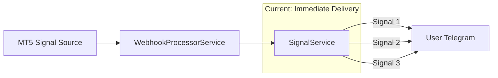
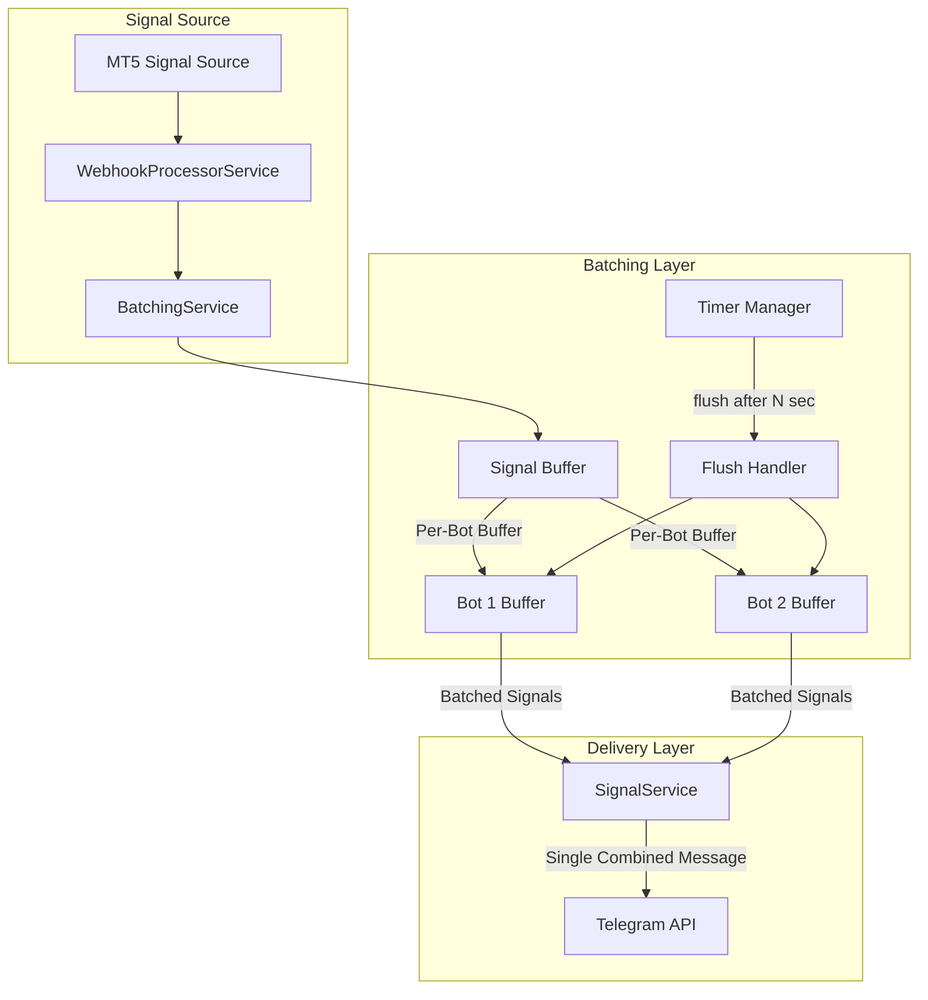

# ADR-011: Signal Batching Architecture

## Status

Accepted

## Context

The Quantum Deal platform currently delivers trading signals to users immediately as they arrive from the MT5 source. While this provides real-time delivery, it can result in a flood of individual notifications when multiple signals arrive in quick succession, leading to:

1. **Poor User Experience**: Users receive multiple sequential notifications that interrupt their workflow
2. **Notification Fatigue**: Frequent separate alerts cause users to mute or ignore signals
3. **Inefficient Delivery**: Multiple API calls and message processing for what could be a single consolidated message

### Current Data Flow



Each signal triggers immediate delivery to all subscribed users, regardless of how quickly signals arrive.

### Business Requirements

Based on user feedback and product decisions:

1. **Trigger Mechanism**: Time-based window (every N seconds)
2. **Grouping Strategy**: Chronological order within the batch
3. **Single Signal Handling**: Always wait for batch window (no immediate send for single signals)
4. **Default Behavior**: Enabled by default (opt-out via user settings)

### Technical Constraints

- **Tech Stack**: NestJS, Telegraf, Bottleneck (rate limiting), PostgreSQL, Drizzle ORM
- **Existing Architecture**: Multi-bot broadcasting per ADR-007, per-bot rate limiting (28 msg/sec)
- **Performance Requirement**: Batch window must not exceed 60 seconds (acceptable latency for trading signals)
- **Memory Bounds**: Node.js process heap limits apply to in-memory buffers
- **Telegram API**: 4096 character message limit per message

### Related Documents

- **ADR-007**: Multi-Bot Signal Broadcasting Architecture
- **ADR-COMMON-signal-broadcasting**: Signal Broadcasting Orchestration Patterns
- **ADR-COMMON-multi-bot-context**: Multi-Bot Context Patterns

---

## Decision

This ADR documents the architectural decision for implementing signal batching:

1. **Buffer Strategy**: In-memory buffer with time-based flush
2. **Timer Strategy**: Per-bot independent timers
3. **Delivery Mode**: Consolidated message with all signals in batch

### Decision Summary

| Decision Area | Selected Approach | Rationale |
|---------------|-------------------|-----------|
| Buffer Location | In-memory Map | Simplicity, performance, acceptable durability |
| Timer Strategy | Per-bot independent timers | Fault isolation, independent scheduling |
| Flush Trigger | Time-based only | User decision: always wait for window |
| Grouping | Chronological order | Simple, predictable, aligns with user expectation |
| Default State | Enabled (opt-out) | User decision: default on |

### Decision Details

| Aspect | Detail |
|--------|--------|
| Why Now? | Current single-message delivery causes notification spam during high-activity periods. Users requested consolidated view. |
| Why This Approach? | In-memory batching is the simplest solution that meets requirements. No external dependencies, minimal latency overhead. |
| Known Unknowns | Optimal batch window duration (configurable, will tune based on user feedback). Memory pressure under extreme signal bursts. |
| Kill Criteria | If memory usage exceeds 100MB per bot, or batch delivery latency exceeds 30 seconds, migrate to Redis-based solution. |

### Proposed Data Flow



---

## Options Considered

### Option A: In-Memory Buffer with Time-Based Flush (Selected)

**Overview**: Store incoming signals in an in-memory Map keyed by bot+user, flush on timer expiration.

**Implementation Concept**:
```typescript
interface SignalBuffer {
  // Map<botId:userId, PendingBatch>
  batches: Map<string, PendingBatch>;
  // Per-bot timers
  timers: Map<number, NodeJS.Timeout>;
}

interface PendingBatch {
  botId: number;
  userId: number;
  signals: BufferedSignal[];
  windowStartTime: number;
}
```

**Pros**:
- Simple implementation using native JavaScript constructs
- Excellent performance (no I/O for buffer operations)
- No additional infrastructure required
- Natural fit with existing NestJS service lifecycle
- Easy to unit test with mock timers

**Cons**:
- Data loss on process crash (signals in buffer lost)
- Memory pressure under extreme load
- Not horizontally scalable (each instance has separate buffer)

**Effort**: 3-5 days

### Option B: Redis-Based Persistent Queue

**Overview**: Use Redis sorted sets for buffering with Redis-based timer management.

**Implementation Concept**:
```typescript
// Store signals in Redis sorted set (score = timestamp)
await redis.zadd(`batch:${botId}:${userId}`, timestamp, signalJson);

// Use Redis EXPIRE or external scheduler for flush
```

**Pros**:
- Persistence across restarts
- Horizontally scalable
- Centralized state management
- Built-in expiration support

**Cons**:
- Additional infrastructure dependency (Redis)
- Network latency for every buffer operation
- Increased operational complexity
- Over-engineering for current scale (~100-500 signals/day)

**Effort**: 5-7 days

### Option C: Database-Based Buffer

**Overview**: Store pending signals in PostgreSQL with scheduled job for flushing.

**Implementation Concept**:
```typescript
// Table: pending_signals
// Columns: id, bot_id, user_id, signal_data, created_at, batch_key

// Scheduled job flushes expired batches
@Cron('*/5 * * * * *') // Every 5 seconds
async flushExpiredBatches() {
  const expired = await this.findExpiredBatches();
  // Process and delete
}
```

**Pros**:
- Full durability and persistence
- Queryable and auditable
- Works with existing infrastructure
- Survives any process failure

**Cons**:
- High I/O overhead (write per signal, read per flush)
- Database load increase
- Polling-based flush introduces latency
- Complex cleanup logic

**Effort**: 7-10 days

### Option D: RxJS Observable-Based Buffering

**Overview**: Use RxJS `bufferTime` operator for reactive signal buffering.

**Implementation Concept**:
```typescript
// Observable-based approach
this.signalStream$ = new Subject<Signal>();

this.signalStream$.pipe(
  groupBy(signal => `${signal.botId}:${signal.userId}`),
  mergeMap(group$ => group$.pipe(
    bufferTime(batchWindowMs),
    filter(batch => batch.length > 0)
  ))
).subscribe(batch => this.flushBatch(batch));
```

**Pros**:
- Elegant reactive programming model
- Built-in operators for windowing and grouping
- Well-tested library
- Clean separation of concerns

**Cons**:
- Adds RxJS dependency (if not already present)
- Steeper learning curve for team
- Harder to debug than imperative code
- Complex backpressure handling

**Effort**: 4-6 days

---

## Comparison Matrix

| Evaluation Axis | Option A: In-Memory | Option B: Redis | Option C: Database | Option D: RxJS |
|-----------------|---------------------|-----------------|--------------------| -------------- |
| **Implementation Effort** | 3-5 days | 5-7 days | 7-10 days | 4-6 days |
| **Operational Complexity** | Low | Medium | Low | Low |
| **Performance** | Excellent | Good | Fair | Good |
| **Durability** | None (process-bound) | High | Highest | None |
| **Scalability** | Single instance | Multi-instance | Multi-instance | Single instance |
| **Infrastructure Cost** | None | Redis instance | None | None |
| **Team Familiarity** | High (native JS) | Medium | High | Low-Medium |
| **Debuggability** | Excellent | Good | Good | Fair |

### Trade-off Analysis

**Durability vs. Complexity**:
- Option A sacrifices durability for simplicity
- For trading signals with batch windows of 10-60 seconds, the risk of data loss is minimal
- Crash recovery scenario: users may miss signals from the current batch only
- Business impact: Low (signals will resume immediately after restart)

**Performance vs. Features**:
- Option A provides the best performance for typical load
- Redis/Database options add latency that may negate batching benefits
- Current signal volume (~100-500/day) does not justify infrastructure overhead

**Scalability Consideration**:
- Current architecture runs single SignalService instance
- If horizontal scaling becomes necessary, migration to Option B is straightforward
- YAGNI principle: Implement simplest solution that meets current requirements

---

## Rationale

### Why In-Memory Buffer (Option A)?

1. **Simplicity**: Native JavaScript constructs (Map, setTimeout) are well-understood by the team
2. **Performance**: Zero network I/O for buffer operations, critical for low-latency signal processing
3. **Alignment with Existing Architecture**: SignalService is already a singleton; buffer state naturally belongs here
4. **Acceptable Risk**: Trading signals are not transactional; missing a batch on rare process crash is acceptable
5. **YAGNI**: Current scale does not justify Redis/database infrastructure overhead

### Why Time-Based Only Flush?

User decision: "Single signals should always wait for batch window, no immediate send."

This simplifies implementation:
- No count-based threshold logic
- Predictable delivery timing
- Consistent user experience regardless of signal volume

### Why Per-Bot Timers?

1. **Fault Isolation**: One bot's timer issue does not affect others
2. **Independent Scheduling**: Different bots could have different batch windows in the future
3. **Consistency with ADR-007**: Per-bot isolation pattern is established

### Why Chronological Ordering?

User decision: "Group signals in chronological order."

Benefits:
- Predictable order matches signal arrival
- Simple to implement (append to array)
- Aligns with user mental model of "what happened when"

---

## Consequences

### Positive Consequences

- **Improved UX**: Users receive consolidated notifications instead of notification spam
- **Reduced API Load**: Fewer Telegram API calls per signal batch
- **Simple Implementation**: No new infrastructure dependencies
- **Maintainable**: Native JavaScript constructs are easy to understand and debug
- **Testable**: Mock timers enable deterministic unit tests

### Negative Consequences

- **Data Loss Risk**: Process crash loses buffered signals (mitigated by short batch windows)
- **Memory Pressure**: Large signal bursts increase memory usage (mitigated by reasonable buffer limits)
- **Single Instance**: Not horizontally scalable without architectural changes

### Neutral Consequences

- **Delivery Latency**: Signals delayed by batch window (accepted trade-off for batching benefit)
- **Message Format Change**: New batched message template required (one-time migration)

---

## Implementation Guidance

### Core Principles

1. **Use dependency injection** for timer abstraction (enables testing)
2. **Implement fail-open pattern** for batching errors (fall back to immediate delivery)
3. **Apply circuit breaker** if memory pressure detected
4. **Log batch statistics** for monitoring and optimization

### Buffer Structure

```typescript
// Conceptual structure (not implementation)
interface BatchingService {
  // Key: `${botId}:${userId}`
  pendingBatches: Map<string, PendingBatch>;

  // Per-bot timer references
  botTimers: Map<number, NodeJS.Timeout>;

  // Configuration
  batchWindowMs: number; // Default: 5000 (5 seconds)
  maxBatchSize: number;  // Safety limit: 10 signals
}
```

### Message Template Requirements

Two new message types are required:
- **`batch_signals`**: Batch header and footer wrapper template
- **`batch_signal_item`**: Per-signal item template within the batch

**`batch_signals` template** (header/footer wrapper):

```
[Batch Header]

Signal 1: {symbol_1} - {order_type_1}
  Open: {open_price_1} | TP: {take_profit_1} | SL: {stop_loss_1}

Signal 2: {symbol_2} - {order_type_2}
  Open: {open_price_2} | TP: {take_profit_2} | SL: {stop_loss_2}

[Batch Footer with timestamp]
```

**`batch_signal_item` template** (per-signal):

```
{index}. {signal_emoji} {event_type} | {symbol} | {order_type}
   TP: {take_profit} | SL: {stop_loss}
```

### User Settings Integration

Extend the existing `BotSettings.features` JSONB field to include batching configuration:

```typescript
// In BotSettings.features JSONB:
interface BotSettingsFeatures {
  // ... existing features (trialEnabled, paymentsEnabled, signalsEnabled, broadcastEnabled)
  batching?: {
    enabled: boolean;      // default: true (opt-out)
    windowMs: number;      // default: 5000 (5 seconds)
    maxBatchSize?: number; // optional limit, default: 10
  };
}
```

This approach:
- Follows existing JSONB schema patterns (no schema migration required)
- Groups all batching configuration in a single nested object
- Uses milliseconds for consistency with JavaScript timers
- Makes all properties optional with sensible defaults for backward compatibility

### Error Handling

1. **Timer Failure**: If timer cannot be set, deliver signal immediately
2. **Buffer Overflow**: If batch exceeds maxBatchSize, flush immediately
3. **Message Too Long**: If batched message exceeds 4096 chars, split into multiple messages
4. **Service Shutdown**: Flush all pending batches on graceful shutdown

### Monitoring

Track these metrics:
- `signal_batching.buffer_size`: Current pending signals count
- `signal_batching.batch_size`: Signals per flushed batch (histogram)
- `signal_batching.flush_latency`: Time from first signal to flush
- `signal_batching.immediate_fallback`: Count of immediate deliveries (errors)

---

## Files to Create

| File | Purpose |
|------|---------|
| `libs/framework/src/webhook/batching/signal-batching.interface.ts` | Batching types and interfaces |
| `libs/framework/src/webhook/batching/signal-batching.service.ts` | Core batching service |
| `libs/framework/src/webhook/batching/index.ts` | Module exports |

## Files to Modify

| File | Change |
|------|--------|
| `libs/framework/src/webhook/multi-bot-signal.service.ts` | Route signals through SignalBatchingService |
| `libs/db/src/schema/bot-settings.ts` | Add `batching?: BatchingConfig` to `BotSettings.features` |
| `messages/messages.sql` | Add batch localization keys (`batch_header`, `batch_signal_item`, `batch_footer`) |

> **Note**: `MessageType` union in `messages.ts` remains unchanged. Batch templates are localization keys stored in the `messages` table, not event types. This is a presentation concern, not a signal event type.

---

## Related Information

### External References

- [Azure Service Bus Batching Best Practices](https://learn.microsoft.com/en-us/azure/service-bus-messaging/service-bus-performance-improvements) - Batching patterns and performance considerations
- [Cloudflare Queues Batching Documentation](https://developers.cloudflare.com/queues/configuration/batching-retries/) - Time-window based batching patterns
- [Telegram Bots FAQ - Rate Limits](https://core.telegram.org/bots/faq) - 30 msg/sec broadcast limit
- [n8n Telegram Multi-Message Handling](https://medium.com/@hozefapatel/rebuilding-telegram-multi-message-handling-in-n8n-374552b1c7db) - Batching pattern with flush delays
- [Node.js Asynchronous Request Batching Pattern](https://immersedincode.io.vn/blog/asynchronous-request-batching-design-pattern-in-nodejs/) - Batching design patterns in Node.js

### Related ADRs

- **ADR-007**: Multi-Bot Signal Broadcasting Architecture
- **ADR-COMMON-signal-broadcasting**: Signal Broadcasting Orchestration Patterns
- **ADR-COMMON-multi-bot-context**: Multi-Bot Context Patterns
- **ADR-003**: User Settings JSONB Storage

---

## Decision Record

| Attribute | Value |
|-----------|-------|
| **Decision Date** | 2026-01-27 |
| **Status** | Proposed |
| **Related ADRs** | ADR-007, ADR-COMMON-signal-broadcasting |
| **Complexity** | Medium (6 files, 2 layers) |

### Complexity Rationale

This change is classified as **Medium scale (6 files)** because:

1. **Creates new batching service layer** (3 new files):
   - `signal-batching.interface.ts` - Interfaces and types
   - `signal-batching.service.ts` - Core batching logic
   - `index.ts` - Module exports

2. **Modifies core signal flow** (1 file):
   - `multi-bot-signal.service.ts` - Route signals through SignalBatchingService

3. **Extends configuration schema** (1 file):
   - `bot-settings.ts` - Add `batching?: BatchingConfig` to features JSONB

4. **Adds batch localization keys** (1 file):
   - `messages/messages.sql` - Add batch localization keys (`batch_header`, `batch_signal_item`, `batch_footer`)

The change spans **Service Layer** and **Data Layer**, requiring coordinated implementation. While the core batching algorithm is straightforward, the integration points across multiple layers introduce medium complexity that warrants design documentation.

---

## Change History

| Version | Date | Author | Changes |
|---------|------|--------|---------|
| 1.0.0 | 2026-01-27 | Claude Code Architecture Agent | Initial version |
| 1.1.0 | 2026-01-27 | Claude Code Architecture Agent | Added Decision Details table, fixed BotSettings interface to match existing schema, added Complexity Rationale section |
| 1.2.0 | 2026-01-27 | Claude Code Architecture Agent | Resolved internal inconsistencies: (1) Explicitly documented both `batch_signals` and `batch_signal_item` MessageTypes, (2) Standardized batch window default to 5000ms, (3) Standardized max batch size to 10, (4) Aligned file lists with Design Doc, (5) Corrected messages.sql path to `messages/messages.sql` |
| 1.3.0 | 2026-01-27 | Claude Code Architecture Agent | Clarified that batch templates are localization keys only, NOT MessageType values. Removed messages.ts from Files to Modify. MessageType union remains unchanged. |

---

**Document Version**: 1.3.0
**Last Updated**: 2026-01-27
