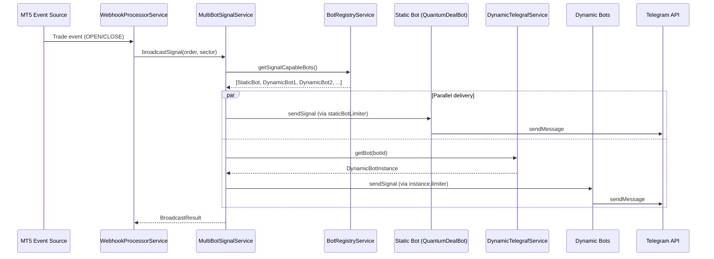
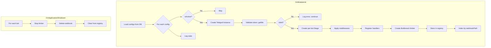
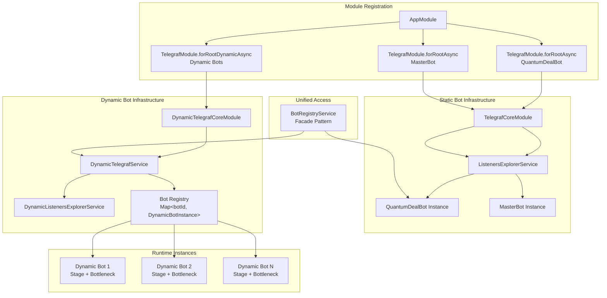

# ADR-COMMON: Dynamic Multi-Bot Orchestration Patterns

## Status

Proposed

## Context

The Quantum Deal platform implements a **hybrid multi-bot architecture** combining two fundamentally different approaches to Telegram bot management:

1. **Static Bots**: Registered via NestJS decorators (`@Update`, `@InjectBot`), compile-time dependency injection, declarative handler registration
2. **Dynamic Bots**: Database-driven loading, runtime initialization, programmatic handler registration

This combination creates significant architectural complexity that requires clear patterns and guidelines for consistent implementation.

### Problem Statement

The hybrid architecture introduces several challenges:

1. **Two codepaths for bot management** - Static bots use `TelegrafModule.forRootAsync()` with decorator-based handlers; dynamic bots use `TelegrafModule.forRootDynamicAsync()` with programmatic registration
2. **Restart required for new bots** - No hot-reload capability; adding dynamic bots requires application restart
3. **Shared handlers require function-based approach** - Decorator-based handlers (`@Start`, `@Command`) cannot be shared across bot types
4. **Webhook routing complexity** - Static bots use `/bot`, `/masterbot` paths; dynamic bots use `/dynamic/:path` routing
5. **Per-bot Stage isolation** - Each bot needs independent `Scenes.Stage` to prevent conversation state leakage
6. **Per-bot Bottleneck rate limiters** - Each bot must respect Telegram API limits independently

### Three-Tier Bot Architecture

| Tier | Bot Type | Configuration | Handler Approach | Stage/Scene | Signal Capability |
|------|----------|---------------|------------------|-------------|-------------------|
| 1 | Master Bot | Environment + Code | nest-telegraf decorators | Shared Stage | No (Admin only) |
| 2 | Static Bot | Environment + Code | nest-telegraf decorators | Shared Stage | Yes (botId=1) |
| 3 | Dynamic Bots | Database | Programmatic registration | Per-bot Stage | Yes (botId=2+) |

### Technical Constraints

- **Framework**: NestJS 11.x, Telegraf 4.x, `@quantumdeal/telegraf` (forked nest-telegraf)
- **Loading Mode**: Application startup only (no hot-reload)
- **Backward Compatibility**: Existing `forRoot()`/`forRootAsync()` must continue working
- **Handler Scope**: Hybrid (shared handlers by default, per-bot override capability via `@ForBot`, `@RequiresFeature`)
- **Stage Management**: Per-bot Stage instances for dynamic bots to prevent conversation state conflicts

### Related Documents

- **ADR-004**: Multi-Bot Database Architecture (Decision 6: Dynamic Bot Registration)
- **ADR-006**: Dynamic Telegraf Module Loading Pattern
- **ADR-007**: Multi-Bot Signal Broadcasting Architecture
- **ADR-COMMON-multi-bot-context**: Multi-Bot Context Patterns (botId conventions)

---

## Decision

### Selected Architecture: Hybrid Orchestration with forRootDynamic Pattern

The platform uses a hybrid approach where:
1. **Static bots** (QuantumDealBot, MasterBot) use traditional `TelegrafModule.forRootAsync()` with decorator-based handlers
2. **Dynamic bots** (Partner bots) use `TelegrafModule.forRootDynamicAsync()` with programmatic handler registration via `DynamicListenersExplorerService`
3. **BotRegistryService** provides unified access to all signal-capable bots
4. **Per-bot isolation** ensures independent Stage, Bottleneck, and webhook paths

---

## Options Considered

### Option A (Selected): Hybrid forRootAsync + forRootDynamicAsync

**Overview**: Maintain both registration patterns, with `forRootDynamicAsync` handling database-driven bots.

**Architecture Flow**:

```mermaid
flowchart TB
    subgraph "Application Startup"
        A[NestJS Bootstrap] --> B[TelegrafModule.forRootAsync<br/>Static Bots]
        A --> C[TelegrafModule.forRootDynamicAsync<br/>Dynamic Bots]

        B --> D[TelegrafCoreModule<br/>QuantumDealBot, MasterBot]
        D --> E[ListenersExplorerService<br/>Decorator scanning]

        C --> F[DynamicTelegrafCoreModule]
        F --> G[DynamicTelegrafService<br/>OnModuleInit]
        G --> H[BotConfigurationProvider<br/>Load from database]
        H --> I[For each bot: createBotFactory]
        I --> J[DynamicListenersExplorerService<br/>Handler registration]
        J --> K[Per-bot Stage, Bottleneck]
    end

    subgraph "Runtime - Static Bots (Webhook Mode)"
        L[Telegram API<br/>POST /bot] --> M[Telegraf Internal Server<br/>QuantumDealBot]
        N[Telegram API<br/>POST /masterbot] --> O[Telegraf Internal Server<br/>MasterBot]
    end

    subgraph "Runtime - Dynamic Bots (Polling Mode)"
        P[Telegraf Long-Polling] --> R1[Partner Bot 1]
        P --> R2[Partner Bot 2]
        P --> RN[Partner Bot N]
    end
```



**Pros**:
- **Minimal disruption**: Existing static bot code unchanged
- **Clear separation**: Different registration patterns for different needs
- **NestJS convention**: Follows established `forRoot`/`forRootAsync` patterns
- **Testable**: Each pattern can be tested independently

**Cons**:
- **Two codepaths**: Different handler registration logic to maintain
- **Restart required**: No hot-reload for dynamic bots
- **Handler sharing complexity**: Must use function-based approach for shared logic

**Effort**: Implemented (current state)

---

### Option B: Unified Dynamic-Only Architecture

**Overview**: Convert all bots to database-driven dynamic loading.

**Pros**:
- Single codepath for all bots
- Consistent handler registration
- Potentially simpler maintenance

**Cons**:
- **Massive migration**: All existing decorator-based handlers need conversion
- **Loss of NestJS patterns**: Guards, interceptors, filters lose context
- **No decorator support**: `@Start()`, `@Command()` decorators won't work
- **Higher risk**: Proven patterns replaced with custom implementation

**Effort**: 15-20 days (significant rewrite)

---

### Option C: Pure Static Architecture (No Dynamic Support)

**Overview**: Require code changes for all new bots.

**Pros**:
- Single registration pattern
- Full decorator support
- Full NestJS DI integration

**Cons**:
- **Does not meet business requirement**: Adding bots requires code changes
- **Deployment complexity**: Each new bot requires release cycle
- **Scalability concerns**: Managing 20+ bot modules becomes unwieldy

**Effort**: N/A (does not meet requirements)

---

## Comparison Matrix

| Evaluation Axis | Option A (Hybrid) | Option B (All Dynamic) | Option C (All Static) |
|-----------------|-------------------|------------------------|----------------------|
| **Business Requirement Fit** | High | High | Low |
| **Implementation Effort** | Implemented | 15-20 days | N/A |
| **NestJS Pattern Compliance** | High | Low | High |
| **Decorator Support** | Partial (static only) | None | Full |
| **Hot-Reload Potential** | Future (restart now) | Possible | Not applicable |
| **Code Complexity** | Medium | Low (after migration) | Low |
| **Maintenance Burden** | Medium (two paths) | Low | High (many modules) |
| **Risk Level** | Low (proven) | High | Low |

---

## Key Implementation Patterns

### Pattern 1: Static Bot Registration

Static bots use `TelegrafModule.forRootAsync()` with full decorator support:

```typescript
// src/app.module.ts
TelegrafModule.forRootAsync({
  botName: BotName,  // 'QuantumDealBot'
  imports: [ConfigModule, BotModule],
  inject: [ConfigService, UserManagementMiddleware],
  useFactory: (configService: ConfigService, userMiddleware: UserManagementMiddleware) => ({
    token: configService.getOrThrow<string>('TELEGRAM_BOT_TOKEN'),
    middlewares: [
      userMiddleware.use.bind(userMiddleware),
      sessionMiddleware,
    ],
    webhook: {
      domain: configService.getOrThrow<string>('TELEGRAM_BOT_WEBHOOK_DOMAIN'),
      path: '/bot',  // Static webhook path
    },
    include: [BotModule],  // Module containing @Update decorated handlers
  }),
}),
```

**Handler Registration (Decorator-based)**:

```typescript
// libs/bot/src/commands/start/start.update.ts
@Update()
@UseInterceptors(ResponseTimeInterceptor)
@UseFilters(TelegrafExceptionFilter)
export class StartUpdate {
  constructor(
    @InjectBot('QuantumDealBot')
    private readonly bot: Telegraf<UserContext>,
  ) {}

  @Start()
  async onStart(@Ctx() ctx: UserContext): Promise<void> {
    // Handler implementation
    await ctx.reply('Welcome!');
  }
}
```

---

### Pattern 2: Dynamic Bot Registration

Dynamic bots use `TelegrafModule.forRootDynamicAsync()` with database configuration:

```typescript
// src/app.module.ts
TelegrafModule.forRootDynamicAsync({
  botConfigProvider: DynamicBotConfigService,  // Implements BotConfigurationProvider
  sharedHandlerModules: [PartnerBotModule],    // Modules with shared handlers
  imports: [DbModule, ConfigModule, PartnerBotModule],
  useFactory: (configService: ConfigService, userMiddleware: UserDynamicManagementMiddleware) => ({
    webhookDomain: configService.getOrThrow<string>('TELEGRAM_BOT_WEBHOOK_DOMAIN'),
    globalMiddlewares: [
      sessionMiddleware,
      userMiddleware.use.bind(userMiddleware),
    ],
    // Inject botId into context for each dynamic bot
    middlewareFactory: (botConfig) => [
      async (ctx, next) => {
        (ctx as { botId?: number }).botId = botConfig.id;
        await next();
      },
    ],
  }),
  inject: [ConfigService, UserDynamicManagementMiddleware],
}),
```

**BotConfigurationProvider Implementation**:

```typescript
// libs/bot/src/services/dynamic-bot-config.service.ts
@Injectable()
export class DynamicBotConfigService implements BotConfigurationProvider {
  constructor(private readonly botsRepository: BotsRepository) {}

  async loadDynamicBots(): Promise<DynamicBotConfig[]> {
    // Load active dynamic bots from database
    return this.botsRepository.findDynamicActive();
  }
}
```

---

### Pattern 3: DynamicTelegrafService Lifecycle

The `DynamicTelegrafService` manages dynamic bot instances:

```typescript
// libs/telegraf/src/services/dynamic-telegraf.service.ts
@Injectable()
export class DynamicTelegrafService implements OnModuleInit, OnApplicationShutdown {
  private readonly bots = new Map<number, DynamicBotInstance>();
  private readonly webhookPathIndex = new Map<string, number>();

  async onModuleInit(): Promise<void> {
    // 1. Load bot configs from BotConfigurationProvider
    const configs = await this.botConfigProvider.loadDynamicBots();

    // 2. Initialize each active bot
    for (const config of configs) {
      if (!config.isActive) continue;

      // 3. Create Telegraf instance
      const bot = await createBotFactory({ token: config.token });

      // 4. Validate token via getMe()
      const botInfo = await bot.telegram.getMe();

      // 5. Create per-bot Stage
      const stage = new Scenes.Stage<Scenes.SceneContext>([]);

      // 6. Apply middlewares (factory -> global -> stage)
      this.applyMiddlewares(bot, config, stage);

      // 7. Register handlers via DynamicListenersExplorerService
      this.listenersExplorer.registerHandlers(bot, config.id, stage, config.settings);

      // 8. Create per-bot Bottleneck
      const limiter = new Bottleneck(this.bottleneckConfig);

      // 9. Store in registry
      this.bots.set(config.id, { botId: config.id, bot, stage, limiter, ... });
      this.webhookPathIndex.set(config.webhookPath, config.id);
    }
  }

  async onApplicationShutdown(): Promise<void> {
    for (const [, instance] of this.bots) {
      await instance.limiter.stop({ dropWaitingJobs: false });
      await instance.bot.telegram.deleteWebhook();
    }
    this.bots.clear();
  }
}
```

---

### Pattern 4: Handler Registration for Dynamic Bots

The `DynamicListenersExplorerService` scans shared handler modules and registers handlers programmatically:

```typescript
// libs/telegraf/src/services/dynamic-listeners-explorer.service.ts
registerHandlers(
  bot: Telegraf<Context>,
  botId: number,
  stage: Scenes.Stage<Scenes.SceneContext>,
  settings: BotSettings | null,
): void {
  const modules = this.getModules(this.modulesContainer, this.options.sharedHandlerModules);

  // 1. Register @Update decorated classes
  this.registerUpdates(modules, bot, botId, settings);

  // 2. Register @Composer decorated classes
  this.registerComposers(modules, stage);

  // 3. Register @Scene and @Wizard decorated classes
  this.registerScenes(modules, stage, botId);
}
```

**Per-Bot Handler Filtering**:

Handlers can be targeted to specific bots or features using decorators:

```typescript
// @ForBot decorator - Handler only registered for specific bot
@Update()
@ForBot(5)  // Only for bot with database ID 5
export class SpecificBotHandler {
  @Start()
  async onStart(@Ctx() ctx: Context): Promise<void> {
    // Only executed for bot ID 5
  }
}

// @RequiresFeature decorator - Handler only registered if feature enabled
@Update()
@RequiresFeature('partnerFlowEnabled')
export class PartnerFlowHandler {
  @Command('partner')
  async onPartner(@Ctx() ctx: Context): Promise<void> {
    // Only if bot.settings.features.partnerFlowEnabled === true
  }
}
```

---

### Pattern 5: Webhook Configuration (Telegraf-Managed)

**IMPORTANT**: Webhooks are configured **inside Telegraf** via `bot.launch()`, NOT through NestJS HTTP controllers.

#### Static Bot Webhook Architecture

Static bots configure webhooks via `launchOptions.webhook` passed to `TelegrafModule.forRootAsync()`:

```typescript
// src/app.module.ts (lines 49-56)
TelegrafModule.forRootAsync({
  botName: BotName,
  // ...
  useFactory: (configService, userMiddleware) => ({
    token: configService.getOrThrow<string>('TELEGRAM_BOT_TOKEN'),
    middlewares: [...],
    // Webhook configuration passed to Telegraf's bot.launch()
    webhook: {
      domain: configService.getOrThrow<string>('TELEGRAM_BOT_WEBHOOK_DOMAIN'),
      allowedUpdates: ['message', 'callback_query', 'inline_query'],
      port: configService.get<number>('TELEGRAM_BOT_WEBHOOK_PORT', 443),
      path: '/bot',  // Full path: https://domain/bot
    },
  }),
}),
```

This configuration flows through `createBotFactory()`:

```typescript
// libs/telegraf/src/utils/create-bot-factory.util.ts
export function createBotFactory(options: TelegrafModuleOptions): Promise<Telegraf<Context>> {
  const bot = new Telegraf<Context>(options.token, options.options);
  // ...
  if (options.launchOptions !== false) {
    bot.launch(options.launchOptions ?? {});  // Telegraf handles webhook setup internally
  }
  return Promise.resolve(bot);
}
```

When `bot.launch({ webhook: {...} })` is called, Telegraf:
1. Starts an internal HTTP server on the specified port
2. Registers the webhook URL with Telegram via `setWebhook` API
3. Routes incoming updates to the bot's middleware chain

#### Dynamic Bot Webhook Architecture

**Current State**: Dynamic bots do NOT automatically set up webhooks.

The `DynamicTelegrafService` creates bots via `createBotFactory()` but passes **no launchOptions**:

```typescript
// libs/telegraf/src/services/dynamic-telegraf.service.ts (line 185)
const bot = await createBotFactory({
  token,
  options: this.options.telegrafOptions,
  // NOTE: No launchOptions passed - bot.launch({}) is called with empty object
});
```

This means:
1. `bot.launch({})` is called with an empty object
2. Telegraf starts in polling mode (not webhook mode)
3. The `webhookDomain` and `webhookPath` configuration exists but is NOT automatically used

#### Key Architectural Points

1. **No NestJS Webhook Controllers**: Telegram sends webhooks directly to Telegraf's internal HTTP server
2. **Telegraf Handles Routing**: Each static bot has its own webhook path managed by Telegraf
3. **Dynamic Bots**: Currently use polling mode, not webhooks (see Dead Code section)
4. **handleUpdate() is INTERNAL**: Exists in `DynamicTelegrafService` for potential future use or programmatic update injection, but no HTTP endpoint calls it

#### Webhook Path Summary

| Bot Type | Path | Managed By | Status |
|----------|------|------------|--------|
| QuantumDealBot | `/bot` | Telegraf (via `bot.launch()`) | Active |
| MasterBot | `/masterbot` | Telegraf (via `bot.launch()`) | Active |
| Dynamic Bots | `/dynamic/:path` | NOT CONFIGURED | Polling mode |

---

### Pattern 6: Per-Bot Stage Isolation

Each dynamic bot receives its own Stage instance to prevent conversation state leakage:

```typescript
// Per-bot Stage creation during initialization
const stage = new Scenes.Stage<Scenes.SceneContext>([]);

// Scenes registered per-bot
stage.register(new Scenes.BaseScene('subscription-scene'));

// Stage middleware applied per-bot
bot.use(stage.middleware());
```

**Why Per-Bot Stage?**

Without isolation, users interacting with different bots would share scene state, causing:
- Conversation confusion (user in scene on Bot A affects Bot B)
- State leakage between unrelated contexts
- Unpredictable behavior in multi-bot scenarios

---

### Pattern 7: Per-Bot Rate Limiting

Each bot has its own Bottleneck instance for Telegram API rate limiting:

```typescript
// libs/telegraf/src/services/dynamic-telegraf.service.ts
private readonly bottleneckConfig = {
  maxConcurrent: 4,      // Max concurrent requests
  minTime: 30,           // Min time between requests (ms)
  reservoir: 28,         // Messages per refresh interval
  reservoirRefreshAmount: 28,
  reservoirRefreshInterval: 1000,  // 1 second
};

// Per-bot limiter creation
const limiter = new Bottleneck(this.bottleneckConfig);
limiter.on('error', (error) => {
  this.logger.error(`Bottleneck error for bot "${botName}":`, error);
});
```

**Rationale**:
- Each bot token has independent Telegram API limits (30 msg/sec)
- Shared limiter would cause one bot's traffic to block others
- Fault isolation - one bot's rate limit issues don't affect others

---

### Pattern 8: BotRegistryService Facade

The `BotRegistryService` provides unified access to all signal-capable bots:

```typescript
// libs/framework/src/webhook/bot-registry.service.ts
@Injectable()
export class BotRegistryService implements BotRegistry {
  constructor(
    @InjectBot('QuantumDealBot')
    private readonly staticBot: Telegraf<UserContext>,
    private readonly dynamicTelegrafService: DynamicTelegrafService,
  ) {}

  getSignalCapableBots(): SignalCapableBot[] {
    const bots: SignalCapableBot[] = [];

    // Static bot (QuantumDealBot with botId=1)
    if (this.staticBotSignalsEnabled) {
      bots.push({
        botId: 1,  // Database ID
        name: 'QuantumDealBot',
        instance: this.staticBot,
        limiter: this.staticBotLimiter,
        type: 'static',
      });
    }

    // Dynamic bots with signalsEnabled
    const dynamicBots = this.dynamicTelegrafService.getAllBots();
    for (const [botId, instance] of dynamicBots) {
      if (instance.settings?.features?.signalsEnabled) {
        bots.push({
          botId,
          name: instance.name,
          instance: instance.bot,
          limiter: instance.limiter,
          type: 'dynamic',
          settings: instance.settings,
        });
      }
    }

    return bots;
  }
}
```

---

## Problematic Aspects and Solutions

### Problem 1: Two Codepaths for Bot Management

**Issue**: Static bots use decorator-based handlers (`@Start`, `@Command`), while dynamic bots require programmatic registration.

**Solution**:
- Use `DynamicListenersExplorerService` to scan and register decorated handlers on dynamic bots
- Handlers in `sharedHandlerModules` are automatically registered on all dynamic bots
- Use `@ForBot(botId)` and `@RequiresFeature(flag)` for per-bot customization

**Code Example**:

```typescript
// Shared handler automatically registered on all dynamic bots
@Update()
export class SharedStartHandler {
  @Start()
  async onStart(@Ctx() ctx: Context): Promise<void> {
    // Works on ALL dynamic bots
  }
}

// Bot-specific handler only for botId=5
@Update()
@ForBot(5)
export class SpecificBotHandler {
  @Start()
  async onStart(@Ctx() ctx: Context): Promise<void> {
    // Only registered on bot with ID 5
  }
}
```

---

### Problem 2: Restart Required for New Bots

**Issue**: Adding new dynamic bots requires application restart; no hot-reload capability.

**Solution (Current)**:
- Accept restart requirement for MVP
- Document the "INSERT + restart" workflow

**Adding a New Dynamic Bot**:

```sql
-- Step 1: Insert bot record
INSERT INTO bots (name, token, webhook_path, is_dynamic, is_active)
VALUES ('NewPartnerBot', '7123456789:AAH...', '/dynamic/newpartner', true, true);

-- Step 2: Add bot settings (optional)
INSERT INTO bot_settings (bot_id, settings)
VALUES (
  (SELECT id FROM bots WHERE name = 'NewPartnerBot'),
  '{"features": {"partnerFlowEnabled": true, "signalsEnabled": true}}'::jsonb
);
```

```bash
# Step 3: Restart application
pm2 restart quantum-deal
# OR
docker-compose restart app
```

**Future Enhancement** (not implemented):
- Database polling for new bots (every N minutes)
- Signal-based reload (SIGUSR1 to reload bots)
- Admin API endpoint to trigger bot reload

---

### Problem 3: Shared Handlers Require Function-Based Approach

**Issue**: Decorator-based handlers in static bot modules cannot be directly shared with dynamic bots.

**Solution**: Use shared handler modules with `@Update` decorated classes:

```typescript
// libs/partner-bot/src/handlers/start.update.ts
@Update()
export class StartUpdate {
  constructor(
    private readonly localizationService: LocalizationService,
    private readonly usersRepository: UsersRepository,
  ) {}

  @Start()
  async onStart(@Ctx() ctx: PartnerContext): Promise<void> {
    const botId = ctx.botId;  // Injected via middleware
    const user = ctx.user;

    // Bot-specific localization
    const message = await this.localizationService
      .forBot(botId)
      .lang(user.lang)
      .t('welcome');

    await ctx.reply(message);
  }
}
```

**Registration Flow**:

1. `PartnerBotModule` exports `StartUpdate`
2. `forRootDynamicAsync` includes `PartnerBotModule` in `sharedHandlerModules`
3. `DynamicListenersExplorerService` scans for `@Update` decorated classes
4. Each dynamic bot gets the handlers registered via `registerListeners()`

---

### Problem 4: Webhook vs Polling Mode

**Issue**: Static bots use webhooks, but dynamic bots need a different approach.

**Current Solution**: Different modes for different bot types:

```
Static Bots (Telegraf-managed webhooks):
  /bot           -> Webhook handled by Telegraf's internal HTTP server
  /masterbot     -> Webhook handled by Telegraf's internal HTTP server

Dynamic Bots (Polling mode):
  No webhooks   -> Uses Telegraf long-polling (bot.launch({}))
```

**Rationale for Dynamic Bot Polling Mode**:

1. **Simpler Configuration**: No need to configure unique webhook paths and expose additional endpoints
2. **Works Behind Firewalls**: Polling works even when the server isn't publicly accessible
3. **No Port Conflicts**: Multiple bots can poll simultaneously without port allocation issues

**Infrastructure Prepared for Future Webhook Support**:

```typescript
// DynamicTelegrafService maintains webhookPathIndex for future use
webhookPathIndex: Map<string, number> = {
  '/dynamic/partner-alpha': 3,  // Indexed but not used for webhooks
  '/dynamic/partner-beta': 4,
}

// handleUpdate() method exists for programmatic update injection
async handleUpdate(webhookPath: string, update: Update): Promise<boolean>;
```

**Note**: The `webhookDomain` and `webhookPath` configuration exists in the database and interfaces but is NOT currently used for actual webhook setup. See Pattern 5 and Dead Code section for details.

---

### Problem 5: Per-Bot Stage Isolation

**Issue**: Without isolation, scene state leaks between bots.

**Solution**: Each `DynamicBotInstance` has its own `Scenes.Stage`:

```typescript
interface DynamicBotInstance {
  botId: number;
  bot: Telegraf<Context>;
  stage: Scenes.Stage<Scenes.SceneContext>;  // Per-bot Stage
  limiter: Bottleneck;
  // ...
}
```

**Initialization**:

```typescript
// Per-bot Stage creation
const stage = new Scenes.Stage<Scenes.SceneContext>([]);

// Register scenes on this bot's stage
this.registerScenes(modules, stage, botId);

// Apply stage middleware
bot.use(stage.middleware());
```

---

### Problem 6: Per-Bot Bottleneck Rate Limiters

**Issue**: Shared rate limiter would cause inter-bot interference.

**Solution**: Each bot has its own Bottleneck instance:

```typescript
// Configuration (matches Telegram API limits)
const bottleneckConfig = {
  maxConcurrent: 4,
  minTime: 30,
  reservoir: 28,
  reservoirRefreshAmount: 28,
  reservoirRefreshInterval: 1000,
};

// Per-bot creation
const limiter = new Bottleneck(bottleneckConfig);

// Graceful shutdown
await limiter.stop({ dropWaitingJobs: false });
```

---

## Data Flow Diagrams

### Signal Broadcasting Flow



### Dynamic Bot Initialization Flow



---

## Consequences

### Positive Consequences

- **Database-Driven Bot Addition**: New bots added via INSERT + restart without code changes
- **Clean Separation**: Static and dynamic bots have clear boundaries
- **Per-Bot Isolation**: Stage, Bottleneck, webhook path all isolated per bot
- **Fault Isolation**: One bot's failure doesn't affect others
- **Shared Handler Support**: Common handlers work across all dynamic bots
- **Type Safety**: Strong TypeScript interfaces for all bot configurations
- **Graceful Lifecycle**: Clean initialization and shutdown handling

### Negative Consequences

- **Two Codepaths**: Static vs dynamic registration patterns to maintain
- **Restart Required**: No hot-reload for dynamic bots (MVP limitation)
- **Testing Complexity**: Need tests for both static and dynamic flows
- **Memory Overhead**: Per-bot Stage and Bottleneck instances

### Neutral Consequences

- **Webhook Path Management**: Unique paths per bot in database
- **Handler Decorator Scanning**: DynamicListenersExplorerService scans sharedHandlerModules

---

## Implementation Guidance

### Adding New Dynamic Bot (Workflow)

1. **Insert database records**:
   ```sql
   INSERT INTO bots (name, token, webhook_path, is_dynamic, is_active)
   VALUES ('NewBot', 'TOKEN', '/dynamic/newbot', true, true);

   INSERT INTO bot_settings (bot_id, settings)
   VALUES (LAST_INSERT_ID(), '{"features": {...}}'::jsonb);
   ```

2. **Restart application**

3. **Verify initialization** in logs:
   ```
   [DynamicTelegrafService] Dynamic bot started: "NewBot" (@newbot_username)
   ```

### Creating Shared Handlers

1. **Create handler in shared module**:
   ```typescript
   @Update()
   export class MyHandler {
     @Command('mycommand')
     async onMyCommand(@Ctx() ctx: Context): Promise<void> { }
   }
   ```

2. **Export from module**:
   ```typescript
   @Module({
     providers: [MyHandler],
     exports: [MyHandler],
   })
   export class SharedHandlerModule {}
   ```

3. **Include in forRootDynamicAsync**:
   ```typescript
   TelegrafModule.forRootDynamicAsync({
     sharedHandlerModules: [SharedHandlerModule],
     // ...
   })
   ```

### Per-Bot Handler Customization

**Target specific bot**:
```typescript
@Update()
@ForBot(5)  // Only for bot ID 5
export class BotSpecificHandler { }
```

**Require feature flag**:
```typescript
@Update()
@RequiresFeature('partnerFlowEnabled')
export class FeatureHandler { }
```

### Bot Context Access

Dynamic bot handlers can access bot context via middleware-injected properties:

```typescript
@Start()
async onStart(@Ctx() ctx: PartnerContext): Promise<void> {
  const botId = ctx.botId;           // Injected by middlewareFactory
  const user = ctx.user;             // Injected by UserDynamicManagementMiddleware
  const botSettings = getBotSettings(botId);  // From registry
}
```

### Rate Limiting Usage

Always use per-bot limiter for message sending:

```typescript
const bot = botRegistryService.getBot(botId);
await bot.limiter.schedule(() =>
  bot.instance.telegram.sendMessage(chatId, message)
);
```

---

## Architecture Diagram



---

## Dead Code and Unused Infrastructure

This section documents code that exists but is not currently used. This information helps developers understand what infrastructure is available for future use and what can be safely removed or needs to be connected.

### setupWebhook() - NEVER CALLED

**Location**: `libs/telegraf/src/services/dynamic-telegraf.service.ts` (lines 281-302)

```typescript
private async setupWebhook(
  bot: Telegraf<Context>,
  webhookPath: string,
  botName: string,
): Promise<void> {
  // This method exists but is NEVER called from anywhere
  const webhookUrl = `${this.options.webhookDomain}${webhookPath}`;
  await bot.telegram.setWebhook(webhookUrl);
}
```

**Status**: Dead code - method exists but is not invoked during initialization or anywhere else.

**Intended Purpose**: Was designed to configure webhooks for dynamic bots using `webhookDomain` + `webhookPath`.

**Why Not Used**: The `initializeBot()` method creates bots via `createBotFactory()` without passing `launchOptions`, resulting in polling mode. The `setupWebhook()` method was never integrated into the initialization flow.

**Options**:
1. **Remove**: If polling mode is the intended behavior for dynamic bots
2. **Integrate**: Call `setupWebhook()` after bot creation to enable webhook mode
3. **Keep for Future**: Leave as infrastructure for future webhook support

### handleUpdate() - NO HTTP ENDPOINT

**Location**: `libs/telegraf/src/services/dynamic-telegraf.service.ts` (lines 336-362)

```typescript
async handleUpdate(webhookPath: string, update: Update): Promise<boolean> {
  // This method exists but no HTTP controller calls it
  const botId = this.webhookPathIndex.get(webhookPath);
  // ...routes update to correct bot
}
```

**Status**: Implemented but not connected to any HTTP endpoint.

**Intended Purpose**: Route incoming webhook updates to the correct dynamic bot based on webhook path.

**Current State**: The `webhook.controller.ts` only handles MT5 events (`POST /webhook/events`), not Telegram webhook updates. There is no `POST /dynamic/:path` endpoint.

**To Enable Webhook Support**: Would require:
1. Create a NestJS controller with `@Post('dynamic/:path')` endpoint
2. Inject `DynamicTelegrafService`
3. Call `handleUpdate(path, update)` with the incoming Telegram update

### webhookPathIndex - INDEXED BUT NOT USED FOR ROUTING

**Location**: `libs/telegraf/src/services/dynamic-telegraf.service.ts`

```typescript
private readonly webhookPathIndex = new Map<string, number>();
// Populated during initialization but never used for actual webhook routing
```

**Status**: Data structure is populated but only used by `handleUpdate()` which has no callers.

### webhookDomain Configuration - NOT USED

**Location**: `TelegrafDynamicModuleOptions.webhookDomain`

```typescript
// Configured in app.module.ts but never used for actual webhook setup
webhookDomain: configService.getOrThrow<string>('TELEGRAM_BOT_WEBHOOK_DOMAIN'),
```

**Status**: Configured and available in options but not passed to `createBotFactory()` or used in `setupWebhook()` calls.

---

## Related Information

### Key Files

**Static Bot Infrastructure**:
- `libs/telegraf/src/telegraf-core.module.ts` - Static bot registration
- `libs/telegraf/src/services/listeners-explorer.service.ts` - Decorator handler registration

**Dynamic Bot Infrastructure**:
- `libs/telegraf/src/services/dynamic-telegraf.service.ts` - Dynamic bot lifecycle management
- `libs/telegraf/src/services/dynamic-listeners-explorer.service.ts` - Handler registration for dynamic bots
- `libs/telegraf/src/interfaces/dynamic-telegraf-options.interface.ts` - Configuration interfaces

**Unified Access**:
- `libs/framework/src/webhook/bot-registry.service.ts` - BotRegistryService facade
- `libs/framework/src/webhook/bot-registry.interface.ts` - SignalCapableBot interface

**Application Configuration**:
- `src/app.module.ts` - Bot registration (forRootAsync, forRootDynamicAsync)

### Related ADRs

- **ADR-004**: Multi-Bot Database Architecture (Decision 6: Dynamic Bot Registration)
- **ADR-006**: Dynamic Telegraf Module Loading Pattern
- **ADR-007**: Multi-Bot Signal Broadcasting Architecture
- **ADR-COMMON-multi-bot-context**: Multi-Bot Context Patterns (botId conventions)

### External References

- [NestJS Dynamic Modules Documentation](https://docs.nestjs.com/fundamentals/dynamic-modules)
- [Telegraf.js Documentation](https://telegraf.js.org/)
- [nest-telegraf Multiple Bots](https://nestjs-telegraf.0x467.com/extras/multiple-bots)
- [Bottleneck Rate Limiter](https://github.com/SGrondin/bottleneck)

---

## Decision Record

| Attribute | Value |
|-----------|-------|
| **Decision Date** | 2025-12-11 |
| **Decision Status** | Proposed |
| **Complexity Level** | Maximum (5/5) |
| **Scope** | Common pattern for multi-bot orchestration |
| **Related ADRs** | ADR-004, ADR-006, ADR-007, ADR-COMMON-multi-bot-context |

---

## Change History

| Version | Date | Author | Changes |
|---------|------|--------|---------|
| 1.0.0 | 2025-12-11 | Claude Code Architecture Agent | Initial version - comprehensive documentation of hybrid multi-bot orchestration patterns |
| 1.1.0 | 2025-12-11 | Claude Code Architecture Agent | **CRITICAL FIX**: Corrected webhook architecture documentation to match actual code. Pattern 5 rewritten to reflect Telegraf-managed webhooks. Added Dead Code section documenting unused setupWebhook(), handleUpdate() without HTTP endpoint, and unused webhookDomain configuration. Updated Problem 4 to accurately describe polling vs webhook modes. |

---

**Document Version**: 1.1.0
**Created**: 2025-12-11
**Last Updated**: 2025-12-11
**Author**: Claude Code Architecture Agent
