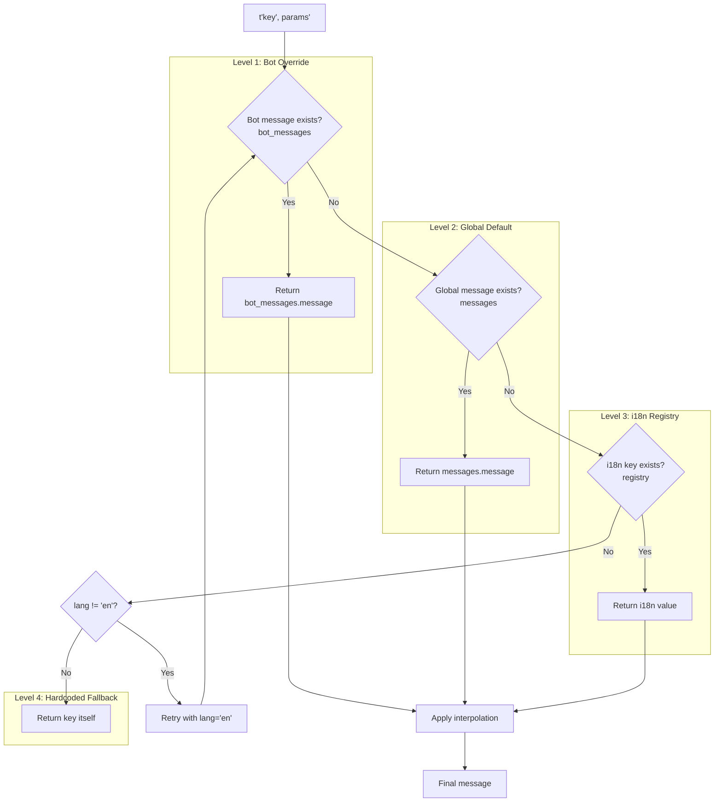
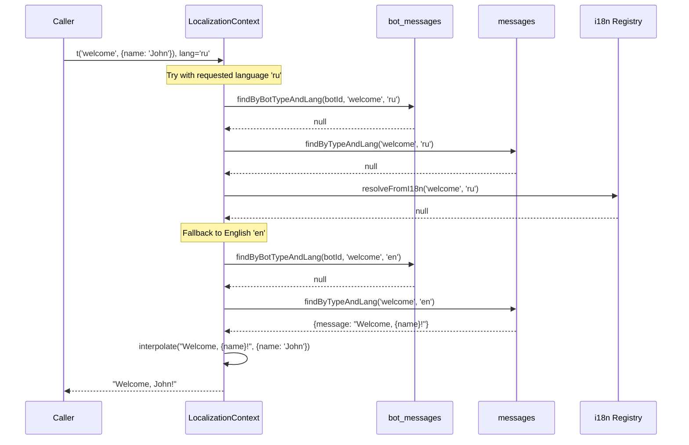

# ADR-COMMON: Message Resolution Pattern

## Status

Proposed

## Context

The Quantum Deal platform requires a flexible, multi-source message resolution system that supports:

1. **Bot-specific branding** - Each bot can customize messages for unique brand identity
2. **Multi-language support** - 9+ languages (ru, en, uk, hi, fr, kk, uz, tg, tl)
3. **Template interpolation** - Dynamic values in messages via `{placeholder}` syntax
4. **Function-based messages** - Complex parameterized messages `(args) => string`
5. **Graceful fallbacks** - System never fails to return a message

### Problem: Multi-Source Message Resolution

Messages can originate from multiple sources with different priorities:

| Source | Description | Update Frequency | Example |
|--------|-------------|------------------|---------|
| `bot_messages` | Bot-specific overrides (DB) | Admin/runtime | "Welcome to CryptoSignals!" |
| `messages` | Global defaults (DB) | Rare (migrations) | "Welcome to our service!" |
| `i18n registry` | Hardcoded files (code) | Deployments | `renewal.i18n.ts` |
| Hardcoded fallback | Last resort | Never | Key itself returned |

### Technical Constraints

- **Database**: PostgreSQL with Drizzle ORM
- **Runtime**: NestJS with dependency injection
- **Multi-bot context**: `botId: number` identifies each bot (per ADR-COMMON-multi-bot-context)
- **Async/Sync boundary**: Database operations are async, i18n registry is sync
- **No caching layer**: Each message resolution performs fresh DB queries

### Critical Complexity Factors

1. **Multiple DB queries per message** - Up to 2 queries without caching
2. **Namespace-aware i18n resolution** - `.use(namespace)` restricts search scope
3. **Two template syntaxes** - `{placeholder}` strings vs `(...args) => string` functions
4. **Language fallback chain** - requested lang -> 'en'
5. **Sync vs async boundaries** - DB is async, i18n is sync, API is async

### Related Documents

- **ADR-004 Decision 3**: Message Override Strategy (establishes the hierarchy)
- **ADR-COMMON-multi-bot-context**: Multi-Bot Context Patterns (botId conventions)

---

## Decision

### 4-Level Cascading Fallback Hierarchy

Implement a cascading fallback pattern with four distinct levels:

```
Level 1: bot_messages(botId, type, lang)  - Bot-specific override
Level 2: messages(type, lang)              - Global database messages
Level 3: i18n registry(namespace, key, lang) - In-memory i18n files
Level 4: key itself                        - Hardcoded fallback (never fails)
```

Additionally, each level includes a **language fallback**:
- Primary: requested language (e.g., 'ru')
- Fallback: English ('en')

### Fluent API Pattern

Provide a fluent context-based API for ergonomic usage:

```typescript
const text = await localizationService
  .forBot(botId)           // Set bot context
  .use('renewal')          // Set i18n namespace (optional)
  .lang('ru')              // Set language
  .t('welcome', { name: 'John' });  // Resolve key with params
```

---

## Rationale

### Options Considered

#### Option A: Database-Only Resolution

- **Overview**: All messages stored in database, no i18n files
- **Pros**:
  - Single source of truth
  - Runtime updates without deployment
  - Simple query logic
- **Cons**:
  - Database dependency for all messages
  - No compile-time validation
  - Larger database size
  - Slower: always requires DB query
- **Effort**: 5 days (migrate all i18n to DB)

#### Option B: i18n-Only Resolution (Static Files)

- **Overview**: All messages in TypeScript files, no database override
- **Pros**:
  - Fast: in-memory lookup
  - Type-safe keys
  - Compile-time validation
  - No DB dependency
- **Cons**:
  - No runtime customization
  - Bot-specific messages require code changes
  - Deployment required for any message change
- **Effort**: 2 days

#### Option C (Selected): Hybrid 4-Level Cascade

- **Overview**: Database overrides + i18n defaults with multi-level fallback
- **Pros**:
  - **Flexibility**: Bot-specific overrides without code changes
  - **Performance base**: i18n registry provides fast fallback
  - **DRY principle**: Common messages in i18n, only differences in DB
  - **Graceful degradation**: System always returns a message
  - **Established pattern**: Follows i18next cascading model
  - **Separation of concerns**: Brand customization vs default content
- **Cons**:
  - Multiple DB queries per resolution (performance cost)
  - Two template syntaxes to maintain
  - Complex debugging: message can come from 4 sources
- **Effort**: 4 days (current implementation)

#### Option D: Redis-Cached Database Resolution

- **Overview**: Database resolution with Redis caching layer
- **Pros**:
  - All benefits of Option C
  - Significantly faster after cache warm-up
  - Reduced database load
- **Cons**:
  - Additional infrastructure (Redis)
  - Cache invalidation complexity
  - Over-engineering for current scale
- **Effort**: 7 days

### Comparison Matrix

| Evaluation Axis | Option A (DB-Only) | Option B (i18n-Only) | Option C (Hybrid) | Option D (Cached) |
|-----------------|-------------------|---------------------|-------------------|-------------------|
| Performance | Low | High | Medium | High |
| Flexibility | High | Low | High | High |
| Complexity | Low | Low | Medium | High |
| Type Safety | Low | High | Medium | Medium |
| Runtime Updates | Yes | No | Yes | Yes |
| DB Dependency | High | None | Medium | Medium |
| Infrastructure | DB only | None | DB only | DB + Redis |

### Selected: Option C (Hybrid 4-Level Cascade)

Option C provides the optimal balance between flexibility and maintainability. The pattern aligns with industry best practices from i18next, the leading i18n library:

> "Doing graceful fallbacks is a core principle of i18next. This enables you to display the most accurate content possible, while not repeating content over and over." - [i18next Fallback Documentation](https://www.i18next.com/principles/fallback)

The database layer enables bot-specific branding without deployment, while the i18n registry provides fast defaults with compile-time validation.

---

## Implementation Architecture

### Resolution Flow Diagram



### Language Fallback Chain



### Core Components

#### 1. LocalizationService (Entry Point)

```typescript
/**
 * Entry point for the fluent localization API
 *
 * @example
 * const text = await localizationService
 *   .forBot(botId)
 *   .lang('ru')
 *   .t('welcome');
 */
@Injectable()
export class LocalizationService implements ILocalizationService {
  private readonly i18nRegistry = new Map<string, I18nMessages>();

  constructor(
    private readonly botMessagesRepository: BotMessagesRepository,
    private readonly messagesRepository: MessagesRepository,
  ) {}

  forBot(botId: number | null): ILocalizationContext {
    return new LocalizationContext(
      botId,
      this.botMessagesRepository,
      this.messagesRepository,
      this.i18nRegistry,
    );
  }

  registerI18n(namespace: string, messages: I18nMessages): void {
    this.i18nRegistry.set(namespace, messages);
  }
}
```

#### 2. LocalizationContext (Resolution Logic)

```typescript
/**
 * Fluent context holding bot and language state
 *
 * Resolution hierarchy:
 * 1. bot_messages (if botId set)
 * 2. messages (global)
 * 3. i18n registry
 * 4. key itself
 */
export class LocalizationContext implements ILocalizationContext {
  private langCode: string = 'en';
  private namespace: string | null = null;

  use(namespace: string): ILocalizationContext {
    this.namespace = namespace;
    return this;
  }

  lang(langCode: string): ILocalizationContext {
    this.langCode = langCode;
    return this;
  }

  async t(key: string, params?: InterpolationParams): Promise<string> {
    // Try requested language
    let result = await this.resolveKey(key, this.langCode, params);
    if (result !== undefined) return result;

    // Language fallback to 'en'
    if (this.langCode !== 'en') {
      result = await this.resolveKey(key, 'en', params);
      if (result !== undefined) return result;
    }

    // Return key as last resort (never fails)
    return key;
  }
}
```

#### 3. Template Interpolation

Two syntax types are supported:

**String Templates** (DB and i18n):
```typescript
// Template: "Welcome, {name}! You have {count} messages."
// Params: { name: 'John', count: 5 }
// Result: "Welcome, John! You have 5 messages."

private interpolate(template: string, params?: InterpolationParams): string {
  if (!params) return template;

  return template.replace(/\{(\w+)\}/g, (match, placeholder: string) => {
    if (placeholder in params) {
      return String(params[placeholder]);
    }
    return match;  // Leave placeholder as-is if param missing
  });
}
```

**Function Messages** (i18n only):
```typescript
// Definition: (subscriptionName: string) => `Renew: ${subscriptionName}`
// Usage: t('renewalTitle', { subscriptionName: 'Premium' })

private resolveI18nValue(
  value: I18nMessageValue,
  params?: InterpolationParams,
): string {
  if (typeof value === 'function') {
    const args = params ? Object.values(params) : [];
    return value(...args);
  }
  return this.interpolate(value, params);
}
```

### Database Schema Integration

#### bot_messages Table (Level 1)

```typescript
// libs/db/src/schema/bot-messages.ts
export const botMessages = pgTable(
  'bot_messages',
  {
    id: bigint('id', { mode: 'number' })
      .primaryKey()
      .generatedAlwaysAsIdentity(),
    botId: bigint('bot_id', { mode: 'number' })
      .notNull()
      .references(() => bots.id, { onDelete: 'cascade' }),
    type: varchar('type', { length: 50 }).notNull(),   // Message key
    lang: varchar('lang', { length: 10 }).notNull(),   // Language code
    message: text('message').notNull(),                // Template string
    createdAt: timestamp('created_at', { withTimezone: true })
      .defaultNow()
      .notNull(),
    updatedAt: timestamp('updated_at', { withTimezone: true })
      .defaultNow()
      .notNull(),
  },
  (table) => [
    unique('uq_bot_messages_bot_type_lang').on(
      table.botId,
      table.type,
      table.lang,
    ),
  ],
);
```

#### messages Table (Level 2)

```typescript
// libs/db/src/schema/messages.ts
export const messages = pgTable('messages', {
  id: bigint('id', { mode: 'number' }).primaryKey().generatedAlwaysAsIdentity(),
  lang: varchar('lang', { length: 10 }),      // nullable
  type: varchar('type', { length: 30 }),      // nullable
  message: text('message'),                   // nullable
  // Note: No timestamps, no unique constraint, no index
});
```

> **Note**: Unlike `bot_messages`, the `messages` table has nullable fields and no unique constraints. This design allows for multiple messages per `(type, lang)` combination to enable message variation (see [Random Message Selection](#random-message-selection)).

### i18n Registry Structure (Level 3)

```typescript
// Type definitions
type I18nMessageValue = string | ((...args: unknown[]) => string);
type I18nLanguageMessages = Record<string, I18nMessageValue>;
type I18nMessages = Partial<Record<LangCode, I18nLanguageMessages>>;

// Example namespace registration
// libs/partner-bot/src/i18n/renewal.i18n.ts
export const RENEWAL_I18N_NAMESPACE = 'renewal';

export const renewalMessages: I18nMessages = {
  ru: {
    renewal_text_selectTariffHeader: '🎯 Продление подписки',
    renewal_text_renewalTitle: (subscriptionName: string) =>
      `🎯 Продление подписки: ${subscriptionName}`,
  },
  en: {
    renewal_text_selectTariffHeader: '🎯 Subscription Renewal',
    renewal_text_renewalTitle: (subscriptionName: string) =>
      `🎯 Renew Subscription: ${subscriptionName}`,
  },
  // ... other languages
};

// Registration at module initialization
localizationService.registerI18n(RENEWAL_I18N_NAMESPACE, renewalMessages);
```

### Random Message Selection

When multiple messages exist for the same `(type, lang)` combination in the `messages` table, `MessagesRepository.findByTypeAndLang()` returns a **random** message using JavaScript's `Math.random()`.

**Use Case**: Message variation for user engagement (e.g., multiple greeting templates, varied report formats).

**Implementation** (`libs/db/src/repositories/messages.repository.ts:38-40`):
```typescript
// Return a random message template
const randomIndex = Math.floor(Math.random() * messagesForType.length);
return messagesForType[randomIndex];
```

**How It Works**:
1. Query fetches ALL messages matching `(type, lang)`
2. Random index is calculated using `Math.random()`
3. Single message at that index is returned

**Important**: This behavior applies ONLY to the `messages` table (Level 2). The `bot_messages` table (Level 1) has a unique constraint on `(botId, type, lang)`, preventing multiple messages.

---

## Consequences

### Positive Consequences

- **Never-fail resolution**: System always returns a message (key itself as last resort)
- **Brand flexibility**: Bot-specific overrides without code changes
- **DRY implementation**: Common messages defined once in i18n
- **Type-safe i18n**: Function-based messages with TypeScript validation
- **Clean API**: Fluent interface with method chaining
- **Industry alignment**: Follows i18next cascading fallback pattern

### Negative Consequences

- **Performance cost**: Up to 4 DB queries per message (2 languages x 2 tables)
- **Debugging complexity**: Message can originate from 4 different sources
- **Two template syntaxes**: String `{placeholder}` vs function `(args) => string`
- **No caching**: Fresh DB queries on every resolution
- **Namespace management**: i18n must be registered before use

### Neutral Consequences

- **Async API**: All resolution methods return `Promise<string>`
- **Language fallback**: Non-English always tries English as fallback
- **Parameter handling**: Missing params leave placeholders unchanged

---

## Performance Considerations

### Current State: No Caching

Each message resolution performs:
- **Best case**: 1 DB query (bot_messages hit)
- **Typical case**: 2 DB queries (bot_messages miss, messages hit)
- **Worst case (non-English)**: 4 DB queries + i18n lookup
- **Fallback case**: 4 DB queries + i18n lookup (returns key)

### Query Pattern

```sql
-- Level 1: Bot-specific
SELECT message FROM bot_messages
WHERE bot_id = $1 AND type = $2 AND lang = $3;

-- Level 2: Global
SELECT message FROM messages
WHERE type = $1 AND lang = $2;
```

### Performance Risks

| Risk | Impact | Mitigation |
|------|--------|------------|
| High message volume | N x 2-4 DB queries | Batch loading, caching |
| Cold start latency | First request slow | Pre-warm common messages |
| Language fallback overhead | Double queries | Cache language fallback results |

### Future Optimization: Caching Layer

```typescript
// Potential caching implementation (NOT current state)
interface CacheKey {
  botId: number | null;
  type: string;
  lang: string;
}

class CachedLocalizationContext {
  private cache = new Map<string, string>();
  private readonly TTL = 5 * 60 * 1000; // 5 minutes

  async t(key: string, params?: InterpolationParams): Promise<string> {
    const cacheKey = `${this.botId}:${key}:${this.langCode}`;

    if (this.cache.has(cacheKey)) {
      return this.interpolate(this.cache.get(cacheKey)!, params);
    }

    const result = await this.resolveFromSources(key);
    this.cache.set(cacheKey, result);
    return this.interpolate(result, params);
  }
}
```

---

## Problematic Aspects

### 1. Multiple DB Queries for Single Message

**Problem**: Each `t()` call can trigger 2-4 database queries.

**Example Worst Case**:
```typescript
// For lang='ru', no bot override, no global message, no i18n match
const text = await ctx.t('missing_key');
// Queries:
// 1. SELECT FROM bot_messages WHERE ... lang='ru'
// 2. SELECT FROM messages WHERE ... lang='ru'
// 3. (i18n lookup - in-memory)
// 4. SELECT FROM bot_messages WHERE ... lang='en'
// 5. SELECT FROM messages WHERE ... lang='en'
// 6. (i18n lookup - in-memory)
// Result: 'missing_key' (fallback)
```

**Recommendation**: For high-volume scenarios, implement batch message loading or caching.

### 2. Namespace-Aware Resolution

**Problem**: `.use(namespace)` restricts i18n search but affects only Level 3.

```typescript
// Without namespace: searches ALL registered i18n namespaces
await ctx.lang('en').t('welcome');

// With namespace: searches ONLY 'renewal' namespace
await ctx.use('renewal').lang('en').t('welcome');
```

**Risk**: Key collision across namespaces if namespace not specified.

**Recommendation**: Always use `.use(namespace)` when resolving i18n-defined keys.

### 3. Template Syntax Mismatch Risk

**Problem**: Database templates use `{placeholder}` but i18n can use function arguments.

**Database template**:
```sql
INSERT INTO messages (type, lang, message)
VALUES ('welcome', 'en', 'Welcome, {name}!');
-- Usage: t('welcome', { name: 'John' }) --> "Welcome, John!"
```

**i18n function template**:
```typescript
const messages = {
  en: {
    welcome: (name: string) => `Welcome, ${name}!`,
  },
};
// Usage: t('welcome', { name: 'John' }) --> "Welcome, John!"
// But params are converted: Object.values({ name: 'John' }) = ['John']
```

**Risk**: Parameter order dependency in function-based messages.

**Recommendation**:
- Use object params with named keys for string templates
- Document function argument order in i18n files
- Prefer string templates in database for consistency

### 4. Sync vs Async Boundaries

**Problem**: DB resolution is async, i18n resolution is sync, but API is uniformly async.

```typescript
// All sources wrapped in async resolution
async t(key: string, params?: InterpolationParams): Promise<string> {
  // Level 1-2: async DB queries
  const botMessage = await this.botMessagesRepository.findByBotTypeAndLang(...);
  const globalMessage = await this.messagesRepository.findByTypeAndLang(...);

  // Level 3: sync i18n lookup
  const i18nResult = this.resolveFromI18n(key, lang, params);  // Sync!

  return result;
}
```

**Consideration**: If database is unavailable, i18n fallback still works (sync).

### 5. Function-Based Messages Parameter Conversion

**Problem**: Function messages receive params as positional arguments, not named.

```typescript
// i18n definition
renewal_text_renewalTitle: (subscriptionName: string) =>
  `🎯 Renew Subscription: ${subscriptionName}`,

// Resolution converts object to array
private resolveI18nValue(value: I18nMessageValue, params?: InterpolationParams): string {
  if (typeof value === 'function') {
    const args = params ? Object.values(params) : [];
    return value(...args);  // Position-dependent!
  }
  return this.interpolate(value, params);
}

// Correct usage (order matters!)
t('renewal_text_renewalTitle', { subscriptionName: 'Premium' });
// Object.values({ subscriptionName: 'Premium' }) = ['Premium']
// Result: "🎯 Renew Subscription: Premium"

// Risky usage with multiple params
t('invoiceDescription', { subscriptionName: 'Premium', period: '30 days' });
// Object.values() order depends on object property insertion order
```

**Recommendation**: For multi-parameter function messages, use single-param objects:

```typescript
// Instead of multiple params
renewal_text_invoiceDescription: (subscriptionName: string, period: string) =>
  `${subscriptionName} - ${period}`,

// Consider single object param
renewal_text_invoiceDescription: (data: { subscriptionName: string; period: string }) =>
  `${data.subscriptionName} - ${data.period}`,
```

---

## Implementation Guidance

### Message Source Selection Principles

- **Bot-specific branding**: Use `bot_messages` for brand customization
- **Shared defaults**: Use `messages` for cross-bot common messages
- **Complex parameterized**: Use i18n with function templates
- **Static UI strings**: Use i18n with string templates
- **Fallback safety**: Key itself is always returned (never throws)

### Key Naming Convention

Follow prefixed naming for i18n keys:

```typescript
// Pattern: {namespace}_{type}_{identifier}
renewal_text_selectTariffHeader    // Display text
renewal_button_cancel              // Button label
renewal_error_userNotFound         // Error message
```

### Registration Best Practices

```typescript
// Module initialization
@Module({...})
export class PartnerBotModule implements OnModuleInit {
  constructor(private readonly localizationService: LocalizationService) {}

  onModuleInit() {
    // Register all i18n namespaces for this module
    this.localizationService.registerI18n(RENEWAL_I18N_NAMESPACE, renewalMessages);
    this.localizationService.registerI18n(START_I18N_NAMESPACE, startMessages);
    this.localizationService.registerI18n(TRIAL_I18N_NAMESPACE, trialMessages);
  }
}
```

### Usage Patterns

**Basic usage with bot context**:
```typescript
const text = await this.localizationService
  .forBot(botId)
  .lang(user.lang)
  .t('welcome', { name: user.firstName });
```

**Namespace-scoped i18n lookup**:
```typescript
const text = await this.localizationService
  .forBot(botId)
  .use('renewal')  // Restrict i18n search to 'renewal' namespace
  .lang('ru')
  .t('renewal_text_selectTariffHeader');
```

**Global resolution (no bot override)**:
```typescript
const text = await this.localizationService
  .forBot(null)  // Skip bot_messages lookup
  .lang('en')
  .t('system_error');
```

### Error Handling

```typescript
// Resolution NEVER throws - returns key as fallback
async t(key: string, params?: InterpolationParams): Promise<string> {
  try {
    // Resolution attempts...
  } catch (error) {
    this.logger.error(`DB error during translation: ${error.message}, key=${key}`);
    // Never throw, return key as fallback
    return key;
  }
}
```

### Testing Considerations

```typescript
// Mock for unit tests
const mockLocalizationService = {
  forBot: vi.fn().mockReturnValue({
    use: vi.fn().mockReturnThis(),
    lang: vi.fn().mockReturnThis(),
    t: vi.fn().mockResolvedValue('Mocked message'),
  }),
  registerI18n: vi.fn(),
};
```

---

## Related Information

### Key Implementation Files

- `libs/framework/src/localization/localization.service.ts` - LocalizationService and LocalizationContext
- `libs/framework/src/localization/interfaces.ts` - Type definitions
- `libs/db/src/repositories/bot-messages.repository.ts` - Bot message resolution
- `libs/db/src/repositories/messages.repository.ts` - Global message resolution

### i18n Registration Examples

- `libs/partner-bot/src/i18n/renewal.i18n.ts` - Renewal scene messages
- `libs/partner-bot/src/i18n/start.i18n.ts` - Start command messages
- `libs/partner-bot/src/i18n/trial.i18n.ts` - Trial flow messages

### Related ADRs

- **ADR-004 Decision 3**: Message Override Strategy (original decision)
- **ADR-COMMON-multi-bot-context**: Multi-Bot Context Patterns (botId conventions)

### External References

- [i18next Fallback Documentation](https://www.i18next.com/principles/fallback) - Industry standard fallback patterns
- [i18next Best Practices](https://www.i18next.com/principles/best-practices) - Namespace and key organization
- [NestJS i18n Fallback Languages](https://nestjs-i18n.com/guides/fallback-languages) - NestJS-specific patterns
- [Database Caching Strategies](https://docs.aws.amazon.com/whitepapers/latest/database-caching-strategies-using-redis/caching-patterns.html) - Future optimization reference

---

## Schema Improvement Recommendations

The current `messages` table schema has several design gaps compared to `bot_messages`. These are documented for future consideration:

### Current Schema Gaps

| Aspect | `bot_messages` | `messages` | Gap |
|--------|---------------|------------|-----|
| Unique constraint | Yes `(botId, type, lang)` | No | Allows duplicates (intentional for variation) |
| NOT NULL on fields | Yes | No | Nullable fields risk data integrity |
| Timestamps | Yes (`createdAt`, `updatedAt`) | No | No audit trail |
| Index | Yes | No | Potential query performance impact |
| Type length | varchar(50) | varchar(30) | Inconsistent limits |

### Recommended Improvements (Future ADR)

1. **Add timestamps** for audit trail:
   ```typescript
   createdAt: timestamp('created_at', { withTimezone: true }).defaultNow().notNull(),
   updatedAt: timestamp('updated_at', { withTimezone: true }).defaultNow().notNull(),
   ```

2. **Add index** for query performance:
   ```typescript
   index('idx_messages_type_lang').on(table.type, table.lang)
   ```

3. **Consider NOT NULL constraints** if null values are never valid:
   ```typescript
   type: varchar('type', { length: 50 }).notNull(),
   lang: varchar('lang', { length: 10 }).notNull(),
   message: text('message').notNull(),
   ```

4. **Align varchar lengths** with `bot_messages` (50 for type)

### Migration Considerations

- **Data audit required**: Check for existing NULL values before adding NOT NULL constraints
- **Backward compatibility**: Random message selection feature relies on NO unique constraint
- **Performance testing**: Measure query performance before/after index addition

> **Note**: These recommendations are documented for future improvement. A separate migration ADR should be created if these changes are prioritized.

---

## Decision Record

| Attribute | Value |
|-----------|-------|
| **Decision Date** | 2025-12-11 |
| **Decision Status** | Proposed |
| **Scope** | Common pattern for all message resolution |
| **Complexity** | High (4 levels, async/sync, multi-syntax) |
| **Related ADRs** | ADR-004 Decision 3, ADR-COMMON-multi-bot-context |

---

## Change History

| Version | Date | Author | Changes |
|---------|------|--------|---------|
| 1.0.0 | 2025-12-11 | Claude Code Architecture Agent | Initial version - 4-level cascading fallback pattern documentation |
| 1.1.0 | 2025-12-11 | Claude Code Architecture Agent | Updated schemas to match actual code, added Random Message Selection section, added Schema Improvement Recommendations |

---

**Document Version**: 1.1.0
**Created**: 2025-12-11
**Last Updated**: 2025-12-11
**Author**: Claude Code Architecture Agent
