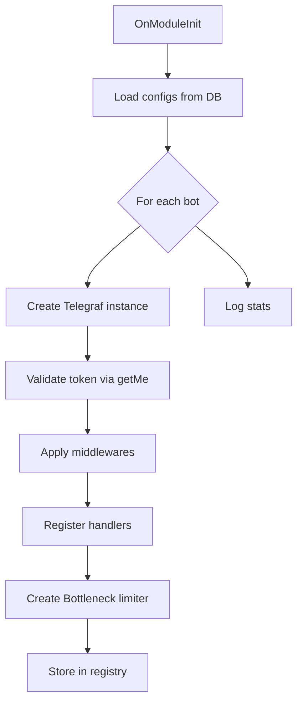
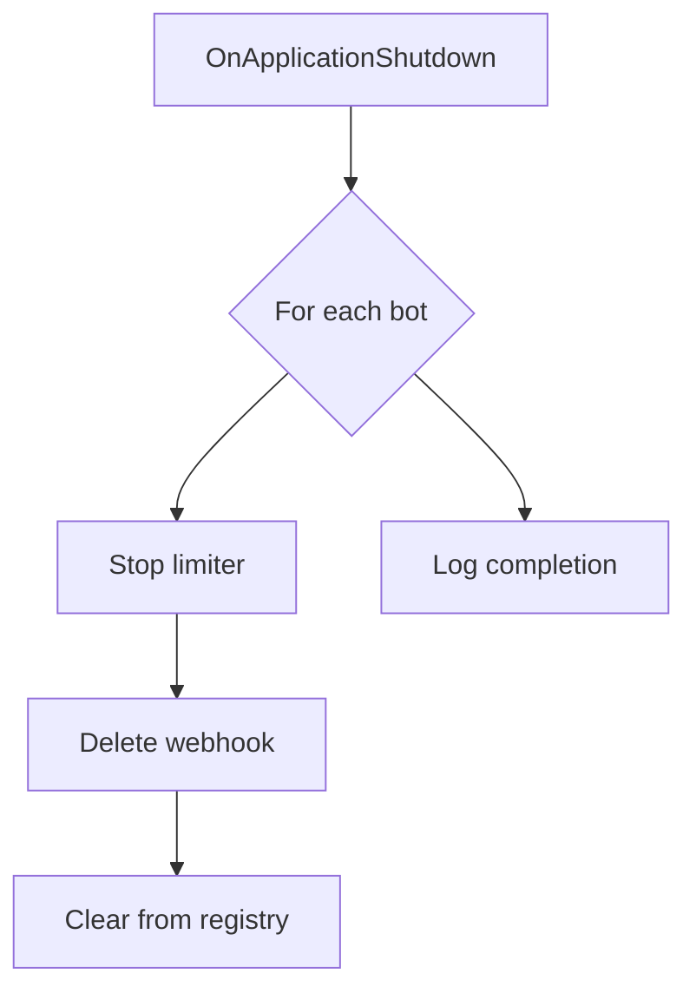

# ADR-COMMON: Multi-Bot Context Patterns

## Status

Proposed

## Context

The Quantum Deal platform operates a multi-bot architecture where multiple Telegram bots serve different broker partnerships through branded experiences. This ADR consolidates common patterns and decisions for handling multi-bot context across the codebase.

### Background

The platform supports three tiers of bots:

| Tier | Bot Type | botId Value | Configuration | Example |
|------|----------|-------------|---------------|---------|
| 1 | Master Bot | Excluded from signals | Environment + Code | QuantumDealMasterBot |
| 2 | Static Bot | `1` (database ID) | Environment + Code | QuantumDealBot |
| 3 | Dynamic Bots | Database ID (2, 3, ...) | Database-driven | Partner bots |

### Critical Issue: botId Convention Discrepancy

**Problem Identified**: ADR-004 and ADR-007 documented `botId: null` for the static QuantumDealBot, but the actual implementation uses `botId: 1`.

**Evidence from Code**:

```typescript
// libs/framework/src/webhook/bot-registry.service.ts (lines 74-82)
if (this.staticBotSignalsEnabled) {
  bots.push({
    botId: 1,  // ACTUAL: Uses botId: 1
    name: 'QuantumDealBot',
    instance: this.staticBot as unknown as Telegraf<Context>,
    limiter: this.staticBotLimiter,
    type: 'static',
  });
}
```

**Contradiction in Interface Documentation**:

```typescript
// libs/framework/src/webhook/bot-registry.interface.ts
/**
 * @remarks
 * - Static bot (QuantumDealBot): botId = null  // DOCUMENTED: null
 * - Dynamic bots: botId = database ID
 */
export interface SignalCapableBot {
  botId: number | null;  // Type allows null but implementation uses 1
  ...
}
```

### Technical Constraints

- **Database Schema**: `bots` table uses auto-incrementing integer IDs starting from 1
- **Existing Data**: Static bot already has `id: 1` in the database
- **Repository Pattern**: `findBySectorForBot(sector, botId)` expects `number`, not `number | null`
- **Rate Limiting**: Each bot needs its own Bottleneck instance regardless of botId value

### Related Documents

- **ADR-004**: Multi-Bot Database Architecture (Decision 6: Dynamic Bot Registration)
- **ADR-006**: Dynamic Telegraf Module Loading Pattern
- **ADR-007**: Multi-Bot Signal Broadcasting Architecture

---

## Decision

### botId Convention (Resolution)

**Selected Option: Use Database ID for All Bots (Option A)**

All bots, including the static QuantumDealBot, use their database ID as `botId`. The static bot uses `botId: 1` (its actual database record ID).

### Options Considered

#### Option A (Selected): Database ID for All Bots

- **Overview**: Every bot uses its database ID. Static bot = `1`, dynamic bots = `2, 3, ...`
- **Pros**:
  - **Data Integrity**: Actual foreign key references work correctly
  - **Query Simplicity**: No special handling for `NULL` in SQL queries
  - **Repository Consistency**: `findBySectorForBot(sector, botId: number)` works uniformly
  - **Current Implementation**: Matches what the code actually does today
  - **Database Consistency**: All bots exist in `bots` table with real IDs
- **Cons**:
  - Requires updating ADR-004/ADR-007 documentation to match reality
  - Type definition `number | null` needs cleanup
- **Effort**: 1 day (documentation update + type cleanup)

#### Option B: Use NULL for Static Bot

- **Overview**: Static bot uses `botId: null`, dynamic bots use database IDs
- **Pros**:
  - Explicit semantic distinction between static and dynamic bots
  - Matches original ADR-004/ADR-007 documentation
- **Cons**:
  - **SQL Complexity**: Requires `botId IS NULL OR botId = ?` in all queries
  - **Repository Refactoring**: `findBySectorForBot` needs signature change
  - **Breaking Change**: Current implementation uses `botId: 1`
  - **Data Model Conflict**: Static bot has real database ID, using NULL ignores it
  - **Index Inefficiency**: NULL values complicate index usage
- **Effort**: 5-7 days (significant refactoring)

#### Option C: Hybrid with Sentinel Value

- **Overview**: Use `botId: 0` or negative value as sentinel for static bot
- **Pros**:
  - No NULL handling needed
  - Type remains `number`
- **Cons**:
  - Magic number anti-pattern
  - Not a real database ID
  - Confusing for developers
- **Effort**: 3-4 days

### Comparison Matrix

| Evaluation Axis | Option A (DB ID) | Option B (NULL) | Option C (Sentinel) |
|-----------------|------------------|-----------------|---------------------|
| Query Simplicity | High | Low | Medium |
| Type Safety | High | Medium | Medium |
| Data Integrity | High | Low | Low |
| Implementation Effort | 1 day | 5-7 days | 3-4 days |
| Breaking Change Risk | None | High | Medium |
| Semantic Clarity | High | High | Low |

### Rationale

**Option A is selected** because:

1. **Reality Alignment**: The code already implements `botId: 1` for the static bot. The documentation was incorrect, not the implementation.

2. **Database Consistency**: The static bot has a real database record with `id: 1`. Using NULL would create a disconnect between the `SignalCapableBot.botId` and the actual `bots.id`.

3. **Query Simplicity**: Using real database IDs eliminates the need for `OR botId IS NULL` conditions in every query:

   ```sql
   -- With Option A (simple)
   WHERE bot_users.bot_id = $1

   -- With Option B (complex, index-unfriendly)
   WHERE (bot_users.bot_id = $1 OR ($1 IS NULL AND bot_users.bot_id = 1))
   ```

4. **Type System Benefits**: The `type: 'static' | 'dynamic'` discriminator in `SignalCapableBot` provides semantic distinction without needing NULL botId.

---

## Common Multi-Bot Patterns

### Pattern 1: BotRegistry Facade

The `BotRegistryService` provides unified access to all signal-capable bots.

**Interface**:

```typescript
interface SignalCapableBot {
  botId: number;           // Database ID (1 for static, 2+ for dynamic)
  name: string;            // Bot display name
  instance: Telegraf;      // Telegraf bot instance
  limiter: Bottleneck;     // Per-bot rate limiter
  type: 'static' | 'dynamic';  // Type discriminator
  settings?: BotSettings;  // Optional bot settings
}

interface BotRegistry {
  getSignalCapableBots(): SignalCapableBot[];
  getBot(botId: number): SignalCapableBot | undefined;
  hasBot(botId: number): boolean;
}
```

**Usage**:

```typescript
// Get all bots for broadcasting
const bots = botRegistryService.getSignalCapableBots();

for (const bot of bots) {
  // Type discriminator for bot-specific logic
  if (bot.type === 'static') {
    // Static bot specific handling
  }

  // botId always valid for queries
  const users = await subscriptionsRepo.findBySectorForBot(sector, bot.botId);
}
```

### Pattern 2: Bot-Scoped Queries

Repository methods accept `botId: number` for bot-scoped filtering.

**Implementation**:

```typescript
// libs/db/src/repositories/subscriptions.repository.ts
async findBySectorForBot(
  sector: string,
  botId: number,  // Always a real database ID
): Promise<SubscriptionWithFeatures[]> {
  return this.db
    .select({...})
    .from(subscriptions)
    .innerJoin(botUsers, ...)
    .where(
      and(
        eq(botUsers.botId, botId),  // Simple equality, no NULL handling
        // ... other conditions
      ),
    );
}
```

### Pattern 3: Per-Bot Rate Limiting

Each bot maintains its own Bottleneck instance for Telegram API rate limiting.

**Configuration**:

```typescript
// Standard rate limiter config (28 msg/sec per bot)
const bottleneckConfig = {
  maxConcurrent: 4,
  minTime: 30,
  reservoir: 28,
  reservoirRefreshAmount: 28,
  reservoirRefreshInterval: 1000,
};
```

**Lifecycle**:

```typescript
// Creation (during bot initialization)
const limiter = new Bottleneck(bottleneckConfig);
limiter.on('error', (error) => {
  logger.error(`Bottleneck error for bot "${botName}":`, error);
});

// Shutdown (during graceful shutdown)
await limiter.stop({ dropWaitingJobs: false });
```

### Pattern 4: Context Propagation

User context includes bot association via `bot_users` table.

**Data Model**:

```
users (global identity)
  |
  +-- bot_users (per-bot settings)
        |
        +-- user_subscriptions (per-bot subscriptions)
```

**Context Extension**:

```typescript
interface UserContext extends Context {
  user?: UserWithSubscriptions;  // Includes bot-scoped data
}
```

### Pattern 5: Bot-Specific Localization

The `LocalizationService` provides bot-scoped message resolution.

**Fallback Hierarchy**:
1. `bot_messages` (bot-specific override)
2. `messages` (global default)
3. i18n registry (hardcoded fallback)
4. Key itself (last resort)

**Usage**:

```typescript
// Bot-scoped localization
const text = await localizationService
  .forBot(botId)  // botId: number (1 for static, 2+ for dynamic)
  .lang(userLang)
  .t('welcome', { name: user.firstName });
```

### Pattern 6: Dynamic Bot Lifecycle

Dynamic bots are managed by `DynamicTelegrafService` with proper lifecycle.

**Initialization Flow**:



**Shutdown Flow**:



---

## Consequences

### Positive Consequences

- **Unified Query Pattern**: All bot-scoped queries use `botId: number` without NULL handling
- **Type Safety**: Clear type definitions without optional NULL states
- **Data Integrity**: Foreign key relationships maintain consistency
- **Performance**: Index-friendly queries without NULL conditions
- **Semantic Clarity**: `type: 'static' | 'dynamic'` provides clear bot classification

### Negative Consequences

- **Documentation Drift**: ADR-004/ADR-007 need updates to reflect actual implementation
- **Interface Cleanup**: `botId: number | null` type needs updating to `botId: number`

### Neutral Consequences

- **No Code Changes**: Implementation already uses `botId: 1` for static bot
- **Database Unchanged**: Existing schema and data remain valid

---

## Implementation Guidance

### Type Definition Updates (Required)

Update the `SignalCapableBot` interface to remove NULL from botId:

```typescript
// BEFORE
interface SignalCapableBot {
  botId: number | null;  // Documented but not used
  ...
}

// AFTER
interface SignalCapableBot {
  botId: number;  // Database ID for all bots (1 = static, 2+ = dynamic)
  type: 'static' | 'dynamic';  // Use type discriminator for bot classification
  ...
}
```

### Documentation Updates (Required)

- Update ADR-004 section "Decision 4: Bot Identification" to use `botId: 1`
- Update ADR-007 diagrams showing `botId=null` to `botId=1`
- Update interface JSDoc comments to reflect actual behavior

### Bot Classification Principles

- **Use `type` discriminator** for static vs dynamic bot logic
- **Use `botId`** only for database operations and rate limiting
- **Never rely on** `botId === 1` as a static bot check; use `type === 'static'`

### Query Pattern Principles

- **Always use real botId** in database queries
- **No NULL handling** in bot-scoped WHERE clauses
- **Index usage** remains efficient with equality conditions

### Rate Limiting Principles

- **One limiter per bot** regardless of bot type
- **Standard configuration** (28 msg/sec) for all bots
- **Graceful shutdown** stops limiter before webhook deletion

---

## Implementation Status

### Type Definitions Gap

> **Current State**: The interface definitions have not been updated to reflect the Decision in this ADR.

| Interface | ADR Decision | Current Code | Status |
|-----------|--------------|--------------|--------|
| SignalCapableBot.botId | `number` | `number \| null` | Needs update |
| BotRegistry.getBot(botId) | `number` | `number \| null` | Needs update |
| BotRegistry.hasBot(botId) | `number` | `number \| null` | Needs update |

### JSDoc Documentation Gap

JSDoc comments in interface files still reference `botId = null` for static bot.

**Files requiring update:**
- `libs/bot/src/interfaces/bot-registry.interface.ts`
- `libs/framework/src/webhook/bot-registry.interface.ts`

### Known Issues

- **Duplicate Interfaces**: BotRegistry interface is duplicated in `libs/bot/src` and `libs/framework/src`
- **Recommendation**: Consolidate to single location in `libs/framework/src` and re-export from `libs/bot/src`

---

## Related Information

### Affected Files

**Type Definition Updates**:
- `libs/framework/src/webhook/bot-registry.interface.ts` - Remove `null` from `botId` type

**Documentation Updates**:
- `docs/adr/ADR-004-multi-bot-architecture.md` - Update botId references
- `docs/adr/ADR-007-multi-bot-signal-broadcasting.md` - Update diagrams and examples

### Implementation Files (Reference)

- `libs/framework/src/webhook/bot-registry.service.ts` - BotRegistryService implementation
- `libs/telegraf/src/services/dynamic-telegraf.service.ts` - Dynamic bot lifecycle
- `libs/db/src/repositories/subscriptions.repository.ts` - Bot-scoped queries
- `libs/framework/src/localization/localization.service.ts` - Bot-scoped localization

### Related ADRs

- **ADR-004**: Multi-Bot Database Architecture
- **ADR-006**: Dynamic Telegraf Module Loading Pattern
- **ADR-007**: Multi-Bot Signal Broadcasting Architecture

---

## Decision Record

| Attribute | Value |
|-----------|-------|
| **Decision Date** | 2025-12-10 |
| **Decision Status** | Proposed |
| **Scope** | Common pattern for all multi-bot implementations |
| **Related ADRs** | ADR-004, ADR-006, ADR-007 |

---

## Change History

| Version | Date | Author | Changes |
|---------|------|--------|---------|
| 1.0.0 | 2025-12-10 | Claude Code Architecture Agent | Initial version - botId convention resolution and common patterns consolidation |
| 1.1.0 | 2025-12-11 | Claude Code Architecture Agent | Added Implementation Status section documenting type definition gaps, JSDoc gaps, and duplicate interface issue |

---

**Document Version**: 1.1.0
**Created**: 2025-12-10
**Last Updated**: 2025-12-11
**Author**: Claude Code Architecture Agent
