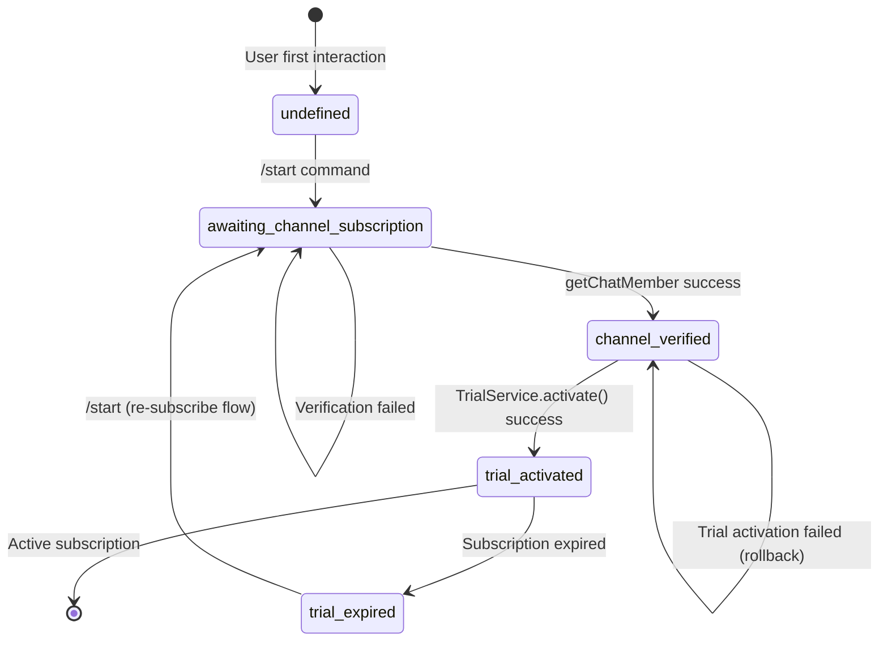

# ADR-COMMON: Partner Flow Patterns

## Status

Proposed

## Context

The partner bot implements a multi-step onboarding flow where users must verify channel subscription before receiving trial access. This ADR consolidates common patterns, anti-patterns, and implementation guidance for handling the partner flow across the codebase.

### Business Requirements

Partners need measurable lead generation through Telegram channel subscriptions. The partner flow gates trial access behind channel membership verification, creating a value exchange: users join partner channels before accessing premium trading signal features.

### Technical Complexity

**Complexity Rating**: 4/5 stars

The partner flow presents several technical challenges:

1. **State Machine Management**: 4-state flow with conditional transitions
2. **External API Dependencies**: Telegram `getChatMember` API with rate limits
3. **Race Conditions**: Rapid button clicks during verification
4. **State Consistency**: Verification success but trial activation failure scenarios
5. **Channel Resolution**: ID vs Username handling
6. **Retry Logic**: Backoff strategies with attempt tracking

### State Transition Diagram



### Related Documents

- **ADR-008**: Partner Bot Flow Architecture (architectural decisions)
- **ADR-COMMON-multi-bot-context**: Multi-bot context patterns (botId handling)
- **ADR-004**: Multi-Bot Database Architecture

---

## Decision

This ADR documents common patterns for partner flow implementation across the codebase.

---

## Pattern 1: State Machine Design

### State Type Definition

```typescript
// libs/partner-bot/src/types/scene-data.types.ts
export type VerificationStateValue =
  | 'awaiting_channel_subscription'
  | 'channel_verified'
  | 'trial_activated'
  | 'trial_expired';

export interface PartnerFlowSceneData extends Record<string, unknown> {
  verificationState?: VerificationStateValue;
  verificationAttempts?: number;
  lastVerificationAttempt?: Date | string;
  trialActivatedAt?: Date | string;
  trialExpiresAt?: Date | string;
}
```

### State Storage Location

State is stored in `bot_users.state.sceneData` (JSONB column):

```typescript
// State update pattern
const state: BotUserState = {
  currentScene: 'partner_flow',
  sceneData: {
    verificationState: 'awaiting_channel_subscription',
    verificationAttempts: 0,
    lastVerificationAttempt: new Date().toISOString(),
  } as PartnerFlowSceneData,
};
await this.botUsersRepository.updateState(userId, botId, state);
```

### State Transition Rules

| Current State | Trigger | Next State | Condition |
|--------------|---------|------------|-----------|
| `undefined` | `/start` | `awaiting_channel_subscription` | Always |
| `awaiting_channel_subscription` | Verify button | `channel_verified` | `getChatMember` returns valid status |
| `awaiting_channel_subscription` | Verify button | `awaiting_channel_subscription` | `getChatMember` returns invalid status |
| `channel_verified` | Trial activation | `trial_activated` | `TrialService.activate()` success |
| `channel_verified` | Trial activation | `channel_verified` | `TrialService.activate()` failure (rollback) |
| `trial_activated` | Subscription expires | `trial_expired` | `expiresAt < now` |
| `trial_expired` | `/start` | `awaiting_channel_subscription` | Re-subscribe flow |

### Anti-Pattern: Direct State Manipulation

```typescript
// WRONG: Direct JSONB field update without type safety
await db.update(botUsers)
  .set({ state: { verification: 'channel_verified' } })
  .where(eq(botUsers.id, id));

// CORRECT: Use repository method with typed interface
const state: BotUserState = {
  currentScene: 'partner_flow',
  sceneData: {
    verificationState: 'channel_verified',
    verificationAttempts: currentAttempts + 1,
    lastVerificationAttempt: new Date().toISOString(),
  } as PartnerFlowSceneData,
};
await this.botUsersRepository.updateState(userId, botId, state);
```

---

## Pattern 2: Channel Verification Flow

### getChatMember API Usage

```typescript
// libs/partner-bot/src/services/channel-verifier.service.ts
async verifyMembership(
  channelId: string,
  userId: number,
  botId: number,
): Promise<boolean> {
  const bot = this.dynamicTelegrafService.getBot(botId);
  if (!bot) {
    throw new Error(`Bot with ID ${botId} not found`);
  }

  return retryWithBackoff(
    async () => {
      const chatMember = await bot.telegram.getChatMember(channelId, userId);
      const validStatuses = ['member', 'administrator', 'creator'];
      return validStatuses.includes(chatMember.status);
    },
    { maxRetries: 3, delays: [1000, 2000, 4000] },
  );
}
```

### Valid Membership Statuses

| Status | Valid | Description |
|--------|-------|-------------|
| `member` | Yes | Regular channel member |
| `administrator` | Yes | Channel administrator |
| `creator` | Yes | Channel owner |
| `left` | No | User left the channel |
| `kicked` | No | User was banned |
| `restricted` | No | User has restrictions |

### Telegram API Error Handling

```typescript
// Error classification for retry logic
const telegramError = error as TelegramError;
const errorCode = telegramError.response?.error_code;

// Non-retryable errors (400, 403) - return false
if (errorCode === 400 || errorCode === 403) {
  return false; // User not in channel or channel not accessible
}

// Retryable errors (500, 503, 429) - throw to trigger retry
if (errorCode === 500 || errorCode === 503 || errorCode === 429) {
  throw error; // Will be retried with backoff
}
```

| Error Code | Description | Action |
|------------|-------------|--------|
| 400 | Bad Request (USER_ID_INVALID, chat not found) | Return `false` |
| 403 | Forbidden (bot not in channel) | Return `false` |
| 429 | Too Many Requests | Retry with backoff |
| 500 | Internal Server Error | Retry with backoff |
| 503 | Service Unavailable | Retry with backoff |

---

## Pattern 3: Rate Limiting

### Telegram API Rate Limits

**Important**: Telegram API has an undocumented rate limit of approximately 1 request per second for `getChatMember`.

### Per-User Rate Limiting Implementation

```typescript
// libs/partner-bot/src/services/channel-verifier.service.ts
private readonly RATE_LIMIT_MAX_ATTEMPTS = 10;
private readonly RATE_LIMIT_WINDOW_MS = 60 * 60 * 1000; // 1 hour

async isRateLimited(userId: number, botId: number): Promise<boolean> {
  const botUser = await this.botUsersRepository.findByUserAndBot(userId, botId);
  const sceneData = botUser?.state?.sceneData as PartnerFlowSceneData | undefined;

  const attempts = sceneData?.verificationAttempts ?? 0;
  const lastAttempt = sceneData?.lastVerificationAttempt
    ? new Date(sceneData.lastVerificationAttempt)
    : null;

  if (attempts < this.RATE_LIMIT_MAX_ATTEMPTS) {
    return false;
  }

  if (!lastAttempt) {
    return false;
  }

  const timeSinceLastAttempt = Date.now() - lastAttempt.getTime();
  return timeSinceLastAttempt <= this.RATE_LIMIT_WINDOW_MS;
}
```

### Rate Limit Configuration

| Parameter | Value | Rationale |
|-----------|-------|-----------|
| Max Attempts | 10 per user | Prevent abuse while allowing retry |
| Window | 1 hour | Reasonable cooling period |
| Reset | After window expiry | Automatic reset, no manual intervention |

### Anti-Pattern: No Rate Limiting

```typescript
// WRONG: No protection against rapid button clicks
@Action(CALLBACK_DATA.VERIFY_SUBSCRIPTION)
async handleVerify(@Ctx() ctx: PartnerBotContext): Promise<void> {
  // Immediately call Telegram API without rate check
  const isMember = await this.channelVerifierService.verifyMembership(...);
}

// CORRECT: Check rate limit before API call
@Action(CALLBACK_DATA.VERIFY_SUBSCRIPTION)
async handleVerify(@Ctx() ctx: PartnerBotContext): Promise<void> {
  const isLimited = await this.channelVerifierService.isRateLimited(userId, botId);
  if (isLimited) {
    await ctx.reply(await l10n.t(MESSAGE_KEYS.RATE_LIMIT));
    return;
  }
  // Proceed with verification
}
```

---

## Pattern 4: Retry Logic with Exponential Backoff

### Retry Utility Implementation

```typescript
// libs/partner-bot/src/utils/retry.utils.ts
export interface RetryOptions {
  maxRetries: number;
  delays: number[];
}

export async function retryWithBackoff<T>(
  fn: () => Promise<T>,
  options: RetryOptions = { maxRetries: 3, delays: [1000, 2000, 4000] },
): Promise<T> {
  let lastError: Error | undefined;

  for (let attempt = 0; attempt <= options.maxRetries; attempt++) {
    try {
      return await fn();
    } catch (error) {
      lastError = error instanceof Error ? error : new Error(String(error));
      if (attempt < options.maxRetries) {
        const delay = options.delays[attempt] ?? options.delays[options.delays.length - 1];
        await sleep(delay);
      }
    }
  }

  throw lastError ?? new Error('All retry attempts failed');
}
```

### Retry Configuration

| Attempt | Delay | Cumulative Time |
|---------|-------|-----------------|
| 1 | 1000ms | 1s |
| 2 | 2000ms | 3s |
| 3 | 4000ms | 7s |
| Failure | - | Throw error |

### When to Retry vs When to Fail Fast

| Scenario | Action | Rationale |
|----------|--------|-----------|
| Network timeout | Retry | Transient issue |
| 429 Too Many Requests | Retry | Rate limit will clear |
| 500/503 Server Error | Retry | Server-side transient issue |
| 400 Bad Request | Fail fast | User/channel issue, won't change |
| 403 Forbidden | Fail fast | Permission issue, won't change |

---

## Pattern 5: Race Condition Prevention

### Problem: Rapid Button Clicks

Users may click "I subscribed" button multiple times rapidly, causing:
1. Multiple concurrent API calls
2. State inconsistency
3. Duplicate trial activations

### Solution: Answer Callback Query First

```typescript
// libs/partner-bot/src/actions/channel-verification.action.ts
@Action(CALLBACK_DATA.VERIFY_SUBSCRIPTION)
async handleVerify(@Ctx() ctx: PartnerBotContext): Promise<void> {
  try {
    // Answer callback query IMMEDIATELY
    // This dismisses the loading state and prevents duplicate processing
    await ctx.answerCbQuery();

    // Proceed with verification logic
    const isMember = await this.channelVerifierService.verifyMembership(...);
    // ...
  } catch (error) {
    // Error handling
  }
}
```

### Solution: State-Based Idempotency

```typescript
// Check current state before processing
const botUser = await this.botUsersRepository.findByUserAndBot(userId, botId);
const sceneData = botUser?.state?.sceneData as PartnerFlowSceneData | undefined;

// Skip if already verified/activated
if (sceneData?.verificationState === 'trial_activated') {
  await this.partnerFlowService.sendTrialUI(userId, botId, lang, expiresAt);
  return; // Already activated, show status instead
}
```

### Anti-Pattern: No Idempotency Check

```typescript
// WRONG: Always process without checking current state
@Action(CALLBACK_DATA.VERIFY_SUBSCRIPTION)
async handleVerify(@Ctx() ctx: PartnerBotContext): Promise<void> {
  // No state check - may duplicate trial activation
  const result = await this.partnerFlowService.handleVerificationRequest(...);
}

// CORRECT: Check state before processing
@Action(CALLBACK_DATA.VERIFY_SUBSCRIPTION)
async handleVerify(@Ctx() ctx: PartnerBotContext): Promise<void> {
  const currentState = await this.getCurrentVerificationState(userId, botId);
  if (currentState === 'trial_activated') {
    // Show existing trial status instead of re-activating
    return this.showTrialStatus(ctx);
  }
  // Proceed with verification
}
```

### Implementation Gap: Pattern 5

> **Current Implementation**: The idempotency check for already-activated trials is **not implemented** in `channel-verification.action.ts`.

**Expected** (per ADR):
```typescript
if (sceneData?.verificationState === 'trial_activated') {
  await this.partnerFlowService.sendTrialUI(userId, botId, lang, expiresAt);
  return; // Already activated, show status instead
}
```

**Actual**: Handler proceeds directly to `verifyMembership()` without state check (see `channel-verification.action.ts:55-124`).

**Impact**:
- Unnecessary Telegram API calls for users with active trials
- Potential confusing UX (re-verification of already verified users)

**Recommendation**: Add state check before verification in `channel-verification.action.ts:77` (after `answerCbQuery()` and before language resolution)

---

## Pattern 6: State Inconsistency Recovery

### Problem: Verification Succeeds but Trial Activation Fails

Scenario:
1. User clicks "I subscribed"
2. `getChatMember` returns `member` (success)
3. State updated to `channel_verified`
4. `TrialService.activate()` fails (database error, etc.)
5. User is stuck in `channel_verified` state without trial

### Solution: State Rollback on Failure

```typescript
// libs/partner-bot/src/services/partner-flow.service.ts
async handleVerificationRequest(
  userId: number,
  botId: number,
): Promise<VerificationResult> {
  // Step 1: Verify membership
  const isMember = await this.channelVerifierService.verifyMembership(...);
  if (!isMember) {
    return { verified: false, error: 'Not subscribed to channel' };
  }

  // Step 2: Update state to channel_verified
  const verifiedState: BotUserState = {
    currentScene: 'partner_flow',
    sceneData: { verificationState: 'channel_verified' } as PartnerFlowSceneData,
  };
  await this.botUsersRepository.updateState(userId, botId, verifiedState);

  // Step 3: Attempt trial activation
  const activationResult = await this.trialService.activate(botUser.id);

  if (!activationResult.success) {
    // ROLLBACK: Revert state to channel_verified (not awaiting)
    // User can retry without re-subscribing
    const revertState: BotUserState = {
      currentScene: 'partner_flow',
      sceneData: { verificationState: 'channel_verified' } as PartnerFlowSceneData,
    };
    await this.botUsersRepository.updateState(userId, botId, revertState);

    this.logger.error({
      message: 'Trial activation failed',
      userId,
      botId,
      error: activationResult.error,
    });

    return { verified: false, error: activationResult.error ?? 'Trial activation failed' };
  }

  // Step 4: Update state to trial_activated
  const activatedState: BotUserState = {
    currentScene: 'partner_flow',
    sceneData: {
      verificationState: 'trial_activated',
      trialActivatedAt: new Date().toISOString(),
      trialExpiresAt: activationResult.expiresAt?.toISOString(),
    } as PartnerFlowSceneData,
  };
  await this.botUsersRepository.updateState(userId, botId, activatedState);

  return { verified: true, trialExpiresAt: activationResult.expiresAt };
}
```

### Recovery Matrix

| Verification | Trial Activation | Final State | User Action |
|--------------|------------------|-------------|-------------|
| Success | Success | `trial_activated` | Show trial UI |
| Success | Failure | `channel_verified` | Retry (skip verification) |
| Failure | N/A | `awaiting_channel_subscription` | Subscribe and retry |

---

## Pattern 7: Channel ID vs Username Resolution

### Channel Identifier Formats

| Format | Example | Source |
|--------|---------|--------|
| Username | `@channelname` | Public channels |
| Numeric ID | `-1001234567890` | Private channels, bot settings |
| Custom Name | `My Channel` | Display override |

### Resolution Utility

```typescript
// libs/partner-bot/src/utils/channel.utils.ts
export interface ChannelInfo {
  name: string;  // Display name (without @)
  url: string;   // Full URL to channel
}

export function resolveChannelInfo(
  channelId: string,
  customName?: string,
): ChannelInfo {
  const isUsername = channelId.startsWith('@');
  const nameFromId = isUsername ? channelId.substring(1) : channelId;

  return {
    name: customName ?? nameFromId,
    url: `https://t.me/${nameFromId}`,
  };
}
```

### Usage Examples

```typescript
// Username format
resolveChannelInfo('@tradepro_signals')
// => { name: 'tradepro_signals', url: 'https://t.me/tradepro_signals' }

// Username with custom name
resolveChannelInfo('@tradepro_signals', 'TradePro Signals')
// => { name: 'TradePro Signals', url: 'https://t.me/tradepro_signals' }

// Numeric ID (private channel)
resolveChannelInfo('-1001234567890', 'Partner Channel')
// => { name: 'Partner Channel', url: 'https://t.me/-1001234567890' }
```

### Anti-Pattern: Hardcoded Channel References

```typescript
// WRONG: Hardcoded channel reference
const channelUrl = 'https://t.me/tradepro_signals';
const message = `Subscribe to ${channelUrl}`;

// CORRECT: Use settings and resolver
const settings = await this.botSettingsRepository.findByBotId(botId);
const channelId = settings?.settings?.channelId;
const channel = resolveChannelInfo(channelId, settings?.settings?.channelName);
const message = await l10n.t('partner_channel_prompt', {
  channelUrl: channel.url,
  channelName: channel.name,
});
```

---

## Pattern 8: Referral URL Validation

### Conditional Button Type Selection

Partner bots may have a referral URL for trial extension. The button type depends on URL validity:

```typescript
// libs/partner-bot/src/utils/url-validation.utils.ts
export function isValidHttpsUrl(url: string | undefined): url is string {
  if (!url || typeof url !== 'string') {
    return false;
  }
  try {
    const urlObj = new URL(url);
    return urlObj.protocol === 'https:';
  } catch {
    return false;
  }
}
```

### Button Type Decision

```typescript
// libs/partner-bot/src/services/partner-flow.service.ts
const referralUrl = settings?.referralUrl;

// Create extend trial button conditionally
const extendTrialButton = isValidHttpsUrl(referralUrl)
  ? { text: extendTrialButtonText, url: referralUrl }  // URL button
  : { text: extendTrialButtonText, callback_data: CALLBACK_DATA.EXTEND_TRIAL };  // Callback button
```

| referralUrl | Button Type | Behavior |
|-------------|-------------|----------|
| `https://partner.com/signup` | `url` | Opens external link |
| `http://partner.com/signup` | `callback_data` | Triggers callback (non-HTTPS rejected) |
| `undefined` | `callback_data` | Triggers callback |
| `invalid` | `callback_data` | Triggers callback |

---

## Pattern 9: Log Masking for Privacy

### Sensitive Data Masking

```typescript
// libs/partner-bot/src/utils/log-masking.utils.ts
export function maskUserId(userId: number): string {
  const userIdStr = userId.toString();
  if (userIdStr.length <= 4) {
    return `***${userIdStr}`;
  }
  return `***${userIdStr.slice(-4)}`;
}

export function maskChannelId(channelId: string): string {
  if (channelId.startsWith('@')) {
    if (channelId.length <= 5) {
      return channelId;
    }
    return `@***${channelId.slice(-4)}`;
  }
  if (channelId.length <= 4) {
    return `***${channelId}`;
  }
  return `***${channelId.slice(-4)}`;
}
```

### Usage in Logging

```typescript
// CORRECT: Masked sensitive data in logs
this.logger.debug({
  message: 'Channel membership verification completed',
  userId: maskUserId(userId),      // "***6789" instead of "123456789"
  channelId: maskChannelId(channelId),  // "@***nnel" instead of "@mychannel"
  status: chatMember.status,
  isValid,
});

// WRONG: Raw sensitive data in logs
this.logger.debug({
  message: 'Channel verification',
  userId,      // Exposes full user ID
  channelId,   // Exposes channel identifier
});
```

---

## Pattern 10: Attempt Tracking

### Verification Attempts Storage

```typescript
interface PartnerFlowSceneData {
  verificationAttempts?: number;        // Counter
  lastVerificationAttempt?: Date | string;  // Timestamp
}
```

### Increment on Each Attempt

```typescript
// libs/partner-bot/src/services/partner-flow.service.ts
const currentAttempts = sceneData?.verificationAttempts ?? 0;

// Increment attempts regardless of success/failure
const updateState: BotUserState = {
  currentScene: 'partner_flow',
  sceneData: {
    verificationState: 'awaiting_channel_subscription',
    verificationAttempts: currentAttempts + 1,
    lastVerificationAttempt: new Date().toISOString(),
  } as PartnerFlowSceneData,
};
await this.botUsersRepository.updateState(userId, botId, updateState);
```

### Attempt Tracking Use Cases

1. **Rate Limiting**: Prevent abuse (>10 attempts/hour)
2. **Analytics**: Track verification funnel drop-off
3. **Debugging**: Identify problematic users/channels
4. **User Experience**: Show appropriate messages based on attempt count

---

## Consequences

### Positive Consequences

- **Reliable Verification**: Retry logic handles transient API failures
- **User Protection**: Rate limiting prevents abuse
- **State Consistency**: Rollback mechanism prevents stuck states
- **Privacy Compliance**: Log masking protects user data
- **Flexible Configuration**: Channel settings support multiple formats
- **Clear Flow**: State machine provides predictable transitions

### Negative Consequences

- **Complexity**: Multiple patterns increase learning curve
- **State Overhead**: JSONB state storage adds query complexity
- **API Dependency**: Telegram API availability affects verification
- **Rate Limit Discovery**: Telegram rate limits are undocumented

### Neutral Consequences

- **Backoff Delays**: 7 seconds maximum wait for retries
- **State Storage**: Uses existing `bot_users.state` JSONB field

---

## Implementation Compliance

| Pattern | Status | Notes |
|---------|--------|-------|
| Pattern 1: State Machine | 100% | All states and transitions match |
| Pattern 2: Channel Verification | 100% | getChatMember implementation correct |
| Pattern 3: Rate Limiting | 100% | 10 attempts/hour implemented |
| Pattern 4: Retry Logic | 100% | retryWithBackoff exists |
| Pattern 5: Race Condition Prevention | 90% | answerCbQuery implemented, idempotency check missing |
| Pattern 6: State Inconsistency Recovery | 100% | Rollback mechanism exists |
| Pattern 7: Channel ID Resolution | 100% | resolveChannelInfo utility exists |
| Pattern 8: Referral URL Validation | 100% | isValidHttpsUrl utility exists |
| Pattern 9: Log Masking | 100% | maskUserId/maskChannelId utilities exist |
| Pattern 10: Attempt Tracking | 100% | verificationAttempts tracking implemented |

---

## Implementation Guidance

### Service Injection Pattern

```typescript
@Injectable()
export class ChannelVerificationAction {
  constructor(
    private readonly channelVerifierService: ChannelVerifierService,
    private readonly partnerFlowService: PartnerFlowService,
    private readonly localizationService: LocalizationService,
    private readonly botUsersRepository: BotUsersRepository,
    private readonly botSettingsRepository: BotSettingsRepository,
  ) {}
}
```

### Feature Flag Gating

```typescript
// Only register on bots with partnerFlowEnabled = true
@Update()
@RequiresFeature(PARTNER_FLOW_FEATURE_KEY)
export class ChannelVerificationAction {}
```

### Error Message Localization

```typescript
// Use LocalizationService for user-facing messages
const l10n = this.localizationService.forBot(botId).lang(lang);
const failureMessage = await l10n.t(MESSAGE_KEYS.VERIFICATION_FAILED, {
  channelName: channel.name,
  channelUrl: channel.url,
});
```

### State Query Optimization

```typescript
// Query with state filter using JSONB operators
const usersAwaitingVerification = await db
  .select()
  .from(botUsers)
  .where(
    sql`${botUsers.state}->>'sceneData'->>'verificationState' = 'awaiting_channel_subscription'`
  );
```

---

## Related Information

### Key Files

| File | Purpose |
|------|---------|
| `libs/partner-bot/src/services/partner-flow.service.ts` | Flow orchestration |
| `libs/partner-bot/src/services/channel-verifier.service.ts` | Telegram API verification |
| `libs/bot/src/services/trial.service.ts` | Trial activation |
| `libs/partner-bot/src/types/scene-data.types.ts` | State type definitions |
| `libs/partner-bot/src/utils/retry.utils.ts` | Retry with backoff |
| `libs/partner-bot/src/utils/channel.utils.ts` | Channel resolution |
| `libs/partner-bot/src/utils/url-validation.utils.ts` | URL validation |
| `libs/partner-bot/src/utils/log-masking.utils.ts` | Privacy masking |
| `libs/partner-bot/src/constants.ts` | Callback data, message keys |

### Related ADRs

- **ADR-008**: Partner Bot Flow Architecture (decisions)
- **ADR-COMMON-multi-bot-context**: Multi-bot context patterns
- **ADR-004**: Multi-Bot Database Architecture
- **ADR-006**: Dynamic Telegraf Module Loading

### External References

- [Telegram Bot API - getChatMember](https://core.telegram.org/bots/api#getchatmember)
- [Telegram Bot API Changelog](https://core.telegram.org/bots/api-changelog)

---

## Decision Record

| Attribute | Value |
|-----------|-------|
| **Decision Date** | 2025-12-11 |
| **Decision Status** | Proposed |
| **Scope** | Common pattern for partner flow implementations |
| **Related ADRs** | ADR-008, ADR-004, ADR-COMMON-multi-bot-context |

---

## Change History

| Version | Date | Author | Changes |
|---------|------|--------|---------|
| 1.0.0 | 2025-12-11 | Claude Code Architecture Agent | Initial version - Partner flow patterns consolidation |
| 1.0.1 | 2025-12-11 | Claude Code Architecture Agent | Added Implementation Gap for Pattern 5, added Implementation Compliance table |

---

**Document Version**: 1.0.1
**Created**: 2025-12-11
**Last Updated**: 2025-12-11
**Author**: Claude Code Architecture Agent
