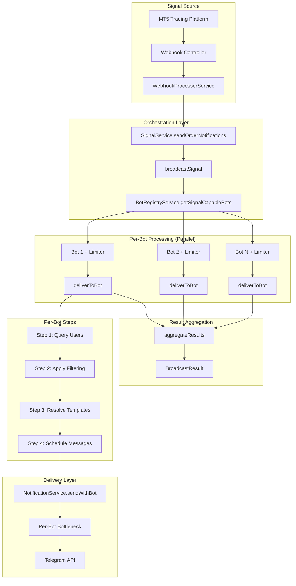
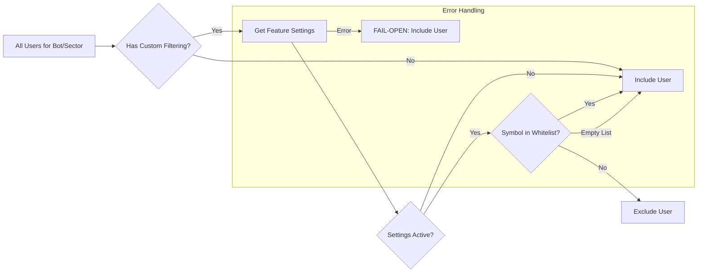

# ADR-COMMON: Signal Broadcasting Orchestration Patterns

## Status

Proposed

## Context

The Quantum Deal platform implements a multi-bot signal broadcasting system that distributes MT5 trading signals to users across multiple Telegram bots simultaneously. This is one of the most complex patterns in the codebase, requiring careful orchestration of parallel processing, per-bot rate limiting, user filtering, and error handling.

### Problem Domain

**Core Challenge**: Deliver a single MT5 signal event to N bots serving M users per bot in parallel, while maintaining:
- Fault isolation (one bot's failure does not block others)
- Per-bot rate limiting (respecting Telegram API limits)
- User-specific filtering (symbol whitelist per user)
- Bot-specific message templates (localized content)
- Consistent error reporting and aggregation

### Complexity Level

This pattern is rated **5/5 stars** for complexity due to:
1. **Fan-out parallelism**: 1 signal to N bots to M users = N*M potential messages
2. **Multiple filtering layers**: Sector, subscription, custom symbol filtering
3. **Distributed rate limiting**: Each bot has independent Bottleneck instance
4. **Async failure tracking**: Fire-and-forget Telegram API semantics
5. **Cross-component coordination**: 5+ services involved per broadcast

### Technical Constraints

- **Telegram API Limits**: 30 messages/second per bot token for broadcasts ([Telegram Bots FAQ](https://core.telegram.org/bots/faq))
- **Performance Requirement**: Signal delivery within 5 seconds of MT5 event
- **Tech Stack**: NestJS, Telegraf, Bottleneck (rate limiting), PostgreSQL, Drizzle ORM
- **Memory Bounds**: Node.js process heap limits apply to in-memory queues

### Related Documents

- **ADR-007**: Multi-Bot Signal Broadcasting Architecture (detailed decisions)
- **ADR-COMMON-multi-bot-context**: Multi-bot context and botId conventions
- **ADR-004**: Multi-Bot Database Architecture

---

## Decision

This ADR consolidates common patterns for multi-bot signal broadcasting into reusable guidance. The architecture follows the **Orchestrator Pattern** with **Parallel Delivery** and **Fault Isolation**.

### Core Architecture Pattern



### Data Flow Sequence

```
1. MT5 Event (OPEN/CLOSE/SLTP_UPDATE)
   |
   v
2. WebhookProcessorService validates and extracts sector
   |
   v
3. SignalService.broadcastSignal(order, eventType)
   |
   v
4. BotRegistryService.getSignalCapableBots()
   | Returns: [SignalCapableBot, SignalCapableBot, ...]
   | Each bot has: { botId, name, instance, limiter, type, settings }
   |
   v
5. Promise.all(bots.map(bot => deliverToBot(bot, order, eventType, sector)))
   |
   +--[For Each Bot in Parallel]--+
   |                               |
   v                               v
6a. SubscriptionsRepository.findBySectorForBot(sector, bot.botId)
    | Returns: Users subscribed to THIS bot for THIS sector
    |
    v
6b. applyCustomFiltering(users, order.symbol)
    | Filters users based on their symbol whitelist
    | Uses FAIL-OPEN pattern (returns user on error)
    |
    v
6c. LocalizationService.forBot(botId).lang(userLang).t(eventType)
    | Resolves bot-specific message template
    |
    v
6d. NotificationService.sendWithBot(bot.limiter, telegramId, botId, message, options)
    | Schedules message with per-bot rate limiter
    | Fire-and-forget semantics (async delivery)
    |
    v
7. Aggregate per-bot results
   |
   v
8. Return BroadcastResult with per-bot statistics
```

---

## Rationale

### Why Orchestrator Pattern?

| Alternative | Drawback |
|-------------|----------|
| Event Bus (pub/sub) | Harder to aggregate results, complex error correlation |
| Direct service calls | Tight coupling, no centralized coordination |
| Queue-based (Redis/Bull) | Over-engineering for current scale, added infrastructure |
| **Orchestrator (Selected)** | Clear control flow, easy testing, simple result aggregation |

### Why Promise.all for Parallelism?

```typescript
// Current implementation: Parallel delivery
const deliveryPromises = bots.map((bot) =>
  this.deliverToBot(bot, order, eventType, sector)
);
const perBotResults = await Promise.all(deliveryPromises);

// Alternative: Sequential (NOT USED - slower)
for (const bot of bots) {
  const result = await this.deliverToBot(bot, order, eventType, sector);
  perBotResults.push(result);
}
```

**Benefits**:
- All bots process simultaneously
- Total time = max(per-bot times), not sum
- Natural fault isolation - each Promise resolves independently

### Why Per-Bot Bottleneck Instances?

Each bot token has its own Telegram API rate limit. Sharing a single limiter would:
1. Under-utilize aggregate capacity (N bots * 28 msg/sec = 28N capacity)
2. Allow one bot's traffic to consume another bot's quota
3. Complicate fair queuing across bots

---

## Consequences

### Positive Consequences

- **Fault Isolation**: One bot's failure does not block other bots
- **Scalable Capacity**: N bots provide N * 28 msg/sec aggregate throughput
- **Testable**: Each component can be tested in isolation with mocks
- **Observable**: Per-bot statistics enable detailed monitoring
- **Flexible Filtering**: Custom user filtering without code changes

### Negative Consequences

- **Memory Pressure**: Large broadcasts can spike memory (see Problem Pattern 1)
- **Reservoir Exhaustion**: Burst traffic can deplete Bottleneck queues (see Problem Pattern 2)
- **Error Complexity**: Multi-level error aggregation (see Problem Pattern 3)

### Neutral Consequences

- **No Cross-Bot Deduplication**: Users subscribed to multiple bots receive signals from EACH bot (business requirement)
- **Fire-and-Forget Delivery**: Telegram does not confirm message delivery; only scheduling is tracked

---

## Implementation Guidance

### Key Interfaces

```typescript
// Core broadcast interface
interface MultiBotSignal {
  broadcastSignal(
    order: MergedOrder,
    eventType: MessageType,
  ): Promise<BroadcastResult>;

  sendOrderNotifications(
    order: MergedOrder,
    eventType: MessageType,
  ): Promise<NotificationResult>;

  getEligibleBotCount(): number;
}

// Per-bot delivery result
interface BotDeliveryResult {
  botId: number;                  // Database ID (1 for static, 2+ for dynamic)
  botName: string;
  success: boolean;
  sentCount: number;      // SCHEDULED, not delivered
  failedCount: number;    // Immediate scheduling failures only
  error?: string;
  durationMs: number;
}

// Aggregated broadcast result
interface BroadcastResult {
  success: boolean;
  totalSent: number;
  totalFailed: number;
  botsProcessed: number;
  botsFailed: number;
  perBotResults: BotDeliveryResult[];
  totalDurationMs: number;
}
```

### Signal-Capable Bot Interface

```typescript
interface SignalCapableBot {
  botId: number;                    // Database ID (1 for static, 2+ for dynamic)
  name: string;                     // Bot display name
  instance: Telegraf<Context>;      // Telegraf instance
  limiter: Bottleneck;              // Per-bot rate limiter
  type: 'static' | 'dynamic';       // Type discriminator
  settings?: BotSettings;           // Bot settings (dynamic bots only)
}
```

### Bottleneck Configuration

```typescript
// Standard configuration per bot (28 msg/sec)
const bottleneckConfig = {
  maxConcurrent: 4,               // Process 4 jobs simultaneously
  minTime: 30,                    // 30ms minimum between jobs
  reservoir: 28,                  // 28 messages per second capacity
  reservoirRefreshAmount: 28,     // Refill to 28
  reservoirRefreshInterval: 1000, // Every 1 second
};
```

**Why 28 instead of 30?**
Telegram allows 30 msg/sec for broadcasts. Using 28 provides:
- 2 message buffer for timing jitter
- Safety margin for retry scenarios
- Prevents hitting rate limits during sustained load

### Priority Queue Support

Messages support priority levels for queue ordering:

```typescript
enum MessagePriority {
  LOW = 1,       // Background notifications
  NORMAL = 5,    // Standard signals
  HIGH = 10,     // Important updates (default for signals)
  CRITICAL = 15, // Emergency broadcasts
}

// Bottleneck priority mapping (higher = processed first)
function convertToBotleneckPriority(priority: MessagePriority): number {
  switch (priority) {
    case MessagePriority.CRITICAL: return 5;
    case MessagePriority.HIGH: return 3;
    case MessagePriority.NORMAL: return 1;
    case MessagePriority.LOW: return 0;
  }
}
```

### User Filtering Pipeline



**Fail-Open Pattern**: Custom filtering errors default to sending the signal. Rationale:
- Better to over-deliver than miss important signals
- Errors are logged for investigation
- Users can unsubscribe if needed

```typescript
// Implementation in shouldSendSignal()
try {
  const userFeature = await this.userSubscriptionFeaturesRepository
    .getBotUserFeatureSettings(user.botUserId, FeatureFlag.CUSTOM_USER_FILTERING);

  if (!userFeature || !userFeature.isActive) return true;

  const allowedSymbols = (userFeature.settings as { symbols?: string[] }).symbols || [];
  if (allowedSymbols.length === 0) return true;

  return allowedSymbols.includes(symbol);
} catch {
  // FAIL-OPEN: Send signal on error
  return true;
}
```

---

## Problem Patterns and Mitigations

### Problem Pattern 1: Memory Spike During Large Broadcasts

**Scenario**: 100 bots x 1,000 users = 100,000 message objects created simultaneously

**Symptoms**:
- Node.js heap memory spikes
- Potential OOM crashes under extreme load
- Garbage collection pauses

**Current Mitigation**:
- Messages are queued in Bottleneck (lightweight job objects)
- Per-bot processing naturally spreads memory allocation
- Bottleneck limits concurrent processing to 4 per bot

**Future Improvements** (if needed):
```typescript
// Option A: Batch user processing
const BATCH_SIZE = 100;
for (let i = 0; i < users.length; i += BATCH_SIZE) {
  const batch = users.slice(i, i + BATCH_SIZE);
  await Promise.all(batch.map(user => sendToUser(user)));
  // Optional: await sleep(10); // Let GC run
}

// Option B: Stream-based processing
async function* getUsersBatched(botId, sector) {
  let offset = 0;
  while (true) {
    const batch = await repo.findBySectorForBot(sector, botId, { limit: 100, offset });
    if (batch.length === 0) break;
    yield batch;
    offset += batch.length;
  }
}
```

### Problem Pattern 2: Bottleneck Reservoir Exhaustion

**Scenario**: Burst of multiple signals arrives faster than reservoir refresh rate

**Symptoms**:
- Messages queued but not sent immediately
- `depleted` event fires on Bottleneck
- Perceived delivery delays

**Technical Details** (from [Bottleneck documentation](https://www.npmjs.com/package/bottleneck)):
- Reservoir counts down from 28 to 0
- At 0, jobs queue until next refresh (1 second)
- All queued jobs attempt to start simultaneously at refresh

**Current Mitigation**:
- `minTime: 30` spaces out job execution even after refresh
- `maxConcurrent: 4` prevents flooding effect
- Adequate reservoir size (28) for typical signal frequency

**Monitoring**:
```typescript
limiter.on('depleted', () => {
  this.logger.debug('Bottleneck queue depleted');
});

limiter.on('dropped', (dropped) => {
  this.logger.warn('Message dropped due to overflow:', dropped);
  // Consider alerting if frequent
});
```

### Problem Pattern 3: Error Aggregation Complexity

**Challenge**: Errors occur at multiple levels:
1. **Bot-level**: Entire bot fails (e.g., invalid token, service unavailable)
2. **User-level**: Individual message fails (e.g., user blocked bot)
3. **Async-level**: Failures detected after scheduling (fire-and-forget)

**Current Approach**:
```typescript
// Per-bot results capture bot-level and scheduling errors
interface BotDeliveryResult {
  botId: number;                // Database ID (see ADR-COMMON-multi-bot-context)
  success: boolean;           // false if bot-level failure
  sentCount: number;          // Successfully scheduled
  failedCount: number;        // Failed to schedule
  error?: string;             // Bot-level error message
}

// Aggregation preserves all per-bot details
interface BroadcastResult {
  perBotResults: BotDeliveryResult[];
  // Aggregated totals for quick status check
  totalSent: number;
  totalFailed: number;
}
```

**Async Failure Tracking**:
```typescript
// Delivery failures detected in NotificationService
limiter
  .schedule({ priority: bottleneckPriority }, () =>
    this.processMessageWithBot(queuedMessage)
  )
  .catch((error) => {
    // Logged to structured logger
    this.logger.error(`Failed to schedule message ${messageId}:`, error);
    // Reported to Sentry
    Sentry.captureException(error, {
      tags: { service: 'notification', messageId, userId: telegramId },
    });
  });
```

### Problem Pattern 4: Cross-Bot Deduplication (NOT REQUIRED)

**Business Rule**: Users receive signals from EACH bot they are subscribed to.

**Why No Deduplication**:
- Different bots = different brands/broker partnerships
- Users explicitly subscribed to each bot
- Each bot may have different message templates
- Revenue model may depend on per-bot delivery metrics

**Implementation Impact**: No need for global user deduplication across bots. Per-bot queries naturally scope users.

---

## Acceptance Criteria Verification

### AC-001: Broadcast to All Signal-Capable Bots

**Verification**: `BotRegistryService.getSignalCapableBots()` returns all bots where `settings.features.signalsEnabled === true`.

### AC-002: Parallel Processing via Promise.all

**Verification**: `Promise.all(bots.map(bot => deliverToBot(...)))` ensures concurrent execution.

### AC-006: Fault Isolation

**Verification**: Each `deliverToBot()` is wrapped in try-catch, returning `BotDeliveryResult` even on failure:
```typescript
private async deliverToBot(...): Promise<BotDeliveryResult> {
  try {
    // ... delivery logic
  } catch (error) {
    // AC-006: Fault isolation - catch error and return failed result
    const errorMsg = error instanceof Error ? error.message : String(error);
    this.logger.error(`Bot ${botName} delivery failed: ${errorMsg}`);
    return this.createBotResult(bot, false, 0, 0, startTime, errorMsg);
  }
}
```

### AC-007: Per-Bot Stats in BroadcastResult

**Verification**: `BroadcastResult.perBotResults` array contains `BotDeliveryResult` for each processed bot.

---

## Testing Patterns

### Unit Testing SignalService

```typescript
describe('SignalService', () => {
  describe('broadcastSignal', () => {
    it('should broadcast to all signal-capable bots in parallel', async () => {
      // Arrange
      const mockBots: SignalCapableBot[] = [
        createMockBot(1, 'Bot1'),
        createMockBot(2, 'Bot2'),
      ];
      botRegistryService.getSignalCapableBots.mockReturnValue(mockBots);
      subscriptionsRepo.findBySectorForBot.mockResolvedValue([createMockUser()]);

      // Act
      const result = await signalService.broadcastSignal(mockOrder, 'open');

      // Assert
      expect(result.botsProcessed).toBe(2);
      expect(result.perBotResults).toHaveLength(2);
    });

    it('should continue processing when one bot fails', async () => {
      // Arrange
      const mockBots = [createMockBot(1, 'Bot1'), createMockBot(2, 'FailingBot')];
      subscriptionsRepo.findBySectorForBot
        .mockResolvedValueOnce([createMockUser()])
        .mockRejectedValueOnce(new Error('DB connection failed'));

      // Act
      const result = await signalService.broadcastSignal(mockOrder, 'open');

      // Assert
      expect(result.botsProcessed).toBe(1);
      expect(result.botsFailed).toBe(1);
      expect(result.perBotResults[1].error).toContain('DB connection failed');
    });
  });
});
```

### Integration Testing

```typescript
describe('Signal Broadcasting Integration', () => {
  it('should deliver signals respecting rate limits', async () => {
    // This test verifies end-to-end flow with real Bottleneck instances
    // but mocked Telegram API

    const startTime = Date.now();
    await signalService.broadcastSignal(orderWith100Users, 'open');
    const duration = Date.now() - startTime;

    // With 28 msg/sec, 100 messages should take ~3.5+ seconds
    expect(duration).toBeGreaterThan(3000);
  });
});
```

---

## Monitoring and Observability

### Key Metrics to Track

| Metric | Description | Alert Threshold |
|--------|-------------|-----------------|
| `broadcast.total_sent` | Messages scheduled per broadcast | None (informational) |
| `broadcast.total_failed` | Messages failed to schedule | > 10% of total |
| `broadcast.duration_ms` | Total broadcast time | > 5000ms |
| `broadcast.bots_processed` | Bots that successfully processed | < expected bot count |
| `bottleneck.depleted` | Reservoir exhaustion events | > 10/minute |
| `bottleneck.dropped` | Messages dropped due to overflow | Any occurrence |

### Logging Best Practices

```typescript
// Start of broadcast
this.logger.log(
  `Broadcasting ${eventType} signal for ${order.symbol} (sector: ${sector})`
);

// Per-bot completion
this.logger.debug(
  `Bot ${botName}: ${sentCount} sent, ${failedCount} failed [${durationMs}ms]`
);

// Broadcast completion
this.logger.log(
  `Broadcast complete: ${result.totalSent} sent, ${result.totalFailed} failed, ` +
  `${result.botsProcessed}/${bots.length} bots [${result.totalDurationMs}ms]`
);
```

---

## Key Files

### Primary Implementation
- `libs/framework/src/webhook/multi-bot-signal.service.ts` - SignalService orchestrator
- `libs/framework/src/webhook/bot-registry.service.ts` - BotRegistryService facade
- `libs/framework/src/notifications/notification.service.ts` - Per-bot delivery with Bottleneck

### Interfaces
- `libs/framework/src/webhook/multi-bot-signal.interface.ts` - BroadcastResult, BotDeliveryResult
- `libs/framework/src/webhook/bot-registry.interface.ts` - SignalCapableBot, BotRegistry
- `libs/framework/src/notifications/interfaces.ts` - MessagePriority, QueuedMessage

### Data Layer
- `libs/db/src/repositories/subscriptions.repository.ts` - findBySectorForBot()
- `libs/db/src/repositories/user-subscriptions.repository.ts` - Subscription management

---

## Related Information

### External References

- [Bottleneck NPM Package](https://www.npmjs.com/package/bottleneck) - Rate limiter documentation
- [Bottleneck GitHub - Reservoir Intervals](https://github.com/SGrondin/bottleneck) - Burst traffic handling
- [Telegram Bots FAQ - Rate Limits](https://core.telegram.org/bots/faq) - 30 msg/sec broadcast limit
- [grammY Flood Limits Guide](https://grammy.dev/advanced/flood) - Telegram rate limit handling

### Related ADRs

- **ADR-004**: Multi-Bot Database Architecture
- **ADR-006**: Dynamic Telegraf Module Loading Pattern
- **ADR-007**: Multi-Bot Signal Broadcasting Architecture (source decisions)
- **ADR-COMMON-multi-bot-context**: botId conventions and multi-bot patterns

---

## Decision Record

| Attribute | Value |
|-----------|-------|
| **Decision Date** | 2025-12-11 |
| **Status** | Proposed |
| **Scope** | Common pattern for signal broadcasting orchestration |
| **Complexity Rating** | 5/5 (Maximum) |
| **Related ADRs** | ADR-004, ADR-006, ADR-007, ADR-COMMON-multi-bot-context |

---

## Change History

| Version | Date | Author | Changes |
|---------|------|--------|---------|
| 1.0.0 | 2025-12-11 | Claude Code Architecture Agent | Initial version - comprehensive pattern documentation |

---

**Document Version**: 1.0.0
**Created**: 2025-12-11
**Last Updated**: 2025-12-11
**Author**: Claude Code Architecture Agent
