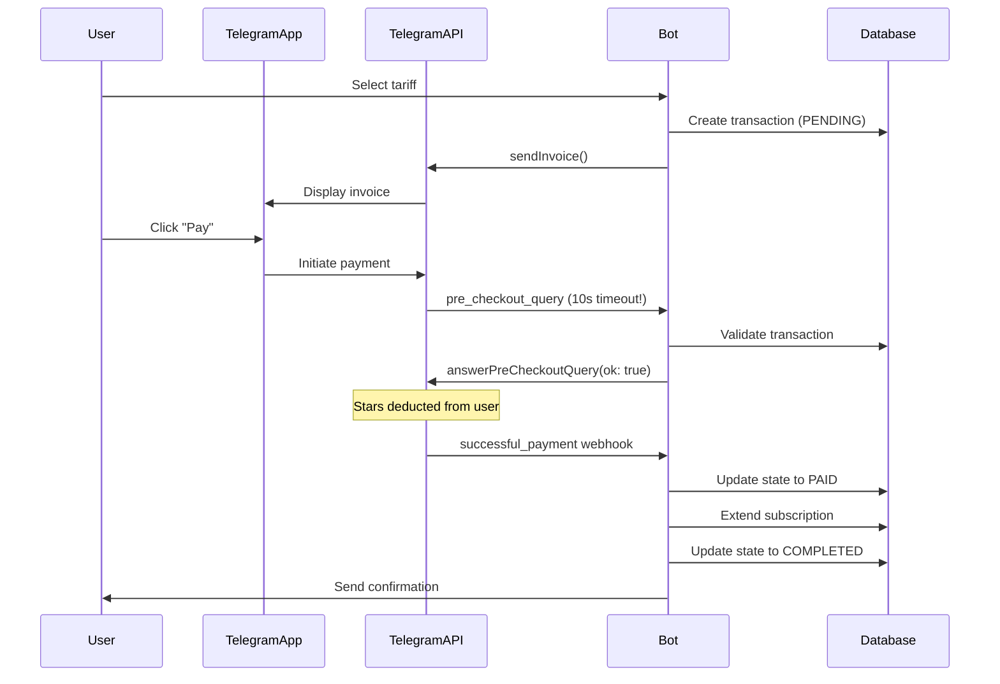
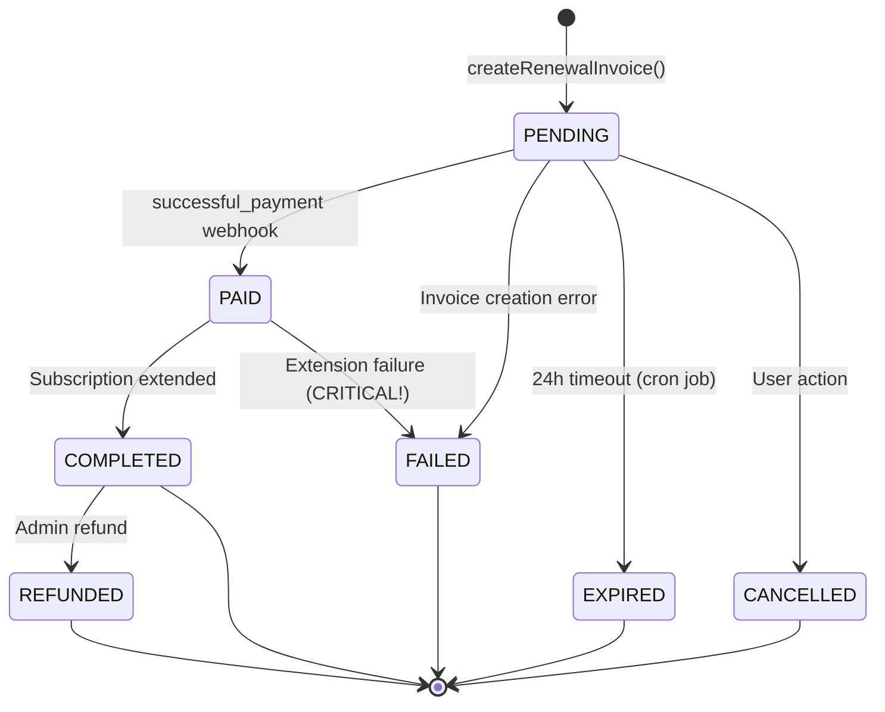
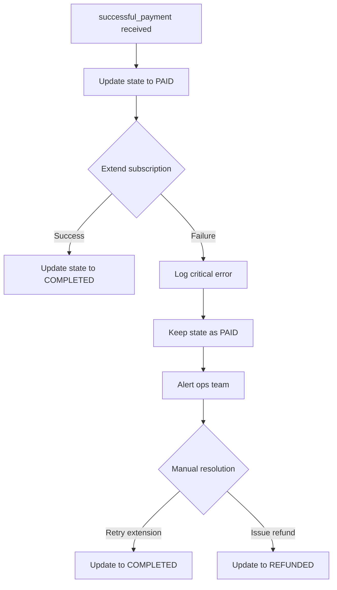

# ADR-COMMON: Telegram Stars Payment State Machine

## Status

**Partially Implemented**

| Component | Status | Notes |
|-----------|--------|-------|
| PaymentState enum | Implemented | All 7 states exist in `libs/db/src/schema/payment-transactions.ts` |
| RenewalInvoicePayload | Implemented | Interface matches specification in `libs/bot/src/services/payment.service.ts` |
| Pre-checkout validation | Implemented | All 6 checks present in `validatePreCheckout()` |
| Successful payment handler | **Partial** | Missing idempotency check, **incorrect error handling** (see Known Issues) |
| Repository: findByTelegramChargeId() | **Not Implemented** | Only `findByTelegramInvoiceId()` exists |
| Repository: expirePending() | **Not Implemented** | Method does not exist |
| Repository: findPendingOlderThan() | **Not Implemented** | Method does not exist |
| PaymentExpirationService (cron) | **Not Implemented** | Service does not exist |

---

## Known Issues

### CRITICAL: Incorrect Error Handling After Payment

**Current Behavior (INCORRECT)**:
When `handleSuccessfulPayment()` fails after user has paid (state = `PAID`), the transaction is marked as `FAILED`.

**Location**: `libs/bot/src/services/payment.service.ts:336-350`

```typescript
// CURRENT CODE (PROBLEMATIC):
} catch (error) {
  this.logger.error(`Failed to process payment ${transactionId}:`, error);

  // Mark payment as failed  <-- THIS IS WRONG!
  await this.paymentTransactionsRepo.updateState(
    transactionId,
    PaymentState.FAILED,  // <-- User was charged but we lose this info
    {
      failedAt: new Date(),
      failureReason: `Payment processing failed: ${(error as Error).message}`,
    },
  );

  throw error;
}
```

**Risk**: User is charged Stars but subscription not extended. By marking as `FAILED`, we lose track that the user was charged, making recovery difficult.

**ADR Specification (CORRECT)**:
```typescript
// DO NOT update to FAILED - this would lose the payment
// Keep state as PAID for manual intervention
await this.alertService.criticalPaymentFailure({...});
```

**Required Fix**:
1. Keep transaction in `PAID` state when extension fails
2. Log critical error for manual intervention
3. Implement alert mechanism for ops team
4. Never transition `PAID` -> `FAILED`

### Missing: Idempotency Check

**Current Behavior**:
No duplicate webhook protection. If Telegram sends `successful_payment` multiple times (at-least-once delivery), the system may attempt to process the same payment repeatedly.

**ADR Specification**:
```typescript
// Check for charge ID reuse (replay attack prevention)
const existingByCharge = await this.paymentTransactionsRepo.findByTelegramChargeId(
  telegramChargeId
);
if (existingByCharge && existingByCharge.id !== transactionId) {
  throw new Error(`Charge ID ${telegramChargeId} already used`);
}
```

**Required Fix**:
1. Add `findByTelegramChargeId()` method to repository
2. Add idempotency check at start of `handleSuccessfulPayment()`
3. Add unique index on `telegram_payment_charge_id` column

### Missing: Invoice Expiration Cron Job

**Current Behavior**:
No automated cleanup of stale `PENDING` invoices. Invoices remain in `PENDING` state indefinitely.

**ADR Specification**:
```typescript
@Injectable()
export class PaymentExpirationService {
  @Cron('0 * * * *') // Every hour
  async expireStalePendingPayments(): Promise<void> {...}
}
```

**Required Fix**:
1. Create `PaymentExpirationService`
2. Add `findPendingOlderThan()` to repository
3. Add `expirePending()` bulk update method
4. Register cron job in module

## Context

The Quantum Deal platform accepts payments via Telegram Stars for subscription renewals. This is a **financially critical** system where failures can result in users being charged without receiving service (user charged but subscription not extended) or service being delivered without payment (subscription extended but payment not recorded).

### Background

Telegram Stars is Telegram's native digital currency for in-app purchases. The payment flow involves multiple webhook events and network calls between our system, Telegram servers, and the user's Telegram client.

### Telegram Payment Flow



### Critical Timing Constraints

| Event | Timeout | Consequence |
|-------|---------|-------------|
| `pre_checkout_query` response | **10 seconds** | Transaction cancelled by Telegram |
| Invoice validity | **24 hours** | Invoice expires, payment impossible |
| Webhook delivery | Best effort | May be delayed or duplicated |

### Problem Statement

The current implementation has several risks that require documented patterns:

1. **Network failure between `paid` and `completed`**: User is charged but subscription not extended
2. **Race conditions**: Concurrent payments from same user for same subscription
3. **Webhook delivery semantics**: Telegram uses at-least-once delivery, risking duplicate processing
4. **Invoice expiration**: 24-hour timeout not tracked in current state machine
5. **Pre-checkout timeout**: 10-second hard limit requires fast validation
6. **Payload structure consistency**: Invoice payload must be parseable across all scenarios

### Current Implementation Status

**Key Files**:
- `libs/bot/src/services/payment.service.ts` - PaymentService with invoice creation and payment handling
- `libs/bot/src/commands/renew/renew.update.ts` - Webhook handlers for `pre_checkout_query` and `successful_payment`
- `libs/db/src/schema/payment-transactions.ts` - PaymentState enum and transaction schema
- `libs/bot/src/commands/renew/renewal.scene.ts` - UI flow for tariff selection

---

## Decision

### 1. Seven-State Payment State Machine

Adopt a comprehensive state machine with explicit state transitions and timestamp tracking for each state.

**State Definitions**:

```typescript
enum PaymentState {
  /** Invoice created, awaiting user action */
  PENDING = 'pending',

  /** Stars deducted from user, processing subscription */
  PAID = 'paid',

  /** Subscription extended, payment complete */
  COMPLETED = 'completed',

  /** Payment failed at any stage */
  FAILED = 'failed',

  /** Successfully paid but later refunded by admin */
  REFUNDED = 'refunded',

  /** Invoice expired without user action (24h timeout) */
  EXPIRED = 'expired',

  /** User explicitly cancelled before payment */
  CANCELLED = 'cancelled',
}
```

**State Transition Diagram**:



### 2. Invoice Payload Structure

Standardize the payload embedded in Telegram invoices for consistent parsing:

```typescript
interface RenewalInvoicePayload {
  /** Payload type discriminator */
  type: 'renewal';

  /** Schema version for backward compatibility */
  version: number;

  /** Internal transaction ID for database lookup */
  transactionId: number;

  /** User subscription to extend */
  userSubscriptionId: number;

  /** Tariff determining price and period */
  tariffId: number;

  /** Unix timestamp for invoice creation (idempotency) */
  timestamp: number;
}
```

**Validation Rules**:
- `type` must equal `'renewal'` for subscription payments
- `version` enables future payload evolution without breaking old invoices
- `transactionId` is the primary key for all webhook operations
- `timestamp` helps detect stale invoices

### 3. Idempotency Strategy

**Problem**: Telegram webhooks use at-least-once delivery semantics. The same `successful_payment` may arrive multiple times.

**Solution**: Use `telegram_payment_charge_id` as the idempotency key.

```typescript
// Idempotency check in handleSuccessfulPayment
async handleSuccessfulPayment(
  payload: RenewalInvoicePayload,
  telegramChargeId: string,
): Promise<void> {
  const transaction = await this.paymentTransactionsRepo.findById(
    payload.transactionId
  );

  // Idempotency: If already PAID/COMPLETED, this is a duplicate webhook
  if (transaction.state === PaymentState.COMPLETED) {
    this.logger.warn(`Duplicate webhook for completed transaction ${transaction.id}`);
    return; // Silently ignore, already processed
  }

  if (transaction.state === PaymentState.PAID) {
    // Retry scenario: Previous attempt failed after PAID but before COMPLETED
    // Continue to subscription extension
  }

  if (transaction.state !== PaymentState.PENDING) {
    this.logger.error(`Unexpected state ${transaction.state} for transaction ${transaction.id}`);
    throw new Error('Invalid transaction state for payment processing');
  }

  // Verify charge ID uniqueness to prevent replay attacks
  const existingByCharge = await this.paymentTransactionsRepo.findByTelegramChargeId(
    telegramChargeId
  );
  if (existingByCharge && existingByCharge.id !== transaction.id) {
    this.logger.error(`Charge ID ${telegramChargeId} already used by transaction ${existingByCharge.id}`);
    throw new Error('Duplicate payment charge ID');
  }

  // Proceed with state transition...
}
```

### 4. Pre-Checkout Validation Requirements

The `pre_checkout_query` handler has a **hard 10-second timeout**. All validation must complete within this window.

**Required Validations** (must complete in <10s):

| Check | Purpose | Failure Response |
|-------|---------|------------------|
| Payload structure | Security | "Invalid payment data" |
| Transaction exists | Integrity | "Payment session expired" |
| Transaction state = PENDING | Idempotency | "Payment already processed" |
| Amount matches tariff | Fraud prevention | "Price mismatch detected" |
| User owns transaction | Security | "Unauthorized payment" |
| Subscription exists | Data integrity | "Subscription not found" |

**Forbidden in Pre-Checkout** (too slow or inappropriate):
- External API calls
- Complex database joins
- Business rule recalculation
- Price recalculation

### 5. Failure Recovery Strategy

**Critical Failure Scenario**: State is `PAID` (user charged) but extension fails.



**Recovery Implementation**:

```typescript
async handleSuccessfulPayment(
  payload: RenewalInvoicePayload,
  telegramChargeId: string,
): Promise<void> {
  try {
    // 1. Atomically update to PAID with charge ID
    await this.paymentTransactionsRepo.updateState(
      payload.transactionId,
      PaymentState.PAID,
      {
        paidAt: new Date(),
        telegramPaymentChargeId: telegramChargeId,
      },
    );

    // 2. Extend subscription (may fail!)
    await this.userSubscriptionsRepo.extendSubscription(
      payload.userSubscriptionId,
      transaction.periodDays,
    );

    // 3. Update to COMPLETED only after successful extension
    await this.paymentTransactionsRepo.updateState(
      payload.transactionId,
      PaymentState.COMPLETED,
      { completedAt: new Date() },
    );

  } catch (error) {
    // Transaction is in PAID state - user was charged!
    // DO NOT update to FAILED - this would lose the payment
    this.logger.error(
      `CRITICAL: Payment ${payload.transactionId} is PAID but extension failed`,
      error,
    );

    // Alert operations team for manual intervention
    await this.alertService.criticalPaymentFailure({
      transactionId: payload.transactionId,
      telegramChargeId,
      error: error.message,
    });

    // Re-throw to indicate failure to caller
    throw error;
  }
}
```

### 6. Invoice Expiration Handling

Telegram invoices expire after 24 hours. Implement a cron job to mark stale `PENDING` transactions as `EXPIRED`.

```typescript
// Scheduled task (runs hourly)
@Cron('0 * * * *')
async expireStalePendingPayments(): Promise<void> {
  const expirationThreshold = new Date(Date.now() - 24 * 60 * 60 * 1000);

  const expiredCount = await this.paymentTransactionsRepo.expirePending(
    expirationThreshold
  );

  if (expiredCount > 0) {
    this.logger.log(`Expired ${expiredCount} stale pending payments`);
  }
}
```

---

## Rationale

### Options Considered

#### Option A: Simple Three-State Machine (pending/completed/failed)

- **Overview**: Minimal state machine without intermediate states
- **Pros**:
  - Simple to implement
  - Fewer state transitions to manage
- **Cons**:
  - Cannot distinguish between "user charged but extension failed" and "user never paid"
  - No audit trail for payment lifecycle
  - No refund tracking
  - No expiration tracking
- **Risk**: High financial risk in failure scenarios

#### Option B: Five-State Machine (pending/paid/completed/failed/refunded)

- **Overview**: Add `PAID` intermediate state and `REFUNDED` for lifecycle tracking
- **Pros**:
  - Tracks critical `PAID` but incomplete state
  - Supports refund workflow
- **Cons**:
  - No distinction between expired and cancelled
  - Missing audit timestamps
- **Risk**: Medium - some edge cases unhandled

#### Option C (Selected): Seven-State Machine with Timestamps

- **Overview**: Full lifecycle tracking with `PENDING`, `PAID`, `COMPLETED`, `FAILED`, `REFUNDED`, `EXPIRED`, `CANCELLED`
- **Pros**:
  - Complete audit trail
  - Distinguishes all failure modes
  - Supports reconciliation and reporting
  - Each state has dedicated timestamp
  - Clear recovery paths for each state
- **Cons**:
  - More complex state management
  - More database columns
- **Risk**: Low - comprehensive coverage

### Comparison Matrix

| Evaluation Axis | Option A (3-state) | Option B (5-state) | Option C (7-state) |
|-----------------|--------------------|--------------------|---------------------|
| Financial Safety | Low | Medium | High |
| Audit Completeness | Low | Medium | High |
| Recovery Support | None | Partial | Full |
| Implementation Effort | 1 day | 2 days | 3 days |
| Reporting Capability | Basic | Good | Comprehensive |
| Regulatory Compliance | Insufficient | Partial | Full |

### Decision Rationale

**Option C is selected** because:

1. **Financial Safety**: The `PAID` intermediate state is critical for handling the "user charged but subscription not extended" failure mode. This is a real money scenario that must be recoverable.

2. **Audit Requirements**: Payment systems require complete audit trails. Timestamps for each state transition enable:
   - Time-to-completion metrics
   - Failure mode analysis
   - Reconciliation with Telegram records
   - Dispute resolution

3. **Operational Clarity**: Distinguishing `EXPIRED` (24h timeout) from `CANCELLED` (user action) from `FAILED` (system error) enables:
   - Targeted re-engagement for expired invoices
   - UX improvements based on cancellation patterns
   - System reliability monitoring

4. **Idempotency Support**: The explicit state machine enables reliable duplicate webhook detection:
   - `COMPLETED` state indicates safe to ignore
   - `PAID` state indicates retry of extension is safe
   - Other states indicate error condition

---

## Consequences

### Positive Consequences

- **Financial Safety**: Clear distinction between "user charged" and "payment complete" prevents money loss
- **Reliable Idempotency**: `telegram_payment_charge_id` uniqueness prevents double-processing
- **Complete Audit Trail**: All state transitions with timestamps for compliance and debugging
- **Clear Recovery Paths**: Each state has documented recovery procedures
- **Operational Visibility**: State-based monitoring and alerting for critical failures

### Negative Consequences

- **Increased Complexity**: Seven states require more careful state transition logic
- **More Database Columns**: Each state needs timestamp and reason columns
- **Cron Job Dependency**: Invoice expiration requires scheduled task

### Failure Scenarios and Mitigation

| Scenario | State After | Mitigation | Recovery |
|----------|-------------|------------|----------|
| Invoice creation fails | `FAILED` | Log error, show user message | User retries |
| Pre-checkout timeout | `PENDING` | Keep validation fast (<10s) | User retries |
| Pre-checkout validation fails | `PENDING` | Clear error message to user | User contacts support |
| User closes invoice without paying | `PENDING` | No immediate action | Expires after 24h |
| Successful payment but DB write fails | `PAID` | **CRITICAL ALERT** | Manual extension |
| Subscription extension fails | `PAID` | **CRITICAL ALERT** | Manual extension or refund |
| Duplicate successful_payment webhook | `COMPLETED` | Idempotency check | Silent ignore |
| Invoice expires after 24h | `EXPIRED` | Cron job marks expired | User creates new invoice |

---

## Implementation Guidance

### State Transition Principles

1. **Always persist state before side effects**: Update to `PAID` before attempting subscription extension
2. **Never downgrade payment states**: Once `PAID`, never transition to `PENDING`
3. **Use explicit timestamps**: Each state transition must record when it occurred
4. **Log state transitions**: All transitions should be logged for debugging

### Pre-Checkout Handler Principles

1. **Minimize latency**: All checks must complete in <10 seconds total
2. **Fail closed**: If any validation fails, reject the payment
3. **No external calls**: Only database lookups allowed
4. **Clear error messages**: User-friendly rejection reasons

### Successful Payment Handler Principles

1. **Idempotency first**: Check current state before processing
2. **Atomic state updates**: Use transactions where possible
3. **Critical alerts for PAID failures**: Never silently fail after user is charged
4. **Preserve charge ID**: Store `telegram_payment_charge_id` for refund capability

### Invoice Payload Principles

1. **Version field**: Always include for forward compatibility
2. **Type discriminator**: Enable different payment flows in future
3. **Timestamp**: Detect and reject stale invoice attempts
4. **Minimal data**: Only include IDs, not sensitive information

### Database Query Principles

1. **Index state column**: Enable fast state-based filtering
2. **Index telegram_payment_charge_id**: Enable idempotency checks
3. **Index created_at**: Enable expiration queries
4. **Use optimistic locking**: Prevent concurrent state updates

### Monitoring and Alerting Principles

1. **Alert on PAID state > 1 minute**: Indicates extension failure
2. **Track PENDING to EXPIRED ratio**: High ratio indicates UX issues
3. **Monitor pre-checkout response times**: Must stay <10s
4. **Dashboard for state distribution**: Operational visibility

---

## Related Information

### Implementation Files

- `libs/db/src/schema/payment-transactions.ts` - PaymentState enum and schema definition
- `libs/db/src/repositories/payment-transactions.repository.ts` - Database operations
- `libs/bot/src/services/payment.service.ts` - Business logic and state transitions
- `libs/bot/src/commands/renew/renew.update.ts` - Webhook handlers
- `libs/bot/src/commands/renew/renewal.scene.ts` - UI flow

### Related ADRs

- **ADR-COMMON-multi-bot-context.md** - Bot context handling for multi-bot payments
- **ADR-009-user-subscriptions-bot-users-migration.md** - User subscription data model

### External References

- [Telegram Bot Payments API for Digital Goods](https://core.telegram.org/bots/payments-stars) - Official Telegram documentation
- [Telegram Payments API](https://core.telegram.org/api/payments) - Low-level API documentation
- [Telegram Stars Overview](https://core.telegram.org/api/stars) - Stars currency documentation
- [Pre-checkout Query Documentation](https://core.telegram.org/bots/api#precheckoutquery) - Webhook event details
- [Successful Payment Documentation](https://core.telegram.org/bots/api#successfulpayment) - Payment confirmation details

---

## Appendix: Code Examples

> **Implementation Status Legend**:
> - `[IMPLEMENTED]` - Code exists and matches specification
> - `[PARTIAL]` - Code exists but differs from specification
> - `[TODO]` - Code does not exist, needs implementation

### A. Complete Pre-Checkout Handler `[IMPLEMENTED]`

*Location: `libs/bot/src/services/payment.service.ts:208-275` (`validatePreCheckout` method)*

```typescript
@On('pre_checkout_query')
async onPreCheckoutQuery(@Ctx() ctx: UserContext): Promise<void> {
  const query = ctx.preCheckoutQuery;
  if (!query) return;

  const startTime = Date.now();

  try {
    // 1. Parse payload with type guard
    const payload = this.parsePayload(query.invoice_payload);
    if (!payload) {
      await ctx.answerPreCheckoutQuery(false, 'Invalid payment data');
      return;
    }

    // 2. Validate transaction exists and is PENDING
    const transaction = await this.paymentTransactionsRepo.findById(
      payload.transactionId
    );

    if (!transaction) {
      await ctx.answerPreCheckoutQuery(false, 'Payment session expired');
      return;
    }

    if (transaction.state !== PaymentState.PENDING) {
      await ctx.answerPreCheckoutQuery(false, 'Payment already processed');
      return;
    }

    // 3. Validate amount matches
    if (transaction.amountStars !== query.total_amount) {
      await ctx.answerPreCheckoutQuery(false, 'Price mismatch detected');
      return;
    }

    // 4. Validate user ownership
    if (transaction.botUserId !== ctx.user?.botUserId) {
      await ctx.answerPreCheckoutQuery(false, 'Unauthorized payment');
      return;
    }

    // 5. Validate subscription exists
    const subscription = await this.userSubscriptionsRepo.findById(
      transaction.userSubscriptionId
    );
    if (!subscription) {
      await ctx.answerPreCheckoutQuery(false, 'Subscription not found');
      return;
    }

    // All validations passed
    await ctx.answerPreCheckoutQuery(true);

    const duration = Date.now() - startTime;
    this.logger.log(
      `Pre-checkout approved for transaction ${payload.transactionId} in ${duration}ms`
    );

  } catch (error) {
    this.logger.error('Pre-checkout validation error:', error);
    await ctx.answerPreCheckoutQuery(false, 'Temporary error, please retry');
  }
}

private parsePayload(payloadString: string): RenewalInvoicePayload | null {
  try {
    const payload = JSON.parse(payloadString) as unknown;
    if (
      typeof payload === 'object' &&
      payload !== null &&
      'type' in payload &&
      payload.type === 'renewal' &&
      'transactionId' in payload &&
      typeof payload.transactionId === 'number'
    ) {
      return payload as RenewalInvoicePayload;
    }
    return null;
  } catch {
    return null;
  }
}
```

### B. Complete Successful Payment Handler `[PARTIAL]`

*Location: `libs/bot/src/services/payment.service.ts:285-351` (`handleSuccessfulPayment` method)*

**Discrepancies from specification:**
1. Missing idempotency check via `findByTelegramChargeId()` (lines 710-716 below)
2. Error handler incorrectly marks transaction as `FAILED` instead of keeping `PAID` state (lines 747-772 below)
3. Missing `alertService.criticalPaymentFailure()` call
4. Missing `updateMetadata()` repository method usage

```typescript
async handleSuccessfulPayment(
  payload: RenewalInvoicePayload,
  telegramChargeId: string,
  providerChargeId?: string,
): Promise<void> {
  const { transactionId, userSubscriptionId } = payload;

  this.logger.log(`Processing payment for transaction ${transactionId}`);

  // 1. Idempotency check
  const transaction = await this.paymentTransactionsRepo.findById(transactionId);

  if (!transaction) {
    throw new Error(`Transaction ${transactionId} not found`);
  }

  // Already completed - duplicate webhook
  if (transaction.state === PaymentState.COMPLETED) {
    this.logger.warn(`Duplicate webhook for completed transaction ${transactionId}`);
    return;
  }

  // Check for charge ID reuse (replay attack prevention)
  const existingByCharge = await this.paymentTransactionsRepo.findByTelegramChargeId(
    telegramChargeId
  );
  if (existingByCharge && existingByCharge.id !== transactionId) {
    throw new Error(`Charge ID ${telegramChargeId} already used`);
  }

  try {
    // 2. Update to PAID state (user has been charged)
    await this.paymentTransactionsRepo.updateState(
      transactionId,
      PaymentState.PAID,
      {
        paidAt: new Date(),
        telegramPaymentChargeId: telegramChargeId,
        metadata: { providerChargeId },
      },
    );

    // 3. Extend subscription (critical operation)
    await this.userSubscriptionsRepo.extendSubscription(
      userSubscriptionId,
      transaction.periodDays,
    );

    // 4. Update to COMPLETED
    await this.paymentTransactionsRepo.updateState(
      transactionId,
      PaymentState.COMPLETED,
      { completedAt: new Date() },
    );

    this.logger.log(
      `Payment ${transactionId} completed. Subscription ${userSubscriptionId} extended.`
    );

  } catch (error) {
    // CRITICAL: User was charged (PAID state) but extension failed
    // DO NOT mark as FAILED - need manual intervention
    this.logger.error(
      `CRITICAL: Transaction ${transactionId} is PAID but extension failed:`,
      error
    );

    // Store failure details in metadata for debugging
    await this.paymentTransactionsRepo.updateMetadata(
      transactionId,
      {
        extensionError: (error as Error).message,
        extensionFailedAt: new Date().toISOString(),
      },
    );

    // Alert operations team
    await this.alertService.criticalPaymentFailure({
      transactionId,
      telegramChargeId,
      userSubscriptionId,
      error: (error as Error).message,
    });

    throw error;
  }
}
```

### C. Invoice Expiration Cron Job `[TODO]`

**Required Implementation:**
1. Create new service file: `libs/bot/src/services/payment-expiration.service.ts`
2. Add repository methods: `findPendingOlderThan()`, `expirePending()`
3. Register in module with `@nestjs/schedule` for cron support

```typescript
@Injectable()
export class PaymentExpirationService {
  private readonly logger = new Logger(PaymentExpirationService.name);

  constructor(
    private readonly paymentTransactionsRepo: PaymentTransactionsRepository,
  ) {}

  /**
   * Mark stale PENDING payments as EXPIRED
   * Runs hourly to clean up abandoned invoices
   */
  @Cron('0 * * * *') // Every hour at minute 0
  async expireStalePendingPayments(): Promise<void> {
    // Telegram invoices expire after 24 hours
    const expirationThreshold = new Date(Date.now() - 24 * 60 * 60 * 1000);

    const expiredTransactions = await this.paymentTransactionsRepo
      .findPendingOlderThan(expirationThreshold);

    for (const transaction of expiredTransactions) {
      await this.paymentTransactionsRepo.updateState(
        transaction.id,
        PaymentState.EXPIRED,
        { expiredAt: new Date() },
      );
    }

    if (expiredTransactions.length > 0) {
      this.logger.log(
        `Expired ${expiredTransactions.length} stale pending payments`
      );
    }
  }
}
```

---

## Decision Record

| Attribute | Value |
|-----------|-------|
| **Decision Date** | 2025-12-11 |
| **Decision Status** | Partially Implemented |
| **Scope** | Common pattern for all Telegram Stars payments |
| **Complexity Rating** | 4/5 (Financially Critical) |
| **Related ADRs** | ADR-COMMON-multi-bot-context, ADR-009 |

---

## Change History

| Version | Date | Author | Changes |
|---------|------|--------|---------|
| 1.0.0 | 2025-12-11 | Claude Code Architecture Agent | Initial version - 7-state machine, idempotency strategy, failure recovery patterns |
| 1.1.0 | 2025-12-11 | Claude Code Architecture Agent | Added implementation status audit: status changed to "Partially Implemented", added Known Issues section documenting critical error handling bug (PAID->FAILED transition), missing idempotency check, missing cron job. Added implementation status markers to code examples. |

---

**Document Version**: 1.1.0
**Created**: 2025-12-11
**Last Updated**: 2025-12-11
**Author**: Claude Code Architecture Agent
