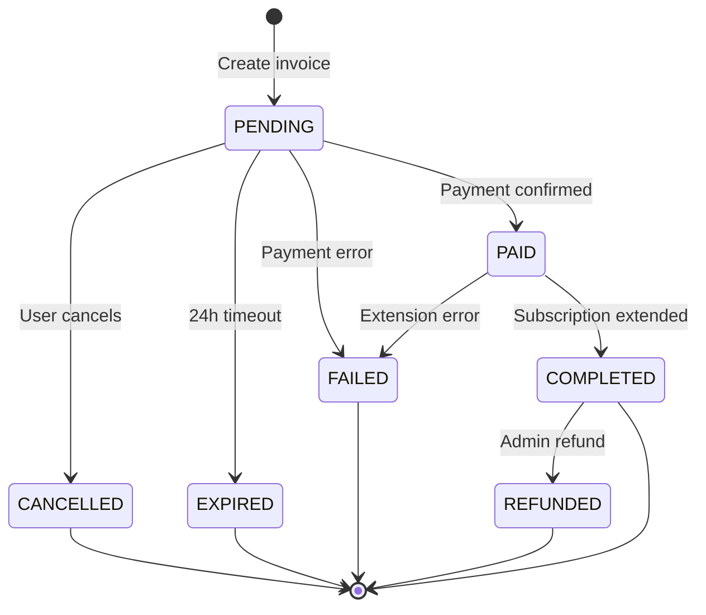

# Subscription Renewal Architecture

## Table of Contents

1. [Overview](#overview)
2. [System Architecture](#system-architecture)
3. [Design Decisions](#design-decisions)
4. [Data Flow](#data-flow)
5. [Component Diagram](#component-diagram)
6. [State Machine](#state-machine)
7. [Integration Points](#integration-points)

## Overview

The subscription renewal system enables users to self-service extend their subscriptions using Telegram's native Stars payment system. The architecture focuses on reliability, auditability, and seamless user experience.

### Core Principles

1. **Dual Pricing Model**: Global defaults with subscription-specific overrides
2. **Flexible Periods**: Any number of days, not fixed tiers
3. **Full Audit Trail**: Complete payment state tracking
4. **Automatic Extension**: Immediate subscription renewal on successful payment
5. **User-Centric UX**: One-click access from notifications and status views

## System Architecture

```
┌─────────────────────────────────────────────────────────────────┐
│                       Telegram User                              │
└───────────────────────┬─────────────────────────────────────────┘
                        │
                        ▼
        ┌───────────────────────────────────┐
        │   Expiration Notification         │
        │   or /start or /renew            │
        └───────────────┬───────────────────┘
                        │
                        ▼
        ┌───────────────────────────────────┐
        │       RenewalScene                │
        │   • Show tariff options           │
        │   • Handle selection              │
        └───────────────┬───────────────────┘
                        │
                        ▼
        ┌───────────────────────────────────┐
        │      PaymentService               │
        │   • Create invoice                │
        │   • Record transaction            │
        └───────────────┬───────────────────┘
                        │
                        ▼
        ┌───────────────────────────────────┐
        │    Telegram Stars API             │
        │   • Send invoice                  │
        │   • Process payment               │
        └───────────────┬───────────────────┘
                        │
          ┌─────────────┴─────────────┐
          │                           │
          ▼                           ▼
  ┌───────────────┐         ┌────────────────┐
  │ Pre-Checkout  │         │ Successful     │
  │ Query Handler │         │ Payment Handler│
  └───────┬───────┘         └────────┬───────┘
          │                          │
          └──────────┬───────────────┘
                     │
                     ▼
        ┌────────────────────────────┐
        │  PaymentService            │
        │  • Update state to PAID    │
        │  • Extend subscription     │
        │  • Update state COMPLETED  │
        └────────────────────────────┘
```

## Design Decisions

### 1. Dual Pricing Model

**Decision**: Support both global and subscription-specific tariffs

**Rationale**:
- Global tariffs provide consistent default pricing
- Subscription-specific overrides allow premium pricing for VIP tiers
- Simplifies tariff management (one place for most subscriptions)
- Enables flexible business models

**Implementation**:
```sql
-- Global tariff (subscriptionId = NULL)
INSERT INTO renewal_tariffs (subscription_id, period_days, price_stars, display_name)
VALUES (NULL, 30, 100, '1 month');

-- VIP-specific override
INSERT INTO renewal_tariffs (subscription_id, period_days, price_stars, display_name)
VALUES (2, 30, 150, '1 month VIP');
```

**Query logic**:
1. Check for subscription-specific tariff
2. Fall back to global tariff if not found
3. Merge and sort by sortOrder

### 2. Flexible Renewal Periods

**Decision**: Store period as integer days, not fixed enum

**Rationale**:
- Maximum flexibility for business (can offer 7, 14, 21, 30, etc.)
- No code changes needed to add new periods
- Supports promotional periods (e.g., "33 days for the price of 30")
- Simple calculation: expiresAt + periodDays

**Trade-offs**:
- Slightly more complex validation
- Need to prevent unreasonable values (e.g., 0 days, 10000 days)

### 3. Full Payment State Machine

**Decision**: Track all payment states with individual timestamps

**Rationale**:
- Complete audit trail for financial compliance
- Debug payment issues
- Analytics on payment failures
- Refund tracking
- Support cancellations

**States**:
```
PENDING    → Invoice created, awaiting payment
PAID       → Payment confirmed by Telegram
COMPLETED  → Subscription successfully extended
FAILED     → Payment failed
REFUNDED   → Payment refunded
EXPIRED    → Invoice expired without payment (24h)
CANCELLED  → User cancelled before payment
```

### 4. Separate Transaction Table

**Decision**: payment_transactions table separate from user_subscriptions

**Rationale**:
- Clean separation of concerns
- One subscription can have multiple renewal attempts
- Complete payment history preserved
- Failed payments don't clutter subscription table
- Easy to query payment analytics

**Alternative considered**: Adding payment fields to user_subscriptions
- **Rejected**: Would only track last payment, lose history

### 5. Telegram Stars vs Custom Payment Gateway

**Decision**: Use Telegram Stars exclusively (not external payments)

**Rationale**:
- Native integration with Telegram
- No PCI compliance needed
- Telegram handles payment security
- Seamless UX (no external redirects)
- Lower transaction fees
- Instant payment confirmation

**Trade-off**:
- Platform lock-in
- Limited to Telegram ecosystem
- No traditional payment methods

### 6. Immediate vs Deferred Renewal

**Decision**: Extend subscription immediately upon payment (not on expiry)

**Rationale**:
- Better UX (instant gratification)
- No risk of losing renewal if system down on expiry date
- Simpler logic (no pending renewal state)
- Users can renew anytime (stacking periods)

**Example**:
```
Current expiry: 2025-02-01
User renews 30 days on 2025-01-20
New expiry: 2025-03-03 (Feb 1 + 30 days)
```

## Data Flow

### Renewal Initiation Flow

```
1. User Action
   ├─ Clicks renewal button in notification
   ├─ Clicks renewal button in /start
   └─ Uses /renew command
   
2. RenewalScene.onEnter()
   ├─ Load user's active subscriptions
   ├─ For each subscription, load tariffs
   │  ├─ Query subscription-specific tariffs
   │  └─ Query global tariffs (fallback)
   └─ Display tariff selection UI
   
3. User selects tariff
   
4. RenewalScene.onSelectTariff()
   ├─ Create payment_transaction record (state=PENDING)
   ├─ Generate Telegram invoice
   │  ├─ title: "Продление подписки {name}"
   │  ├─ description: "{period} дней"
   │  ├─ payload: {transactionId, userSubscriptionId}
   │  ├─ currency: XTR (Telegram Stars)
   │  └─ amount: tariff.priceStars
   └─ Send invoice to user
```

### Payment Processing Flow

```
5. Telegram Stars Payment
   ├─ User sees invoice in chat
   ├─ User clicks "Pay {amount} ⭐"
   └─ Telegram shows payment confirmation
   
6. Pre-Checkout Query
   ├─ Telegram sends pre_checkout_query
   ├─ Bot validates:
   │  ├─ Transaction exists and is PENDING
   │  ├─ Subscription still exists
   │  ├─ Amount matches tariff
   │  └─ User is transaction owner
   └─ Bot answers OK or ERROR
   
7. Successful Payment
   ├─ Telegram processes payment
   ├─ Telegram sends successful_payment update
   └─ Bot receives payment notification
   
8. PaymentService.handleSuccessfulPayment()
   ├─ Update transaction state: PENDING → PAID
   ├─ Update paidAt timestamp
   ├─ Store Telegram payment IDs
   ├─ Extend subscription (expiresAt += periodDays)
   ├─ Reactivate if expired (isActive = true)
   ├─ Update transaction state: PAID → COMPLETED
   ├─ Update completedAt timestamp
   └─ Send confirmation message to user
```

### Error Flow

```
Payment Failure:
├─ Update transaction state → FAILED
├─ Record failureReason
├─ Update failedAt timestamp
└─ Notify user

Payment Cancellation:
├─ Update transaction state → CANCELLED
├─ Record cancellationReason
├─ Update cancelledAt timestamp
└─ Clean up

Invoice Expiration (Cron):
├─ Find transactions in PENDING > 24h
├─ Update transaction state → EXPIRED
├─ Update expiredAt timestamp
└─ Clean up
```

## Component Diagram

```
┌─────────────────────────────────────────────────────────────┐
│                        Database                              │
│                                                              │
│  ┌───────────────┐  ┌──────────────────┐  ┌──────────────┐ │
│  │ subscriptions │  │ user_subscriptions│  │   users      │ │
│  └───────┬───────┘  └─────────┬────────┘  └──────┬───────┘ │
│          │                    │                   │         │
│          └────────────────────┼───────────────────┘         │
│                               │                             │
│          ┌────────────────────┴────────────────────┐        │
│          │                                         │        │
│  ┌───────▼──────────┐              ┌──────────────▼─────┐  │
│  │ renewal_tariffs  │              │ payment_transactions│  │
│  │                  │              │                     │  │
│  │ • Global         │◄─────────────│ • State machine    │  │
│  │ • Sub-specific   │              │ • Audit trail      │  │
│  └──────────────────┘              └────────────────────┘  │
└─────────────────────────────────────────────────────────────┘
                         │
                         ▼
┌─────────────────────────────────────────────────────────────┐
│                    Repository Layer                          │
│                                                              │
│  ┌──────────────────────────┐  ┌───────────────────────┐   │
│  │RenewalTariffsRepository  │  │PaymentTransactions    │   │
│  │                          │  │Repository             │   │
│  │• findBySubscription()    │  │• create()             │   │
│  │• findGlobalTariffs()     │  │• updateState()        │   │
│  │• findById()              │  │• findByTelegramId()   │   │
│  └──────────────────────────┘  └───────────────────────┘   │
│                                                              │
│  ┌──────────────────────────────────────────────────────┐   │
│  │ UserSubscriptionsRepository                          │   │
│  │ • extendSubscription(days, transactionId)            │   │
│  └──────────────────────────────────────────────────────┘   │
└─────────────────────────────────────────────────────────────┘
                         │
                         ▼
┌─────────────────────────────────────────────────────────────┐
│                     Service Layer                            │
│                                                              │
│  ┌──────────────────────────────────────────────────────┐   │
│  │                  PaymentService                       │   │
│  │                                                       │   │
│  │  • createRenewalInvoice()                            │   │
│  │  • handlePreCheckoutQuery()                          │   │
│  │  • handleSuccessfulPayment()                         │   │
│  │  • cancelPayment()                                   │   │
│  │  • expirePendingPayments() [Cron]                    │   │
│  └──────────────────────────────────────────────────────┘   │
│                                                              │
│  ┌──────────────────────────────────────────────────────┐   │
│  │         SubscriptionExpirationService                 │   │
│  │  • checkExpiringSubscriptions()                      │   │
│  │  • sendNotificationsToUsers()                        │   │
│  │  • createRenewalButton() [NEW]                       │   │
│  └──────────────────────────────────────────────────────┘   │
└─────────────────────────────────────────────────────────────┘
                         │
                         ▼
┌─────────────────────────────────────────────────────────────┐
│                    Telegram Bot Layer                        │
│                                                              │
│  ┌──────────────────────────────────────────────────────┐   │
│  │                   BotUpdate                           │   │
│  │  • @On('pre_checkout_query')                         │   │
│  │  • @On('successful_payment')                         │   │
│  │  • onStart() [Modified: add renewal button]          │   │
│  └──────────────────────────────────────────────────────┘   │
│                                                              │
│  ┌──────────────────────────────────────────────────────┐   │
│  │                  RenewalScene                         │   │
│  │  • @SceneEnter() - Show tariffs                      │   │
│  │  • @Action('select_tariff') - Create invoice         │   │
│  │  • @Action('cancel_renewal') - Exit                  │   │
│  └──────────────────────────────────────────────────────┘   │
│                                                              │
│  ┌──────────────────────────────────────────────────────┐   │
│  │              SubscriptionCommands                     │   │
│  │  • @Command('renew')                                 │   │
│  └──────────────────────────────────────────────────────┘   │
└─────────────────────────────────────────────────────────────┘
                         │
                         ▼
                ┌────────────────────┐
                │  Telegram Bot API  │
                │  • sendInvoice()   │
                │  • answerPre...()  │
                └────────────────────┘
```

## State Machine

### Payment Transaction States



### State Transitions

| From | To | Trigger | Actions |
|------|-----|---------|---------|
| - | PENDING | Invoice created | Create transaction record, send invoice |
| PENDING | PAID | Successful payment webhook | Store payment IDs, update paidAt |
| PAID | COMPLETED | Subscription extended | Update expiresAt, set completedAt |
| PENDING | CANCELLED | User cancellation | Store reason, update cancelledAt |
| PENDING | EXPIRED | Cron job (24h) | Update expiredAt |
| PENDING | FAILED | Payment error | Store failureReason, update failedAt |
| COMPLETED | REFUNDED | Admin action | Store refund details, update refundedAt |

## Integration Points

### 1. Telegram Stars API

**Invoice Creation**:
```typescript
await bot.telegram.sendInvoice(userId, {
  title: "Продление подписки VIP",
  description: "Продление на 30 дней",
  payload: JSON.stringify({ transactionId, userSubscriptionId }),
  currency: 'XTR',
  prices: [{ label: '30 дней', amount: 100 }],
});
```

**Pre-Checkout Validation**:
```typescript
@On('pre_checkout_query')
async onPreCheckoutQuery(ctx) {
  const { id, invoice_payload } = ctx.preCheckoutQuery;
  const isValid = await this.paymentService.validatePreCheckout(invoice_payload);
  await ctx.answerPreCheckoutQuery(isValid, isValid ? undefined : 'Invalid transaction');
}
```

**Payment Confirmation**:
```typescript
@On('successful_payment')
async onSuccessfulPayment(ctx) {
  const { successful_payment } = ctx.message;
  await this.paymentService.handleSuccessfulPayment(successful_payment);
}
```

### 2. Subscription System

**Extend Subscription**:
```typescript
await userSubscriptionsRepo.extendSubscription(
  userSubscriptionId,
  periodDays,
  transactionId,
);
```

**Result**:
- expiresAt updated: current_expiry + periodDays
- isActive set to true (reactivates expired subscriptions)
- Extension logged in metadata

### 3. Notification System

**Expiration Notifications**:
- Modified to include renewal button
- Button callback: `renew:{userSubscriptionId}`
- Available in 7-day, 3-day, and 0-day notifications

### 4. User Interface

**Entry Points**:
1. Expiration notification button
2. /start command (subscription status)
3. /renew command (direct access)

**Flow**: Entry → RenewalScene → Tariff Selection → Payment → Confirmation

## Performance Considerations

### Database Indexes

```sql
-- Payment lookups by Telegram invoice ID
CREATE INDEX idx_payment_transactions_telegram_invoice_id 
  ON payment_transactions(telegram_invoice_id);

-- Payment history queries
CREATE INDEX idx_payment_transactions_user_id 
  ON payment_transactions(user_id);

-- State-based queries (pending, failed, etc.)
CREATE INDEX idx_payment_transactions_state 
  ON payment_transactions(state);

-- Time-based queries (analytics, cleanup)
CREATE INDEX idx_payment_transactions_created_at 
  ON payment_transactions(created_at);
```

### Caching Strategy

**Tariffs**:
- Load once per renewal session
- Cache in scene context
- Invalidate on tariff updates (rare)

**User Subscription**:
- Already cached in UserContext
- No additional caching needed

**Payment State**:
- No caching (real-time critical)
- Always query database for current state

### Concurrency Handling

**Duplicate Payment Prevention**:
```typescript
// Check for existing pending payment
const existing = await paymentTransactionsRepo.findPending(
  userId,
  userSubscriptionId,
);

if (existing) {
  throw new Error('Payment already in progress');
}
```

**Race Condition in Payment Webhook**:
```typescript
// Use database transaction
await db.transaction(async (tx) => {
  // Lock payment record
  const payment = await tx.select()
    .from(paymentTransactions)
    .where(eq(id, transactionId))
    .for('update')
    .limit(1);
  
  // Verify still in PAID state
  if (payment.state !== 'PAID') {
    throw new Error('Payment already processed');
  }
  
  // Extend subscription
  // Update to COMPLETED
});
```

## Security Considerations

### Payment Validation

1. **Pre-Checkout Validation**:
   - Verify transaction exists
   - Verify transaction is PENDING
   - Verify amount matches tariff
   - Verify user owns subscription
   - Verify subscription exists

2. **Payload Verification**:
   - Parse invoice payload
   - Validate JSON structure
   - Verify transaction ID exists
   - Prevent replay attacks

3. **User Authorization**:
   - Only subscription owner can renew
   - Check user ID in transaction record
   - Prevent renewal of other users' subscriptions

### Data Integrity

1. **State Machine Enforcement**:
   - Only valid state transitions allowed
   - Idempotent operations (safe to retry)
   - Atomic updates (database transactions)

2. **Audit Trail**:
   - All state transitions logged
   - Timestamps for each state
   - Reasons for failures/cancellations
   - Telegram payment references preserved

## Scalability

### Current Load Estimates

- **Active Users**: ~1000
- **Daily Renewals**: ~10-50
- **Peak Renewals**: ~100/day (end of month)

### Bottlenecks

1. **Database Queries**: 
   - Tariff lookups: O(1) with index
   - Payment creation: O(1) insert
   - State updates: O(1) with primary key

2. **Telegram API**:
   - Rate limit: 30 messages/second
   - Invoice creation: ~100ms latency
   - Payment webhook: ~200ms processing

### Optimization Opportunities

1. **Batch Tariff Loading**:
   - Load all tariffs for all subscriptions once
   - Cache in memory (rarely changes)

2. **Async Payment Processing**:
   - Queue payment webhooks
   - Process in background
   - Reduce webhook response time

3. **Database Connection Pooling**:
   - Already configured via Drizzle
   - Monitor pool utilization

## Related Documentation

- [Database Schema](./database-schema.md) - Detailed schema reference
- [Telegram Stars Integration](./telegram-stars-integration.md) - API details
- [Renewal Flow](./renewal-flow.md) - User journey diagrams
- [Implementation Plan](./implementation-plan.md) - Development guide

---

**Version**: 1.0
**Last Updated**: 2025-01-21

