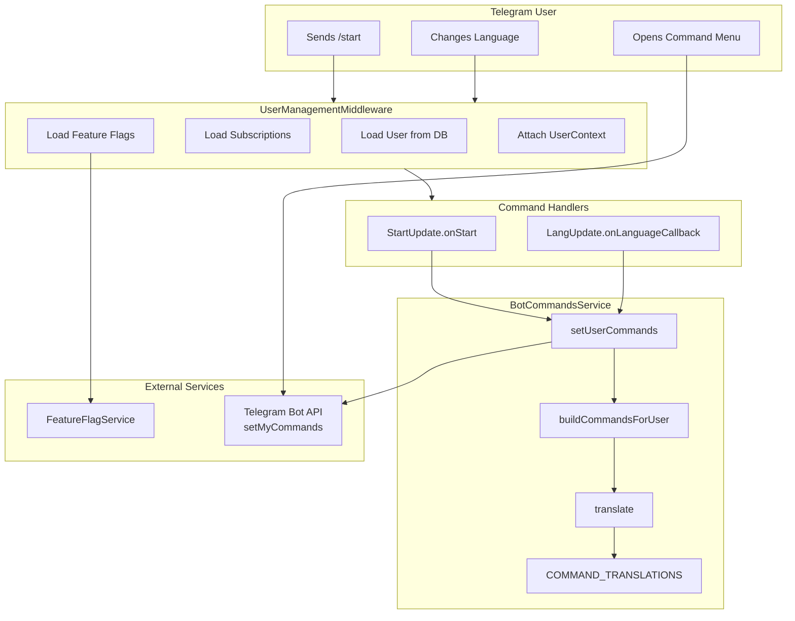
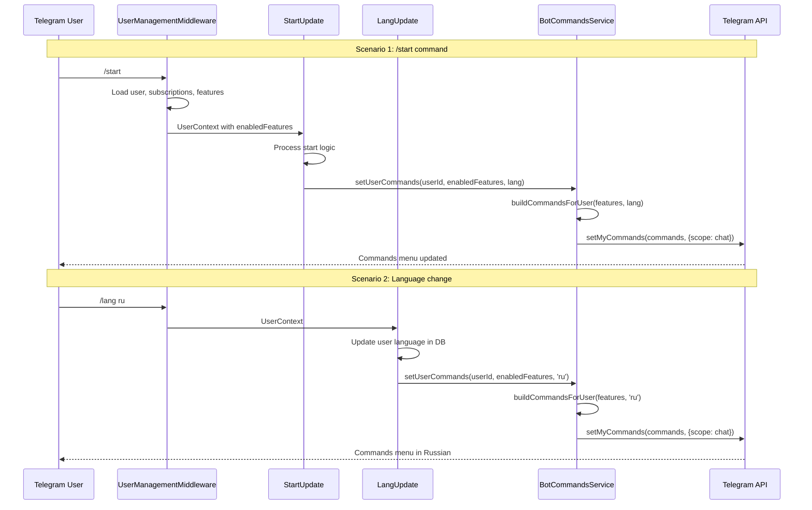

# Bot Commands Menu System Design Document

## Overview

This design document describes the implementation of a personalized bot commands menu system that dynamically displays available commands to Telegram users based on their subscription level, feature flags, and language preference. The system uses Telegram's `setMyCommands` API with user-specific scopes to deliver personalized command menus.

## Background and Context

### Prerequisite ADRs

- No existing ADRs are directly related to this feature
- This is a standalone feature that integrates with the existing FeatureFlagService architecture

### Agreement Checklist

#### Scope
- [x] Personalized command display per user
- [x] Feature-based command visibility (CUSTOM_USER_FILTERING controls /filter)
- [x] Multi-language command descriptions (8 languages)
- [x] Dynamic menu updates on relevant events

#### Non-Scope (Explicitly not changing)
- [x] Command handler implementations (handled by separate Update classes)
- [x] Subscription management logic
- [x] Feature flag computation logic (handled by FeatureFlagService)
- [x] User authentication/management

#### Constraints
- [x] Parallel operation: Yes (commands are set independently per user)
- [x] Backward compatibility: Required (existing users unaffected)
- [x] Performance measurement: Not required (non-critical feature)

### Problem to Solve

Telegram bot users need to see only the commands they have access to, with descriptions in their preferred language. The command menu should adapt dynamically as users gain or lose access to features through subscriptions.

### Current Challenges

1. Without personalization, all users see all commands regardless of their access level
2. Basic users might be confused by seeing premium-only commands like `/filter`
3. Non-English speakers need localized command descriptions
4. Menu needs to update when user context changes (language, subscription)

### Requirements

#### Functional Requirements (from PRD)

- **FR-001**: Set personalized commands per user using Telegram's `setMyCommands` API with user-specific scope
- **FR-002**: Display `/start` and `/lang` commands for all users (always visible)
- **FR-003**: Display `/filter` command only for users with `CUSTOM_USER_FILTERING` feature flag
- **FR-004**: Support command descriptions in 8 languages (ru, en, uk, hi, fr, kk, uz, tg)
- **FR-005**: Update commands on `/start` command execution
- **FR-006**: Update commands on language change via `/lang`
- **FR-007**: Update commands after subscription code activation
- **FR-008**: Fallback to English when translation is not available for a language
- **FR-009**: Graceful error handling - menu failures do not break bot functionality

#### Non-Functional Requirements

- **Performance**: Command setting should complete within 1 second
- **Scalability**: Independent command menu per user (no global state)
- **Reliability**: Non-critical feature; failures are logged but don't break bot
- **Maintainability**: Translation system supports adding new languages and commands

## Acceptance Criteria (AC)

### FR-001: Personalized Commands per User
- [ ] AC-001.1: When `setUserCommands` is called, commands are set via Telegram API with `scope: { type: 'chat', chat_id: userId }`
- [ ] AC-001.2: Different users see different command menus based on their features

### FR-002 & FR-003: Command Visibility
- [ ] AC-002.1: User without features sees only `/start` and `/lang` commands
- [ ] AC-003.1: User with `CUSTOM_USER_FILTERING` feature sees `/start`, `/lang`, and `/filter` commands
- [ ] AC-003.2: `/filter` command is NOT visible when user lacks `CUSTOM_USER_FILTERING` feature

### FR-004: Multi-language Support
- [ ] AC-004.1: Command descriptions are displayed in user's selected language
- [ ] AC-004.2: All 8 languages (ru, en, uk, hi, fr, kk, uz, tg) have translations for all commands

### FR-005: Update on /start
- [ ] AC-005.1: When user sends `/start`, their command menu is refreshed with current features and language

### FR-006: Update on Language Change
- [ ] AC-006.1: When user selects a new language via `/lang`, command descriptions update to the new language

### FR-007: Update on Subscription Activation
- [ ] AC-007.1: When user activates a subscription code via `/start CODE`, command menu updates to include newly available commands

### FR-008: Fallback to English
- [ ] AC-008.1: When translation is missing for user's language, English description is used
- [ ] AC-008.2: When no translation exists at all, command key is used as fallback

### FR-009: Graceful Error Handling
- [ ] AC-009.1: When `setMyCommands` API call fails, error is logged but no exception is thrown
- [ ] AC-009.2: Bot continues functioning normally even if command menu update fails

## Existing Codebase Analysis

### Implementation Path Mapping

| Type | Path | Description |
|------|------|-------------|
| Existing | `libs/bot/src/services/bot-commands.service.ts` | Core service managing command menus |
| Existing | `libs/bot/src/commands/start/start.update.ts` | Start command handler, calls setUserCommands |
| Existing | `libs/bot/src/commands/lang/lang.update.ts` | Language command handler, refreshes commands on language change |
| Existing | `libs/bot/src/bot.module.ts` | Module registration for BotCommandsService |
| Existing | `libs/bot/src/services/feature-flag.service.ts` | Provides user feature flags |
| Existing | `libs/db/src/schema/subscription-features.ts` | FeatureFlag enum definition |

### Integration Points

- **FeatureFlagService**: Provides `enabledFeatures` set used to determine command visibility
- **UsersRepository**: Provides user's language preference
- **Telegram Bot API**: `setMyCommands` method for setting personalized commands
- **nestjs-telegraf**: Bot framework providing dependency injection and decorators

## Design

### Change Impact Map

```yaml
Change Target: BotCommandsService
Direct Impact:
  - libs/bot/src/services/bot-commands.service.ts (service implementation)
  - libs/bot/src/commands/start/start.update.ts (calls setUserCommands)
  - libs/bot/src/commands/lang/lang.update.ts (calls setUserCommands)
Indirect Impact:
  - User's Telegram command menu (visual change in Telegram client)
No Ripple Effect:
  - Command handler implementations
  - Subscription management
  - Database schema
  - Other bot services
```

### Architecture Overview

The BotCommandsService is a NestJS injectable service that manages personalized command menus. It integrates with the existing bot architecture through dependency injection and is called by command handlers when user context changes.



### Data Flow



### Integration Points List

| Integration Point | Location | Old Implementation | New Implementation | Switching Method |
|-------------------|----------|-------------------|-------------------|------------------|
| Start command | StartUpdate.onStart() | N/A (new feature) | Calls setUserCommands after processing | Direct injection |
| Language change | LangUpdate.onLanguageCallback() | N/A (new feature) | Calls setUserCommands after DB update | Direct injection |
| Module registration | BotModule | N/A | BotCommandsService in providers/exports | DI registration |

### Main Components

#### BotCommandsService

- **Responsibility**: Manages personalized bot command menus for users
- **Interface**:
  - `setUserCommands(userId: number, enabledFeatures: Set<FeatureFlag>, lang: string): Promise<void>`
- **Dependencies**:
  - `Telegraf<UserContext>` (injected via `@InjectBot`)
  - Logger

#### COMMAND_TRANSLATIONS (Constant)

- **Responsibility**: Stores command descriptions in all supported languages
- **Structure**: `Record<string, Record<string, string>>` (command -> language -> description)
- **Languages**: ru, en, uk, hi, fr, kk, uz, tg

### Type Definitions

```typescript
// From Telegraf types
interface BotCommand {
  command: string;
  description: string;
}

// From subscription-features.ts
enum FeatureFlag {
  TIER_BASED_FILTERING = 'tier_based_filtering',
  CUSTOM_USER_FILTERING = 'custom_user_filtering',
}

// Command Translations Structure
type CommandTranslations = Record<string, Record<string, string>>;
// Example: { start: { en: 'Start the bot...', ru: 'Запустить бота...' } }

// Method signature
type SetUserCommands = (
  userId: number,
  enabledFeatures: Set<FeatureFlag>,
  lang?: string
) => Promise<void>;
```

### Data Contract

#### setUserCommands

```yaml
Input:
  Type: (userId: number, enabledFeatures: Set<FeatureFlag>, lang: string)
  Preconditions:
    - userId must be valid Telegram user ID
    - enabledFeatures is a Set (can be empty)
    - lang defaults to 'en' if not provided
  Validation: None (trusts caller context)

Output:
  Type: Promise<void>
  Guarantees:
    - Either successfully sets commands or logs error
    - Never throws exceptions to caller
  On Error: Error is logged, no exception thrown

Invariants:
  - /start and /lang are always included
  - /filter only included when CUSTOM_USER_FILTERING is in enabledFeatures
  - Translations fallback to English if not found
```

#### buildCommandsForUser (Private)

```yaml
Input:
  Type: (enabledFeatures: Set<FeatureFlag>, lang: string)
  Preconditions:
    - enabledFeatures is a valid Set
    - lang is a string language code

Output:
  Type: BotCommand[]
  Guarantees:
    - Always returns at least 2 commands (start, lang)
    - Commands have localized descriptions

Invariants:
  - Order: start, lang, [filter if enabled]
```

### Integration Boundary Contracts

```yaml
Boundary: BotCommandsService -> Telegram API
  Input: Array of BotCommand objects, scope configuration
  Output: Promise<boolean> (success status, async)
  On Error: Log error, continue execution (non-blocking)

Boundary: StartUpdate -> BotCommandsService
  Input: userId (number), enabledFeatures (Set<FeatureFlag>), lang (string)
  Output: Promise<void> (async)
  On Error: Caller should catch/ignore (non-critical)

Boundary: LangUpdate -> BotCommandsService
  Input: userId (number), enabledFeatures (Set<FeatureFlag>), lang (string)
  Output: Promise<void> (async)
  On Error: Caller should catch/ignore (non-critical)
```

### Error Handling

| Error Type | Handling Strategy | User Impact |
|------------|------------------|-------------|
| Telegram API failure | Log error, don't throw | Users can still type commands manually |
| Missing translation | Fallback to English | User sees English description |
| Missing command key | Return command key as description | User sees command name |
| Invalid userId | Telegram API returns error | Logged, no user impact |

### Logging and Monitoring

```yaml
Log Levels:
  Debug:
    - "Set X commands for user Y (lang: Z result: true/false)"
  Warn:
    - "No translations found for command: X"
  Error:
    - "Failed to set commands for user Y"

Metrics (Future):
  - Command update success rate
  - Commands per language distribution
  - Feature-gated command adoption rate
```

## Implementation Plan

### Implementation Approach

**Selected Approach**: Feature-driven (Vertical Slice)
**Selection Reason**: The BotCommandsService is a complete, self-contained feature that provides end-user value immediately. It has minimal external dependencies and integrates cleanly with existing handlers.

### Technical Dependencies and Implementation Order

This feature has already been implemented. The implementation order was:

1. **BotCommandsService**
   - Technical Reason: Core service must exist before handlers can use it
   - Dependent Elements: StartUpdate, LangUpdate

2. **Module Registration**
   - Technical Reason: Service must be registered in DI container
   - Prerequisites: BotCommandsService implementation

3. **Handler Integration**
   - Technical Reason: Handlers need to call the service at appropriate times
   - Prerequisites: Service registered and injectable

### Integration Points

**Integration Point 1: Start Command**
- Components: StartUpdate -> BotCommandsService
- Verification: L1 - Send /start, verify command menu updates in Telegram client

**Integration Point 2: Language Change**
- Components: LangUpdate -> BotCommandsService
- Verification: L1 - Change language, verify command descriptions change

**Integration Point 3: Subscription Activation**
- Components: StartUpdate (with code) -> BotCommandsService
- Verification: L1 - Activate VIP code, verify /filter appears in menu

### Migration Strategy

N/A - This is a new feature, no migration required.

## Test Strategy

### Basic Test Design Policy

Test cases are derived from acceptance criteria. Each AC should have at least one test case.

### Unit Tests

```typescript
// bot-commands.service.spec.ts
describe('BotCommandsService', () => {
  describe('setUserCommands', () => {
    it('should set basic commands for user without features (AC-002.1)', async () => {
      // Arrange: User with empty feature set
      // Act: Call setUserCommands
      // Assert: Telegram API called with [start, lang]
    });

    it('should include /filter for users with CUSTOM_USER_FILTERING (AC-003.1)', async () => {
      // Arrange: User with CUSTOM_USER_FILTERING feature
      // Act: Call setUserCommands
      // Assert: Telegram API called with [start, lang, filter]
    });

    it('should not throw when Telegram API fails (AC-009.1)', async () => {
      // Arrange: Mock Telegram API to throw error
      // Act: Call setUserCommands
      // Assert: No exception thrown, error logged
    });
  });

  describe('translate', () => {
    it('should return translation for valid language (AC-004.1)', () => {
      // Arrange: Command 'start', language 'ru'
      // Act: Call translate
      // Assert: Returns Russian translation
    });

    it('should fallback to English for missing translation (AC-008.1)', () => {
      // Arrange: Command 'start', language 'xx' (non-existent)
      // Act: Call translate
      // Assert: Returns English translation
    });
  });
});
```

### Integration Tests

```typescript
// bot-commands.integration.spec.ts
describe('BotCommandsService Integration', () => {
  it('should update commands when user changes language (AC-006.1)', async () => {
    // Arrange: User with language 'en'
    // Act: Simulate language change to 'ru'
    // Assert: Commands refreshed with Russian descriptions
  });

  it('should update commands after subscription activation (AC-007.1)', async () => {
    // Arrange: Basic user without VIP
    // Act: Activate VIP subscription code
    // Assert: /filter command added to menu
  });
});
```

### E2E Tests

Manual testing checklist:

1. **Basic User Flow**
   - [ ] Start bot with `/start`
   - [ ] Verify only `/start` and `/lang` visible in menu

2. **VIP User Flow**
   - [ ] Activate VIP code with `/start VIP_CODE`
   - [ ] Verify `/filter` appears in menu

3. **Language Change Flow**
   - [ ] Change language to Russian via `/lang`
   - [ ] Verify command descriptions are in Russian

4. **Error Resilience**
   - [ ] Verify bot works even if command menu fails to update

### Performance Tests

Not required for this non-critical feature. Command menu updates are fire-and-forget.

## Security Considerations

1. **Scope Isolation**: Commands are scoped to individual users (`type: 'chat'`), preventing cross-user interference
2. **Feature Verification**: Command visibility is tied to actual feature flags from database, not just UI preference
3. **Defense in Depth**: Command handlers also verify feature access before executing premium features
4. **No Sensitive Data**: Command descriptions contain no user-specific or sensitive information

## Future Extensibility

1. **Adding New Commands**: Add translation entry to COMMAND_TRANSLATIONS, add conditional logic to buildCommandsForUser
2. **Adding New Languages**: Add new language key to all commands in COMMAND_TRANSLATIONS
3. **Group Commands**: Extend scope types to support group-specific commands
4. **Admin Commands**: Add role-based command visibility
5. **Command Caching**: Cache commands per user to reduce API calls
6. **Rate Limiting**: Implement throttling for command updates

## Alternative Solutions

### Alternative 1: Global Commands Only

- **Overview**: Use default commands for all users, no personalization
- **Advantages**: Simpler implementation, no per-user API calls
- **Disadvantages**: Basic users see premium commands they can't use
- **Reason for Rejection**: Poor UX, confusing for basic users

### Alternative 2: Hide All Commands

- **Overview**: Don't set any commands, users type manually
- **Advantages**: Zero maintenance, no API calls
- **Disadvantages**: Poor discoverability, users don't know available commands
- **Reason for Rejection**: Telegram best practices recommend using command menus

### Alternative 3: Language-Only Personalization

- **Overview**: Personalize language but not feature visibility
- **Advantages**: Simpler logic, fewer API calls
- **Disadvantages**: Basic users still see premium commands
- **Reason for Rejection**: Doesn't solve the feature-gating requirement

## Risks and Mitigation

| Risk | Impact | Probability | Mitigation |
|------|--------|-------------|------------|
| Telegram API rate limiting | Medium | Low | Throttle updates, only update when necessary |
| Translation missing for new language | Low | Low | Fallback to English, monitor logs |
| Feature flag sync delay | Medium | Low | Refresh commands immediately on subscription activation |
| Command menu not updating | Low | Low | Users can type commands directly, non-critical |
| Telegram API changes | Medium | Very Low | Use official Telegraf library for API compatibility |

## References

- PRD: `docs/prd/bot-commands-prd.md`
- Source Documentation: `docs/bot-commands/menu.md`
- Flow Diagrams: `docs/bot-commands/flow.md`
- Usage Examples: `docs/bot-commands/examples.md`
- Implementation Summary: `docs/bot-commands/summary.md`
- Telegram Bot API: https://core.telegram.org/bots/api#setmycommands
- nestjs-telegraf: https://github.com/bukhalo/nestjs-telegraf

## Update History

| Date | Version | Changes | Author |
|------|---------|---------|--------|
| 2025-11-25 | 1.0 | Initial version - Design Doc for existing implementation | AI Assistant |
