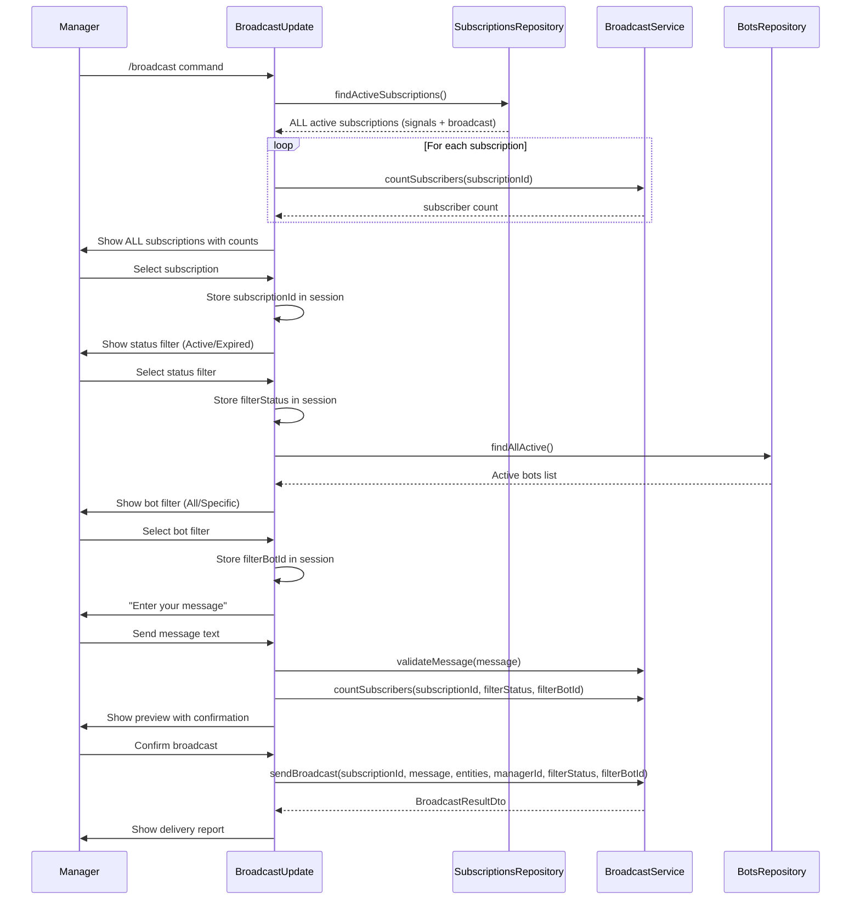
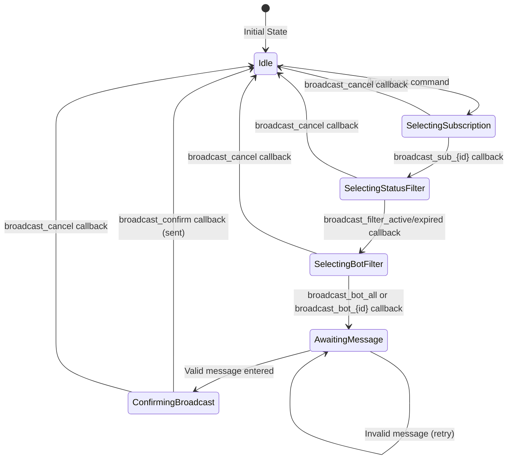

# Broadcast Command Extraction Design Document

## Overview

This design document describes the extraction of broadcast functionality from the existing `/subscription` command into a dedicated `/broadcast` command. The primary goals are separation of concerns (subscription management vs. message broadcasting) and enabling broadcasts to ALL subscription types (signals, broadcast, etc.) rather than only broadcast-type subscriptions.

## Background and Context

### Prerequisite ADRs

- No formal ADR required for this refactoring (no architecture changes, no new external dependencies)
- Common patterns applied: NestJS module structure, Telegraf Update handlers, Session-based state management
- Reference: [subscription-broadcast-design.md](./subscription-broadcast-design.md) - Existing broadcast architecture

### Agreement Checklist

#### Scope
- [x] Create new `broadcast.update.ts` file with `BroadcastUpdate` class
- [x] Create new `/broadcast` command handler
- [x] Extract all broadcast-related handlers from `masterbot.update.ts`
- [x] Modify broadcast to show ALL active subscriptions (not just broadcast-type)
- [x] Remove "Send message" button from `/subscription` menu
- [x] Register `BroadcastUpdate` in `masterbot.module.ts`
- [x] Add `BROADCAST` to `COMMANDS` constant

#### Non-Scope (Explicitly not changing)
- [x] `BroadcastService` - No changes to core broadcast logic
- [x] Session state types - Reusing existing `broadcastFilterStatus`, `broadcastFilterBotId` etc.
- [x] Filter flow (active/expired, bot selection) - Reusing existing implementation
- [x] Translation pipeline - No changes
- [x] `/subscription` create/close functionality - Preserved

#### Constraints
- [x] Parallel operation: No (immediate switch)
- [x] Backward compatibility: Not required (internal admin tool)
- [x] Performance measurement: Not required (no performance changes)

### Problem to Solve

The current `/subscription` command in `masterbot.update.ts` (1362 lines) mixes two distinct responsibilities:
1. **Subscription Management**: Create, close, view subscriptions
2. **Message Broadcasting**: Send messages to subscribers

This violates the Single Responsibility Principle and creates several issues:
- Large, monolithic file that is difficult to maintain
- Broadcast functionality is limited to broadcast-type subscriptions only
- Cannot broadcast to signals subscribers (the main user base)
- Navigation confusion: "Send message" appears under "Subscription management"

### Current Challenges

1. **File Size**: `masterbot.update.ts` at 1362 lines is too large for a single Update class
2. **Limited Broadcast Scope**: Current implementation filters `getActiveBroadcastSubscriptions()` which excludes signals
3. **UX Confusion**: Broadcasting is a communication feature, not a subscription management feature
4. **Code Reuse**: Broadcast handlers and subscription handlers share the same class instance state

### Requirements

#### Functional Requirements

1. **New `/broadcast` Command**
   - Shows ALL active subscriptions (signals + all broadcast types)
   - Uses existing filter flow (status: active/expired, bot selection)
   - Sends message to selected subscription's subscribers

2. **Modified `/subscription` Command**
   - Removes "Send message" (broadcast) button
   - Retains only: Create subscription, Close subscription

3. **Code Organization**
   - New `BroadcastUpdate` class in separate file
   - All broadcast handlers extracted from `MasterbotUpdate`
   - Proper module registration

#### Non-Functional Requirements

- **Maintainability**: Separate files for separate concerns
- **Testability**: Smaller, focused classes are easier to test
- **Readability**: Clear file names indicate responsibility

## Acceptance Criteria (AC)

### New /broadcast Command
- [ ] `/broadcast` command responds with list of ALL active subscriptions
- [ ] List includes signals subscription (if active)
- [ ] List includes all broadcast-type subscriptions with subscribers
- [ ] Each subscription shows subscriber count
- [ ] Subscriptions with 0 subscribers are filtered out

### Broadcast Filter Flow
- [ ] After subscription selection, status filter keyboard appears (Active/Expired)
- [ ] After status selection, bot filter keyboard appears (All bots / Specific bot)
- [ ] After bot selection, message input prompt appears
- [ ] Message preview shows subscription name, target status, target bot, recipient count
- [ ] Confirm/Cancel buttons work correctly

### Removed /subscription Broadcast Option
- [ ] `/subscription` menu shows only "Create subscription" and "Close subscription"
- [ ] "Send message" button is removed from subscription menu

### Code Organization
- [ ] `broadcast.update.ts` file exists with `BroadcastUpdate` class
- [ ] `BroadcastUpdate` is registered in `masterbot.module.ts`
- [ ] `BROADCAST` command constant added to `constants.ts`
- [ ] `MasterbotUpdate` no longer contains broadcast handlers
- [ ] All broadcast-related session state is properly managed in `BroadcastUpdate`

### Backward Compatibility (Internal Tool)
- [ ] Existing subscription create flow works unchanged
- [ ] Existing subscription close flow works unchanged
- [ ] Code generation via `/code` works unchanged

## Existing Codebase Analysis

### Implementation Path Mapping

| Type | Path | Description |
|------|------|-------------|
| Existing | `libs/masterbot/src/masterbot.update.ts` | Current implementation (to be reduced) |
| Existing | `libs/masterbot/src/masterbot.module.ts` | Module registration (to be updated) |
| Existing | `libs/masterbot/src/constants.ts` | Constants (to be updated) |
| Existing | `libs/masterbot/src/interfaces/user-context.interface.ts` | Session types (unchanged) |
| Existing | `libs/masterbot/src/services/broadcast.service.ts` | Broadcast logic (unchanged) |
| Existing | `libs/masterbot/src/services/subscription-management.service.ts` | Subscription management (unchanged) |
| **New** | `libs/masterbot/src/broadcast.update.ts` | New broadcast handlers |

### Similar Functionality Search Results

**Search performed**: Broadcast-related handlers, `/broadcast` command implementations

**Result**: No existing `/broadcast` command. Broadcast functionality exists only within `/subscription` flow in `masterbot.update.ts`.

**Decision**: New implementation following existing patterns from `MasterbotUpdate`.

### Integration Points

| Integration Target | Invocation Method | Description |
|-------------------|-------------------|-------------|
| BroadcastService | Dependency injection | Message sending, subscriber counting |
| SubscriptionsRepository | Dependency injection | Fetch ALL subscriptions (new: signals + broadcast) |
| BotsRepository | Dependency injection | Bot filter selection |
| MasterbotService | Dependency injection | Manager action logging |
| Session state | UserContext.session | Multi-step flow state management |

### Methods to Extract from MasterbotUpdate

The following methods and handlers will be extracted to `BroadcastUpdate`:

| Current Method | Lines | New Location | Notes |
|----------------|-------|--------------|-------|
| `onBroadcast` | 648-718 | `BroadcastUpdate.onBroadcastMenu` | **Modified**: Use all subscriptions |
| `onBroadcastSubscriptionSelected` | 720-789 | `BroadcastUpdate.onBroadcastSubscriptionSelected` | Unchanged |
| `onBroadcastConfirm` | 791-875 | `BroadcastUpdate.onBroadcastConfirm` | Unchanged |
| `onBroadcastCancel` | 877-892 | `BroadcastUpdate.onBroadcastCancel` | Unchanged |
| `onBroadcastFilterActive` | 900-923 | `BroadcastUpdate.onBroadcastFilterActive` | Unchanged |
| `onBroadcastFilterExpired` | 929-952 | `BroadcastUpdate.onBroadcastFilterExpired` | Unchanged |
| `onBroadcastBotAll` | 958-985 | `BroadcastUpdate.onBroadcastBotAll` | Unchanged |
| `onBroadcastBotSelected` | 991-1062 | `BroadcastUpdate.onBroadcastBotSelected` | Unchanged |
| `showStatusFilterKeyboard` | 1067-1093 | `BroadcastUpdate.showStatusFilterKeyboard` | Unchanged |
| `showBotFilterKeyboard` | 1099-1133 | `BroadcastUpdate.showBotFilterKeyboard` | Unchanged |
| `handleBroadcastMessageInput` | 1217-1361 | `BroadcastUpdate.handleBroadcastMessageInput` | Unchanged |
| `ensureSession` | 361-373 | `BroadcastUpdate.ensureSession` | Copy (shared utility) |

### Methods Remaining in MasterbotUpdate

| Method | Lines | Notes |
|--------|-------|-------|
| `onStart` | 47-69 | Unchanged |
| `onStats` | 71-106 | Unchanged |
| `onHelp` | 108-134 | Updated help text (add /broadcast) |
| `onCode` | 136-199 | Unchanged |
| `onSubscriptionSelected` | 228-329 | Unchanged (code generation) |
| Menu action handlers | 331-353 | Unchanged |
| `onSubscriptionMenu` | 375-414 | **Modified**: Remove broadcast button |
| `onCreateSubscription` | 418-445 | Unchanged |
| `onCloseSubscription` | 449-500 | Unchanged |
| `onCloseSubscriptionSelected` | 502-581 | Unchanged |
| `onConfirmCloseSubscription` | 583-638 | Unchanged |
| `onCancelCloseSubscription` | 640-644 | Unchanged |
| `onText` | 1137-1155 | **Modified**: Remove broadcast message handling |
| `handleSubscriptionNameInput` | 1159-1215 | Unchanged |

## Design

### Change Impact Map

```yaml
Change Target: Broadcast command extraction
Direct Impact:
  - libs/masterbot/src/masterbot.update.ts (handler removal, menu modification)
  - libs/masterbot/src/masterbot.module.ts (new provider registration)
  - libs/masterbot/src/constants.ts (new BROADCAST command)
  - libs/masterbot/src/broadcast.update.ts (new file)
Indirect Impact:
  - Help text update (/help command mentions /broadcast)
  - UX flow: Users must use /broadcast instead of /subscription for messaging
No Ripple Effect:
  - BroadcastService (unchanged)
  - SubscriptionManagementService (unchanged)
  - Session state types (reused)
  - Translation pipeline (unchanged)
  - Filter flow logic (unchanged)
```

### Interface Change Matrix

| Existing Method | New Method | Conversion Required | Compatibility Method |
|----------------|------------|---------------------|---------------------|
| `/subscription` broadcast button | `/broadcast` command | Yes | Remove button, add command |
| `getActiveBroadcastSubscriptions()` | `findActiveSubscriptions()` | Yes | Use repository method for ALL types |
| N/A | `BroadcastUpdate` class | New | Module registration |

### Architecture Overview

```mermaid
graph TB
    subgraph MasterBot["MasterBot Module (After Extraction)"]
        MU[MasterbotUpdate<br/>Subscription Management]
        BU[BroadcastUpdate<br/>Message Broadcasting]
        MMS[MasterbotService]
        SMS[SubscriptionManagementService]
        BS[BroadcastService]
    end

    subgraph Commands["Telegram Commands"]
        C1[/subscription]
        C2[/broadcast]
        C3[/code]
        C4[/stats]
    end

    subgraph Database["Database Layer"]
        SR[SubscriptionsRepository]
        USR[UserSubscriptionsRepository]
        BR[BotsRepository]
    end

    C1 --> MU
    C2 --> BU
    C3 --> MU
    C4 --> MU

    MU --> SMS
    MU --> MMS
    BU --> BS
    BU --> SR
    BU --> BR
    BU --> MMS

    SMS --> SR
    BS --> SR
    BS --> USR
```

### Data Flow



### Session State Machine (BroadcastUpdate)



### Main Components

#### BroadcastUpdate (New)

- **Responsibility**: Handle `/broadcast` command and all broadcast-related callbacks
- **Interface**: Telegraf decorators (`@Command`, `@Action`, `@On`)
- **Dependencies**: BroadcastService, SubscriptionsRepository, BotsRepository, MasterbotService

```typescript
@Update()
@UseInterceptors(ResponseTimeInterceptor)
@UseFilters(TelegrafExceptionFilter)
export class BroadcastUpdate {
  private readonly logger = new Logger(BroadcastUpdate.name);

  constructor(
    @InjectBot(BotName)
    private readonly bot: Telegraf<UserContext>,
    private readonly broadcastService: BroadcastService,
    private readonly subscriptionsRepository: SubscriptionsRepository,
    private readonly botsRepository: BotsRepository,
    private readonly masterbotService: MasterbotService,
  ) {}

  // Command handler
  @Command('broadcast')
  async onBroadcastCommand(@Ctx() ctx: UserContext): Promise<void>

  // Action handlers (extracted from MasterbotUpdate)
  @Action(/^broadcast_sub_(\d+)$/)
  async onBroadcastSubscriptionSelected(@Ctx() ctx: UserContext): Promise<void>

  @Action('broadcast_filter_active')
  async onBroadcastFilterActive(@Ctx() ctx: UserContext): Promise<void>

  @Action('broadcast_filter_expired')
  async onBroadcastFilterExpired(@Ctx() ctx: UserContext): Promise<void>

  @Action('broadcast_bot_all')
  async onBroadcastBotAll(@Ctx() ctx: UserContext): Promise<void>

  @Action(/^broadcast_bot_(\d+)$/)
  async onBroadcastBotSelected(@Ctx() ctx: UserContext): Promise<void>

  @Action('broadcast_confirm')
  async onBroadcastConfirm(@Ctx() ctx: UserContext): Promise<void>

  @Action('broadcast_cancel')
  async onBroadcastCancel(@Ctx() ctx: UserContext): Promise<void>

  // Text handler for broadcast flow
  @On('text')
  async onText(@Ctx() ctx: UserContext): Promise<void>

  // Private helpers
  private ensureSession(ctx: UserContext): void
  private showStatusFilterKeyboard(ctx: UserContext): Promise<void>
  private showBotFilterKeyboard(ctx: UserContext): Promise<void>
  private handleBroadcastMessageInput(ctx: UserContext): Promise<void>
}
```

#### MasterbotUpdate (Modified)

- **Responsibility**: Handle subscription management, code generation, stats
- **Changes**:
  - Remove broadcast handlers
  - Remove "Send message" button from `/subscription` menu
  - Update text handler to not handle broadcast flow
  - Update `/help` to mention `/broadcast`

```typescript
@Update()
export class MasterbotUpdate {
  // REMOVED: All broadcast handlers
  // REMOVED: handleBroadcastMessageInput
  // REMOVED: showStatusFilterKeyboard, showBotFilterKeyboard

  @Command('subscription')
  async onSubscriptionMenu(@Ctx() ctx: UserContext): Promise<void> {
    // MODIFIED: Only show Create and Close buttons
    await ctx.reply('Manage subscriptions:', {
      ...Markup.inlineKeyboard([
        [Markup.button.callback('Create subscription', 'subscription_create')],
        [Markup.button.callback('Close subscription', 'subscription_close')],
        // REMOVED: [Markup.button.callback('Send message', 'subscription_broadcast')]
      ]),
    });
  }

  @On('text')
  async onText(@Ctx() ctx: UserContext): Promise<void> {
    // MODIFIED: Only handle subscription name input
    if (flowState === 'awaiting_subscription_name') {
      await this.handleSubscriptionNameInput(ctx);
    }
    // REMOVED: awaiting_broadcast_message handling
  }
}
```

### Type Definitions

No new types required. Reusing existing session state types from `UserContext`:

```typescript
// Existing session state (unchanged)
interface UserContext extends Context {
  session: Context['session'] & {
    flowState?:
      | 'awaiting_subscription_name'
      | 'awaiting_broadcast_message'
      | 'confirming_broadcast'
      | 'selecting_status_filter'
      | 'selecting_bot_filter'
      | null;
    broadcastSubscriptionId?: number | null;
    broadcastMessage?: string | null;
    broadcastMessageEntities?: MessageEntity[] | null;
    broadcastFilterStatus?: 'active' | 'expired' | null;
    broadcastFilterBotId?: number | null;
  };
}
```

### Constants Updates

```typescript
// libs/masterbot/src/constants.ts
export const MASTERBOT_CONSTANTS = {
  COMMANDS: {
    START: '/start',
    STATS: '/stats',
    CODE: '/code',
    HELP: '/help',
    SUBSCRIPTION: '/subscription',
    BROADCAST: '/broadcast',  // NEW
  },
  // ... rest unchanged
} as const;
```

### Data Contract

#### BroadcastUpdate.onBroadcastCommand

```yaml
Input:
  ctx: UserContext with manager authentication
Preconditions:
  - Manager must be authenticated
Output:
  - Telegram message with inline keyboard of ALL active subscriptions
  - Each button shows subscription name and subscriber count
On Error:
  - Reply with error message
  - Log error
```

#### Key Difference from Current Implementation

**Current** (`onBroadcast` in MasterbotUpdate):
```typescript
// Uses getActiveBroadcastSubscriptions() - ONLY broadcast type
const subscriptions = await this.subscriptionManagementService.getActiveBroadcastSubscriptions();
```

**New** (`onBroadcastCommand` in BroadcastUpdate):
```typescript
// Uses findActiveSubscriptions() - ALL subscription types
const subscriptions = await this.subscriptionsRepository.findActiveSubscriptions();
```

### Integration Boundary Contracts

```yaml
Boundary Name: BroadcastUpdate <-> SubscriptionsRepository
  Input: None (for findActiveSubscriptions)
  Output: Subscription[] (all active, any type) - async
  On Error: Throw Error, caught by handler

Boundary Name: BroadcastUpdate <-> BroadcastService
  Input: subscriptionId, message, entities, managerId, filterStatus, filterBotId
  Output: BroadcastResultDto - async
  On Error: Throw Error, caught by handler

Boundary Name: BroadcastUpdate <-> Session State
  Input: ctx.session.* properties
  Output: void (mutates session)
  On Error: ensureSession() initializes defaults
```

### Error Handling

| Error Type | Location | Handling Strategy |
|------------|----------|-------------------|
| Manager not authenticated | All handlers | Reply with AUTH_REQUIRED message |
| No active subscriptions | onBroadcastCommand | Reply with informative message |
| No subscriptions with subscribers | onBroadcastCommand | Reply with informative message |
| Subscription not found | onBroadcastSubscriptionSelected | Reply with error, clear session |
| Message validation failed | handleBroadcastMessageInput | Reply with validation error |
| Session data loss | onBroadcastConfirm | Reply with session error |
| Broadcast send failure | onBroadcastConfirm | Log error, reply with failure message |

## Implementation Plan

### Implementation Approach

**Selected Approach**: Vertical Slice
**Selection Reason**: The extraction is a focused refactoring task that creates a complete, independently testable component. All broadcast functionality moves as a unit.

### Technical Dependencies and Implementation Order

#### Required Implementation Order

1. **Add BROADCAST constant** (5 min)
   - Technical Reason: Required for command handler registration
   - Dependent Elements: BroadcastUpdate command decorator

2. **Create BroadcastUpdate class** (30 min)
   - Technical Reason: Core extraction target
   - Prerequisites: BROADCAST constant
   - Implementation: Copy handlers from MasterbotUpdate with modifications

3. **Register BroadcastUpdate in module** (5 min)
   - Technical Reason: NestJS requires provider registration
   - Prerequisites: BroadcastUpdate class exists

4. **Modify MasterbotUpdate** (15 min)
   - Technical Reason: Remove extracted code, update menu
   - Prerequisites: BroadcastUpdate tested and working

5. **Update help text** (5 min)
   - Technical Reason: User documentation
   - Prerequisites: All handlers working

### Integration Points

**Integration Point 1: BroadcastUpdate Registration**
- Components: BroadcastUpdate -> MasterbotModule
- Verification: `/broadcast` command responds

**Integration Point 2: Subscription List (ALL types)**
- Components: BroadcastUpdate -> SubscriptionsRepository
- Verification: Signals subscription appears in list

**Integration Point 3: Session State Sharing**
- Components: BroadcastUpdate <-> Telegraf Session
- Verification: Multi-step flow completes successfully

## Test Strategy

### Unit Tests

- BroadcastUpdate handlers respond to commands and callbacks
- Session state initialization (ensureSession)
- Subscription list includes ALL types (not filtered to broadcast)

### Integration Tests

- Full `/broadcast` flow with subscription selection
- Filter selection flow (status -> bot)
- Message input and confirmation flow
- Cancel at various stages

### E2E Tests

- `/broadcast` command shows signals subscription
- Complete broadcast to signals subscribers
- `/subscription` menu no longer shows broadcast option

### Test Cases Derived from Acceptance Criteria

| AC | Test Case | Type |
|----|-----------|------|
| `/broadcast` shows ALL subscriptions | Query includes signals type | Integration |
| Signals subscription visible | List contains type='signals' | Integration |
| Filter flow works | Status -> Bot -> Message | E2E |
| `/subscription` no broadcast button | Menu buttons = [Create, Close] | Unit |
| BroadcastUpdate registered | Module compiles with provider | Unit |

## Security Considerations

1. **Manager Authentication**: All handlers check `ctx.manager` before proceeding
2. **Session Isolation**: Each manager has independent session state
3. **Audit Trail**: Manager actions logged via `logManagerAction`

## Future Extensibility

1. **Broadcast Scheduling**: BroadcastUpdate can add scheduled message support
2. **Broadcast Templates**: Template selection can be added to the flow
3. **Analytics**: Separate update class enables focused broadcast metrics

## Alternative Solutions

### Alternative 1: Keep Broadcast in MasterbotUpdate

- **Overview**: Add `/broadcast` as alias, keep code in single file
- **Advantages**: No file structure changes
- **Disadvantages**: File remains large, SRP violation persists
- **Reason for Rejection**: Does not solve maintainability issues

### Alternative 2: Partial Extraction (Service Only)

- **Overview**: Create BroadcastFlowService to handle logic, keep handlers in MasterbotUpdate
- **Advantages**: Smaller service scope
- **Disadvantages**: Handlers still in large file, awkward service boundaries
- **Reason for Rejection**: Handler extraction provides cleaner separation

## Risks and Mitigation

| Risk | Impact | Probability | Mitigation |
|------|--------|-------------|------------|
| Session state conflicts | High | Low | Reuse existing session types exactly |
| Text handler duplication | Medium | Medium | Both classes register @On('text'), but check flowState |
| Missing handler extraction | High | Low | Comprehensive method list in design doc |
| Regression in /subscription | Medium | Low | Test create/close flows after removal |

## References

- [subscription-broadcast-design.md](./subscription-broadcast-design.md) - Original broadcast design
- [masterbot.update.ts](../../libs/masterbot/src/masterbot.update.ts) - Current implementation
- [broadcast.service.ts](../../libs/masterbot/src/services/broadcast.service.ts) - Broadcast service

## Update History

| Date | Version | Changes | Author |
|------|---------|---------|--------|
| 2026-01-09 | 1.0 | Initial version | Claude |
