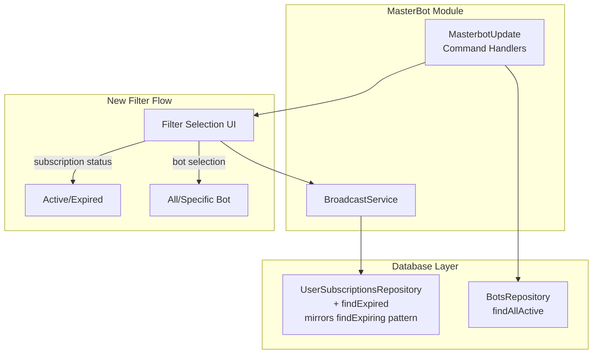
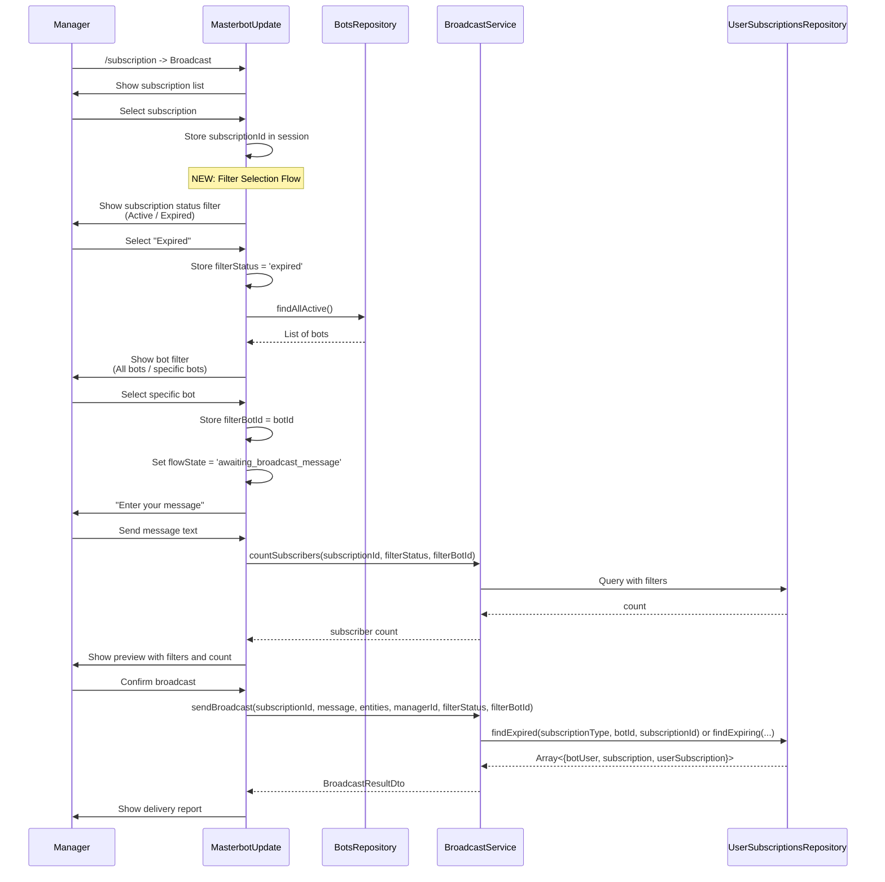
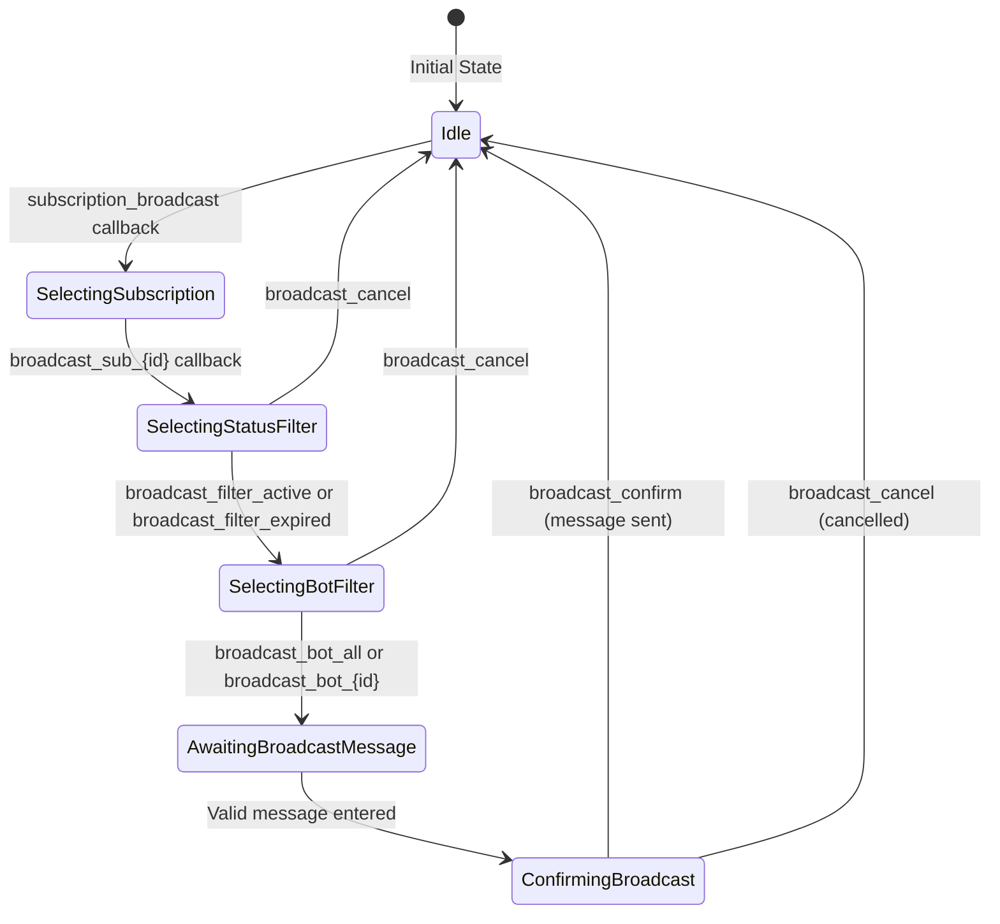

# Broadcast Message Filtering Extension Design Document

## Overview

This design document describes the technical architecture for extending the MasterBot broadcast functionality with two new filtering capabilities:
1. **Expired Subscription Filter**: Broadcast to users whose signals subscriptions have expired (as a re-engagement mechanism)
2. **Bot-specific Filter**: Broadcast to users of a specific bot or all bots

The feature extends the existing broadcast flow with additional filter selection steps before message composition.

## Background and Context

### Prerequisite ADRs

- **ADR-004-multi-bot-architecture.md**: Multi-bot database architecture - Per-bot subscriptions, bot_users table, botId conventions
- **ADR-COMMON-multi-bot-context.md**: botId convention (all bots use database ID), BotRegistry pattern, per-bot queries
- **ADR-COMMON-message-resolution.md**: Message resolution hierarchy for bot-specific localization

### Agreement Checklist

#### Scope
- [x] Extend BroadcastService with new filter parameters
- [x] Add new repository method for querying expired signals subscribers
- [x] Extend MasterBot handler flow with filter selection UI
- [x] Update session state to track selected filters
- [x] Add constants for new callback actions

#### Non-Scope (Explicitly not changing)
- [x] Core broadcast subscription type creation/closure flow
- [x] Message translation pipeline (LLMService integration)
- [x] NotificationService queue-based delivery
- [x] Code generation flow
- [x] Active subscriber broadcast (existing functionality - must remain working)

#### Constraints
- [x] Parallel operation: Yes - existing broadcast to active subscribers must work alongside new filters
- [x] Backward compatibility: Required - current flow must remain functional
- [x] Performance measurement: Not required for initial implementation
- [x] Telegram API: 4096 character message limit unchanged

### Problem to Solve

Managers need to:
1. **Re-engage churned users**: Broadcast promotional messages to users whose signals subscriptions have expired to encourage renewal
2. **Bot-specific campaigns**: Send targeted messages to users of a specific partner bot (e.g., bot-specific promotions, localized campaigns)

### Current Challenges

1. **No expired user targeting**: Current broadcast only targets active subscribers (`isActive = true AND expiresAt >= NOW()`)
2. **No bot filtering**: Current broadcast sends to all subscribers regardless of which bot they subscribed through
3. **Limited segmentation**: No ability to combine filters (expired + specific bot)

### Requirements

#### Functional Requirements

1. **FR1**: Manager can choose to broadcast to "Active" OR "Expired" signals subscribers
2. **FR2**: Manager can choose to broadcast to "All bots" OR a specific bot
3. **FR3**: Filters can be combined (e.g., expired subscribers of a specific bot)
4. **FR4**: Filter selection happens after selecting the subscription but before message input
5. **FR5**: Preview screen shows the selected filters and recipient count

#### Non-Functional Requirements

- **Performance**: Query for expired subscribers should complete within 2 seconds for up to 10,000 records
- **Scalability**: Filter queries should use proper indexes
- **Reliability**: Fallback to existing behavior if filter state is lost
- **Maintainability**: Filter logic separated from message delivery logic

## Acceptance Criteria (AC)

### AC1: Expired Subscription Filter Selection
- [ ] After selecting a subscription, manager sees filter options: "Active subscribers" (default) and "Expired subscribers"
- [ ] Selecting "Expired subscribers" filters users with `isActive = false AND expiresAt < NOW() AND subscription.type = 'signals'`
- [ ] Only users who had signals-type subscriptions are eligible for expired filter
- [ ] Only users where `bot_users.is_active = true` are included (excludes fully churned users)
- [ ] **Global targeting mode**: When "All expired signals" is selected, query ALL users with ANY expired signals subscription
- [ ] **Subscription-scoped mode**: When a specific subscription is selected, query users with expired that specific subscription only
- [ ] Users with multiple subscriptions are included if ANY signals subscription is expired (in global mode)

### AC2: Bot Selection Filter
- [ ] Manager can select "All bots" (default) or a specific bot from list of active bots
- [ ] Bot list shows bot name (e.g., "QuantumDealBot", "SignalBot")
- [ ] When specific bot selected, only users subscribed via that bot are targeted
- [ ] When "All bots" selected, users from all bots are targeted

### AC3: Filter Combination
- [ ] Both filters can be applied together (expired + specific bot)
- [ ] Recipient count reflects combined filter results
- [ ] Preview message shows both applied filters

### AC4: Message Preview with Filters
- [ ] Preview shows "Target: Active/Expired subscribers"
- [ ] Preview shows "Bot: All bots / [Bot Name]"
- [ ] Recipient count updates based on filter selection

### AC5: Backward Compatibility
- [ ] Existing broadcast flow to active subscribers continues working
- [ ] Default behavior (no filters selected) is identical to current behavior
- [ ] Session state for filters is properly initialized for existing flows

## Existing Codebase Analysis

### Implementation Path Mapping

| Type | Path | Description |
|------|------|-------------|
| Existing | `libs/masterbot/src/services/broadcast.service.ts` | Main broadcast logic - needs filter parameters |
| Existing | `libs/masterbot/src/masterbot.update.ts` | Handler - needs filter selection flow |
| Existing | `libs/masterbot/src/constants.ts` | Callback actions - needs new filter actions |
| Existing | `libs/masterbot/src/interfaces/user-context.interface.ts` | Session state - needs filter fields |
| Existing | `libs/masterbot/src/dto/broadcast.dto.ts` | DTOs - needs filter types |
| Existing | `libs/db/src/repositories/user-subscriptions.repository.ts` | User subscription queries - needs expired query |
| Existing | `libs/db/src/repositories/bots.repository.ts` | Bot list retrieval |
| New | N/A (extends existing) | No new files needed - extends existing components |

### Similar Functionality Search

**Search Results**:
- `findExpiring` in `user-subscriptions.repository.ts` (line 67-113): **PRIMARY PATTERN REFERENCE** - Method signature and implementation style to follow
- `findExpiredTrials` in `user-subscriptions.repository.ts` (line 356-381): Existing method for finding expired trials - simpler variant without subscription type filtering
- `findActiveUsersWithActiveSubscription` (line 162-212): Existing method with subscription type filtering - provides pattern for subscription type conditional logic

**Decision**: Create `findExpired` method following `findExpiring` pattern exactly (same signature style, same return type, same Drizzle ORM conditions approach). The only difference is the date condition logic (expired vs expiring in N days).

### Integration Points

| Integration Target | Invocation Method | Description |
|-------------------|-------------------|-------------|
| BroadcastService | Method extension | Add filter parameters to sendBroadcast and countSubscribers |
| UserSubscriptionsRepository | New method | Add `findExpired(subscriptionType?, botId?, subscriptionId?)` following findExpiring pattern |
| BotsRepository | Existing method | Use findAllActive() for bot selection list |
| MasterbotUpdate | Flow extension | Add filter selection steps in broadcast flow |

## Design

### Change Impact Map

```yaml
Change Target: Broadcast message filtering
Direct Impact:
  - libs/masterbot/src/services/broadcast.service.ts (sendBroadcast, countSubscribers signature)
  - libs/masterbot/src/masterbot.update.ts (onBroadcast, onBroadcastSubscriptionSelected handlers)
  - libs/masterbot/src/constants.ts (new callback action constants)
  - libs/masterbot/src/interfaces/user-context.interface.ts (session filter fields)
  - libs/db/src/repositories/user-subscriptions.repository.ts (new findExpired method following findExpiring pattern)
Indirect Impact:
  - libs/masterbot/src/dto/broadcast.dto.ts (filter type definitions)
No Ripple Effect:
  - Existing broadcast functionality (active subscribers)
  - Existing findExpiring method (unchanged)
  - Message translation pipeline
  - NotificationService queue
  - Code generation flow
  - Subscription create/close flows
```

### Architecture Overview



### Extended Broadcast Flow



### Session State Machine Extension



### Extended Session State Definition

```typescript
interface SessionState {
  // Existing fields
  flowState?:
    | 'awaiting_subscription_name'
    | 'awaiting_broadcast_message'
    | 'confirming_broadcast'
    | 'selecting_status_filter'    // NEW
    | 'selecting_bot_filter'       // NEW
    | null;
  commandContext?: string | null;
  broadcastSubscriptionId?: number | null;
  broadcastMessage?: string | null;
  broadcastMessageEntities?: MessageEntity[] | null;

  // NEW: Filter fields
  broadcastFilterStatus?: 'active' | 'expired' | null;
  broadcastFilterBotId?: number | null;  // null = all bots
}
```

### Main Components

#### UserSubscriptionsRepository Extension

- **Responsibility**: Query expired signals subscribers with optional bot and subscription filtering
- **Interface**: New method `findExpired(subscriptionType?, botId?, subscriptionId?)` following `findExpiring` pattern
- **Dependencies**: DrizzleORM, botUsers table, subscriptions table

```typescript
/**
 * Find users with expired subscriptions (mirrors findExpiring pattern without daysFromNow)
 *
 * Pattern Reference: Based on existing findExpiring method signature and implementation style
 *
 * Supports TWO query modes:
 * 1. Global query (subscriptionId = null): Query ALL users with ANY expired subscription of given type
 * 2. Subscription-scoped query (subscriptionId provided): Query users with expired specific subscription
 *
 * Filters (Drizzle ORM conditions pattern):
 * - isActive = false (subscription deactivated - contrast to findExpiring which uses isActive = true)
 * - expiresAt IS NOT NULL
 * - expiresAt < NOW() (already expired - contrast to findExpiring which checks exact date)
 * - bot_users.is_active = true (only active bot users, exclude churned)
 * - Optional: filter by subscriptionType ('signals' or 'subscription_%')
 * - Optional: filter by botId
 * - Optional: filter by subscriptionId
 *
 * @param subscriptionType - Optional filter by subscription type ('signals' or 'subscription_%')
 * @param botId - Optional bot ID filter (undefined = all bots)
 * @param subscriptionId - Optional subscription ID filter (undefined = all expired subscriptions)
 * @returns Array of expired subscribers with user, subscription, and userSubscription details
 */
async findExpired(
  subscriptionType?: string,
  botId?: number,
  subscriptionId?: number,
): Promise<
  Array<{
    botUser: BotUser;
    subscription: Subscription;
    userSubscription: UserSubscription;
  }>
>
```

#### BroadcastService Extension

- **Responsibility**: Support filter parameters in broadcast operations
- **Interface**: Extended `sendBroadcast` and `countSubscribers` methods
- **Dependencies**: UserSubscriptionsRepository (extended)

```typescript
/**
 * Count subscribers with optional filters
 *
 * @param subscriptionId - The subscription ID
 * @param filterStatus - 'active' | 'expired' (default: 'active')
 * @param filterBotId - Optional bot ID filter (null = all bots)
 */
async countSubscribers(
  subscriptionId: number,
  filterStatus?: 'active' | 'expired',
  filterBotId?: number | null,
): Promise<number>

/**
 * Send broadcast with optional filters
 *
 * @param subscriptionId - The subscription ID
 * @param message - The message content
 * @param entities - Message entities for formatting
 * @param managerId - Manager's Telegram ID
 * @param filterStatus - 'active' | 'expired' (default: 'active')
 * @param filterBotId - Optional bot ID filter (null = all bots)
 */
async sendBroadcast(
  subscriptionId: number,
  message: string,
  entities: MessageEntity[] | undefined,
  managerId: number,
  filterStatus?: 'active' | 'expired',
  filterBotId?: number | null,
): Promise<BroadcastResultDto>
```

#### MasterbotUpdate Handler Extension

- **Responsibility**: Handle filter selection callbacks, manage extended session state
- **Interface**: New action handlers for filter selection
- **Dependencies**: BotsRepository (for bot list)

### Type Definitions

```typescript
// Filter status type
type BroadcastFilterStatus = 'active' | 'expired';

// Extended session fields (in UserContext)
interface BroadcastFilterSession {
  broadcastFilterStatus?: BroadcastFilterStatus | null;
  broadcastFilterBotId?: number | null;  // null means all bots
}

// Bot selection item for UI
interface BotSelectionItem {
  id: number;
  name: string;
  username: string | null;
}

// Extended broadcast parameters
interface BroadcastParams {
  subscriptionId: number;
  message: string;
  entities?: MessageEntity[];
  managerId: number;
  filterStatus?: BroadcastFilterStatus;
  filterBotId?: number | null;
}
```

### Data Contract

#### findExpired (mirrors findExpiring pattern)

```yaml
Input:
  subscriptionType: string | undefined (optional, 'signals' | 'subscription_%' pattern, undefined = all types)
  botId: number | undefined (optional, undefined = all bots)
  subscriptionId: number | undefined (optional, undefined = all expired subscriptions)
Output:
  Array<{ botUser: BotUser; subscription: Subscription; userSubscription: UserSubscription }>
Preconditions:
  - Valid database connection
Query Modes:
  - Global Mode (subscriptionId = undefined): Returns all users with ANY expired subscription of given type
  - Subscription-Scoped Mode (subscriptionId provided): Returns users with expired specific subscription
Guarantees:
  - Only returns users with isActive = false AND expiresAt IS NOT NULL AND expiresAt < NOW()
  - Respects subscriptionType filter when provided (same logic as findExpiring)
  - Only returns users where bot_users.is_active = true (excludes fully churned users)
  - Returns empty array if no matches
  - Return type includes subscription object (consistent with findExpiring)
On Error:
  - Throws database error (propagate to caller)
```

#### countSubscribers (extended)

```yaml
Input:
  subscriptionId: number
  filterStatus: 'active' | 'expired' (default: 'active')
  filterBotId: number | null (default: null = all bots)
Output:
  number (count of matching subscribers)
Preconditions:
  - Subscription must exist
Guarantees:
  - Returns accurate count based on filters
  - filterStatus='active' uses existing active query
  - filterStatus='expired' uses new expired query
On Error:
  - Throws if subscription not found
```

### Integration Boundary Contracts

```yaml
Boundary Name: Filter Selection -> BroadcastService
  Input:
    subscriptionId: number
    filterStatus: 'active' | 'expired'
    filterBotId: number | null
  Output: Promise<number> (subscriber count) - async
  On Error: Throw Error with message

Boundary Name: BroadcastService -> UserSubscriptionsRepository
  Input:
    botId: number | null (for expired query)
    subscriptionId: number (for active query)
  Output: Promise<Array<subscriber>> - async
  On Error: Propagate database errors

Boundary Name: Session State Management
  Input: Filter selection callbacks
  Output: Updated session state (sync)
  On Error: Reset to initial state, show error message
```

### Database Query Design

#### findExpired Implementation (Drizzle ORM Conditions Pattern)

Following the `findExpiring` pattern, the implementation uses Drizzle ORM's condition builder:

```typescript
/**
 * Implementation mirrors findExpiring pattern:
 * - Uses conditions array with Drizzle ORM operators (eq, sql, like)
 * - Conditionally adds filters based on parameters
 * - Uses innerJoin for botUsers and subscriptions tables
 * - Returns consistent shape with botUser, subscription, userSubscription
 */
async findExpired(
  subscriptionType?: string,
  botId?: number,
  subscriptionId?: number,
): Promise<
  Array<{
    botUser: BotUser;
    subscription: Subscription;
    userSubscription: UserSubscription;
  }>
> {
  // Base conditions (contrast to findExpiring):
  // - isActive = false (expired) vs findExpiring's isActive = true (active)
  // - expiresAt < NOW() (past) vs findExpiring's expiresAt::date = CURRENT_DATE + N (future)
  const conditions = [
    eq(this.table.isActive, false),           // EXPIRED = isActive false
    eq(botUsers.isActive, true),              // Only active bot users
    sql`${this.table.expiresAt} IS NOT NULL`,
    sql`${this.table.expiresAt} < NOW()`,     // Already expired (no days param)
  ];

  // Optional bot filter (same as findExpiring)
  if (botId) {
    conditions.push(eq(this.table.botId, botId));
  }

  // Optional subscription type filter (same logic as findExpiring)
  if (subscriptionType) {
    if (subscriptionType === 'signals') {
      conditions.push(eq(subscriptions.type, 'signals'));
    } else if (subscriptionType.startsWith('subscription_')) {
      conditions.push(eq(subscriptions.type, subscriptionType));
    } else {
      // Filter for all broadcast subscriptions
      conditions.push(like(subscriptions.type, 'subscription_%'));
    }
  }

  // Optional subscription ID filter (additional filter not in findExpiring)
  if (subscriptionId) {
    conditions.push(eq(this.table.subscriptionId, subscriptionId));
  }

  // Query execution (same pattern as findExpiring)
  const result = await this.db
    .select({
      botUser: botUsers,
      subscription: subscriptions,
      userSubscription: this.table,
    })
    .from(this.table)
    .innerJoin(botUsers, eq(this.table.botUserId, botUsers.id))
    .innerJoin(subscriptions, eq(this.table.subscriptionId, subscriptions.id))
    .where(and(...conditions));

  return result;
}
```

**Key Differences from findExpiring**:
| Aspect | findExpiring | findExpired |
|--------|--------------|-------------|
| isActive condition | `eq(this.table.isActive, true)` | `eq(this.table.isActive, false)` |
| Date condition | `expiresAt::date = CURRENT_DATE + N` | `expiresAt < NOW()` |
| daysFromNow param | Required | Not applicable |
| subscriptionId filter | Not available | Optional |

**Query Mode Examples**:
- `findExpired('signals')` - All expired signals subscribers across all bots
- `findExpired('signals', 5)` - All expired signals subscribers of bot ID 5
- `findExpired('signals', undefined, 10)` - Users with expired subscription ID 10 across all bots
- `findExpired('signals', 5, 10)` - Users with expired subscription ID 10 from bot ID 5

#### Index Considerations

Existing indexes should suffice:
- `idx_user_subscriptions_bot` on `(bot_id)`
- `idx_user_subscriptions_bot_user` on `(bot_user_id)`

Recommended new index for expired queries:
```sql
CREATE INDEX idx_user_subscriptions_expired
ON user_subscriptions (is_active, expires_at)
WHERE is_active = false AND expires_at IS NOT NULL;
```

### Callback Actions Extension

```typescript
const CALLBACK_ACTIONS = {
  // ... existing actions ...

  // NEW: Filter selection actions
  BROADCAST_FILTER_ACTIVE: 'broadcast_filter_active',
  BROADCAST_FILTER_EXPIRED: 'broadcast_filter_expired',
  BROADCAST_BOT_ALL: 'broadcast_bot_all',
  BROADCAST_BOT_PREFIX: 'broadcast_bot_',  // broadcast_bot_{id}
};
```

### Error Handling

| Error Type | Location | Handling Strategy |
|------------|----------|-------------------|
| No expired subscribers found | MasterbotUpdate | Show "No expired subscribers" message, return to filter selection |
| Bot not found | MasterbotUpdate | Show error, reset filter to "All bots" |
| Session filter data loss | MasterbotUpdate | Reset filters to defaults (active, all bots), continue flow |
| Database query error | Repository | Log error, throw to caller, show generic error message |
| Invalid bot ID | Handler | Validate bot exists before storing in session |

### Logging and Monitoring

```typescript
// New logging points
logger.log(`Broadcast filter: status=${filterStatus}, botId=${filterBotId || 'all'}`);
logger.log(`Found ${count} ${filterStatus} subscribers for bot ${filterBotId || 'all bots'}`);
logger.debug(`Expired signals query executed in ${duration}ms`);
```

## Implementation Plan

### Implementation Approach

**Selected Approach**: Vertical Slice (Feature-driven)
**Selection Reason**: The feature is a self-contained extension that can be implemented end-to-end without affecting existing functionality. Each filter type (status, bot) can be delivered incrementally.

### Technical Dependencies and Implementation Order

#### Phase 1: Repository Layer (L3 Verification)
1. **UserSubscriptionsRepository.findExpired**
   - Technical Reason: Foundation query needed for service layer (mirrors `findExpiring` pattern)
   - Dependent Elements: BroadcastService, countSubscribers
   - Verification: Unit tests for query correctness, return type consistency with `findExpiring`

#### Phase 2: Service Layer (L2 Verification)
2. **BroadcastService.countSubscribers extension**
   - Technical Reason: Needs repository method from Phase 1
   - Prerequisites: findExpiredSignalsSubscribers
   - Verification: Unit tests with mocked repository

3. **BroadcastService.sendBroadcast extension**
   - Technical Reason: Needs extended countSubscribers
   - Prerequisites: countSubscribers with filters
   - Verification: Integration tests

#### Phase 3: Handler Layer (L1 Verification)
4. **Constants and Session State**
   - Technical Reason: Needed for handler implementation
   - Prerequisites: None
   - Verification: Type checking

5. **MasterbotUpdate filter handlers**
   - Technical Reason: Needs service layer complete
   - Prerequisites: All service layer changes
   - Verification: E2E test with Telegram

### Integration Points

**Integration Point 1: Repository -> Service**
- Components: UserSubscriptionsRepository -> BroadcastService
- Verification: Unit test countSubscribers with various filter combinations

**Integration Point 2: Service -> Handler**
- Components: BroadcastService -> MasterbotUpdate
- Verification: Integration test full broadcast flow with filters

**Integration Point 3: Handler -> User**
- Components: MasterbotUpdate -> Telegram UI
- Verification: E2E test filter selection and message delivery

### Migration Strategy

No data migration required. Schema changes are additive (optional index).

## Test Strategy

### Unit Tests

**Repository Tests**:
- `findExpired` returns only expired subscriptions (isActive = false, expiresAt < NOW())
- `findExpired` with subscriptionType='signals' filter returns only signals subscriptions
- `findExpired` with botId filter returns only that bot's users
- `findExpired` with undefined botId returns all bots' users
- `findExpired` returns consistent shape with botUser, subscription, userSubscription (matches findExpiring)
- `findExpired` with subscriptionId filter returns only specific subscription's expired users

**Service Tests**:
- `countSubscribers` with filterStatus='active' uses existing logic
- `countSubscribers` with filterStatus='expired' calls new repository method
- `sendBroadcast` respects filter parameters

### Integration Tests

- Full broadcast flow with expired filter
- Full broadcast flow with bot filter
- Combined filters (expired + specific bot)
- Filter count matches actual recipients

### E2E Tests

- Manager can complete broadcast to expired subscribers
- Manager can complete broadcast to specific bot users
- Preview shows correct filter descriptions and counts
- Backward compatibility: default flow (no filters) works

## Security Considerations

1. **Manager Authentication**: Filter actions require valid manager context (same as existing)
2. **Bot Access Validation**: Verify manager has access to selected bot (if applicable)
3. **Input Validation**: Validate botId is a real bot ID before use in queries
4. **Audit Trail**: Log filter selections in manager action logs

## Future Extensibility

1. **Additional Filters**: Framework supports adding more filter types (e.g., by subscription tier, by signup date)
2. **Filter Presets**: Save commonly used filter combinations
3. **Scheduled Filtered Broadcasts**: Combine with scheduling feature
4. **Filter Analytics**: Track effectiveness of different targeting strategies

## Alternative Solutions

### Alternative 1: Separate Commands for Each Filter

- **Overview**: Create `/broadcast_expired` and `/broadcast_bot` commands
- **Advantages**: Simpler implementation, no UI flow changes
- **Disadvantages**: Poor UX, no filter combination, command proliferation
- **Reason for Rejection**: Does not support filter combinations, worse user experience

### Alternative 2: SQL-based Filter Builder

- **Overview**: Allow managers to input SQL-like filter expressions
- **Advantages**: Maximum flexibility
- **Disadvantages**: High complexity, SQL injection risk, poor UX
- **Reason for Rejection**: Over-engineering, security concerns

## Risks and Mitigation

| Risk | Impact | Probability | Mitigation |
|------|--------|-------------|------------|
| Performance degradation for large expired user sets | Medium | Low | Add database index, implement pagination if needed |
| Session state complexity increase | Low | Medium | Clear session reset on cancel, defensive initialization |
| Filter state loss during long flows | Medium | Low | Store filters early, validate before send |
| Backward compatibility regression | High | Low | Extensive testing of default (no filter) flow |
| Bot list UI overflow | Low | Low | Implement scrollable inline keyboard if >10 bots |

## Rollback Strategy

In case of issues requiring rollback, follow these procedures:

### 1. Database Index Removal

```sql
-- Drop the new expired subscriptions index if performance issues occur
DROP INDEX IF EXISTS idx_user_subscriptions_expired;
```

### 2. Session State Clearing

If session state issues are detected, clear filter-related fields:

```typescript
// Reset filter session state for affected users
session.broadcastFilterStatus = null;
session.broadcastFilterBotId = null;
session.flowState = null;
```

### 3. Revert to Default Filter Behavior

To disable new filter functionality without code rollback:

1. **Handler Level**: Comment out filter selection callbacks, skip directly to message input
2. **Service Level**: Force `filterStatus = 'active'` regardless of session state
3. **Repository Level**: Keep new method but ensure default behavior matches original query

### 4. Full Code Rollback

If complete rollback is necessary:

1. Revert handler changes in `masterbot.update.ts`
2. Revert service changes in `broadcast.service.ts`
3. Keep or remove repository method (no breaking changes)
4. Remove new callback constants from `constants.ts`
5. Remove session filter fields from interface (optional, no breaking changes)

### 5. Data Considerations

- **No data migration required**: This feature is additive
- **No data loss on rollback**: Filter fields are optional session state only
- **Database changes**: Only optional index creation (easily reversible)

## UI Message Specifications

### Status Filter Selection Message

```
📊 *Select subscriber type*

Choose which subscribers to target:

[🟢 Active subscribers]  [🔴 Expired subscribers]

[❌ Cancel]
```

### Bot Filter Selection Message

```
🤖 *Select bot*

Choose which bot's subscribers to target:

[📱 All bots]
[QuantumDealBot (123 users)]
[SignalBot (45 users)]
[PartnerBot (67 users)]

[❌ Cancel]
```

### Preview Message with Filters

```
📊 *Broadcast preview*

📋 Subscription: Premium Signals
🎯 Target: Expired subscribers
🤖 Bot: QuantumDealBot
👥 Recipients: 45 users

*Message:*
[Message content here]

Send this message?

[✅ Send]  [❌ Cancel]
```

## References

- Existing implementation: `docs/design/subscription-broadcast-design.md`
- Multi-bot architecture: `docs/adr/ADR-004-multi-bot-architecture.md`
- Multi-bot context patterns: `docs/adr/ADR-COMMON-multi-bot-context.md`
- User subscriptions schema: `libs/db/src/schema/user-subscriptions.ts`
- Bot schema: `libs/db/src/schema/bots.ts`
- Current broadcast service: `libs/masterbot/src/services/broadcast.service.ts`
- Current handler: `libs/masterbot/src/masterbot.update.ts`
- **Pattern Reference**: `findExpiring` method in `libs/db/src/repositories/user-subscriptions.repository.ts` (line 67-113) - Primary implementation pattern for `findExpired`

## Update History

| Date | Version | Changes | Author |
|------|---------|---------|--------|
| 2026-01-09 | 1.0 | Initial version | Claude Code Architecture Agent |
| 2026-01-09 | 1.1 | ISSUE-001: Updated findExpiredSignalsSubscribers interface to support both global query (all expired signals) and subscription-scoped query (specific subscriptionId). ISSUE-002: Confirmed bot_users.is_active = true filter to exclude churned users. ISSUE-003: Added Rollback Strategy section. Updated AC1 with global/subscription-scoped targeting clarification. | Claude Code Architecture Agent |
| 2026-01-09 | 1.2 | **PATTERN ALIGNMENT**: Renamed `findExpiredSignalsSubscribers` to `findExpired` to match `findExpiring` naming convention. Updated signature to `findExpired(subscriptionType?, botId?, subscriptionId?)` following `findExpiring(daysFromNow, subscriptionType?, botId?)` pattern. Updated return type to include `subscription` object for consistency. Replaced raw SQL implementation with Drizzle ORM conditions pattern. Key differences: isActive=false (vs true), expiresAt < NOW() (vs exact date check), no daysFromNow param. | Claude Code Architecture Agent |
