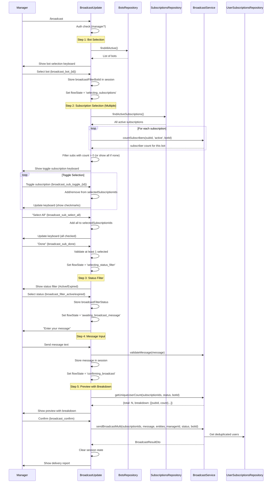
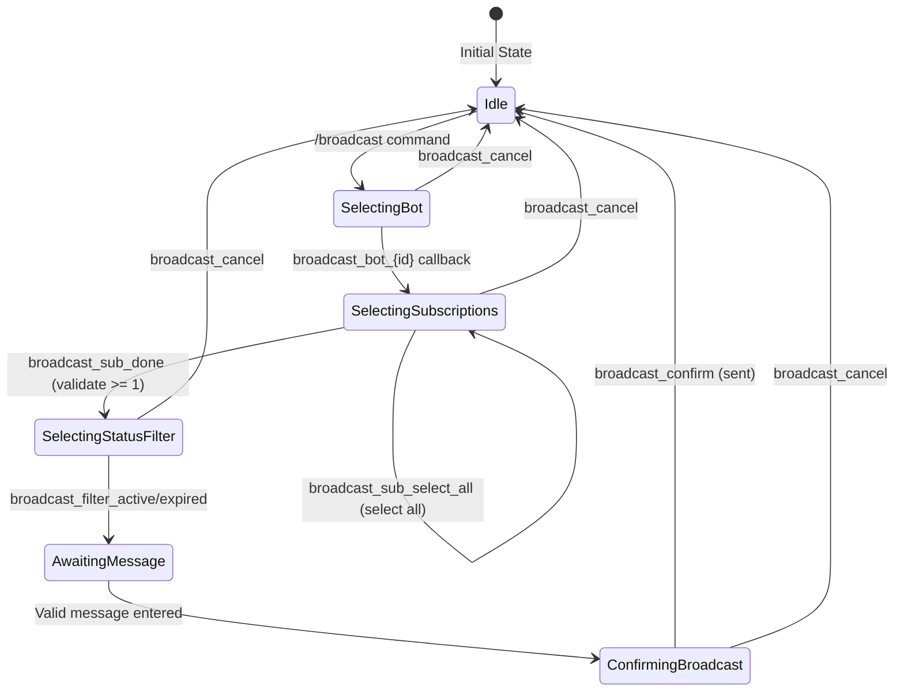

# Broadcast Flow Redesign Design Document

## Overview

This design document describes the technical architecture for redesigning the MasterBot `/broadcast` command flow. The changes reorder the step sequence and introduce multiple subscription selection with smart filtering.

**Change Summary**:
- **Old Flow**: /broadcast -> subscription -> status -> bot -> message -> confirmation
- **New Flow**: /broadcast -> bot -> subscriptions (multiple) -> status -> message -> confirmation

## Background and Context

### Prerequisite ADRs

- **ADR-004-multi-bot-architecture.md**: Multi-bot database architecture - Per-bot subscriptions, bot_users table, botId conventions
- **ADR-COMMON-multi-bot-context.md**: botId convention (all bots use database ID), BotRegistry pattern, per-bot queries
- **ADR-COMMON-signal-broadcasting.md**: Signal broadcasting orchestration patterns

### Related Design Documents

- **broadcast-filter-extension-design.md**: Previous filter extension design (status/bot filters) - provides base implementation patterns
- **subscription-broadcast-design.md**: Original broadcast subscription design - foundation architecture

### Agreement Checklist

#### Scope
- [x] Reorder broadcast flow steps (bot first, then subscriptions)
- [x] Implement multiple subscription selection UI with toggle buttons
- [x] Add "Select All" and "Done" buttons for subscription selection
- [x] Filter subscriptions based on subscriber count for selected bot
- [x] Show unique user count and per-subscription breakdown in preview
- [x] Update session state to support multiple selected subscriptions

#### Non-Scope (Explicitly not changing)
- [x] Core broadcast message delivery mechanism
- [x] Message translation pipeline (LLMService integration)
- [x] NotificationService queue-based delivery
- [x] Code generation flow
- [x] Subscription create/close flow

#### Constraints
- [x] Parallel operation: Existing single-subscription flow must remain conceptually compatible
- [x] Backward compatibility: Service layer interface changes must be minimal
- [x] Telegram API: 4096 character message limit unchanged
- [x] Empty subscription handling: Show all subscriptions if bot has no subscribers in any subscription

### Problem to Solve

Current flow limitations:
1. **Unintuitive order**: Subscription is selected before bot, making it unclear which bot's subscribers will receive the message
2. **Single subscription selection**: Cannot broadcast to multiple subscription groups simultaneously
3. **No filtering feedback**: Empty subscriptions are filtered out without context of selected bot

### Requirements

#### Functional Requirements

1. **FR1**: Flow starts with bot selection immediately after `/broadcast` command
2. **FR2**: After bot selection, show subscriptions with subscriber counts for that specific bot
3. **FR3**: Multiple subscriptions can be selected using toggle buttons
4. **FR4**: "Select All" button selects all available subscriptions
5. **FR5**: "Done" button proceeds to status filter selection
6. **FR6**: Preview shows total unique users and breakdown by subscription
7. **FR7**: If selected bot has 0 subscribers in all subscriptions, show all subscriptions anyway

#### Non-Functional Requirements

- **Performance**: Subscriber counting should be efficient with proper database queries
- **UX**: Toggle state should be visually clear (checkmark indicators)
- **Reliability**: Session state must handle multiple subscription IDs

## Acceptance Criteria (AC)

### AC1: Bot Selection First
- [ ] After `/broadcast` command, immediately show bot selection keyboard
- [ ] Bot list shows all active bots from `BotsRepository.findAllActive()`
- [ ] Bot selection stores `broadcastFilterBotId` in session

### AC2: Subscription Filtering by Bot
- [ ] After bot selection, query subscriptions with subscriber count for that bot only
- [ ] Subscriptions with 0 subscribers for selected bot are NOT displayed
- [ ] If ALL subscriptions have 0 subscribers for this bot, show ALL subscriptions (fallback)
- [ ] Each subscription button shows subscriber count: `[x] Subscription Name (N users)`

### AC3: Multiple Subscription Selection
- [ ] Subscription buttons act as toggles (select/deselect)
- [ ] Selected subscriptions show checkmark: `[v] Sub Name (N users)`
- [ ] Deselected subscriptions show empty: `[ ] Sub Name (N users)`
- [ ] "Select All" button selects all displayed subscriptions
- [ ] "Done" button requires at least one selection (show warning if none)

### AC4: Status Filter Step
- [ ] After subscription selection, show status filter (Active/Expired) - same as current
- [ ] Status filter applies to all selected subscriptions

### AC5: Preview with User Count Breakdown
- [ ] Preview shows total unique user count across all selected subscriptions
- [ ] Preview shows breakdown: "Subscription A: N users, Subscription B: M users"
- [ ] Unique count calculation: same user in multiple subscriptions counted once

### AC6: Broadcast Execution
- [ ] Message sent to all users from all selected subscriptions
- [ ] Users are deduplicated (user in multiple subscriptions receives message once)
- [ ] Result shows total queued count (deduplicated)

## Existing Codebase Analysis

### Implementation Path Mapping

| Type | Path | Description |
|------|------|-------------|
| Existing | `libs/masterbot/src/broadcast.update.ts` | Main broadcast handlers - MAJOR CHANGES |
| Existing | `libs/masterbot/src/services/broadcast.service.ts` | Broadcast logic - needs multi-subscription support |
| Existing | `libs/masterbot/src/constants.ts` | Callback actions - needs new actions |
| Existing | `libs/masterbot/src/interfaces/user-context.interface.ts` | Session state - needs array for subscriptions |
| Existing | `libs/db/src/repositories/subscriptions.repository.ts` | Subscription queries |
| Existing | `libs/db/src/repositories/user-subscriptions.repository.ts` | User subscription queries |
| Existing | `libs/db/src/repositories/bots.repository.ts` | Bot list retrieval |

### Similar Functionality Search

**Search Results**:
- `showBotFilterKeyboard` in `broadcast.update.ts` (line 548-582): Existing bot selection UI - can be adapted
- `findSubscribersWithUserDetails` in `user-subscriptions.repository.ts`: Subscriber query with bot filtering
- `countSubscribers` in `broadcast.service.ts`: Subscriber counting logic - needs bot parameter support

**Decision**: Extend existing implementations rather than create new patterns.

### Integration Points

| Integration Target | Method | Description |
|-------------------|--------|-------------|
| BroadcastUpdate | Handler reorder | Change step sequence |
| BroadcastService | countSubscribers | Add bot filter parameter |
| BroadcastService | sendBroadcast | Support multiple subscriptionIds |
| UserSubscriptionsRepository | New method | Count subscribers by subscription AND bot |

## Design

### Change Impact Map

```yaml
Change Target: Broadcast command flow redesign
Direct Impact:
  - libs/masterbot/src/broadcast.update.ts (flow reorder, new handlers)
  - libs/masterbot/src/services/broadcast.service.ts (multi-subscription support)
  - libs/masterbot/src/constants.ts (new callback actions)
  - libs/masterbot/src/interfaces/user-context.interface.ts (session state array)
Indirect Impact:
  - libs/db/src/repositories/user-subscriptions.repository.ts (new counting method)
No Ripple Effect:
  - Message translation pipeline
  - NotificationService queue
  - Code generation flow
  - Subscription create/close flows
```

### New Broadcast Flow Diagram



### Session State Machine



### Extended Session State Definition

```typescript
interface SessionState {
  // Existing fields
  flowState?:
    | 'awaiting_subscription_name'
    | 'awaiting_broadcast_message'
    | 'confirming_broadcast'
    | 'selecting_status_filter'
    | 'selecting_bot_filter'        // Repurposed: now FIRST step
    | 'selecting_subscriptions'      // NEW: multiple subscription selection
    | null;
  commandContext?: string | null;
  broadcastMessage?: string | null;
  broadcastMessageEntities?: MessageEntity[] | null;
  broadcastFilterStatus?: 'active' | 'expired' | null;
  broadcastFilterBotId?: number | null;

  // CHANGED: Single subscription -> Multiple subscriptions
  broadcastSubscriptionId?: number | null;  // DEPRECATED - keep for compatibility
  broadcastSubscriptionIds?: number[] | null;  // NEW: array of selected subscription IDs
}
```

### New Callback Actions

```typescript
const CALLBACK_ACTIONS = {
  // ... existing actions ...

  // NEW: Subscription toggle actions for multi-select
  BROADCAST_SUB_TOGGLE_PREFIX: 'broadcast_sub_toggle_',  // broadcast_sub_toggle_{id}
  BROADCAST_SUB_SELECT_ALL: 'broadcast_sub_select_all',
  BROADCAST_SUB_DONE: 'broadcast_sub_done',
};
```

### Main Components Changes

#### BroadcastUpdate Handler Changes

```typescript
@Update()
export class BroadcastUpdate {
  // CHANGED: /broadcast starts with bot selection
  @Command('broadcast')
  async onBroadcastCommand(@Ctx() ctx: UserContext): Promise<void> {
    // Show bot selection immediately (not subscription list)
    await this.showBotSelectionKeyboard(ctx);
  }

  // CHANGED: Bot selection triggers subscription list
  @Action(/^broadcast_bot_(\d+)$/)
  async onBroadcastBotSelected(@Ctx() ctx: UserContext): Promise<void> {
    // Store botId, then show subscription toggle keyboard
    await this.showSubscriptionToggleKeyboard(ctx);
  }

  // NEW: Toggle individual subscription
  @Action(/^broadcast_sub_toggle_(\d+)$/)
  async onBroadcastSubscriptionToggle(@Ctx() ctx: UserContext): Promise<void> {
    // Toggle subscription in session array, refresh keyboard
  }

  // NEW: Select all subscriptions
  @Action(CALLBACK_ACTIONS.BROADCAST_SUB_SELECT_ALL)
  async onBroadcastSelectAll(@Ctx() ctx: UserContext): Promise<void> {
    // Add all to array, refresh keyboard
  }

  // NEW: Done with subscription selection
  @Action(CALLBACK_ACTIONS.BROADCAST_SUB_DONE)
  async onBroadcastSubscriptionsDone(@Ctx() ctx: UserContext): Promise<void> {
    // Validate >= 1 selected, proceed to status filter
  }

  // NEW: Show subscription toggle keyboard
  private async showSubscriptionToggleKeyboard(ctx: UserContext): Promise<void> {
    const botId = ctx.session.broadcastFilterBotId;
    const subscriptions = await this.subscriptionsRepository.findActiveSubscriptions();

    // Get counts for each subscription filtered by bot
    const subsWithCounts = await Promise.all(
      subscriptions.map(async (sub) => ({
        ...sub,
        count: await this.broadcastService.countSubscribers(sub.id, 'active', botId),
      }))
    );

    // Filter out zero-count, unless ALL are zero
    const nonEmpty = subsWithCounts.filter(s => s.count > 0);
    const displaySubs = nonEmpty.length > 0 ? nonEmpty : subsWithCounts;

    const selectedIds = ctx.session.broadcastSubscriptionIds || [];

    // Build toggle buttons
    const buttons = displaySubs.map((sub) => {
      const isSelected = selectedIds.includes(sub.id);
      const checkmark = isSelected ? '[v]' : '[ ]';
      return [
        Markup.button.callback(
          `${checkmark} ${sub.name} (${sub.count} users)`,
          `broadcast_sub_toggle_${sub.id}`,
        ),
      ];
    });

    // Add Select All and Done buttons
    buttons.push([
      Markup.button.callback('Select All', CALLBACK_ACTIONS.BROADCAST_SUB_SELECT_ALL),
    ]);
    buttons.push([
      Markup.button.callback('Done', CALLBACK_ACTIONS.BROADCAST_SUB_DONE),
      Markup.button.callback('Cancel', CALLBACK_ACTIONS.BROADCAST_CANCEL),
    ]);

    await ctx.editMessageText('Select subscriptions for broadcast:', {
      ...Markup.inlineKeyboard(buttons),
    });
  }
}
```

#### BroadcastService Changes

```typescript
@Injectable()
export class BroadcastService {
  // CHANGED: Support counting for specific bot
  async countSubscribers(
    subscriptionId: number,
    filterStatus?: 'active' | 'expired',
    filterBotId?: number | null,
  ): Promise<number> {
    // Existing implementation already supports this
  }

  // NEW: Get unique user count across multiple subscriptions
  async getUniqueUserCount(
    subscriptionIds: number[],
    filterStatus: 'active' | 'expired',
    filterBotId: number | null,
  ): Promise<{
    total: number;
    breakdown: Array<{ subscriptionId: number; name: string; count: number }>;
  }> {
    // Query users for each subscription
    // Deduplicate by botUser.userId
    // Return total and per-subscription breakdown
  }

  // NEW: Send broadcast to multiple subscriptions (deduplicated)
  async sendBroadcastMulti(
    subscriptionIds: number[],
    message: string,
    entities: MessageEntity[] | undefined,
    managerId: number,
    filterStatus: 'active' | 'expired',
    filterBotId: number | null,
  ): Promise<BroadcastResultDto> {
    // Get users from all subscriptions
    // Deduplicate by botUser.userId
    // Send to unique users only
  }
}
```

### Type Definitions

```typescript
// User count breakdown result
interface UserCountBreakdown {
  total: number;
  breakdown: Array<{
    subscriptionId: number;
    name: string;
    count: number;
  }>;
}

// Extended session fields
interface BroadcastSession {
  broadcastFilterBotId?: number | null;
  broadcastFilterStatus?: 'active' | 'expired' | null;
  broadcastSubscriptionIds?: number[] | null;  // Multiple IDs
  broadcastMessage?: string | null;
  broadcastMessageEntities?: MessageEntity[] | null;
}
```

### Data Contracts

#### countSubscribers (unchanged interface)

```yaml
Input:
  subscriptionId: number
  filterStatus: 'active' | 'expired' (default: 'active')
  filterBotId: number | null (default: null = all bots)
Output:
  number (count of matching subscribers)
Preconditions:
  - Subscription must exist
On Error:
  - Throw if subscription not found
```

#### getUniqueUserCount (new)

```yaml
Input:
  subscriptionIds: number[] (at least 1)
  filterStatus: 'active' | 'expired'
  filterBotId: number | null
Output:
  UserCountBreakdown { total, breakdown }
Preconditions:
  - All subscriptionIds must be valid
Guarantees:
  - total = count of unique users (deduplicated by userId)
  - breakdown[].count may overlap (user in multiple subs)
  - sum(breakdown[].count) >= total
On Error:
  - Throw if any subscription not found
```

#### sendBroadcastMulti (new)

```yaml
Input:
  subscriptionIds: number[]
  message: string (1-4096 chars)
  entities: MessageEntity[] | undefined
  managerId: number
  filterStatus: 'active' | 'expired'
  filterBotId: number | null
Output:
  BroadcastResultDto
Preconditions:
  - All subscriptions must exist
  - Message must be valid
Guarantees:
  - Each user receives message at most once (deduplication)
  - Result reflects deduplicated count
On Error:
  - Throw if validation fails
```

### Integration Boundary Contracts

```yaml
Boundary Name: Bot Selection -> Subscription Selection
  Input: broadcastFilterBotId stored in session
  Output: Subscription list with counts filtered by bot - sync (keyboard update)
  On Error: Show error, return to bot selection

Boundary Name: Subscription Selection -> Status Filter
  Input: broadcastSubscriptionIds array (>= 1 element)
  Output: Status filter keyboard - sync
  On Error: Show "Select at least one subscription" warning

Boundary Name: Preview Calculation
  Input:
    subscriptionIds: number[]
    filterStatus: 'active' | 'expired'
    filterBotId: number | null
  Output: UserCountBreakdown - async
  On Error: Show error, keep in confirming state
```

### User Interface Specifications

#### Bot Selection Keyboard (Step 1)

```
Bot selection (Russian):
-------------------------------------
Broadcast to:

[QuantumDealBot]
[SignalBot]
[PartnerBot]

[Cancel]
-------------------------------------
```

#### Subscription Toggle Keyboard (Step 2)

```
Multiple subscription selection (Russian):
-------------------------------------
Select subscriptions for broadcast:
Bot: QuantumDealBot

[ ] Premium Signals (45 users)
[v] Basic Signals (120 users)
[v] Free Tier (230 users)

[Select All]
[Done]  [Cancel]
-------------------------------------
```

#### Preview with Breakdown (Step 5)

```
Preview with breakdown (Russian):
-------------------------------------
Broadcast Preview

Bot: QuantumDealBot
Target: Active subscribers
Subscriptions:
  - Basic Signals: 120 users
  - Free Tier: 230 users

Total recipients: 312 unique users
(38 users in both subscriptions)

Message:
[Message content here]

Send this message?

[Send]  [Cancel]
-------------------------------------
```

### Error Handling

| Error Type | Location | Handling Strategy |
|------------|----------|-------------------|
| No bot selected | BroadcastUpdate | Show warning, stay on bot selection |
| No subscriptions selected | BroadcastUpdate.onBroadcastSubscriptionsDone | Show warning, stay on subscription selection |
| No subscribers found | Preview | Show "0 recipients" warning, allow cancel only |
| Session data loss | All handlers | Reset session, show error, restart flow |
| Database query error | Service | Log error, throw, show generic error to user |

### Logging

```typescript
// New logging points
logger.log(`Broadcast flow started: botId=${botId}`);
logger.log(`Subscription toggle: subId=${subId}, selected=${isSelected}`);
logger.log(`Subscription selection done: ${subscriptionIds.length} subscriptions selected`);
logger.log(`Unique user count: total=${total}, breakdown=${JSON.stringify(breakdown)}`);
logger.log(`Broadcast multi: ${subscriptionIds.length} subs, ${uniqueUsers} unique users`);
```

## Implementation Plan

### Implementation Approach

**Selected Approach**: Vertical Slice (Feature-driven)
**Selection Reason**: The feature is a self-contained flow redesign that can be implemented end-to-end. Changes are isolated to broadcast functionality.

### Phase 1: Foundation (L3 Verification)

1. **Update session state interface**
   - Add `broadcastSubscriptionIds: number[] | null`
   - Add `selecting_subscriptions` flowState
   - Verification: Type checking

2. **Add new callback action constants**
   - `BROADCAST_SUB_TOGGLE_PREFIX`
   - `BROADCAST_SUB_SELECT_ALL`
   - `BROADCAST_SUB_DONE`
   - Verification: Type checking

### Phase 2: Service Layer (L2 Verification)

3. **Implement getUniqueUserCount**
   - Query multiple subscriptions
   - Deduplicate users
   - Return breakdown
   - Verification: Unit tests

4. **Implement sendBroadcastMulti**
   - Get deduplicated user list
   - Send to unique users
   - Return result
   - Verification: Unit tests

### Phase 3: Handler Layer (L1 Verification)

5. **Modify /broadcast command**
   - Start with bot selection instead of subscription
   - Verification: E2E test

6. **Modify bot selection handler**
   - After bot selected, show subscription toggle keyboard
   - Verification: E2E test

7. **Implement subscription toggle handlers**
   - Toggle individual subscriptions
   - Select all
   - Done with validation
   - Verification: E2E test

8. **Update preview and confirm handlers**
   - Show breakdown in preview
   - Use sendBroadcastMulti
   - Verification: E2E test

### Phase 4: Quality Assurance

9. **Integration testing**
   - Full flow with multiple subscriptions
   - Deduplication verification
   - Edge cases (all empty, single selection)

10. **Code review and cleanup**
    - Remove unused code paths
    - Update documentation

## Test Strategy

### Unit Tests

**BroadcastService Tests**:
- `getUniqueUserCount` returns correct total (deduplicated)
- `getUniqueUserCount` returns correct breakdown (per subscription)
- `sendBroadcastMulti` sends to unique users only
- `sendBroadcastMulti` handles single subscription (backward compatible)

### Integration Tests

- Full broadcast flow with 2+ subscriptions selected
- User in multiple subscriptions receives message once
- Empty subscription filtering works correctly
- Fallback to all subscriptions when bot has 0 subscribers

### E2E Tests

- Manager can complete flow: bot -> subscriptions -> status -> message -> confirm
- Toggle buttons update correctly (visual verification)
- Preview shows accurate counts
- Delivery report reflects deduplicated count

## Security Considerations

1. **Manager Authentication**: Same as existing - required for all operations
2. **Subscription Access**: Validate all selected subscriptionIds exist
3. **Bot Access**: Validate selected botId is active
4. **Input Validation**: Array length limits for subscriptionIds

## Migration Strategy

No data migration required. Changes are additive:
- New session fields are optional (null default)
- New service methods coexist with existing
- Old `broadcastSubscriptionId` kept for compatibility during transition

## Rollback Strategy

### Quick Rollback (Feature Flag)

Add feature flag to switch between old and new flow:
```typescript
if (featureFlags.newBroadcastFlow) {
  await this.showBotSelectionKeyboard(ctx);
} else {
  await this.showSubscriptionListKeyboard(ctx);  // Old flow
}
```

### Full Rollback

1. Revert handler changes in `broadcast.update.ts`
2. Keep new service methods (no breaking changes)
3. Remove new callback constants (optional)
4. Session fields are backward compatible (no changes needed)

## Risks and Mitigation

| Risk | Impact | Probability | Mitigation |
|------|--------|-------------|------------|
| Session array state complexity | Medium | Medium | Clear initialization, defensive checks |
| Keyboard button limit exceeded | Low | Low | Pagination for many subscriptions |
| Performance with many subscriptions | Medium | Low | Parallel counting queries |
| User confusion with new flow | Medium | Medium | Clear UI labels, help text |
| Deduplication query performance | Medium | Low | Use efficient SQL with DISTINCT |

## Future Extensibility

1. **Scheduled Multi-Subscription Broadcasts**: Combine with scheduling
2. **Subscription Groups**: Create named groups of subscriptions
3. **User Segments**: Filter by user attributes within subscriptions
4. **A/B Testing**: Different messages for different subscriptions

## References

- Existing implementation: `docs/design/broadcast-filter-extension-design.md`
- Base design: `docs/design/subscription-broadcast-design.md`
- Multi-bot architecture: `docs/adr/ADR-004-multi-bot-architecture.md`
- Current handlers: `libs/masterbot/src/broadcast.update.ts`
- Current service: `libs/masterbot/src/services/broadcast.service.ts`
- Session interface: `libs/masterbot/src/interfaces/user-context.interface.ts`
- Constants: `libs/masterbot/src/constants.ts`

## Update History

| Date | Version | Changes | Author |
|------|---------|---------|--------|
| 2026-01-12 | 1.0 | Initial version | Claude Code Architecture Agent |
