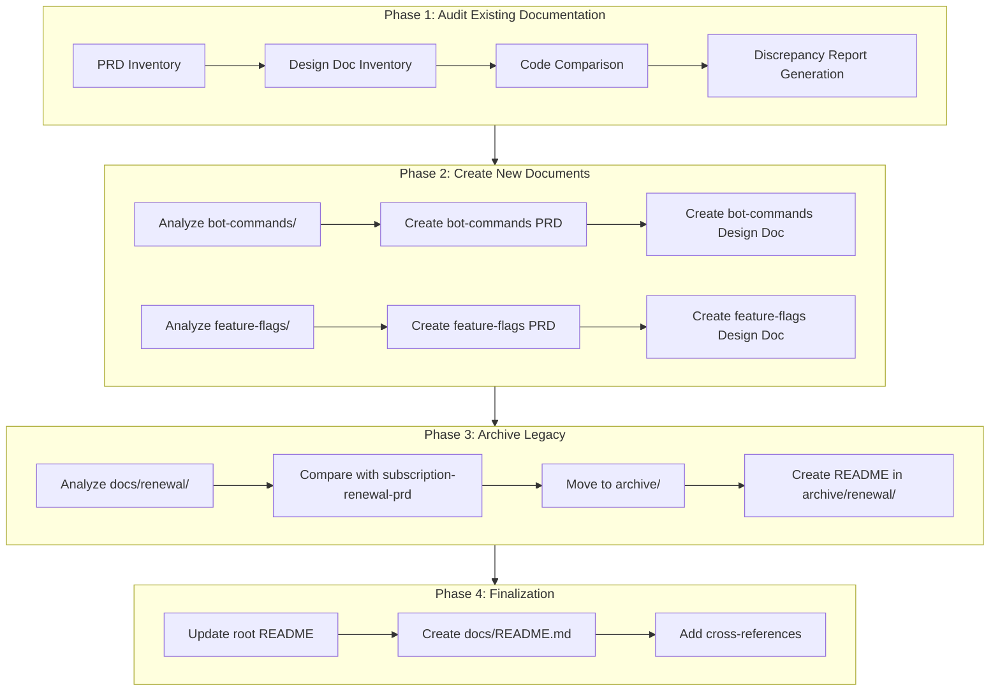
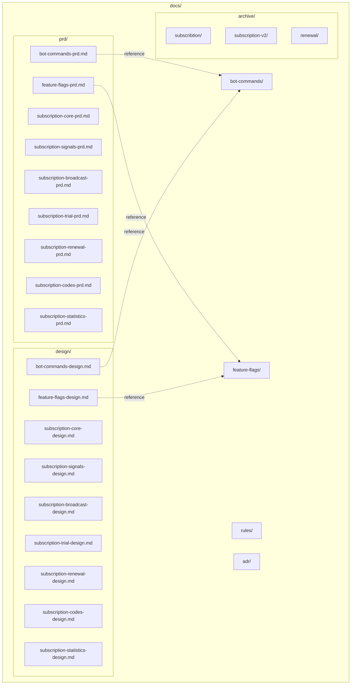
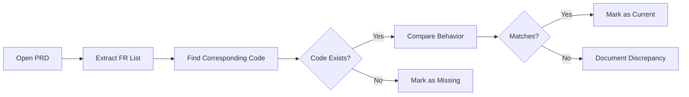
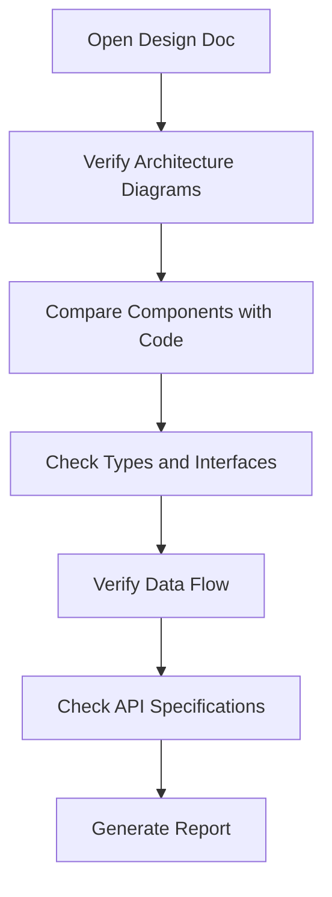
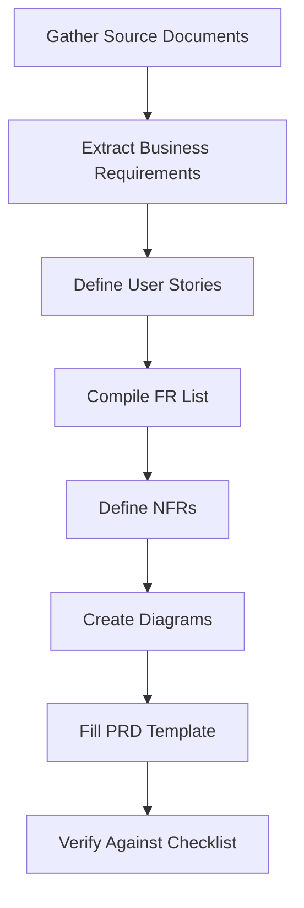
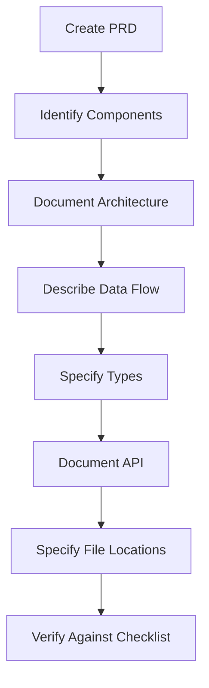
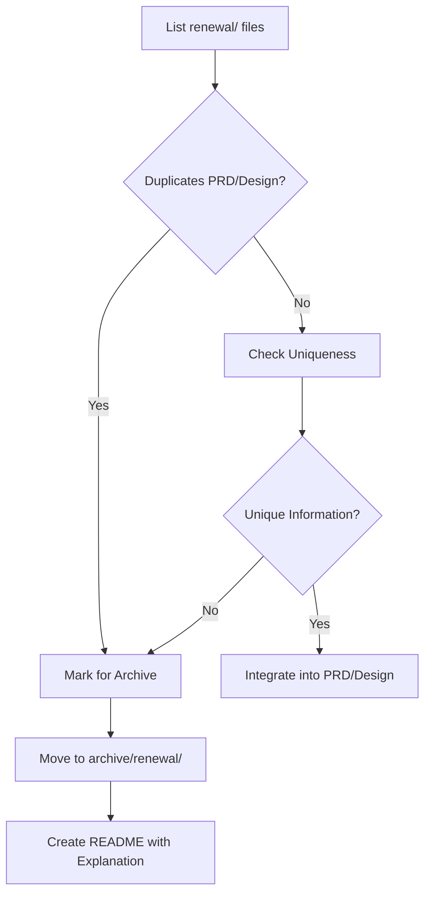

# Design Document: Project Documentation Restructuring

## Document Information

| Field | Value |
|-------|-------|
| **Status** | Proposed |
| **Created** | 2025-11-25 |
| **Last Updated** | 2025-11-25 |
| **Related PRD** | [documentation-restructuring-prd.md](../prd/documentation-restructuring-prd.md) |

## Overview

This Design Document describes the methodology for restructuring the Quantum Deal project documentation, including processes for auditing existing PRD/Design Docs, creating new documents for bot-commands and feature-flags, and archiving legacy documentation.

## Background and Context

### Prerequisite ADRs

None - documentation-only task. No architectural decisions or code changes are involved.

### Agreement Checklist

#### Scope (What We Change)
- [x] Audit existing PRDs in docs/prd/ (7 files)
- [x] Audit existing Design Docs in docs/design/ (7 files)
- [x] Create bot-commands-prd.md and bot-commands-design.md
- [x] Create feature-flags-prd.md and feature-flags-design.md
- [x] Move docs/renewal/ to docs/archive/renewal/

#### Non-Scope (What We Do Not Change)
- [x] Project source code (src/, libs/)
- [x] Existing ADR documents
- [x] Structure of docs/rules/
- [x] Existing archive docs/archive/

#### Constraints
- [x] Document language: English (per project convention)
- [x] Format: Markdown + Mermaid diagrams
- [x] Templates: docs/prd/template.md, docs/design/template.md

### Problem to Solve

The Quantum Deal project has accumulated various types of documentation during development, resulting in:

1. **Inconsistent documentation structure**: Some features have structured PRD/Design Docs while others have unstructured documentation scattered across multiple files
2. **Legacy documentation duplication**: The docs/renewal/ directory contains 8 files that duplicate content already captured in subscription-renewal-prd.md
3. **Missing unified documentation**: Bot-commands and feature-flags subsystems lack PRD/Design Doc pairs despite having extensive technical documentation
4. **No single entry point**: Developers must navigate multiple directories to find relevant documentation

### Current Challenges

1. **Onboarding friction**: New developers lack a clear starting point and must piece together information from multiple sources
2. **Documentation drift risk**: Without auditing, existing PRDs may not reflect current implementation
3. **Navigation complexity**: No central index or README in docs/ directory to guide users
4. **Redundant content**: Legacy renewal/ docs consume space and may cause confusion about authoritative source

### Requirements

#### Functional Requirements

Reference to PRD: [documentation-restructuring-prd.md](../prd/documentation-restructuring-prd.md)

| FR-ID | Description | Priority |
|-------|-------------|----------|
| FR-001 | Audit 7 existing PRDs for code compliance | Must Have |
| FR-002 | Audit 7 existing Design Docs for code compliance | Must Have |
| FR-003 | Create PRD for bot-commands based on existing documentation | Must Have |
| FR-004 | Create Design Doc for bot-commands | Must Have |
| FR-005 | Create PRD for feature-flags based on existing documentation | Must Have |
| FR-006 | Create Design Doc for feature-flags | Must Have |
| FR-007 | Archive legacy documentation docs/renewal/ | Must Have |
| FR-008 | Update root README.md with documentation navigation | Should Have |
| FR-009 | Add cross-references between related PRDs | Should Have |
| FR-010 | Create docs/README.md with documentation structure overview | Should Have |
| FR-011 | Add diagrams to PRDs where missing | Could Have |
| FR-012 | Unify terminology across all documents | Could Have |

#### Non-Functional Requirements

- **Consistency**: Unified terminology and format across all documents
- **Maintainability**: Documents must be understandable without additional context
- **Navigation**: Any information findable within maximum 2 clicks from docs/ root
- **Self-sufficiency**: Each document must be self-contained within its domain

---

## Architecture Overview

### Overall Process Flow



### Documentation Structure After Restructuring



---

## Detailed Design

### Phase 1: Audit Existing Documentation

#### 1.1 PRD Audit Methodology

**Goal**: Verify PRD compliance with current code implementation.

**Audit Process for Each PRD:**



**PRD Audit Checklist (7 items per PRD):**

| # | Criterion | Description | Check |
|---|----------|-------------|-------|
| 1 | FR Completeness | All FRs are present and numbered | [ ] |
| 2 | FR Relevance | FRs match current implementation | [ ] |
| 3 | User Stories | Real usage scenarios are described | [ ] |
| 4 | User Journey | Diagram matches actual flow | [ ] |
| 5 | Scope Boundary | Scope boundaries are clearly defined | [ ] |
| 6 | NFR | Non-functional requirements are specified | [ ] |
| 7 | References | Links to code and other documents are current | [ ] |

**PRD Audit Report Template:**

```markdown
## Audit: [prd-name.md]

### Status: [Current / Requires Update]

### Functional Requirements
| FR-ID | Description | Status | Comment |
|-------|-------------|--------|---------|
| FR-001 | ... | Current / Outdated / Missing | ... |

### Code Discrepancies
1. [Discrepancy description 1]
2. [Discrepancy description 2]

### Recommendations
- [ ] Update FR-XXX
- [ ] Add User Story for...
```

#### 1.2 Design Doc Audit Methodology

**Design Doc Audit Process:**



**Design Doc Audit Checklist (7 items per Design Doc):**

| # | Criterion | Description | Check |
|---|----------|-------------|-------|
| 1 | Architecture | Diagrams match code structure | [ ] |
| 2 | Components | All components exist and are correctly described | [ ] |
| 3 | Types | TypeScript types are current | [ ] |
| 4 | Data Flow | Data flow diagrams match reality | [ ] |
| 5 | API | API methods match implementation | [ ] |
| 6 | File Locations | File paths are current | [ ] |
| 7 | Dependencies | Dependencies are correctly specified | [ ] |

#### 1.3 PRD and Design Doc Mapping Matrix

| PRD | Design Doc | Main Code Files |
|-----|------------|-----------------|
| subscription-core-prd.md | subscription-core-design.md | libs/db/src/repositories/*, libs/db/src/schema/* |
| subscription-signals-prd.md | subscription-signals-design.md | libs/bot/src/commands/start/*, libs/signal/* |
| subscription-broadcast-prd.md | subscription-broadcast-design.md | libs/bot/src/commands/broadcast/* |
| subscription-trial-prd.md | subscription-trial-design.md | libs/bot/src/commands/trial/* |
| subscription-renewal-prd.md | subscription-renewal-design.md | libs/bot/src/commands/renew/* |
| subscription-codes-prd.md | subscription-codes-design.md | libs/bot/src/commands/code/* |
| subscription-statistics-prd.md | subscription-statistics-design.md | libs/bot/src/commands/statistics/* |

### Phase 2: Create New Documents

#### 2.1 PRD Creation Process from Existing Documentation



#### 2.2 Bot-commands PRD Specification

**Sources:**
- `docs/bot-commands/README.md` - Overview and quick start
- `docs/bot-commands/menu.md` - Complete documentation
- `docs/bot-commands/flow.md` - Flow diagrams
- `docs/bot-commands/examples.md` - Usage examples
- `docs/bot-commands/summary.md` - Implementation summary

**Data Extraction Structure:**

| Source | Extracted Data | Target PRD Section |
|--------|---------------|-------------------|
| README.md | System purpose | Overview |
| README.md | Visual Example | User Stories |
| menu.md | Key Features | Functional Requirements |
| flow.md | Diagrams | User Journey |
| examples.md | Use cases | Use Cases |

**Key FRs for bot-commands:**
- FR-001: Personalized command menu based on subscription
- FR-002: Command description localization (8 languages)
- FR-003: Dynamic update on feature changes
- FR-004: /start command shows base menu
- FR-005: /filter command available only with CUSTOM_USER_FILTERING

#### 2.3 Feature-flags PRD Specification

**Sources:**
- `docs/feature-flags/README.md` - Architecture and overview
- `docs/feature-flags/FEATURE_CATALOG.md` - Features catalog
- `docs/feature-flags/database-schema.md` - DB schema
- `docs/feature-flags/examples.md` - Code examples
- `docs/feature-flags/implementation-plan.md` - Implementation plan
- `docs/feature-flags/telegram-ui-flow.md` - UI flows
- `docs/feature-flags/QUICK_REFERENCE.md` - Quick reference

**Data Extraction Structure:**

| Source | Extracted Data | Target PRD Section |
|--------|---------------|-------------------|
| README.md | Architecture, Use Cases | Overview, User Stories |
| FEATURE_CATALOG.md | Feature specifications | Functional Requirements |
| database-schema.md | Data model | Technical Considerations |
| examples.md | Code patterns | Appendix |

**Key FRs for feature-flags:**
- FR-001: Two types of feature flags (TIER_BASED_FILTERING, CUSTOM_USER_FILTERING)
- FR-002: Feature aggregation from all active user subscriptions
- FR-003: @RequireFeature decorator for access control
- FR-004: Middleware loads features into user context
- FR-005: JSONB configuration for feature-specific settings

#### 2.4 Design Doc Creation Process



**Design Doc Creation Checklist (9 items):**

| # | Criterion | Required | Check |
|---|----------|----------|-------|
| 1 | Agreement Checklist | Required | [ ] |
| 2 | Architecture Overview with diagram | Required | [ ] |
| 3 | Data Flow diagram | Required | [ ] |
| 4 | Change Impact Map | Required | [ ] |
| 5 | Type Definitions | Required | [ ] |
| 6 | API Specifications | Required | [ ] |
| 7 | File Locations | Required | [ ] |
| 8 | Acceptance Criteria | Required | [ ] |
| 9 | Test Strategy | Recommended | [ ] |

### Phase 3: Legacy Documentation Archival

#### 3.1 docs/renewal/ Archival Process



#### 3.2 Legacy Document Mapping Matrix

| Legacy File | Replacement Document | Action |
|-------------|---------------------|--------|
| docs/renewal/README.md | subscription-renewal-prd.md | Archive |
| docs/renewal/architecture.md | subscription-renewal-design.md | Archive |
| docs/renewal/database-schema.md | subscription-renewal-design.md | Archive |
| docs/renewal/renewal-flow.md | subscription-renewal-prd.md | Archive |
| docs/renewal/api-flows.md | subscription-renewal-design.md | Archive |
| docs/renewal/telegram-stars-integration.md | subscription-renewal-design.md | Archive |
| docs/renewal/implementation-plan.md | N/A (outdated) | Archive |
| docs/renewal/testing-plan.md | N/A (outdated) | Archive |

#### 3.3 README Template for Archived Documents

```markdown
# Archived: Subscription Renewal Documentation

## Archive Date
2025-11-25

## Reason for Archive
This documentation was superseded by the unified PRD and Design Doc structure.

## Replacement Documents
- **PRD**: [subscription-renewal-prd.md](../../prd/subscription-renewal-prd.md)
- **Design Doc**: [subscription-renewal-design.md](../../design/subscription-renewal-design.md)

## Original Files
| File | Description |
|------|-------------|
| README.md | Original overview |
| architecture.md | Architecture documentation |
| database-schema.md | Database schema |
| renewal-flow.md | User flow documentation |
| api-flows.md | API interaction flows |
| telegram-stars-integration.md | Telegram Stars integration |
| implementation-plan.md | Original implementation plan |
| testing-plan.md | Original testing plan |

## Notes
These documents are retained for historical reference only.
Do not use them as source of truth - refer to the replacement documents.
```

### Phase 4: Finalization

#### 4.1 docs/README.md Structure

```markdown
# Quantum Deal Documentation

## Quick Navigation

### Product Requirements Documents (PRD)
| Feature | PRD | Status |
|---------|-----|--------|
| Core Subscription | [subscription-core-prd.md](./prd/subscription-core-prd.md) | Active |
| Signals | [subscription-signals-prd.md](./prd/subscription-signals-prd.md) | Active |
| ... | ... | ... |
| Bot Commands | [bot-commands-prd.md](./prd/bot-commands-prd.md) | Active |
| Feature Flags | [feature-flags-prd.md](./prd/feature-flags-prd.md) | Active |

### Design Documents
| Feature | Design Doc | Status |
|---------|------------|--------|
| ... | ... | ... |

### Feature Documentation
- [bot-commands/](./bot-commands/) - Bot menu commands system
- [feature-flags/](./feature-flags/) - Feature flags system

### Architecture Decision Records
- [ADR Index](./adr/)

### Development Rules
- [Documentation Criteria](./rules/documentation-criteria.md)
- [Technical Spec](./rules/technical-spec.md)
- [Coding Standards](./rules/coding-standards.md)

### Archive
- [Archived Documentation](./archive/)
```

---

## Acceptance Criteria

### AC-001: PRD Audit (traces to FR-001)
- [ ] Each of 7 PRDs passes all 7 checklist items with documented evidence
- [ ] Each PRD has an audit report documenting:
  - FR count and numbered status
  - Code comparison results for each FR
  - List of discrepancies (if any) with specific file references
- [ ] Total: 49 checklist items verified (7 PRDs x 7 items)

### AC-002: Design Doc Audit (traces to FR-002)
- [ ] Each of 7 Design Docs passes all 7 checklist items with documented evidence
- [ ] File locations verified against actual file system (100% accuracy)
- [ ] API specifications verified against implementation (method signatures match)
- [ ] Total: 49 checklist items verified (7 Design Docs x 7 items)

### AC-003: Bot Commands PRD (traces to FR-003)
- [ ] PRD created using docs/prd/template.md template
- [ ] Contains User Journey diagram (minimum 1 mermaid diagram)
- [ ] Contains Scope Boundary diagram (minimum 1 mermaid diagram)
- [ ] Contains minimum 5 Functional Requirements (FR-001 through FR-005+)
- [ ] All 5 source files referenced and consolidated

### AC-004: Bot Commands Design Doc (traces to FR-004)
- [ ] Design Doc created using docs/design/template.md template
- [ ] Contains Architecture Overview diagram (minimum 1 mermaid diagram)
- [ ] Contains Data Flow diagram (minimum 1 mermaid diagram)
- [ ] Lists all file locations (minimum 3 paths verified to exist)
- [ ] Passes all 9 Design Doc checklist items

### AC-005: Feature Flags PRD (traces to FR-005)
- [ ] PRD created using docs/prd/template.md template
- [ ] Contains User Journey diagram (minimum 1 mermaid diagram)
- [ ] Contains Scope Boundary diagram (minimum 1 mermaid diagram)
- [ ] Contains minimum 5 Functional Requirements (FR-001 through FR-005+)
- [ ] All 7 source files referenced and consolidated

### AC-006: Feature Flags Design Doc (traces to FR-006)
- [ ] Design Doc created using docs/design/template.md template
- [ ] Contains Architecture Overview diagram (minimum 1 mermaid diagram)
- [ ] Contains Data Flow diagram (minimum 1 mermaid diagram)
- [ ] Lists all file locations (minimum 3 paths verified to exist)
- [ ] Passes all 9 Design Doc checklist items

### AC-007: Renewal Archival (traces to FR-007)
- [ ] All 8 files moved to docs/archive/renewal/
- [ ] README.md created in archive/renewal/ containing:
  - Archive date
  - Archival reason
  - Links to 2 replacement documents
  - Table listing all 8 original files
- [ ] No files remaining in docs/renewal/ (directory empty or removed)

### AC-008: Navigation (traces to FR-008, FR-009, FR-010)
- [ ] docs/README.md created with navigation table
- [ ] Navigation table includes all 9 PRDs with working links
- [ ] Navigation table includes all 9 Design Docs with working links
- [ ] Cross-references added between related PRDs (minimum 3 cross-reference links)

---

## Existing Codebase Analysis

### Implementation Path Mapping

| Type | Path | Description |
|------|------|-------------|
| Bot Commands | libs/bot/src/services/bot-commands.service.ts | Command management service |
| Bot Commands | libs/bot/src/bot.update.ts | /start, /lang handlers |
| Bot Commands | libs/bot/src/bot.service.ts | Command setup after activation |
| Feature Flags | libs/db/src/schema/subscription-features.ts | Feature flags schema |
| Feature Flags | libs/db/src/repositories/subscription-features.repository.ts | Features repository |
| Feature Flags | libs/db/src/schema/user-subscription-features.ts | User-level settings |

### Integration Points

- **Bot Commands -> Feature Flags**: Command menu depends on user's enabled features
- **Feature Flags -> User Subscriptions**: Features aggregated from all active subscriptions
- **PRD -> Design Doc**: Each PRD should have a corresponding Design Doc

---

## Change Impact Map

```yaml
Change Target: Documentation Structure
Direct Impact:
  - docs/prd/ (adding 2 files)
  - docs/design/ (adding 2 files)
  - docs/archive/ (adding renewal/)
  - docs/README.md (creation)
Indirect Impact:
  - Documentation navigation
  - Developer information discovery
No Ripple Effect:
  - Source code
  - Existing ADRs
  - docs/rules/
```

---

## Implementation Plan

### Approach

**Selected Approach**: Horizontal Slice
**Selection Reason**: Documentation task requires sequential phase execution - first audit (understand current state), then create new documents (based on audit results), then archive.

### Execution Order

#### Phase 1: Audit (1-2 days)
1. Audit 7 PRDs using checklist
2. Audit 7 Design Docs using checklist
3. Generate summary report on documentation status

**Verification**: Audit report contains status for each document

#### Phase 2: Create bot-commands documents (0.5-1 day)
1. Analyze existing 5 files in docs/bot-commands/
2. Create bot-commands-prd.md
3. Create bot-commands-design.md

**Verification**: Documents pass PRD and Design Doc checklists

#### Phase 3: Create feature-flags documents (0.5-1 day)
1. Analyze existing 7 files in docs/feature-flags/
2. Create feature-flags-prd.md
3. Create feature-flags-design.md

**Verification**: Documents pass PRD and Design Doc checklists

#### Phase 4: Archival and finalization (0.5 day)
1. Move docs/renewal/ to docs/archive/renewal/
2. Create README for archive
3. Create docs/README.md
4. Add cross-references

**Verification**: Documentation structure matches target schema

---

## Test Strategy

### PRD Verification
- Check presence of all required sections per template
- Check presence of User Journey and Scope Boundary diagrams
- Verify Mermaid syntax correctness

### Design Doc Verification
- Check presence of all required sections per template
- Verify file location accuracy (files exist)
- Verify Mermaid syntax correctness

### Archival Verification
- All files from docs/renewal/ present in docs/archive/renewal/
- README in archive contains correct links to replacement documents

---

## Security Considerations

Not applicable for documentation changes. This task involves only:
- Moving and creating Markdown files
- No code changes
- No data processing
- No authentication/authorization modifications

---

## Future Extensibility

1. **Documentation automation**: Future tooling could automatically verify PRD-code alignment
2. **Template evolution**: Templates may be updated as project needs change; new documents should follow latest templates
3. **Additional subsystems**: As new features are added, the same PRD/Design Doc pattern should be applied
4. **Automated link checking**: CI/CD could include documentation link validation
5. **Documentation versioning**: Consider semantic versioning for major documentation updates

---

## Alternative Solutions

### Alternative 1: Incremental Documentation Updates

- **Overview**: Update documentation only when code changes, rather than proactive audit
- **Advantages**: Lower initial effort, documentation stays closer to code changes
- **Disadvantages**: Existing drift remains unaddressed, inconsistent coverage
- **Reason for Rejection**: Current documentation drift is already significant; proactive audit needed to establish baseline

### Alternative 2: Single Monolithic Documentation File

- **Overview**: Consolidate all documentation into a single comprehensive document
- **Advantages**: Single source of truth, no navigation required
- **Disadvantages**: File becomes unwieldy, difficult to maintain, version control conflicts
- **Reason for Rejection**: Violates separation of concerns; PRD vs Design Doc distinction provides clarity

### Alternative 3: Wiki-based Documentation

- **Overview**: Move documentation to external wiki platform (Notion, Confluence)
- **Advantages**: Better navigation, rich formatting, collaboration features
- **Disadvantages**: Separated from code repository, requires additional tooling, sync issues
- **Reason for Rejection**: Project convention requires Markdown in repository; close coupling with code is beneficial

---

## Risks and Mitigation

| Risk | Impact | Probability | Mitigation |
|------|--------|-------------|------------|
| Documentation-code divergence not detected during audit | High | Medium | Thorough comparison using checklists, code grep verification |
| Loss of unique information during archival | Medium | Low | Full analysis of legacy files before archival |
| Incomplete new PRDs | Medium | Medium | Full analysis of all source files, use extraction matrix |
| Incorrect links in documents | Low | Medium | Automated link verification after creation |

---

## References

### Templates
- PRD Template: `docs/prd/template.md`
- Design Doc Template: `docs/design/template.md`

### Rules
- Documentation Criteria: `docs/rules/documentation-criteria.md`

### Existing Documents
- PRD Directory: `docs/prd/`
- Design Directory: `docs/design/`
- Bot Commands: `docs/bot-commands/`
- Feature Flags: `docs/feature-flags/`
- Legacy Renewal: `docs/renewal/`
- Archive: `docs/archive/`

---

## Update History

| Date | Version | Changes | Author |
|------|---------|---------|--------|
| 2025-11-25 | 1.0 | Initial version (Russian) | AI Assistant |
| 2025-11-25 | 2.0 | Translated to English, added missing sections (Problem to Solve, Current Challenges, Functional Requirements reference, Security Considerations, Future Extensibility, Alternative Solutions, Prerequisite ADRs), made Acceptance Criteria measurable with specific numbers and PRD traceability | AI Assistant |
