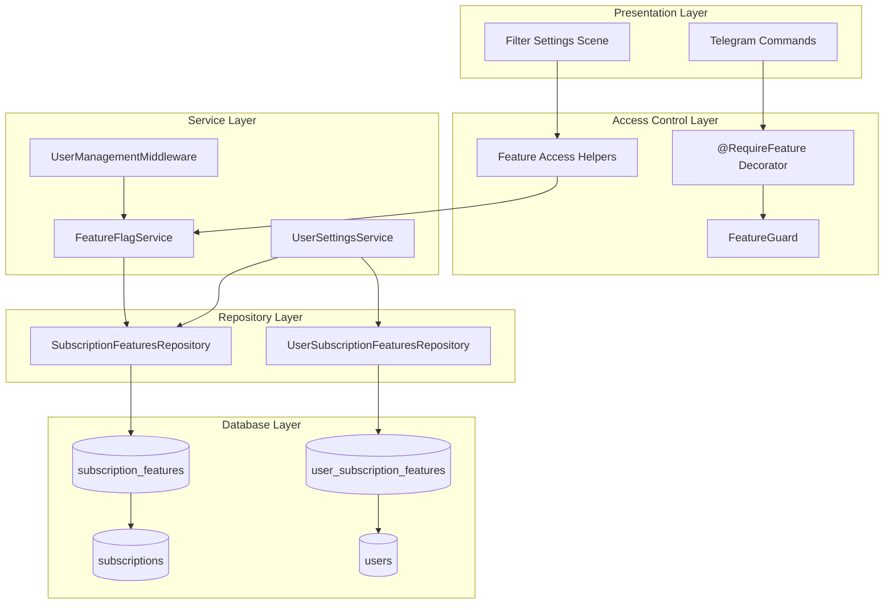
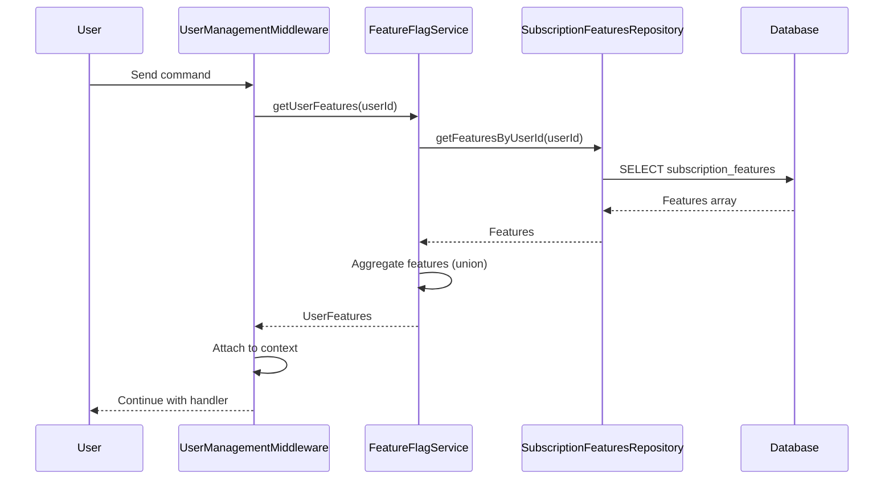
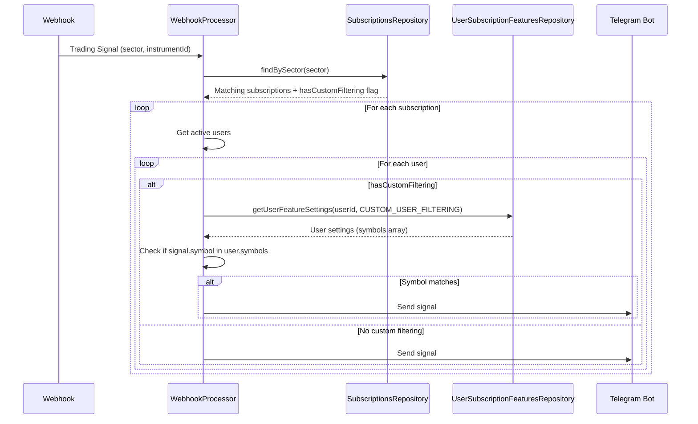
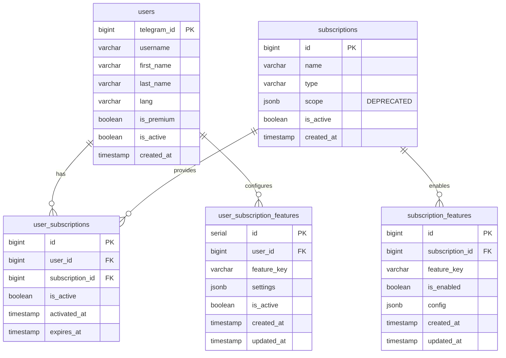

# Feature Flags System Design Document

## Overview

The Feature Flags System provides fine-grained control over filtering capabilities for trading signal delivery based on subscription tiers. It enables both system-controlled tier-based filtering and user-configurable custom filtering preferences for VIP subscribers.

## Background and Context

### Prerequisite ADRs

- **ADR-001: Feature Flag Database Design** - Documents the chosen two-table design (subscription_features and user_subscription_features) with JSONB configuration for flexibility
- **ADR-002: Migration from subscriptions.scope to subscription_features.config.sectors** - Documents migration strategy from deprecated subscriptions.scope field
- **ADR-003: User Settings JSONB Storage Approach** - Documents the JSONB storage approach for user feature settings with soft deletion support

### Agreement Checklist

#### Scope
- [x] Two feature flags: `TIER_BASED_FILTERING` and `CUSTOM_USER_FILTERING`
- [x] Database tables: `subscription_features` and `user_subscription_features`
- [x] Feature checking logic via `FeatureFlagService`
- [x] User settings management via `UserSettingsService`
- [x] Access control via `@RequireFeature` decorator and `FeatureGuard`
- [x] Helper functions: `hasFeature()`, `getFeatureConfig()`
- [x] Signal filtering integration in webhook processing

#### Non-Scope (Explicitly not changing)
- [x] Core signal delivery (always available to active subscribers)
- [x] Payment processing
- [x] Subscription creation/activation
- [x] User authentication
- [x] Feature management API (managed via direct SQL)
- [x] Admin dashboard UI

#### Constraints
- [x] Parallel operation: Yes (coexists with existing subscription system)
- [x] Backward compatibility: Required (deprecated `subscriptions.scope` field)
- [x] Performance measurement: Required (< 50ms feature load time)

### Problem to Solve

Differentiate subscription tiers by controlling which filtering capabilities are available to users. Basic users receive signals filtered by subscription sectors (system-controlled), while VIP users can additionally personalize their signal delivery by selecting specific instruments.

### Current Challenges

1. No mechanism to control feature availability per subscription tier
2. No user-configurable filtering options for premium users
3. Signal filtering is not separated from core signal delivery
4. Sector filtering was stored in deprecated `subscriptions.scope` field

### Requirements

#### Functional Requirements

| ID | Description | Priority |
|----|-------------|----------|
| FR-001 | Two feature flags enumeration: `TIER_BASED_FILTERING` and `CUSTOM_USER_FILTERING` | Must |
| FR-002 | `subscription_features` table mapping features to subscriptions with JSONB config | Must |
| FR-003 | `user_subscription_features` table storing user-specific settings with JSONB | Must |
| FR-004 | Feature aggregation from all active user subscriptions (union of features) | Must |
| FR-005 | `FeatureFlagService` with read-only operations for feature queries | Must |
| FR-006 | `hasFeature()` helper function for checking user feature access | Must |
| FR-007 | `getFeatureConfig()` helper function for retrieving feature configuration | Must |
| FR-008 | `@RequireFeature` decorator for protecting command handlers | Must |
| FR-009 | `FeatureGuard` for enforcing feature access at handler level | Must |
| FR-010 | UserManagementMiddleware loads features with user context | Must |
| FR-011 | `TIER_BASED_FILTERING` available on all tiers (Basic + VIP) | Must |
| FR-012 | `CUSTOM_USER_FILTERING` available only on VIP tier | Must |
| FR-013 | Sector-based filtering via `subscription_features.config.sectors` | Must |
| FR-014 | Telegram `/filter` command for VIP users to configure custom filters | Must |
| FR-015 | Instrument selection UI with category browsing | Must |
| FR-016 | Save/clear custom filter settings functionality | Must |
| FR-017 | Feature-aware signal broadcasting in webhook processor | Must |
| FR-018 | `findBySector()` query for tier-based filtering | Must |
| FR-019 | User settings preservation on subscription downgrade | Must |
| FR-020 | Redis caching for user features (15-minute TTL) | Nice |

#### Non-Functional Requirements

- **Performance**: Feature load time < 50ms, database query time < 20ms
- **Scalability**: JSONB configuration supports flexible feature configs without schema changes
- **Reliability**: Foreign key constraints with CASCADE deletion, soft deletion for user settings
- **Maintainability**: Type-safe enum for feature keys, comprehensive documentation

## Acceptance Criteria (AC)

### FR-001: Feature Flag Enumeration
- [ ] `FeatureFlag` enum contains `TIER_BASED_FILTERING` and `CUSTOM_USER_FILTERING`
- [ ] Enum values match database feature_key values: `tier_based_filtering`, `custom_user_filtering`

### FR-002: Subscription Features Table
- [ ] Table stores subscription_id, feature_key, is_enabled, config (JSONB)
- [ ] Unique constraint on (subscription_id, feature_key)
- [ ] CASCADE deletion when subscription is deleted

### FR-003: User Subscription Features Table
- [ ] Table stores user_id, feature_key, settings (JSONB), is_active
- [ ] Unique constraint on (user_id, feature_key)
- [ ] CASCADE deletion when user is deleted
- [ ] `is_active` allows soft deletion for downgrade/upgrade scenarios

### FR-004: Feature Aggregation
- [ ] When user has multiple subscriptions, features are combined (union)
- [ ] Feature configs are merged (later subscription config overrides earlier)

### FR-005: FeatureFlagService
- [ ] `getUserFeatures(userId)` returns enabled features and configs
- [ ] Service is read-only (no feature management methods)
- [ ] Logs feature count for debugging

### FR-006: hasFeature Helper
- [ ] Returns `true` if user's `enabledFeatures` set contains the feature
- [ ] Returns `false` if user is null or feature not present

### FR-007: getFeatureConfig Helper
- [ ] Returns feature configuration object if user has the feature
- [ ] Returns `null` if feature not enabled

### FR-008-009: Access Control
- [ ] `@RequireFeature` decorator sets metadata with required feature
- [ ] `FeatureGuard` checks metadata and user features
- [ ] Throws `ForbiddenException` if feature not available

### FR-010: UserManagementMiddleware
- [ ] Loads user features via `FeatureFlagService.getUserFeatures()`
- [ ] Attaches `enabledFeatures` and `featureConfigs` to user context

### FR-011-012: Tier Availability
- [ ] Basic subscription has `TIER_BASED_FILTERING` feature
- [ ] VIP subscription has both `TIER_BASED_FILTERING` and `CUSTOM_USER_FILTERING`

### FR-013: Sector-based Filtering
- [ ] Sectors stored in `subscription_features.config.sectors` array
- [ ] `findBySector()` queries this field for matching subscriptions

### FR-014-016: Telegram Filter UI
- [ ] `/filter` command accessible only to VIP users
- [ ] Non-VIP users receive upgrade message
- [ ] UI shows instrument categories: Forex, Commodities, Crypto, Stocks
- [ ] Users can toggle individual instruments
- [ ] Save button persists selection to database
- [ ] Clear filters resets to default (receive all signals)

### FR-017-018: Signal Broadcasting
- [ ] Webhook processor queries subscriptions by sector first
- [ ] For subscriptions with `CUSTOM_USER_FILTERING`, user settings are checked
- [ ] Signal only sent if it passes all applicable filters

### FR-019: Settings Preservation
- [ ] On downgrade, user settings marked inactive (not deleted)
- [ ] On upgrade, previous settings can be restored

## Existing Codebase Analysis

### Implementation Path Mapping

| Type | Path | Description |
|------|------|-------------|
| Existing | `libs/db/src/schema/subscription-features.ts` | Feature flag enum and table schema |
| Existing | `libs/db/src/schema/user-subscription-features.ts` | User settings table schema |
| Existing | `libs/db/src/repositories/subscription-features.repository.ts` | CRUD operations for subscription features |
| Existing | `libs/db/src/repositories/user-subscription-features.repository.ts` | CRUD operations for user settings |
| Existing | `libs/bot/src/services/feature-flag.service.ts` | Feature aggregation service |
| Existing | `libs/bot/src/services/user-settings.service.ts` | User settings management |
| Existing | `libs/bot/src/decorators/require-feature.decorator.ts` | Access control decorator |
| Existing | `libs/bot/src/guards/feature.guard.ts` | Feature access guard |
| Existing | `libs/bot/src/helpers/feature-access.helper.ts` | Helper functions for Telegraf handlers |
| Existing | `libs/bot/src/interfaces/user.dto.ts` | User type with feature flags |
| Existing | `libs/bot/src/commands/filter/filter.scene.ts` | Telegram filter configuration UI |
| Existing | `libs/bot/src/services/instrument-filter.service.ts` | Instrument filtering and selection service |
| Existing | `libs/bot/src/services/filter-session.service.ts` | Filter session state management |

### Integration Points

- **UserManagementMiddleware**: Loads features with user context on each request
- **Webhook Processor**: Applies filtering logic before sending signals
- **Subscription Service**: Creates feature records when subscription is activated
- **Telegram Bot Commands**: `/filter` command enters filter settings scene

## Design

### Change Impact Map

```yaml
Change Target: Signal Delivery Pipeline
Direct Impact:
  - libs/db/src/repositories/subscriptions.repository.ts (findBySector method)
  - libs/bot/src/services/webhook.service.ts (signal filtering)
  - libs/bot/src/middleware/user-management.middleware.ts (feature loading)
Indirect Impact:
  - Signal delivery latency (additional database queries)
  - Memory usage (feature caching)
No Ripple Effect:
  - User authentication
  - Payment processing
  - Statistics collection
  - Report generation
```

### Architecture Overview



### Data Flow



### Signal Filtering Data Flow



### Integration Points List

| Integration Point | Location | Old Implementation | New Implementation | Switching Method |
|-------------------|----------|-------------------|-------------------|------------------|
| User Context Loading | UserManagementMiddleware | Load user only | Load user + features | Middleware update |
| Sector Filtering | SubscriptionsRepository | Query subscriptions.scope | Query subscription_features.config.sectors | findBySector() |
| Signal Broadcasting | WebhookProcessor | Send to all users | Check feature settings first | Conditional logic |
| Filter Command | Bot Commands | Not available | Enter filter scene | New command |

### Main Components

#### SubscriptionFeaturesRepository

- **Responsibility**: CRUD operations for subscription-level feature flags
- **Interface**:
  - `getFeaturesBySubscriptionId(subscriptionId): SubscriptionFeature[]`
  - `getFeaturesByUserId(userId): SubscriptionFeature[]`
  - `hasFeature(userId, featureKey): boolean`
  - `upsertFeature(subscriptionId, featureKey, isEnabled, config)`
  - `enableFeature(subscriptionId, featureKey, config)`
  - `disableFeature(subscriptionId, featureKey)`
- **Dependencies**: DrizzleClient, subscriptionFeatures table

#### UserSubscriptionFeaturesRepository

- **Responsibility**: CRUD operations for user-level feature settings
- **Interface**:
  - `getUserFeatureSettings(userId, featureKey): UserSubscriptionFeature | null`
  - `getAllUserSettings(userId): UserSubscriptionFeature[]`
  - `upsertUserSettings(userId, featureKey, settings)`
  - `deleteUserSettings(userId, featureKey)`
  - `deactivateUserSettings(userId, featureKey)` (soft delete)
  - `reactivateUserSettings(userId, featureKey)`
- **Dependencies**: DrizzleClient, userSubscriptionFeatures table

#### FeatureFlagService

- **Responsibility**: Aggregate and provide user features (read-only)
- **Interface**:
  - `getUserFeatures(userId): UserFeatures`
- **Dependencies**: SubscriptionFeaturesRepository

#### UserSettingsService

- **Responsibility**: Manage user feature settings with validation
- **Interface**:
  - `getUserSettings(userId, featureKey): UserFeatureSettings | null`
  - `saveUserSettings(userId, featureKey, settings)`
  - `resetUserSettings(userId, featureKey)`
  - `deactivateUserSettings(userId, featureKey)`
  - `reactivateUserSettings(userId, featureKey)`
- **Dependencies**: UserSubscriptionFeaturesRepository, SubscriptionFeaturesRepository

### Type Definitions

```typescript
// Feature Flag Enumeration
enum FeatureFlag {
  TIER_BASED_FILTERING = 'tier_based_filtering',
  CUSTOM_USER_FILTERING = 'custom_user_filtering',
}

// Feature Configuration Type
type FeatureConfig = Record<string, unknown>;

// Tier-based Filtering Configuration
interface TierBasedFilteringConfig {
  sectors: string[]; // e.g., ['crypto', 'forex', 'stocks']
}

// Custom User Filtering Settings
interface CustomUserFilteringSettings {
  symbols: string[]; // e.g., ['BTCUSD.a', 'EURUSD.a', 'GBPUSD.a']
}

// User Features Interface
interface UserFeatures {
  enabledFeatures: Set<FeatureFlag>;
  featureConfigs: Map<FeatureFlag, FeatureConfig>;
}

// User with Subscriptions (extended with features)
interface UserWithSubscriptions {
  telegramId: number;
  username: string | null;
  firstName: string | null;
  lastName: string | null;
  lang: string | null;
  isPremium: boolean;
  isActive: boolean;
  createdAt: Date;
  activeSubscriptions: ActiveSubscriptionDto[];
  enabledFeatures: Set<FeatureFlag>;
  featureConfigs: Map<FeatureFlag, FeatureConfig>;
}
```

### Database Schema



### Data Contract

#### FeatureFlagService.getUserFeatures

```yaml
Input:
  Type: number (userId)
  Preconditions: Valid Telegram user ID
  Validation: Existence check in database

Output:
  Type: UserFeatures { enabledFeatures: Set<FeatureFlag>, featureConfigs: Map }
  Guarantees:
    - Returns empty Set/Map if user has no active subscriptions
    - Features are deduplicated (union)
    - Configs are merged if feature appears in multiple subscriptions
  On Error: Returns empty UserFeatures object

Invariants:
  - Service is read-only
  - No side effects
```

#### UserSettingsService.saveUserSettings

```yaml
Input:
  Type: { userId: number, featureKey: FeatureFlag, settings: UserFeatureSettings }
  Preconditions:
    - User has active subscription with the feature enabled
    - Settings conform to feature-specific schema
  Validation:
    - Feature access check via hasFeature()
    - Schema validation per feature type

Output:
  Type: void
  Guarantees: Settings persisted to database
  On Error: Throws BadRequestException with validation message

Invariants:
  - TIER_BASED_FILTERING cannot be configured by users
  - CUSTOM_USER_FILTERING.symbols must be string array
```

### Integration Boundary Contracts

```yaml
Boundary: UserManagementMiddleware -> FeatureFlagService
  Input: userId (number)
  Output: UserFeatures (sync)
  On Error: Log error, continue with empty features

Boundary: WebhookProcessor -> SubscriptionsRepository
  Input: sector (string)
  Output: SubscriptionWithFeatures[] (async)
  On Error: Log error, skip sending signals

Boundary: FilterSettingsScene -> UserSettingsService
  Input: { userId, featureKey, settings }
  Output: void (async)
  On Error: Show error message to user
```

### Error Handling

| Error Type | Handling Strategy | User Message |
|------------|------------------|--------------|
| Feature not available | Return null/false | "Feature not available in your subscription" |
| Settings validation failed | Throw BadRequestException | Specific validation error message |
| Database connection error | Log error, retry | "Service temporarily unavailable" |
| User not found | Return empty features | "Please /start the bot first" |

### Logging and Monitoring

```typescript
// Key logging points
logger.debug(`User ${userId} has ${enabledFeatures.size} enabled features`);
logger.log(`User ${userId} updated settings for feature ${featureKey}`);
logger.warn(`User ${userId} attempted to access unavailable feature ${featureKey}`);
logger.log(`User ${userId} denied access to feature ${requiredFeature}`);
```

**Metrics to Track:**
- Feature load time (P50, P95, P99)
- Feature check count per feature type
- Settings save/reset operations
- Feature access denial rate

## Implementation Plan

### Implementation Approach

**Selected Approach**: Foundation-driven (Horizontal Slice)

**Selection Reason**: The feature flags system is a foundational component that other features depend on. The database schema, repositories, and services must be in place before the UI and integration layers can be built.

### Technical Dependencies and Implementation Order

#### Phase 1: Database & Repository Layer (Completed)
1. **Database Schema**
   - Technical Reason: Foundation for all data storage
   - Dependent Elements: All repositories and services
   - Files: `subscription-features.ts`, `user-subscription-features.ts`

2. **Repositories**
   - Technical Reason: Data access layer for services
   - Prerequisites: Database schema
   - Files: `subscription-features.repository.ts`, `user-subscription-features.repository.ts`

#### Phase 2: Service Layer (Completed)
1. **FeatureFlagService**
   - Technical Reason: Core feature aggregation logic
   - Prerequisites: SubscriptionFeaturesRepository
   - File: `feature-flag.service.ts`

2. **UserSettingsService**
   - Technical Reason: Settings management with validation
   - Prerequisites: Both repositories, FeatureFlagService
   - File: `user-settings.service.ts`

#### Phase 3: Access Control (Completed)
1. **RequireFeature Decorator**
   - Technical Reason: Declarative access control
   - Prerequisites: FeatureFlag enum
   - File: `require-feature.decorator.ts`

2. **FeatureGuard**
   - Technical Reason: Enforce access control
   - Prerequisites: Decorator, hasFeature helper
   - File: `feature.guard.ts`

3. **Feature Access Helpers**
   - Technical Reason: Manual checks for Telegraf handlers
   - Prerequisites: User DTO with features
   - File: `feature-access.helper.ts`

#### Phase 4: Integration (Completed)
1. **UserManagementMiddleware Update** ✅
   - Technical Reason: Load features with user context
   - Implementation: `loadUserWithSubscriptions()` method calls `featureFlagService.getUserFeatures()` and attaches enabledFeatures and featureConfigs to user context
   - Verification: Features are properly loaded and available in UserContext

2. **Webhook Processor Integration** ✅
   - Technical Reason: Apply filtering to signals
   - Implementation: `getEligibleUsers()` queries subscriptions by sector, `applyCustomFiltering()` checks user's CUSTOM_USER_FILTERING settings
   - Verification: Signals are filtered based on sector and user's symbol whitelist

3. **Filter Settings Scene** ✅
   - Technical Reason: User-facing configuration UI
   - Implementation: `FilterScene` checks feature access on entry, handles instrument selection, calls `UserSettingsService.saveUserSettings()` on save
   - Verification: Settings persist to database and affect signal delivery

### Integration Points

**Integration Point 1: Feature Loading** ✅ IMPLEMENTED
- Location: `libs/bot/src/middleware/user-management.middleware.ts` (lines 102-157)
- Components: UserManagementMiddleware -> FeatureFlagService
- Flow: UserManagementMiddleware.loadUserWithSubscriptions() calls FeatureFlagService.getUserFeatures() which queries SubscriptionFeaturesRepository
- Result: Attaches `enabledFeatures` (Set) and `featureConfigs` (Map) to UserContext
- Verification: Features appear in user context after middleware runs, enabling downstream handlers to check feature access

**Integration Point 2: Signal Filtering** ✅ IMPLEMENTED
- Location: `libs/bot/src/services/webhook.service.ts` (lines 254-295 for getEligibleUsers, lines 151-208 for shouldSendSignal)
- Components: WebhookProcessor.getEligibleUsers() -> SubscriptionsRepository.findBySector() -> UserSubscriptionFeaturesRepository.getUserFeatureSettings()
- Flow:
  1. getEligibleUsers() queries subscriptions by sector (TIER_BASED_FILTERING)
  2. applyCustomFiltering() filters users by symbol if they have CUSTOM_USER_FILTERING
  3. shouldSendSignal() checks user's configured symbols in settings JSONB
- Result: Only users whose configured symbols match the signal's symbol receive the notification
- Verification: Signals correctly filtered based on sector and user's custom symbol whitelist

**Integration Point 3: Filter Configuration** ✅ IMPLEMENTED
- Location: `libs/bot/src/commands/filter/filter.scene.ts` (lines 547-578 for handleSave)
- Components: FilterScene -> InstrumentFilterService -> UserSettingsService -> UserSubscriptionFeaturesRepository
- Flow:
  1. FilterScene checks feature access on entry (line 57)
  2. handleSave() calls InstrumentFilterService.saveUserFilters()
  3. InstrumentFilterService calls UserSettingsService.saveUserSettings()
  4. UserSettingsService validates settings and calls userFeaturesRepo.upsertUserSettings()
- Result: Settings persisted to user_subscription_features table with JSONB configuration
- Verification: Settings persist and affect signal delivery in WebhookProcessor.shouldSendSignal()

### Migration Strategy

1. **Database Migration**: Add tables without affecting existing data
2. **Feature Seeding**: Populate subscription_features based on subscription type
3. **Scope Field Migration**: Copy sectors from subscriptions.scope to subscription_features.config.sectors
4. **Parallel Operation**: Both old and new approaches work during transition
5. **Deprecation**: Mark subscriptions.scope as deprecated

## Test Strategy

### Basic Test Design Policy

Test cases are derived directly from acceptance criteria:
- Each AC has at least one test case
- Measurable criteria become assertions

### Unit Tests

```typescript
// FeatureFlagService tests
describe('FeatureFlagService', () => {
  it('should return empty features for user with no subscriptions');
  it('should aggregate features from multiple subscriptions');
  it('should merge configs when feature appears multiple times');
});

// UserSettingsService tests
describe('UserSettingsService', () => {
  it('should validate CUSTOM_USER_FILTERING symbols are strings');
  it('should reject TIER_BASED_FILTERING configuration by users');
  it('should preserve settings on deactivation');
});

// hasFeature helper tests
describe('hasFeature', () => {
  it('should return true when feature in enabledFeatures set');
  it('should return false when user is null');
});
```

### Integration Tests

```typescript
describe('Feature Access Control', () => {
  it('should load features in user context via middleware');
  it('should block access when feature not available');
  it('should allow access when feature is enabled');
});

describe('Signal Filtering', () => {
  it('should filter signals by sector');
  it('should apply custom user filtering for VIP users');
  it('should send all signals when no custom filter configured');
});
```

### E2E Tests

```typescript
describe('Filter Settings Flow', () => {
  it('should show upgrade message to non-VIP users');
  it('should allow VIP users to configure filters');
  it('should persist filter selections to database');
  it('should apply saved filters to signal delivery');
});
```

### Performance Tests

- Feature load time: Verify < 50ms at P95
- Database query time: Verify < 20ms for feature lookups
- Webhook processing: Verify < 500ms additional latency

## Security Considerations

1. **Access Control**: Feature guards prevent unauthorized access
2. **Type Safety**: TypeScript enum prevents invalid feature keys
3. **Input Validation**: JSONB settings validated before storage
4. **Database-level Management**: Features managed via SQL, not exposed via API
5. **Sensitive Information**: No sensitive data in feature settings

## Future Extensibility

1. **New Features**: Add to enum, no database schema changes needed
2. **Feature Templates**: Predefined feature sets for subscription types
3. **Redis Caching**: 15-minute TTL for user features (planned)
4. **Feature Analytics**: Track feature usage patterns
5. **Audit Trail**: Log feature changes for compliance

## Alternative Solutions

### Alternative 1: JSONB Column on Subscriptions

- **Overview**: Store features as JSONB column on subscriptions table
- **Advantages**: Simpler schema, no JOIN needed, all data in one place
- **Disadvantages**: Harder to query, no referential integrity, complex JSONB queries
- **Reason for Rejection**: Less flexible, harder to analyze feature usage

### Alternative 2: Separate Features Microservice

- **Overview**: Dedicated service for feature flag management
- **Advantages**: Separation of concerns, independent scaling
- **Disadvantages**: Network overhead, added complexity, over-engineering for 2 features
- **Reason for Rejection**: Too complex for current scale (2 features only)

## Risks and Mitigation

| Risk | Impact | Probability | Mitigation |
|------|--------|-------------|------------|
| Feature check performance in hot path | High | Medium | Implement Redis caching with 15-min TTL |
| User confusion between tier and custom filters | Medium | Low | Clear UI messaging explaining filter hierarchy |
| Orphaned user settings after subscription change | Low | Low | Soft delete preserves settings; CASCADE on hard delete |
| Symbol name changes breaking user filters | Medium | Low | Use stable symbol names; migration script for renames |

## References

- PRD: `docs/prd/feature-flags-prd.md`
- Architecture Overview: `docs/feature-flags/README.md`
- Feature Catalog: `docs/feature-flags/FEATURE_CATALOG.md`
- Database Schema: `docs/feature-flags/database-schema.md`
- Implementation Plan: `docs/feature-flags/implementation-plan.md`
- Telegram UI Flow: `docs/feature-flags/telegram-ui-flow.md`

## Update History

| Date | Version | Changes | Author |
|------|---------|---------|--------|
| 2025-11-25 | 1.1 | Updated Prerequisite ADRs section to list ADR-001, ADR-002, ADR-003; corrected implementation file path for filter scene from libs/bot/src/scenes/filter-settings.scene.ts to libs/bot/src/commands/filter/filter.scene.ts; marked Phase 4 Integration as Completed; added detailed implementation information for all three integration points with specific file locations and code line references | Claude |
| 2025-11-25 | 1.0 | Initial version | Claude |
