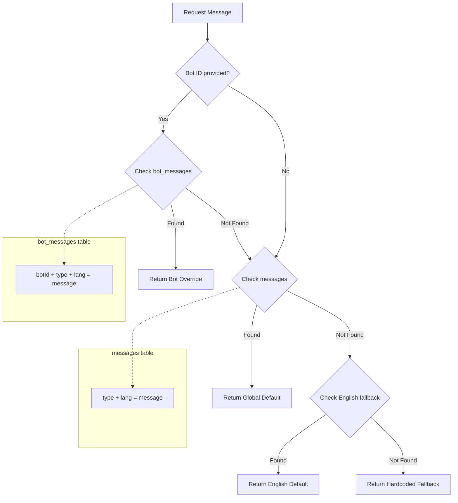

# Design Document: Multi-Bot Database Schema

## Document Information

| Attribute | Value |
|-----------|-------|
| **Feature** | Multi-Bot Database Schema |
| **Status** | Draft |
| **Created** | 2025-11-26 |
| **Last Updated** | 2025-11-26 |
| **Author** | Claude Code Design Agent |
| **Version** | 1.0.0 |

---

## Agreement Checklist

Agreements with user before design:

- [x] **Scope**: Database schema changes only (new tables, modified tables, repositories, migrations)
- [x] **Non-scope**: DynamicTelegrafModule, dynamic webhook routing, shared handlers architecture, runtime bot loading (Phase 2 - Deferred)
- [x] **Constraints**: Must be backward compatible with existing single-bot code during transition
- [x] **Framework**: Drizzle ORM for schema definitions
- [x] **Tech Stack**: PostgreSQL, Drizzle ORM, NestJS repository pattern
- [x] **Migration Strategy**: Phased approach (create tables -> add nullable columns -> populate -> add constraints)
- [x] **Default Bot**: Create default bot during migration to maintain backward compatibility

### Agreement Reflection in Design

| Agreement | Reflected In Section |
|-----------|---------------------|
| Database schema focus | [New Tables](#1-new-tables-drizzle-schema), [Modified Tables](#2-modified-tables) |
| DynamicTelegrafModule deferred | [Out of Scope](#out-of-scope-phase-2---deferred) |
| Backward compatibility | [Migration Strategy](#5-migration-strategy) |
| Drizzle ORM patterns | All schema definitions follow existing project patterns |
| Phased migration | [Migration Strategy](#5-migration-strategy) |

---

## Prerequisite ADRs

| ADR | Title | Relevance |
|-----|-------|-----------|
| [ADR-004](../adr/ADR-004-multi-bot-architecture.md) v1.3.0 | Multi-Bot Database Architecture | Defines all 6 architectural decisions including user identity model, subscription architecture, message override strategy, token storage, feature flags storage, and dynamic bot registration |

---

## Out of Scope (Phase 2 - Deferred)

The following components are explicitly deferred to Phase 2:

| Component | Location | Description | Reason for Deferral |
|-----------|----------|-------------|---------------------|
| DynamicTelegrafModule | `libs/framework/src/dynamic-telegraf/` | Dynamic bot loader module | Requires database schema first |
| DynamicWebhookController | `src/dynamic-webhook.controller.ts` | Webhook routing for dynamic bots | Requires DynamicTelegrafModule |
| Shared Handlers | `libs/bot/src/handlers/` | Shared business logic for dynamic bots | Requires DynamicTelegrafModule |
| Runtime Bot Loading | N/A | Loading bots from database at startup | Requires DynamicTelegrafModule |

**Reference**: See `docs/design/multi-bot-dynamic-loader.md` for Phase 2 implementation details.

---

## Existing Codebase Analysis

### Implementation Path Mapping

| Path | Status | Description |
|------|--------|-------------|
| `libs/db/src/schema/users.ts` | Existing | Users table (telegramId PK) |
| `libs/db/src/schema/user-subscriptions.ts` | **Modify** | Add botId column |
| `libs/db/src/schema/renewal-tariffs.ts` | **Modify** | Add botId column (nullable) |
| `libs/db/src/schema/codes.ts` | **Modify** | Add botId column |
| `libs/db/src/schema/messages.ts` | Existing | Global messages table |
| `libs/db/src/schema/bots.ts` | **New** | Bots table |
| `libs/db/src/schema/bot-settings.ts` | **New** | Bot settings table (1:1 with bots) |
| `libs/db/src/schema/bot-users.ts` | **New** | Bot-user relationship table |
| `libs/db/src/schema/bot-messages.ts` | **New** | Bot message overrides table |
| `libs/db/src/schema/index.ts` | **Modify** | Export new schemas |
| `libs/db/src/repositories/bots.repository.ts` | **New** | BotsRepository |
| `libs/db/src/repositories/bot-settings.repository.ts` | **New** | BotSettingsRepository |
| `libs/db/src/repositories/bot-users.repository.ts` | **New** | BotUsersRepository |
| `libs/db/src/repositories/bot-messages.repository.ts` | **New** | BotMessagesRepository |
| `libs/db/src/repositories/user-subscriptions.repository.ts` | **Modify** | Add botId support |
| `libs/db/src/repositories/renewal-tariffs.repository.ts` | **Modify** | Add botId support |
| `libs/db/src/repositories/codes.repository.ts` | **Modify** | Add botId support |
| `libs/db/src/repositories/messages.repository.ts` | **Modify** | Add bot-aware resolution |
| `libs/db/src/repositories/index.ts` | **Modify** | Export new repositories |

### Similar Functionality Search Results

**Search for existing bot management:**
- `Grep: "bots" --type ts` in schema/ - Not found (confirms new tables needed)
- `Grep: "botId" --type ts` - Not found (confirms new columns needed)
- `Grep: "bot_settings" --type ts` - Not found (confirms new table needed)

**Decision**: No similar functionality exists. Proceed with new implementation following ADR-004 decisions.

### Existing Schema Patterns

From `libs/db/src/schema/users.ts`:
```typescript
import { pgTable, timestamp, varchar, bigint, boolean } from 'drizzle-orm/pg-core'

export const users = pgTable('users', {
  telegramId: bigint('telegram_id', { mode: 'number' }).primaryKey().notNull(),
  // ... fields
  createdAt: timestamp('created_at', { withTimezone: true }).defaultNow().notNull(),
})

export type User = typeof users.$inferSelect
export type NewUser = typeof users.$inferInsert
```

**Key observations**:
- Uses `bigint` with `{ mode: 'number' }` for IDs
- Uses `timestamp` with `{ withTimezone: true }` for dates
- Exports both `$inferSelect` and `$inferInsert` types
- Uses snake_case for column names, camelCase for TypeScript properties

---

## Change Impact Map

```yaml
Change Target: Multi-Bot Database Schema

Direct Impact:
  - libs/db/src/schema/bots.ts (new file)
  - libs/db/src/schema/bot-settings.ts (new file)
  - libs/db/src/schema/bot-users.ts (new file)
  - libs/db/src/schema/bot-messages.ts (new file)
  - libs/db/src/schema/user-subscriptions.ts (add botId column)
  - libs/db/src/schema/renewal-tariffs.ts (add botId column)
  - libs/db/src/schema/codes.ts (add botId column)
  - libs/db/src/schema/index.ts (add exports)
  - libs/db/src/repositories/bots.repository.ts (new file)
  - libs/db/src/repositories/bot-settings.repository.ts (new file)
  - libs/db/src/repositories/bot-users.repository.ts (new file)
  - libs/db/src/repositories/bot-messages.repository.ts (new file)
  - libs/db/src/repositories/user-subscriptions.repository.ts (add botId methods)
  - libs/db/src/repositories/renewal-tariffs.repository.ts (add botId methods)
  - libs/db/src/repositories/codes.repository.ts (add botId methods)
  - libs/db/src/repositories/messages.repository.ts (add bot-aware resolution)
  - libs/db/src/repositories/index.ts (add exports)

Indirect Impact:
  - Migration files (new migration for schema changes)
  - Database indexes (new indexes for bot-related queries)
  - Query patterns (existing queries unchanged during transition)

No Ripple Effect:
  - Existing bot handlers (no changes until Phase 2)
  - MT5 webhook processing
  - Payment processing (references user_subscriptions unchanged)
  - Subscription features tables (remain global per PRD)
```

---

## Interface Change Matrix

| Existing Interface | New Interface | Conversion Required | Adapter Required | Compatibility Method |
|-------------------|---------------|---------------------|------------------|---------------------|
| `UserSubscription` | `UserSubscription` (with botId) | No | No | botId nullable initially |
| `RenewalTariff` | `RenewalTariff` (with botId) | No | No | botId nullable (global tariffs) |
| `Code` | `Code` (with botId) | No | No | botId nullable initially |
| `MessagesRepository.findByTypeAndLang()` | `resolveMessage(botId, type, lang)` | Yes | Via new method | Old method still works |
| N/A | `BotsRepository` | N/A | N/A | New repository |
| N/A | `BotSettingsRepository` | N/A | N/A | New repository |
| N/A | `BotUsersRepository` | N/A | N/A | New repository |
| N/A | `BotMessagesRepository` | N/A | N/A | New repository |

---

## Integration Point Map

```yaml
Integration Point 1:
  Existing Component: libs/db/src/schema/index.ts
  Integration Method: Export new schema tables
  Impact Level: Low (Export addition)
  Required Test Coverage: Schema exports, Drizzle queries work

Integration Point 2:
  Existing Component: libs/db/src/repositories/index.ts
  Integration Method: Export new repositories
  Impact Level: Low (Export addition)
  Required Test Coverage: Repository exports, DI injection works

Integration Point 3:
  Existing Component: libs/db/src/repositories/user-subscriptions.repository.ts
  Integration Method: Add botId parameter to key methods
  Impact Level: Medium (Method signature changes)
  Required Test Coverage: Existing methods work without botId, new methods work with botId

Integration Point 4:
  Existing Component: libs/db/src/repositories/renewal-tariffs.repository.ts
  Integration Method: Add botId parameter to tariff queries
  Impact Level: Medium (Method signature changes)
  Required Test Coverage: Global tariffs (null botId) still work, bot-specific tariffs work

Integration Point 5:
  Existing Component: libs/db/src/repositories/codes.repository.ts
  Integration Method: Add botId parameter to code operations
  Impact Level: Medium (Method signature changes)
  Required Test Coverage: Existing code activation works, bot-scoped codes work

Integration Point 6:
  Existing Component: libs/db/src/repositories/messages.repository.ts
  Integration Method: Add new resolveMessage method with bot-aware resolution
  Impact Level: Low (New method, existing unchanged)
  Required Test Coverage: Bot override > global default > fallback chain
```

---

## Integration Boundary Contracts

```yaml
Boundary: BotsRepository
  Input: Bot ID (number), Bot data (NewBot)
  Output: Bot record (sync Promise<Bot>)
  On Error: Throw database error, caller handles

Boundary: BotSettingsRepository
  Input: Bot ID (number), Settings JSONB (BotSettings)
  Output: Settings record (sync Promise<BotSettingsRecord>)
  On Error: Throw database error, caller handles

Boundary: BotUsersRepository
  Input: User ID (number), Bot ID (number), BotUser data
  Output: BotUser record (sync Promise<BotUser>)
  On Error: Throw database error, caller handles

Boundary: BotMessagesRepository
  Input: Bot ID (number), type (string), lang (string)
  Output: Message override or null (sync Promise<BotMessage | null>)
  On Error: Throw database error, caller handles

Boundary: MessagesRepository.resolveMessage
  Input: Bot ID (number | null), type (string), lang (string)
  Output: Resolved message string (sync Promise<string>)
  On Error: Return hardcoded fallback, log error
```

---

## Implementation Approach Decision

**Selected Approach**: **Horizontal Slice (Foundation-driven)**

### Rationale (Metacognitive Strategy Selection)

**Phase 1 Analysis** - Current State:
- Existing schema works for single-bot
- No multi-bot tables exist
- Repositories follow consistent BaseRepository pattern

**Phase 2 Strategy Exploration**:
- **Foundation-driven Development**: Build database foundation first, then handlers
- **Feature-driven Development**: Not suitable (features depend on schema)
- **Strangler Pattern**: Not applicable (not replacing, extending)

**Phase 3 Risk Assessment**:
| Risk | Mitigation |
|------|-----------|
| Migration breaks existing data | Phased migration with nullable columns first |
| Queries fail with new columns | Backward-compatible defaults |
| Repository changes break callers | Optional botId parameters |

**Phase 4 Constraint Compatibility**:
- [x] Drizzle ORM supports all required column types
- [x] PostgreSQL JSONB for flexible settings
- [x] Foreign keys with appropriate CASCADE rules
- [x] Partial unique indexes supported

**Verification Method**: L3 (Build success) for schema, L2 (Test operation) for repositories

---

## 1. New Tables (Drizzle Schema)

### 1.1 Bots Table

**Location**: `libs/db/src/schema/bots.ts`

```typescript
// libs/db/src/schema/bots.ts

import {
  pgTable,
  bigint,
  varchar,
  boolean,
  timestamp,
} from 'drizzle-orm/pg-core'

/**
 * Bots table schema
 *
 * Stores configuration for all Telegram bots (both static and dynamic).
 * Static bots (isDynamic=false) are registered via TelegrafModule.forRootAsync().
 * Dynamic bots (isDynamic=true) are loaded by DynamicTelegrafModule on startup.
 *
 * Token storage: Plain text per ADR-004 Decision 4 (acceptable for single-developer
 * project with regenerable credentials).
 *
 * Note: ADR-004 examples show uuid for bots.id; bigint selected for consistency
 * with existing schema patterns (users.telegramId, user_subscriptions.id).
 */
export const bots = pgTable('bots', {
  /** Primary key - auto-incrementing bigint (Drizzle mode:'number' converts to JS number) */
  id: bigint('id', { mode: 'number' }).primaryKey().generatedAlwaysAsIdentity(),

  /** Telegram bot token from BotFather (plain text per ADR-004 Decision 4) */
  token: varchar('token', { length: 100 }).notNull(),

  /** Unique bot name for identification (e.g., 'SignalBot', 'BrandBot') */
  name: varchar('name', { length: 100 }).notNull().unique(),

  /** Telegram bot username (without @, e.g., 'QuantumDealBot') */
  username: varchar('username', { length: 100 }),

  /** Webhook path (unique, e.g., '/dynamic/signal', '/dynamic/brand') */
  webhookPath: varchar('webhook_path', { length: 100 }),

  /** Whether this bot is managed by DynamicTelegrafModule (true) or nest-telegraf (false) */
  isDynamic: boolean('is_dynamic').default(true).notNull(),

  /** Whether the bot is active and should be loaded */
  isActive: boolean('is_active').default(true).notNull(),

  /** Record creation timestamp */
  createdAt: timestamp('created_at', { withTimezone: true }).defaultNow().notNull(),

  /** Last update timestamp */
  updatedAt: timestamp('updated_at', { withTimezone: true }).defaultNow().notNull(),
})

/** Type for selecting a bot record */
export type Bot = typeof bots.$inferSelect

/** Type for inserting a new bot record */
export type NewBot = typeof bots.$inferInsert
```

### 1.2 Bot Settings Table

**Location**: `libs/db/src/schema/bot-settings.ts`

```typescript
// libs/db/src/schema/bot-settings.ts

import {
  pgTable,
  bigint,
  jsonb,
  timestamp,
} from 'drizzle-orm/pg-core'
import { bots } from './bots'

/**
 * Bot feature settings interface stored in JSONB
 * Matches BotSettings from PRD v1.2.0
 *
 * Queryable via: bot_settings.settings->'features'->>'trialEnabled'
 */
export interface BotSettings {
  features: {
    trialEnabled: boolean
    paymentsEnabled: boolean
    signalsEnabled: boolean
    broadcastEnabled: boolean
  }
  defaults: {
    subscriptionDays: number
    trialDays: number
    language: string
  }
  ui?: {
    welcomeImage?: string
    brandColor?: string
  }
}

/**
 * Payment-specific settings interface
 */
export interface PaymentSettings {
  starsEnabled: boolean
  minAmount: number
  maxAmount: number
  refundWindowHours: number
}

/**
 * Default bot settings for new bots
 */
export const DEFAULT_BOT_SETTINGS: BotSettings = {
  features: {
    trialEnabled: true,
    paymentsEnabled: true,
    signalsEnabled: true,
    broadcastEnabled: false,
  },
  defaults: {
    subscriptionDays: 30,
    trialDays: 7,
    language: 'en',
  },
}

/**
 * Bot settings table schema
 *
 * Stores bot-specific settings in a separate table for cleaner separation.
 * One-to-one relationship with bots table via botId.
 *
 * Per ADR-004 Decision 5: JSONB storage for flexible feature flags without migrations.
 */
export const botSettings = pgTable('bot_settings', {
  /** Primary key - auto-incrementing bigint converted to JS number */
  id: bigint('id', { mode: 'number' }).primaryKey().generatedAlwaysAsIdentity(),

  /** Foreign key to bots table (1:1 relationship, unique) */
  botId: bigint('bot_id', { mode: 'number' })
    .notNull()
    .unique()
    .references(() => bots.id, { onDelete: 'cascade' }),

  /** Bot feature and behavior settings (JSONB) */
  settings: jsonb('settings').$type<BotSettings>().notNull().default(DEFAULT_BOT_SETTINGS),

  /** Payment-specific settings (nullable for bots without payments) */
  paymentSettings: jsonb('payment_settings').$type<PaymentSettings>(),

  /** Record creation timestamp */
  createdAt: timestamp('created_at', { withTimezone: true }).defaultNow().notNull(),

  /** Last update timestamp */
  updatedAt: timestamp('updated_at', { withTimezone: true }).defaultNow().notNull(),
})

/** Type for selecting a bot_settings record */
export type BotSettingsRecord = typeof botSettings.$inferSelect

/** Type for inserting a new bot_settings record */
export type NewBotSettingsRecord = typeof botSettings.$inferInsert
```

### 1.3 Bot Users Table

**Location**: `libs/db/src/schema/bot-users.ts`

```typescript
// libs/db/src/schema/bot-users.ts

import {
  pgTable,
  bigint,
  varchar,
  jsonb,
  boolean,
  timestamp,
  unique,
} from 'drizzle-orm/pg-core'
import { users } from './users'
import { bots } from './bots'

/**
 * Bot-specific user preferences interface
 */
export interface BotUserPreferences {
  notifications?: {
    signals?: boolean
    broadcasts?: boolean
    reminders?: boolean
  }
  display?: {
    showPips?: boolean
    showPercentage?: boolean
  }
}

/**
 * Bot-specific conversation state interface
 */
export interface BotUserState {
  currentScene?: string
  sceneData?: Record<string, unknown>
  lastCommand?: string
  lastCommandAt?: string
}

/**
 * Bot users table schema
 *
 * Per-bot settings for users (many-to-many relationship).
 * Stores bot-specific language, preferences, and conversation state.
 *
 * Per ADR-004 Decision 1: Global user profile + per-bot settings table.
 * Resolution: bot_users.lang > users.lang > system default
 */
export const botUsers = pgTable(
  'bot_users',
  {
    /** Primary key - auto-incrementing bigint converted to JS number */
    id: bigint('id', { mode: 'number' }).primaryKey().generatedAlwaysAsIdentity(),

    /** Foreign key to users table */
    userId: bigint('user_id', { mode: 'number' })
      .notNull()
      .references(() => users.telegramId, { onDelete: 'cascade' }),

    /** Foreign key to bots table */
    botId: bigint('bot_id', { mode: 'number' })
      .notNull()
      .references(() => bots.id, { onDelete: 'cascade' }),

    /** User's language preference for this bot (overrides users.lang) */
    lang: varchar('lang', { length: 10 }),

    /** Bot-specific user preferences (JSONB) */
    preferences: jsonb('preferences').$type<BotUserPreferences>(),

    /** Conversation state for this bot (JSONB) */
    state: jsonb('state').$type<BotUserState>(),

    /** Whether user is active on this bot */
    isActive: boolean('is_active').default(true).notNull(),

    /** Record creation timestamp */
    createdAt: timestamp('created_at', { withTimezone: true }).defaultNow().notNull(),

    /** Last update timestamp */
    updatedAt: timestamp('updated_at', { withTimezone: true }).defaultNow().notNull(),
  },
  (table) => [
    /** Unique constraint: one record per (userId, botId) combination */
    unique('uq_bot_users_user_bot').on(table.userId, table.botId),
  ]
)

/** Type for selecting a bot_users record */
export type BotUser = typeof botUsers.$inferSelect

/** Type for inserting a new bot_users record */
export type NewBotUser = typeof botUsers.$inferInsert
```

### 1.4 Bot Messages Table

**Location**: `libs/db/src/schema/bot-messages.ts`

```typescript
// libs/db/src/schema/bot-messages.ts

import {
  pgTable,
  bigint,
  varchar,
  text,
  timestamp,
  unique,
} from 'drizzle-orm/pg-core'
import { bots } from './bots'

/**
 * Bot messages table schema
 *
 * Stores per-bot message overrides. Uses message resolution hierarchy:
 * bot_messages(botId, type, lang) > messages(type, lang) > hardcoded fallback
 *
 * Per ADR-004 Decision 3: Global defaults + per-bot overrides.
 * Only overrides stored here - missing messages fall back to global messages table.
 */
export const botMessages = pgTable(
  'bot_messages',
  {
    /** Primary key - auto-incrementing bigint converted to JS number */
    id: bigint('id', { mode: 'number' }).primaryKey().generatedAlwaysAsIdentity(),

    /** Foreign key to bots table */
    botId: bigint('bot_id', { mode: 'number' })
      .notNull()
      .references(() => bots.id, { onDelete: 'cascade' }),

    /** Message type key (e.g., 'welcome', 'subscription_expired', 'open', 'close_plus') */
    type: varchar('type', { length: 50 }).notNull(),

    /** Language code (e.g., 'en', 'ru') */
    lang: varchar('lang', { length: 10 }).notNull(),

    /** Override message content */
    message: text('message').notNull(),

    /** Record creation timestamp */
    createdAt: timestamp('created_at', { withTimezone: true }).defaultNow().notNull(),

    /** Last update timestamp */
    updatedAt: timestamp('updated_at', { withTimezone: true }).defaultNow().notNull(),
  },
  (table) => [
    /** Unique constraint: one override per (botId, type, lang) combination */
    unique('uq_bot_messages_bot_type_lang').on(table.botId, table.type, table.lang),
  ]
)

/** Type for selecting a bot_messages record */
export type BotMessage = typeof botMessages.$inferSelect

/** Type for inserting a new bot_messages record */
export type NewBotMessage = typeof botMessages.$inferInsert
```

---

## 2. Modified Tables

### 2.1 User Subscriptions Table (Add botId)

**Location**: `libs/db/src/schema/user-subscriptions.ts`

**Changes**:
```typescript
// Add to existing imports
import { bots } from './bots'

// Add after subscriptionId field
/**
 * Bot ID reference (for multi-bot architecture)
 * Nullable initially for backward compatibility during migration.
 * After migration Phase 4, existing subscriptions will have botId populated.
 */
botId: bigint('bot_id', { mode: 'number' })
  .references(() => bots.id, { onDelete: 'cascade' }),
```

**Full updated schema**:
```typescript
// libs/db/src/schema/user-subscriptions.ts

import { pgTable, timestamp, bigint, boolean, index } from 'drizzle-orm/pg-core'
import { users } from './users'
import { subscriptions } from './subscriptions'
import { bots } from './bots'

/**
 * User Subscriptions Table
 *
 * Central many-to-many relationship table that replaces:
 * - users.subscribeId (old one-to-one relationship)
 * - codes.userId, codes.activationDate, codes.expirationDate (old activation data)
 *
 * This table allows users to have multiple active subscriptions simultaneously,
 * supporting both:
 * - Signals subscriptions (type: 'signals')
 * - Broadcast subscriptions (type: 'subscription_{uid}')
 *
 * Multi-bot support: botId scopes subscriptions to specific bots.
 * Per ADR-004 Decision 2: Per-bot subscriptions.
 */
export const userSubscriptions = pgTable(
  'user_subscriptions',
  {
    id: bigint('id', { mode: 'number' }).primaryKey().generatedAlwaysAsIdentity(),
    userId: bigint('user_id', { mode: 'number' })
      .notNull()
      .references(() => users.telegramId, { onDelete: 'cascade' }),
    subscriptionId: bigint('subscription_id', { mode: 'number' })
      .notNull()
      .references(() => subscriptions.id, { onDelete: 'cascade' }),
    /**
     * Bot ID reference (for multi-bot architecture)
     * Nullable for backward compatibility during migration.
     */
    botId: bigint('bot_id', { mode: 'number' })
      .references(() => bots.id, { onDelete: 'cascade' }),
    activatedAt: timestamp('activated_at').notNull().defaultNow(),
    expiresAt: timestamp('expires_at'),
    isActive: boolean('is_active').notNull().default(true),
    createdAt: timestamp('created_at').defaultNow().notNull(),
  },
  (table) => [
    /** Index for bot-scoped subscription queries */
    index('idx_user_subscriptions_bot').on(table.botId),
    /** Composite index for user+bot queries */
    index('idx_user_subscriptions_user_bot').on(table.userId, table.botId),
    /**
     * Partial unique index per FR-012:
     * Prevents duplicate active subscriptions for same user+subscription+bot.
     * Allows subscription history (inactive records can have duplicates).
     */
    // Note: Drizzle doesn't support partial indexes directly in table definition.
    // This must be added via raw SQL migration. See Migration Phase 1.
  ]
)

export type UserSubscription = typeof userSubscriptions.$inferSelect
export type NewUserSubscription = typeof userSubscriptions.$inferInsert
```

### 2.2 Renewal Tariffs Table (Add botId)

**Location**: `libs/db/src/schema/renewal-tariffs.ts`

**Changes**:
```typescript
// Add to existing imports
import { bots } from './bots'
import { sql } from 'drizzle-orm'

// Add after subscriptionId field
/**
 * Bot ID reference (for bot-specific pricing)
 * Nullable for global tariffs (apply to all bots without specific tariff).
 * Tariff resolution: bot-specific > global (null botId).
 */
botId: bigint('bot_id', { mode: 'number' })
  .references(() => bots.id, { onDelete: 'cascade' }),

// Update unique constraint (replace existing)
unique('uq_renewal_tariff_subscription_period_bot').on(
  table.subscriptionId,
  table.periodDays,
  table.botId,
),
```

**Full updated schema**:
```typescript
// libs/db/src/schema/renewal-tariffs.ts

import {
  pgTable,
  bigint,
  integer,
  varchar,
  boolean,
  timestamp,
  unique,
  index,
} from 'drizzle-orm/pg-core'
import { subscriptions } from './subscriptions'
import { bots } from './bots'

/**
 * Renewal Tariffs Table
 *
 * Stores pricing for subscription renewals in Telegram Stars.
 * Each tariff is associated with a specific subscription.
 * Different subscriptions can have different pricing tiers.
 *
 * Multi-bot support: botId allows per-bot pricing.
 * Tariff resolution: bot-specific (botId set) > global (botId null).
 */
export const renewalTariffs = pgTable(
  'renewal_tariffs',
  {
    id: bigint('id', { mode: 'number' })
      .primaryKey()
      .generatedAlwaysAsIdentity(),

    subscriptionId: bigint('subscription_id', { mode: 'number' })
      .notNull()
      .references(() => subscriptions.id, { onDelete: 'cascade' }),

    /**
     * Bot ID reference (for bot-specific pricing)
     * Nullable for global tariffs (apply to all bots without specific tariff).
     */
    botId: bigint('bot_id', { mode: 'number' })
      .references(() => bots.id, { onDelete: 'cascade' }),

    periodDays: integer('period_days').notNull(),
    priceStars: integer('price_stars').notNull(),
    displayName: varchar('display_name', { length: 100 }).notNull(),
    discountPercent: integer('discount_percent'),
    isActive: boolean('is_active').notNull().default(true),
    sortOrder: integer('sort_order').notNull().default(0),

    createdAt: timestamp('created_at', { withTimezone: true })
      .defaultNow()
      .notNull(),
    updatedAt: timestamp('updated_at', { withTimezone: true })
      .defaultNow()
      .notNull(),
  },
  (table) => [
    /**
     * Unique constraint: one tariff per (subscription, period, bot) combination
     * NULL botId creates separate unique constraint for global tariffs
     */
    unique('uq_renewal_tariff_subscription_period_bot').on(
      table.subscriptionId,
      table.periodDays,
      table.botId,
    ),
    /** Index for bot-specific tariff lookup */
    index('idx_renewal_tariffs_bot').on(table.botId),
  ],
)

export type RenewalTariff = typeof renewalTariffs.$inferSelect
export type NewRenewalTariff = typeof renewalTariffs.$inferInsert
```

### 2.3 Codes Table (Add botId)

**Location**: `libs/db/src/schema/codes.ts`

**Changes**:
```typescript
// Add to existing imports
import { bots } from './bots'

// Add after subscriptionId field
/**
 * Bot ID reference (for bot-scoped activation codes)
 * Nullable for backward compatibility during migration.
 */
botId: bigint('bot_id', { mode: 'number' })
  .references(() => bots.id, { onDelete: 'cascade' }),
```

**Full updated schema**:
```typescript
// libs/db/src/schema/codes.ts

import {
  pgTable,
  timestamp,
  varchar,
  bigint,
  boolean,
  index,
} from 'drizzle-orm/pg-core'
import { subscriptions } from './subscriptions'
import { users } from './users'
import { managers } from './managers'
import { bots } from './bots'

/**
 * Codes table schema
 *
 * Multi-bot support: botId scopes activation codes to specific bots.
 */
export const codes = pgTable(
  'codes',
  {
    id: bigint('id', { mode: 'number' }).primaryKey().generatedAlwaysAsIdentity(),
    code: varchar('code').notNull(),
    subscriptionId: bigint('subscription_id', { mode: 'number' })
      .notNull()
      .references(() => subscriptions.id),
    /**
     * Bot ID reference (for bot-scoped activation codes)
     * Nullable for backward compatibility during migration.
     */
    botId: bigint('bot_id', { mode: 'number' })
      .references(() => bots.id, { onDelete: 'cascade' }),
    userId: bigint('user_id', { mode: 'number' }).references(
      () => users.telegramId,
    ),
    managerId: bigint('manager_id', { mode: 'number' }).references(
      () => managers.telegramId,
    ),
    activationDate: timestamp('activation_date'),
    expirationDate: timestamp('expiration_date'),
    isActive: boolean('is_active').notNull().default(true),
    createdAt: timestamp('created_at', { withTimezone: true })
      .defaultNow()
      .notNull(),
  },
  (table) => [
    /** Index for bot-scoped code lookup */
    index('idx_codes_bot').on(table.botId),
  ]
)

export type Code = typeof codes.$inferSelect
export type NewCode = typeof codes.$inferInsert
```

---

## 3. Repository Implementations

### 3.1 BotsRepository

**Location**: `libs/db/src/repositories/bots.repository.ts`

```typescript
// libs/db/src/repositories/bots.repository.ts

import { Injectable, Inject } from '@nestjs/common'
import { eq, and } from 'drizzle-orm'
import { BaseRepository } from './base.repository'
import { DRIZZLE_CLIENT, type DrizzleClient } from '../database.provider'
import { bots, Bot, NewBot } from '../schema/bots'
import { botSettings, BotSettings, PaymentSettings } from '../schema/bot-settings'

/**
 * Combined type for bot with settings loaded via JOIN
 */
export interface BotWithSettings extends Bot {
  settings: BotSettings | null
  paymentSettings: PaymentSettings | null
}

/**
 * BotsRepository
 *
 * Repository for managing bot configurations in the database.
 * Provides methods for CRUD operations on bots table.
 */
@Injectable()
export class BotsRepository extends BaseRepository<Bot, NewBot, number> {
  protected table = bots
  protected idColumn = bots.id

  constructor(@Inject(DRIZZLE_CLIENT) db: DrizzleClient) {
    super(db)
  }

  /**
   * Find all active dynamic bots with their settings
   * Used during application startup to load bots
   */
  async findActiveDynamic(): Promise<BotWithSettings[]> {
    const result = await this.db
      .select({
        bot: bots,
        settings: botSettings,
      })
      .from(bots)
      .leftJoin(botSettings, eq(bots.id, botSettings.botId))
      .where(and(eq(bots.isDynamic, true), eq(bots.isActive, true)))

    return result.map((row) => ({
      ...row.bot,
      settings: (row.settings?.settings as BotSettings) ?? null,
      paymentSettings: (row.settings?.paymentSettings as PaymentSettings) ?? null,
    }))
  }

  /**
   * Find all active bots (both static and dynamic)
   */
  async findAllActive(): Promise<Bot[]> {
    return this.findBy(eq(bots.isActive, true))
  }

  /**
   * Find a bot by ID with its settings (JOIN)
   */
  async findByIdWithSettings(id: number): Promise<BotWithSettings | null> {
    const result = await this.db
      .select({
        bot: bots,
        settings: botSettings,
      })
      .from(bots)
      .leftJoin(botSettings, eq(bots.id, botSettings.botId))
      .where(eq(bots.id, id))
      .limit(1)

    if (!result[0]) return null

    return {
      ...result[0].bot,
      settings: (result[0].settings?.settings as BotSettings) ?? null,
      paymentSettings: (result[0].settings?.paymentSettings as PaymentSettings) ?? null,
    }
  }

  /**
   * Find a bot by name
   */
  async findByName(name: string): Promise<Bot | null> {
    return this.findOneBy(eq(bots.name, name))
  }

  /**
   * Find a bot by Telegram username
   */
  async findByUsername(username: string): Promise<Bot | null> {
    return this.findOneBy(eq(bots.username, username))
  }

  /**
   * Find a bot by webhook path
   */
  async findByWebhookPath(webhookPath: string): Promise<Bot | null> {
    return this.findOneBy(eq(bots.webhookPath, webhookPath))
  }

  /**
   * Deactivate a bot (soft delete)
   */
  async deactivate(id: number): Promise<Bot | null> {
    return this.update(id, { isActive: false })
  }

  /**
   * Activate a bot
   */
  async activate(id: number): Promise<Bot | null> {
    return this.update(id, { isActive: true })
  }
}
```

### 3.2 BotSettingsRepository

**Location**: `libs/db/src/repositories/bot-settings.repository.ts`

```typescript
// libs/db/src/repositories/bot-settings.repository.ts

import { Injectable, Inject } from '@nestjs/common'
import { eq } from 'drizzle-orm'
import { BaseRepository } from './base.repository'
import { DRIZZLE_CLIENT, type DrizzleClient } from '../database.provider'
import {
  botSettings,
  BotSettingsRecord,
  NewBotSettingsRecord,
  BotSettings,
  PaymentSettings,
} from '../schema/bot-settings'

/**
 * BotSettingsRepository
 *
 * Repository for managing bot-specific settings.
 * Settings are stored separately from bot records for cleaner separation.
 */
@Injectable()
export class BotSettingsRepository extends BaseRepository<
  BotSettingsRecord,
  NewBotSettingsRecord,
  number
> {
  protected table = botSettings
  protected idColumn = botSettings.id

  constructor(@Inject(DRIZZLE_CLIENT) db: DrizzleClient) {
    super(db)
  }

  /**
   * Find settings by bot ID
   */
  async findByBotId(botId: number): Promise<BotSettingsRecord | null> {
    return this.findOneBy(eq(botSettings.botId, botId))
  }

  /**
   * Create or update settings for a bot (upsert)
   */
  async upsert(
    botId: number,
    data: { settings?: BotSettings; paymentSettings?: PaymentSettings }
  ): Promise<BotSettingsRecord> {
    const existing = await this.findByBotId(botId)

    if (existing) {
      const result = await this.db
        .update(botSettings)
        .set({ ...data, updatedAt: new Date() })
        .where(eq(botSettings.botId, botId))
        .returning()

      return result[0]
    }

    const result = await this.db
      .insert(botSettings)
      .values({ botId, ...data })
      .returning()

    return result[0]
  }

  /**
   * Update specific feature flags
   */
  async updateFeatureFlags(
    botId: number,
    features: Partial<BotSettings['features']>
  ): Promise<BotSettingsRecord | null> {
    const existing = await this.findByBotId(botId)
    if (!existing) return null

    const currentSettings = existing.settings as BotSettings
    const updatedSettings: BotSettings = {
      ...currentSettings,
      features: {
        ...currentSettings.features,
        ...features,
      },
    }

    const result = await this.db
      .update(botSettings)
      .set({ settings: updatedSettings, updatedAt: new Date() })
      .where(eq(botSettings.botId, botId))
      .returning()

    return result[0] ?? null
  }
}
```

### 3.3 BotUsersRepository

**Location**: `libs/db/src/repositories/bot-users.repository.ts`

```typescript
// libs/db/src/repositories/bot-users.repository.ts

import { Injectable, Inject } from '@nestjs/common'
import { eq, and } from 'drizzle-orm'
import { BaseRepository } from './base.repository'
import { DRIZZLE_CLIENT, type DrizzleClient } from '../database.provider'
import { botUsers, BotUser, NewBotUser, BotUserPreferences, BotUserState } from '../schema/bot-users'
import { users, User } from '../schema/users'
import { bots, Bot } from '../schema/bots'

/**
 * BotUsersRepository
 *
 * Repository for managing bot-user relationships.
 * Handles per-bot user settings, preferences, and conversation state.
 */
@Injectable()
export class BotUsersRepository extends BaseRepository<BotUser, NewBotUser, number> {
  protected table = botUsers
  protected idColumn = botUsers.id

  constructor(@Inject(DRIZZLE_CLIENT) db: DrizzleClient) {
    super(db)
  }

  /**
   * Find bot-user record by userId and botId
   */
  async findByUserAndBot(userId: number, botId: number): Promise<BotUser | null> {
    return this.findOneBy(
      and(eq(botUsers.userId, userId), eq(botUsers.botId, botId))
    )
  }

  /**
   * Find or create bot-user record
   * Creates new record if user-bot combination doesn't exist
   */
  async findOrCreate(
    userId: number,
    botId: number,
    defaults?: Partial<NewBotUser>
  ): Promise<BotUser> {
    const existing = await this.findByUserAndBot(userId, botId)
    if (existing) return existing

    return this.create({
      userId,
      botId,
      lang: defaults?.lang,
      preferences: defaults?.preferences,
      state: defaults?.state,
      isActive: defaults?.isActive ?? true,
    })
  }

  /**
   * Find all bots a user is associated with
   */
  async findBotsByUserId(userId: number): Promise<BotUser[]> {
    return this.findBy(eq(botUsers.userId, userId))
  }

  /**
   * Find all users associated with a bot
   */
  async findUsersByBotId(botId: number): Promise<BotUser[]> {
    return this.findBy(eq(botUsers.botId, botId))
  }

  /**
   * Find all active users for a bot
   */
  async findActiveUsersByBotId(botId: number): Promise<BotUser[]> {
    return this.findBy(
      and(eq(botUsers.botId, botId), eq(botUsers.isActive, true))
    )
  }

  /**
   * Find all active users for a bot with full user details (JOIN)
   */
  async findActiveUsersWithDetailsByBotId(botId: number): Promise<
    Array<{ botUser: BotUser; user: User }>
  > {
    const result = await this.db
      .select({
        botUser: botUsers,
        user: users,
      })
      .from(botUsers)
      .innerJoin(users, eq(botUsers.userId, users.telegramId))
      .where(
        and(
          eq(botUsers.botId, botId),
          eq(botUsers.isActive, true),
          eq(users.isActive, true)
        )
      )

    return result
  }

  /**
   * Update user language for a specific bot
   */
  async updateLanguage(userId: number, botId: number, lang: string): Promise<BotUser | null> {
    const result = await this.db
      .update(botUsers)
      .set({ lang, updatedAt: new Date() })
      .where(and(eq(botUsers.userId, userId), eq(botUsers.botId, botId)))
      .returning()

    return result[0] ?? null
  }

  /**
   * Update user preferences for a specific bot
   */
  async updatePreferences(
    userId: number,
    botId: number,
    preferences: BotUserPreferences
  ): Promise<BotUser | null> {
    const result = await this.db
      .update(botUsers)
      .set({ preferences, updatedAt: new Date() })
      .where(and(eq(botUsers.userId, userId), eq(botUsers.botId, botId)))
      .returning()

    return result[0] ?? null
  }

  /**
   * Update conversation state for a specific bot
   */
  async updateState(
    userId: number,
    botId: number,
    state: BotUserState
  ): Promise<BotUser | null> {
    const result = await this.db
      .update(botUsers)
      .set({ state, updatedAt: new Date() })
      .where(and(eq(botUsers.userId, userId), eq(botUsers.botId, botId)))
      .returning()

    return result[0] ?? null
  }

  /**
   * Deactivate user for a specific bot (user blocked the bot)
   */
  async deactivate(userId: number, botId: number): Promise<BotUser | null> {
    const result = await this.db
      .update(botUsers)
      .set({ isActive: false, updatedAt: new Date() })
      .where(and(eq(botUsers.userId, userId), eq(botUsers.botId, botId)))
      .returning()

    return result[0] ?? null
  }

  /**
   * Activate user for a specific bot (user unblocked the bot)
   */
  async activate(userId: number, botId: number): Promise<BotUser | null> {
    const result = await this.db
      .update(botUsers)
      .set({ isActive: true, updatedAt: new Date() })
      .where(and(eq(botUsers.userId, userId), eq(botUsers.botId, botId)))
      .returning()

    return result[0] ?? null
  }

  /**
   * Resolve user language for a bot (bot_users.lang > users.lang > default)
   */
  async resolveLanguage(userId: number, botId: number, defaultLang = 'en'): Promise<string> {
    const botUser = await this.findByUserAndBot(userId, botId)
    if (botUser?.lang) return botUser.lang

    // Fall back to global user language
    const user = await this.db
      .select({ lang: users.lang })
      .from(users)
      .where(eq(users.telegramId, userId))
      .limit(1)

    return user[0]?.lang ?? defaultLang
  }
}
```

### 3.4 BotMessagesRepository

**Location**: `libs/db/src/repositories/bot-messages.repository.ts`

```typescript
// libs/db/src/repositories/bot-messages.repository.ts

import { Injectable, Inject, Logger } from '@nestjs/common'
import { eq, and } from 'drizzle-orm'
import { BaseRepository } from './base.repository'
import { DRIZZLE_CLIENT, type DrizzleClient } from '../database.provider'
import { botMessages, BotMessage, NewBotMessage } from '../schema/bot-messages'
import { messages, MessageType } from '../schema/messages'

/**
 * BotMessagesRepository
 *
 * Repository for managing per-bot message overrides.
 * Implements message resolution hierarchy per ADR-004 Decision 3:
 * bot_messages(botId, type, lang) > messages(type, lang) > hardcoded fallback
 */
@Injectable()
export class BotMessagesRepository extends BaseRepository<
  BotMessage,
  NewBotMessage,
  number
> {
  protected table = botMessages
  protected idColumn = botMessages.id
  private readonly logger = new Logger(BotMessagesRepository.name)

  constructor(@Inject(DRIZZLE_CLIENT) db: DrizzleClient) {
    super(db)
  }

  /**
   * Find bot-specific message override
   */
  async findByBotTypeAndLang(
    botId: number,
    type: string,
    lang: string
  ): Promise<BotMessage | null> {
    return this.findOneBy(
      and(
        eq(botMessages.botId, botId),
        eq(botMessages.type, type),
        eq(botMessages.lang, lang)
      )
    )
  }

  /**
   * Find all message overrides for a bot
   */
  async findAllByBotId(botId: number): Promise<BotMessage[]> {
    return this.findBy(eq(botMessages.botId, botId))
  }

  /**
   * Find all overrides for a specific message type across all bots
   */
  async findAllByType(type: string): Promise<BotMessage[]> {
    return this.findBy(eq(botMessages.type, type))
  }

  /**
   * Resolve message with full hierarchy:
   * 1. Bot-specific override (bot_messages)
   * 2. Global default (messages)
   * 3. Hardcoded fallback
   *
   * Per ADR-004 Decision 3: Message Override Strategy
   */
  async resolveMessage(
    botId: number | null,
    type: string,
    lang: string
  ): Promise<string> {
    // Step 1: Check bot-specific override
    if (botId !== null) {
      const botOverride = await this.findByBotTypeAndLang(botId, type, lang)
      if (botOverride) {
        return botOverride.message
      }
    }

    // Step 2: Fall back to global default
    const globalDefault = await this.db
      .select({ message: messages.message })
      .from(messages)
      .where(and(eq(messages.type, type), eq(messages.lang, lang)))
      .limit(1)

    if (globalDefault[0]?.message) {
      return globalDefault[0].message
    }

    // Step 3: Try English fallback for global messages
    if (lang !== 'en') {
      const englishDefault = await this.db
        .select({ message: messages.message })
        .from(messages)
        .where(and(eq(messages.type, type), eq(messages.lang, 'en')))
        .limit(1)

      if (englishDefault[0]?.message) {
        this.logger.debug(
          `Message ${type} not found for lang ${lang}, using English fallback`
        )
        return englishDefault[0].message
      }
    }

    // Step 4: Hardcoded fallback (should rarely happen)
    this.logger.warn(`No message found for type=${type}, lang=${lang}`)
    return this.getHardcodedFallback(type, lang)
  }

  /**
   * Create or update a bot message override
   */
  async upsert(
    botId: number,
    type: string,
    lang: string,
    message: string
  ): Promise<BotMessage> {
    const existing = await this.findByBotTypeAndLang(botId, type, lang)

    if (existing) {
      const result = await this.db
        .update(botMessages)
        .set({ message, updatedAt: new Date() })
        .where(eq(botMessages.id, existing.id))
        .returning()

      return result[0]
    }

    return this.create({ botId, type, lang, message })
  }

  /**
   * Delete a bot message override
   */
  async deleteOverride(botId: number, type: string, lang: string): Promise<boolean> {
    const existing = await this.findByBotTypeAndLang(botId, type, lang)
    if (!existing) return false

    return this.delete(existing.id)
  }

  /**
   * Get hardcoded fallback message
   * Used when no message exists in database
   */
  private getHardcodedFallback(type: string, lang: string): string {
    const fallbacks: Record<string, Record<string, string>> = {
      welcome: {
        en: 'Welcome!',
        ru: 'Добро пожаловать!',
      },
      error: {
        en: 'An error occurred. Please try again.',
        ru: 'Произошла ошибка. Попробуйте еще раз.',
      },
    }

    return fallbacks[type]?.[lang] ?? fallbacks[type]?.['en'] ?? 'Message not available'
  }
}
```

---

## 4. Updated Repository Index

**Location**: `libs/db/src/repositories/index.ts`

Add exports for new repositories:

```typescript
// Add to libs/db/src/repositories/index.ts

// ... existing exports ...

// New multi-bot repositories
export * from './bots.repository'
export * from './bot-settings.repository'
export * from './bot-users.repository'
export * from './bot-messages.repository'
```

---

## 5. Migration Strategy

### Phase 1: Create New Tables

```sql
-- Migration: 0001_create_multi_bot_tables.sql

-- Create bots table
CREATE TABLE IF NOT EXISTS bots (
  id BIGSERIAL PRIMARY KEY,
  token VARCHAR(100) NOT NULL,
  name VARCHAR(100) NOT NULL UNIQUE,
  username VARCHAR(100),
  webhook_path VARCHAR(100),
  is_dynamic BOOLEAN NOT NULL DEFAULT true,
  is_active BOOLEAN NOT NULL DEFAULT true,
  created_at TIMESTAMP WITH TIME ZONE NOT NULL DEFAULT NOW(),
  updated_at TIMESTAMP WITH TIME ZONE NOT NULL DEFAULT NOW()
);

-- Create bot_settings table
CREATE TABLE IF NOT EXISTS bot_settings (
  id BIGSERIAL PRIMARY KEY,
  bot_id BIGINT NOT NULL UNIQUE REFERENCES bots(id) ON DELETE CASCADE,
  settings JSONB NOT NULL DEFAULT '{"features":{"trialEnabled":true,"paymentsEnabled":true,"signalsEnabled":true,"broadcastEnabled":false},"defaults":{"subscriptionDays":30,"trialDays":7,"language":"en"}}',
  payment_settings JSONB,
  created_at TIMESTAMP WITH TIME ZONE NOT NULL DEFAULT NOW(),
  updated_at TIMESTAMP WITH TIME ZONE NOT NULL DEFAULT NOW()
);

-- Create bot_users table
CREATE TABLE IF NOT EXISTS bot_users (
  id BIGSERIAL PRIMARY KEY,
  user_id BIGINT NOT NULL REFERENCES users(telegram_id) ON DELETE CASCADE,
  bot_id BIGINT NOT NULL REFERENCES bots(id) ON DELETE CASCADE,
  lang VARCHAR(10),
  preferences JSONB,
  state JSONB,
  is_active BOOLEAN NOT NULL DEFAULT true,
  created_at TIMESTAMP WITH TIME ZONE NOT NULL DEFAULT NOW(),
  updated_at TIMESTAMP WITH TIME ZONE NOT NULL DEFAULT NOW(),
  CONSTRAINT uq_bot_users_user_bot UNIQUE (user_id, bot_id)
);

-- Create bot_messages table
CREATE TABLE IF NOT EXISTS bot_messages (
  id BIGSERIAL PRIMARY KEY,
  bot_id BIGINT NOT NULL REFERENCES bots(id) ON DELETE CASCADE,
  type VARCHAR(50) NOT NULL,
  lang VARCHAR(10) NOT NULL,
  message TEXT NOT NULL,
  created_at TIMESTAMP WITH TIME ZONE NOT NULL DEFAULT NOW(),
  updated_at TIMESTAMP WITH TIME ZONE NOT NULL DEFAULT NOW(),
  CONSTRAINT uq_bot_messages_bot_type_lang UNIQUE (bot_id, type, lang)
);

-- Index for finding active dynamic bots on startup
CREATE INDEX idx_bots_dynamic_active ON bots(is_dynamic, is_active)
  WHERE is_dynamic = true AND is_active = true;

-- Index for bot-user lookups
CREATE INDEX idx_bot_users_user_id ON bot_users(user_id);
CREATE INDEX idx_bot_users_bot_id ON bot_users(bot_id);

-- Index for message resolution
CREATE INDEX idx_bot_messages_bot_type_lang ON bot_messages(bot_id, type, lang);
```

### Phase 2: Add Nullable botId Columns

```sql
-- Migration: 0002_add_bot_id_columns.sql

-- Add nullable botId to user_subscriptions
ALTER TABLE user_subscriptions
  ADD COLUMN bot_id BIGINT REFERENCES bots(id) ON DELETE CASCADE;

-- Add nullable botId to renewal_tariffs (remains nullable for global tariffs)
ALTER TABLE renewal_tariffs
  ADD COLUMN bot_id BIGINT REFERENCES bots(id) ON DELETE CASCADE;

-- Drop existing unique constraint
ALTER TABLE renewal_tariffs
  DROP CONSTRAINT IF EXISTS uq_renewal_tariff_subscription_period;

-- Add new unique constraint including botId
-- This allows: (sub_id=1, period=30, bot_id=NULL) and (sub_id=1, period=30, bot_id=1) as separate
ALTER TABLE renewal_tariffs
  ADD CONSTRAINT uq_renewal_tariff_subscription_period_bot
  UNIQUE (subscription_id, period_days, bot_id);

-- Add nullable botId to codes
ALTER TABLE codes
  ADD COLUMN bot_id BIGINT REFERENCES bots(id) ON DELETE CASCADE;

-- Add indexes for new columns
CREATE INDEX idx_user_subscriptions_bot ON user_subscriptions(bot_id);
CREATE INDEX idx_user_subscriptions_user_bot ON user_subscriptions(user_id, bot_id);

-- FR-012: Partial unique index - prevents duplicate active subscriptions per user+subscription+bot
-- Allows historical records (is_active = false) to have duplicates
CREATE UNIQUE INDEX uq_user_subscriptions_active
  ON user_subscriptions(user_id, subscription_id, bot_id)
  WHERE is_active = true;
CREATE INDEX idx_renewal_tariffs_bot ON renewal_tariffs(bot_id);
CREATE INDEX idx_codes_bot ON codes(bot_id);
```

### Phase 3: Create Default Bot and Populate botId

```sql
-- Migration: 0003_create_default_bot.sql

-- Create default bot using current environment's bot token
-- NOTE: Replace TOKEN_VALUE with actual token from environment variable
-- This should be done via application code or migration script with env vars

-- Insert default bot
INSERT INTO bots (token, name, username, webhook_path, is_dynamic, is_active)
VALUES (
  '${TELEGRAM_BOT_TOKEN}',  -- Placeholder, replace in application
  'QuantumDealBot',
  'QuantumDealBot',
  '/bot',
  false,  -- Static bot (nest-telegraf managed)
  true
)
ON CONFLICT (name) DO NOTHING
RETURNING id;

-- Get the default bot ID (assume it's the first one for this migration)
-- In production, use application code to get the actual ID

-- Create default bot settings
INSERT INTO bot_settings (bot_id, settings)
SELECT id, '{"features":{"trialEnabled":true,"paymentsEnabled":true,"signalsEnabled":true,"broadcastEnabled":false},"defaults":{"subscriptionDays":30,"trialDays":7,"language":"en"}}'::jsonb
FROM bots WHERE name = 'QuantumDealBot'
ON CONFLICT (bot_id) DO NOTHING;

-- Populate botId for existing user_subscriptions
UPDATE user_subscriptions
SET bot_id = (SELECT id FROM bots WHERE name = 'QuantumDealBot' LIMIT 1)
WHERE bot_id IS NULL;

-- Populate botId for existing codes
UPDATE codes
SET bot_id = (SELECT id FROM bots WHERE name = 'QuantumDealBot' LIMIT 1)
WHERE bot_id IS NULL;

-- Note: renewal_tariffs.bot_id remains NULL for global tariffs (this is intentional)

-- Create bot_users entries for all existing users linked to default bot
INSERT INTO bot_users (user_id, bot_id, lang, is_active)
SELECT u.telegram_id, b.id, u.lang, u.is_active
FROM users u
CROSS JOIN (SELECT id FROM bots WHERE name = 'QuantumDealBot' LIMIT 1) b
ON CONFLICT (user_id, bot_id) DO NOTHING;
```

### Phase 4: Add Constraints (Optional)

```sql
-- Migration: 0004_add_not_null_constraints.sql
-- NOTE: Only run this after confirming all data is migrated

-- Make user_subscriptions.bot_id NOT NULL (optional, depends on requirements)
-- ALTER TABLE user_subscriptions ALTER COLUMN bot_id SET NOT NULL;

-- Make codes.bot_id NOT NULL (optional, depends on requirements)
-- ALTER TABLE codes ALTER COLUMN bot_id SET NOT NULL;

-- Note: renewal_tariffs.bot_id remains nullable for global tariffs
```

---

## 6. Data Flow Diagrams

### Entity Relationship Diagram

```mermaid
erDiagram
    bots ||--o{ bot_settings : "has"
    bots ||--o{ bot_users : "has members"
    bots ||--o{ bot_messages : "has overrides"
    bots ||--o{ user_subscriptions : "scopes"
    bots ||--o{ renewal_tariffs : "has pricing"
    bots ||--o{ codes : "scopes"
    users ||--o{ bot_users : "belongs to"
    users ||--o{ user_subscriptions : "has"
    subscriptions ||--o{ user_subscriptions : "used via"
    subscriptions ||--o{ renewal_tariffs : "has"
    subscriptions ||--o{ codes : "activates"

    bots {
        bigint id PK
        varchar token
        varchar name UK
        varchar username
        varchar webhook_path
        boolean is_dynamic
        boolean is_active
        timestamp created_at
        timestamp updated_at
    }

    bot_settings {
        bigint id PK
        bigint bot_id FK UK
        jsonb settings
        jsonb payment_settings
        timestamp created_at
        timestamp updated_at
    }

    bot_users {
        bigint id PK
        bigint user_id FK
        bigint bot_id FK
        varchar lang
        jsonb preferences
        jsonb state
        boolean is_active
        timestamp created_at
        timestamp updated_at
    }

    bot_messages {
        bigint id PK
        bigint bot_id FK
        varchar type
        varchar lang
        text message
        timestamp created_at
        timestamp updated_at
    }

    user_subscriptions {
        bigint id PK
        bigint user_id FK
        bigint subscription_id FK
        bigint bot_id FK
        timestamp activated_at
        timestamp expires_at
        boolean is_active
        timestamp created_at
    }

    renewal_tariffs {
        bigint id PK
        bigint subscription_id FK
        bigint bot_id FK "nullable for global"
        integer period_days
        integer price_stars
        varchar display_name
        integer discount_percent
        boolean is_active
        integer sort_order
        timestamp created_at
        timestamp updated_at
    }

    codes {
        bigint id PK
        varchar code
        bigint subscription_id FK
        bigint bot_id FK
        bigint user_id FK
        bigint manager_id FK
        timestamp activation_date
        timestamp expiration_date
        boolean is_active
        timestamp created_at
    }
```

### Message Resolution Flow



---

## 7. Acceptance Criteria

### AC-1: New Tables Created

| Criterion | Verification Method |
|-----------|---------------------|
| `bots` table created with all columns per schema | L2: Migration runs, Drizzle push succeeds |
| `bot_settings` table created with FK to bots | L2: Migration runs, FK constraint exists |
| `bot_users` table created with unique constraint | L2: Migration runs, unique constraint works |
| `bot_messages` table created with composite unique | L2: Migration runs, constraint works |
| All indexes created per specification | L3: `\d+ table_name` shows indexes |

### AC-2: Modified Tables Updated

| Criterion | Verification Method |
|-----------|---------------------|
| `user_subscriptions.bot_id` column added | L2: Column exists, nullable |
| `renewal_tariffs.bot_id` column added | L2: Column exists, nullable |
| `codes.bot_id` column added | L2: Column exists, nullable |
| Unique constraint on renewal_tariffs updated | L2: Old constraint removed, new works |
| All FK constraints reference bots table | L3: FK constraints exist |

### AC-3: Repositories Implemented

| Criterion | Verification Method |
|-----------|---------------------|
| BotsRepository extends BaseRepository | L3: TypeScript compiles |
| BotsRepository.findActiveDynamic() works | L2: Unit test passes |
| BotsRepository.findByIdWithSettings() returns joined data | L2: Unit test passes |
| BotSettingsRepository.upsert() works | L2: Unit test passes |
| BotUsersRepository.findOrCreate() works | L2: Unit test passes |
| BotUsersRepository.resolveLanguage() returns correct hierarchy | L2: Unit test passes |
| BotMessagesRepository.resolveMessage() follows hierarchy | L2: Unit test passes |

### AC-4: Migration Strategy

| Criterion | Verification Method |
|-----------|---------------------|
| Phase 1 creates new tables without errors | L2: Migration completes |
| Phase 2 adds nullable columns without data loss | L2: Existing data intact |
| Phase 3 creates default bot and populates botId | L2: All existing records have botId |
| Rollback possible at each phase | L2: Down migrations work |

### AC-5: Backward Compatibility

| Criterion | Verification Method |
|-----------|---------------------|
| Existing code works without botId | L1: Application starts |
| Existing queries return expected results | L2: Integration tests pass |
| No breaking changes to existing API | L1: Manual verification |

---

## 8. E2E Verification Procedures

### Phase 1: Database Schema

1. Run Drizzle migration: `npm run db:migrate` or `npm run db:push`
2. Verify tables exist:
   ```sql
   SELECT table_name FROM information_schema.tables
   WHERE table_schema = 'public'
   AND table_name IN ('bots', 'bot_settings', 'bot_users', 'bot_messages');
   ```
3. Verify foreign keys: `\d+ bot_settings`, `\d+ bot_users`, etc.
4. Verify indexes: `\di` in psql

### Phase 2: Repository Operations

1. Build application: `npm run build`
2. Run unit tests: `npm test -- --grep "BotsRepository"`
3. Run unit tests: `npm test -- --grep "BotSettingsRepository"`
4. Run unit tests: `npm test -- --grep "BotUsersRepository"`
5. Run unit tests: `npm test -- --grep "BotMessagesRepository"`

### Phase 3: Integration

1. Start application: `npm run start:dev`
2. Verify application starts without errors
3. Verify existing bot functionality unchanged
4. Check database for default bot record

---

## 9. Non-Functional Requirements

### Performance

| Requirement | Target | Measurement |
|-------------|--------|-------------|
| Bot-user lookup | < 5ms p95 | Query with EXPLAIN ANALYZE |
| Message resolution | < 10ms p95 | Query with EXPLAIN ANALYZE |
| Subscription by bot | < 5ms p95 | Query with EXPLAIN ANALYZE |

### Reliability

| Requirement | Implementation |
|-------------|----------------|
| Data integrity | Foreign key constraints with CASCADE |
| Migration safety | Reversible migrations, nullable columns first |
| Default bot | Created during migration to maintain compatibility |

### Scalability

| Requirement | Current Limit | Notes |
|-------------|---------------|-------|
| Number of bots | Unlimited | Indexes support efficient queries |
| Users per bot | Unlimited | Indexed foreign keys |
| Messages per bot | Unlimited | Composite index on (bot_id, type, lang) |

---

## References

- [ADR-004: Multi-Bot Database Architecture](../adr/ADR-004-multi-bot-architecture.md) - All architectural decisions
- [PRD: Multi-Bot Architecture v1.2.0](../prd/multi-bot-architecture-prd.md) - Business requirements
- [Design Doc: Dynamic Bot Loader](./multi-bot-dynamic-loader.md) - Phase 2 implementation (deferred)
- [Drizzle ORM Documentation](https://orm.drizzle.team/docs/) - Schema and migration patterns

---

## Change History

| Version | Date | Author | Changes |
|---------|------|--------|---------|
| 1.0.0 | 2025-11-26 | Claude Code Design Agent | Initial design document - database schema only |

---

**Document Version**: 1.0.0
**Created**: 2025-11-26
**Last Updated**: 2025-11-26
**Author**: Claude Code Design Agent
