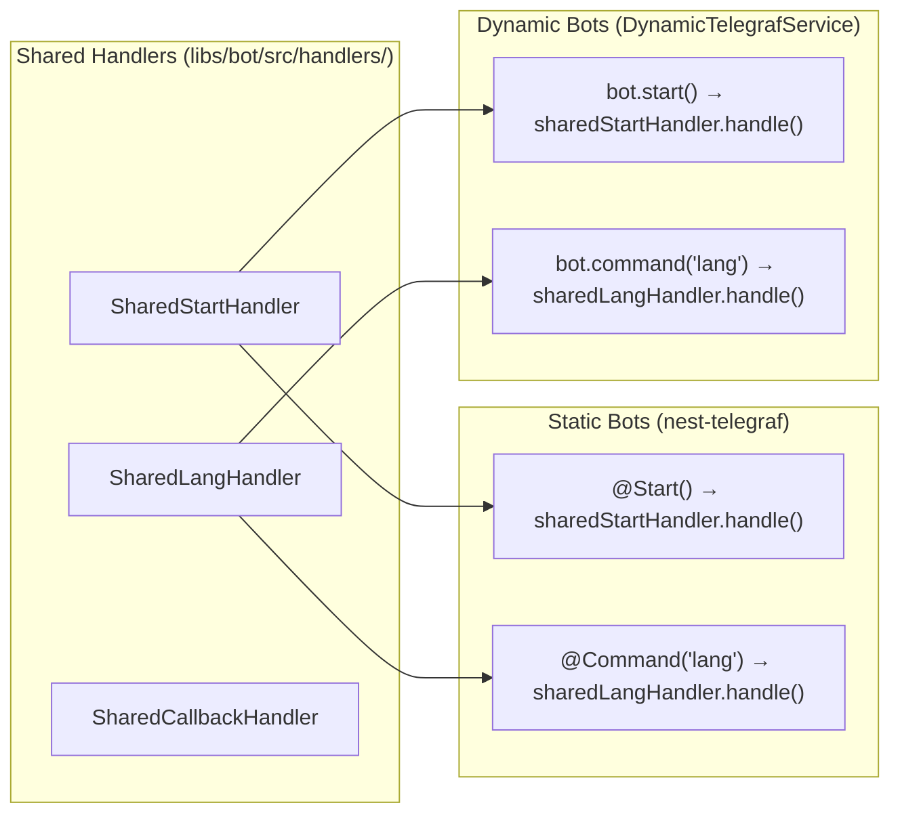
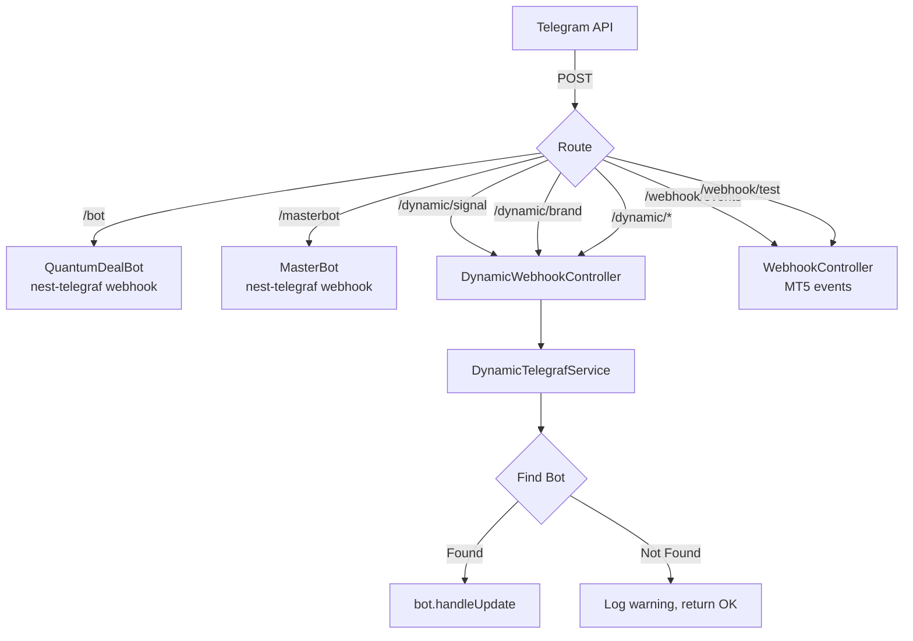
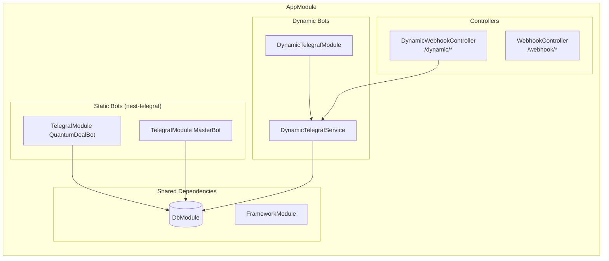
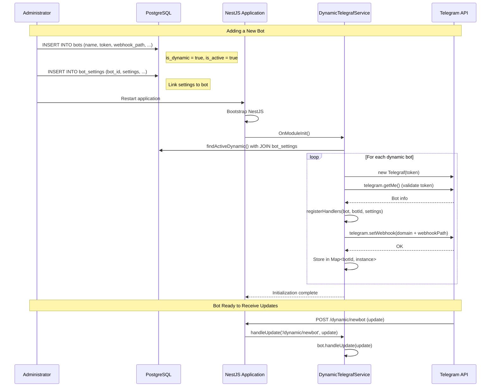

# Design Document: Dynamic Telegram Bot Loader Module

## Document Information

| Attribute | Value |
|-----------|-------|
| **Feature** | Dynamic Telegram Bot Loader Module |
| **Status** | Draft |
| **Created** | 2025-11-26 |
| **Last Updated** | 2025-11-26 |
| **Author** | Claude Code Design Agent |
| **Version** | 1.1.0 |

---

## Agreement Checklist

Agreements with user before design:

- [x] **Scope**: Create module to load bot configurations from database, create Telegraf instances dynamically, set up webhooks - NO code changes needed to add new bots
- [x] **Non-scope**: Static bots (QuantumDealBot, MasterBot) remain unchanged using existing `TelegrafModule.forRootAsync()`
- [x] **Constraints**: Must coexist with existing nest-telegraf static bots in same app
- [x] **Framework**: Use Telegraf.js (NOT Grammy) per ADR-005 decision
- [x] **Tech Stack**: NestJS, Telegraf.js, nestjs-telegraf, Drizzle ORM, PostgreSQL
- [x] **Restart Requirement**: New bots require app restart after DB INSERT (no hot-reload for MVP)
- [x] **Handler Sharing**: Dynamic bots reuse business logic from existing handlers via composition
- [x] **Schema Design**: Use separate `bot_settings` table (NOT embedded JSONB in bots table)

### Agreement Reflection in Design

| Agreement | Reflected In Section |
|-----------|---------------------|
| Database-driven configuration | [Database Schema](#1-database-schema-bots-and-bot_settings-tables) |
| No code changes for new bots | [Bot Registration Flow](#7-bot-registration-flow) |
| Coexistence with static bots | [Integration with Existing System](#6-integration-with-existing-system) |
| Shared handler architecture | [Shared Handlers Architecture](#4-shared-handlers-architecture) |
| Restart-based loading | [DynamicTelegrafModule](#3-dynamictelegrafmodule) OnModuleInit |
| Separate bot_settings table | [Database Schema](#1-database-schema-bots-and-bot_settings-tables) |

---

## Prerequisite ADRs

| ADR | Title | Relevance |
|-----|-------|-----------|
| [ADR-004](../adr/ADR-004-multi-bot-architecture.md) v1.3.0 | Multi-Bot Database Architecture | Defines Decision 6: Dynamic Bot Registration (Hybrid approach) |
| [ADR-005](../adr/ADR-005-telegram-bot-framework.md) | Telegram Bot Framework Selection | Confirms Telegraf.js + nest-telegraf as framework |

---

## Prerequisites

### BotsRepository Interface

**Location**: `libs/db/src/repositories/bots.repository.ts`

This interface must be implemented before the DynamicTelegrafService can be used:

```typescript
import { Injectable, Inject } from '@nestjs/common'
import { BaseRepository } from './base.repository'
import { DRIZZLE_CLIENT, DrizzleClient } from '../database.provider'
import { bots, Bot, NewBot, botSettings, BotSettings } from '../schema'
import { eq, and } from 'drizzle-orm'

/**
 * BotsRepository
 *
 * Repository for managing bot configurations in the database.
 * Provides methods for CRUD operations on bots and bot_settings tables.
 */
@Injectable()
export class BotsRepository extends BaseRepository<Bot, NewBot, number> {
  protected table = bots
  protected idColumn = bots.id

  constructor(@Inject(DRIZZLE_CLIENT) db: DrizzleClient) {
    super(db)
  }

  /**
   * Find all bots (both static and dynamic)
   */
  async findAll(): Promise<Bot[]> {
    return this.db.select().from(bots)
  }

  /**
   * Find all active dynamic bots with their settings
   * Used during application startup to load bots
   */
  async findActiveDynamic(): Promise<BotWithSettings[]> {
    const result = await this.db
      .select({
        bot: bots,
        settings: botSettings,
      })
      .from(bots)
      .leftJoin(botSettings, eq(bots.id, botSettings.botId))
      .where(and(eq(bots.isDynamic, true), eq(bots.isActive, true)))

    return result.map((row) => ({
      ...row.bot,
      settings: row.settings?.settings ?? null,
      paymentSettings: row.settings?.paymentSettings ?? null,
    }))
  }

  /**
   * Find a bot by ID with its settings
   */
  async findById(id: number): Promise<Bot | null> {
    const result = await this.db
      .select()
      .from(bots)
      .where(eq(bots.id, id))
      .limit(1)

    return result[0] ?? null
  }

  /**
   * Find a bot by ID with its settings (JOIN)
   */
  async findByIdWithSettings(id: number): Promise<BotWithSettings | null> {
    const result = await this.db
      .select({
        bot: bots,
        settings: botSettings,
      })
      .from(bots)
      .leftJoin(botSettings, eq(bots.id, botSettings.botId))
      .where(eq(bots.id, id))
      .limit(1)

    if (!result[0]) return null

    return {
      ...result[0].bot,
      settings: result[0].settings?.settings ?? null,
      paymentSettings: result[0].settings?.paymentSettings ?? null,
    }
  }

  /**
   * Find a bot by Telegram username
   */
  async findByUsername(username: string): Promise<Bot | null> {
    const result = await this.db
      .select()
      .from(bots)
      .where(eq(bots.username, username))
      .limit(1)

    return result[0] ?? null
  }

  /**
   * Find a bot by webhook path
   */
  async findByWebhookPath(webhookPath: string): Promise<Bot | null> {
    const result = await this.db
      .select()
      .from(bots)
      .where(eq(bots.webhookPath, webhookPath))
      .limit(1)

    return result[0] ?? null
  }

  /**
   * Create a new bot record
   */
  async create(data: NewBot): Promise<Bot> {
    const result = await this.db.insert(bots).values(data).returning()
    return result[0]
  }

  /**
   * Update a bot record
   */
  async update(id: number, data: Partial<NewBot>): Promise<Bot> {
    const result = await this.db
      .update(bots)
      .set({ ...data, updatedAt: new Date() })
      .where(eq(bots.id, id))
      .returning()

    return result[0]
  }
}

/**
 * Combined type for bot with settings loaded via JOIN
 */
export interface BotWithSettings extends Bot {
  settings: BotSettings | null
  paymentSettings: PaymentSettings | null
}
```

### BotSettingsRepository Interface

**Location**: `libs/db/src/repositories/bot-settings.repository.ts`

```typescript
import { Injectable, Inject } from '@nestjs/common'
import { BaseRepository } from './base.repository'
import { DRIZZLE_CLIENT, DrizzleClient } from '../database.provider'
import { botSettings, BotSettingsRecord, NewBotSettingsRecord } from '../schema'
import { eq } from 'drizzle-orm'

/**
 * BotSettingsRepository
 *
 * Repository for managing bot-specific settings.
 * Settings are stored separately from bot records for cleaner separation.
 */
@Injectable()
export class BotSettingsRepository extends BaseRepository<
  BotSettingsRecord,
  NewBotSettingsRecord,
  number
> {
  protected table = botSettings
  protected idColumn = botSettings.id

  constructor(@Inject(DRIZZLE_CLIENT) db: DrizzleClient) {
    super(db)
  }

  /**
   * Find settings by bot ID
   */
  async findByBotId(botId: number): Promise<BotSettingsRecord | null> {
    const result = await this.db
      .select()
      .from(botSettings)
      .where(eq(botSettings.botId, botId))
      .limit(1)

    return result[0] ?? null
  }

  /**
   * Create or update settings for a bot (upsert)
   */
  async upsert(
    botId: number,
    data: { settings?: BotSettings; paymentSettings?: PaymentSettings }
  ): Promise<BotSettingsRecord> {
    const existing = await this.findByBotId(botId)

    if (existing) {
      const result = await this.db
        .update(botSettings)
        .set({ ...data, updatedAt: new Date() })
        .where(eq(botSettings.botId, botId))
        .returning()

      return result[0]
    }

    const result = await this.db
      .insert(botSettings)
      .values({ botId, ...data })
      .returning()

    return result[0]
  }
}
```

---

## Existing Codebase Analysis

### Implementation Path Mapping

| Path | Status | Description |
|------|--------|-------------|
| `libs/db/src/schema/` | Existing | Current schema definitions (no bots table) |
| `libs/db/src/schema/bots.ts` | **New** | Bots table schema |
| `libs/db/src/schema/bot-settings.ts` | **New** | Bot settings table schema |
| `libs/db/src/repositories/bots.repository.ts` | **New** | Bots repository |
| `libs/db/src/repositories/bot-settings.repository.ts` | **New** | Bot settings repository |
| `libs/framework/src/` | Existing | Framework utilities, interceptors, filters |
| `libs/framework/src/dynamic-telegraf/` | **New** | Dynamic bot loader module |
| `libs/bot/src/commands/` | Existing | Static bot handlers (@Update decorators) |
| `libs/bot/src/handlers/` | **New** | Shared handler services for dynamic bots |
| `src/app.module.ts` | Existing | Static TelegrafModule registrations |
| `src/webhook.controller.ts` | Existing | MT5 webhook handler (uses `@Controller('webhook')`) |
| `src/dynamic-webhook.controller.ts` | **New** | Dynamic bot webhook controller |

### Similar Functionality Search Results

**Search for dynamic module loading patterns:**
- `Grep: "OnModuleInit" --type ts` - Found in `ScheduleModule`, no dynamic bot loading
- `Grep: "Telegraf" --type ts` - Found static registrations in `app.module.ts`
- `Grep: "handleUpdate" --type ts` - Not found (confirms new pattern needed)

**Decision**: No similar functionality exists. Proceed with new implementation following ADR-004 Decision 6.

### Existing Handler Patterns

From `libs/bot/src/commands/start/start.update.ts`:
```typescript
@Update()
@UseInterceptors(ResponseTimeInterceptor)
@UseFilters(TelegrafExceptionFilter)
export class StartUpdate {
  constructor(
    @InjectBot('QuantumDealBot') private readonly bot: Telegraf<UserContext>,
    // ... dependencies
  ) {}

  @Start()
  async onStart(@Ctx() ctx: UserContext, ...): Promise<void> {
    // Business logic
  }
}
```

**Key observation**: Business logic is tightly coupled to decorators. Must extract into services for reuse.

---

## Change Impact Map

```yaml
Change Target: Dynamic Bot Loading System

Direct Impact:
  - libs/db/src/schema/bots.ts (new file)
  - libs/db/src/schema/bot-settings.ts (new file)
  - libs/db/src/schema/index.ts (add exports)
  - libs/db/src/repositories/bots.repository.ts (new file)
  - libs/db/src/repositories/bot-settings.repository.ts (new file)
  - libs/db/src/repositories/index.ts (add exports)
  - libs/framework/src/dynamic-telegraf/ (new directory)
  - libs/bot/src/handlers/ (new directory for shared handlers)
  - src/app.module.ts (import DynamicTelegrafModule)
  - src/dynamic-webhook.controller.ts (new file for dynamic bot webhooks)

Indirect Impact:
  - Webhook routing (new /dynamic/:webhookPath route)
  - Bot context (dynamic bots use raw Telegraf context)
  - Session management (shared sessionMiddleware)

No Ripple Effect:
  - Existing static bots (QuantumDealBot, MasterBot)
  - Existing user authentication flow
  - MT5 webhook processing (remains at /webhook/events)
  - Subscription system
  - Payment processing
```

---

## Interface Change Matrix

| Existing Interface | New Interface | Conversion Required | Adapter Required | Compatibility Method |
|-------------------|---------------|---------------------|------------------|---------------------|
| `TelegrafModule.forRootAsync()` | No change | No | No | Static bots unchanged |
| `@InjectBot()` decorator | `DynamicTelegrafService.getBot()` | Yes | Via Service | Dynamic bots use service |
| `UserContext` interface | Reused | No | No | Shared across all bots |
| `WebhookController` | Unchanged | No | No | New controller added separately |

---

## Integration Point Map

```yaml
Integration Point 1:
  Existing Component: src/app.module.ts
  Integration Method: Import DynamicTelegrafModule
  Impact Level: Low (Module addition only)
  Required Test Coverage: Module imports correctly, no conflicts

Integration Point 2:
  Existing Component: src/webhook.controller.ts
  Integration Method: NO CHANGES - add separate DynamicWebhookController
  Impact Level: Low (No modification to existing controller)
  Required Test Coverage: Both controllers route correctly

Integration Point 3:
  Existing Component: libs/db/src/schema/index.ts
  Integration Method: Export new bots and botSettings schemas
  Impact Level: Low (Export addition)
  Required Test Coverage: Schema exports, Drizzle migrations

Integration Point 4:
  Existing Component: libs/db/src/repositories/index.ts
  Integration Method: Export BotsRepository and BotSettingsRepository
  Impact Level: Low (Export addition)
  Required Test Coverage: Repository exports

Integration Point 5:
  Existing Component: libs/bot/src/middleware/user-management.middleware.ts
  Integration Method: Reuse for dynamic bots
  Impact Level: Medium (Must work with raw Telegraf context)
  Required Test Coverage: Middleware registers on dynamic bots

Integration Point 6:
  Existing Component: libs/bot/src/services/ (various)
  Integration Method: Inject into shared handlers
  Impact Level: Low (Existing services reused)
  Required Test Coverage: Services work with dynamic bot context
```

---

## Implementation Approach Decision

**Selected Approach**: **Vertical Slice (Feature-driven)**

### Rationale (Metacognitive Strategy Selection)

**Phase 1 Analysis** - Current State:
- Static bots work perfectly with nest-telegraf
- No dynamic loading capability exists
- Business logic embedded in Update classes with decorators

**Phase 2 Strategy Exploration**:
- **Strangler Pattern**: Not applicable (not replacing, adding alongside)
- **Feature-driven Development**: Add complete dynamic bot feature independently
- **Adapter Pattern**: Bridge dynamic bots to existing handler logic

**Phase 3 Risk Assessment**:
| Risk | Mitigation |
|------|-----------|
| Dynamic bots break static bots | Separate module, no shared state |
| Handler duplication | Extract shared services |
| Webhook routing conflicts | Distinct controller and path prefix `/dynamic/` |

**Phase 4 Constraint Compatibility**:
- [x] NestJS lifecycle hooks available (OnModuleInit, OnModuleDestroy)
- [x] Telegraf.js supports programmatic instance creation
- [x] Drizzle ORM for database queries
- [x] No hot-reload requirement (restart acceptable)

**Verification Method**: Each task delivers testable functionality (L1/L2 verification)

---

## Architecture Overview

```mermaid
flowchart TB
    subgraph "Application Startup"
        A[NestJS Bootstrap] --> B[Static Bots<br/>TelegrafModule.forRootAsync]
        A --> C[DynamicTelegrafModule<br/>OnModuleInit]
        C --> D[Load bots from DB<br/>WITH bot_settings JOIN]
        D --> E[For each bot:<br/>new Telegraf token]
        E --> F[Register shared handlers]
        F --> G[Setup webhook]
    end

    subgraph "Runtime - Static Bots"
        H[POST /bot] --> I[QuantumDealBot<br/>nest-telegraf handlers]
        J[POST /masterbot] --> K[MasterBot<br/>nest-telegraf handlers]
    end

    subgraph "Runtime - Dynamic Bots"
        L[POST /dynamic/:path] --> M[DynamicWebhookController]
        M --> N[DynamicTelegrafService]
        N --> O[Route to Telegraf instance]
        O --> P[Shared handlers]
    end

    subgraph "Runtime - MT5"
        Q[POST /webhook/events] --> R[WebhookController<br/>MT5 events]
    end

    subgraph "Database"
        S[(bots table)]
        T[(bot_settings table)]
        U[Static: isDynamic=false]
        V[Dynamic: isDynamic=true]
        S --> U
        S --> V
        S -.->|1:1| T
    end

    style C fill:#f9f,stroke:#333,stroke-width:2px
    style N fill:#f9f,stroke:#333,stroke-width:2px
```



---

## 1. Database Schema: `bots` and `bot_settings` Tables

### Location
- `libs/db/src/schema/bots.ts`
- `libs/db/src/schema/bot-settings.ts`

### 1.1 Bots Table Schema

```typescript
// libs/db/src/schema/bots.ts

import {
  pgTable,
  bigserial,
  varchar,
  boolean,
  timestamp,
} from 'drizzle-orm/pg-core'

/**
 * Bots table schema
 *
 * Stores configuration for all Telegram bots (both static and dynamic).
 * Static bots (isDynamic=false) are registered via TelegrafModule.forRootAsync().
 * Dynamic bots (isDynamic=true) are loaded by DynamicTelegrafModule on startup.
 *
 * Note on bigserial with mode: 'number':
 * Drizzle's bigserial with { mode: 'number' } converts PostgreSQL BIGINT to JavaScript number.
 * This is safe for IDs up to Number.MAX_SAFE_INTEGER (9,007,199,254,740,991).
 * For typical bot counts (<1000), this is more than sufficient.
 */
export const bots = pgTable('bots', {
  /** Primary key - auto-incrementing bigint converted to JS number */
  id: bigserial('id', { mode: 'number' }).primaryKey(),

  /** Unique bot name for identification (e.g., 'SignalBot', 'BrandBot') */
  name: varchar('name', { length: 100 }).notNull().unique(),

  /** Telegram bot token from BotFather (plain text per ADR-004 Decision 4) */
  token: varchar('token', { length: 100 }).notNull(),

  /** Telegram bot username (without @, e.g., 'QuantumDealBot') */
  username: varchar('username', { length: 100 }),

  /** Webhook path (unique, e.g., '/dynamic/signal', '/dynamic/brand') */
  webhookPath: varchar('webhook_path', { length: 100 }).notNull().unique(),

  /** Whether this bot is managed by DynamicTelegrafModule (true) or nest-telegraf (false) */
  isDynamic: boolean('is_dynamic').default(true).notNull(),

  /** Whether the bot is active and should be loaded */
  isActive: boolean('is_active').default(true).notNull(),

  /** Record creation timestamp */
  createdAt: timestamp('created_at', { withTimezone: true }).defaultNow().notNull(),

  /** Last update timestamp */
  updatedAt: timestamp('updated_at', { withTimezone: true }).defaultNow().notNull(),
})

/** Type for selecting a bot record */
export type Bot = typeof bots.$inferSelect

/** Type for inserting a new bot record */
export type NewBot = typeof bots.$inferInsert
```

### 1.2 Bot Settings Table Schema

```typescript
// libs/db/src/schema/bot-settings.ts

import {
  pgTable,
  bigserial,
  bigint,
  jsonb,
  timestamp,
} from 'drizzle-orm/pg-core'
import { bots } from './bots'

/**
 * Bot feature settings interface stored in JSONB
 * Matches BotSettings from PRD v1.2.0
 */
export interface BotSettings {
  features: {
    trialEnabled: boolean
    paymentsEnabled: boolean
    signalsEnabled: boolean
    broadcastEnabled: boolean
  }
  defaults: {
    subscriptionDays: number
    trialDays: number
    language: string
  }
  ui?: {
    welcomeImage?: string
    brandColor?: string
  }
}

/**
 * Payment-specific settings for bots that support payments
 */
export interface PaymentSettings {
  providers: {
    stripe?: {
      enabled: boolean
      webhookSecret?: string
    }
    cryptomus?: {
      enabled: boolean
      merchantId?: string
    }
  }
  currency: string
  minAmount?: number
  maxAmount?: number
}

/**
 * Bot settings table schema
 *
 * Stores bot-specific settings in a separate table for cleaner separation.
 * One-to-one relationship with bots table via botId.
 *
 * Note on bigint with mode: 'number':
 * Similar to bots.id, the foreign key uses { mode: 'number' } for JS interoperability.
 * This ensures consistent number types across the application.
 */
export const botSettings = pgTable('bot_settings', {
  /** Primary key - auto-incrementing bigint converted to JS number */
  id: bigserial('id', { mode: 'number' }).primaryKey(),

  /** Foreign key to bots table (1:1 relationship) */
  botId: bigint('bot_id', { mode: 'number' })
    .notNull()
    .unique()
    .references(() => bots.id, { onDelete: 'cascade' }),

  /** Bot feature and behavior settings */
  settings: jsonb('settings').$type<BotSettings>().notNull().default({}),

  /** Payment-specific settings (nullable for bots without payments) */
  paymentSettings: jsonb('payment_settings').$type<PaymentSettings>(),

  /** Record creation timestamp */
  createdAt: timestamp('created_at', { withTimezone: true }).defaultNow().notNull(),

  /** Last update timestamp */
  updatedAt: timestamp('updated_at', { withTimezone: true }).defaultNow().notNull(),
})

/** Type for selecting a bot_settings record */
export type BotSettingsRecord = typeof botSettings.$inferSelect

/** Type for inserting a new bot_settings record */
export type NewBotSettingsRecord = typeof botSettings.$inferInsert
```

### 1.3 Indexes

```sql
-- Primary key indexes (automatic)
-- Unique index on bots.name (automatic from .unique())
-- Unique index on bots.webhook_path (automatic from .unique())
-- Unique index on bot_settings.bot_id (automatic from .unique())

-- Index for finding active dynamic bots on startup
CREATE INDEX idx_bots_dynamic_active ON bots(is_dynamic, is_active)
  WHERE is_dynamic = true AND is_active = true;
```

### 1.4 Migration SQL

```sql
-- Create bots table
CREATE TABLE IF NOT EXISTS bots (
  id BIGSERIAL PRIMARY KEY,
  name VARCHAR(100) NOT NULL UNIQUE,
  token VARCHAR(100) NOT NULL,
  username VARCHAR(100),
  webhook_path VARCHAR(100) NOT NULL UNIQUE,
  is_dynamic BOOLEAN NOT NULL DEFAULT true,
  is_active BOOLEAN NOT NULL DEFAULT true,
  created_at TIMESTAMP WITH TIME ZONE NOT NULL DEFAULT NOW(),
  updated_at TIMESTAMP WITH TIME ZONE NOT NULL DEFAULT NOW()
);

-- Create bot_settings table
CREATE TABLE IF NOT EXISTS bot_settings (
  id BIGSERIAL PRIMARY KEY,
  bot_id BIGINT NOT NULL UNIQUE REFERENCES bots(id) ON DELETE CASCADE,
  settings JSONB NOT NULL DEFAULT '{}',
  payment_settings JSONB,
  created_at TIMESTAMP WITH TIME ZONE NOT NULL DEFAULT NOW(),
  updated_at TIMESTAMP WITH TIME ZONE NOT NULL DEFAULT NOW()
);

-- Index for efficient dynamic bot loading
CREATE INDEX idx_bots_dynamic_active ON bots(is_dynamic, is_active)
  WHERE is_dynamic = true AND is_active = true;
```

---

## 2. Type Definitions

### Location
`libs/framework/src/dynamic-telegraf/dynamic-telegraf.interfaces.ts`

```typescript
// libs/framework/src/dynamic-telegraf/dynamic-telegraf.interfaces.ts

import { Telegraf, Context } from 'telegraf'
import { BotSettings, PaymentSettings } from '@quantumdeal/db'

/**
 * Represents a running dynamic bot instance
 */
export interface DynamicBotInstance {
  /** Database record ID */
  botId: number
  /** Bot name for logging */
  name: string
  /** Telegraf bot instance */
  bot: Telegraf<Context>
  /** Configured webhook path */
  webhookPath: string
  /** Bot settings from database (loaded via JOIN) */
  settings: BotSettings | null
  /** Payment settings from database (loaded via JOIN) */
  paymentSettings: PaymentSettings | null
}

/**
 * Options for creating a dynamic bot
 */
export interface CreateDynamicBotOptions {
  id: number
  name: string
  token: string
  username: string | null
  webhookPath: string
  settings: BotSettings | null
  paymentSettings: PaymentSettings | null
}

/**
 * Result of bot initialization
 */
export interface BotInitResult {
  success: boolean
  botId: number
  name: string
  error?: string
}
```

---

## 3. DynamicTelegrafModule

### Location
`libs/framework/src/dynamic-telegraf/`

### File Structure

```
libs/framework/src/dynamic-telegraf/
├── dynamic-telegraf.module.ts       # NestJS module definition
├── dynamic-telegraf.service.ts      # Bot management service
├── dynamic-telegraf.interfaces.ts   # TypeScript interfaces
├── dynamic-telegraf.constants.ts    # DI tokens and constants
└── index.ts                         # Barrel exports
```

### 3.1 Constants

```typescript
// libs/framework/src/dynamic-telegraf/dynamic-telegraf.constants.ts

/** Injection token for the bots repository */
export const BOTS_REPOSITORY = 'BOTS_REPOSITORY'

/** Prefix for dynamic bot webhook paths */
export const DYNAMIC_WEBHOOK_PREFIX = '/dynamic'
```

### 3.2 Service Implementation

```typescript
// libs/framework/src/dynamic-telegraf/dynamic-telegraf.service.ts

import {
  Injectable,
  Logger,
  OnModuleInit,
  OnApplicationShutdown,
} from '@nestjs/common'
import { ConfigService } from '@nestjs/config'
import { Telegraf, Context } from 'telegraf'
import { Update } from 'telegraf/types'
import { BotsRepository, BotWithSettings } from '@quantumdeal/db'
import {
  DynamicBotInstance,
  CreateDynamicBotOptions,
  BotInitResult,
} from './dynamic-telegraf.interfaces'
import { DYNAMIC_WEBHOOK_PREFIX } from './dynamic-telegraf.constants'
import { SharedStartHandler } from '@quantumdeal/bot/handlers'
import { SharedLangHandler } from '@quantumdeal/bot/handlers'
import { SharedCallbackHandler } from '@quantumdeal/bot/handlers'

/**
 * DynamicTelegrafService
 *
 * Manages dynamically loaded Telegram bots from database.
 * Loads bot configurations on application startup (OnModuleInit),
 * creates Telegraf instances, registers handlers, and sets up webhooks.
 *
 * Key responsibilities:
 * - Load active dynamic bots from database on startup (with settings via JOIN)
 * - Create and configure Telegraf instances
 * - Register shared handlers for each bot
 * - Set up webhooks with Telegram API
 * - Route incoming updates to correct bot instance
 * - Graceful shutdown (delete webhooks, stop bots)
 */
@Injectable()
export class DynamicTelegrafService
  implements OnModuleInit, OnApplicationShutdown
{
  private readonly logger = new Logger(DynamicTelegrafService.name)

  /** Map of botId -> DynamicBotInstance */
  private readonly bots = new Map<number, DynamicBotInstance>()

  /** Map of webhookPath -> botId for fast routing */
  private readonly webhookPathIndex = new Map<string, number>()

  constructor(
    private readonly botsRepository: BotsRepository,
    private readonly configService: ConfigService,
    private readonly sharedStartHandler: SharedStartHandler,
    private readonly sharedLangHandler: SharedLangHandler,
    private readonly sharedCallbackHandler: SharedCallbackHandler,
  ) {}

  /**
   * Initialize all dynamic bots on application startup
   */
  async onModuleInit(): Promise<void> {
    this.logger.log('Initializing dynamic bots...')

    try {
      const results = await this.loadDynamicBots()

      const successful = results.filter((r) => r.success)
      const failed = results.filter((r) => !r.success)

      this.logger.log(
        `Dynamic bots initialized: ${successful.length} success, ${failed.length} failed`
      )

      if (failed.length > 0) {
        for (const f of failed) {
          this.logger.error(`Failed to start bot ${f.name}: ${f.error}`)
        }
      }
    } catch (error) {
      this.logger.error('Critical error during dynamic bot initialization', error)
      // Don't throw - allow app to start with static bots only
    }
  }

  /**
   * Graceful shutdown - stop all bots and delete webhooks
   */
  async onApplicationShutdown(signal?: string): Promise<void> {
    this.logger.log(`Application shutting down (${signal}), stopping dynamic bots...`)

    const stopPromises: Promise<void>[] = []

    for (const [botId, instance] of this.bots) {
      stopPromises.push(this.stopBot(botId, instance))
    }

    await Promise.allSettled(stopPromises)

    this.bots.clear()
    this.webhookPathIndex.clear()

    this.logger.log('All dynamic bots stopped')
  }

  /**
   * Load all active dynamic bots from database (with settings via JOIN)
   */
  private async loadDynamicBots(): Promise<BotInitResult[]> {
    // Uses findActiveDynamic which performs JOIN with bot_settings table
    const dynamicBots = await this.botsRepository.findActiveDynamic()

    const results: BotInitResult[] = []

    for (const botRecord of dynamicBots) {
      const result = await this.createAndStartBot({
        id: botRecord.id,
        name: botRecord.name,
        token: botRecord.token,
        username: botRecord.username,
        webhookPath: botRecord.webhookPath,
        settings: botRecord.settings,
        paymentSettings: botRecord.paymentSettings,
      })

      results.push(result)
    }

    return results
  }

  /**
   * Create a new Telegraf instance and start the bot
   */
  private async createAndStartBot(
    options: CreateDynamicBotOptions
  ): Promise<BotInitResult> {
    const { id, name, token, username, webhookPath, settings, paymentSettings } = options

    try {
      // Create Telegraf instance
      const bot = new Telegraf<Context>(token)

      // Validate token by getting bot info
      const botInfo = await bot.telegram.getMe()
      if (username && botInfo.username !== username) {
        this.logger.warn(
          `Bot ${name}: username mismatch - DB: ${username}, Telegram: ${botInfo.username}`
        )
      }

      // Register shared handlers with bot context
      this.registerHandlers(bot, id, settings, paymentSettings)

      // Setup webhook
      await this.setupWebhook(bot, webhookPath)

      // Store bot instance
      const instance: DynamicBotInstance = {
        botId: id,
        name,
        bot,
        webhookPath,
        settings,
        paymentSettings,
      }

      this.bots.set(id, instance)
      this.webhookPathIndex.set(webhookPath, id)

      this.logger.log(`Dynamic bot started: ${name} (${botInfo.username})`)

      return { success: true, botId: id, name }
    } catch (error) {
      const errorMessage = error instanceof Error ? error.message : String(error)
      return { success: false, botId: id, name, error: errorMessage }
    }
  }

  /**
   * Register shared handlers on a bot instance
   *
   * These handlers reuse business logic from libs/bot/src/handlers/
   * while allowing dynamic bots to receive updates without nest-telegraf decorators.
   */
  private registerHandlers(
    bot: Telegraf<Context>,
    botId: number,
    settings: BotSettings | null,
    paymentSettings: PaymentSettings | null
  ): void {
    // /start command - delegate to shared handler
    bot.start(async (ctx) => {
      try {
        await this.sharedStartHandler.handle(ctx, botId)
      } catch (error) {
        this.logger.error(`Error in /start for bot ${botId}:`, error)
        await ctx.reply('An error occurred. Please try again.')
      }
    })

    // /lang command - delegate to shared handler
    bot.command('lang', async (ctx) => {
      try {
        await this.sharedLangHandler.handle(ctx, botId)
      } catch (error) {
        this.logger.error(`Error in /lang for bot ${botId}:`, error)
        await ctx.reply('An error occurred. Please try again.')
      }
    })

    // /help command
    bot.help(async (ctx) => {
      const helpMessage = settings?.defaults?.language === 'ru'
        ? 'Доступные команды: /start, /lang, /help'
        : 'Available commands: /start, /lang, /help'
      await ctx.reply(helpMessage)
    })

    // Callback query handler - delegate to shared handler
    bot.on('callback_query', async (ctx) => {
      try {
        await this.sharedCallbackHandler.handle(ctx, botId, settings)
      } catch (error) {
        this.logger.error(`Error in callback_query for bot ${botId}:`, error)
        await ctx.answerCbQuery('An error occurred')
      }
    })

    // Global error handler for this bot
    bot.catch((err, ctx) => {
      this.logger.error(`Error in bot ${botId}: ${err.message}`, err.stack)
    })

    this.logger.debug(`Handlers registered for bot ${botId}`)
  }

  /**
   * Setup webhook for a bot
   */
  private async setupWebhook(
    bot: Telegraf<Context>,
    webhookPath: string
  ): Promise<void> {
    const webhookDomain = this.configService.getOrThrow<string>(
      'TELEGRAM_BOT_WEBHOOK_DOMAIN'
    )

    // Construct full webhook URL
    // webhookPath already includes /dynamic/ prefix from database
    const webhookUrl = `${webhookDomain}${webhookPath}`

    await bot.telegram.setWebhook(webhookUrl, {
      allowed_updates: ['message', 'callback_query', 'inline_query'],
    })

    this.logger.debug(`Webhook set for ${webhookPath}: ${webhookUrl}`)
  }

  /**
   * Stop a single bot
   */
  private async stopBot(
    botId: number,
    instance: DynamicBotInstance
  ): Promise<void> {
    try {
      await instance.bot.telegram.deleteWebhook()
      this.logger.log(`Stopped bot: ${instance.name}`)
    } catch (error) {
      this.logger.error(`Error stopping bot ${instance.name}:`, error)
    }
  }

  /**
   * Handle incoming webhook update
   *
   * Called by DynamicWebhookController to route updates to correct bot.
   *
   * @param webhookPath - The path from the request (e.g., '/dynamic/signal')
   * @param update - The Telegram update object
   * @returns true if handled, false if no bot found for path
   */
  async handleUpdate(webhookPath: string, update: Update): Promise<boolean> {
    const botId = this.webhookPathIndex.get(webhookPath)

    if (botId === undefined) {
      this.logger.warn(`No bot found for webhook path: ${webhookPath}`)
      return false
    }

    const instance = this.bots.get(botId)

    if (!instance) {
      this.logger.error(`Bot ${botId} found in index but not in bots map`)
      return false
    }

    try {
      await instance.bot.handleUpdate(update)
      return true
    } catch (error) {
      this.logger.error(`Error handling update for bot ${instance.name}:`, error)
      return false
    }
  }

  /**
   * Get a bot instance by ID
   */
  getBot(botId: number): Telegraf<Context> | undefined {
    return this.bots.get(botId)?.bot
  }

  /**
   * Get a bot instance by webhook path
   */
  getBotByWebhookPath(webhookPath: string): Telegraf<Context> | undefined {
    const botId = this.webhookPathIndex.get(webhookPath)
    if (botId === undefined) return undefined
    return this.bots.get(botId)?.bot
  }

  /**
   * Get all running dynamic bot instances
   */
  getAllBots(): Map<number, DynamicBotInstance> {
    return new Map(this.bots)
  }

  /**
   * Get count of running dynamic bots
   */
  getBotCount(): number {
    return this.bots.size
  }
}
```

### 3.3 Module Definition

```typescript
// libs/framework/src/dynamic-telegraf/dynamic-telegraf.module.ts

import { Global, Module } from '@nestjs/common'
import { ConfigModule } from '@nestjs/config'
import { DbModule } from '@quantumdeal/db'
import { DynamicTelegrafService } from './dynamic-telegraf.service'
import { SharedHandlersModule } from '@quantumdeal/bot/handlers'

/**
 * DynamicTelegrafModule
 *
 * Global module that provides dynamic bot loading capabilities.
 * Loads bot configurations from database on application startup
 * and creates Telegraf instances for each active dynamic bot.
 *
 * Usage:
 * 1. Import this module in AppModule
 * 2. Add bot records to 'bots' table with is_dynamic = true
 * 3. Add settings to 'bot_settings' table
 * 4. Restart application
 * 5. Bots automatically loaded and webhooks configured
 */
@Global()
@Module({
  imports: [ConfigModule, DbModule, SharedHandlersModule],
  providers: [DynamicTelegrafService],
  exports: [DynamicTelegrafService],
})
export class DynamicTelegrafModule {}
```

### 3.4 Barrel Exports

```typescript
// libs/framework/src/dynamic-telegraf/index.ts

export * from './dynamic-telegraf.module'
export * from './dynamic-telegraf.service'
export * from './dynamic-telegraf.interfaces'
export * from './dynamic-telegraf.constants'
```

---

## 4. Shared Handlers Architecture

### Problem

Existing handlers use `@Update()`, `@Start()`, `@InjectBot()` decorators from nest-telegraf.
Dynamic bots cannot use these decorators - they need function-based registration.

### Solution

Extract business logic into standalone services that can be:
1. Called from nest-telegraf decorated handlers (static bots)
2. Registered directly on Telegraf instances (dynamic bots)

### Location
`libs/bot/src/handlers/`

### 4.1 Shared Start Handler

```typescript
// libs/bot/src/handlers/shared-start.handler.ts

import { Injectable, Logger } from '@nestjs/common'
import { Context } from 'telegraf'
import {
  UsersRepository,
  BotsRepository,
  UserSubscriptionsRepository,
  BotSettings,
} from '@quantumdeal/db'

/**
 * SharedStartHandler
 *
 * Handles /start command business logic for both static and dynamic bots.
 * Extracted from StartUpdate to enable reuse without nest-telegraf decorators.
 */
@Injectable()
export class SharedStartHandler {
  private readonly logger = new Logger(SharedStartHandler.name)

  constructor(
    private readonly usersRepository: UsersRepository,
    private readonly botsRepository: BotsRepository,
    private readonly userSubscriptionsRepository: UserSubscriptionsRepository,
  ) {}

  /**
   * Handle /start command
   *
   * @param ctx - Telegraf context (works with any context type)
   * @param botId - Database bot ID for bot-specific behavior
   * @param args - Optional deep link arguments
   */
  async handle(
    ctx: Context,
    botId: number,
    args?: string
  ): Promise<void> {
    const telegramId = ctx.from?.id
    if (!telegramId) {
      this.logger.warn('No user in context')
      return
    }

    try {
      // Find or create user
      let user = await this.usersRepository.findByTelegramId(telegramId)
      if (!user) {
        user = await this.usersRepository.create({
          telegramId,
          username: ctx.from.username ?? null,
          firstName: ctx.from.first_name ?? null,
          lastName: ctx.from.last_name ?? null,
          isActive: true,
          lang: ctx.from.language_code ?? 'en',
          isPremium: ctx.from.is_premium ?? false,
        })
      }

      // Get bot settings (via JOIN in repository)
      const botWithSettings = await this.botsRepository.findByIdWithSettings(botId)
      const settings = botWithSettings?.settings

      // Generate welcome message
      const welcomeMessage = this.generateWelcome(user, settings)

      await ctx.reply(welcomeMessage)

      // Handle activation code if provided
      if (args) {
        await this.handleActivationCode(ctx, user.telegramId, botId, args)
      }
    } catch (error) {
      this.logger.error(`Error in /start for user ${telegramId}:`, error)
      throw error // Let caller handle error response
    }
  }

  private generateWelcome(
    user: { firstName: string | null; lang: string | null },
    settings: BotSettings | null | undefined
  ): string {
    const name = user.firstName ?? 'there'
    const lang = user.lang ?? 'en'

    if (settings?.features?.trialEnabled) {
      return lang === 'ru'
        ? `Привет, ${name}! Добро пожаловать. Вам доступен бесплатный пробный период.`
        : `Hello, ${name}! Welcome. A free trial is available for you.`
    }

    return lang === 'ru'
      ? `Привет, ${name}! Добро пожаловать.`
      : `Hello, ${name}! Welcome.`
  }

  private async handleActivationCode(
    ctx: Context,
    userId: number,
    botId: number,
    code: string
  ): Promise<void> {
    // TODO: Implement code activation logic
    // Similar to StartUpdate.activateCode but with botId context
    this.logger.log(`Activation code received: ${code} for bot ${botId}`)
  }
}
```

### 4.2 Shared Lang Handler

```typescript
// libs/bot/src/handlers/shared-lang.handler.ts

import { Injectable, Logger } from '@nestjs/common'
import { Context } from 'telegraf'
import { UsersRepository } from '@quantumdeal/db'
import { Markup } from 'telegraf'

/**
 * SharedLangHandler
 *
 * Handles /lang command for language selection.
 */
@Injectable()
export class SharedLangHandler {
  private readonly logger = new Logger(SharedLangHandler.name)

  constructor(private readonly usersRepository: UsersRepository) {}

  async handle(ctx: Context, botId: number): Promise<void> {
    const keyboard = Markup.inlineKeyboard([
      [
        Markup.button.callback('English', `lang:en:${botId}`),
        Markup.button.callback('Русский', `lang:ru:${botId}`),
      ],
    ])

    await ctx.reply('Select your language / Выберите язык:', keyboard)
  }
}
```

### 4.3 Shared Callback Handler

```typescript
// libs/bot/src/handlers/shared-callback.handler.ts

import { Injectable, Logger } from '@nestjs/common'
import { Context } from 'telegraf'
import { UsersRepository, BotSettings } from '@quantumdeal/db'

/**
 * SharedCallbackHandler
 *
 * Routes callback queries to appropriate handlers based on callback_data pattern.
 */
@Injectable()
export class SharedCallbackHandler {
  private readonly logger = new Logger(SharedCallbackHandler.name)

  constructor(private readonly usersRepository: UsersRepository) {}

  async handle(
    ctx: Context,
    botId: number,
    settings: BotSettings | null
  ): Promise<void> {
    if (!ctx.callbackQuery || !('data' in ctx.callbackQuery)) {
      await ctx.answerCbQuery('Invalid callback')
      return
    }

    const data = ctx.callbackQuery.data
    const [action, ...params] = data.split(':')

    try {
      switch (action) {
        case 'lang':
          await this.handleLanguageChange(ctx, params[0])
          break
        // Add more callback handlers as needed
        default:
          this.logger.warn(`Unknown callback action: ${action}`)
          await ctx.answerCbQuery('Unknown action')
      }
    } catch (error) {
      this.logger.error(`Error handling callback ${action}:`, error)
      throw error
    }
  }

  private async handleLanguageChange(ctx: Context, lang: string): Promise<void> {
    const telegramId = ctx.from?.id
    if (!telegramId) return

    await this.usersRepository.update(telegramId, { lang })

    const message = lang === 'ru'
      ? 'Язык изменен на русский'
      : 'Language changed to English'

    await ctx.answerCbQuery(message)
    await ctx.editMessageText(message)
  }
}
```

### 4.4 Shared Handlers Module

```typescript
// libs/bot/src/handlers/shared-handlers.module.ts

import { Module } from '@nestjs/common'
import { DbModule } from '@quantumdeal/db'
import { SharedStartHandler } from './shared-start.handler'
import { SharedLangHandler } from './shared-lang.handler'
import { SharedCallbackHandler } from './shared-callback.handler'

@Module({
  imports: [DbModule],
  providers: [
    SharedStartHandler,
    SharedLangHandler,
    SharedCallbackHandler,
  ],
  exports: [
    SharedStartHandler,
    SharedLangHandler,
    SharedCallbackHandler,
  ],
})
export class SharedHandlersModule {}
```

### 4.5 Handler Registration Diagram



---

## 5. Webhook Controller Extension

### Design Decision

The existing `WebhookController` uses `@Controller('webhook')` and handles MT5 events at `/webhook/events`.

**Approach**: Create a **separate** `DynamicWebhookController` instead of modifying the existing controller.

**Rationale**:
1. Maintains separation of concerns (MT5 vs Telegram bots)
2. No risk of breaking existing MT5 webhook functionality
3. Clear routing: `/webhook/*` for MT5, `/dynamic/*` for bots

### Location
`src/dynamic-webhook.controller.ts`

### Implementation

```typescript
// src/dynamic-webhook.controller.ts

import {
  Controller,
  Post,
  Body,
  Param,
  HttpCode,
  HttpStatus,
  Logger,
} from '@nestjs/common'
import { Update } from 'telegraf/types'
import { DynamicTelegrafService } from '@quantumdeal/framework'
import { DYNAMIC_WEBHOOK_PREFIX } from '@quantumdeal/framework/dynamic-telegraf'

/**
 * DynamicWebhookController
 *
 * Handles webhook requests for dynamically loaded Telegram bots.
 * Routes updates to the correct bot instance based on webhook path.
 *
 * IMPORTANT: This is a separate controller from WebhookController.
 * - WebhookController: Handles MT5 events at /webhook/*
 * - DynamicWebhookController: Handles Telegram bot updates at /dynamic/*
 */
@Controller('dynamic')
export class DynamicWebhookController {
  private readonly logger = new Logger(DynamicWebhookController.name)

  constructor(
    private readonly dynamicTelegrafService: DynamicTelegrafService,
  ) {}

  /**
   * Dynamic bot webhook endpoint
   *
   * Receives Telegram updates for dynamically loaded bots.
   * Routes to correct bot instance based on webhook path.
   *
   * @param webhookPath - Path segment from URL (e.g., 'signal' for /dynamic/signal)
   * @param update - Telegram update object
   */
  @Post(':webhookPath')
  @HttpCode(HttpStatus.OK)
  async handleDynamicBotWebhook(
    @Param('webhookPath') webhookPath: string,
    @Body() update: Update,
  ): Promise<{ ok: boolean }> {
    const fullPath = `${DYNAMIC_WEBHOOK_PREFIX}/${webhookPath}`

    this.logger.debug(
      `Dynamic webhook received for ${fullPath}, update_id: ${update.update_id}`
    )

    const handled = await this.dynamicTelegrafService.handleUpdate(fullPath, update)

    if (!handled) {
      this.logger.warn(`No bot found for webhook path: ${fullPath}`)
      // Return OK to Telegram to prevent retries
      // Bot not found is not a transient error
    }

    return { ok: true }
  }
}
```

### Webhook Route Diagram



---

## 6. Integration with Existing System

### AppModule Update

```typescript
// src/app.module.ts (updated)

import { DynamicTelegrafModule } from '@quantumdeal/framework'
import { DynamicWebhookController } from './dynamic-webhook.controller'

@Module({
  imports: [
    ConfigModule.forRoot({ isGlobal: true, envFilePath: '.env' }),
    ScheduleModule.forRoot(),
    SentryModule,

    // Database and framework
    DbModule,
    FrameworkModule,

    // Dynamic bot loader (NEW)
    DynamicTelegrafModule,

    // Static bots (unchanged)
    BotModule,
    MasterbotModule,

    // Static bot registrations (unchanged)
    TelegrafModule.forRootAsync({
      botName: BotName,
      // ... existing configuration
    }),

    TelegrafModule.forRootAsync({
      botName: 'QuantumDealMasterBot',
      // ... existing configuration
    }),
  ],
  controllers: [
    WebhookController,          // Existing - MT5 events
    DynamicWebhookController,   // NEW - Dynamic bot webhooks
  ],
  providers: [WebhookService, OrdersRepository],
})
export class AppModule {}
```

### Coexistence Architecture



### Key Coexistence Points

1. **Separate Webhook Paths**: Static bots use `/bot`, `/masterbot`. Dynamic bots use `/dynamic/*`. MT5 uses `/webhook/*`.

2. **Shared Database**: Both use same `DbModule` and repositories.

3. **Shared Middleware**: Session middleware can be reused (requires extraction to shared location).

4. **Independent Lifecycle**: Static bots managed by nest-telegraf, dynamic bots by `DynamicTelegrafService`.

5. **No Conflicts**: Module boundaries and distinct controllers ensure no interference.

---

## 7. Bot Registration Flow

### Sequence Diagram



### SQL Example: Adding a New Bot

```sql
-- Step 1: Insert bot record
INSERT INTO bots (
  name,
  token,
  username,
  webhook_path,
  is_dynamic,
  is_active
) VALUES (
  'BrandSignalBot',
  '7123456789:AAHdqTcvKxxxxxxxxxxxxxxxxxxxxx', -- Get from @BotFather
  'BrandSignalBot',
  '/dynamic/brandsignal',
  true,
  true
) RETURNING id;

-- Step 2: Insert bot settings (using returned bot id, e.g., 5)
INSERT INTO bot_settings (
  bot_id,
  settings,
  payment_settings
) VALUES (
  5,  -- Replace with actual bot ID from Step 1
  '{
    "features": {
      "trialEnabled": true,
      "paymentsEnabled": true,
      "signalsEnabled": true,
      "broadcastEnabled": false
    },
    "defaults": {
      "subscriptionDays": 30,
      "trialDays": 7,
      "language": "en"
    }
  }'::jsonb,
  '{
    "providers": {
      "stripe": { "enabled": true }
    },
    "currency": "USD"
  }'::jsonb
);

-- Step 3: Verify insertion
SELECT b.id, b.name, b.username, b.webhook_path, b.is_active,
       s.settings, s.payment_settings
FROM bots b
LEFT JOIN bot_settings s ON b.id = s.bot_id
WHERE b.is_dynamic = true;

-- Step 4: Restart application
-- pm2 restart quantum-deal
-- OR
-- docker-compose restart app
```

### E2E Test Token Guidance

For E2E testing with real Telegram bots:

1. **Create a test bot** via [@BotFather](https://t.me/BotFather):
   - Send `/newbot` to BotFather
   - Provide a name (e.g., "My Test Bot")
   - Provide a username (must end with "bot", e.g., "mytestbot_dev_bot")
   - BotFather returns the token: `7123456789:AAHdqTcvKxxxxxxxxxxxxxxxxxxxxx`

2. **Store the token securely**:
   - Never commit real tokens to version control
   - Use environment variables for CI/CD
   - For local testing, use `.env.test.local` (gitignored)

3. **Configure webhook domain**:
   - Local: Use ngrok or similar (`ngrok http 3000`)
   - CI/CD: Use test environment URL

---

## 8. Data Contracts

### Input: Bot Record from Database (with Settings via JOIN)

```typescript
interface BotWithSettings {
  id: number
  name: string
  token: string
  username: string | null
  webhookPath: string
  isDynamic: boolean
  isActive: boolean
  createdAt: Date
  updatedAt: Date
  // Loaded from bot_settings via JOIN
  settings: BotSettings | null
  paymentSettings: PaymentSettings | null
}
```

### Input: Telegram Update

```typescript
// From telegraf/types
interface Update {
  update_id: number
  message?: Message
  callback_query?: CallbackQuery
  inline_query?: InlineQuery
  // ... other update types
}
```

### Output: Bot Initialization Result

```typescript
interface BotInitResult {
  success: boolean
  botId: number
  name: string
  error?: string
}
```

### Error Behavior

| Error Condition | Behavior |
|-----------------|----------|
| Invalid token | Log error, skip bot, continue with others |
| Webhook setup failure | Log error, skip bot, continue with others |
| No bots in database | Log info, module ready with 0 bots |
| Database connection failure | Log error, throw exception (app fails to start) |
| Update handling error | Log error, return OK to Telegram (prevent retries) |

---

## 9. Acceptance Criteria

### AC-1: Database Schema

| Criterion | Verification Method |
|-----------|---------------------|
| `bots` table created with all required columns | L2: Migration runs without errors |
| `bot_settings` table created with foreign key | L2: Migration runs without errors |
| Indexes created for query optimization | L3: Index exists in schema |
| TypeScript types exported correctly | L3: Build succeeds |

### AC-2: DynamicTelegrafModule

| Criterion | Verification Method |
|-----------|---------------------|
| Module imports without errors | L3: Application starts |
| OnModuleInit loads bots from database with settings (JOIN) | L2: Unit test with mock repository |
| Telegraf instances created for each active bot | L2: Unit test verifies Map size |
| Webhooks set up with correct URLs | L2: Mock Telegram API call verified |
| OnApplicationShutdown deletes webhooks | L2: Unit test with mock |

### AC-3: Webhook Routing

| Criterion | Verification Method |
|-----------|---------------------|
| `/dynamic/:path` endpoint registered | L1: HTTP request returns 200 |
| Existing `/webhook/*` endpoints unchanged | L1: MT5 events still work |
| Updates routed to correct bot instance | L2: Integration test with mock update |
| Unknown paths handled gracefully | L1: Returns 200, logs warning |

### AC-4: Handler Registration

| Criterion | Verification Method |
|-----------|---------------------|
| /start command responds on dynamic bot | L1: Manual test with Telegram |
| /lang command responds on dynamic bot | L1: Manual test with Telegram |
| /help command responds on dynamic bot | L1: Manual test with Telegram |
| Shared handlers receive bot settings | L2: Unit test verifies settings passed |

### AC-5: Bot Registration Flow

| Criterion | Verification Method |
|-----------|---------------------|
| INSERT bots + INSERT bot_settings + restart = bot operational | L1: E2E test with new bot |
| No code changes required | L1: Verify only SQL + restart needed |
| Existing static bots unaffected | L1: QuantumDealBot still works |

### AC-6: Error Handling

| Criterion | Verification Method |
|-----------|---------------------|
| Invalid token does not crash app | L2: Test with bad token |
| Failed bot does not affect other bots | L2: Test with one bad, one good |
| Graceful shutdown cleans up webhooks | L2: Test shutdown sequence |

---

## 10. E2E Verification Procedures

### Phase 1: Database Schema

1. Run Drizzle migration: `npm run db:migrate`
2. Verify tables exist:
   ```sql
   SELECT * FROM bots LIMIT 1;
   SELECT * FROM bot_settings LIMIT 1;
   ```
3. Verify foreign key: `\d+ bot_settings` (PostgreSQL)
4. Verify indexes: `\d+ bots` (PostgreSQL)

### Phase 2: Module Integration

1. Start application with no dynamic bots in database
2. Verify logs: "Dynamic bots initialized: 0 success, 0 failed"
3. Application should start successfully
4. Verify MT5 webhook still works: `curl -X POST http://localhost:3000/webhook/test`

### Phase 3: Single Dynamic Bot

1. Create test bot via @BotFather and get token
2. Insert bot record:
   ```sql
   INSERT INTO bots (name, token, username, webhook_path, is_dynamic, is_active)
   VALUES ('TestBot', 'YOUR_TOKEN', 'testbot', '/dynamic/test', true, true)
   RETURNING id;
   ```
3. Insert settings:
   ```sql
   INSERT INTO bot_settings (bot_id, settings)
   VALUES (1, '{"features":{"trialEnabled":true}}');
   ```
4. Restart application
5. Verify logs show bot initialization with settings loaded
6. Send /start to bot via Telegram
7. Verify response received

### Phase 4: Multiple Dynamic Bots

1. Insert second bot and settings
2. Restart application
3. Verify both bots receive updates independently
4. Verify webhook paths are distinct

### Phase 5: Coexistence with Static Bots

1. Send /start to QuantumDealBot
2. Verify response (static bot working)
3. Send /start to dynamic bot
4. Verify response (dynamic bot working)
5. Both should work simultaneously
6. Verify MT5 webhook still works

---

## 11. Non-Functional Requirements

### Performance

| Requirement | Target | Measurement |
|-------------|--------|-------------|
| Bot initialization time | < 5 seconds per bot | Log timestamps |
| Update handling latency | < 100ms p95 | Application metrics |
| Memory per bot instance | < 50MB | Process monitoring |

### Reliability

| Requirement | Implementation |
|-------------|----------------|
| Failed bot isolation | Each bot in separate try-catch |
| Graceful degradation | Static bots work if dynamic fails |
| Webhook retry prevention | Always return 200 OK to Telegram |

### Security

| Requirement | Implementation |
|-------------|----------------|
| Token masking in logs | Never log full token |
| Token storage | Plain text in DB (per ADR-004) |
| Webhook validation | Telegram's built-in validation |

### Scalability

| Requirement | Current Limit | Future Enhancement |
|-------------|---------------|-------------------|
| Maximum bots | ~100 (memory-bound) | Pool instances across processes |
| Startup time | Linear with bot count | Parallel initialization |

---

## 12. Future Enhancements

### Hot-Reload (Post-MVP)

Add ability to reload bots without full restart:

```typescript
// Future API
async reloadBot(botId: number): Promise<void> {
  await this.stopBot(botId)
  const botRecord = await this.botsRepository.findByIdWithSettings(botId)
  await this.createAndStartBot(botRecord)
}

// Trigger via admin command or API
@Post('admin/bots/:id/reload')
async reloadBot(@Param('id') id: number) {
  await this.dynamicTelegrafService.reloadBot(id)
}
```

### Database Polling

Poll for new bots periodically:

```typescript
@Cron('*/5 * * * *') // Every 5 minutes
async checkForNewBots(): Promise<void> {
  const dbBots = await this.botsRepository.findActiveDynamic()
  for (const bot of dbBots) {
    if (!this.bots.has(bot.id)) {
      await this.createAndStartBot(bot)
    }
  }
}
```

### Bot Health Monitoring

Track bot health and auto-restart failed bots:

```typescript
interface BotHealthStatus {
  botId: number
  lastUpdate: Date
  errorCount: number
  status: 'healthy' | 'degraded' | 'failed'
}
```

---

## References

- [Multiple bots | NestJS Telegraf](https://nestjs-telegraf.0x467.com/extras/multiple-bots) - nest-telegraf multi-bot patterns
- [nestjs-telegraf npm package](https://www.npmjs.com/package/nestjs-telegraf) - Package documentation
- [Telegraf.js Documentation](https://telegraf.js.org/) - Telegraf API reference
- [GitHub - telegraf/telegraf](https://github.com/telegraf/telegraf) - Telegraf source, handleUpdate usage
- [NestJS Lifecycle Events](https://docs.nestjs.com/fundamentals/lifecycle-events) - OnModuleInit, OnApplicationShutdown
- [Drizzle ORM bigserial documentation](https://orm.drizzle.team/docs/column-types/pg#bigserial) - bigint mode options
- ADR-004 v1.3.0: Multi-Bot Database Architecture (Decision 6: Dynamic Bot Registration)
- ADR-005: Telegram Bot Framework Selection (Telegraf.js + nest-telegraf)
- PRD v1.2.0: Multi-Bot Database Architecture

---

## Change History

| Version | Date | Author | Changes |
|---------|------|--------|---------|
| 1.0.0 | 2025-11-26 | Claude Code Design Agent | Initial design document |
| 1.1.0 | 2025-11-26 | Claude Code Design Agent | ISSUE-001 to ISSUE-007 fixes: Separated bot_settings table, added BotsRepository/BotSettingsRepository interfaces, completed shared handler implementation, clarified WebhookController extension with separate DynamicWebhookController, added bigint/number type clarification, fixed import patterns, added E2E test token guidance |

---

**Document Version**: 1.1.0
**Created**: 2025-11-26
**Last Updated**: 2025-11-26
**Author**: Claude Code Design Agent
