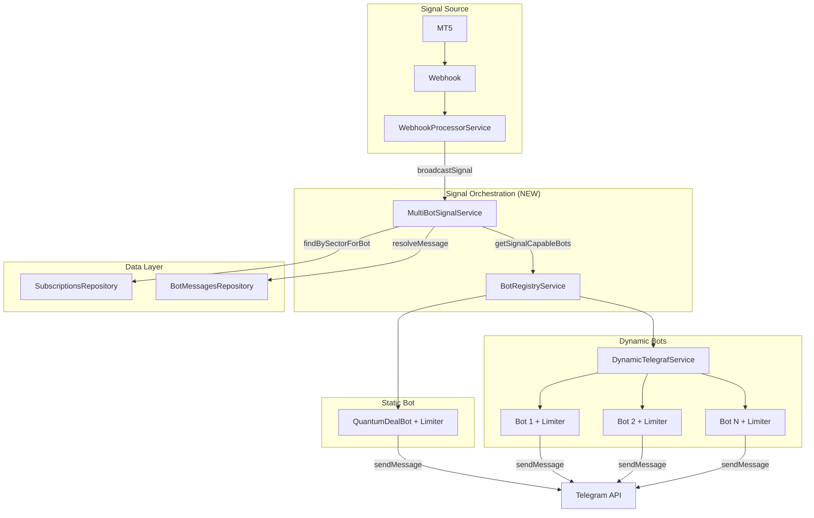

# Multi-Bot Signal Broadcasting Design Document

## Overview

This design document details the implementation of multi-bot signal broadcasting for the Quantum Deal platform. The feature extends the existing single-bot signal delivery system to distribute trading signals across ALL active Telegram bots simultaneously, with per-bot rate limiting, bot-specific message templates, and bot-scoped subscription filtering.

## Background and Context

### Prerequisite ADRs

- **ADR-007-multi-bot-signal-broadcasting.md**: Multi-bot signal broadcasting architecture decisions (Accepted)
  - Decision 1: Per-Bot Bottleneck Instances attached to DynamicBotInstance
  - Decision 2: MultiBotSignalService as orchestrator pattern
  - Decision 3: Per-bot user filtering with `findBySectorForBot()`
  - Decision 4: BotRegistryService facade for unified bot access
- **ADR-004**: Multi-bot database architecture
- **ADR-006**: Dynamic Telegraf module loading pattern

### Agreement Checklist

#### Scope
- [x] Create `MultiBotSignalService` as signal orchestrator
- [x] Create `BotRegistryService` as facade for static + dynamic bots
- [x] Add per-bot Bottleneck rate limiters to `DynamicBotInstance`
- [x] Add `findBySectorForBot()` method to `SubscriptionsRepository`
- [x] Modify `NotificationService` to accept bot instance as parameter
- [x] Modify `WebhookProcessorService` to route through `MultiBotSignalService`

#### Non-Scope (Explicitly not changing)
- [x] Existing `findBySector()` method remains unchanged (backward compatibility)
- [x] Existing `addMessage()` method remains unchanged (backward compatibility)
  - `sendWithBot()` is a NEW method added alongside `addMessage()`, not a replacement
  - No refactoring of existing `addMessage()` call sites required
  - Static bot can continue using `addMessage()` for non-signal messages
- [x] Signal debounce mechanism (handled upstream)
- [x] Custom filtering logic (already implemented, reused as-is)
- [x] BotMessagesRepository.resolveMessage() (already supports botId)
- [x] Cross-bot deduplication (explicitly NOT implemented - users on multiple bots receive from each)

#### Constraints
- [x] Parallel operation: Yes (all bots process independently)
- [x] Backward compatibility: Required (existing single-bot code paths preserved)
- [x] Performance: Signal delivery within 5 seconds of MT5 event
- [x] Rate limiting: 28 msg/sec per bot (Telegram limit is 30, using 28 for safety margin)

### Problem to Solve

The current single-bot architecture cannot distribute MT5 trading signals to multiple branded Telegram bots. Users subscribed to different bots must receive signals through their respective bot instances, not a single shared bot.

### Current Challenges

1. **Single Bot Injection**: `NotificationService` uses `@InjectBot('QuantumDealBot')` - hardcoded to one bot
2. **Single Rate Limiter**: One Bottleneck instance shared across all messages
3. **No Bot Grouping**: `findBySector()` returns users without botId association
4. **No Orchestration**: No layer to coordinate multi-bot parallel delivery

### Requirements

#### Functional Requirements

- **FR-001**: MultiBotSignalService orchestrates signal distribution across all active bots
- **FR-002**: Each bot has its own Bottleneck rate limiter (28 msg/sec)
- **FR-003**: SubscriptionsRepository provides bot-scoped user queries
- **FR-004**: NotificationService accepts bot instance as parameter for per-bot sending
- **FR-005**: Users subscribed to multiple bots receive signals from EACH bot (no dedup)
- **FR-006**: Static bot (QuantumDealBot) included with `botId=null`
- **FR-007**: Bot-specific message templates via BotMessagesRepository.resolveMessage()

#### Non-Functional Requirements

- **Performance**: Signal delivery < 5 seconds from MT5 event to Telegram
- **Scalability**: Support up to 100 dynamic bots per instance
- **Reliability**: Fault isolation - one bot's failure doesn't block others
- **Maintainability**: Clean separation between orchestration and delivery

## Acceptance Criteria (AC)

- [ ] **AC-001**: When a signal event arrives, `MultiBotSignalService.broadcastSignal()` delivers to ALL active bots with `signalsEnabled=true`
- [ ] **AC-002**: Each bot processes its own subscribers independently (parallel Promise.all)
- [ ] **AC-003**: When `findBySectorForBot(sector, botId)` is called, ONLY users subscribed to that specific bot are returned
- [ ] **AC-004**: When `findBySectorForBot(sector, null)` is called, ONLY users with `botId IS NULL` are returned (static bot)
- [ ] **AC-005**: Each dynamic bot instance has its own Bottleneck limiter created at initialization
- [ ] **AC-006**: When one bot's delivery fails, other bots continue processing (fault isolation)
- [ ] **AC-007**: BroadcastResult includes per-bot success/failure counts
- [ ] **AC-008**: Static bot (QuantumDealBot) is included in signal broadcasting when enabled
- [ ] **AC-009**: NotificationService.sendWithBot() uses the provided bot instance and limiter
- [ ] **AC-010**: Signal delivery completes within 5 seconds for all bots combined

## Existing Codebase Analysis

### Implementation Path Mapping

| Type | Path | Description |
|------|------|-------------|
| Existing | `libs/telegraf/src/interfaces/dynamic-telegraf-options.interface.ts` | DynamicBotInstance interface (add `limiter` field) |
| Existing | `libs/telegraf/src/services/dynamic-telegraf.service.ts` | Dynamic bot management (add Bottleneck init) |
| Existing | `libs/db/src/repositories/subscriptions.repository.ts` | Subscription queries (add `findBySectorForBot`) |
| Existing | `libs/bot/src/services/notification.service.ts` | Message sending (add bot-parameterized method) |
| Existing | `libs/bot/src/services/webhook.service.ts` | Signal entry point (route to MultiBotSignalService) |
| **New** | `libs/bot/src/services/multi-bot-signal.service.ts` | Signal orchestration service |
| **New** | `libs/bot/src/services/bot-registry.service.ts` | Unified bot access facade |
| **New** | `libs/bot/src/interfaces/bot-registry.interface.ts` | Bot registry types |
| **New** | `libs/bot/src/interfaces/multi-bot-signal.interface.ts` | Multi-bot signal types |

### Integration Points

- **Integration Target**: WebhookProcessorService.sendOrderNotifications()
- **Current Flow**: WebhookProcessorService -> NotificationService (single bot)
- **New Flow**: WebhookProcessorService -> MultiBotSignalService -> BotRegistryService -> NotificationService (per-bot)

### Similar Functionality Search

- **Rate limiting**: `NotificationService` already uses Bottleneck - pattern reused for per-bot limiters
- **Bot instance access**: `DynamicTelegrafService.getAllBots()` already exists - wrapped by BotRegistryService
- **Message resolution**: `BotMessagesRepository.resolveMessage(botId, type, lang)` already supports botId parameter

## Design

### Change Impact Map

```yaml
Change Target: Signal Broadcasting System
Direct Impact:
  - libs/bot/src/services/webhook.service.ts (route to MultiBotSignalService)
  - libs/bot/src/services/notification.service.ts (add bot-parameterized method)
  - libs/telegraf/src/interfaces/dynamic-telegraf-options.interface.ts (add limiter)
  - libs/telegraf/src/services/dynamic-telegraf.service.ts (initialize Bottleneck)
  - libs/db/src/repositories/subscriptions.repository.ts (add findBySectorForBot)
Indirect Impact:
  - Message delivery timing (parallel processing may reduce total time)
  - Memory usage (one Bottleneck per bot, minimal overhead ~2KB each)
No Ripple Effect:
  - Existing findBySector() method (preserved)
  - User subscription management
  - Bot registration and lifecycle
  - Custom filtering logic
```

### Architecture Overview



### Data Flow

```
1. Signal Event arrives (sector: 'crypto', order data)
   |
   v
2. WebhookProcessorService.sendOrderNotifications(order, eventType)
   |
   v
3. MultiBotSignalService.broadcastSignal(order, eventType)
   |
   v
4. BotRegistryService.getSignalCapableBots()
   | Returns: [Bot1(botId=null), Bot2(botId=5), Bot3(botId=7), ...]
   |
   v
5. FOR EACH bot IN parallel (Promise.all):
   |
   +-> 5a. SubscriptionsRepository.findBySectorForBot(sector, bot.botId)
   |       | Returns: ONLY users subscribed to THIS specific bot
   |       v
   +-> 5b. Apply custom filtering (existing logic)
   |       v
   +-> 5c. BotMessagesRepository.resolveMessage(bot.botId, eventType, userLang)
   |       | Returns: Bot-specific template or fallback
   |       v
   +-> 5d. NotificationService.sendWithBot(bot.instance, bot.limiter, users, message)
           | Rate limited by per-bot Bottleneck (28 msg/sec)
           v
6. Aggregate results from all bots
   |
   v
7. Return BroadcastResult with per-bot stats
```

### Integration Points List

| Integration Point | Location | Old Implementation | New Implementation | Switching Method |
|-------------------|----------|-------------------|-------------------|------------------|
| Signal Entry | `WebhookProcessorService.sendOrderNotifications()` | Direct NotificationService call | Route through MultiBotSignalService | Dependency injection |
| User Query | `SubscriptionsRepository` | `findBySector()` | `findBySectorForBot()` for multi-bot | New method (existing preserved) |
| Message Send | `NotificationService` | `addMessage()` with hardcoded bot | `sendWithBot()` with bot parameter | New method (existing preserved) |
| Bot Access | None | Direct DynamicTelegrafService | BotRegistryService facade | New service |
| Rate Limiting | `NotificationService` | Single shared limiter | Per-bot limiter in DynamicBotInstance | Modified initialization |

### Main Components

#### Component 1: MultiBotSignalService

- **Responsibility**: Orchestrate parallel signal delivery to all active bots
- **Interface**: `broadcastSignal(order, eventType, sector): Promise<BroadcastResult>`
- **Dependencies**: BotRegistryService, SubscriptionsRepository, NotificationService, BotMessagesRepository

#### Component 2: BotRegistryService

- **Responsibility**: Provide unified access to static + dynamic bots
- **Interface**: `getSignalCapableBots(): Promise<SignalCapableBot[]>`, `getBot(botId): SignalCapableBot | undefined`
- **Dependencies**: Static bot (via @InjectBot), DynamicTelegrafService

#### Component 3: Modified NotificationService

- **Responsibility**: Send messages with per-bot rate limiting
- **Interface**: `sendWithBot(bot, limiter, userId, message, options): string`
- **Dependencies**: UsersRepository, Sentry

#### Component 4: Modified DynamicTelegrafService

- **Responsibility**: Create per-bot Bottleneck instances during initialization
- **Interface**: Unchanged public API (limiter accessible via DynamicBotInstance)
- **Dependencies**: BotConfigurationProvider, Bottleneck

### Type Definitions

```typescript
// ============================================================
// libs/bot/src/interfaces/bot-registry.interface.ts
// ============================================================

import type Bottleneck from 'bottleneck';
import type { Telegraf, Context } from 'telegraf';
import type { BotSettings } from '@quantumdeal/telegraf';

/**
 * Represents a bot capable of sending signals.
 * Unified interface for both static and dynamic bots.
 */
export interface SignalCapableBot {
  /** Database bot ID (null for static QuantumDealBot) */
  botId: number | null;
  /** Bot display name */
  name: string;
  /** Telegraf bot instance */
  instance: Telegraf<Context>;
  /** Per-bot rate limiter */
  limiter: Bottleneck;
  /** Bot type identifier */
  type: 'static' | 'dynamic';
  /** Bot settings (only for dynamic bots) */
  settings?: BotSettings;
}

/**
 * Interface for the bot registry service.
 * Provides unified access to all signal-capable bots.
 */
export interface BotRegistry {
  /**
   * Get all bots capable of sending signals.
   * Only includes bots with signalsEnabled=true.
   */
  getSignalCapableBots(): Promise<SignalCapableBot[]>;

  /**
   * Get a specific bot by ID.
   * @param botId - Database ID (null for static bot)
   */
  getBot(botId: number | null): SignalCapableBot | undefined;

  /**
   * Check if a bot exists and is running.
   * @param botId - Database ID (null for static bot)
   */
  hasBot(botId: number | null): boolean;
}

// ============================================================
// libs/bot/src/interfaces/multi-bot-signal.interface.ts
// ============================================================

import type { MergedOrder, MessageType } from '@quantumdeal/db/schema';

/**
 * Result of a single bot's signal delivery.
 *
 * IMPORTANT: Async Failure Tracking Semantics
 * -------------------------------------------
 * - `sentCount` represents successfully SCHEDULED messages, not delivered ones
 * - Actual delivery failures are handled by Bottleneck's built-in retry mechanism
 * - Telegram API does not provide delivery confirmation (fire-and-forget model)
 * - Per-bot results show "scheduled" count, NOT "delivered" count
 * - Delivery errors are tracked via:
 *   1. Sentry (error monitoring)
 *   2. NotificationService.messageStats (internal counters)
 *   3. Bottleneck 'failed' event handlers
 */
export interface BotDeliveryResult {
  /** Database bot ID (null for static bot) */
  botId: number | null;
  /** Bot name for logging */
  botName: string;
  /** Whether scheduling was successful (true if messages were queued) */
  success: boolean;
  /** Number of messages successfully SCHEDULED with Bottleneck (not delivered) */
  sentCount: number;
  /** Number of messages that failed to schedule (immediate errors only) */
  failedCount: number;
  /** Error message if bot-level failure occurred */
  error?: string;
  /** Processing duration in milliseconds */
  durationMs: number;
}

/**
 * Aggregated result of multi-bot signal broadcast.
 *
 * NOTE: All counts represent SCHEDULED messages, not confirmed deliveries.
 * Telegram does not provide delivery receipts for regular messages.
 */
export interface BroadcastResult {
  /** Overall success (true if at least one bot scheduled messages) */
  success: boolean;
  /** Total messages SCHEDULED across all bots (not confirmed delivered) */
  totalSent: number;
  /** Total scheduling failures across all bots */
  totalFailed: number;
  /** Number of bots that processed signals */
  botsProcessed: number;
  /** Number of bots that failed entirely */
  botsFailed: number;
  /** Per-bot delivery results */
  perBotResults: BotDeliveryResult[];
  /** Total processing duration in milliseconds */
  totalDurationMs: number;
}

/**
 * Interface for the multi-bot signal service.
 */
export interface MultiBotSignal {
  /**
   * Broadcast a signal to all active bots.
   * @param order - The order data with placeholders
   * @param eventType - The signal event type (open, close_plus, etc.)
   */
  broadcastSignal(
    order: MergedOrder,
    eventType: MessageType,
  ): Promise<BroadcastResult>;

  /**
   * Get all bots currently capable of sending signals.
   */
  getEligibleBots(): Promise<number>;
}
```

### Data Contract

#### NotificationResult Interface

The `NotificationResult` interface is defined in `libs/bot/src/interfaces/notification.interface.ts` and used for backward compatibility when converting `BroadcastResult` to the existing notification result format:

```typescript
/**
 * Notification sending result
 * Location: libs/bot/src/interfaces/notification.interface.ts
 */
export interface NotificationResult {
  /** Overall success status */
  success: boolean;
  /** Number of messages successfully sent/scheduled */
  sentCount: number;
  /** Number of messages that failed */
  failedCount: number;
  /** Number of messages scheduled for retry */
  retryCount: number;
  /** Array of individual notification errors */
  errors: NotificationError[];
  /** Array of processed message IDs */
  processedIds: string[];
}

/**
 * Individual notification error
 */
export interface NotificationError {
  telegramId: number;
  error: string;
  retry?: boolean;
}
```

#### MultiBotSignalService.broadcastSignal()

```yaml
Input:
  Type: (order: MergedOrder, eventType: MessageType)
  Preconditions:
    - order.sector must be defined
    - eventType must be valid MessageType
  Validation: Check order.sector exists

Output:
  Type: Promise<BroadcastResult>
  Guarantees:
    - Returns aggregated results from all bots
    - success=true if at least one bot delivered
    - perBotResults contains entry for each attempted bot
  On Error: Returns BroadcastResult with success=false, error details

Invariants:
  - Each bot processes independently (fault isolation)
  - Total duration <= max(individual bot durations) + overhead
```

#### SubscriptionsRepository.findBySectorForBot()

```yaml
Input:
  Type: (sector: string, botId: number | null)
  Preconditions:
    - sector is non-empty string
    - botId is valid bot ID or null for static bot
  Validation: None (database handles)

Output:
  Type: Promise<SubscriptionWithFeatures[]>
  Guarantees:
    - Only returns users with matching botId
    - Only returns active, non-expired subscriptions
    - Includes hasCustomFiltering flag
  On Error: Throws database error (caught by caller)

Invariants:
  - botId=null matches user_subscriptions.botId IS NULL
  - botId=N matches user_subscriptions.botId = N exactly
```

#### NotificationService.sendWithBot()

```yaml
Input:
  Type: (bot: TelegrafInstance, limiter: Bottleneck, userId: number, message: string, options?: MessageOptions)
  # TelegrafInstance = Telegraf<UserContext> | Telegraf<Context>
  # Works for both static bot (UserContext) and dynamic bots (Context)
  Preconditions:
    - bot is valid Telegraf instance (either UserContext or Context type)
    - limiter is valid Bottleneck instance
    - userId is valid Telegram ID
  Validation: None (failures handled by retry logic)

Output:
  Type: string (message ID)
  Guarantees:
    - Message scheduled with provided limiter
    - Returns unique message ID for tracking
  On Error: Throws error (caught by caller)

Invariants:
  - Uses provided limiter, not internal limiter
  - Rate limiting per limiter instance (28 msg/sec)
  - Coexists with addMessage() - does NOT replace it
```

### Integration Boundary Contracts

```yaml
Boundary Name: WebhookProcessorService -> MultiBotSignalService
  Input: order (MergedOrder), eventType (MessageType)
  Output: BroadcastResult (async Promise)
  On Error: Return BroadcastResult with success=false

Boundary Name: MultiBotSignalService -> BotRegistryService
  Input: None
  Output: SignalCapableBot[] (sync or async)
  On Error: Return empty array (graceful degradation)

Boundary Name: MultiBotSignalService -> SubscriptionsRepository
  Input: sector (string), botId (number | null)
  Output: SubscriptionWithFeatures[] (async Promise)
  On Error: Return empty array per bot (fail open)

Boundary Name: MultiBotSignalService -> NotificationService
  Input: bot, limiter, userId, message, options
  Output: messageId (string)
  On Error: Increment failedCount, continue to next user
```

### Error Handling

1. **Bot Initialization Failure**: Log error, skip bot, continue with others
2. **User Query Failure**: Log error, return empty array for that bot, continue
3. **Message Template Not Found**: Use hardcoded fallback (existing behavior)
4. **Message Send Failure**: NotificationService handles retries internally
5. **Rate Limit Exceeded**: Bottleneck queues messages automatically
6. **Bot API Error**: Per-user retry logic in NotificationService

### Logging and Monitoring

```typescript
// MultiBotSignalService logs
logger.log(`Broadcasting signal to ${bots.length} bots for sector: ${sector}`);
logger.debug(`Bot ${botName} (${botId}): ${sentCount} sent, ${failedCount} failed [${durationMs}ms]`);
logger.log(`Broadcast complete: ${totalSent} sent, ${totalFailed} failed, ${botsProcessed}/${totalBots} bots`);

// BotRegistryService logs
logger.debug(`Found ${count} signal-capable bots`);

// DynamicTelegrafService logs
logger.debug(`Bottleneck limiter created for bot "${name}"`);
```

## Implementation Details

### New Files to Create

#### 0. libs/bot/src/config/bottleneck.config.ts (Optional Improvement)

Extract shared Bottleneck configuration to avoid duplication across services:

```typescript
/**
 * Shared Bottleneck configuration for signal rate limiting.
 * Used by NotificationService, BotRegistryService, and DynamicTelegrafService.
 *
 * Rate Limit Calculation:
 * - Telegram limit: 30 messages/second
 * - Safety margin: ~7% (28 instead of 30)
 * - maxConcurrent=4: Process up to 4 messages in parallel
 * - minTime=30ms: Minimum 30ms between message starts
 */
export const SIGNAL_LIMITER_CONFIG = {
  /** Maximum concurrent message sends */
  maxConcurrent: 4,
  /** Minimum time between job starts (ms) */
  minTime: 30,
  /** Messages available per interval */
  reservoir: 28,
  /** Reservoir refill amount */
  reservoirRefreshAmount: 28,
  /** Reservoir refill interval (ms) */
  reservoirRefreshInterval: 1000,
} as const;

/** Type for the limiter configuration */
export type SignalLimiterConfig = typeof SIGNAL_LIMITER_CONFIG;
```

**Usage in services:**
```typescript
import { SIGNAL_LIMITER_CONFIG } from '../config/bottleneck.config';

// In NotificationService, BotRegistryService, DynamicTelegrafService:
private readonly bottleneckConfig = SIGNAL_LIMITER_CONFIG;
```

**Benefits:**
- Single source of truth for rate limit configuration
- Easy to adjust limits across all services
- Type-safe configuration with `as const`

#### 1. libs/bot/src/interfaces/bot-registry.interface.ts

```typescript
import type Bottleneck from 'bottleneck';
import type { Telegraf, Context } from 'telegraf';
import type { BotSettings } from '@quantumdeal/telegraf';

/**
 * Represents a bot capable of sending signals.
 * Unified interface for both static and dynamic bots.
 */
export interface SignalCapableBot {
  /** Database bot ID (null for static QuantumDealBot) */
  botId: number | null;
  /** Bot display name */
  name: string;
  /** Telegraf bot instance */
  instance: Telegraf<Context>;
  /** Per-bot rate limiter */
  limiter: Bottleneck;
  /** Bot type identifier */
  type: 'static' | 'dynamic';
  /** Bot settings (only for dynamic bots) */
  settings?: BotSettings;
}

/**
 * Interface for the bot registry service.
 * Provides unified access to all signal-capable bots.
 */
export interface BotRegistry {
  /**
   * Get all bots capable of sending signals.
   * Only includes bots with signalsEnabled=true.
   */
  getSignalCapableBots(): Promise<SignalCapableBot[]>;

  /**
   * Get a specific bot by ID.
   * @param botId - Database ID (null for static bot)
   */
  getBot(botId: number | null): SignalCapableBot | undefined;

  /**
   * Check if a bot exists and is running.
   * @param botId - Database ID (null for static bot)
   */
  hasBot(botId: number | null): boolean;
}
```

#### 2. libs/bot/src/interfaces/multi-bot-signal.interface.ts

```typescript
import type { MergedOrder, MessageType } from '@quantumdeal/db/schema';

/**
 * Result of a single bot's signal delivery.
 *
 * IMPORTANT: Async Failure Tracking Semantics
 * -------------------------------------------
 * - `sentCount` represents successfully SCHEDULED messages, not delivered ones
 * - Actual delivery failures are handled by Bottleneck's built-in retry mechanism
 * - Telegram API does not provide delivery confirmation (fire-and-forget model)
 * - Per-bot results show "scheduled" count, NOT "delivered" count
 * - Delivery errors are tracked via:
 *   1. Sentry (error monitoring)
 *   2. NotificationService.messageStats (internal counters)
 *   3. Bottleneck 'failed' event handlers
 */
export interface BotDeliveryResult {
  /** Database bot ID (null for static bot) */
  botId: number | null;
  /** Bot name for logging */
  botName: string;
  /** Whether scheduling was successful (true if messages were queued) */
  success: boolean;
  /** Number of messages successfully SCHEDULED with Bottleneck (not delivered) */
  sentCount: number;
  /** Number of messages that failed to schedule (immediate errors only) */
  failedCount: number;
  /** Error message if bot-level failure occurred */
  error?: string;
  /** Processing duration in milliseconds */
  durationMs: number;
}

/**
 * Aggregated result of multi-bot signal broadcast.
 *
 * NOTE: All counts represent SCHEDULED messages, not confirmed deliveries.
 * Telegram does not provide delivery receipts for regular messages.
 */
export interface BroadcastResult {
  /** Overall success (true if at least one bot scheduled messages) */
  success: boolean;
  /** Total messages SCHEDULED across all bots (not confirmed delivered) */
  totalSent: number;
  /** Total scheduling failures across all bots */
  totalFailed: number;
  /** Number of bots that processed signals */
  botsProcessed: number;
  /** Number of bots that failed entirely */
  botsFailed: number;
  /** Per-bot delivery results */
  perBotResults: BotDeliveryResult[];
  /** Total processing duration in milliseconds */
  totalDurationMs: number;
}

/**
 * Interface for the multi-bot signal service.
 */
export interface MultiBotSignal {
  /**
   * Broadcast a signal to all active bots.
   * @param order - The order data with placeholders
   * @param eventType - The signal event type (open, close_plus, etc.)
   */
  broadcastSignal(
    order: MergedOrder,
    eventType: MessageType,
  ): Promise<BroadcastResult>;

  /**
   * Get count of bots currently capable of sending signals.
   */
  getEligibleBotCount(): Promise<number>;
}
```

#### 3. libs/bot/src/services/bot-registry.service.ts

```typescript
import { Injectable, Logger, OnModuleInit } from '@nestjs/common';
import { InjectBot } from '@quantumdeal/telegraf';
import { Telegraf, Context } from 'telegraf';
import Bottleneck from 'bottleneck';
import { DynamicTelegrafService } from '@quantumdeal/telegraf';
import type { SignalCapableBot, BotRegistry } from '../interfaces/bot-registry.interface';
import type { UserContext } from '../interfaces';

/**
 * BotRegistryService
 *
 * Provides unified access to all bots capable of sending signals.
 * Aggregates both the static QuantumDealBot and dynamic bots from
 * DynamicTelegrafService behind a single interface.
 *
 * Per ADR-007 Decision 4: BotRegistryService Facade Pattern
 */
@Injectable()
export class BotRegistryService implements BotRegistry, OnModuleInit {
  private readonly logger = new Logger(BotRegistryService.name);

  /** Rate limiter for static bot */
  private staticBotLimiter: Bottleneck;

  /** Bottleneck configuration matching NotificationService */
  private readonly bottleneckConfig = {
    maxConcurrent: 4,
    minTime: 30,
    reservoir: 28,
    reservoirRefreshAmount: 28,
    reservoirRefreshInterval: 1000,
  };

  /** Flag to check if static bot signals are enabled */
  private staticBotSignalsEnabled = true;

  constructor(
    @InjectBot('QuantumDealBot')
    private readonly staticBot: Telegraf<UserContext>,
    private readonly dynamicTelegrafService: DynamicTelegrafService,
  ) {}

  onModuleInit(): void {
    this.staticBotLimiter = new Bottleneck(this.bottleneckConfig);
    this.setupLimiterErrorHandlers(this.staticBotLimiter, 'QuantumDealBot');
    this.logger.log('BotRegistryService initialized with static bot limiter');
  }

  /**
   * Get all bots capable of sending signals.
   * Includes static bot (if enabled) and all dynamic bots with signalsEnabled=true.
   */
  async getSignalCapableBots(): Promise<SignalCapableBot[]> {
    const bots: SignalCapableBot[] = [];

    // Add static bot if signals are enabled
    if (this.staticBotSignalsEnabled) {
      bots.push({
        botId: null,
        name: 'QuantumDealBot',
        instance: this.staticBot,
        limiter: this.staticBotLimiter,
        type: 'static',
      });
    }

    // Add dynamic bots with signalsEnabled
    const dynamicBots = this.dynamicTelegrafService.getAllBots();
    for (const [botId, instance] of dynamicBots) {
      if (instance.settings?.features?.signalsEnabled) {
        bots.push({
          botId,
          name: instance.name,
          instance: instance.bot,
          limiter: instance.limiter,
          type: 'dynamic',
          settings: instance.settings,
        });
      }
    }

    this.logger.debug(`Found ${bots.length} signal-capable bots`);
    return bots;
  }

  /**
   * Get a specific bot by ID.
   * @param botId - Database ID (null for static bot)
   */
  getBot(botId: number | null): SignalCapableBot | undefined {
    if (botId === null) {
      if (!this.staticBotSignalsEnabled) return undefined;
      return {
        botId: null,
        name: 'QuantumDealBot',
        instance: this.staticBot,
        limiter: this.staticBotLimiter,
        type: 'static',
      };
    }

    const instance = this.dynamicTelegrafService.getBotInstance(botId);
    if (!instance) return undefined;

    return {
      botId,
      name: instance.name,
      instance: instance.bot,
      limiter: instance.limiter,
      type: 'dynamic',
      settings: instance.settings ?? undefined,
    };
  }

  /**
   * Check if a bot exists and is running.
   * @param botId - Database ID (null for static bot)
   */
  hasBot(botId: number | null): boolean {
    if (botId === null) {
      return this.staticBotSignalsEnabled;
    }
    return this.dynamicTelegrafService.hasBot(botId);
  }

  /**
   * Configure static bot signal capability.
   * @param enabled - Whether static bot should send signals
   */
  setStaticBotSignalsEnabled(enabled: boolean): void {
    this.staticBotSignalsEnabled = enabled;
    this.logger.log(`Static bot signals ${enabled ? 'enabled' : 'disabled'}`);
  }

  /**
   * Setup error handlers for a Bottleneck limiter.
   */
  private setupLimiterErrorHandlers(limiter: Bottleneck, botName: string): void {
    limiter.on('error', (error) => {
      this.logger.error(`Bottleneck error for ${botName}:`, error);
    });

    limiter.on('dropped', (dropped) => {
      this.logger.warn(`Message dropped for ${botName}:`, dropped);
    });
  }
}
```

#### 4. libs/bot/src/services/multi-bot-signal.service.ts

```typescript
import { Injectable, Logger } from '@nestjs/common';
import {
  SubscriptionsRepository,
  BotMessagesRepository,
  UserSubscriptionFeaturesRepository,
} from '@quantumdeal/db';
import { MergedOrder, MessageType, FeatureFlag } from '@quantumdeal/db/schema';
import { BotRegistryService } from './bot-registry.service';
import { NotificationService } from './notification.service';
import type {
  BroadcastResult,
  BotDeliveryResult,
  MultiBotSignal,
} from '../interfaces/multi-bot-signal.interface';
import type { SignalCapableBot } from '../interfaces/bot-registry.interface';
import {
  MessagePriority,
  QueuedMessageType,
  NotificationUser,
} from '../interfaces/notification.interface';

/**
 * MultiBotSignalService
 *
 * Orchestrates signal distribution across all active bots.
 * Implements parallel delivery with fault isolation per ADR-007 Decision 2.
 *
 * Key responsibilities:
 * - Get eligible bots from BotRegistryService
 * - Query per-bot subscribers from SubscriptionsRepository
 * - Apply custom filtering per user
 * - Resolve bot-specific message templates
 * - Coordinate parallel delivery to all bots
 * - Aggregate and return results
 */
@Injectable()
export class MultiBotSignalService implements MultiBotSignal {
  private readonly logger = new Logger(MultiBotSignalService.name);

  constructor(
    private readonly botRegistryService: BotRegistryService,
    private readonly subscriptionsRepository: SubscriptionsRepository,
    private readonly botMessagesRepository: BotMessagesRepository,
    private readonly notificationService: NotificationService,
    private readonly userSubscriptionFeaturesRepository: UserSubscriptionFeaturesRepository,
  ) {}

  /**
   * Broadcast a signal to all active bots.
   *
   * @param order - The order data with all required fields
   * @param eventType - The signal event type (open, close_plus, close_minus, etc.)
   * @returns Aggregated results from all bots
   */
  async broadcastSignal(
    order: MergedOrder,
    eventType: MessageType,
  ): Promise<BroadcastResult> {
    const startTime = Date.now();
    const sector = order.sector;

    if (!sector) {
      this.logger.warn('Cannot broadcast signal: order has no sector');
      return this.createEmptyResult(startTime);
    }

    this.logger.log(
      `Broadcasting ${eventType} signal for ${order.symbol} (sector: ${sector})`,
    );

    // Get all signal-capable bots
    const bots = await this.botRegistryService.getSignalCapableBots();

    if (bots.length === 0) {
      this.logger.warn('No signal-capable bots found');
      return this.createEmptyResult(startTime);
    }

    this.logger.debug(`Found ${bots.length} bots for signal broadcast`);

    // Process all bots in parallel
    const deliveryPromises = bots.map((bot) =>
      this.deliverToBot(bot, order, eventType, sector),
    );

    const perBotResults = await Promise.all(deliveryPromises);

    // Aggregate results
    const result = this.aggregateResults(perBotResults, startTime);

    this.logger.log(
      `Broadcast complete: ${result.totalSent} sent, ${result.totalFailed} failed, ` +
        `${result.botsProcessed}/${bots.length} bots [${result.totalDurationMs}ms]`,
    );

    return result;
  }

  /**
   * Get count of bots currently capable of sending signals.
   */
  async getEligibleBotCount(): Promise<number> {
    const bots = await this.botRegistryService.getSignalCapableBots();
    return bots.length;
  }

  /**
   * Deliver signal to a single bot.
   * Isolated error handling ensures one bot's failure doesn't affect others.
   */
  private async deliverToBot(
    bot: SignalCapableBot,
    order: MergedOrder,
    eventType: MessageType,
    sector: string,
  ): Promise<BotDeliveryResult> {
    const startTime = Date.now();
    const botName = bot.name;
    const botId = bot.botId;

    try {
      // Step 1: Get users subscribed to this specific bot
      const subscriptions = await this.subscriptionsRepository.findBySectorForBot(
        sector,
        botId,
      );

      if (subscriptions.length === 0) {
        this.logger.debug(`Bot ${botName}: no subscribers for sector ${sector}`);
        return this.createBotResult(bot, true, 0, 0, startTime);
      }

      // Step 2: Map to NotificationUser format
      const users: NotificationUser[] = subscriptions.map((sub) => ({
        userId: sub.userId,
        telegramId: Number(sub.userTelegramId),
        firstName: sub.userFirstName,
        lastName: sub.userLastName,
        username: sub.userUsername,
        lang: sub.userLang,
        subscriptionId: sub.subscriptionId,
        subscriptionScope: null,
        subscriptionExpirationDate: sub.userSubscriptionEndDate,
        hasCustomFiltering: sub.hasCustomFiltering,
      }));

      // Step 3: Apply custom filtering
      const filteredUsers = await this.applyCustomFiltering(users, order.symbol);

      if (filteredUsers.length === 0) {
        this.logger.debug(
          `Bot ${botName}: all users filtered out for symbol ${order.symbol}`,
        );
        return this.createBotResult(bot, true, 0, 0, startTime);
      }

      // Step 4: Send messages to each user
      let sentCount = 0;
      let failedCount = 0;

      for (const user of filteredUsers) {
        try {
          // Resolve message template for this bot and user's language
          const template = await this.botMessagesRepository.resolveMessage(
            botId,
            eventType,
            user.lang || 'en',
          );

          // Replace placeholders
          const messageText = this.replacePlaceholders(
            template,
            this.createPlaceholders(order),
          );

          // Send via NotificationService with per-bot limiter
          this.notificationService.sendWithBot(
            bot.instance,
            bot.limiter,
            user.telegramId,
            messageText,
            {
              messageType: QueuedMessageType.MARKDOWN,
              priority: MessagePriority.HIGH,
              maxRetries: 3,
            },
          );

          sentCount++;
        } catch (error) {
          failedCount++;
          const errorMsg = error instanceof Error ? error.message : String(error);
          this.logger.warn(
            `Bot ${botName}: failed to send to user ${user.telegramId}: ${errorMsg}`,
          );
        }
      }

      this.logger.debug(
        `Bot ${botName}: ${sentCount} sent, ${failedCount} failed [${Date.now() - startTime}ms]`,
      );

      return this.createBotResult(bot, true, sentCount, failedCount, startTime);
    } catch (error) {
      const errorMsg = error instanceof Error ? error.message : String(error);
      this.logger.error(`Bot ${botName} delivery failed: ${errorMsg}`);
      return this.createBotResult(bot, false, 0, 0, startTime, errorMsg);
    }
  }

  /**
   * Apply custom filtering based on user's symbol whitelist.
   * Reuses existing filtering logic from WebhookProcessorService.
   */
  private async applyCustomFiltering(
    users: NotificationUser[],
    symbol: string,
  ): Promise<NotificationUser[]> {
    const filterPromises = users.map(async (user) => {
      const shouldSend = await this.shouldSendSignal(user, symbol);
      return shouldSend ? user : null;
    });

    const results = await Promise.all(filterPromises);
    return results.filter((user): user is NotificationUser => user !== null);
  }

  /**
   * Determine if signal should be sent to user based on custom filtering.
   */
  private async shouldSendSignal(
    user: NotificationUser,
    symbol: string,
  ): Promise<boolean> {
    if (!user.hasCustomFiltering) {
      return true;
    }

    try {
      const userFeature =
        await this.userSubscriptionFeaturesRepository.getUserFeatureSettings(
          user.userId,
          FeatureFlag.CUSTOM_USER_FILTERING,
        );

      if (!userFeature || !userFeature.isActive) {
        return true;
      }

      const settings = userFeature.settings as { symbols?: string[] };
      const allowedSymbols = settings.symbols || [];

      if (allowedSymbols.length === 0) {
        return true;
      }

      return allowedSymbols.includes(symbol);
    } catch {
      // Fail open: send signal on error
      return true;
    }
  }

  /**
   * Create placeholder values from order data.
   */
  private createPlaceholders(order: MergedOrder): Record<string, string> {
    return {
      symbol: `**\`${order.symbol}\`**`,
      order_type: `#${order.orderType}`,
      lots: order.lots?.toString() || '0',
      close_price: this.formatDecimal(order.closePrice),
      open_price: this.formatDecimal(order.openPrice),
      profit: this.formatDecimal(order.profit),
      old_take_profit: this.formatDecimal(order.oldTakeProfit),
      old_stop_loss: this.formatDecimal(order.oldStopLoss),
      stop_loss: this.formatDecimal(order.stopLoss),
      take_profit: this.formatDecimal(order.takeProfit),
      ticketId: order.ticketId.toString(),
      sector: order.sector || '',
      account: order.account,
      broker: order.broker,
      created_at: this.formatDateTime(order.createdAt),
      close_time: this.formatDateTime(order.closeTime),
    };
  }

  /**
   * Replace placeholders in message template.
   */
  private replacePlaceholders(
    template: string,
    placeholders: Record<string, string>,
  ): string {
    let message = template;
    for (const [key, value] of Object.entries(placeholders)) {
      if (value !== undefined && value !== null) {
        message = message.replace(new RegExp(`\\{${key}\\}`, 'g'), value);
      }
    }
    return message.replace(/\{[^}]+\}/g, 'N/A');
  }

  /**
   * Format decimal with up to 3 decimal places.
   */
  private formatDecimal(input: number | string | null | undefined): string {
    if (input === null || input === undefined) return '0';
    const num = typeof input === 'string' ? Number(input) : input;
    if (Number.isNaN(num)) return '0';
    return num.toFixed(3).replace(/\.?0+$/, '');
  }

  /**
   * Format date/time to YYYY.MM.DD HH:mm.
   */
  private formatDateTime(
    input: Date | string | number | null | undefined,
  ): string {
    if (!input) return '';
    const date = input instanceof Date ? input : new Date(input);
    if (Number.isNaN(date.getTime())) return '';

    const pad = (v: number) => v.toString().padStart(2, '0');
    return `${date.getFullYear()}.${pad(date.getMonth() + 1)}.${pad(date.getDate())} ${pad(date.getHours())}:${pad(date.getMinutes())}`;
  }

  /**
   * Create a bot delivery result.
   */
  private createBotResult(
    bot: SignalCapableBot,
    success: boolean,
    sentCount: number,
    failedCount: number,
    startTime: number,
    error?: string,
  ): BotDeliveryResult {
    return {
      botId: bot.botId,
      botName: bot.name,
      success,
      sentCount,
      failedCount,
      error,
      durationMs: Date.now() - startTime,
    };
  }

  /**
   * Create empty broadcast result.
   */
  private createEmptyResult(startTime: number): BroadcastResult {
    return {
      success: false,
      totalSent: 0,
      totalFailed: 0,
      botsProcessed: 0,
      botsFailed: 0,
      perBotResults: [],
      totalDurationMs: Date.now() - startTime,
    };
  }

  /**
   * Aggregate per-bot results into overall result.
   */
  private aggregateResults(
    perBotResults: BotDeliveryResult[],
    startTime: number,
  ): BroadcastResult {
    let totalSent = 0;
    let totalFailed = 0;
    let botsProcessed = 0;
    let botsFailed = 0;

    for (const result of perBotResults) {
      totalSent += result.sentCount;
      totalFailed += result.failedCount;
      if (result.success) {
        botsProcessed++;
      } else {
        botsFailed++;
      }
    }

    return {
      success: botsProcessed > 0,
      totalSent,
      totalFailed,
      botsProcessed,
      botsFailed,
      perBotResults,
      totalDurationMs: Date.now() - startTime,
    };
  }
}
```

### Files to Modify

#### 1. libs/telegraf/src/interfaces/dynamic-telegraf-options.interface.ts

**Add limiter field to DynamicBotInstance:**

```typescript
// Add import at top:
import type Bottleneck from 'bottleneck';

// Modify DynamicBotInstance interface (around line 176):
export interface DynamicBotInstance {
  /** Database record ID */
  botId: number;
  /** Bot name for logging */
  name: string;
  /** Telegraf bot instance */
  bot: Telegraf<Context>;
  /** Per-bot Stage instance for scene management */
  stage: Scenes.Stage<Scenes.SceneContext>;
  /** Configured webhook path */
  webhookPath: string;
  /** Bot settings from database */
  settings: BotSettings | null;
  /** Telegram bot username (populated after getMe()) */
  username: string;
  /** Per-bot rate limiter for signal delivery (ADR-007) */
  limiter: Bottleneck;
}
```

#### 2. libs/telegraf/src/services/dynamic-telegraf.service.ts

**Add Bottleneck initialization during bot creation:**

```typescript
// Add import at top:
import Bottleneck from 'bottleneck';

// Add bottleneck config as class property (after line 56):
private readonly bottleneckConfig = {
  maxConcurrent: 4,
  minTime: 30,
  reservoir: 28,
  reservoirRefreshAmount: 28,
  reservoirRefreshInterval: 1000,
};

// Modify initializeBot method to create limiter (around line 220, after creating stage):
// Create per-bot rate limiter
const limiter = new Bottleneck(this.bottleneckConfig);
limiter.on('error', (error) => {
  this.logger.error(`Bottleneck error for bot "${name}":`, error);
});

// Modify instance creation (around line 225):
const instance: DynamicBotInstance = {
  botId: id,
  name,
  bot,
  stage,
  webhookPath,
  settings: settings ?? null,
  username,
  limiter, // Add this line
};

// Modify stopBot method to stop limiter (around line 280):
private async stopBot(
  botId: number,
  instance: DynamicBotInstance,
): Promise<void> {
  try {
    // Stop the rate limiter
    await instance.limiter.stop({ dropWaitingJobs: false });
    await instance.bot.telegram.deleteWebhook();
    this.logger.debug(`Bot "${instance.name}" stopped (webhook deleted, limiter stopped)`);
  } catch (error) {
    this.logger.error(
      `Error stopping bot "${instance.name}":`,
      error,
    );
    throw error;
  }
}
```

#### 3. libs/db/src/repositories/subscriptions.repository.ts

**Add findBySectorForBot method:**

```typescript
// Add after findBySector method (around line 138):

/**
 * Find subscriptions for a specific bot and sector.
 * Used by MultiBotSignalService for per-bot signal delivery (ADR-007).
 *
 * @param sector - Signal sector (e.g., 'crypto', 'forex')
 * @param botId - Database bot ID (null for static bot QuantumDealBot)
 * @returns Array of user-subscription pairs for the specified bot
 */
async findBySectorForBot(
  sector: string,
  botId: number | null,
): Promise<SubscriptionWithFeatures[]> {
  // Alias for tier-based filtering join
  const sfTier = subscriptionFeatures;

  const result = await this.db
    .select({
      // Subscription fields
      subscriptionId: subscriptions.id,
      subscriptionName: subscriptions.name,
      subscriptionIsActive: subscriptions.isActive,

      // Feature flag: hasCustomFiltering (using subquery)
      hasCustomFiltering: sql<boolean>`
        COALESCE(
          (SELECT sf_custom.is_enabled
           FROM ${subscriptionFeatures} sf_custom
           WHERE sf_custom.subscription_id = ${subscriptions.id}
           AND sf_custom.feature_key = 'custom_user_filtering'
           AND sf_custom.is_enabled = true
          ), false
        )
      `,

      // User fields
      userId: users.telegramId,
      userTelegramId: sql<string>`CAST(${users.telegramId} AS TEXT)`,
      userFirstName: users.firstName,
      userLastName: users.lastName,
      userUsername: users.username,
      userLang: users.lang,

      // UserSubscription fields
      userSubscriptionId: userSubscriptions.id,
      userSubscriptionActivatedAt: userSubscriptions.activatedAt,
      userSubscriptionExpiresAt: userSubscriptions.expiresAt,
      userSubscriptionEndDate: userSubscriptions.expiresAt,
      userSubscriptionIsActive: userSubscriptions.isActive,
    })
    .from(subscriptions)
    .innerJoin(
      sfTier,
      and(
        eq(sfTier.subscriptionId, subscriptions.id),
        eq(sfTier.featureKey, 'tier_based_filtering'),
      ),
    )
    .innerJoin(
      userSubscriptions,
      and(
        eq(userSubscriptions.subscriptionId, subscriptions.id),
        eq(userSubscriptions.isActive, true),
        // Bot-specific filter: match botId or IS NULL for static bot
        botId === null
          ? sql`${userSubscriptions.botId} IS NULL`
          : eq(userSubscriptions.botId, botId),
      ),
    )
    .innerJoin(users, eq(users.telegramId, userSubscriptions.userId))
    .where(
      and(
        // Sector filter with wildcard support
        sql`(
          ${sfTier.config}::jsonb->'sectors' ? ${sector}
          OR
          ${sfTier.config}::jsonb->'sectors' ? '*'
        )`,
        eq(sfTier.isEnabled, true),
        eq(subscriptions.isActive, true),
        // Only active, non-expired subscriptions
        sql`${userSubscriptions.expiresAt} > NOW()`,
      ),
    );

  return result as SubscriptionWithFeatures[];
}
```

#### 4. libs/bot/src/services/notification.service.ts

**Add bot-parameterized send method:**

```typescript
// Add import at top (note: Context is already imported via UserContext):
import type Bottleneck from 'bottleneck';

// Type alias for bot instances that can send messages
// Works with both static bot (Telegraf<UserContext>) and dynamic bots (Telegraf<Context>)
// Both have compatible .telegram.sendMessage() methods
type TelegrafInstance = Telegraf<UserContext> | Telegraf<Context>;

// Add new method after addMessages (around line 168):

/**
 * Schedule a message using a specific bot instance and limiter.
 * Used by MultiBotSignalService for per-bot signal delivery (ADR-007).
 *
 * @param bot - Telegraf bot instance to send from (accepts both UserContext and Context types)
 * @param limiter - Per-bot Bottleneck rate limiter
 * @param userId - Telegram user ID
 * @param message - Message content
 * @param options - Message options (type, priority, retries)
 * @returns Message ID for tracking
 */
sendWithBot(
  bot: TelegrafInstance,
  limiter: Bottleneck,
  userId: number,
  message: string,
  options: MessageOptions = {},
): string {
  try {
    const messageId = uuidv4();
    const queuedMessage: QueuedMessage = {
      id: messageId,
      userId,
      message,
      messageType: options.messageType ?? QueuedMessageType.TEXT,
      priority: options.priority ?? MessagePriority.NORMAL,
      status: QueueMessageStatus.PENDING,
      retryCount: 0,
      maxRetries: options.maxRetries ?? 3,
      createdAt: new Date(),
      scheduledAt: options.scheduledAt,
      metadata: options.metadata,
      buttons: options.buttons,
    };

    // Schedule with provided limiter (not internal limiter)
    const bottleneckPriority = this.convertToBotleneckPriority(
      queuedMessage.priority,
    );

    limiter
      .schedule({ priority: bottleneckPriority }, () =>
        this.processMessageWithBot(bot, queuedMessage),
      )
      .catch((error) => {
        this.logger.error(`Failed to schedule message ${messageId}:`, error);
        Sentry.captureException(error, {
          tags: {
            service: 'notification',
            messageId,
            userId: userId.toString(),
          },
        });
      });

    this.messageStats.totalScheduled++;

    this.logger.debug(
      `Message scheduled via external bot for user ${userId}`,
    );

    return messageId;
  } catch (error) {
    this.logger.error('Error scheduling message with bot', error);
    Sentry.captureException(error, {
      tags: { userId, service: 'notification' },
    });
    throw error;
  }
}

/**
 * Process a message with a specific bot instance.
 * Includes retry logic for transient failures.
 */
private async processMessageWithBot(
  bot: TelegrafInstance,
  message: QueuedMessage,
): Promise<void> {
  try {
    message.status = QueueMessageStatus.PROCESSING;
    message.processedAt = new Date();

    await this.sendTelegramMessageWithBot(bot, message);

    message.status = QueueMessageStatus.SENT;
    this.messageStats.successCount++;
  } catch (error) {
    this.logger.error(
      `Error sending message ${message.id} to user ${message.userId}:`,
      error,
    );

    const errorMessage =
      error instanceof Error ? error.message : 'Unknown error';
    const isPermanentError = this.isPermanentError(errorMessage);

    if (!isPermanentError && message.retryCount < message.maxRetries) {
      message.retryCount++;
      message.status = QueueMessageStatus.RETRY;
      this.messageStats.retryCount++;

      // Note: Retry handling would need access to the limiter
      // For simplicity, we throw and let caller handle retry
      throw error;
    } else {
      message.status = QueueMessageStatus.FAILED;
      message.error = errorMessage;
      this.messageStats.failureCount++;

      if (isPermanentError) {
        await this.usersRepository.deactivateUser(message.userId);
      }

      Sentry.captureException(error, {
        tags: {
          service: 'notification',
          userId: message.userId.toString(),
          messageId: message.id,
        },
      });

      throw error;
    }
  }
}

/**
 * Send message via specific Telegram bot instance.
 */
private async sendTelegramMessageWithBot(
  bot: TelegrafInstance,
  message: QueuedMessage,
): Promise<void> {
  let messageText = message.message;
  let parseMode: 'HTML' | 'MarkdownV2' | undefined;

  if (message.messageType === QueuedMessageType.HTML) {
    parseMode = 'HTML';
  } else if (message.messageType === QueuedMessageType.MARKDOWN) {
    parseMode = 'MarkdownV2';
    messageText = telegramifyMarkdown(messageText, 'remove');
  }

  await bot.telegram.sendMessage(message.userId, messageText, {
    parse_mode: parseMode,
    reply_markup:
      message.buttons && message.buttons.length > 0
        ? ({
            inline_keyboard: message.buttons,
          } as any)
        : undefined,
  });
}
```

#### 5. libs/bot/src/services/webhook.service.ts

**Route signal delivery through MultiBotSignalService:**

```typescript
// Add import at top:
import { MultiBotSignalService } from './multi-bot-signal.service';

// Modify constructor to inject MultiBotSignalService:
constructor(
  private readonly userSubscriptionsRepository: UserSubscriptionsRepository,
  private readonly subscriptionsRepository: SubscriptionsRepository,
  private readonly messagesRepository: MessagesRepository,
  private readonly notificationService: NotificationService,
  private readonly userSubscriptionFeaturesRepository: UserSubscriptionFeaturesRepository,
  private readonly multiBotSignalService: MultiBotSignalService, // Add this
) {}

// Modify sendOrderNotifications method (replace existing implementation):
async sendOrderNotifications(
  order: MergedOrder,
  eventType: MessageType,
): Promise<NotificationResult> {
  try {
    this.logger.debug(
      `Processing ${eventType} notification for order ${order.ticketId} (${order.symbol})`,
    );

    // Route through MultiBotSignalService for multi-bot delivery
    const broadcastResult = await this.multiBotSignalService.broadcastSignal(
      order,
      eventType,
    );

    this.logger.log(
      `Multi-bot notification complete: ${broadcastResult.totalSent} sent, ` +
        `${broadcastResult.totalFailed} failed across ${broadcastResult.botsProcessed} bots`,
    );

    // Convert BroadcastResult to NotificationResult for backward compatibility
    return {
      success: broadcastResult.success,
      sentCount: broadcastResult.totalSent,
      failedCount: broadcastResult.totalFailed,
      retryCount: 0, // Handled internally by NotificationService
      errors: broadcastResult.perBotResults
        .filter((r) => !r.success && r.error)
        .map((r) => ({
          telegramId: 0, // Bot-level error, not user-level
          error: `Bot ${r.botName}: ${r.error}`,
          retry: false,
        })),
      processedIds: [], // Individual message IDs not exposed at this level
    };
  } catch (error) {
    const err = error as Error;
    this.logger.error(
      `Failed to process order notifications: ${err.message}`,
      err.stack,
    );

    return {
      success: false,
      sentCount: 0,
      failedCount: 1,
      retryCount: 0,
      errors: [
        {
          telegramId: 0,
          error: `System error: ${err.message}`,
          retry: false,
        },
      ],
      processedIds: [],
    };
  }
}
```

#### 6. libs/bot/src/interfaces/index.ts

**Complete file with existing and new exports:**

```typescript
// ============================================================
// EXISTING EXPORTS (DO NOT REMOVE)
// ============================================================
export * from './user-context.interface';
export * from './user.dto';
export * from './notification.interface';

// ============================================================
// NEW EXPORTS (ADR-007: Multi-bot signal broadcasting)
// ============================================================
export * from './bot-registry.interface';
export * from './multi-bot-signal.interface';
```

**IMPORTANT**: The existing exports must remain unchanged. Only add the new exports for bot-registry and multi-bot-signal interfaces.

#### 7. libs/bot/src/index.ts

**Complete file with existing and new exports:**

```typescript
// ============================================================
// EXISTING EXPORTS (DO NOT REMOVE)
// ============================================================
export * from './bot.module';
export * from './services/webhook.service';
export * from './services/week-report.service';
export * from './services/notification.service';
export * from './services/dynamic-bot-config.service';
export * from './constants';
export * from './middleware';
export * from './interfaces';

// ============================================================
// NEW EXPORTS (ADR-007: Multi-bot signal broadcasting)
// ============================================================
export * from './services/multi-bot-signal.service';
export * from './services/bot-registry.service';
// Optional: export * from './config/bottleneck.config';
```

**IMPORTANT**: The existing exports must remain unchanged. Only add the new service exports for multi-bot-signal and bot-registry.

## Implementation Plan

### Implementation Approach

**Selected Approach**: Vertical Slice (Feature-driven)
**Selection Reason**:
- Multi-bot broadcasting is a complete feature with clear user value
- Minimal external dependencies outside the signal delivery path
- Can be verified end-to-end at each integration point
- Static bot continues working during development (backward compatible)

### Technical Dependencies and Implementation Order

#### Required Implementation Order

1. **Phase 1: Interface Definitions**
   - Create `bot-registry.interface.ts`
   - Create `multi-bot-signal.interface.ts`
   - Update `libs/bot/src/interfaces/index.ts`
   - **Verification**: L3 (Build success)

2. **Phase 2: Data Layer**
   - Add `findBySectorForBot()` to SubscriptionsRepository
   - **Verification**: L2 (Unit tests pass)

3. **Phase 3: Dynamic Bot Rate Limiting**
   - Add `limiter` to DynamicBotInstance interface
   - Modify DynamicTelegrafService to create Bottleneck per bot
   - **Verification**: L2 (Unit tests for bot initialization)

4. **Phase 4: NotificationService Extension**
   - Add `sendWithBot()` method
   - Add `processMessageWithBot()` helper
   - **Verification**: L2 (Unit tests for message sending)

5. **Phase 5: BotRegistryService**
   - Create service with static + dynamic bot aggregation
   - **Verification**: L2 (Unit tests for bot listing)

6. **Phase 6: MultiBotSignalService**
   - Create orchestration service
   - Wire all components together
   - **Verification**: L1 (Integration tests)

7. **Phase 7: WebhookProcessorService Integration**
   - Modify to route through MultiBotSignalService
   - **Verification**: L1 (E2E test - signal delivery to multiple bots)

### Integration Points

**Integration Point 1: SubscriptionsRepository -> MultiBotSignalService**
- Components: `findBySectorForBot()` -> `deliverToBot()`
- Verification: Query returns only users for specific botId

**Integration Point 2: BotRegistryService -> MultiBotSignalService**
- Components: `getSignalCapableBots()` -> `broadcastSignal()`
- Verification: Returns both static and dynamic bots with limiter

**Integration Point 3: NotificationService -> MultiBotSignalService**
- Components: `sendWithBot()` -> `deliverToBot()`
- Verification: Messages sent via correct bot instance

**Integration Point 4: WebhookProcessorService -> MultiBotSignalService**
- Components: `sendOrderNotifications()` -> `broadcastSignal()`
- Verification: Signal event triggers multi-bot broadcast

### Migration Strategy

1. **Backward Compatibility**: Existing `findBySector()` and `addMessage()` methods preserved
2. **Feature Flag**: Static bot can be disabled via `setStaticBotSignalsEnabled(false)`
3. **Gradual Rollout**: MultiBotSignalService injected but can fall back to single-bot path
4. **No Database Migration**: Uses existing `user_subscriptions.botId` column

## Test Strategy

### Basic Test Design Policy

Derive test cases from acceptance criteria with focus on observable behavior:
- Each AC maps to at least one test case
- Test bot isolation and parallel processing
- Verify rate limiting per bot

### Unit Tests

**SubscriptionsRepository.findBySectorForBot()**
- Test: Returns only users with matching botId
- Test: `botId=null` returns users where botId IS NULL
- Test: Respects isActive and expiresAt filters

**BotRegistryService**
- Test: `getSignalCapableBots()` includes static bot when enabled
- Test: `getSignalCapableBots()` excludes bots with signalsEnabled=false
- Test: `getBot(null)` returns static bot
- Test: `getBot(id)` returns dynamic bot from registry

**NotificationService.sendWithBot()**
- Test: Uses provided limiter for rate limiting
- Test: Uses provided bot instance for sending
- Test: Increments message stats

### Integration Tests

**MultiBotSignalService.broadcastSignal()**
- Test: Delivers to all signal-capable bots in parallel
- Test: One bot failure doesn't block other bots
- Test: Returns aggregated results with per-bot stats
- Test: Custom filtering applied per user

**End-to-End Signal Flow**
- Test: Signal event -> MultiBotSignalService -> Multiple bots deliver messages
- Test: Users subscribed to multiple bots receive from EACH bot

### E2E Tests

**Full Signal Broadcasting**
- Trigger MT5 webhook event
- Verify messages sent via multiple bots
- Verify bot-specific templates used
- Verify completion within 5 second SLA

### Performance Tests

- Measure total broadcast time for 10+ bots
- Verify parallel processing (total time ~ max single bot time)
- Verify rate limiting at 28 msg/sec per bot

## Security Considerations

- **Bot Token Isolation**: Each bot uses its own token, no cross-bot access
- **Subscription Validation**: Only active, non-expired subscriptions receive signals
- **No Cross-Bot Data**: Users from one bot never exposed to another bot's queries

## Future Extensibility

1. **Bot Prioritization**: Could add priority field to SignalCapableBot
2. **Delivery Analytics**: Could track per-bot delivery metrics
3. **Real-time Bot Addition**: Could implement hot-reload of dynamic bots
4. **Bot Groups**: Could support sending to subsets of bots

## Risks and Mitigation

| Risk | Impact | Probability | Mitigation |
|------|--------|-------------|------------|
| One bot's rate limit blocks queue | High | Low | Per-bot Bottleneck instances |
| Memory overhead from many limiters | Medium | Low | Bottleneck is lightweight (~2KB each) |
| Database query performance | Medium | Low | Index on (sector, botId) in user_subscriptions |
| Message template not found | Low | Low | Existing fallback hierarchy |
| Bot API errors | Medium | Medium | Per-user retry logic in NotificationService |

## Dependencies

### NPM Packages (Already Installed)
- `bottleneck` - Rate limiting (already used by NotificationService)
- `telegraf` - Telegram bot framework (already used)

### Internal Module Dependencies
- `@quantumdeal/telegraf` - DynamicTelegrafService, InjectBot decorator
- `@quantumdeal/db` - SubscriptionsRepository, BotMessagesRepository

## References

- **ADR-007**: `docs/adr/ADR-007-multi-bot-signal-broadcasting.md`
- **PRD**: `docs/prd/signal-broadcasting-prd.md`
- **ADR-004**: Multi-bot database architecture
- **ADR-006**: Dynamic Telegraf module loading

## Update History

| Date | Version | Changes | Author |
|------|---------|---------|--------|
| 2025-12-01 | 1.0 | Initial design document | Claude |
| 2025-12-01 | 1.1 | Critical fixes: DSN-001 (Context type), DSN-002 (NotificationResult), DSN-003 (index.ts exports), DSN-004 (async failure semantics), DSN-007 (addMessage() coexistence), DSN-010 (Bottleneck config) | Claude |
