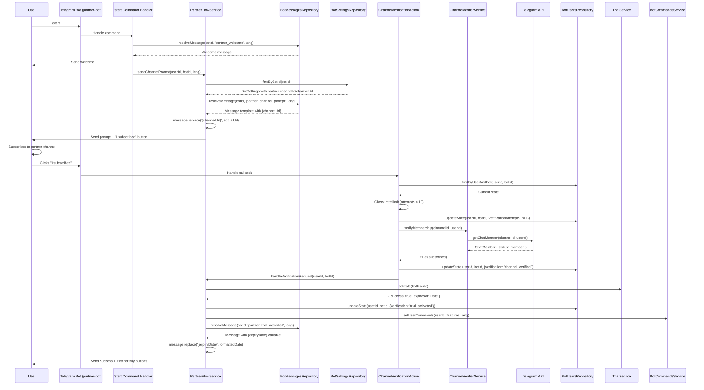
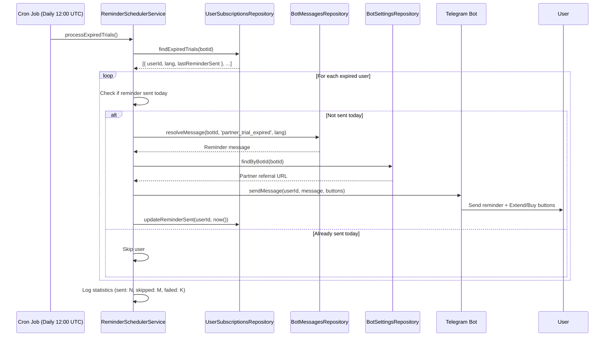

# Partner Bot Flow Design Document

## Overview

This document defines the technical implementation for a specialized partner bot flow that gates trial activation behind channel subscription verification. The feature enables partner-driven user acquisition by requiring users to subscribe to partner Telegram channels before accessing premium trial features. The implementation creates a new `libs/partner-bot` library that integrates with existing multi-bot infrastructure while maintaining zero breaking changes to the core system.

**Key Capabilities:**
- User-initiated channel subscription verification via Telegram Bot API
- Trial activation reusing existing `TrialService` without modifications
- Multi-language message support for 8 languages (ru, en, uk, hi, fr, kk, uz, tg)
- Daily indefinite trial expiration reminders with action buttons
- Referral URL integration for trial extension mechanism

## Background and Context

### Prerequisite ADRs

- **ADR-008: Partner Bot Flow Architecture** (v1.0.0, Proposed) - Core architecture decisions:
  - Decision 1: User-initiated verification with `getChatMember` API
  - Decision 2: Simple `string.replace()` for message variable interpolation
  - Decision 3: Partner-specific types in `libs/partner-bot`, not `libs/db`
  - Decision 4: State management in `bot_users.state` JSONB field
  - Decision 5: Daily indefinite reminders until user action
  - Decision 6: Wrapper pattern for TrialService integration

- **ADR-004: Multi-Bot Database Architecture** - Establishes `bot_messages` and `bot_settings` JSONB structure
- **ADR-005: Telegram Bot Framework Selection** - Telegraf.js provides `getChatMember` API
- **ADR-006: Dynamic Telegraf Module Loading** - Multi-bot instance management

### Common ADRs

- **Message Resolution Pattern**: Follows ADR-004 hierarchy: `bot_messages` → `messages` → English fallback → hardcoded
- **JSONB Configuration Pattern**: Follows ADR-003 pattern for settings extension without schema changes
- **Multi-Bot Registration Pattern**: Follows ADR-006 dynamic bot loading approach

**Error Handling and Async Processing Patterns:**
- **Telegram API Error Handling**: Follows exponential backoff pattern with 3 retry attempts for transient errors (500, 503, 429), immediate failure for client errors (400, 403)
- **Database Transaction Management**: All state transitions wrapped in atomic database transactions to prevent state desync
- **Async Job Execution**: Reminder scheduler follows fail-safe pattern (skip failed users, continue processing, log errors for manual review)
- **Rate Limiting Pattern**: User-scoped rate limiting tracked in `bot_users.state` JSONB field, reset window of 1 hour aligns with Telegram API rate limits

### Agreement Checklist

#### Scope
- [x] Create new `libs/partner-bot` library with complete partner flow implementation
- [x] Channel subscription verification using Telegram `getChatMember` API
- [x] Trial activation integration via existing `TrialService` wrapper pattern
- [x] Multi-language message support for 6 message types × 8 languages (48 SQL inserts)
- [x] Daily reminder cron job for expired trials with indefinite continuation
- [x] "Extend Free Period" button integration with partner referral URL from `bot_settings`
- [x] "Buy Subscription" button showing "Coming soon" placeholder message
- [x] User state management in `bot_users.state` JSONB field
- [x] Rate limiting for verification attempts (10 per hour per user)

#### Non-Scope (Explicitly not changing)
- [x] `libs/bot` TrialService - No modifications, only wrapper usage
- [x] `libs/db` TypeScript interfaces - Generic JSONB remains untyped
- [x] Database schema - No new tables, only JSONB field extensions
- [x] Existing bot commands/actions - Standard bot flow unaffected
- [x] Partner referral page implementation - External responsibility
- [x] Trial extension backend logic - Button opens URL only
- [x] Payment processing integration - "Buy Subscription" non-functional
- [x] Subscription purchase flow - Future implementation
- [x] Channel leave detection - Out of scope for MVP

#### Constraints
- [x] Parallel operation: Standard bot and partner bot flows coexist independently
- [x] Backward compatibility: Zero breaking changes to existing bots
- [x] Performance measurement: Not required (leverages existing infrastructure)
- [x] Database constraint: No schema changes, JSONB extension only
- [x] Library constraint: Reuse TrialService, BotMessagesRepository, BotSettingsRepository without modification
- [x] Multi-bot architecture: Integration with existing webhook-based multi-bot system
- [x] Channel verification: Bot must be able to call `getChatMember` (public channels or bot is member)

### Problem to Solve

**Business Problem:** Partners need measurable lead generation through Telegram channel subscriptions. The standard bot flow offers direct trial activation without verifying user commitment, failing to provide partners with qualified trading audiences.

**Technical Problem:** How to gate trial activation behind channel subscription verification while:
1. Reusing existing trial infrastructure without duplication
2. Supporting multiple partner bots with different channel requirements
3. Maintaining type safety with JSONB configuration
4. Ensuring reliable verification without polling overhead
5. Providing persistent user engagement through expiration reminders

### Current Challenges

1. **No Channel Verification Mechanism:** Current trial flow (`libs/bot/src/actions/trial/trial.action.ts`) activates trials immediately without partner channel verification.

2. **Generic Trial Activation:** `TrialService.activate()` has no awareness of partner-specific prerequisites.

3. **No Partner Configuration Storage:** No established pattern for partner-specific settings (channelId, referralUrl) in `bot_settings` JSONB.

4. **No Verification State Tracking:** `bot_users.state` field exists but has no defined state machine for channel verification flow.

5. **No Expiration Reminder System:** Current `SubscriptionExpirationService` sends single reminder, not indefinite daily reminders with action buttons.

### Requirements

#### Functional Requirements

**FR-PB001: Welcome Message Delivery**
- Retrieve message from `bot_messages` table with type `partner_welcome`
- Resolve language using `bot_users.lang` → `bot_settings.defaults.language` hierarchy
- Send message immediately on `/start` command

**FR-PB002: Channel Subscription Prompt**
- Retrieve message from `bot_messages` with type `partner_channel_prompt`
- Interpolate `{channelUrl}` and `{channelName}` variables using `string.replace()`
- Include inline keyboard button labeled "I subscribed"
- Button callback data: `partner_verify_subscription`

**FR-PB003: Channel Membership Verification**
- Invoke `Telegraf.telegram.getChatMember(channelId, userId)` on button click
- Retrieve `channelId` from `bot_settings.settings.partner.channelId` JSONB field
- Valid membership statuses: `member`, `administrator`, `creator`
- Invalid statuses: `left`, `kicked`
- Handle Telegram API errors: `USER_ID_INVALID` (400) returns false, others throw for retry

**FR-PB004: Trial Activation via TrialService**
- Call `TrialService.activate(botUserId)` after successful channel verification (botUserId = bot_users.id)
- Update `bot_users.state` to `{ verification: 'trial_activated' }` on success
- Preserve existing TrialService eligibility and expiration logic

**FR-PB005: Trial UI Message with Action Buttons**
- Retrieve message from `bot_messages` type `partner_trial_activated`
- Interpolate `{expiryDate}` and `{daysRemaining}` variables
- Include inline keyboard with two buttons:
  - "Extend Free Period" (URL button → `bot_settings.settings.partner.referralUrl`)
  - "Buy Subscription" (callback button → `partner_buy_subscription`)

**FR-PB006: Verification Failure Handling**
- Show error message from `bot_messages` type `partner_verification_failed`
- Interpolate `{channelName}` variable
- Keep "I subscribed" button active for retry
- Update state to `{ verification: 'awaiting_channel_subscription' }`

**FR-PB007: Trial Expiration Daily Reminders**
- Cron job runs daily at 12:00 UTC
- Query `user_subscriptions` WHERE `status = 'expired'` AND trial subscription
- Send message from `bot_messages` type `partner_trial_expired`
- Include same button layout as FR-PB005 (Extend/Buy buttons)
- Track `last_reminder_sent` timestamp to prevent duplicates
- Continue indefinitely until user action

**FR-PB008: "Buy Subscription" Coming Soon Message**
- Show message from `bot_messages` type `partner_coming_soon`
- No variables to interpolate
- Acknowledge user's intent without functional purchase flow

**FR-PB009: Multi-Language Message Support**
- Support 8 languages: ru, en, uk, hi, fr, kk, uz, tg
- Language resolution: `bot_users.lang` → `users.lang` → `bot_settings.defaults.language` → 'en'
- Fallback chain: bot-specific → global → English → hardcoded

**FR-PB010: Rate Limiting for Verification Attempts**
- Track verification attempts in `bot_users.state.verificationAttempts`
- Max 10 attempts per hour per user
- Reset counter after 1 hour from first attempt
- Show rate limit error message when exceeded

**FR-PB011: State Management for Verification Flow**
- State values: `awaiting_channel_subscription`, `channel_verified`, `trial_activated`, `trial_expired`
- Store in `bot_users.state.verification` JSONB field
- Track `verificationAttempts` and `lastVerificationAttempt` timestamps

**FR-PB012: Partner Configuration in bot_settings**
- Store partner settings in `bot_settings.settings.partner` JSONB:
  ```json
  {
    "channelId": "@channelname",
    "channelUsername": "Channel Display Name",
    "referralUrl": "https://partner.example.com/referral",
    "verificationRetries": 10
  }
  ```
- Enable partner flow with `bot_settings.settings.features.partnerFlowEnabled: true`

#### Non-Functional Requirements

**Performance:**
- Channel verification response time < 3 seconds from button click to user feedback
- Message retrieval via single database query with `bot_messages(bot_id, type, lang)` composite index
- Daily reminder dispatch completes within 5 minutes for all expired trials
- Support 100+ concurrent channel verification requests without degradation

**Reliability:**
- Graceful degradation if Telegram API unavailable: Show retry option, don't fail silently
- Idempotent trial activation: Multiple button clicks don't create duplicate subscriptions
- Message fallback chain ensures users always receive feedback (never fails)
- Reminder job resilience: Skip failures, continue with next users, log errors

**Security:**
- Channel ID format validation before Telegram API calls (prevent injection)
- User context isolation: Verification only checks requesting user's membership
- Rate limiting prevents abuse: Max 10 attempts/hour per user
- HTTPS validation for referral URLs: Block non-HTTPS or suspicious domains

**Maintainability:**
- Partner-specific types in `libs/partner-bot/src/types/partner-settings.ts` (not in `libs/db`)
- Dependency injection for all services (testability)
- Clear separation: PartnerFlowService orchestrates, ChannelVerifierService handles API
- Comprehensive unit tests for all services with >70% coverage

**Scalability:**
- Horizontal scaling: Stateless verification logic works across multiple bot instances
- Database indexing: Composite index on `bot_messages(bot_id, type, lang)` for fast lookups
- Reminder job sharding: Distribute expired user checks across multiple workers if needed
- Configuration-driven: All partner settings in database, no code deployment per partner

## Acceptance Criteria (AC)

### AC-PB001: Welcome Message and Channel Prompt Flow
- [ ] When user sends `/start` to partner bot, bot responds with welcome message from `bot_messages` type `partner_welcome` in user's language
- [ ] After welcome message, bot immediately sends channel subscription prompt from `bot_messages` type `partner_channel_prompt`
- [ ] Channel prompt message includes interpolated `{channelUrl}` and `{channelName}` variables from `bot_settings.partner`
- [ ] Channel prompt includes inline keyboard with single button labeled "I subscribed"
- [ ] Button has callback data `partner_verify_subscription`

### AC-PB002: Successful Channel Verification and Trial Activation
- [ ] When user clicks "I subscribed" button and is subscribed to partner channel, bot verifies membership via `getChatMember` API
- [ ] Bot updates `bot_users.state.verification` to `channel_verified` immediately after successful verification
- [ ] Bot calls `TrialService.activate(botUserId)` to create trial subscription (botUserId = bot_users.id)
- [ ] Bot updates `bot_users.state.verification` to `trial_activated` after successful trial creation
- [ ] Bot sends success message from `bot_messages` type `partner_trial_activated` with interpolated `{expiryDate}` and `{daysRemaining}`
- [ ] Success message includes inline keyboard with two buttons: "Extend Free Period" (URL) and "Buy Subscription" (callback)
- [ ] Bot updates user's command menu via `BotCommandsService.setUserCommands()` to include subscription features

### AC-PB003: Failed Channel Verification Handling
- [ ] When user clicks "I subscribed" button without subscribing to channel, bot detects non-membership via `getChatMember` API
- [ ] Bot sends error message from `bot_messages` type `partner_verification_failed` with interpolated `{channelName}`
- [ ] Error message includes same "I subscribed" button for retry
- [ ] Bot keeps `bot_users.state.verification` as `awaiting_channel_subscription` for retry
- [ ] User can click button again without restarting flow

### AC-PB004: Rate Limiting for Verification Attempts
- [ ] When user clicks "I subscribed" button, bot increments `bot_users.state.verificationAttempts` counter
- [ ] When user reaches 10 verification attempts within 1 hour, bot shows rate limit error message
- [ ] Rate limit error disables "I subscribed" button temporarily
- [ ] After 1 hour from first attempt, counter resets and user can verify again
- [ ] Rate limit tracking persists across bot restarts (stored in database)

### AC-PB005: Trial Expiration Daily Reminders
- [ ] When user's trial expires, daily cron job (12:00 UTC) detects expired status
- [ ] Bot sends reminder message from `bot_messages` type `partner_trial_expired` with same button layout as trial activated message
- [ ] Reminder includes "Extend Free Period" (URL) and "Buy Subscription" (callback) buttons
- [ ] Bot tracks `last_reminder_sent` timestamp to prevent duplicate reminders on same day
- [ ] Reminders continue daily indefinitely until user clicks a button or reactivates trial
- [ ] If user blocks bot, bot logs error and skips that user in future runs (graceful degradation)

### AC-PB006: "Extend Free Period" Button Functionality
- [ ] When user clicks "Extend Free Period" button, bot opens URL from `bot_settings.settings.partner.referralUrl`
- [ ] URL opens in user's browser or Telegram in-app browser
- [ ] No backend logic executes (button only opens URL)
- [ ] User remains in partner bot chat after opening URL

### AC-PB007: "Buy Subscription" Coming Soon Message
- [ ] When user clicks "Buy Subscription" button, bot sends message from `bot_messages` type `partner_coming_soon`
- [ ] Message acknowledges user's intent without functional purchase flow
- [ ] No error or crash occurs (graceful placeholder behavior)

### AC-PB008: Multi-Language Support
- [ ] All 6 message types (`partner_welcome`, `partner_channel_prompt`, `partner_verification_failed`, `partner_trial_activated`, `partner_trial_expired`, `partner_coming_soon`) exist in all 8 languages (ru, en, uk, hi, fr, kk, uz, tg)
- [ ] SQL migration file contains 48 INSERT statements (6 types × 8 languages)
- [ ] Language resolution follows hierarchy: `bot_users.lang` → `users.lang` → `bot_settings.defaults.language` → 'en'
- [ ] If bot-specific message not found, falls back to global `messages` table
- [ ] If no message found in any source, returns hardcoded English fallback (never fails)

### AC-PB009: Partner Configuration Validation
- [ ] When bot starts, partner bot validates `bot_settings.settings.partner.channelId` is present
- [ ] ChannelId format validation accepts `@channelname` or `-100123456789` formats
- [ ] Partner bot validates `bot_settings.settings.partner.referralUrl` is HTTPS
- [ ] If configuration invalid, bot logs error and disables partner flow features
- [ ] Bot continues to function with standard trial flow if partner config missing (graceful degradation)

### AC-PB010: State Transition Integrity
- [ ] User state transitions follow strict sequence: `awaiting_channel_subscription` → `channel_verified` → `trial_activated` → `trial_expired`
- [ ] Invalid state transitions (e.g., `trial_expired` → `awaiting_channel_subscription`) are rejected with error log
- [ ] If trial activation fails after successful verification, state reverts to `channel_verified` for retry
- [ ] State updates are atomic (wrapped in database transaction)

### AC-PB011: Integration with Existing Trial System
- [ ] PartnerFlowService calls `TrialService.activate(botUserId)` without modifications to TrialService code
- [ ] Trial eligibility check via `TrialService.isEligible(botUserId)` respects existing logic (no prior subscriptions)
- [ ] Trial expiration date calculation uses `TRIAL_DURATION_DAYS` environment variable
- [ ] `user_subscriptions` table record created by TrialService has correct `expires_at` date
- [ ] Trial status in `user_subscriptions` transitions from `active` to `expired` at expiration time

### AC-PB012: Error Handling and Logging
- [ ] When Telegram API returns `USER_ID_INVALID` error, bot logs warning and treats as "not subscribed" (doesn't crash)
- [ ] When Telegram API is unavailable (network error), bot retries with exponential backoff (3 attempts)
- [ ] When trial activation fails, bot logs error with user ID and error message for debugging
- [ ] When reminder dispatch fails for a user, bot logs error and continues with next user (doesn't stop entire job)
- [ ] All sensitive information (user IDs, channel IDs) is masked in error logs

## Existing Codebase Analysis

### Implementation Path Mapping

| Type | Path | Description |
|------|------|-------------|
| **Existing** | `libs/bot/src/services/trial.service.ts` | Trial activation service (reused via wrapper) |
| **Existing** | `libs/bot/src/actions/trial/trial.action.ts` | Standard bot trial action (not modified) |
| **Existing** | `libs/bot/src/middleware/user-management.middleware.ts` | User context enrichment (pattern reference) |
| **Existing** | `libs/db/src/repositories/bot-messages.repository.ts` | Message resolution with fallback chain |
| **Existing** | `libs/db/src/repositories/bot-settings.repository.ts` | Bot configuration retrieval |
| **Existing** | `libs/db/src/repositories/bot-users.repository.ts` | User state management in JSONB field |
| **Existing** | `libs/db/src/repositories/user-subscriptions.repository.ts` | Subscription CRUD operations |
| **New** | `libs/partner-bot/src/partner-bot.module.ts` | NestJS module registration |
| **New** | `libs/partner-bot/src/types/partner-settings.ts` | Partner-specific TypeScript types |
| **New** | `libs/partner-bot/src/services/partner-flow.service.ts` | Partner flow orchestration |
| **New** | `libs/partner-bot/src/services/channel-verifier.service.ts` | Telegram API verification |
| **New** | `libs/partner-bot/src/services/reminder-scheduler.service.ts` | Daily reminder cron job |
| **New** | `libs/partner-bot/src/actions/channel-verification.action.ts` | "I subscribed" button handler |
| **New** | `libs/partner-bot/src/actions/trial-ui.action.ts` | "Extend"/"Buy" button handlers |
| **New** | `libs/partner-bot/src/commands/start/start.update.ts` | Partner bot /start command |
| **New** | `libs/partner-bot/src/commands/start/start.i18n.ts` | Start command i18n utilities |
| **New** | `libs/partner-bot/test/services/partner-flow.service.spec.ts` | Unit tests for partner flow |
| **New** | `libs/partner-bot/test/services/channel-verifier.service.spec.ts` | Unit tests for verification |
| **New** | `libs/partner-bot/test/services/reminder-scheduler.service.spec.ts` | Unit tests for reminders |
| **New** | `libs/db/migrations/YYYYMMDD_partner_bot_messages.sql` | 48 SQL INSERT statements |

### Integration Points

#### Integration Point 1: TrialService Wrapper
- **Existing Component:** `libs/bot/src/services/trial.service.ts`
- **Methods Used:** `isEligible(botUserId: number): Promise<boolean>`, `activate(botUserId: number): Promise<{ success: boolean, expiresAt?: Date, error?: string }>`
- **Integration Method:** Dependency injection into `PartnerFlowService`, direct method calls after verification
- **Impact Level:** Low (Read-only operations, no state changes to TrialService)
- **Required Test Coverage:** Mock TrialService in partner-bot tests, verify correct method calls with expected parameters

#### Integration Point 2: BotMessagesRepository
- **Existing Component:** `libs/db/src/repositories/bot-messages.repository.ts`
- **Methods Used:** `resolveMessage(botId: number, type: string, lang: string): Promise<string>`
- **Integration Method:** Dependency injection into services, call for each message type
- **Variable Interpolation:** Apply `string.replace()` on returned message string for `{variableName}` patterns
- **Impact Level:** Low (Read-only queries with established fallback chain)
- **Required Test Coverage:** Verify fallback chain works for partner message types

#### Integration Point 3: BotSettingsRepository
- **Existing Component:** `libs/db/src/repositories/bot-settings.repository.ts`
- **Methods Used:** `findByBotId(botId: number): Promise<BotSettingsRecord | null>`
- **Integration Method:** Retrieve settings, cast `settings` JSONB to `PartnerBotSettings` interface in partner-bot code
- **Type Safety:** Use TypeScript type assertion: `const typed = rawSettings.settings as PartnerBotSettings`
- **Impact Level:** Low (Read-only configuration retrieval)
- **Required Test Coverage:** Verify type casting works correctly with optional `partner` field

#### Integration Point 4: BotUsersRepository
- **Existing Component:** `libs/db/src/repositories/bot-users.repository.ts`
- **Methods Used:** `updateState(userId: number, botId: number, state: BotUserState): Promise<BotUser | null>`, `findByUserAndBot(userId: number, botId: number): Promise<BotUser | null>`
- **Integration Method:** Direct calls to update/read `state` JSONB field with verification state
- **State Structure:** `{ verification: VerificationState, verificationAttempts: number, lastVerificationAttempt: string }`
- **Impact Level:** Medium (State mutations, but isolated per user/bot pair)
- **Required Test Coverage:** Verify state transitions are atomic and follow state machine rules

#### Integration Point 5: Telegram Bot API (getChatMember)
- **External Component:** Telegram Bot API via Telegraf.js
- **Methods Used:** `bot.telegram.getChatMember(channelId: string, userId: number): Promise<ChatMember>`
- **Integration Method:** Direct API call from `ChannelVerifierService`
- **Error Handling:** Catch `USER_ID_INVALID` (400), retry network errors with exponential backoff
- **Impact Level:** Medium (External API dependency with rate limits and availability concerns)
- **Required Test Coverage:** Mock Telegram API responses, test success/failure/error scenarios

#### Integration Point 6: BotCommandsService
- **Existing Component:** `libs/bot/src/services/bot-commands.service.ts`
- **Methods Used:** `setUserCommands(userId: number, features: Set<string>, lang: string): Promise<void>`
- **Integration Method:** Call after successful trial activation to update bot command menu
- **Impact Level:** Low (UI update, not critical for functionality)
- **Required Test Coverage:** Verify method called with correct parameters after trial activation

#### Integration Point 7: UserSubscriptionsRepository (Reminder Job)
- **Existing Component:** `libs/db/src/repositories/user-subscriptions.repository.ts`
- **Methods Used:** `findExpiredTrials(botId: number): Promise<Array<UserSubscription>>` (may need new method), `updateReminderSent(userId: number, timestamp: Date): Promise<void>` (may need new method)
- **Integration Method:** Query expired trials in cron job, update reminder timestamp after send
- **Impact Level:** Medium (Batch operations on user_subscriptions table)
- **Required Test Coverage:** Verify query returns correct expired users, timestamp updates prevent duplicates

### Similar Functionality Search Results

**Domain:** Trial subscription activation
**Search Keywords:** "trial", "activate", "subscription", "verification"

**Found Implementations:**
1. `libs/bot/src/services/trial.service.ts` - Core trial activation logic
   - **Decision:** Reuse via wrapper pattern (ADR-008 Decision 6)
   - **Rationale:** TrialService handles eligibility check, expiration calculation, and `user_subscriptions` record creation. No duplication needed.

2. `libs/bot/src/actions/trial/trial.action.ts` - Standard bot trial button handler
   - **Decision:** Create separate partner-specific action handler
   - **Rationale:** Partner flow requires channel verification prerequisite before trial activation. Standard action has no verification logic.

3. `libs/bot/src/middleware/user-management.middleware.ts` - User context enrichment pattern
   - **Decision:** Reference pattern, may reuse if partner-bot needs middleware
   - **Rationale:** Similar user context loading pattern, but partner-bot may use existing middleware from `libs/bot`

**Domain:** Message resolution with variable interpolation
**Search Keywords:** "message", "interpolate", "variable", "template"

**Found Implementations:**
- No existing message interpolation logic found in codebase
- **Decision:** Implement simple `string.replace()` in partner-bot services (ADR-008 Decision 2)
- **Rationale:** YAGNI principle - only 2-3 variables per message, no complex template engine needed

**Domain:** Channel subscription verification
**Search Keywords:** "channel", "verify", "getChatMember", "subscription"

**Found Implementations:**
- No existing channel verification logic found
- **Decision:** Implement new `ChannelVerifierService` in `libs/partner-bot`
- **Rationale:** New feature unique to partner bot flow

**Domain:** Reminder cron jobs
**Search Keywords:** "reminder", "cron", "schedule", "expiration"

**Found Implementations:**
1. `libs/bot/src/services/subscription-expiration.service.ts` - Existing expiration reminder
   - **Decision:** Create separate `ReminderSchedulerService` for partner-specific reminders
   - **Rationale:** Partner reminders are indefinite daily (not single reminder), with different message types and button layout

**Final Decision:** No existing functionality suitable for direct reuse besides TrialService. All other components are new implementations specific to partner bot flow.

## Design

### Change Impact Map

```yaml
Change Target: Partner Bot Flow (New Feature)
Direct Impact:
  - libs/partner-bot/* (12-15 new files)
  - libs/db/migrations/YYYYMMDD_partner_bot_messages.sql (48 SQL inserts)
  - bot_settings JSONB field (new 'partner' key for partner bots only)
  - bot_users JSONB 'state' field (new verification state values)

Indirect Impact:
  - TrialService call volume increases (partner bots add verification step before activation)
  - BotMessagesRepository query load increases (6 new message types × 8 languages)
  - bot_messages table row count increases (48 new rows per partner bot)
  - Daily cron job resource usage (new reminder scheduler job)

No Ripple Effect:
  - Standard bot flow (libs/bot commands/actions unchanged)
  - Database schema (no ALTER TABLE statements)
  - Existing trial subscription logic (TrialService code unchanged)
  - User authentication (libs/bot middleware unchanged)
  - Signal broadcasting (libs/bot notification system unchanged)
  - Payment system (placeholder only, no integration)
```

### Interface Change Matrix

| Existing Interface | New Interface | Conversion Required | Adapter Required | Compatibility Method |
|-------------------|---------------|---------------------|------------------|---------------------|
| TrialService.activate() | PartnerFlowService.handleVerificationRequest() | Yes | Wrapper | PartnerFlowService wraps TrialService |
| BotMessagesRepository.resolveMessage() | (same) + variable interpolation | Yes | Inline | Apply string.replace() after resolveMessage() |
| BotUsersRepository.updateState() | (same) with VerificationState values | No | Not Required | Existing method accepts generic JSONB |
| bot_settings.settings JSONB | settings.partner.channelId | No | Not Required | Cast to PartnerBotSettings interface |
| /start command | Partner-specific /start handler | Yes | Separate module | Partner-bot registers own command handler |

### Architecture Overview

The partner bot flow is implemented as a standalone NestJS library (`libs/partner-bot`) that integrates with existing multi-bot infrastructure through dependency injection. The architecture follows the Wrapper Pattern (ADR-008 Decision 6) to reuse `TrialService` without modification, and the Feature-Driven Development approach (vertical slice) to deliver complete user-visible functionality.

**Key Architectural Principles:**
1. **Separation of Concerns:** Partner-specific logic isolated in `libs/partner-bot`, core bot logic unchanged in `libs/bot`
2. **Dependency Inversion:** Partner-bot depends on `libs/bot` and `libs/db` interfaces, not vice versa
3. **Single Responsibility:** Each service has one clear purpose (flow orchestration, API verification, reminder scheduling)
4. **Open-Closed Principle:** Existing services open for extension (wrapper pattern), closed for modification

```mermaid
graph TB
    subgraph "Partner Bot Library (libs/partner-bot)"
        CMD["/start Command Handler"]
        PFS[PartnerFlowService]
        CVS[ChannelVerifierService]
        RSS[ReminderSchedulerService]
        CVA["ChannelVerificationAction<br/>(I subscribed button)"]
        TUA["TrialUIAction<br/>(Extend/Buy buttons)"]
    end

    subgraph "Existing Bot Services (libs/bot)"
        TS[TrialService]
        BCS[BotCommandsService]
    end

    subgraph "Existing Database Repositories (libs/db)"
        BMR[BotMessagesRepository]
        BSR[BotSettingsRepository]
        BUR[BotUsersRepository]
        USR[UserSubscriptionsRepository]
    end

    subgraph "External Dependencies"
        TAPI[Telegram Bot API<br/>getChatMember]
    end

    CMD -->|1. Send welcome| BMR
    CMD -->|2. Send channel prompt| PFS
    PFS -->|Get partner config| BSR
    PFS -->|Resolve messages| BMR
    CVA -->|Verify membership| CVS
    CVS -->|API call| TAPI
    CVA -->|Update state| BUR
    CVA -->|Activate trial| PFS
    PFS -->|Wrap activate()| TS
    PFS -->|Send trial UI| BMR
    PFS -->|Update commands| BCS
    TUA -->|Open referral URL| BSR
    TUA -->|Send coming soon| BMR
    RSS -->|Query expired trials| USR
    RSS -->|Send reminders| BMR
    RSS -->|Update timestamp| USR

    style PFS fill:#90EE90
    style CVS fill:#90EE90
    style RSS fill:#90EE90
    style CMD fill:#FFD700
    style CVA fill:#FFD700
    style TUA fill:#FFD700
```

### Data Flow

#### Flow 1: User Onboarding and Channel Verification



#### Flow 2: Trial Expiration Reminder



### Integration Points List

| Integration Point | Location | Old Implementation | New Implementation | Switching Method |
|-------------------|----------|-------------------|-------------------|------------------|
| Trial Activation | `PartnerFlowService.handleVerificationRequest()` | N/A (new flow) | Wrap `TrialService.activate()` | Conditional: if partnerFlowEnabled |
| Message Resolution | All partner-bot services | Standard message retrieval | Retrieve + variable interpolation via `string.replace()` | Inline after `resolveMessage()` |
| User State Management | `ChannelVerificationAction` | N/A (new states) | Use `BotUsersRepository.updateState()` with verification state values | Reuse existing method |
| Bot Commands Update | After trial activation | Call `BotCommandsService.setUserCommands()` | Same method call | No change, direct usage |
| /start Command | Multi-bot dispatcher | Standard welcome flow | Partner-specific handler registered in partner-bot module | Module-based registration |
| Expiration Reminders | `SubscriptionExpirationService` (single reminder) | New `ReminderSchedulerService` (indefinite) | Separate cron job | Independent service |

### Main Components

#### Component 1: PartnerFlowService

**Responsibility:**
- Orchestrates the entire partner bot flow from welcome to trial activation
- Coordinates message retrieval, variable interpolation, and state transitions
- Wraps `TrialService.activate()` to inject channel verification prerequisite
- Sends trial UI messages with action buttons

**Variable Interpolation:** Performed inline in PartnerFlowService methods after retrieving message from BotMessagesRepository. Implementation uses `string.replace()` for each variable (e.g., `message.replace('{channelUrl}', actualUrl).replace('{channelName}', actualName)`). No separate interpolation service needed (YAGNI principle per ADR-008 Decision 2).

**Interface:**
```typescript
interface PartnerFlowService {
  /**
   * Send channel subscription prompt with "I subscribed" button
   * @param userId - Telegram user ID
   * @param botId - Bot database ID
   * @param lang - User language code
   */
  sendChannelPrompt(userId: number, botId: number, lang: string): Promise<void>;

  /**
   * Handle channel verification request and trial activation
   * @param userId - Telegram user ID
   * @param botId - Bot database ID
   * @returns Verification result with success flag and optional error
   */
  handleVerificationRequest(
    userId: number,
    botId: number,
  ): Promise<{ verified: boolean; error?: string }>;

  /**
   * Send trial activated message with Extend/Buy buttons
   * @param userId - Telegram user ID
   * @param botId - Bot database ID
   * @param lang - User language code
   * @param expiresAt - Trial expiration date
   */
  sendTrialUI(
    userId: number,
    botId: number,
    lang: string,
    expiresAt: Date,
  ): Promise<void>;

  /**
   * Send trial expiration reminder with same button layout
   * @param userId - Telegram user ID
   * @param botId - Bot database ID
   * @param lang - User language code
   */
  sendExpirationReminder(
    userId: number,
    botId: number,
    lang: string,
  ): Promise<void>;
}
```

**Dependencies:**
- `BotMessagesRepository` (message retrieval with fallback)
- `BotSettingsRepository` (partner configuration)
- `BotUsersRepository` (state management)
- `TrialService` (trial activation)
- `BotCommandsService` (command menu update)
- `Telegraf` (message sending)

**Key Methods:**
1. `sendChannelPrompt()`: Retrieve message, interpolate variables, send with button
2. `handleVerificationRequest()`: Verify channel → activate trial → update state
3. `sendTrialUI()`: Send success message with Extend/Buy buttons
4. `sendExpirationReminder()`: Send daily reminder with same button layout

#### Component 2: ChannelVerifierService

**Responsibility:**
- Verify user membership in partner Telegram channel via Bot API
- Handle Telegram API errors gracefully (USER_ID_INVALID, network errors)
- Implement retry logic with exponential backoff for transient failures
- Track verification attempts for rate limiting

**Rate Limiting Responsibility:** ChannelVerifierService owns all rate limiting logic. This service manages verification attempt tracking, rate limit checks, and counter reset logic in `bot_users.state.verificationAttempts` field. No separate rate limiter service needed to maintain single responsibility principle.

**Interface:**
```typescript
interface ChannelVerifierService {
  /**
   * Verify if user is subscribed to channel
   * @param channelId - Telegram channel ID (@channelname or -100123456789)
   * @param userId - Telegram user ID
   * @returns true if subscribed, false otherwise
   * @throws Error for network errors (retryable)
   */
  verifyMembership(channelId: string, userId: number): Promise<boolean>;

  /**
   * Get rate limit status for user
   * @param userId - Telegram user ID
   * @param botId - Bot database ID
   * @returns Attempts count and reset timestamp
   */
  getRateLimitStatus(
    userId: number,
    botId: number,
  ): Promise<{ attempts: number; resetAt: Date }>;

  /**
   * Check if user has exceeded rate limit
   * @param userId - Telegram user ID
   * @param botId - Bot database ID
   * @returns true if rate limited
   */
  isRateLimited(userId: number, botId: number): Promise<boolean>;
}
```

**Dependencies:**
- `Telegraf.telegram` (Telegram Bot API client)
- `BotUsersRepository` (rate limit tracking in state)

**Key Methods:**
1. `verifyMembership()`: Call `getChatMember`, validate status, handle errors
2. `getRateLimitStatus()`: Read `bot_users.state.verificationAttempts` and `lastVerificationAttempt`
3. `isRateLimited()`: Check if attempts >= 10 within 1 hour

#### Component 3: ReminderSchedulerService

**Responsibility:**
- Execute daily cron job at 12:00 UTC to process expired trials
- Query `user_subscriptions` for expired trial subscriptions
- Send reminder messages with Extend/Buy buttons
- Track last reminder sent timestamp to prevent duplicates
- Handle errors gracefully (skip failed users, continue with others)

**Interface:**
```typescript
interface ReminderSchedulerService {
  /**
   * Process all expired trials for a bot (called by cron)
   * @param botId - Bot database ID
   * @returns Statistics: sent count, skipped count, failed count
   */
  processExpiredTrials(botId: number): Promise<{
    sent: number;
    skipped: number;
    failed: number;
  }>;

  /**
   * Send reminder to specific user
   * @param userId - Telegram user ID
   * @param botId - Bot database ID
   * @param lang - User language code
   */
  sendReminder(userId: number, botId: number, lang: string): Promise<void>;
}
```

**Dependencies:**
- `UserSubscriptionsRepository` (query expired trials, update reminder timestamp)
- `PartnerFlowService` (reuse `sendExpirationReminder()` method)
- `BotMessagesRepository` (message retrieval)
- `BotSettingsRepository` (referral URL for buttons)
- `Telegraf` (message sending)

**Key Methods:**
1. `processExpiredTrials()`: Main cron job entry point, batch processing
2. `sendReminder()`: Send individual reminder, handle bot block errors

#### Component 4: ChannelVerificationAction

**Responsibility:**
- Handle "I subscribed" button callback
- Check rate limit before verification
- Update verification state in database
- Delegate verification to ChannelVerifierService
- Show success or error messages based on result

**Interface:**
```typescript
/**
 * NestJS Update handler (class required for @Update, @Action decorators)
 * Framework requirement: NestJS Telegraf integration via nest-telegraf
 */
@Update()
@Injectable()
class ChannelVerificationAction {
  /**
   * Handle "I subscribed" button click
   * Callback data: 'partner_verify_subscription'
   */
  @Action('partner_verify_subscription')
  async handleVerify(@Ctx() ctx: UserContext): Promise<void>;
}
```

**Dependencies:**
- `ChannelVerifierService` (membership verification)
- `PartnerFlowService` (trial activation)
- `BotUsersRepository` (state updates)
- `BotMessagesRepository` (error messages)

**Key Methods:**
1. `handleVerify()`: Check rate limit → verify → update state → activate trial or show error

#### Component 5: TrialUIAction

**Responsibility:**
- Handle "Extend Free Period" button (URL open)
- Handle "Buy Subscription" button (coming soon message)
- Retrieve referral URL from bot_settings
- Send coming soon placeholder message

**Interface:**
```typescript
/**
 * NestJS Update handler (class required for @Update, @Action decorators)
 * Framework requirement: NestJS Telegraf integration via nest-telegraf
 */
@Update()
@Injectable()
class TrialUIAction {
  /**
   * Handle "Extend Free Period" button
   * Callback data: 'partner_extend_trial'
   * Opens referral URL in browser
   */
  @Action('partner_extend_trial')
  async handleExtend(@Ctx() ctx: UserContext): Promise<void>;

  /**
   * Handle "Buy Subscription" button
   * Callback data: 'partner_buy_subscription'
   * Shows coming soon message
   */
  @Action('partner_buy_subscription')
  async handleBuy(@Ctx() ctx: UserContext): Promise<void>;
}
```

**Dependencies:**
- `BotSettingsRepository` (referral URL retrieval)
- `BotMessagesRepository` (coming soon message)

**Key Methods:**
1. `handleExtend()`: Retrieve referral URL from `bot_settings.partner.referralUrl`, send as URL button (Telegram handles opening)
2. `handleBuy()`: Retrieve `partner_coming_soon` message, send to user

#### Component 6: StartCommandUpdate

**Responsibility:**
- Handle `/start` command for partner bots
- Send welcome message
- Send channel subscription prompt
- Initialize user state to `awaiting_channel_subscription`

**Interface:**
```typescript
/**
 * NestJS Update handler (class required for @Update, @Command decorators)
 * Framework requirement: NestJS Telegraf integration via nest-telegraf
 */
@Update()
@Injectable()
class StartCommandUpdate {
  /**
   * Handle /start command for partner bot
   */
  @Command('start')
  async handleStart(@Ctx() ctx: UserContext): Promise<void>;
}
```

**Dependencies:**
- `BotMessagesRepository` (welcome and prompt messages)
- `PartnerFlowService` (orchestrate flow)
- `BotUsersRepository` (initialize state)

**Key Methods:**
1. `handleStart()`: Send welcome → initialize state → send channel prompt

### Type Definitions

```typescript
// libs/partner-bot/src/types/partner-settings.ts

/**
 * Partner-specific bot settings interface
 * Cast bot_settings.settings JSONB to this type in partner-bot code
 */
export interface PartnerBotSettings {
  features: {
    trialEnabled: boolean;
    paymentsEnabled: boolean;
    signalsEnabled: boolean;
    broadcastEnabled: boolean;
    partnerFlowEnabled: boolean; // Enable partner bot flow
  };
  defaults: {
    subscriptionDays: number;
    trialDays: number;
    language: string;
  };
  partner?: {
    channelId: string; // Telegram channel ID (@channelname or -100123456789)
    channelUsername?: string; // Optional display name for {channelName} variable
    referralUrl: string; // Partner referral page URL (must be HTTPS)
    verificationRetries: number; // Max verification attempts per hour (default: 10)
  };
}

/**
 * Verification state values for bot_users.state.verification field
 */
export type VerificationState =
  | 'awaiting_channel_subscription' // User received prompt, not verified yet
  | 'channel_verified' // User passed verification, trial not activated yet
  | 'trial_activated' // Trial successfully activated
  | 'trial_expired'; // Trial expired, reminders being sent

/**
 * Extended bot user state for partner flow
 * Stored in bot_users.state JSONB field
 */
export interface PartnerBotUserState {
  verification?: VerificationState;
  verificationAttempts?: number; // Count of verification attempts
  lastVerificationAttempt?: string; // ISO timestamp of last attempt (for rate limiting)
}

/**
 * Partner flow verification result
 */
export interface VerificationResult {
  verified: boolean;
  error?: 'not_subscribed' | 'rate_limited' | 'api_error' | 'unknown';
}

/**
 * Reminder dispatch statistics
 */
export interface ReminderStats {
  sent: number; // Successfully sent reminders
  skipped: number; // Skipped (already sent today)
  failed: number; // Failed to send (bot blocked, API error, etc.)
}
```

### Data Contract

#### Component: PartnerFlowService

```yaml
Method: sendChannelPrompt
Input:
  Type: { userId: number, botId: number, lang: string }
  Preconditions:
    - userId exists in users table
    - botId exists in bots table
    - bot_settings.partner.channelId is set
    - bot_settings.partner.referralUrl is set (optional for prompt, required for trial UI)
  Validation:
    - userId > 0
    - botId > 0
    - lang is 2-letter code (e.g., 'en', 'ru')

Output:
  Type: Promise<void>
  Guarantees:
    - User receives message with interpolated channel URL
    - Message includes "I subscribed" button with callback data 'partner_verify_subscription'
    - bot_users.state.verification is 'awaiting_channel_subscription'
  On Error:
    - Telegram API error: Log error, throw for retry
    - Missing channel ID: Log error, throw ConfigurationError
    - Message not found: Fall back to hardcoded message (never fails)

Invariants:
  - Channel prompt always includes button (never sends text-only message)
  - State update is atomic with message send (transaction)

Method: handleVerificationRequest
Input:
  Type: { userId: number, botId: number }
  Preconditions:
    - User has clicked "I subscribed" button
    - bot_users.state.verification is 'awaiting_channel_subscription'
    - User has not exceeded rate limit (< 10 attempts/hour)
  Validation:
    - userId > 0
    - botId > 0
    - Rate limit check passes

Output:
  Type: Promise<VerificationResult>
  Guarantees:
    - If verified: trial activated, state is 'trial_activated', user receives success message
    - If not verified: state remains 'awaiting_channel_subscription', user receives error message
    - Verification attempt count incremented regardless of result
  On Error:
    - TrialService.activate() fails: State reverts to 'channel_verified', error message shown
    - Telegram API unavailable: Retry with exponential backoff (3 attempts), then show error
    - Rate limit exceeded: Return error without verification attempt

Invariants:
  - State transitions are atomic (channel_verified → trial_activated happen together)
  - Trial activation never happens without successful verification
```

#### Component: ChannelVerifierService

```yaml
Method: verifyMembership
Input:
  Type: { channelId: string, userId: number }
  Preconditions:
    - channelId is valid Telegram channel ID (@username or -100123456789)
    - userId is valid Telegram user ID
    - Bot has permission to call getChatMember (channel is public or bot is member)
  Validation:
    - channelId matches regex: ^(@[a-zA-Z0-9_]{5,32}|-100[0-9]{10})$
    - userId > 0

Output:
  Type: Promise<boolean>
  Guarantees:
    - Returns true if user.status is 'member', 'administrator', or 'creator'
    - Returns false if user.status is 'left', 'kicked', or 'restricted'
    - Returns false if USER_ID_INVALID error (400)
  On Error:
    - Network error: Retry with exponential backoff (1s, 2s, 4s), then throw
    - Permission error: Log warning, return false (bot can't verify this channel)
    - Other Telegram API errors: Throw for caller to handle

Invariants:
  - Method is idempotent (multiple calls return same result for same state)
  - Never modifies user state (read-only operation)

Method: isRateLimited
Input:
  Type: { userId: number, botId: number }
  Preconditions:
    - bot_users record exists for user/bot pair
  Validation:
    - userId > 0
    - botId > 0

Output:
  Type: Promise<boolean>
  Guarantees:
    - Returns true if verificationAttempts >= 10 within last hour
    - Returns false if less than 10 attempts or last attempt > 1 hour ago
    - Resets counter if last attempt timestamp is > 1 hour ago
  On Error:
    - Database error: Log error, return false (fail open to not block users)

Invariants:
  - Rate limit resets exactly 1 hour after first attempt in window
  - Counter persists across bot restarts (stored in database)
```

#### Component: ReminderSchedulerService

```yaml
Method: processExpiredTrials
Input:
  Type: { botId: number }
  Preconditions:
    - botId exists in bots table
    - bot_settings.partner.referralUrl is set
  Validation:
    - botId > 0

Output:
  Type: Promise<ReminderStats>
  Guarantees:
    - All expired trial users for bot are processed
    - Users who received reminder today are skipped
    - Statistics returned: { sent, skipped, failed }
    - last_reminder_sent timestamp updated for sent users
  On Error:
    - Individual user send failure: Log error, increment failed counter, continue with next user
    - Database query error: Log error, throw (job will retry on next run)
    - Bot blocked by user: Log info, mark user as opted_out, continue

Invariants:
  - Job is idempotent (running multiple times per day sends at most 1 reminder per user per day)
  - Failed users don't block processing of other users
  - Statistics always sum: sent + skipped + failed = total_expired_users
```

### State Transitions and Invariants

```yaml
State Definition:
  Initial State:
    - verification: undefined (no partner flow initiated yet)
    - verificationAttempts: 0
    - lastVerificationAttempt: null

  Possible States:
    - awaiting_channel_subscription: User received prompt, not verified
    - channel_verified: Verification passed, trial not activated
    - trial_activated: Trial successfully activated
    - trial_expired: Trial expired, reminders being sent

State Transitions:
  Initial (undefined) → /start command → awaiting_channel_subscription
  awaiting_channel_subscription → Button click + NOT verified → awaiting_channel_subscription (retry)
  awaiting_channel_subscription → Button click + Verified → channel_verified
  channel_verified → TrialService.activate() success → trial_activated
  channel_verified → TrialService.activate() failure → channel_verified (retry)
  trial_activated → Trial expires → trial_expired
  trial_expired → User action (extend/buy) → (out of scope, state remains expired)

Invalid Transitions (Rejected):
  trial_expired → awaiting_channel_subscription (can't restart verification)
  trial_activated → awaiting_channel_subscription (can't re-verify)
  channel_verified → awaiting_channel_subscription (can't go backwards)

System Invariants:
  - Verification state exists → User has interacted with partner bot at least once
  - State is 'trial_activated' → user_subscriptions has active trial record
  - State is 'channel_verified' → Channel membership verified but trial failed to activate
  - verificationAttempts ≥ 10 AND lastVerificationAttempt within 1 hour → User is rate limited
  - lastVerificationAttempt timestamp → Always set when verificationAttempts > 0
```

### Error Handling

**Error Categories:**

1. **Telegram API Errors:**
   - `USER_ID_INVALID` (400): User ID not recognized by Telegram → Log warning, treat as "not subscribed"
   - Network errors (500, 503): Temporary API unavailability → Retry with exponential backoff (3 attempts: 1s, 2s, 4s)
   - Rate limit errors (429): Too many requests → Back off and retry after `retry_after` seconds
   - Permission errors (403): Bot can't access channel → Log error, show user-friendly message

2. **Database Errors:**
   - Connection timeout: Retry query (3 attempts), then fail request
   - Constraint violation (e.g., FK error): Log error with context, show generic error to user
   - Query error (malformed state JSONB): Log error, reset state to default, continue

3. **Configuration Errors:**
   - Missing `bot_settings.partner.channelId`: Throw `ConfigurationError`, disable partner flow
   - Invalid channel ID format: Validate on bot startup, reject invalid config
   - Missing referral URL: Allow trial activation, disable "Extend" button with placeholder

4. **State Transition Errors:**
   - Invalid state transition: Log warning, reject transition, keep current state
   - Concurrent state updates: Use database transactions with row-level locking
   - State desync (verified but trial not active): Manual reconciliation via admin command

5. **User-Facing Errors:**
   - Rate limit exceeded: Show message "Too many attempts. Please wait 1 hour and try again."
   - Verification failed: Show message "Please subscribe to {channelName} first, then try again."
   - Trial activation failed: Show message "Something went wrong. Please contact support."
   - Bot blocked: Gracefully skip user in reminder job, log info (not error)

**Error Logging:**
```typescript
// Structured logging with masked sensitive data
logger.error('Channel verification failed', {
  userId: maskUserId(userId), // Mask last 4 digits: 123456 → 12****
  botId,
  channelId: maskChannelId(channelId), // Mask middle: @channel_name → @ch****_name
  error: error.message,
  errorCode: error.response?.error_code,
  stack: error.stack,
});
```

**Retry Logic:**
```typescript
// Exponential backoff for transient errors
async function retryWithBackoff<T>(
  fn: () => Promise<T>,
  maxAttempts = 3,
): Promise<T> {
  for (let attempt = 1; attempt <= maxAttempts; attempt++) {
    try {
      return await fn();
    } catch (error) {
      if (attempt === maxAttempts || !isRetryableError(error)) {
        throw error;
      }
      const backoffMs = Math.pow(2, attempt - 1) * 1000; // 1s, 2s, 4s
      await sleep(backoffMs);
    }
  }
  throw new Error('Max retries exceeded');
}

function isRetryableError(error: unknown): boolean {
  if (error instanceof TelegramError) {
    return error.code === 500 || error.code === 503 || error.code === 429;
  }
  return false; // Database errors, permission errors not retryable
}
```

### Logging and Monitoring

**Log Levels:**
- `ERROR`: API failures, database errors, configuration errors, trial activation failures
- `WARN`: Rate limit exceeded, invalid state transitions, missing messages (fallback used)
- `INFO`: Trial activations, reminder dispatches, successful verifications
- `DEBUG`: State transitions, message resolutions, API calls

**Key Metrics to Monitor:**
```yaml
Verification Metrics:
  - verification_attempts_total (counter): Total button clicks
  - verification_success_total (counter): Successful verifications
  - verification_failure_total (counter): Failed verifications
  - verification_rate_limited_total (counter): Rate limit hits
  - verification_duration_seconds (histogram): API call latency

Trial Activation Metrics:
  - trial_activations_total (counter): Successful activations
  - trial_activation_failures_total (counter): Failures
  - trial_activation_duration_seconds (histogram): Activation time

Reminder Metrics:
  - reminders_sent_total (counter): Successful sends
  - reminders_failed_total (counter): Failed sends
  - reminders_skipped_total (counter): Already sent today
  - reminder_job_duration_seconds (histogram): Job execution time

Error Metrics:
  - telegram_api_errors_total (counter): By error code
  - database_errors_total (counter): By error type
  - state_transition_errors_total (counter): By invalid transition
```

**Log Examples:**
```typescript
// Successful verification
logger.info('Channel verification successful', {
  userId: maskUserId(userId),
  botId,
  channelId: maskChannelId(channelId),
  attempts: state.verificationAttempts,
});

// Trial activation
logger.info('Trial activated via partner flow', {
  userId: maskUserId(userId),
  botId,
  expiresAt: expiresAt.toISOString(),
  durationDays: TRIAL_DURATION_DAYS,
});

// Reminder dispatch
logger.info('Reminder dispatched', {
  userId: maskUserId(userId),
  botId,
  messageType: 'partner_trial_expired',
  lang,
});

// Error logging
logger.error('Telegram API error during verification', {
  userId: maskUserId(userId),
  botId,
  errorCode: error.response?.error_code,
  errorDescription: error.response?.description,
  retryAfter: error.response?.parameters?.retry_after,
});
```

## Implementation Plan

### Implementation Approach

**Selected Approach:** Vertical Slice (Feature-Driven Development)

**Selection Reason:**
1. **Complete User Value Per Phase:** Each implementation phase delivers a working end-to-end flow that users can interact with
2. **Low Inter-Feature Dependencies:** Partner bot flow is isolated from standard bot flow, enabling independent implementation
3. **Early Validation:** Can test channel verification → trial activation → reminder flow as soon as Phase 1-3 complete
4. **Parallel Development Possibility:** Different components (verification, reminders) can be developed in parallel after Phase 1 foundation

**Implementation Strategy (per ADR-008 and implementation-approach.md Phase 5):**
- Phase 1: Core verification flow (user sees welcome → channel prompt → verification → trial activation)
- Phase 2: Trial UI with action buttons (user can click Extend/Buy buttons)
- Phase 3: Expiration reminders (automated daily reminders for expired users)
- Phase 4: Polish, tests, and documentation (comprehensive quality assurance)

### Technical Dependencies and Implementation Order

#### Required Implementation Order

1. **Phase 1: Foundation - Partner-Specific Types and Message Infrastructure**
   - **Technical Reason:** All services depend on type definitions and message retrieval
   - **Dependent Elements:** PartnerFlowService, ChannelVerifierService, all actions
   - **Deliverables:**
     - `libs/partner-bot/src/types/partner-settings.ts` (TypeScript types)
     - `libs/db/migrations/YYYYMMDD_partner_bot_messages.sql` (48 SQL inserts)
     - Verify message resolution works with `BotMessagesRepository.resolveMessage()`
   - **Verification:** L2 (Test passes: type casting works, message retrieval returns expected values)

2. **Phase 1: Core Components - ChannelVerifierService**
   - **Technical Reason:** Verification logic must exist before PartnerFlowService can orchestrate
   - **Dependent Elements:** ChannelVerificationAction, PartnerFlowService
   - **Deliverables:**
     - `libs/partner-bot/src/services/channel-verifier.service.ts`
     - Unit tests with mocked Telegram API
     - Rate limiting logic with state tracking
   - **Verification:** L2 (Unit tests pass: API mocking works, error handling correct)

3. **Phase 1: Flow Orchestration - PartnerFlowService**
   - **Technical Reason:** Wraps TrialService and coordinates verification + activation
   - **Prerequisites:** ChannelVerifierService must exist, TrialService available from `@libs/bot`
   - **Deliverables:**
     - `libs/partner-bot/src/services/partner-flow.service.ts`
     - Message interpolation logic
     - State transition management
   - **Verification:** L2 (Unit tests pass: TrialService correctly mocked and called)

4. **Phase 1: User Interactions - StartCommandUpdate + ChannelVerificationAction**
   - **Technical Reason:** Entry points for user flow, require all services operational
   - **Prerequisites:** PartnerFlowService, ChannelVerifierService complete
   - **Deliverables:**
     - `libs/partner-bot/src/commands/start/start.update.ts`
     - `libs/partner-bot/src/actions/channel-verification.action.ts`
     - NestJS module registration (`partner-bot.module.ts`)
   - **Verification:** L1 (Functional: User can /start → see prompt → click button → get verified → trial activated)

5. **Phase 2: Trial UI Actions - TrialUIAction**
   - **Technical Reason:** Handles button interactions after trial activation
   - **Prerequisites:** Trial activation flow complete (Phase 1)
   - **Deliverables:**
     - `libs/partner-bot/src/actions/trial-ui.action.ts`
     - Referral URL button logic
     - Coming soon message handler
   - **Verification:** L1 (Functional: User can click Extend/Buy buttons, see appropriate responses)

6. **Phase 3: Automation - ReminderSchedulerService**
   - **Technical Reason:** Automated job runs independently, depends on message infrastructure
   - **Prerequisites:** Message resolution, user subscription queries, PartnerFlowService
   - **Deliverables:**
     - `libs/partner-bot/src/services/reminder-scheduler.service.ts`
     - Cron job registration (12:00 UTC daily)
     - Timestamp tracking to prevent duplicates
   - **Verification:** L1 (Functional: Cron job executes, reminders sent to expired users, duplicates prevented)

7. **Phase 4: Quality Assurance - Tests, Documentation, Configuration**
   - **Technical Reason:** Ensures all components work together and meet acceptance criteria
   - **Prerequisites:** All Phase 1-3 implementations complete
   - **Deliverables:**
     - Unit tests for all services (>70% coverage)
     - Integration tests (partner flow end-to-end)
     - README.md for `libs/partner-bot` library
     - Configuration guide (bot_settings JSON examples)
   - **Verification:** L2 (All tests pass: unit + integration + E2E)

### Integration Points and E2E Verification

**Integration Point 1: Welcome to Channel Prompt**
- **Components:** StartCommandUpdate → BotMessagesRepository → PartnerFlowService
- **Verification:**
  1. User sends `/start` to partner bot
  2. Bot responds with welcome message in user's language within 2 seconds
  3. Bot immediately sends channel prompt with interpolated channel URL
  4. Channel prompt includes "I subscribed" button
  5. Log shows correct message type retrieval and variable interpolation

**Integration Point 2: Channel Verification → Trial Activation**
- **Components:** ChannelVerificationAction → ChannelVerifierService → Telegram API → PartnerFlowService → TrialService → BotUsersRepository
- **Verification:**
  1. User clicks "I subscribed" button
  2. Bot verifies membership via `getChatMember` API (< 3 seconds)
  3. If subscribed: Bot updates state to `channel_verified`, calls `TrialService.activate()`, updates state to `trial_activated`
  4. Bot sends success message with interpolated expiry date and buttons
  5. Bot updates user command menu
  6. Database shows: `bot_users.state.verification = 'trial_activated'`, `user_subscriptions` has new trial record
  7. If not subscribed: Bot shows error message, state remains `awaiting_channel_subscription`, user can retry

**Integration Point 3: Trial UI Buttons**
- **Components:** TrialUIAction → BotSettingsRepository → BotMessagesRepository
- **Verification:**
  1. User clicks "Extend Free Period" button
  2. Browser/Telegram opens referral URL from `bot_settings.partner.referralUrl`
  3. User clicks "Buy Subscription" button
  4. Bot sends "Coming soon" message from `bot_messages` type `partner_coming_soon`
  5. No errors occur, user remains in chat

**Integration Point 4: Daily Reminder Cron Job**
- **Components:** ReminderSchedulerService → UserSubscriptionsRepository → PartnerFlowService → Telegram Bot
- **Verification:**
  1. Create test user with expired trial (set `expires_at` to yesterday)
  2. Trigger cron job manually or wait for 12:00 UTC
  3. Reminder sent to user with correct message type `partner_trial_expired`
  4. Message includes Extend/Buy buttons
  5. Database shows: `last_reminder_sent` timestamp updated
  6. Trigger cron job again: User skipped (already sent today)
  7. Next day: Reminder sent again

### Migration Strategy

**No Migration Required:**
- Partner bot flow is a new feature, not a migration from existing functionality
- Standard bot flow remains unchanged (parallel operation)
- Existing bots continue to use standard trial flow unless `bot_settings.features.partnerFlowEnabled = true`

**Deployment Strategy:**
1. Deploy `libs/partner-bot` library as new NestJS module
2. Run SQL migration to insert 48 message records for partner bot instances
3. Update `bot_settings` for specific partner bots to enable partner flow and configure channel settings
4. Register partner bot module dynamically (per ADR-006 multi-bot loading)
5. Test partner bot flow in staging environment before production
6. Monitor metrics for verification success rate, API errors, reminder delivery

**Rollback Strategy:**

**Immediate Rollback (Feature Flag Disable):**
1. Set `bot_settings.features.partnerFlowEnabled = false` for affected partner bots
2. Standard trial flow continues to work (no breaking changes)
3. Existing partner bot users retain their state (no data loss)
4. Monitor: Verify no new partner flow activations occur, standard trial flow works

**State Reconciliation (If Partial Activations Occurred):**
1. **Identify Affected Users:**
   ```sql
   SELECT user_id, bot_id, state
   FROM bot_users
   WHERE state->>'verification' IN ('awaiting_channel_subscription', 'channel_verified')
   AND bot_id IN (SELECT id FROM bots WHERE settings->'features'->>'partnerFlowEnabled' = 'false');
   ```

2. **Manual State Resolution:**
   - Users in `awaiting_channel_subscription`: No action needed (no trial activated)
   - Users in `channel_verified` but no trial record: Contact support, manual trial activation or reset state
   - Users in `trial_activated` with valid trial: No action needed (trial continues normally)

3. **JSONB Cleanup (Optional):**
   ```sql
   -- Remove partner-specific state fields for rolled-back bots
   UPDATE bot_users
   SET state = state - 'verification' - 'verificationAttempts' - 'lastVerificationAttempt'
   WHERE bot_id IN (SELECT id FROM bots WHERE settings->'features'->>'partnerFlowEnabled' = 'false')
   AND state ? 'verification';
   ```

4. **Reminder Job Adjustment:**
   - Disable reminder scheduler service for rolled-back bots
   - OR: Add condition to skip partner bots where `partnerFlowEnabled = false`

**Full Rollback (Database Cleanup):**
1. Disable feature flag (Step 1 above)
2. Remove partner bot messages from `bot_messages` table:
   ```sql
   DELETE FROM bot_messages
   WHERE type IN ('partner_welcome', 'partner_channel_prompt', 'partner_verification_failed',
                  'partner_trial_activated', 'partner_trial_expired', 'partner_coming_soon');
   ```
3. Clean up `bot_settings.partner` configuration:
   ```sql
   UPDATE bot_settings
   SET settings = settings - 'partner'
   WHERE settings ? 'partner';
   ```
4. Archive user state for audit trail:
   ```sql
   -- Backup before cleanup
   CREATE TABLE bot_users_partner_rollback_backup AS
   SELECT user_id, bot_id, state, updated_at
   FROM bot_users
   WHERE state ? 'verification';

   -- Then apply JSONB cleanup from step 3 above
   ```

**Verification After Rollback:**
- [ ] No new partner flow verification attempts logged
- [ ] Reminder job skips rolled-back bots or doesn't execute
- [ ] Standard trial flow activations work correctly
- [ ] Database queries confirm state cleanup successful
- [ ] User support tickets monitored for state-related issues

**Rollback Success Criteria:**
- Zero partner flow activations within 24 hours post-rollback
- No state desync errors in logs (channel_verified without trial record)
- Standard trial flow activation rate returns to baseline
- No increase in user support tickets related to trial activation

## Test Strategy

### Basic Test Design Policy

**Principle:** Automatically derive test cases from Acceptance Criteria (AC-PB001 through AC-PB012).

**Coverage Requirements:**
- Unit tests: >70% line coverage (strict requirement per technical-spec.md)
- Integration tests: All integration points verified (7 integration points)
- E2E tests: Critical user paths (onboarding, verification, reminder)

**Test Data Management:**
- Mock Telegram API responses in unit tests (no real API calls)
- Use in-memory database for integration tests (isolated from production)
- Test data minimal: Only data directly related to test case verification

### Unit Tests

**Target:** Individual service methods in isolation

**PartnerFlowService Tests:**
- `sendChannelPrompt()`:
  - ✅ Retrieves message from BotMessagesRepository with correct parameters
  - ✅ Interpolates `{channelUrl}` and `{channelName}` variables correctly
  - ✅ Sends message with "I subscribed" button callback data
  - ✅ Falls back to global message if bot-specific not found
  - ✅ Throws error if channel ID missing from bot_settings
- `handleVerificationRequest()`:
  - ✅ Calls ChannelVerifierService.verifyMembership() with correct channel ID and user ID
  - ✅ Calls TrialService.activate() after successful verification
  - ✅ Updates state to `trial_activated` after successful trial activation
  - ✅ Reverts state to `channel_verified` if trial activation fails
  - ✅ Returns error if verification fails (user not subscribed)
  - ✅ Returns error if rate limit exceeded

**ChannelVerifierService Tests:**
- `verifyMembership()`:
  - ✅ Returns true if Telegram API returns status `member`
  - ✅ Returns true if Telegram API returns status `administrator`
  - ✅ Returns true if Telegram API returns status `creator`
  - ✅ Returns false if Telegram API returns status `left`
  - ✅ Returns false if Telegram API returns status `kicked`
  - ✅ Returns false if Telegram API throws `USER_ID_INVALID` error (400)
  - ✅ Retries with exponential backoff on network errors (500, 503)
  - ✅ Throws error after 3 failed retry attempts
- `isRateLimited()`:
  - ✅ Returns false if verificationAttempts < 10
  - ✅ Returns true if verificationAttempts >= 10 and last attempt within 1 hour
  - ✅ Returns false if last attempt > 1 hour ago (rate limit reset)
  - ✅ Resets counter when rate limit window expires

**ReminderSchedulerService Tests:**
- `processExpiredTrials()`:
  - ✅ Queries user_subscriptions for expired trial subscriptions
  - ✅ Sends reminder to each expired user with correct message type
  - ✅ Skips users who already received reminder today
  - ✅ Updates last_reminder_sent timestamp after successful send
  - ✅ Continues with next user if one send fails (error isolation)
  - ✅ Returns correct statistics: { sent, skipped, failed }
  - ✅ Logs error if bot is blocked by user, marks as opted_out

**TrialUIAction Tests:**
- `handleExtend()`:
  - ✅ Retrieves referral URL from bot_settings.partner.referralUrl
  - ✅ Opens URL in browser (Telegram handles URL buttons automatically)
  - ✅ Logs error if referral URL missing from config
- `handleBuy()`:
  - ✅ Retrieves `partner_coming_soon` message from BotMessagesRepository
  - ✅ Sends message to user
  - ✅ Falls back to hardcoded message if not found in database

**Coverage Target:** 75% line coverage for services, 80% branch coverage for error handling

### Integration Tests

**Target:** Multiple components working together with real database interactions

**Test 1: Welcome to Verification Flow Integration**
- Setup: Insert test bot in database with partner settings, insert messages
- Test:
  1. Call StartCommandUpdate.handleStart() with test user context
  2. Verify BotMessagesRepository.resolveMessage() called with correct parameters
  3. Verify message sent to user contains interpolated channel URL
  4. Verify bot_users.state updated to `awaiting_channel_subscription`
- Assertions:
  - Message sent matches expected template with variables
  - State persisted in database correctly

**Test 2: Verification to Trial Activation Integration**
- Setup: Insert test user with state `awaiting_channel_subscription`, mock Telegram API
- Test:
  1. Call ChannelVerificationAction.handleVerify() with mock context
  2. Mock Telegram API to return `{ status: 'member' }`
  3. Verify ChannelVerifierService calls API
  4. Verify PartnerFlowService calls TrialService.activate()
  5. Verify bot_users.state updated to `trial_activated`
  6. Verify user_subscriptions record created
- Assertions:
  - State transitions: `awaiting_channel_subscription` → `channel_verified` → `trial_activated`
  - Trial record exists with correct expiration date
  - Success message sent to user

**Test 3: Reminder Job Integration**
- Setup: Insert test users with expired trials, some with recent reminders
- Test:
  1. Call ReminderSchedulerService.processExpiredTrials()
  2. Verify expired users queried from database
  3. Verify reminders sent only to users without today's reminder
  4. Verify last_reminder_sent timestamp updated
  5. Run job again, verify no duplicate sends
- Assertions:
  - Reminder sent count matches expected (total expired - already reminded today)
  - Timestamps correctly prevent duplicates

**Test 4: Rate Limiting Integration**
- Setup: Insert test user with 9 verification attempts within last hour
- Test:
  1. Call ChannelVerificationAction.handleVerify() 2 times
  2. First call: Verify successful (10th attempt allowed)
  3. Second call: Verify rate limit error returned
  4. Verify state not updated on rate limit
  5. Fast-forward time 1 hour, call again: Verify successful (counter reset)
- Assertions:
  - Rate limit enforced at 10 attempts
  - Counter resets after 1 hour
  - User receives appropriate error message

**Coverage Target:** All 7 integration points verified

### E2E Tests

**Target:** Complete user scenarios from user perspective (simulated)

**E2E Test 1: Successful Partner Bot Onboarding**
- Scenario:
  1. New user sends `/start` to partner bot
  2. Bot sends welcome message
  3. Bot sends channel prompt with button
  4. User subscribes to channel (simulated)
  5. User clicks "I subscribed" button
  6. Bot verifies membership (mocked API returns true)
  7. Bot activates trial
  8. Bot sends success message with Extend/Buy buttons
  9. User clicks "Extend Free Period" button
  10. Browser opens referral URL
- Expected Outcome:
  - All messages received by user in correct order
  - Trial activated in database
  - User state is `trial_activated`
  - Command menu updated

**E2E Test 2: Failed Verification with Retry**
- Scenario:
  1. User sends `/start`
  2. User clicks "I subscribed" without subscribing
  3. Bot verifies membership (mocked API returns false)
  4. Bot sends error message
  5. User subscribes to channel (simulated)
  6. User clicks "I subscribed" button again
  7. Bot verifies membership (mocked API returns true)
  8. Bot activates trial
  9. Bot sends success message
- Expected Outcome:
  - First verification fails gracefully
  - User can retry without restarting
  - Second verification succeeds
  - Trial activated

**E2E Test 3: Trial Expiration and Reminder Flow**
- Scenario:
  1. User completes onboarding (trial activated)
  2. Fast-forward time to trial expiration + 1 day
  3. Cron job runs (simulated)
  4. User receives reminder message
  5. Reminder includes Extend/Buy buttons
  6. User clicks "Buy Subscription" button
  7. Bot sends "Coming soon" message
  8. Next day: Cron job runs again
  9. User receives another reminder
- Expected Outcome:
  - Reminders sent daily after expiration
  - No duplicate reminders on same day
  - Buttons work correctly

**E2E Test 4: Rate Limit Prevention**
- Scenario:
  1. User sends `/start`
  2. User clicks "I subscribed" 10 times rapidly (without subscribing)
  3. First 10 attempts: Bot attempts verification
  4. 11th attempt: Bot shows rate limit error
  5. Fast-forward 1 hour
  6. User clicks button again
  7. Bot attempts verification (counter reset)
- Expected Outcome:
  - Rate limit enforced after 10 attempts
  - User informed of rate limit
  - Counter resets after 1 hour

**Coverage Target:** 4 critical user paths verified end-to-end

### Performance Tests

**Target:** Verify non-functional acceptance criteria

**Test 1: Channel Verification Response Time**
- Setup: Mock Telegram API with 100ms latency
- Test:
  1. Measure time from button click to user receiving response
  2. Repeat 100 times
  3. Calculate p50, p95, p99 latency
- Expected:
  - p50 < 1.5 seconds
  - p95 < 2.5 seconds
  - p99 < 3 seconds (AC requirement)

**Test 2: Reminder Job Execution Time**
- Setup: Insert 1000 expired trial users in database
- Test:
  1. Trigger reminder job
  2. Measure total execution time
  3. Measure per-user processing time
- Expected:
  - Total execution time < 5 minutes (AC requirement)
  - Per-user processing time < 300ms average

**Test 3: Concurrent Verification Requests**
- Setup: Simulate 100 users clicking verification button simultaneously
- Test:
  1. Send 100 concurrent verification requests
  2. Measure success rate, response times
  3. Check for race conditions (duplicate trials)
- Expected:
  - 100% success rate
  - No duplicate trial records
  - Average response time < 3 seconds

**Coverage Target:** All non-functional requirements verified

## Security Considerations

**Input Validation:**
- Channel ID format validation: Accept only `@username` or `-100[0-9]{10}` formats
- Telegram user ID validation: Positive integers only
- Referral URL validation: Must be HTTPS, optionally restrict to allowed domains

**User Context Isolation:**
- Verification checks only requesting user's membership, not other users
- State updates scoped to `(userId, botId)` pair via database constraints
- Rate limiting tracked per user to prevent cross-user abuse

**Data Protection:**
- Log masking: Mask user IDs, channel IDs in error logs (last 4 digits)
- Sensitive config validation: Reject non-HTTPS referral URLs
- No sensitive data in Telegram messages (no API keys, secrets)

**API Security:**
- Telegram API calls authenticated with bot token (stored in environment variables)
- Rate limiting prevents abuse of Telegram API via bot
- Exponential backoff respects Telegram rate limits

**Database Security:**
- Parameterized queries (Drizzle ORM prevents SQL injection)
- JSONB field validation: Sanitize state before storage
- Foreign key constraints prevent orphaned records

## Future Extensibility

**Planned Extensions (Out of Scope for MVP):**
1. **Trial Extension Backend Logic:** When user completes referral tasks, extend trial expiration date
   - Requires: Referral tracking API, webhook from partner page, extension calculation logic
   - Design consideration: Add `trial_extensions` table to track extension history

2. **Payment Integration for "Buy Subscription" Button:**
   - Requires: Payment provider integration (Stripe, YooKassa), subscription plan selection UI
   - Design consideration: Reuse existing payment infrastructure from standard bot flow

3. **Channel Leave Detection:**
   - Requires: Bot admin access to partner channel, webhook for `chat_member` updates
   - Design consideration: Deactivate trial when user leaves channel

4. **Multi-Channel Verification:**
   - Requires: Support for multiple required channels per partner bot
   - Design consideration: Add `bot_settings.partner.channels: Array<{ channelId, channelName }>`, verify all

5. **A/B Testing for Referral Incentives:**
   - Requires: Experiment framework, variant assignment per user, metrics tracking
   - Design consideration: Add `bot_users.state.experimentVariant` field

**Extension Points (Prepared for Future):**
- `PartnerBotSettings.partner` is optional field, can add new subfields without breaking existing bots
- `VerificationState` is string enum, can add new states for trial extension flow
- `ReminderSchedulerService` can be extended to support custom reminder frequencies per bot
- `BotMessagesRepository` fallback chain supports adding new message types without code changes

## Risks and Mitigation

| Risk | Impact | Probability | Mitigation |
|------|--------|-------------|------------|
| Telegram API `getChatMember` unreliable (bot not admin) | High | Medium | Validate bot permissions on setup, provide manual verification admin command for support |
| Users leave channel after verification | Medium | Medium | Out of scope for MVP; future: implement channel leave detection webhook |
| Partner referral page broken/offline | Medium | Low | URL validation on bot startup, test referral URL accessibility, show fallback message if 404 detected |
| Daily reminder spam complaints | High | Low | Include "Stop reminders" button (future), respect Telegram mute preferences, monitor bot block rate |
| Channel ID misconfiguration by partner | High | Low | Validate channel ID format and accessibility on bot configuration, test verification before bot activation |
| Rate limiting abuse (users spam verify button) | Medium | Medium | Implement per-user rate limiting (10 attempts/hour), log suspicious activity patterns |
| TrialService changes break wrapper | Medium | Low | Unit tests with mocked TrialService detect interface changes, keep wrapper minimal (only calls public methods) |
| Message SQL inserts missing for some languages | Medium | Low | Automated script generates all 48 SQL statements, validation test checks message existence for all types/languages |
| State desync (verified but trial not active) | High | Low | Wrap verification + activation in database transaction, add reconciliation admin command for manual fixes |
| Reminder job resource exhaustion (many expired users) | Medium | Low | Implement batch processing with configurable batch size, monitor job execution time, scale workers horizontally |

## References

### Prerequisite Documents
- **PRD:** `docs/prd/partner-bot-flow-prd.md` (v1.1.0, Approved)
- **ADR-008:** `docs/adr/ADR-008-partner-bot-flow-architecture.md` (v1.0.0, Approved)
- **ADR-004:** Multi-Bot Database Architecture
- **ADR-005:** Telegram Bot Framework Selection (Telegraf.js)
- **ADR-006:** Dynamic Telegraf Module Loading

### External References
- **Telegram Bot API:** [getChatMember Documentation](https://core.telegram.org/bots/api#getchatmember)
- **Telegram Bot API:** [ChatMember Object](https://core.telegram.org/bots/api#chatmember)
- **NestJS Cron:** [Schedule Module Documentation](https://docs.nestjs.com/techniques/task-scheduling)
- **Drizzle ORM:** [JSONB Queries](https://orm.drizzle.team/docs/column-types/pg#jsonb)

### Existing Codebase References
- `libs/bot/src/services/trial.service.ts` - Trial activation reference implementation
- `libs/bot/src/actions/trial/trial.action.ts` - Standard bot trial action pattern
- `libs/db/src/repositories/bot-messages.repository.ts` - Message resolution with fallback chain
- `libs/db/src/repositories/bot-settings.repository.ts` - Bot configuration retrieval
- `libs/db/src/repositories/bot-users.repository.ts` - User state management in JSONB field
- Database schema: `libs/db/migrations/20251126190521_young_falcon.sql` - Multi-bot tables

---

## Update History

| Date | Version | Changes | Author |
|------|---------|---------|--------|
| 2025-12-02 | 1.0.0 | Initial Design Document creation for partner bot flow implementation | Claude Code |
| 2025-12-02 | 1.1.0 | Fixed critical review findings: ADR-008 status correction, NestJS framework justification, common ADR references, rollback procedures, message interpolation clarification, rate limiting ownership | Claude Code |

### Version 1.1.0 - 2025-12-02
**Changes**:
- Fixed ADR-008 status reference (Proposed, not Approved)
- Added NestJS framework justification for class usage (typescript.md compliance)
- Added common ADR references for error handling and async patterns
- Completed migration strategy with detailed rollback procedures
- Clarified message interpolation implementation location (inline in services)
- Defined rate limiting responsibility (ChannelVerifierService owns logic)

**Reviewer**: document-reviewer
**Issues Addressed**: DESIGNDOC-PB-001 (critical), DESIGNDOC-PB-002 (critical), DESIGNDOC-PB-003 to DESIGNDOC-PB-006 (important)

**Document Version:** 1.1.0
**Created:** 2025-12-02
**Last Updated:** 2025-12-02
**Status:** Approved
**Related Documents:** PRD v1.1.0, ADR-008 v1.0.0
**Estimated Scope:** Large (12-15 files)
**Implementation Mode:** Vertical Slice (Feature-Driven)
