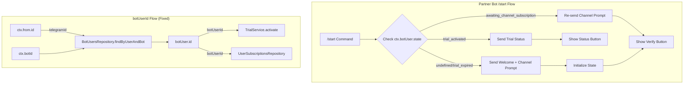

# Partner Bot Flow Improvements Design Document

## Overview

This document defines the technical implementation for improvements to the partner bot flow in `libs/partner-bot`. The improvements address three main areas: (1) state check on `/start` to handle already-activated trials and pending states, (2) trial status button display showing remaining time, and (3) critical bug fix for `botUserId` migration across all partner-bot files. The `TrialService.activate()` is currently being called with `userId` (telegramId) instead of `botUserId` (bot_users.id), which causes incorrect subscription records.

**Key Capabilities:**
- State-aware `/start` command that checks user's current trial status
- Trial status button showing remaining days/hours in activated state
- Pending state handling to re-show channel subscription prompt
- Complete `botUserId` migration throughout partner-bot library

## Background and Context

### Prerequisite ADRs

- **ADR-008: Partner Bot Flow Architecture** (v1.0.0, Proposed) - Core architecture decisions for partner bot flow
- **ADR-009: User Subscriptions Migration from users to bot_users** (v1.0.1, Proposed) - Defines `botUserId` as FK to `bot_users.id`
- **ADR-004: Multi-Bot Database Architecture** - Establishes `bot_users` table and per-bot user patterns

### Common ADRs

- **Message Resolution Pattern**: Follows ADR-004 hierarchy: `bot_messages` -> `messages` -> English fallback -> hardcoded
- **JSONB Configuration Pattern**: Follows ADR-003 pattern for settings extension without schema changes
- **botUserId Pattern**: Per ADR-009, all subscription operations use `bot_users.id` (internal auto-generated ID), NOT `users.telegramId`

### Agreement Checklist

#### Scope
- [x] State check on `/start` command to detect already-activated trials
- [x] Trial status button showing remaining time when trial is already active
- [x] Pending state (`awaiting_channel_subscription`) handling to re-show channel prompt
- [x] Critical bug fix: Replace `userId` with `botUserId` in `TrialService.activate()` call
- [x] Complete `botUserId` migration in all partner-bot files including `reminder-scheduler.service.ts`
- [x] Resolve `botUser` from context or database for subscription operations

#### Non-Scope (Explicitly not changing)
- [x] `TrialService` interface - already expects `botUserId`
- [x] Database schema - no schema changes required
- [x] Standard bot flow (`libs/bot`) - unaffected
- [x] Channel verification logic - remains unchanged
- [x] Trial extension/buy button functionality - placeholder behavior unchanged

#### Constraints
- [x] Parallel operation: Partner bot and standard bot flows coexist independently
- [x] Backward compatibility: No breaking changes to existing partner bots
- [x] Performance measurement: Not required (leverages existing infrastructure)
- [x] Bot context requirement: `botUser` must be available in context via middleware

### Problem to Solve

**Critical Bug**: `PartnerFlowService.handleVerificationRequest()` calls `TrialService.activate(userId)` with `userId` (line 324 in partner-flow.service.ts) where `userId` is the Telegram user ID. However, `TrialService.activate()` expects `botUserId` which is `bot_users.id` (the internal auto-generated ID from the `bot_users` table).

**State Handling Gap**: Current `/start` command always sends welcome and channel prompt without checking if:
1. User already has an active trial (should show status button with remaining time)
2. User is in `awaiting_channel_subscription` state (should re-show channel prompt)

### Current Challenges

1. **Wrong Parameter to TrialService**: `PartnerFlowService` passes `userId` (telegramId) to `TrialService.activate()`, but `TrialService` expects `botUserId` (bot_users.id). This causes:
   - Incorrect subscription records (wrong botUserId)
   - Trial eligibility check failures (looks up wrong ID)

2. **No State Check on /start**: `StartCommandUpdate.handleStart()` always initializes fresh state without checking current state:
   ```typescript
   // Current code (line 84-88)
   await this.botUsersRepository.updateState(userId, botId, {
     verificationState: 'awaiting_channel_subscription',
     verificationAttempts: 0,
     lastVerificationAttempt: new Date(),
   } as any);
   ```

3. **No Trial Status Display**: When trial is already activated, user sees standard welcome instead of status with remaining time.

4. **botUser Not Resolved**: `PartnerFlowService` methods receive `userId` (telegramId) and `botId`, but don't resolve `botUser` to get `botUser.id` for subscription operations.

### Requirements

#### Functional Requirements

**FR-1: State Check on /start**
- On `/start` command, check `bot_users.state.verificationState` before processing
- If state is `trial_activated` and trial is active: show trial status button with remaining time
- If state is `awaiting_channel_subscription`: re-show channel subscription prompt
- If state is `trial_expired` or undefined: proceed with standard welcome flow

**FR-2: Trial Status Button**
- Display button showing trial status and remaining time
- Format: "Trial: X days remaining" or "Trial: Y hours remaining" (for < 1 day)
- Button callback: `partner_trial_status` (informational, no action needed)

**FR-3: Pending State Handling**
- If user is in `awaiting_channel_subscription` state, re-show channel subscription prompt
- Skip welcome message (already seen)
- Keep existing verification attempt counter

**FR-4: botUserId Migration**
- Replace all `userId` (telegramId) parameters with `botUserId` (bot_users.id) in subscription operations
- Resolve `botUser` from context (`ctx.botUser`) or database (`BotUsersRepository.findByUserAndBot()`)
- Update `PartnerFlowService.handleVerificationRequest()` to pass `botUserId` to `TrialService.activate()`
- Update `ReminderSchedulerService` to use `botUser.id` for any subscription operations

#### Non-Functional Requirements

- **Performance**: No additional database queries for state check (use existing `botUser.state` from context)
- **Reliability**: Graceful fallback to welcome flow if state check fails
- **Maintainability**: Clear separation between state check logic and flow execution
- **Type Safety**: Use `BotUser` type properly, avoid `as any` casts

## Acceptance Criteria (AC)

### AC-1: State Check on /start Command
- [ ] When user sends `/start` and has `verificationState: 'trial_activated'` with active trial, bot sends trial status message with remaining time button
- [ ] When user sends `/start` and has `verificationState: 'awaiting_channel_subscription'`, bot re-sends channel subscription prompt (no welcome message)
- [ ] When user sends `/start` with no state or `trial_expired`, bot sends welcome message and channel prompt (existing behavior)
- [ ] State check uses `ctx.botUser.state` from middleware context (no extra DB query)

### AC-2: Trial Status Button Display
- [ ] Trial status button shows "Trial: X days remaining" for >= 1 day
- [ ] Trial status button shows "Trial: Y hours remaining" for < 1 day remaining
- [ ] Button callback data is `partner_trial_status`
- [ ] Trial status message retrieved from `bot_messages` type `partner_trial_status`

### AC-3: Pending State Handling
- [ ] User in `awaiting_channel_subscription` state sees channel prompt on `/start`
- [ ] Welcome message is NOT re-sent for pending users
- [ ] Verification attempt counter is preserved (not reset)
- [ ] "I subscribed" button is displayed for retry

### AC-4: botUserId Migration - Critical Bug Fix
- [ ] `PartnerFlowService.handleVerificationRequest()` resolves `botUser` and passes `botUser.id` to `TrialService.activate()`
- [ ] `PartnerFlowService.sendChannelPrompt()` uses `botUserId` for state operations
- [ ] `PartnerFlowService.sendTrialUI()` uses `botUserId` for state operations
- [ ] All methods that need `botUserId` either receive it as parameter or resolve it from `BotUsersRepository`

### AC-5: ReminderSchedulerService Migration
- [ ] `ReminderSchedulerService.processExpiredTrials()` uses `botUser.id` from query results
- [ ] Reminder sending uses `botUser.userId` (telegramId) for Telegram API, `botUser.id` for subscriptions
- [ ] No `userId` (telegramId) used where `botUserId` (bot_users.id) is expected

### AC-6: Context Integration
- [ ] `PartnerBotContext.botUser` is properly typed and available in handlers
- [ ] Middleware attaches `botUser` to context before handlers execute
- [ ] Handlers can access `ctx.botUser?.id` for `botUserId`

## Existing Codebase Analysis

### Implementation Path Mapping

| Type | Path | Description |
|------|------|-------------|
| Existing | `libs/partner-bot/src/commands/start/start.update.ts` | /start command handler - needs state check |
| Existing | `libs/partner-bot/src/services/partner-flow.service.ts` | Flow orchestration - critical bug location |
| Existing | `libs/partner-bot/src/actions/channel-verification.action.ts` | Verification handler - uses userId |
| Existing | `libs/partner-bot/src/actions/trial-ui.action.ts` | Trial UI buttons - needs status handler |
| Existing | `libs/partner-bot/src/services/channel-verifier.service.ts` | Verification service - uses userId/botId |
| Existing | `libs/partner-bot/src/services/reminder-scheduler.service.ts` | Reminder cron - uses botUser from query |
| Existing | `libs/partner-bot/src/interfaces/index.ts` | Context interface - has botUser |
| Existing | `libs/bot/src/services/trial.service.ts` | Trial service - expects botUserId |
| Existing | `libs/db/src/repositories/bot-users.repository.ts` | BotUser resolution |
| Existing | `libs/db/src/repositories/user-subscriptions.repository.ts` | Subscription queries |
| New | `libs/partner-bot/src/actions/trial-status.action.ts` | Optional: trial status button handler |

### Integration Points

#### Integration Point 1: StartCommandUpdate State Check
- **Existing Component**: `libs/partner-bot/src/commands/start/start.update.ts`
- **Integration Method**: Add state check before welcome flow
- **Impact Level**: Medium (Flow control change)
- **Required Test Coverage**: Unit tests for each state branch

#### Integration Point 2: PartnerFlowService botUserId Resolution
- **Existing Component**: `libs/partner-bot/src/services/partner-flow.service.ts`
- **Methods Affected**:
  - `handleVerificationRequest()` - Line 324 calls `TrialService.activate(userId)` - **CRITICAL BUG**
  - `sendChannelPrompt()` - Uses `userId` for state update
  - `sendTrialUI()` - No subscription operation, but should have consistent parameter naming
- **Integration Method**: Resolve `botUser` via `BotUsersRepository.findByUserAndBot()` to get `botUser.id`
- **Impact Level**: High (Critical bug fix)
- **Required Test Coverage**: Unit tests verifying correct `botUserId` passed to TrialService

#### Integration Point 3: Context botUser Availability
- **Existing Component**: `libs/partner-bot/src/interfaces/index.ts`
- **Current Definition**: `botUser?: BotUser` (already defined)
- **Integration Method**: Ensure middleware populates `ctx.botUser` before handlers
- **Impact Level**: Low (Already available per interface definition)
- **Required Test Coverage**: Integration test verifying `ctx.botUser` populated

### Similar Functionality Search Results

**Domain**: State-aware command handling
**Search Keywords**: "state", "verificationState", "bot_users.state"

**Found Implementations**:
1. `ChannelVerificationAction.handleVerify()` - Reads state to check rate limiting
   - **Pattern**: Uses `botUser?.state?.sceneData` for state access
   - **Decision**: Follow same pattern for state check in StartCommandUpdate

2. `UserManagementMiddleware` - Attaches `botUser` to context (line 114)
   - **Pattern**: `(ctx as UserContext & { botUser?: BotUser }).botUser = botUser;`
   - **Decision**: `ctx.botUser` should be available in partner-bot handlers

**Domain**: botUserId usage pattern
**Search Keywords**: "botUserId", "botUser.id", "TrialService.activate"

**Found Implementations**:
1. `TrialService.activate(botUserId)` - Expects `bot_users.id`
   - **Current Bug**: `PartnerFlowService` passes `userId` (telegramId) instead
   - **Fix**: Resolve `botUser` and pass `botUser.id`

2. `UserManagementMiddleware.loadUserWithSubscriptions()` - Uses `botUser.id` correctly
   - **Pattern**: `findActiveByBotUserIdWithSubscription(botUser.id)`
   - **Decision**: Follow same pattern

## Design

### Change Impact Map

```yaml
Change Target: Partner Bot /start Flow and botUserId Migration
Direct Impact:
  - libs/partner-bot/src/commands/start/start.update.ts (add state check)
  - libs/partner-bot/src/services/partner-flow.service.ts (fix botUserId bug)
  - libs/partner-bot/src/actions/channel-verification.action.ts (verify botUserId usage)
  - libs/partner-bot/src/actions/trial-ui.action.ts (add status handler)
  - libs/partner-bot/src/services/reminder-scheduler.service.ts (verify botUserId usage)
Indirect Impact:
  - Trial activation now creates correct subscription records (bug fix impact)
  - Trial eligibility check works correctly (bug fix impact)
No Ripple Effect:
  - TrialService (already expects botUserId)
  - Database schema (no changes)
  - Standard bot flow (libs/bot)
  - Channel verification logic
```

### Architecture Overview

The fix follows the existing multi-bot architecture pattern where:
1. Middleware attaches `botUser` to context (`ctx.botUser`)
2. Handlers access `ctx.botUser.id` for `botUserId` (subscription operations)
3. Handlers access `ctx.from.id` for `userId`/telegramId (Telegram API calls)



### Data Flow

#### Flow 1: State-Aware /start Command

```
User sends /start
    |
    v
StartCommandUpdate.handleStart(ctx)
    |
    +--> Get ctx.botUser from middleware context
    |
    +--> Check ctx.botUser?.state?.verificationState
         |
         +-- 'trial_activated' --> Check trial expiry
         |                              |
         |                              +--> Active? --> sendTrialStatus(ctx, botUser)
         |                              |
         |                              +--> Expired? --> sendWelcome + sendChannelPrompt
         |
         +-- 'awaiting_channel_subscription' --> sendChannelPrompt (no welcome)
         |
         +-- undefined/other --> sendWelcome + initState + sendChannelPrompt
```

#### Flow 2: Fixed botUserId Resolution

```
handleVerificationRequest(userId, botId)
    |
    v
Resolve botUser:
    botUser = await botUsersRepository.findByUserAndBot(userId, botId)
    |
    v
Get botUserId:
    botUserId = botUser.id  // bot_users.id (auto-generated)
    |
    v
Call TrialService:
    await trialService.activate(botUserId)  // Now correct!
```

### Integration Points List

| Integration Point | Location | Old Implementation | New Implementation | Switching Method |
|-------------------|----------|-------------------|-------------------|------------------|
| /start state check | `StartCommandUpdate.handleStart()` | Always send welcome + prompt | Check state first, branch by state | Direct code change |
| Trial activation | `PartnerFlowService.handleVerificationRequest()` | `trialService.activate(userId)` | `trialService.activate(botUser.id)` | Direct code change |
| State update | `PartnerFlowService.sendChannelPrompt()` | `updateState(userId, botId, ...)` | Keep (already correct - uses userId/botId) | No change needed |
| botUser resolution | `PartnerFlowService` methods | Not resolved | Resolve via `BotUsersRepository` | Add resolution step |

### Main Components

#### Component 1: StartCommandUpdate (Modified)

**Responsibility:**
- Handle `/start` command with state awareness
- Branch flow based on current verification state
- Show appropriate UI for each state

**Interface Changes:**
```typescript
// New method to add
private async sendTrialStatus(
  ctx: PartnerBotContext,
  botUser: BotUser,
  lang: string,
): Promise<void>;

// Modified method
async handleStart(@Ctx() ctx: PartnerBotContext): Promise<void>;
// Add state check logic before existing flow
```

**Key Logic:**
```typescript
// State check at start of handleStart()
const botUser = ctx.botUser;
if (botUser?.state?.verificationState === 'trial_activated') {
  // Check if trial is still active
  const subscriptions = await userSubscriptionsRepository.findActiveByBotUserId(botUser.id);
  if (subscriptions.length > 0) {
    await this.sendTrialStatus(ctx, botUser, lang);
    return;
  }
}

if (botUser?.state?.verificationState === 'awaiting_channel_subscription') {
  // Re-show channel prompt without welcome
  await this.partnerFlowService.sendChannelPrompt(userId, botId, lang);
  return;
}

// Continue with existing welcome flow...
```

#### Component 2: PartnerFlowService (Modified)

**Responsibility:**
- Orchestrate partner flow with correct `botUserId`
- Resolve `botUser` for subscription operations

**Interface Changes:**
```typescript
// Current (BUG):
async handleVerificationRequest(
  userId: number,  // telegramId
  botId: number,
): Promise<VerificationResult>;

// Fixed approach - resolve botUser internally:
async handleVerificationRequest(
  userId: number,  // telegramId (keep for compatibility)
  botId: number,
): Promise<VerificationResult> {
  // Resolve botUser to get botUserId
  const botUser = await this.botUsersRepository.findByUserAndBot(userId, botId);
  if (!botUser) {
    return { verified: false, error: 'User not found' };
  }

  // ... later in method ...

  // FIXED: Use botUser.id instead of userId
  const activationResult = await this.trialService.activate(botUser.id);
}
```

**Critical Fix Location (line 324):**
```typescript
// BEFORE (BUG):
const activationResult = await this.trialService.activate(userId);

// AFTER (FIXED):
const botUser = await this.botUsersRepository.findByUserAndBot(userId, botId);
if (!botUser) {
  return { verified: false, error: 'User context not found' };
}
const activationResult = await this.trialService.activate(botUser.id);
```

#### Component 3: TrialUIAction (Modified)

**Responsibility:**
- Handle trial UI button callbacks
- Add trial status button handler

**Interface Changes:**
```typescript
// New action handler
@Action('partner_trial_status')
async handleTrialStatus(@Ctx() ctx: PartnerBotContext): Promise<void>;
```

### Type Definitions

```typescript
// libs/partner-bot/src/types/partner-settings.ts

/**
 * Extended verification state for partner flow
 */
export type VerificationState =
  | 'awaiting_channel_subscription'
  | 'channel_verified'
  | 'trial_activated'
  | 'trial_expired';

/**
 * Partner flow scene data stored in bot_users.state.sceneData
 */
export interface PartnerFlowSceneData extends Record<string, unknown> {
  verificationState?: VerificationState;
  verificationAttempts?: number;
  lastVerificationAttempt?: Date | string;
  trialActivatedAt?: Date | string;
  trialExpiresAt?: Date | string;
}

/**
 * Trial status display format
 */
export interface TrialStatusDisplay {
  remainingDays: number;
  remainingHours: number;
  displayText: string;  // "X days remaining" or "Y hours remaining"
  expiresAt: Date;
}
```

### Data Contract

#### Component: StartCommandUpdate.handleStart

```yaml
Input:
  Type: PartnerBotContext
  Preconditions:
    - ctx.from exists (Telegram user)
    - ctx.botId exists (dynamic bot)
    - ctx.botUser exists (from middleware)
  Validation:
    - Check ctx.from, ctx.botId for null

Output:
  Type: Promise<void>
  Guarantees:
    - If trial_activated with active trial: Status message sent
    - If awaiting_channel_subscription: Channel prompt re-sent
    - Otherwise: Welcome + channel prompt sent
  On Error:
    - Log error, send generic error message to user

Invariants:
  - User always receives a response
  - State is not corrupted by /start command
```

#### Component: PartnerFlowService.handleVerificationRequest

```yaml
Input:
  Type: { userId: number, botId: number }
  Preconditions:
    - userId is valid Telegram user ID
    - botId is valid bot database ID
    - bot_users record exists for (userId, botId)
  Validation:
    - Resolve botUser, return error if not found

Output:
  Type: Promise<VerificationResult>
  Guarantees:
    - If verified: TrialService.activate called with botUser.id (NOT userId)
    - Subscription created with correct botUserId
    - State updated appropriately
  On Error:
    - Return { verified: false, error: string }

Invariants:
  - TrialService always receives botUserId (bot_users.id)
  - Never pass telegramId to subscription operations
```

### State Transitions and Invariants

```yaml
State Definition:
  Initial State: undefined (no state)
  Possible States:
    - awaiting_channel_subscription: User received channel prompt
    - channel_verified: User passed channel verification
    - trial_activated: Trial successfully activated
    - trial_expired: Trial has expired

State Transitions on /start:
  undefined -> send welcome -> awaiting_channel_subscription
  awaiting_channel_subscription -> re-send channel prompt (no state change)
  trial_activated (active) -> send trial status (no state change)
  trial_activated (expired) -> send welcome -> awaiting_channel_subscription (reset)
  trial_expired -> send welcome -> awaiting_channel_subscription (reset)

System Invariants:
  - botUserId used for all subscription operations
  - userId (telegramId) used for Telegram API calls
  - State persists across /start commands
  - Trial status reflects actual subscription expiry
```

### Error Handling

**Error Categories:**

1. **Missing Context:**
   - `ctx.botUser` undefined: Fall back to welcome flow (middleware may have failed)
   - `ctx.botId` undefined: Send error message, log warning

2. **botUser Resolution Failure:**
   - `findByUserAndBot()` returns null: Return verification error, log warning
   - This shouldn't happen if middleware worked correctly

3. **Trial Status Check Failure:**
   - Subscription query fails: Fall back to welcome flow
   - Empty subscription list: Treat as expired trial

4. **Database Errors:**
   - State update fails: Log error, continue with flow
   - Subscription creation fails: Return error to user

### Logging and Monitoring

**Log Points:**
```typescript
// State check
this.logger.debug({
  message: 'State check on /start',
  userId,
  botId,
  verificationState: botUser?.state?.verificationState,
});

// Trial status display
this.logger.log({
  message: 'Showing trial status',
  userId,
  botId,
  remainingDays,
});

// botUserId resolution
this.logger.debug({
  message: 'Resolved botUserId for trial activation',
  userId,  // telegramId
  botId,
  botUserId: botUser.id,  // What TrialService receives
});

// Critical bug fix verification
this.logger.log({
  message: 'Trial activated with botUserId',
  botUserId: botUser.id,  // Should be small integer like 1, 2, 3...
  // NOT large telegramId like 123456789
});
```

## Implementation Plan

### Implementation Approach

**Selected Approach:** Vertical Slice (Feature-Driven)

**Selection Reason:**
1. **Critical Bug First:** botUserId fix is blocking correct trial functionality
2. **User Value Per Phase:** Each phase delivers working end-user functionality
3. **Low Risk:** Changes are isolated to partner-bot library

### Technical Dependencies and Implementation Order

#### Required Implementation Order

1. **Task 1: Fix botUserId Bug in PartnerFlowService** (L1 Verification)
   - **Technical Reason**: Critical bug must be fixed first - all trial activations are broken
   - **Files**: `libs/partner-bot/src/services/partner-flow.service.ts`
   - **Changes**:
     - Add `botUsersRepository` dependency if not already present
     - Resolve `botUser` in `handleVerificationRequest()` before calling `TrialService.activate()`
     - Pass `botUser.id` instead of `userId` to `trialService.activate()`
   - **Verification**: Unit test with mock verifying correct parameter passed

2. **Task 2: Add State Check in StartCommandUpdate** (L1 Verification)
   - **Technical Reason**: Depends on correct trial activation (Task 1) for status check
   - **Files**: `libs/partner-bot/src/commands/start/start.update.ts`
   - **Changes**:
     - Add `UserSubscriptionsRepository` dependency
     - Add state check at start of `handleStart()`
     - Implement branching logic for each state
   - **Verification**: Manual test with different user states

3. **Task 3: Implement Trial Status Display** (L1 Verification)
   - **Technical Reason**: Depends on state check (Task 2)
   - **Files**:
     - `libs/partner-bot/src/commands/start/start.update.ts` (add sendTrialStatus method)
     - `libs/partner-bot/src/actions/trial-ui.action.ts` (add status handler)
   - **Changes**:
     - Add `sendTrialStatus()` private method
     - Calculate remaining time display
     - Add `partner_trial_status` action handler
   - **Verification**: Manual test showing correct remaining time

4. **Task 4: Verify ReminderSchedulerService** (L3 Verification)
   - **Technical Reason**: Ensure consistency across all partner-bot files
   - **Files**: `libs/partner-bot/src/services/reminder-scheduler.service.ts`
   - **Changes**: Review and verify `botUser.id` vs `botUser.userId` usage
   - **Verification**: Code review, existing tests should pass

5. **Task 5: Update Unit Tests** (L2 Verification)
   - **Technical Reason**: Ensure all changes are covered
   - **Files**: `libs/partner-bot/src/*/__tests__/*.spec.ts`
   - **Verification**: All tests pass with `npm test`

### Integration Points

**Integration Point 1: botUserId Fix**
- Components: `PartnerFlowService` -> `BotUsersRepository` -> `TrialService`
- Verification:
  1. Add debug log showing `botUser.id` value passed to `TrialService`
  2. Verify value is small integer (1, 2, 3) not large telegramId
  3. Check `user_subscriptions.bot_user_id` in database after activation

**Integration Point 2: State Check Flow**
- Components: `StartCommandUpdate` -> `ctx.botUser` -> `UserSubscriptionsRepository`
- Verification:
  1. Test `/start` with user in `trial_activated` state - should show status
  2. Test `/start` with user in `awaiting_channel_subscription` - should show prompt
  3. Test `/start` with new user - should show welcome + prompt

### Migration Strategy

No migration required - this is a bug fix and enhancement within existing codebase.

**Rollback Strategy:**
- If issues discovered, revert the commit
- No database changes to rollback
- No breaking changes to external interfaces

## Test Strategy

### Basic Test Design Policy

Each acceptance criterion maps to test cases:
- AC-1 through AC-3: Unit tests for state check branches
- AC-4 through AC-5: Unit tests for botUserId usage
- AC-6: Integration test for context availability

### Unit Tests

**PartnerFlowService Tests** (`partner-flow.service.spec.ts`):
```typescript
describe('handleVerificationRequest', () => {
  it('should call TrialService.activate with botUser.id (NOT userId)', async () => {
    // Arrange
    const userId = 123456789; // telegramId (large number)
    const botId = 1;
    const botUser = { id: 42 }; // botUser.id (small number)
    mockBotUsersRepository.findByUserAndBot.mockResolvedValue(botUser);

    // Act
    await service.handleVerificationRequest(userId, botId);

    // Assert
    expect(mockTrialService.activate).toHaveBeenCalledWith(42); // NOT 123456789
  });
});
```

**StartCommandUpdate Tests** (`start.update.spec.ts`):
```typescript
describe('handleStart', () => {
  it('should show trial status when state is trial_activated with active trial', async () => {
    // Setup ctx.botUser with trial_activated state
    // Mock active subscription
    // Assert status message sent
  });

  it('should re-send channel prompt when state is awaiting_channel_subscription', async () => {
    // Setup ctx.botUser with awaiting state
    // Assert prompt sent, welcome NOT sent
  });

  it('should send welcome and prompt when no state', async () => {
    // Setup ctx.botUser with no state
    // Assert welcome sent, then prompt sent
  });
});
```

### Integration Tests

**Partner Flow Integration** (if exists):
- Test complete `/start` -> verify -> activate flow
- Verify database records have correct `bot_user_id`

### E2E Tests

Manual testing scenarios:
1. New user: `/start` -> welcome -> prompt -> verify -> success
2. Returning user (active trial): `/start` -> status button
3. Returning user (pending): `/start` -> prompt (no welcome)
4. Verify `user_subscriptions.bot_user_id` matches `bot_users.id`

### Performance Tests

Not required - no performance-critical changes.

## Security Considerations

- No new security concerns
- botUserId is internal ID, not exposed to users
- Telegram API calls still use correct userId (telegramId)

## Future Extensibility

**Potential Future Enhancements:**
1. Add "Check Subscription" command to manually view status
2. Add notification when trial is about to expire (1 day warning)
3. Support multiple trial types with different durations

## Alternative Solutions

### Alternative 1: Pass botUserId Through All Method Signatures

- **Overview**: Change all method signatures to accept `botUserId` instead of resolving internally
- **Advantages**: Clearer data flow, no internal resolution
- **Disadvantages**: Breaking change to existing interfaces, more refactoring
- **Reason for Rejection**: Internal resolution is less intrusive and maintains backward compatibility

### Alternative 2: Store botUserId in State

- **Overview**: Store `botUserId` in `bot_users.state` when user first interacts
- **Advantages**: Available without database lookup
- **Disadvantages**: State could become stale, adds redundant data
- **Reason for Rejection**: Better to resolve from authoritative source (database)

## Risks and Mitigation

| Risk | Impact | Probability | Mitigation |
|------|--------|-------------|------------|
| `ctx.botUser` not available | High | Low | Fall back to database resolution, add error logging |
| State check adds latency | Low | Low | Use cached `ctx.botUser.state`, no extra DB query |
| Incorrect botUserId still passed | High | Low | Add logging to verify correct value, unit tests |
| Breaking existing tests | Medium | Medium | Update tests to match new behavior |

## References

### Prerequisite Documents
- **ADR-008**: `docs/adr/ADR-008-partner-bot-flow-architecture.md`
- **ADR-009**: `docs/adr/ADR-009-user-subscriptions-bot-users-migration.md`
- **Partner Bot Flow Design**: `docs/design/partner-bot-flow-design.md` (v1.1.0)

### Existing Codebase References
- `libs/bot/src/services/trial.service.ts` - TrialService expecting botUserId
- `libs/bot/src/middleware/user-management.middleware.ts` - botUser attachment to context
- `libs/db/src/repositories/bot-users.repository.ts` - BotUser resolution
- `libs/db/src/repositories/user-subscriptions.repository.ts` - Subscription queries

## Documentation Consistency Notes

### PRD/ADR Update Required (Follow-up Tasks)

1. **PRD Update (partner-bot-flow-prd.md)**: Section "Integration Points" shows `TrialService.activate(userId)` but correct signature per ADR-009 is `activate(botUserId)`. Update to v1.2.0 required after this implementation.

2. **ADR-008 Update**: Decision 6 shows wrapper pattern calling `trialService.activate(userId, botId)` - incorrect. Actual signature is `activate(botUserId)`. ADR-008 needs update to reflect correct parameter.

### Message Type Handling

The `partner_trial_status` button callback is an **informational action** that does not require a separate message type. When user clicks the button:
- Handler acknowledges callback (answerCbQuery)
- No separate message sent (status is already displayed)
- Existing trial status text on button serves as the message

No SQL INSERT for new message type required.

### AC-5 Clarification (ReminderSchedulerService)

Based on code review, `ReminderSchedulerService` already uses correct patterns:
- Uses `botUser.userId` for Telegram API calls (sending messages)
- Uses `botUser` from query results (which includes `botUser.id`)

AC-5 is a **verification task** confirming existing implementation is correct, not a change task.

## Update History

| Date | Version | Changes | Author |
|------|---------|---------|--------|
| 2025-12-04 | 1.0 | Initial version | Claude Code Design Agent |
| 2025-12-04 | 1.1 | Added documentation consistency notes, clarified AC-5 | Claude Code Orchestrator |

---

**Document Version:** 1.1.0
**Created:** 2025-12-04
**Last Updated:** 2025-12-04
**Status:** Proposed
**Related Documents:** ADR-008 v1.0.0, ADR-009 v1.0.1, partner-bot-flow-design.md v1.1.0
**Estimated Scope:** Medium (4-5 files)
**Implementation Mode:** Vertical Slice (Feature-Driven)
