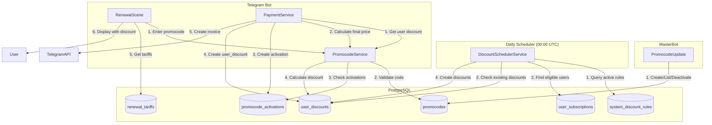
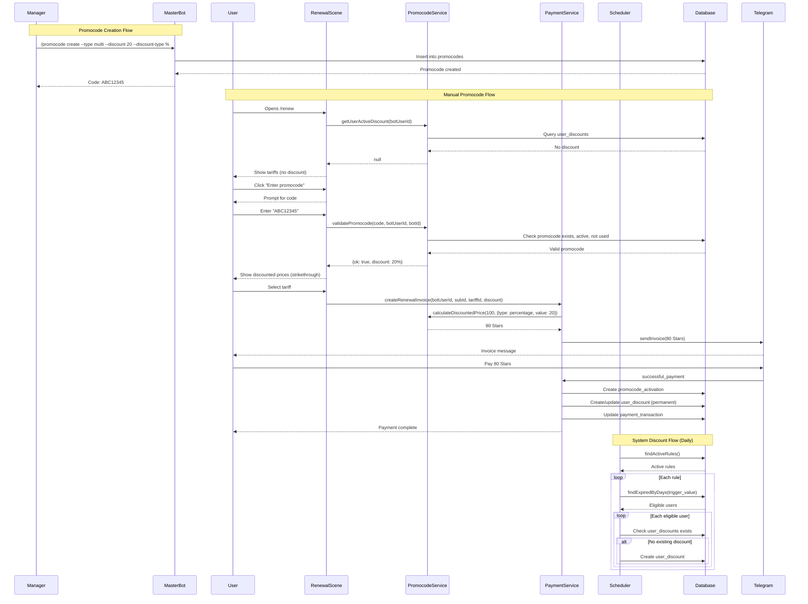
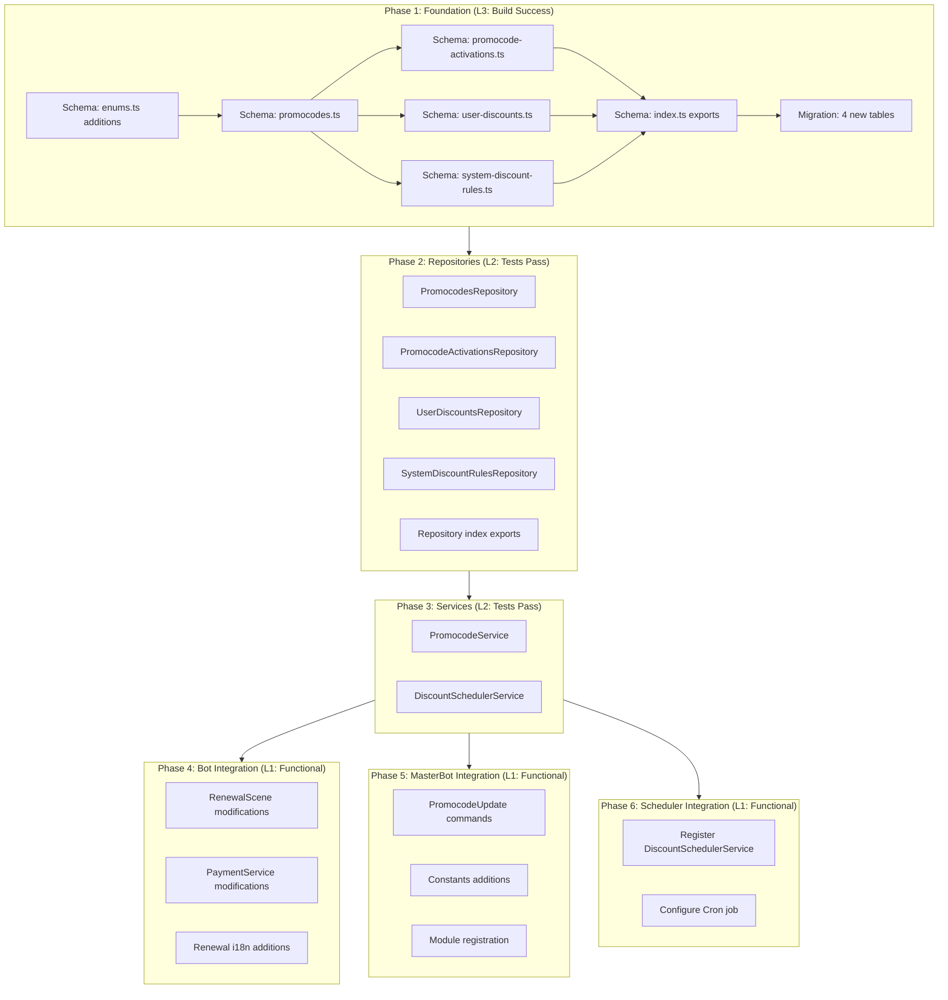

# Promocode Discount System Design Document

## Overview

The Promocode Discount System enables subscription renewal cost reduction through user-entered promotional codes and system-generated automatic discounts. This system supports percentage and fixed-amount discounts with flexible activation rules, manager-isolated promocode management, and automatic win-back campaigns for expired subscribers.

## Background and Context

### Prerequisite ADRs

- **ADR-010-promocode-discount-system.md**: Architecture decisions for discount storage (Option B: user_discounts table), discount calculation (maximum selection), validation approach (synchronous database), system rules processing (scheduler-based daily), and multi-bot scoping (nullable bot_id)
- **ADR-COMMON-telegram-stars-payment.md**: Payment state machine and invoice handling patterns
- **ADR-009-user-subscriptions-bot-users-migration.md**: User subscription data model with bot_users relationship
- **ADR-004-multi-bot-architecture.md**: Multi-bot support patterns (global vs bot-specific)

### Agreement Checklist

#### Scope

- [x] Create `promocodes` table for promocode definitions
- [x] Create `promocode_activations` table for user activation tracking
- [x] Create `user_discounts` table for permanent user discounts
- [x] Create `system_discount_rules` table for automatic discount configuration
- [x] Add new enums: `DiscountType`, `TriggerType`, `PromocodeType`
- [x] Implement `PromocodeService` for validation, activation, and discount calculation
- [x] Implement `DiscountSchedulerService` for daily processing of system rules
- [x] Integrate promocode entry in RenewalScene ("Enter promocode" button)
- [x] Display discounted prices with strikethrough original prices
- [x] Integrate discount calculation in PaymentService
- [x] Implement MasterBot `/promocode` commands (create, list, deactivate)
- [x] Manager isolation (managers see only their own promocodes)
- [x] Support percentage and fixed Stars amount discounts
- [x] Support global (bot_id = NULL) and bot-specific promocodes
- [x] Maximum discount selection (not additive)
- [x] Minimum price floor: 1 Star

#### Non-Scope (Explicitly not changing)

- [x] Discount stacking (multiple discounts combined)
- [x] Separate /promo command (integrated into renewal flow only)
- [x] Time-limited discounts after activation (once assigned, permanent)
- [x] Referral program integration
- [x] Loyalty points system
- [x] Promotional push notifications
- [x] MasterBot commands for system_discount_rules (database config only)

#### Constraints

- [x] Parallel operation: No (clean implementation)
- [x] Backward compatibility: Not applicable (new feature)
- [x] Performance measurement: Required (< 100ms validation, < 50ms calculation)
- [x] Manager isolation: Required (created_by filter on all queries)

### Problem to Solve

The Quantum Deal platform currently lacks a promotional discount mechanism for subscription renewals. Users pay via Telegram Stars, but there is no way to:
1. Run marketing campaigns with promotional codes
2. Offer win-back discounts to expired subscribers
3. Provide flexible pricing with both percentage and fixed discounts

### Current Challenges

1. **No promocode system**: No mechanism for user-entered promotional codes
2. **No automated win-back**: Expired users receive no automatic incentive to resubscribe
3. **No user-specific discounts**: Existing `discountPercent` on tariffs is UI display only
4. **No manager isolation**: No concept of promocode ownership for multi-manager scenarios

### Requirements

#### Functional Requirements (from PRD)

- **FR-001**: Support single-use promocodes (deactivated globally after first activation)
- **FR-002**: Support multi-use promocodes (one use per user, unlimited total users)
- **FR-003**: Support system promocodes (automatically applied based on rules)
- **FR-004**: Support percentage discounts (e.g., 20% off)
- **FR-005**: Support fixed Stars amount discounts (e.g., -50 Stars)
- **FR-006**: Apply maximum discount when multiple are available (not additive)
- **FR-007**: User can have only one active promocode at a time
- **FR-008**: System discounts are permanent (apply to all future renewals forever)
- **FR-009**: Display "Enter promocode" button in renewal scene
- **FR-010**: Validate promocode and show result
- **FR-011**: Display discounted price after promocode applied (strikethrough format)
- **FR-012**: Show both original and discounted prices in tariff cards
- **FR-013**: Create promocode with parameters (type, discount, scope) via MasterBot
- **FR-014**: List promocodes created by current manager only
- **FR-015**: Deactivate own promocodes only
- **FR-016**: Configure trigger conditions via database (N days after expiration)
- **FR-017**: Automatically assign permanent discount via scheduler
- **FR-018**: Support multiple rules with different triggers and discounts
- **FR-019**: Support global promocodes (bot_id = NULL)
- **FR-020**: Support bot-specific promocodes
- **FR-021**: Bot-specific rules take precedence over global

#### Non-Functional Requirements

- **Performance**: Promocode validation < 100ms, discount calculation < 50ms, scheduler full run < 5 minutes
- **Scalability**: Indexed queries for efficient lookups, batch processing in scheduler
- **Reliability**: Idempotent processing, atomic operations, unique constraints
- **Maintainability**: Clear separation of concerns, comprehensive logging
- **Security**: Cryptographically random code generation, manager access control

## Acceptance Criteria (AC)

### Promocode Entry and Validation

- [ ] AC-001: When user clicks "Enter promocode" button in renewal scene, a text input prompt appears
- [ ] AC-002: When user enters a valid promocode, success message shows discount details (type and value)
- [ ] AC-003: When user enters an invalid/expired/used promocode, error message shows specific reason
- [ ] AC-004: When promocode is validated, discounted prices display with strikethrough original prices
- [ ] AC-005: When user navigates within renewal scene after applying promocode, discount state persists

### Promocode Activation

- [ ] AC-006: When single-use promocode is activated by any user, it becomes inactive for all users
- [ ] AC-007: When multi-use promocode is activated by a user, it remains active but unavailable for that user
- [ ] AC-008: When user activates promocode, activation record is created in `promocode_activations`
- [ ] AC-009: When user already has a discount for subscription, new promocode replaces it (not additive)

### Discount Calculation

- [ ] AC-010: When user has percentage discount, final price = original - (original * discount_value / 100), floored
- [ ] AC-011: When user has fixed discount, final price = original - discount_value
- [ ] AC-012: When calculated price < 1 Star, final price = 1 Star (minimum floor)
- [ ] AC-013: When user has multiple available discounts, maximum savings discount is selected

### System Discount Rules

- [ ] AC-014: When scheduler runs at 00:00 UTC, users with expired subscriptions matching rule criteria receive discount
- [ ] AC-015: When user already has discount for subscription, no duplicate discount is created (idempotent)
- [ ] AC-016: When multiple rules match a user, bot-specific rule takes precedence over global
- [ ] AC-017: When rule is deactivated (is_active=false), no new discounts are assigned from that rule

### Payment Integration

- [ ] AC-018: When creating invoice, amount reflects user's applicable discount
- [ ] AC-019: When payment completes, discount continues to apply to future renewals (permanent)
- [ ] AC-020: When pre-checkout validation runs, discount is re-validated for accuracy

### MasterBot Commands

- [ ] AC-021: When manager runs `/promocode create`, promocode is created with specified parameters
- [ ] AC-022: When manager runs `/promocode list`, only their own promocodes are displayed
- [ ] AC-023: When manager runs `/promocode deactivate <code>`, only their own promocodes can be deactivated
- [ ] AC-024: When promocode is auto-generated, code is 8 uppercase alphanumeric characters

### Multi-Bot Support

- [ ] AC-025: When global promocode (bot_id=NULL) is used, it works across all bots
- [ ] AC-026: When bot-specific promocode is used in wrong bot, validation fails with appropriate error
- [ ] AC-027: When bot-specific and global discounts both apply, bot-specific takes precedence

## Existing Codebase Analysis

### Implementation Path Mapping

| Type | Path | Description |
|------|------|-------------|
| Existing | `libs/db/src/schema/enums.ts` | Database enums (will add new enums) |
| Existing | `libs/db/src/schema/index.ts` | Schema exports (will add new exports) |
| Existing | `libs/db/src/schema/bot-users.ts` | Bot user schema (FK target for user_discounts) |
| Existing | `libs/db/src/schema/subscriptions.ts` | Subscriptions schema (FK target) |
| Existing | `libs/db/src/schema/managers.ts` | Managers schema (FK target for created_by) |
| Existing | `libs/db/src/schema/bots.ts` | Bots schema (FK target for bot_id) |
| Existing | `libs/db/src/repositories/index.ts` | Repository exports (will add new exports) |
| Existing | `libs/db/src/repositories/base.repository.ts` | Base repository pattern |
| Existing | `libs/db/src/repositories/user-subscriptions.repository.ts` | Has findExpired() method |
| Existing | `libs/bot/src/services/payment.service.ts` | Payment invoice creation |
| Existing | `libs/bot/src/commands/renew/renewal.scene.ts` | Renewal UI with price display |
| Existing | `libs/masterbot/src/masterbot.update.ts` | MasterBot command handlers |
| Existing | `libs/masterbot/src/middleware/managers.middleware.ts` | Manager authentication |
| New | `libs/db/src/schema/promocodes.ts` | Promocode definitions |
| New | `libs/db/src/schema/promocode-activations.ts` | User activation tracking |
| New | `libs/db/src/schema/user-discounts.ts` | Permanent user discounts |
| New | `libs/db/src/schema/system-discount-rules.ts` | Automatic discount rules |
| New | `libs/db/src/repositories/promocodes.repository.ts` | Promocode CRUD |
| New | `libs/db/src/repositories/promocode-activations.repository.ts` | Activation tracking |
| New | `libs/db/src/repositories/user-discounts.repository.ts` | User discount CRUD |
| New | `libs/db/src/repositories/system-discount-rules.repository.ts` | Rule management |
| New | `libs/bot/src/services/promocode.service.ts` | Validation, activation, calculation |
| New | `libs/bot/src/services/discount-scheduler.service.ts` | Daily system rules processing |
| New | `libs/masterbot/src/promocode.update.ts` | MasterBot promocode commands |

### Integration Points

| Integration Point | Location | Old Implementation | New Implementation | Switching Method |
|-------------------|----------|-------------------|-------------------|------------------|
| Price display | `renewal.scene.ts:showAllTariffs()` | Uses `tariff.discountPercent` for badge display | Check `user_discounts` + active promocode for user discount | Replace logic in showAllTariffs |
| Payment amount | `payment.service.ts:createRenewalInvoice()` | Uses `tariff.priceStars` directly | Calculate discounted price via PromocodeService | DI + method call before invoice |
| Pre-checkout | `payment.service.ts:validatePreCheckout()` | Validates amount matches transaction | Re-validate discount and compare amounts | Additional validation step |
| MasterBot commands | `masterbot.update.ts` | No promocode commands | New `PromocodeUpdate` with /promocode commands | New @Update() class |
| Scheduler | N/A | No discount scheduler | New `DiscountSchedulerService` using @Cron | New service registration |

### Similar Functionality Search

**Search Keywords**: discount, promocode, coupon, activation, scheduler, cron

**Results**:
1. `renewal-tariffs.ts:discountPercent` - Static tariff-level discount badge (UI display only, NOT user-specific)
2. `automatic-discounts-design.md` - Related design for system discounts (will REUSE patterns)
3. `reminder-scheduler.service.ts` - Scheduler pattern with `@Cron` decorator (REUSE pattern)
4. `user-subscriptions.repository.ts:findExpired()` - Query for expired subscriptions (REUSE method)
5. `codes.repository.ts` - Activation code pattern (REFERENCE for unique code generation)
6. `masterbot.update.ts:generateCode()` - Random code generation (REUSE pattern)

**Decision**: Create new implementation following existing patterns:
- Schema follows `bot-users.ts` and `user-subscriptions.ts` patterns
- Repositories follow `base.repository.ts` pattern
- Scheduler follows `reminder-scheduler.service.ts` pattern
- MasterBot commands follow `masterbot.update.ts` pattern

## Design

### Change Impact Map

```yaml
Change Target: Promocode Discount System
Direct Impact:
  - libs/db/src/schema/enums.ts (add DiscountType, TriggerType, PromocodeType enums)
  - libs/db/src/schema/index.ts (export new schemas)
  - libs/db/src/repositories/index.ts (export new repositories)
  - libs/bot/src/commands/renew/renewal.scene.ts (add promocode entry, price display)
  - libs/bot/src/commands/renew/renewal.i18n.ts (add i18n messages)
  - libs/bot/src/services/payment.service.ts (discount calculation in invoice)
  - libs/masterbot/src/masterbot.module.ts (register new update handler)
  - libs/masterbot/src/constants.ts (add callback actions)
Indirect Impact:
  - Database migrations (4 new tables)
  - Payment transaction metadata (may store discount reference)
  - Bot module registration (new services)
No Ripple Effect:
  - User authentication flow
  - Signal broadcasting system
  - Existing subscription management
  - Partner bot flows
```

### Architecture Overview



### Data Flow



### Main Components

#### Component 1: PromocodeService

- **Responsibility**: Promocode validation, activation, and discount calculation
- **Location**: `libs/bot/src/services/promocode.service.ts`
- **Interface**:
  ```typescript
  interface PromocodeService {
    // Validation
    validatePromocode(
      code: string,
      botUserId: number,
      botId: number | null,
    ): Promise<ValidationResult>;

    // Activation
    activatePromocode(
      promocodeId: number,
      botUserId: number,
      subscriptionId: number,
    ): Promise<ActivationResult>;

    // Discount lookup
    getUserActiveDiscount(
      botUserId: number,
      subscriptionId: number,
    ): Promise<UserDiscount | null>;

    // Calculation
    calculateDiscountedPrice(
      originalPrice: number,
      discount: DiscountInfo,
    ): number;

    // Best discount selection
    selectBestDiscount(
      tariffPriceStars: number,
      availableDiscounts: DiscountInfo[],
    ): DiscountInfo | null;

    // Get discounted tariffs for display
    getDiscountedTariffs(
      tariffs: RenewalTariff[],
      discount: DiscountInfo | null,
    ): DiscountedTariff[];
  }
  ```
- **Dependencies**: PromocodesRepository, PromocodeActivationsRepository, UserDiscountsRepository

#### Component 2: DiscountSchedulerService

- **Responsibility**: Daily automatic discount assignment based on system rules
- **Location**: `libs/bot/src/services/discount-scheduler.service.ts`
- **Interface**:
  ```typescript
  interface DiscountSchedulerService {
    // Main scheduler method (runs daily at 00:00 UTC)
    processAllRules(): Promise<SchedulerStats>;

    // Process individual rule
    processRule(rule: SystemDiscountRule): Promise<RuleProcessingStats>;

    // Find eligible users for a rule
    findEligibleUsers(rule: SystemDiscountRule): Promise<BotUser[]>;
  }
  ```
- **Dependencies**: SystemDiscountRulesRepository, UserSubscriptionsRepository, UserDiscountsRepository

#### Component 3: PromocodesRepository

- **Responsibility**: CRUD operations for promocodes
- **Location**: `libs/db/src/repositories/promocodes.repository.ts`
- **Interface**:
  ```typescript
  interface PromocodesRepository extends BaseRepository<Promocode, NewPromocode, number> {
    findByCode(code: string): Promise<Promocode | null>;
    findByCodeAndBot(code: string, botId: number | null): Promise<Promocode | null>;
    findActiveByManagerId(managerId: number): Promise<Promocode[]>;
    findByManagerId(managerId: number, filters?: PromocodeFilters): Promise<Promocode[]>;
    deactivate(id: number): Promise<Promocode | null>;
    incrementActivationCount(id: number): Promise<void>;
  }
  ```
- **Dependencies**: DrizzleClient

#### Component 4: PromocodeActivationsRepository

- **Responsibility**: Track promocode activations per user
- **Location**: `libs/db/src/repositories/promocode-activations.repository.ts`
- **Interface**:
  ```typescript
  interface PromocodeActivationsRepository extends BaseRepository<PromocodeActivation, NewPromocodeActivation, number> {
    findByPromocodeAndUser(promocodeId: number, botUserId: number): Promise<PromocodeActivation | null>;
    findByPromocodeId(promocodeId: number): Promise<PromocodeActivation[]>;
    countByPromocodeId(promocodeId: number): Promise<number>;
    hasUserActivated(promocodeId: number, botUserId: number): Promise<boolean>;
  }
  ```
- **Dependencies**: DrizzleClient

#### Component 5: UserDiscountsRepository

- **Responsibility**: CRUD operations for user permanent discounts
- **Location**: `libs/db/src/repositories/user-discounts.repository.ts`
- **Interface**:
  ```typescript
  interface UserDiscountsRepository extends BaseRepository<UserDiscount, NewUserDiscount, number> {
    findByBotUserAndSubscription(botUserId: number, subscriptionId: number): Promise<UserDiscount | null>;
    existsForUser(botUserId: number, subscriptionId: number): Promise<boolean>;
    upsert(discount: NewUserDiscount): Promise<UserDiscount>;
  }
  ```
- **Dependencies**: DrizzleClient

#### Component 6: SystemDiscountRulesRepository

- **Responsibility**: CRUD operations for system discount rules
- **Location**: `libs/db/src/repositories/system-discount-rules.repository.ts`
- **Interface**:
  ```typescript
  interface SystemDiscountRulesRepository extends BaseRepository<SystemDiscountRule, NewSystemDiscountRule, number> {
    findActiveRules(): Promise<SystemDiscountRule[]>;
    findBySubscriptionAndBot(subscriptionId: number, botId: number | null): Promise<SystemDiscountRule[]>;
  }
  ```
- **Dependencies**: DrizzleClient

#### Component 7: PromocodeUpdate (MasterBot)

- **Responsibility**: Handle MasterBot /promocode commands
- **Location**: `libs/masterbot/src/promocode.update.ts`
- **Interface**:
  ```typescript
  @Update()
  class PromocodeUpdate {
    @Command('promocode')
    async onPromocodeCommand(ctx: UserContext): Promise<void>;

    // Subcommand handlers via actions
    @Action(/^promocode_create$/)
    async onCreatePromocode(ctx: UserContext): Promise<void>;

    @Action(/^promocode_list$/)
    async onListPromocodes(ctx: UserContext): Promise<void>;

    @Action(/^promocode_deactivate:(.+)$/)
    async onDeactivatePromocode(ctx: UserContext): Promise<void>;
  }
  ```
- **Dependencies**: PromocodesRepository, MasterbotService

### Type Definitions

```typescript
// libs/db/src/schema/enums.ts (additions)

/**
 * Promocode types
 */
export enum PromocodeType {
  SINGLE_USE = 'single_use',  // Deactivated globally after first activation
  MULTI_USE = 'multi_use',    // One use per user, unlimited total users
  SYSTEM = 'system',          // System-generated, not for manual entry
}

/**
 * Discount types (shared with system rules)
 */
export enum DiscountType {
  PERCENTAGE = 'percentage',  // Value is 1-100 representing %
  FIXED = 'fixed',            // Value is Stars amount to subtract
}

/**
 * Trigger types for system discount rules
 */
export enum TriggerType {
  DAYS_AFTER_EXPIRATION = 'days_after_expiration',
}

// Service types (libs/bot/src/services/promocode.service.ts)

export interface ValidationResult {
  ok: boolean;
  promocode?: Promocode;
  error?:
    | 'INVALID_CODE'
    | 'CODE_INACTIVE'
    | 'CODE_NOT_VALID_FOR_BOT'
    | 'CODE_NOT_YET_VALID'
    | 'CODE_EXPIRED'
    | 'CODE_ALREADY_USED'
    | 'CODE_ALREADY_USED_BY_YOU'
    | 'CODE_LIMIT_REACHED';
}

export interface ActivationResult {
  ok: boolean;
  activation?: PromocodeActivation;
  userDiscount?: UserDiscount;
  error?: string;
}

export interface DiscountInfo {
  type: DiscountType;
  value: number;
  sourceType: 'promocode' | 'system_rule';
  sourceId: number;
}

export interface DiscountedTariff extends RenewalTariff {
  originalPrice: number;
  discountedPrice: number;
  hasDiscount: boolean;
  savings: number;
}

export interface SchedulerStats {
  rulesProcessed: number;
  usersProcessed: number;
  discountsCreated: number;
  errors: number;
  startedAt: Date;
  completedAt: Date;
}

export interface RuleProcessingStats {
  ruleId: number;
  ruleName: string;
  eligibleUsers: number;
  discountsCreated: number;
  skipped: number;
  errors: number;
}

// Promocode filters for list queries
export interface PromocodeFilters {
  type?: PromocodeType;
  isActive?: boolean;
  botId?: number | null;
}
```

### Database Schema (Drizzle ORM)

#### promocodes

```typescript
// libs/db/src/schema/promocodes.ts
import {
  pgTable,
  bigint,
  varchar,
  integer,
  boolean,
  timestamp,
  unique,
  index,
  pgEnum,
} from 'drizzle-orm/pg-core';
import { subscriptions } from './subscriptions';
import { bots } from './bots';
import { managers } from './managers';

export const promocodeTypeEnum = pgEnum('promocode_type', [
  'single_use',
  'multi_use',
  'system',
]);

export const discountTypeEnum = pgEnum('discount_type', [
  'percentage',
  'fixed',
]);

export const promocodes = pgTable(
  'promocodes',
  {
    id: bigint('id', { mode: 'number' })
      .primaryKey()
      .generatedAlwaysAsIdentity(),

    /**
     * Unique promocode string (e.g., "ABC12345")
     * Case-insensitive in validation
     */
    code: varchar('code', { length: 50 }).notNull(),

    /**
     * Type of promocode: single_use, multi_use, or system
     */
    type: promocodeTypeEnum('type').notNull(),

    /**
     * Discount type: percentage or fixed
     */
    discountType: discountTypeEnum('discount_type').notNull(),

    /**
     * Discount value:
     * - For 'percentage': 1-100 (e.g., 20 = 20% off)
     * - For 'fixed': Stars amount (e.g., 50 = -50 Stars)
     */
    discountValue: integer('discount_value').notNull(),

    /**
     * Subscription this promocode applies to
     * For MVP, scoped to signals subscription
     */
    subscriptionId: bigint('subscription_id', { mode: 'number' })
      .notNull()
      .references(() => subscriptions.id, { onDelete: 'cascade' }),

    /**
     * Bot scope:
     * - NULL = global (works across all bots)
     * - Set value = bot-specific (works only in that bot)
     */
    botId: bigint('bot_id', { mode: 'number' }).references(() => bots.id, {
      onDelete: 'cascade',
    }),

    /**
     * Whether promocode is active and can be used
     */
    isActive: boolean('is_active').notNull().default(true),

    /**
     * Optional: Maximum total activations allowed
     * NULL = unlimited
     */
    maxActivations: integer('max_activations'),

    /**
     * Optional: Promocode validity period
     */
    validFrom: timestamp('valid_from', { withTimezone: true }),
    validUntil: timestamp('valid_until', { withTimezone: true }),

    /**
     * Manager who created this promocode
     * Used for manager isolation (managers see only their own)
     */
    createdBy: bigint('created_by', { mode: 'number' })
      .notNull()
      .references(() => managers.telegramId),

    createdAt: timestamp('created_at', { withTimezone: true })
      .defaultNow()
      .notNull(),

    updatedAt: timestamp('updated_at', { withTimezone: true })
      .defaultNow()
      .notNull(),

    /**
     * When promocode was deactivated (for audit)
     */
    deactivatedAt: timestamp('deactivated_at', { withTimezone: true }),
  },
  (table) => [
    /**
     * Unique code constraint (codes must be globally unique)
     */
    unique('uq_promocodes_code').on(table.code),

    /**
     * Index for code lookup (most frequent query)
     */
    index('idx_promocodes_code_active').on(table.code, table.isActive),

    /**
     * Index for bot-scoped queries
     */
    index('idx_promocodes_bot_active').on(table.botId, table.isActive),

    /**
     * Index for manager's promocodes list
     */
    index('idx_promocodes_created_by').on(table.createdBy),
  ],
);

export type Promocode = typeof promocodes.$inferSelect;
export type NewPromocode = typeof promocodes.$inferInsert;
```

#### promocode_activations

```typescript
// libs/db/src/schema/promocode-activations.ts
import {
  pgTable,
  bigint,
  timestamp,
  unique,
  index,
} from 'drizzle-orm/pg-core';
import { promocodes } from './promocodes';
import { botUsers } from './bot-users';

export const promocodeActivations = pgTable(
  'promocode_activations',
  {
    id: bigint('id', { mode: 'number' })
      .primaryKey()
      .generatedAlwaysAsIdentity(),

    /**
     * Promocode that was activated
     */
    promocodeId: bigint('promocode_id', { mode: 'number' })
      .notNull()
      .references(() => promocodes.id, { onDelete: 'cascade' }),

    /**
     * Bot user who activated the promocode
     */
    botUserId: bigint('bot_user_id', { mode: 'number' })
      .notNull()
      .references(() => botUsers.id, { onDelete: 'cascade' }),

    /**
     * When the activation occurred
     */
    activatedAt: timestamp('activated_at', { withTimezone: true })
      .defaultNow()
      .notNull(),
  },
  (table) => [
    /**
     * Prevent duplicate activations for same user/promocode
     */
    unique('uq_promocode_activations_promocode_user').on(
      table.promocodeId,
      table.botUserId,
    ),

    /**
     * Index for checking user's activations
     */
    index('idx_promocode_activations_bot_user').on(table.botUserId),

    /**
     * Index for counting promocode activations
     */
    index('idx_promocode_activations_promocode').on(table.promocodeId),
  ],
);

export type PromocodeActivation = typeof promocodeActivations.$inferSelect;
export type NewPromocodeActivation = typeof promocodeActivations.$inferInsert;
```

#### user_discounts

```typescript
// libs/db/src/schema/user-discounts.ts
import {
  pgTable,
  bigint,
  varchar,
  integer,
  timestamp,
  unique,
  index,
} from 'drizzle-orm/pg-core';
import { botUsers } from './bot-users';
import { subscriptions } from './subscriptions';
import { discountTypeEnum } from './promocodes';

export const userDiscounts = pgTable(
  'user_discounts',
  {
    id: bigint('id', { mode: 'number' })
      .primaryKey()
      .generatedAlwaysAsIdentity(),

    /**
     * Bot user receiving the discount
     * References bot_users.id (internal auto-generated ID)
     */
    botUserId: bigint('bot_user_id', { mode: 'number' })
      .notNull()
      .references(() => botUsers.id, { onDelete: 'cascade' }),

    /**
     * Subscription this discount applies to
     */
    subscriptionId: bigint('subscription_id', { mode: 'number' })
      .notNull()
      .references(() => subscriptions.id, { onDelete: 'cascade' }),

    /**
     * Type of discount: 'percentage' or 'fixed'
     */
    discountType: discountTypeEnum('discount_type').notNull(),

    /**
     * Discount value (denormalized for audit purposes)
     */
    discountValue: integer('discount_value').notNull(),

    /**
     * Source of discount: 'promocode' or 'system_rule'
     */
    sourceType: varchar('source_type', { length: 20 }).notNull(),

    /**
     * ID of the source (promocode.id or system_discount_rule.id)
     */
    sourceId: bigint('source_id', { mode: 'number' }).notNull(),

    /**
     * When discount was assigned
     */
    createdAt: timestamp('created_at', { withTimezone: true })
      .defaultNow()
      .notNull(),
  },
  (table) => [
    /**
     * One discount per user per subscription (enforces single discount rule)
     */
    unique('uq_user_discounts_bot_user_subscription').on(
      table.botUserId,
      table.subscriptionId,
    ),

    /**
     * Index for efficient discount lookup by user
     */
    index('idx_user_discounts_bot_user').on(table.botUserId),

    /**
     * Index for analytics: discounts by source
     */
    index('idx_user_discounts_source').on(table.sourceType, table.sourceId),
  ],
);

export type UserDiscount = typeof userDiscounts.$inferSelect;
export type NewUserDiscount = typeof userDiscounts.$inferInsert;
```

#### system_discount_rules

```typescript
// libs/db/src/schema/system-discount-rules.ts
import {
  pgTable,
  bigint,
  varchar,
  integer,
  boolean,
  timestamp,
  index,
  pgEnum,
} from 'drizzle-orm/pg-core';
import { subscriptions } from './subscriptions';
import { bots } from './bots';
import { managers } from './managers';
import { discountTypeEnum } from './promocodes';

export const triggerTypeEnum = pgEnum('trigger_type', [
  'days_after_expiration',
]);

export const systemDiscountRules = pgTable(
  'system_discount_rules',
  {
    id: bigint('id', { mode: 'number' })
      .primaryKey()
      .generatedAlwaysAsIdentity(),

    /**
     * Human-readable rule name for identification
     */
    name: varchar('name', { length: 100 }).notNull(),

    /**
     * Subscription this rule applies to
     */
    subscriptionId: bigint('subscription_id', { mode: 'number' })
      .notNull()
      .references(() => subscriptions.id, { onDelete: 'cascade' }),

    /**
     * Bot scope:
     * - NULL = global rule (applies to all bots)
     * - Set value = bot-specific rule (higher priority)
     */
    botId: bigint('bot_id', { mode: 'number' }).references(() => bots.id, {
      onDelete: 'cascade',
    }),

    /**
     * Trigger condition type
     */
    triggerType: triggerTypeEnum('trigger_type').notNull(),

    /**
     * Trigger value (e.g., days after expiration: 0-365)
     */
    triggerValue: integer('trigger_value').notNull(),

    /**
     * Discount type to assign
     */
    discountType: discountTypeEnum('discount_type').notNull(),

    /**
     * Discount value to assign
     */
    discountValue: integer('discount_value').notNull(),

    /**
     * Whether rule is active
     */
    isActive: boolean('is_active').notNull().default(true),

    /**
     * Manager who created this rule (for audit)
     */
    createdBy: bigint('created_by', { mode: 'number' })
      .notNull()
      .references(() => managers.telegramId),

    createdAt: timestamp('created_at', { withTimezone: true })
      .defaultNow()
      .notNull(),

    updatedAt: timestamp('updated_at', { withTimezone: true })
      .defaultNow()
      .notNull(),
  },
  (table) => [
    /**
     * Index for finding active rules by subscription
     */
    index('idx_system_discount_rules_subscription_active').on(
      table.subscriptionId,
      table.isActive,
    ),

    /**
     * Index for finding rules by bot
     */
    index('idx_system_discount_rules_bot_active').on(
      table.botId,
      table.isActive,
    ),
  ],
);

export type SystemDiscountRule = typeof systemDiscountRules.$inferSelect;
export type NewSystemDiscountRule = typeof systemDiscountRules.$inferInsert;
```

### Data Contract

#### PromocodeService.validatePromocode

```yaml
Input:
  Type: { code: string, botUserId: number, botId: number | null }
  Preconditions:
    - code is non-empty string
    - botUserId is valid bot_users.id
    - botId is null (global) or valid bots.id
  Validation: Type guard on input parameters

Output:
  Type: ValidationResult
  Guarantees:
    - ok is true with promocode OR ok is false with error
    - Never returns null/undefined
  On Error: Returns { ok: false, error: 'INVALID_CODE' }

Invariants:
  - Validation is idempotent (same inputs produce same output)
  - No side effects (read-only operation)
```

#### PromocodeService.calculateDiscountedPrice

```yaml
Input:
  Type: { originalPrice: number, discount: DiscountInfo }
  Preconditions:
    - originalPrice > 0
    - discount.value > 0
    - discount.type is 'percentage' or 'fixed'
  Validation: Type guard on discount object

Output:
  Type: number
  Guarantees:
    - Result >= 1 (minimum 1 Star)
    - Result is integer (floored)
    - Result <= originalPrice
  On Error: Returns originalPrice (fail-safe)

Invariants:
  - Pure function (no side effects)
  - Deterministic (same inputs always produce same output)
```

#### DiscountSchedulerService.processRule

```yaml
Input:
  Type: SystemDiscountRule
  Preconditions:
    - Rule is active (is_active = true)
    - Rule has valid trigger configuration
  Validation: Checked before calling

Output:
  Type: RuleProcessingStats
  Guarantees:
    - Idempotent: re-running does not create duplicates
    - Atomic per user: each user processed in isolation
  On Error: Log error, continue with next user, increment errors count

Invariants:
  - Existing discounts are never modified
  - Only creates new discounts for users without existing discount
```

### Integration Boundary Contracts

```yaml
Boundary 1: PromocodeService <-> RenewalScene
  Input: botUserId, subscriptionId
  Output: DiscountInfo | null (sync)
  On Error: Return null, display original prices

Boundary 2: PromocodeService <-> PaymentService
  Input: originalPrice, DiscountInfo
  Output: discountedPrice (number, sync)
  On Error: Return originalPrice (fail-safe)

Boundary 3: PromocodeService <-> PromocodesRepository
  Input: code, filters
  Output: Promocode | null (async)
  On Error: Throw error, caller handles

Boundary 4: DiscountScheduler <-> Repositories
  Input: Rule criteria
  Output: Eligible users list (async)
  On Error: Log error, skip rule, continue with next

Boundary 5: DiscountScheduler <-> Cron
  Input: Cron trigger (00:00 UTC daily)
  Output: SchedulerStats logged (async)
  On Error: Log error, service continues running

Boundary 6: PromocodeUpdate <-> PromocodesRepository
  Input: Manager ID, promocode data
  Output: Created/listed/deactivated promocodes (async)
  On Error: Reply with error message to manager
```

### Error Handling

| Scenario | Response | Recovery |
|----------|----------|----------|
| Promocode not found | Return `{ ok: false, error: 'INVALID_CODE' }` | User sees "Invalid promocode" message |
| Promocode inactive | Return `{ ok: false, error: 'CODE_INACTIVE' }` | User sees "Promocode is no longer active" |
| Promocode wrong bot | Return `{ ok: false, error: 'CODE_NOT_VALID_FOR_BOT' }` | User sees "Promocode not valid for this bot" |
| Promocode already used (single) | Return `{ ok: false, error: 'CODE_ALREADY_USED' }` | User sees "Promocode has already been used" |
| Promocode already used by user | Return `{ ok: false, error: 'CODE_ALREADY_USED_BY_YOU' }` | User sees "You have already used this promocode" |
| Promocode limit reached | Return `{ ok: false, error: 'CODE_LIMIT_REACHED' }` | User sees "Promocode activation limit reached" |
| Discount lookup fails | Return null, display original price | User sees regular prices, no error shown |
| Price calculation error | Return original price | Fail-safe: user pays full price |
| Scheduler DB connection failure | Log error, retry on next run | Cron job runs again in 24h |
| Duplicate activation attempt | Unique constraint prevents insert | Idempotent by design |
| Manager unauthorized access | Return error, log attempt | No data exposed |

### Interface Change Matrix

| Existing Method | New Method | Conversion Required | Adapter Required | Compatibility Method |
|----------------|------------|-------------------|------------------|---------------------|
| `PaymentService.createRenewalInvoice(botUserId, subId, tariffId)` | `PaymentService.createRenewalInvoice(botUserId, subId, tariffId, discount?)` | No | No | Optional parameter |
| `RenewalScene.showAllTariffs(ctx, botUserId)` | `RenewalScene.showAllTariffs(ctx, botUserId, discount?)` | No | No | Optional parameter |
| N/A | `PromocodeService.validatePromocode()` | N/A | No | New service |
| N/A | `DiscountSchedulerService.processAllRules()` | N/A | No | New service |

## Implementation Plan

### Implementation Approach

**Selected Approach**: Vertical Slice (Feature-driven)

**Selection Reason** (per @docs/rules/architecture/implementation-approach.md Phase 5):
- Low inter-feature dependencies (promocode system is relatively isolated)
- Each slice delivers user-visible value
- Clear verification points at each stage
- Follows project's existing pattern for feature development

**Strategy Combination**:
- **Foundation Layer First**: Database schema and repositories (Phase 1)
- **Core Logic Second**: Services with business logic (Phase 2)
- **Integration Third**: UI and bot integrations (Phase 3)

### Technical Dependencies and Implementation Order



### Integration Points

**Integration Point 1: Database to Repositories**
- Components: Schema definitions -> Repository classes -> DrizzleClient
- Verification: Unit tests for CRUD operations pass

**Integration Point 2: Services to Repositories**
- Components: PromocodeService/DiscountSchedulerService -> Repositories -> Database
- Verification: Unit tests with mocked repositories pass

**Integration Point 3: RenewalScene to PromocodeService**
- Components: RenewalScene -> PromocodeService -> Repositories
- Verification: User with discount sees discounted prices in renewal menu

**Integration Point 4: PaymentService to PromocodeService**
- Components: PaymentService -> PromocodeService -> Telegram API
- Verification: Invoice amount matches calculated discounted price

**Integration Point 5: MasterBot to PromocodesRepository**
- Components: PromocodeUpdate -> PromocodesRepository -> Database
- Verification: Manager can create, list, deactivate promocodes

**Integration Point 6: Scheduler to SystemDiscountRulesRepository**
- Components: DiscountSchedulerService -> Repositories -> Database
- Verification: Scheduler assigns discounts to eligible users

### E2E Verification Procedures

#### Phase 1: Foundation E2E
1. Run database migration
2. Verify all 4 tables created with correct constraints
3. Verify enums created correctly

#### Phase 2: Repositories E2E
1. Create test promocode via repository
2. Find promocode by code
3. Create activation record
4. Verify unique constraints work

#### Phase 3: Services E2E
1. Mock repositories
2. Test validatePromocode with various scenarios
3. Test calculateDiscountedPrice edge cases
4. Test selectBestDiscount with multiple discounts

#### Phase 4: Bot Integration E2E
1. Start renewal scene as user without discount
2. Click "Enter promocode" button
3. Enter valid promocode
4. Verify discounted prices display correctly
5. Complete payment
6. Verify activation record created

#### Phase 5: MasterBot E2E
1. Login as manager to MasterBot
2. Run `/promocode create` command
3. Verify promocode created in database
4. Run `/promocode list` to see only own promocodes
5. Run `/promocode deactivate` on own promocode

#### Phase 6: Scheduler E2E
1. Create system discount rule in database
2. Create test user with expired subscription
3. Manually trigger scheduler
4. Verify user_discount record created
5. Verify user sees discount in renewal scene

## Test Strategy

### Basic Test Design Policy

Test cases derived from acceptance criteria with focus on:
- Validation correctness (AC-001 to AC-005)
- Activation logic (AC-006 to AC-009)
- Discount calculation (AC-010 to AC-013)
- System rules (AC-014 to AC-017)
- Payment integration (AC-018 to AC-020)
- MasterBot commands (AC-021 to AC-024)
- Multi-bot support (AC-025 to AC-027)

### Unit Tests

**PromocodeService Tests**:
```typescript
describe('PromocodeService', () => {
  describe('validatePromocode', () => {
    it('should return ok for valid promocode', async () => {
      mockRepo.findByCode.mockResolvedValue(validPromocode);
      mockActivationsRepo.hasUserActivated.mockResolvedValue(false);

      const result = await service.validatePromocode('ABC123', 1, null);

      expect(result.ok).toBe(true);
      expect(result.promocode).toBeDefined();
    });

    it('should return error for invalid code', async () => {
      mockRepo.findByCode.mockResolvedValue(null);

      const result = await service.validatePromocode('INVALID', 1, null);

      expect(result.ok).toBe(false);
      expect(result.error).toBe('INVALID_CODE');
    });

    it('should return error for inactive promocode', async () => {
      mockRepo.findByCode.mockResolvedValue({ ...validPromocode, isActive: false });

      const result = await service.validatePromocode('ABC123', 1, null);

      expect(result.ok).toBe(false);
      expect(result.error).toBe('CODE_INACTIVE');
    });

    it('should return error for wrong bot', async () => {
      mockRepo.findByCode.mockResolvedValue({ ...validPromocode, botId: 5 });

      const result = await service.validatePromocode('ABC123', 1, 10);

      expect(result.ok).toBe(false);
      expect(result.error).toBe('CODE_NOT_VALID_FOR_BOT');
    });

    it('should return error for already used single_use code', async () => {
      mockRepo.findByCode.mockResolvedValue({ ...validPromocode, type: 'single_use' });
      mockActivationsRepo.countByPromocodeId.mockResolvedValue(1);

      const result = await service.validatePromocode('ABC123', 1, null);

      expect(result.ok).toBe(false);
      expect(result.error).toBe('CODE_ALREADY_USED');
    });
  });

  describe('calculateDiscountedPrice', () => {
    it('should apply percentage discount correctly', () => {
      const result = service.calculateDiscountedPrice(100, {
        type: DiscountType.PERCENTAGE,
        value: 20,
        sourceType: 'promocode',
        sourceId: 1,
      });

      expect(result).toBe(80);
    });

    it('should apply fixed discount correctly', () => {
      const result = service.calculateDiscountedPrice(100, {
        type: DiscountType.FIXED,
        value: 30,
        sourceType: 'promocode',
        sourceId: 1,
      });

      expect(result).toBe(70);
    });

    it('should enforce minimum 1 Star floor', () => {
      const result = service.calculateDiscountedPrice(30, {
        type: DiscountType.FIXED,
        value: 50,
        sourceType: 'promocode',
        sourceId: 1,
      });

      expect(result).toBe(1);
    });

    it('should floor fractional results', () => {
      const result = service.calculateDiscountedPrice(99, {
        type: DiscountType.PERCENTAGE,
        value: 20,
        sourceType: 'promocode',
        sourceId: 1,
      });

      expect(result).toBe(79); // 99 * 0.8 = 79.2 -> 79
    });
  });

  describe('selectBestDiscount', () => {
    it('should select discount with maximum savings', () => {
      const discounts: DiscountInfo[] = [
        { type: DiscountType.PERCENTAGE, value: 15, sourceType: 'promocode', sourceId: 1 },
        { type: DiscountType.FIXED, value: 30, sourceType: 'system_rule', sourceId: 2 },
      ];

      const result = service.selectBestDiscount(100, discounts);

      // 15% of 100 = 15 Stars saved
      // 30 fixed = 30 Stars saved
      expect(result?.value).toBe(30);
      expect(result?.type).toBe(DiscountType.FIXED);
    });
  });
});
```

**DiscountSchedulerService Tests**:
```typescript
describe('DiscountSchedulerService', () => {
  describe('processRule', () => {
    it('should create discounts for eligible users', async () => {
      const rule = createMockRule({ triggerValue: 7 });
      mockRulesRepo.findActiveRules.mockResolvedValue([rule]);
      mockSubsRepo.findExpired.mockResolvedValue([user1, user2]);
      mockDiscountsRepo.findByBotUserAndSubscription.mockResolvedValue(null);

      const stats = await scheduler.processRule(rule);

      expect(mockDiscountsRepo.create).toHaveBeenCalledTimes(2);
      expect(stats.discountsCreated).toBe(2);
    });

    it('should skip users with existing discounts (idempotent)', async () => {
      const rule = createMockRule();
      mockDiscountsRepo.findByBotUserAndSubscription.mockResolvedValue(existingDiscount);

      const stats = await scheduler.processRule(rule);

      expect(mockDiscountsRepo.create).not.toHaveBeenCalled();
      expect(stats.skipped).toBeGreaterThan(0);
    });

    it('should handle errors gracefully and continue', async () => {
      const rule = createMockRule();
      mockSubsRepo.findExpired.mockResolvedValue([user1, user2, user3]);
      mockDiscountsRepo.create
        .mockResolvedValueOnce(discount1)
        .mockRejectedValueOnce(new Error('DB error'))
        .mockResolvedValueOnce(discount3);

      const stats = await scheduler.processRule(rule);

      expect(stats.discountsCreated).toBe(2);
      expect(stats.errors).toBe(1);
    });
  });
});
```

### Integration Tests

**Repository Integration Tests**:
```typescript
describe('PromocodesRepository (integration)', () => {
  it('should enforce unique code constraint', async () => {
    await repo.create({ code: 'ABC123', ...validData });

    await expect(
      repo.create({ code: 'ABC123', ...validData }),
    ).rejects.toThrow(/unique constraint/);
  });

  it('should find promocode by code case-insensitively', async () => {
    await repo.create({ code: 'ABC123', ...validData });

    const result = await repo.findByCode('abc123');

    expect(result).toBeDefined();
    expect(result?.code).toBe('ABC123');
  });
});

describe('UserDiscountsRepository (integration)', () => {
  it('should enforce one discount per user per subscription', async () => {
    await repo.create({ botUserId: 1, subscriptionId: 1, ...discountData });

    await expect(
      repo.create({ botUserId: 1, subscriptionId: 1, ...otherDiscountData }),
    ).rejects.toThrow(/unique constraint/);
  });
});
```

### E2E Tests

**Renewal Flow with Promocode**:
1. Create user with no active discount
2. Create multi-use promocode via MasterBot
3. User opens renewal scene
4. User enters promocode
5. Verify discounted prices displayed
6. User selects tariff
7. Verify invoice amount is discounted
8. Complete payment
9. Verify activation record created
10. Verify user_discount created
11. Re-open renewal scene
12. Verify discount still applies (permanent)

**System Discount Flow**:
1. Create system_discount_rule (7 days after expiration, 20%)
2. Create user with subscription expired 8 days ago
3. Manually trigger scheduler
4. Verify user_discount record created
5. User opens renewal scene
6. Verify discounted prices display automatically

### Performance Tests

- Promocode validation: < 100ms p99
- Discount calculation: < 10ms p99
- Scheduler with 10,000 expired users: < 5 minutes
- MasterBot command response: < 1s

## Security Considerations

1. **Cryptographic Code Generation**: Use `crypto.randomBytes()` for promocode generation
2. **Manager Isolation**: All queries filtered by `created_by` for manager's own promocodes
3. **Audit Trail**: All activations and discounts logged with timestamps
4. **Input Validation**: Promocode values validated (1-100 for percentage, positive for fixed)
5. **No Sensitive Data**: Discount records contain no PII beyond references
6. **Rate Limiting**: Consider rate limiting promocode validation attempts (future)

## Future Extensibility

1. **Additional trigger types**: Schema supports new `trigger_type` enum values
2. **Discount stacking**: Could add `priority` field for future stacking logic
3. **Time-limited discounts**: Could add `expiresAt` to `user_discounts`
4. **Usage analytics**: Could add `analytics_metadata` JSONB column
5. **Referral codes**: Could extend promocode types

## Alternative Solutions

### Alternative 1: Tariff-level Discounts Only

- **Overview**: Keep discount at tariff level, apply to all users
- **Advantages**: Simpler, already partially implemented
- **Disadvantages**: No user targeting, no win-back capability
- **Reason for Rejection**: Does not meet PRD requirements for user-specific discounts

### Alternative 2: External Promocode Service

- **Overview**: Use third-party promocode management service
- **Advantages**: Mature features, analytics
- **Disadvantages**: External dependency, cost, integration complexity
- **Reason for Rejection**: Over-engineering for current scale, data sovereignty concerns

### Alternative 3: Discount Stored in Session Only

- **Overview**: Calculate discount at display time, no persistence
- **Advantages**: Simpler schema
- **Disadvantages**: No permanence, no audit trail, requires reentry each session
- **Reason for Rejection**: PRD requires permanent discounts for system rules

## Risks and Mitigation

| Risk | Impact | Probability | Mitigation |
|------|--------|-------------|------------|
| Promocode abuse (sharing) | Medium | Medium | Single-use codes, usage limits, activation tracking |
| System rule misconfiguration | High | Low | Validate trigger_value range, test in staging |
| Price calculation bug | High | Low | Comprehensive unit tests, minimum price floor |
| Scheduler overload | Medium | Low | Batch processing, index optimization, monitoring |
| Race condition on single-use | Medium | Low | Unique constraint + application-level deactivation |
| Manager sees other's codes | Medium | Low | `created_by` filter on all list queries, test coverage |
| Discount applied incorrectly | High | Low | Re-validation at pre-checkout, audit logging |

## References

- PRD: `docs/prd/promocodes-prd.md`
- ADR: `docs/adr/ADR-010-promocode-discount-system.md`
- Related Design: `docs/design/automatic-discounts-design.md`
- Payment ADR: `docs/adr/ADR-COMMON-telegram-stars-payment.md`
- User Subscriptions Migration: `docs/adr/ADR-009-user-subscriptions-bot-users-migration.md`
- Multi-bot Architecture: `docs/adr/ADR-004-multi-bot-architecture.md`
- Scheduler Pattern: `libs/partner-bot/src/services/reminder-scheduler.service.ts`
- NestJS Schedule Module: https://docs.nestjs.com/techniques/task-scheduling

## Update History

| Date | Version | Changes | Author |
|------|---------|---------|--------|
| 2026-01-14 | 1.0 | Initial version | Claude Code |
