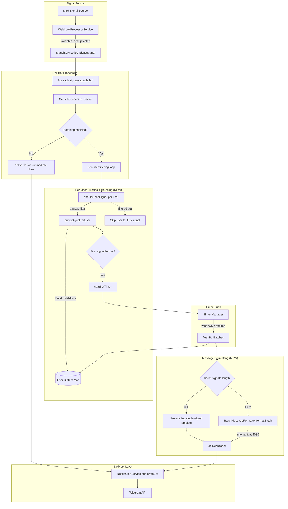
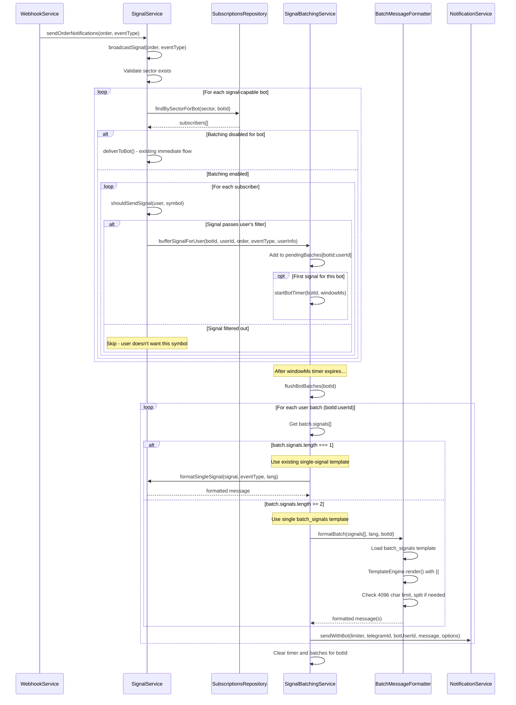

# Signal Batching Design Document

## Overview

This design document details the implementation of signal batching for the Quantum Deal platform. The feature adds an in-memory buffer layer between signal arrival and delivery, consolidating multiple signals arriving within a configurable time window (default 5 seconds) into a single batched notification message per user per bot.

## Design Summary (Meta)

```yaml
design_type: "extension"
risk_level: "medium"
complexity_level: "medium"
complexity_rationale: >
  (1) Requirements: FR-003 per-bot independent timers, FR-005 graceful shutdown with batch flush,
  AC-006 message splitting for 4096 char limit require coordinated timer/buffer management.
  (2) Constraints: Integration with existing SignalService.broadcastSignal() flow, maintaining
  fault isolation per ADR-007, memory bounds under extreme signal bursts.
main_constraints:
  - "Telegram 4096 character message limit"
  - "Memory bounds on Node.js heap for buffers"
  - "Maintain fault isolation per bot (ADR-007)"
  - "Backward compatibility with existing signal flow"
biggest_risks:
  - "Data loss on process crash (signals in buffer lost)"
  - "Memory pressure under extreme signal bursts"
  - "Timer scheduling edge cases during high load"
unknowns:
  - "Optimal batch window duration (5s default, tunable)"
  - "User acceptance of batched vs immediate delivery"
```

## Background and Context

### Prerequisite ADRs

- **ADR-011-signal-batching.md**: Signal batching architecture decision (Accepted)
  - Decision: In-memory buffer with per-bot independent timers
  - Decision: Time-based flush trigger only
  - Decision: Default enabled (opt-out)
  - Decision: Chronological ordering within batch
- **ADR-007-multi-bot-signal-broadcasting.md**: Multi-bot signal broadcasting architecture
  - Per-bot Bottleneck rate limiters
  - SignalService orchestrator pattern
  - Fault isolation per bot
- **ADR-COMMON-signal-broadcasting**: Signal Broadcasting Orchestration Patterns

### Agreement Checklist

#### Scope
- [x] Create `SignalBatchingService` for buffer and timer management
- [x] Create `signal-batching.interface.ts` for batching types
- [x] Add batching configuration to `BotSettings.features` JSONB
- [x] Add `batch_signals` message type to messages schema
- [x] Add batch message templates for each language
- [x] Modify `SignalService.broadcastSignal()` to route through batching layer
- [x] Support batch message formatting in LocalizationService

#### Non-Scope (Explicitly not changing)
- [x] `deliverToBot()` internal logic remains unchanged
- [x] Per-bot Bottleneck rate limiting unchanged
- [x] Custom filtering logic unchanged
- [x] Non-batching message delivery paths unchanged
- [x] User subscription management unchanged

#### Constraints
- [x] Parallel operation: Yes (per-bot independent buffers and timers)
- [x] Backward compatibility: Required (batching can be disabled per bot)
- [x] Performance measurement: Required (batch window latency, memory usage)
- [x] Message size limit: 4096 characters (Telegram limit)

### Signal Processing Pipeline Overview

Understanding where batching fits in the overall signal processing pipeline is crucial for correct implementation.

#### Validation and Deduplication Flow (Happens BEFORE Batching)

```
Signal arrives at webhook
  → DTO Validation (class-validator decorators)
  → Order Processing (hasSLTPValuesChanged deduplication)
  → sendOrderNotifications() called with validated, non-duplicate signal
  → broadcastSignal() receives clean signal
  → BATCHING LAYER (this design) operates on validated signals
```

**Key Points**:
1. **Webhook Validation**: DTO validation via `class-validator` decorators happens at webhook entry point
2. **SL/TP Deduplication**: `hasSLTPValuesChanged()` check prevents duplicate notifications for unchanged positions
3. **Sector Validation**: `broadcastSignal()` validates sector exists before proceeding
4. **Batching Entry Point**: `SignalBatchingService` receives only validated, non-duplicate signals

This design does NOT change validation or deduplication logic - batching is purely a delivery optimization layer.

### Problem to Solve

The current signal delivery system sends notifications immediately as they arrive from MT5. When multiple signals arrive in quick succession (e.g., market volatility events), users receive a flood of individual notifications that:
1. Interrupt workflow with frequent alerts
2. Cause notification fatigue leading to muting
3. Result in inefficient API usage with multiple messages

### Current Challenges

1. **No Buffering**: Signals delivered immediately without consolidation
2. **Notification Spam**: Multiple sequential notifications during high-activity periods
3. **No User Control**: No way to opt-out or configure delivery timing
4. **Message Inefficiency**: Each signal = one API call, even for rapid sequences

### Requirements

#### Functional Requirements

- **FR-001**: `SignalBatchingService` shall buffer incoming signals keyed by `botId:userId`
- **FR-002**: Batch window duration configurable per bot (default: 5000ms)
- **FR-003**: Each bot shall have independent timer management (fault isolation)
- **FR-004**: When batch window expires, all buffered signals for that bot shall be flushed as a single consolidated message
- **FR-005**: On graceful shutdown, all pending batches shall be flushed immediately
- **FR-006**: If batched message exceeds 4096 chars, split into multiple messages
- **FR-007**: Batching enabled by default; can be disabled per bot via settings
- **FR-008**: Optional `maxBatchSize` limit per bot (safety valve)

#### Non-Functional Requirements

- **Performance**: Batch window configurable 1-60 seconds; default 5 seconds
- **Scalability**: Support up to 100 bots with independent buffers
- **Reliability**: Fail-open to immediate delivery on batching errors
- **Maintainability**: Clean separation between buffering and delivery logic
- **Memory**: Buffer overhead < 50MB under normal load; circuit breaker at 100MB

## Acceptance Criteria (AC) - EARS Format

### FR-001: Signal Buffering

- [ ] **When** a signal arrives for a user, the system shall store it in `pendingBatches` Map keyed by `${botId}:${userId}`
- [ ] **If** no batch exists for the key, **then** the system shall create a new `PendingBatch` with the signal
- [ ] **If** a batch already exists, **then** the system shall append the signal to `batch.signals` array

### FR-002: Configurable Window

- [ ] **When** `BotSettings.features.batching.windowMs` is set, the system shall use that value for timer duration
- [ ] **If** `batching.windowMs` is not set, **then** the system shall default to 5000ms
- [ ] The system shall accept windowMs values between 1000ms and 60000ms

### FR-003: Per-Bot Timer Management

- [ ] **When** the first signal for a bot is buffered, the system shall start a timer for that bot
- [ ] **While** a bot's timer is running, subsequent signals shall be added to existing batches without resetting timer
- [ ] **If** one bot's timer fails, **then** other bots' timers shall continue unaffected

### FR-004: Batch Flush on Timer

- [ ] **When** a bot's timer expires, the system shall call `flushBotBatches(botId)` for that bot
- [ ] **When** flushing, the system shall format all signals in chronological order
- [ ] **When** flushing, the system shall call existing `deliverBatchToUsers()` with formatted message

### FR-005: Graceful Shutdown

- [ ] **When** `onModuleDestroy()` is called, the system shall clear all timers and flush all pending batches
- [ ] **If** flush fails during shutdown, **then** the system shall log error and continue with remaining batches

### FR-006: Message Size Handling

- [ ] **If** formatted batch message exceeds 4096 characters, **then** the system shall split into multiple messages
- [ ] **When** splitting, the system shall preserve signal order across messages
- [ ] **When** splitting, each message shall include appropriate header/footer

### FR-007: Opt-Out Support

- [ ] **When** `BotSettings.features.batching.enabled` is false, the system shall deliver signals immediately
- [ ] **If** batching is not configured, **then** the system shall default to enabled=true

### FR-008: Max Batch Size

- [ ] **If** `maxBatchSize` is configured and batch reaches limit, **then** the system shall flush immediately
- [ ] **If** `maxBatchSize` is not configured, **then** the system shall default to 10 signals

## Existing Codebase Analysis

### Implementation Path Mapping

| Type | Path | Description |
|------|------|-------------|
| Existing | `libs/framework/src/webhook/multi-bot-signal.service.ts` | SignalService with broadcastSignal(), deliverToBot() |
| Existing | `libs/framework/src/webhook/bot-registry.service.ts` | BotRegistryService for bot access |
| Existing | `libs/db/src/schema/bot-settings.ts` | BotSettings interface with features JSONB |
| Existing | `libs/db/src/schema/messages.ts` | MessageType union type |
| Existing | `libs/framework/src/localization/localization.service.ts` | LocalizationService for template resolution |
| Existing | `libs/framework/src/notifications/notification.service.ts` | NotificationService with sendWithBot() |
| **New** | `libs/framework/src/webhook/batching/signal-batching.service.ts` | Core batching logic |
| **New** | `libs/framework/src/webhook/batching/signal-batching.interface.ts` | Batching interfaces |
| **New** | `libs/framework/src/webhook/batching/index.ts` | Module exports |

### Integration Points

- **Integration Target**: `SignalService.broadcastSignal()`
- **Current Flow**: `broadcastSignal()` -> `deliverToBot()` -> per-user message send
- **New Flow**: `broadcastSignal()` -> `SignalBatchingService.bufferOrDeliver()` -> [buffer or immediate] -> `deliverBatchToUsers()`

### Similar Functionality Search

- **Timer Management**: `FilterSessionService` (libs/bot/src/services/filter-session.service.ts) uses similar timeout pattern
  - `sessionTimeouts: Map<number, NodeJS.Timeout>` - same pattern for per-entity timers
  - `resetTimeout()` method - same timeout reset pattern
  - **Decision**: Reuse pattern, adapt for per-bot timers
- **No existing batching/buffering logic found** - new implementation required

## Design

### Change Impact Map

```yaml
Change Target: Signal Broadcasting Flow
Direct Impact:
  - libs/framework/src/webhook/multi-bot-signal.service.ts (route through batching when enabled)
  - libs/db/src/schema/bot-settings.ts (add batching config to features)
  - messages/messages.sql (add batch templates as localization keys)
  - NEW: libs/framework/src/webhook/batching/signal-batching.service.ts
  - NEW: libs/framework/src/webhook/batching/batch-message-formatter.service.ts
Indirect Impact:
  - Signal delivery timing (delayed by batch window for users with 2+ signals)
  - Message format (consolidated format only when batch size >= 2)
  - Memory usage (buffer overhead per active user with pending signals)
No Ripple Effect:
  - Custom filtering logic (REUSED as-is, applied before batching)
  - libs/db/src/schema/messages.ts (MessageType unchanged)
  - Per-bot rate limiting (unchanged)
  - User subscription management
  - Bot registration and lifecycle
  - Non-signal message delivery
  - Single-signal user experience (unchanged - same templates)
```

### Architecture Overview



**Key Architecture Changes from v1.1**:
1. Per-user filtering (`shouldSendSignal`) happens BEFORE buffering
2. Buffer key is `${botId}:${userId}` for per-user batches
3. Template selection (single vs batch) happens at flush time based on batch size
4. `BatchMessageFormatter` service handles both single-signal and multi-signal formatting

### Data Flow (CRITICAL: Batching After Per-User Filtering)

**Design Decision**: Batching must occur AFTER per-user symbol filtering, not before.

#### Problem with Batching Before Filtering

```
Example Scenario:
- User A has custom filtering: ["EURUSD", "GBPUSD"]
- Batch window receives 3 signals: EURUSD, BTCUSD, USDJPY
- If batched before filtering: User A gets batch of 3, then filtering removes 2
- Result: Confusing behavior, incorrect batch counts
```

#### Correct Flow: Filter First, Then Buffer

```
1. Signal Event arrives (order data, eventType)
   |
   v
2. SignalService.broadcastSignal(order, eventType)
   |  - Validates sector exists
   |
   v
3. FOR EACH bot IN getSignalCapableBots():
   |
   +-> 3a. Get subscribers: findBySectorForBot(sector, botId)
   |
   +-> 3b. Check bot.settings.features.batching.enabled
   |       |
   |       +-> If disabled: Continue with existing deliverToBot() flow
   |       |
   |       +-> If enabled: Continue to per-user filtering and batching
   |
   +-> 3c. FOR EACH user IN subscribers:
   |       |
   |       +-> Apply custom filtering: shouldSendSignal(user, symbol)
   |       |       |
   |       |       +-> If filtered out: Skip user for this signal
   |       |       |
   |       |       +-> If passes filter: bufferSignalForUser(botId, userId, order, eventType)
   |       |           |
   |       |           +-> Add to pendingBatches[`${botId}:${userId}`]
   |       |           +-> If first signal for this user's batch: associate with bot timer
   |
   +-> 3d. If first signal for bot AND any users passed filter: startBotTimer(botId, windowMs)
   |
   v
4. Timer expires for botId:
   |
   v
5. flushBotBatches(botId)
   |
   +-> 5a. Get all batches where key starts with `${botId}:`
   |
   +-> 5b. For each batch (per user):
   |       |
   |       +-> Check batch.signals.length:
   |           |
   |           +-> If 1 signal: Use EXISTING single-signal template (open/close_plus/etc.)
   |           |   - Maintains backward compatibility
   |           |   - No change to user experience for single signals
   |           |
   |           +-> If 2+ signals: Use BatchMessageFormatter
   |               +-> formatBatch(batch.signals, user.lang, botId)
   |               +-> Split if > 4096 chars
   |       |
   |       +-> deliverToUser(bot, user, formattedMessages)
   |
   +-> 5c. Clear timer and batches for this bot
   |
   v
6. Messages sent via NotificationService.sendWithBot()
```

#### Key Design Points

1. **Buffer Key**: `${botId}:${userId}` - one buffer per user per bot
2. **Filtering Location**: Happens at flush time using in-memory `filterSettings` from `findBySectorForBot()`
3. **Template Selection**: Determined at flush time based on buffer size
4. **Single Signal Handling**: Uses existing templates for seamless backward compatibility
5. **Multi-Signal Handling**: Uses new batch templates only when truly batched
6. **Zero Additional DB Queries**: `filterSettings` included in `findBySectorForBot()` result - all filtering in memory

### Batch Database Query Optimization for User Filtering

**Problem**: Current `shouldSendSignal()` makes individual DB query per user with custom filtering, causing N queries where N is the number of users with `hasCustomFiltering=true`.

**Solution**: Extend existing `findBySectorForBot()` query to also return user's filter settings in one query.

#### Extended Repository Method

The existing `findBySectorForBot()` already returns `hasCustomFiltering` flag via subquery. We extend it to also return the actual filter settings.

```typescript
// ============================================================
// libs/db/src/repositories/subscriptions.repository.ts
// ============================================================

// Extended interface to include filter settings
export interface SubscriptionWithFeatures {
  // ... existing fields ...

  // Feature flag: hasCustomFiltering (already exists)
  hasCustomFiltering: boolean;

  // NEW: Filter settings from user_subscription_features
  filterSettings: { symbols?: string[] } | null;
}

async findBySectorForBot(
  sector: string,
  botId: number,
): Promise<SubscriptionWithFeatures[]> {
  const result = await this.db
    .select({
      // ... existing fields ...

      // Feature flag: hasCustomFiltering (already exists)
      hasCustomFiltering: sql<boolean>`
        COALESCE(
          (SELECT sf_custom.is_enabled
           FROM ${subscriptionFeatures} sf_custom
           WHERE sf_custom.subscription_id = ${subscriptions.id}
           AND sf_custom.feature_key = 'custom_user_filtering'
           AND sf_custom.is_enabled = true
          ), false
        )
      `,

      // NEW: Add allowed symbols from user_subscription_features
      filterSettings: sql<{ symbols?: string[] } | null>`
        (SELECT usf.settings
         FROM user_subscription_features usf
         WHERE usf.bot_user_id = ${botUsers.id}
         AND usf.feature_key = 'custom_user_filtering'
         AND usf.is_active = true
        )
      `,
    })
    // ... rest of query unchanged ...
}
```

#### New Filtering Flow in SignalService (In-Memory, No Additional DB Queries)

```typescript
// ============================================================
// In SignalService (libs/framework/src/webhook/multi-bot-signal.service.ts)
// ============================================================

/**
 * Apply custom filtering to users using in-memory approach.
 * NO additional DB queries - all data comes from findBySectorForBot().
 *
 * Performance improvement:
 * - Before: N queries (one per user with hasCustomFiltering=true)
 * - After: 0 additional queries (data already in SubscriptionWithFeatures)
 *
 * @param users - All subscribers for this sector/bot (with filterSettings)
 * @param symbols - Trading symbols to filter by (array for batching support)
 * @returns Map of botUserId -> filteredSymbols (symbols user should receive)
 */
applyCustomFiltering(
  users: NotificationUser[],
  symbols: string[],
): Map<number, string[]> {
  // Returns Map<botUserId, filteredSymbols[]>
  const result = new Map<number, string[]>();

  for (const user of users) {
    let userSymbols: string[];

    if (!user.hasCustomFiltering || !user.filterSettings) {
      // No filtering - user gets all symbols
      userSymbols = symbols;
    } else {
      const allowedSymbols = user.filterSettings.symbols || [];
      if (allowedSymbols.length === 0) {
        // Empty list means all symbols
        userSymbols = symbols;
      } else {
        // Filter to only allowed symbols
        userSymbols = symbols.filter(s => allowedSymbols.includes(s));
      }
    }

    if (userSymbols.length > 0) {
      result.set(user.botUserId, userSymbols);
    }
  }

  return result;
}

/**
 * For batching: Apply filtering at batch flush time.
 */
// When flushing batch:
const allSymbolsInBatch = batch.signals.map(s => s.symbol);
const userFilteredSymbols = applyCustomFiltering(users, allSymbolsInBatch);

for (const [botUserId, filteredSymbols] of userFilteredSymbols) {
  const userSignals = batch.signals.filter(s => filteredSymbols.includes(s.symbol));

  if (userSignals.length === 1) {
    // Use existing single-signal template
  } else if (userSignals.length >= 2) {
    // Use batch template
  }
}
```

#### Performance Impact

| Metric | Before | After |
|--------|--------|-------|
| DB queries per broadcast | N (users with filtering) | 0 additional |
| Query pattern | Sequential individual queries | Single query (findBySectorForBot) |
| Memory overhead | Minimal | filterSettings in user object (~100B per user) |
| Latency reduction | - | ~N * avg_query_time (complete elimination) |

**Example**: With 50 users having custom filtering and 10ms avg query time:
- Before: 50 queries * 10ms = 500ms
- After: 0 additional queries = 0ms (data already in findBySectorForBot result)
- Improvement: 100% reduction in additional DB query time

**Key Benefits**:
- NO additional DB queries for filtering (all data in memory)
- Single query already fetches everything needed (extended findBySectorForBot)
- Minimal change to existing code (just add one field to SELECT)
- Works seamlessly with batching (filter array of symbols at flush time)

#### Data Contract

```yaml
Boundary Name: SubscriptionsRepository.findBySectorForBot
  Input: sector (string), botId (number)
  Output: SubscriptionWithFeatures[] with filterSettings included
  Guarantees:
    - hasCustomFiltering flag always present (COALESCE to false)
    - filterSettings is null when user has no custom filtering configured
    - filterSettings contains { symbols?: string[] } when configured
  On Error: Throw error (fail-fast)

Boundary Name: applyCustomFiltering
  Input: users (NotificationUser[] with filterSettings), symbols (string[])
  Output: Map<number, string[]> (botUserId -> filtered symbols)
  Guarantees:
    - Users without hasCustomFiltering get all symbols
    - Users with empty allowedSymbols list get all symbols
    - Users with populated allowedSymbols get only matching symbols
    - Users with no matching symbols are excluded from result Map
  On Error: Pure function, no external calls, cannot fail
```

### Filtering + Batching Sequence Diagram



### Integration Points List

| Integration Point | Location | Old Implementation | New Implementation | Switching Method |
|-------------------|----------|-------------------|-------------------|------------------|
| Signal Entry | `SignalService.broadcastSignal()` | Direct `deliverToBot()` call | Route through `SignalBatchingService` | Dependency injection |
| Batch Delivery | None (new) | N/A | `deliverBatchToUsers()` | New method |
| Timer Management | None (new) | N/A | Per-bot setTimeout | New service |
| Message Formatting | `SignalService.replacePlaceholders()` | Single signal template | Batch signal template | New template type |
| Config Access | `BotSettings.features` | No batching config | Add `batching` field | JSONB extension |

### Main Components

#### Component 1: SignalBatchingService

- **Responsibility**: Manage per-bot signal buffers and timers, coordinate batch flush
- **Interface**:
  - `bufferSignal(bot, order, eventType, users): void`
  - `flushBotBatches(botId): Promise<BatchFlushResult>`
  - `flushAllBatches(): Promise<void>` (for shutdown)
  - `getBatchStats(): BatchingStats`
- **Dependencies**: SignalService (for delivery), LocalizationService (for templates)

#### Component 2: Signal Buffer (Internal to SignalBatchingService)

- **Responsibility**: Store pending signals keyed by `botId:userId`
- **Interface**: `Map<string, PendingBatch>`
- **Dependencies**: None (native JavaScript Map)

#### Component 3: Timer Manager (Internal to SignalBatchingService)

- **Responsibility**: Manage per-bot flush timers
- **Interface**: `Map<number, NodeJS.Timeout>`
- **Dependencies**: None (native setTimeout)

#### Component 4: BatchMessageFormatter Service (CRITICAL)

**Responsibility**: Format signals into appropriate message format based on batch size.

**Key Design Decision**: Template selection based on batch size at flush time:
- **1 signal**: Use existing single-signal templates (`open`, `close_plus`, `close_minus`, etc.)
- **2+ signals**: Use single `batch_signals` template with TemplateEngine (handles `{{#each}}` loops)

**Interface**:

```typescript
// ============================================================
// libs/framework/src/webhook/batching/batch-message-formatter.service.ts
// ============================================================

import { Injectable } from '@nestjs/common';
import { LocalizationService } from '../../localization';
import { TemplateEngine, type BatchTemplateData, type SignalTemplateData } from './template-engine';
import type { BufferedSignal } from './signal-batching.interface';
import type { MergedOrder, MessageType } from '@quantumdeal/db/schema';

@Injectable()
export class BatchMessageFormatter {
  private readonly templateEngine = new TemplateEngine();

  constructor(
    private readonly localizationService: LocalizationService,
  ) {}

  /**
   * Format signals for delivery. Selects template strategy based on batch size.
   *
   * @param signals - Buffered signals to format (already filtered for this user)
   * @param lang - User's preferred language
   * @param botId - Bot ID for template resolution
   * @returns Array of formatted message strings (may be split if > 4096 chars)
   */
  async formatForDelivery(
    signals: BufferedSignal[],
    lang: string,
    botId: number,
  ): Promise<string[]> {
    if (signals.length === 0) {
      return [];
    }

    if (signals.length === 1) {
      // Use existing single-signal template for backward compatibility
      return [await this.formatSingleSignal(signals[0], lang, botId)];
    }

    // Use single batch_signals template with TemplateEngine for 2+ signals
    return this.formatBatch(signals, lang, botId);
  }

  /**
   * Format a single signal using existing templates.
   * Maintains backward compatibility - no change to user experience.
   */
  private async formatSingleSignal(
    signal: BufferedSignal,
    lang: string,
    botId: number,
  ): Promise<string> {
    const template = await this.localizationService
      .forBot(botId)
      .lang(lang)
      .t(signal.eventType); // 'open', 'close_plus', 'close_minus', etc.

    return this.replacePlaceholders(template, this.createPlaceholders(signal.order));
  }

  /**
   * Format multiple signals using single batch_signals template with TemplateEngine.
   *
   * Template supports {{#each signals}}...{{/each}} for iteration.
   * Single localization key instead of three separate templates.
   */
  private async formatBatch(
    signals: BufferedSignal[],
    lang: string,
    botId: number,
  ): Promise<string[]> {
    // Load single batch template (localization key, NOT MessageType)
    const batchTemplate = await this.localizationService
      .forBot(botId)
      .lang(lang)
      .t('batch_signals');

    // Prepare template data
    const templateData: BatchTemplateData = {
      count: signals.length,
      timestamp: this.formatDateTime(new Date()),
      signals: signals.map((signal, index) => this.createSignalTemplateData(signal, index + 1)),
    };

    // Render template with TemplateEngine (handles {{#each}} loops)
    const fullMessage = this.templateEngine.render(batchTemplate, templateData);

    // Handle 4096 char limit
    if (fullMessage.length <= 4096) {
      return [fullMessage];
    }

    // Split into multiple messages if needed
    return this.splitBatchMessage(signals, lang, botId, batchTemplate);
  }

  /**
   * Create template data for a single signal item.
   */
  private createSignalTemplateData(signal: BufferedSignal, index: number): SignalTemplateData {
    const order = signal.order;
    return {
      index,
      emoji: this.getSignalEmoji(signal),
      type: this.getEventTypeDisplay(signal.eventType),
      symbol: `**\`${order.symbol}\`**`,
      order_type: `#${order.orderType}`,
      price: this.formatDecimal(signal.eventType === 'open' ? order.openPrice : order.closePrice),
      tp: this.formatDecimal(order.takeProfit),
      sl: this.formatDecimal(order.stopLoss),
      profit: this.formatProfit(order.profit),
    };
  }

  /**
   * Split batch message into multiple messages when exceeding 4096 chars.
   * Each message uses the same batch_signals template but with subset of signals.
   */
  private async splitBatchMessage(
    signals: BufferedSignal[],
    lang: string,
    botId: number,
    batchTemplate: string,
  ): Promise<string[]> {
    const messages: string[] = [];
    const timestamp = this.formatDateTime(new Date());

    // Estimate signals per message (rough calculation)
    const avgSignalSize = 100; // Approximate chars per signal
    const headerFooterSize = 100;
    const signalsPerMessage = Math.floor((4096 - headerFooterSize) / avgSignalSize);

    // Split signals into chunks
    for (let i = 0; i < signals.length; i += signalsPerMessage) {
      const chunk = signals.slice(i, i + signalsPerMessage);
      const isLast = i + signalsPerMessage >= signals.length;

      const templateData: BatchTemplateData = {
        count: signals.length, // Total count (not chunk count)
        timestamp: isLast ? timestamp : `${timestamp} (continued...)`,
        signals: chunk.map((signal, idx) =>
          this.createSignalTemplateData(signal, i + idx + 1)
        ),
      };

      const message = this.templateEngine.render(batchTemplate, templateData);
      messages.push(message);
    }

    return messages;
  }

  // Helper methods (reused from SignalService)
  private createPlaceholders(order: MergedOrder): Record<string, string> {
    return {
      symbol: `**\`${order.symbol}\`**`,
      order_type: `#${order.orderType}`,
      lots: order.lots?.toString() || '0',
      close_price: this.formatDecimal(order.closePrice),
      open_price: this.formatDecimal(order.openPrice),
      profit: this.formatDecimal(order.profit),
      stop_loss: this.formatDecimal(order.stopLoss),
      take_profit: this.formatDecimal(order.takeProfit),
      ticketId: order.ticketId.toString(),
      sector: order.sector || '',
    };
  }

  private getSignalEmoji(signal: BufferedSignal): string {
    if (signal.eventType === 'open') return '🟡';
    if (signal.eventType === 'close_plus') return '🟢';
    if (signal.eventType === 'close_minus') return '🔴';
    return '🔵';
  }

  private getEventTypeDisplay(eventType: MessageType): string {
    const map: Record<string, string> = {
      open: 'OPEN',
      close_plus: 'CLOSE +',
      close_minus: 'CLOSE -',
      position_sltp_update: 'UPDATE',
    };
    return map[eventType] || eventType.toUpperCase();
  }

  private formatProfit(profit: number | string | null | undefined): string {
    const num = typeof profit === 'string' ? Number(profit) : (profit ?? 0);
    const sign = num >= 0 ? '+' : '';
    return `${sign}${this.formatDecimal(num)}`;
  }

  private formatDecimal(input: number | string | null | undefined): string {
    if (input === null || input === undefined) return '0';
    const num = typeof input === 'string' ? Number(input) : input;
    if (Number.isNaN(num)) return '0';
    return num.toFixed(3).replace(/\.?0+$/, '');
  }

  private formatDateTime(date: Date): string {
    const pad = (v: number) => v.toString().padStart(2, '0');
    return `${date.getFullYear()}.${pad(date.getMonth() + 1)}.${pad(date.getDate())} ${pad(date.getHours())}:${pad(date.getMinutes())}`;
  }

  private replacePlaceholders(
    template: string,
    placeholders: Record<string, string>,
  ): string {
    let message = template;
    for (const [key, value] of Object.entries(placeholders)) {
      if (value !== undefined && value !== null) {
        message = message.replace(new RegExp(`\\{${key}\\}`, 'g'), value);
      }
    }
    return message.replace(/\{[^}]+\}/g, 'N/A');
  }
}
```

**Dependencies**:
- `LocalizationService` for template resolution
- `TemplateEngine` for processing `{{#each}}` loops in batch template
- Reuses placeholder logic from `SignalService`

### Contract Definitions

```typescript
// ============================================================
// libs/framework/src/webhook/batching/signal-batching.interface.ts
// ============================================================

import type { MergedOrder, MessageType } from '@quantumdeal/db/schema';

/**
 * Configuration for signal batching per bot.
 * Stored in BotSettings.features.batching JSONB field.
 */
export interface BatchingConfig {
  /** Whether batching is enabled for this bot. Default: true (opt-out) */
  enabled: boolean;
  /** Batch window duration in milliseconds. Default: 5000 (5 seconds) */
  windowMs: number;
  /** Maximum signals per batch before forced flush. Default: 10 */
  maxBatchSize?: number;
}

/**
 * A single signal waiting to be batched.
 */
export interface BufferedSignal {
  /** Original order data */
  order: MergedOrder;
  /** Signal event type (open, close_plus, etc.) */
  eventType: MessageType;
  /** Timestamp when signal was buffered */
  bufferedAt: number;
}

/**
 * A pending batch for a specific user on a specific bot.
 */
export interface PendingBatch {
  /** Bot database ID */
  botId: number;
  /** User's Telegram ID */
  userId: number;
  /** User's bot-specific ID for message delivery */
  botUserId: number;
  /** User's preferred language */
  lang: string;
  /** Signals waiting to be delivered */
  signals: BufferedSignal[];
  /** Timestamp when first signal was buffered */
  windowStartTime: number;
}

/**
 * Result of flushing batches for a single bot.
 */
export interface BatchFlushResult {
  /** Bot ID that was flushed */
  botId: number;
  /** Number of users who received batched messages */
  usersDelivered: number;
  /** Total signals delivered across all users */
  signalsDelivered: number;
  /** Number of delivery failures */
  failures: number;
  /** Processing duration in milliseconds */
  durationMs: number;
}

/**
 * Statistics for monitoring batching behavior.
 */
export interface BatchingStats {
  /** Total signals currently buffered */
  pendingSignals: number;
  /** Number of active user batches */
  pendingBatches: number;
  /** Number of bots with active timers */
  activeTimers: number;
  /** Total signals batched since startup */
  totalBatched: number;
  /** Total immediate deliveries (batching disabled) */
  totalImmediate: number;
  /** Average batch size */
  avgBatchSize: number;
}

/**
 * User info needed for batch delivery.
 * Subset of NotificationUser focused on batching needs.
 * Includes filterSettings from extended findBySectorForBot() query.
 */
export interface BatchUser {
  /** User's Telegram ID */
  telegramId: number;
  /** User's bot-specific ID */
  botUserId: number;
  /** User's preferred language */
  lang: string;
  /** Whether user has custom filtering enabled */
  hasCustomFiltering: boolean;
  /** User's filter settings from user_subscription_features (null if no filtering) */
  filterSettings: { symbols?: string[] } | null;
}

/**
 * Default batching configuration.
 */
export const DEFAULT_BATCHING_CONFIG: BatchingConfig = {
  enabled: true,
  windowMs: 5000,
  maxBatchSize: 10,
};
```

### Data Contract

#### SignalBatchingService.bufferSignal()

```yaml
Input:
  Type: (bot: SignalCapableBot, order: MergedOrder, eventType: MessageType, users: BatchUser[])
  Preconditions:
    - bot.settings.features.batching.enabled === true
    - users array is non-empty (filtered users)
  Validation: Check batching enabled, users exist

Output:
  Type: void (async buffering, no immediate return)
  Guarantees:
    - Signal added to appropriate batch for each user
    - Timer started if first signal for bot
  On Error: Log error, fall back to immediate delivery (fail-open)

Invariants:
  - One batch per user per bot at any time
  - Signals ordered chronologically within batch
  - Timer resets only on first signal, not subsequent
```

#### SignalBatchingService.flushBotBatches()

```yaml
Input:
  Type: (botId: number)
  Preconditions:
    - Bot has at least one pending batch
  Validation: Check pending batches exist

Output:
  Type: Promise<BatchFlushResult>
  Guarantees:
    - All batches for bot are processed
    - Timer cleared after flush
    - Batch map entries removed
  On Error: Return partial result with failure count

Invariants:
  - Each signal delivered exactly once
  - Order preserved within batch
  - Message split if > 4096 chars
```

### Integration Boundary Contracts

```yaml
Boundary Name: SignalService -> SignalBatchingService
  Input: bot (SignalCapableBot), order (MergedOrder), eventType (MessageType), users (BatchUser[])
  Output: void (buffering is async)
  On Error: Fall back to immediate deliverToBot() (fail-open pattern)

Boundary Name: SignalBatchingService -> NotificationService
  Input: bot.limiter, user.telegramId, user.botUserId, formattedMessage, options
  Output: messageId (string)
  On Error: Log error, increment failure count, continue to next user

Boundary Name: SignalBatchingService -> LocalizationService
  Input: botId, 'batch_signals' | 'batch_signal_item', lang, params
  Output: formatted template string
  On Error: Return fallback hardcoded template
```

### State Transitions and Invariants

```yaml
State Definition:
  - Empty: No signals buffered, no timers active
  - Buffering: Signals in buffer, timer running
  - Flushing: Timer expired, delivering batches
  - Shutdown: Flushing all pending batches

State Transitions:
  Empty → (first signal arrives) → Buffering
  Buffering → (more signals arrive) → Buffering (append to batch)
  Buffering → (timer expires) → Flushing → Empty
  Buffering → (maxBatchSize reached) → Flushing → Empty (if more signals) or Buffering
  Buffering → (shutdown signal) → Flushing → Shutdown
  Any State → (error) → Log + fallback to immediate delivery

System Invariants:
  - At most one timer per bot at any time
  - Each signal eventually delivered (via batch or immediate fallback)
  - Batches never exceed maxBatchSize before flush
  - Memory usage < 100MB (circuit breaker)
```

### Error Handling

1. **Timer Creation Failure**: Log error, deliver signal immediately (fail-open)
2. **Buffer Overflow (memory)**: Flush all batches immediately, continue with immediate delivery
3. **Message Formatting Error**: Use fallback template with minimal info
4. **Delivery Failure**: NotificationService handles retries internally
5. **Template Not Found**: Use hardcoded fallback template
6. **Shutdown Flush Failure**: Log error, continue with remaining batches

### Logging and Monitoring

```typescript
// Signal buffered
logger.debug(`Buffered signal for bot ${botId}, user ${userId}: ${eventType} ${order.symbol}`);

// Timer started
logger.debug(`Started batch timer for bot ${botId} (${windowMs}ms)`);

// Batch flushed
logger.log(`Flushed ${signalsCount} signals to ${usersCount} users for bot ${botId} [${durationMs}ms]`);

// Immediate delivery (batching disabled)
logger.debug(`Immediate delivery for bot ${botId}: batching disabled`);

// Error fallback
logger.warn(`Batching error for bot ${botId}, falling back to immediate delivery: ${error.message}`);

// Shutdown flush
logger.log(`Shutdown: flushing ${batchCount} pending batches`);

// Stats (periodic)
logger.debug(`Batching stats: ${stats.pendingSignals} pending, ${stats.activeTimers} timers, avg batch ${stats.avgBatchSize}`);
```

### Metrics to Track

- `signal_batching.buffer_size`: Current pending signals count (gauge)
- `signal_batching.batch_size`: Signals per flushed batch (histogram)
- `signal_batching.flush_latency`: Time from first signal to flush (histogram)
- `signal_batching.immediate_fallback`: Count of immediate deliveries due to errors (counter)
- `signal_batching.memory_usage`: Estimated buffer memory in bytes (gauge)

## Implementation Plan

### Implementation Approach

**Selected Approach**: Vertical Slice (Feature-driven)
**Selection Reason**:
- Batching is a self-contained feature with clear boundaries
- Can be verified end-to-end after each phase
- Backward compatible (existing flow works while building)
- Minimal external dependencies

### Technical Dependencies and Implementation Order

#### Required Implementation Order

1. **Phase 1: Interface Definitions**
   - Create `signal-batching.interface.ts` with all types
   - Create `batching/index.ts` for exports
   - **Verification**: L3 (Build success)

2. **Phase 2: Schema Extension**
   - Add `BatchingConfig` to `BotSettings.features` interface
   - Add `batch_signals` and `batch_signal_item` to `MessageType`
   - **Verification**: L3 (Build success)

3. **Phase 3: Message Templates**
   - Add batch message templates to `messages.sql` for all languages
   - Templates: `batch_signals` (header/footer), `batch_signal_item` (per-signal)
   - **Verification**: L3 (Database migration success)

4. **Phase 4: SignalBatchingService Core**
   - Create service with buffer and timer management
   - Implement `bufferSignal()`, `flushBotBatches()`
   - **Verification**: L2 (Unit tests pass)

5. **Phase 5: Batch Formatting**
   - Implement `formatBatchMessage()` with template resolution
   - Implement message splitting for 4096 char limit
   - **Verification**: L2 (Unit tests pass)

6. **Phase 6: SignalService Integration**
   - Modify `broadcastSignal()` to route through batching
   - Add batching config check per bot
   - **Verification**: L1 (Integration tests pass)

7. **Phase 7: Graceful Shutdown**
   - Implement `onModuleDestroy()` with batch flush
   - **Verification**: L1 (E2E test with shutdown)

### Integration Points

**Integration Point 1: SignalService -> SignalBatchingService**
- Components: `broadcastSignal()` -> `bufferSignal()`
- Verification: Signals buffered instead of immediately delivered when batching enabled

**Integration Point 2: SignalBatchingService -> NotificationService**
- Components: `flushBotBatches()` -> `sendWithBot()`
- Verification: Batched messages delivered via per-bot rate limiter

**Integration Point 3: SignalBatchingService -> LocalizationService**
- Components: `formatBatchMessage()` -> `localizationService.forBot().t()`
- Verification: Templates resolved with correct placeholders

### Migration Strategy

1. **Backward Compatibility**:
   - Default `batching.enabled = true` but can be disabled
   - Existing bots without batching config get default values
2. **Database Migration**:
   - **No SQL Database Migration Required**: `BotSettings.features` is JSONB, runtime schema change is additive
   - **TypeScript Interface Modification Required**: `libs/db/src/schema/bot-settings.ts`
     - Add `batching?: BatchingConfig` to the `BotSettings.features` interface
     - Before:
       ```typescript
       features: {
         trialEnabled: boolean;
         paymentsEnabled: boolean;
         signalsEnabled: boolean;
         broadcastEnabled: boolean;
       };
       ```
     - After:
       ```typescript
       features: {
         trialEnabled: boolean;
         paymentsEnabled: boolean;
         signalsEnabled: boolean;
         broadcastEnabled: boolean;
         batching?: BatchingConfig;
       };
       ```
3. **Gradual Rollout**:
   - Can disable batching per bot via settings
   - Immediate delivery path preserved for fallback
4. **Message Templates**:
   - SQL seed file adds new templates
   - Missing templates fall back to hardcoded default

## Test Strategy

### Basic Test Design Policy

Derive test cases from EARS acceptance criteria:
- Each AC maps to at least one test case
- Focus on observable behavior (buffer state, delivery timing, message format)
- Test error scenarios and fallback paths

### Unit Tests

**SignalBatchingService.bufferSignal()**
- Test: First signal creates new batch and starts timer
- Test: Subsequent signals append to existing batch
- Test: Signals for different users create separate batches
- Test: Signals for different bots create separate timers

**SignalBatchingService.flushBotBatches()**
- Test: All batches for bot are processed
- Test: Timer cleared after flush
- Test: Batch entries removed from map
- Test: Partial failure returns correct counts

**formatBatchMessage()**
- Test: Signals ordered chronologically
- Test: Template placeholders replaced correctly
- Test: Message split when > 4096 chars
- Test: Split messages maintain signal order

**Config Handling**
- Test: Default values applied when config missing
- Test: Custom windowMs respected
- Test: maxBatchSize triggers early flush

### Integration Tests

**End-to-End Batching Flow**
- Test: Multiple signals within window delivered as single batch
- Test: Signals after window delivered in separate batch
- Test: Batching disabled delivers immediately
- Test: Different bots have independent timers

**Graceful Shutdown**
- Test: All pending batches flushed on shutdown
- Test: Timers cleared on shutdown
- Test: Partial failure during shutdown logged

### E2E Tests

**Full Signal Batching Flow**
- Trigger 3 MT5 webhook events within 5 seconds
- Verify user receives 1 batched notification (not 3)
- Verify batch contains all 3 signals in order
- Verify message format matches template

**Batching Disabled**
- Configure bot with `batching.enabled = false`
- Trigger MT5 webhook event
- Verify immediate delivery (no batching delay)

### Performance Tests

- Measure memory usage with 1000 pending signals
- Verify timer accuracy under load
- Measure batch format time for various batch sizes
- Verify circuit breaker triggers at memory limit

## Security Considerations

- **No New Attack Surface**: Batching is internal, no external API
- **Data Isolation**: Per-bot buffers maintain existing isolation
- **No Credential Exposure**: Signal data same as current flow
- **Memory DoS Prevention**: Circuit breaker at 100MB buffer size

## Future Extensibility

1. **User-Level Batching Preferences**: Allow users to configure their own window
2. **Smart Batching**: Analyze signal patterns to optimize window dynamically
3. **Batch Analytics**: Track user engagement with batched vs single messages
4. **Redis Migration**: If horizontal scaling needed, migrate buffer to Redis (per ADR-011 kill criteria)

## Alternative Solutions

### Alternative 1: RxJS Observable-Based Buffering

- **Overview**: Use RxJS `bufferTime` operator for reactive buffering
- **Advantages**: Elegant reactive model, built-in operators
- **Disadvantages**: Adds RxJS dependency, steeper learning curve
- **Reason for Rejection**: Team more familiar with imperative patterns, native setTimeout simpler to debug

### Alternative 2: Redis-Based Buffer

- **Overview**: Store pending signals in Redis sorted sets
- **Advantages**: Persistence, horizontal scalability
- **Disadvantages**: Additional infrastructure, network latency overhead
- **Reason for Rejection**: Over-engineering for current scale (~100-500 signals/day per ADR-011)

## Risks and Mitigation

| Risk | Impact | Probability | Mitigation |
|------|--------|-------------|------------|
| Data loss on crash | Medium | Low | Short batch windows (5s default), acceptable per ADR-011 |
| Memory pressure | High | Low | Circuit breaker at 100MB, maxBatchSize limit |
| Timer drift under load | Low | Low | Use `setTimeout`, acceptable precision for 5s windows |
| Message too long | Medium | Medium | Auto-split at 4096 chars |
| Template not found | Low | Low | Hardcoded fallback template |

## Message Template Specification (CRITICAL CLARIFICATION)

### Template System Architecture

**Important**: Batch template is a **single localization key** stored in the `messages` table with loop support, NOT additions to the `MessageType` TypeScript union.

| Template Key | Purpose | Stored As |
|--------------|---------|-----------|
| `batch_signals` | Complete batch message with loop | Localization row (message_key) |
| `open`, `close_plus`, etc. | Existing single-signal templates | MessageType + localization |

**Why Single Template Instead of Three?**
- Single template in messages table - easier to manage and translate
- One localization key (`batch_signals`) instead of three
- More flexible for customization - template structure in one place
- Fewer DB queries during message formatting
- Cleaner separation: TemplateEngine handles iteration logic

**Why NOT MessageType?**
- `MessageType` is used for signal event types and queued message categorization
- Batch templates are purely presentation-layer concerns
- Adding to `MessageType` would conflate event types with display formats
- Localization keys can be added without schema changes

### Template Resolution Flow

```
Signal Batch Size Check
  |
  +-> 1 signal: Use existing MessageType template
  |             eventType='open' → messages.message_key='open'
  |
  +-> 2+ signals: Use single localization key with TemplateEngine
                  localizationService.t('batch_signals')
                  → TemplateEngine.render(template, data)
```

### TemplateEngine Utility

**Purpose**: Simple mustache-like template processor with loop support.

```typescript
// ============================================================
// libs/framework/src/webhook/batching/template-engine.ts
// ============================================================

export interface BatchTemplateData {
  count: number;
  timestamp: string;
  signals: SignalTemplateData[];
}

export interface SignalTemplateData {
  index: number;
  emoji: string;
  type: string;
  symbol: string;
  order_type: string;
  price: string;
  tp: string;
  sl: string;
  profit?: string;
}

export class TemplateEngine {
  /**
   * Process template with loop support.
   * Supports {{#each signals}}...{{/each}} for iteration
   * and {placeholder} for simple value substitution.
   *
   * @param template - Template string with placeholders and loops
   * @param data - Data object with values to substitute
   * @returns Rendered string
   */
  render(template: string, data: BatchTemplateData): string {
    let result = template;

    // 1. Process {{#each signals}}...{{/each}} blocks
    const eachRegex = /\{\{#each\s+signals\}\}([\s\S]*?)\{\{\/each\}\}/g;
    result = result.replace(eachRegex, (_, itemTemplate: string) => {
      return data.signals
        .map((signal) => this.replaceSimplePlaceholders(itemTemplate.trim(), signal))
        .join('\n');
    });

    // 2. Replace top-level {placeholders} with values
    result = this.replaceSimplePlaceholders(result, {
      count: data.count.toString(),
      timestamp: data.timestamp,
    });

    return result;
  }

  private replaceSimplePlaceholders(
    template: string,
    values: Record<string, string | number | undefined>,
  ): string {
    let result = template;
    for (const [key, value] of Object.entries(values)) {
      if (value !== undefined && value !== null) {
        result = result.replace(new RegExp(`\\{${key}\\}`, 'g'), String(value));
      }
    }
    // Replace any remaining unreplaced placeholders with N/A
    return result.replace(/\{[^}]+\}/g, 'N/A');
  }
}
```

**Benefits**:
- Simple, focused responsibility (template rendering only)
- No external dependencies
- Easy to test
- Mustache-like syntax familiar to developers

### Single Batch Template (`batch_signals`)

**Template Structure**:
```
📊 Сигналы ({count}):

{{#each signals}}
{index}. {emoji} {type} | {symbol}
   {order_type} @ {price} | TP: {tp} | SL: {sl}
{{/each}}

⏱️ {timestamp}
```

**Top-Level Placeholders**:
- `{count}`: Number of signals in batch
- `{timestamp}`: Batch timestamp (formatted)

**Signal Item Placeholders** (inside `{{#each signals}}`):
- `{index}`: 1-based signal number in batch
- `{emoji}`: Event-specific emoji (🟡 OPEN, 🟢 CLOSE +, 🔴 CLOSE -, 🔵 UPDATE)
- `{type}`: Formatted event type (OPEN, CLOSE +, CLOSE -, UPDATE)
- `{symbol}`: Trading symbol (formatted with markdown)
- `{order_type}`: Buy/Sell indicator
- `{price}`: Entry price (open_price for OPEN, close_price for CLOSE)
- `{tp}`: Take profit price
- `{sl}`: Stop loss price
- `{profit}`: Formatted profit with +/- sign (for close events, optional)

**Example Template (English)**:
```
📊 Signal Batch ({count}):

{{#each signals}}
{index}. {emoji} {type} | {symbol}
   {order_type} @ {price} | TP: {tp} | SL: {sl}
{{/each}}

⏱️ {timestamp}
```

**Example Template (Russian)**:
```
📊 Сигналы ({count}):

{{#each signals}}
{index}. {emoji} {type} | {symbol}
   {order_type} @ {price} | TP: {tp} | SL: {sl}
{{/each}}

⏱️ {timestamp}
```

**Example Output**:
```
📊 Signal Batch (3):

1. 🟡 OPEN | **`EURUSD.a`**
   #BUY @ 1.085 | TP: 1.095 | SL: 1.075
2. 🟢 CLOSE + | **`BTCUSD.a`**
   #BUY @ 58000 | TP: 59000 | SL: 57000
3. 🔴 CLOSE - | **`GBPUSD.a`**
   #SELL @ 1.265 | TP: 1.255 | SL: 1.275

⏱️ 2026.01.27 15:30
```

### Languages to Support

- `en` - English
- `ru` - Russian
- `uk` - Ukrainian
- `hi` - Hindi
- `fr` - French
- `kk` - Kazakh
- `uz` - Uzbek
- `tg` - Tajik

## Files to Create

| File | Purpose |
|------|---------|
| `libs/framework/src/webhook/batching/signal-batching.interface.ts` | Batching types and interfaces |
| `libs/framework/src/webhook/batching/signal-batching.service.ts` | Core batching service (buffer, timers) |
| `libs/framework/src/webhook/batching/batch-message-formatter.service.ts` | Message formatting (template selection, batch formatting) |
| `libs/framework/src/webhook/batching/template-engine.ts` | Simple mustache-like template processor with loop support |
| `libs/framework/src/webhook/batching/index.ts` | Module exports |

## Files to Modify

| File | Change |
|------|--------|
| `libs/db/src/schema/bot-settings.ts` | Add `batching?: BatchingConfig` to `BotSettings.features` |
| `libs/db/src/repositories/subscriptions.repository.ts` | Add `filterSettings` field to `findBySectorForBot()` query and `SubscriptionWithFeatures` interface |
| `libs/framework/src/webhook/multi-bot-signal.service.ts` | Route through SignalBatchingService when batching enabled; add in-memory `applyCustomFiltering()` |
| `libs/framework/src/webhook/index.ts` | Export batching module |
| `messages/messages.sql` | Add single `batch_signals` template (replaces three-template approach) |

### MessageType Clarification (NO CHANGES REQUIRED)

**File**: `libs/db/src/schema/messages.ts`

**Status**: NO MODIFICATION NEEDED

**Rationale**:
- `MessageType` represents signal event types (`open`, `close_plus`, `close_minus`, etc.)
- Batch template (`batch_signals`) is a localization key only
- It is stored in the `messages` table with `message_key` column but is NOT part of the `MessageType` union
- This separation maintains clean architecture between event types and display formats

**Current MessageType (remains unchanged)**:
```typescript
export type MessageType =
  | 'open'
  | 'close_minus'
  | 'close_plus'
  | 'position_sltp_update'
  | 'weekly_report'
  | 'weekly_report_3'
  | 'monthly_report';
```

**messages.sql additions** (single template with loop support):
```sql
-- Single batch template with {{#each}} loop support (localization key, not MessageType)
INSERT INTO messages (bot_id, message_key, lang, text)
VALUES
  (1, 'batch_signals', 'en', '📊 Signal Batch ({count}):

{{#each signals}}
{index}. {emoji} {type} | {symbol}
   {order_type} @ {price} | TP: {tp} | SL: {sl}
{{/each}}

⏱️ {timestamp}'),
  (1, 'batch_signals', 'ru', '📊 Сигналы ({count}):

{{#each signals}}
{index}. {emoji} {type} | {symbol}
   {order_type} @ {price} | TP: {tp} | SL: {sl}
{{/each}}

⏱️ {timestamp}'),
  -- ... repeat for other languages (uk, hi, fr, kk, uz, tg)
;
```

## References

- [ADR-011: Signal Batching Architecture](../adr/ADR-011-signal-batching.md)
- [ADR-007: Multi-Bot Signal Broadcasting](../adr/ADR-007-multi-bot-signal-broadcasting.md)
- [FilterSessionService Timer Pattern](../../libs/bot/src/services/filter-session.service.ts)
- [Asynchronous Request Batching Design Pattern in Node.js](https://immersedincode.io.vn/blog/asynchronous-request-batching-design-pattern-in-nodejs/)
- [promise-batcher npm package](https://www.npmjs.com/package/promise-batcher)
- [Mastering Node.js Timeouts with TypeScript](https://www.xjavascript.com/blog/nodejs-timeout-typescript/)

## Update History

| Date | Version | Changes | Author |
|------|---------|---------|--------|
| 2026-01-27 | 1.0 | Initial design document | Claude Code |
| 2026-01-27 | 1.1 | Clarified migration strategy: added TypeScript interface modification details (I001), added explicit MessageType before/after specification (I002) | Claude Code |
| 2026-01-27 | 1.2 | **Critical corrections based on user feedback**: | Claude Code |
|  |  | - Added "Signal Processing Pipeline Overview" section clarifying validation/deduplication happens BEFORE batching |  |
|  |  | - **CRITICAL**: Corrected data flow - batching now happens AFTER per-user filtering (shouldSendSignal), not before |  |
|  |  | - Added detailed problem/solution for per-user filtering integration |  |
|  |  | - Added "Filtering + Batching Sequence Diagram" showing complete flow |  |
|  |  | - **CRITICAL**: Revised template system - batch_header/batch_signal_item/batch_footer are localization keys, NOT MessageType additions |  |
|  |  | - Removed incorrect MessageType modification (messages.ts unchanged) |  |
|  |  | - Added BatchMessageFormatter service specification with template selection logic (1 signal = existing template, 2+ = batch) |  |
|  |  | - Updated Architecture Overview diagram to reflect corrected flow |  |
|  |  | - Updated Change Impact Map to reflect no MessageType changes |  |
|  |  | - Updated Files to Create/Modify tables |  |
| 2026-01-27 | 1.3 | **User feedback corrections - template and query optimizations**: | Claude Code |
|  |  | - **SINGLE TEMPLATE**: Replaced three-template approach (batch_header, batch_signal_item, batch_footer) with single `batch_signals` template |  |
|  |  | - Added TemplateEngine utility class for mustache-like `{{#each signals}}...{{/each}}` loop processing |  |
|  |  | - Updated BatchMessageFormatter to use TemplateEngine instead of three separate template loads |  |
|  |  | - Updated sequence diagram to reflect single template approach |  |
|  |  | - Updated messages.sql example to show single template with loop syntax |  |
|  |  | - **BATCH QUERY OPTIMIZATION**: Added `getBotUsersFeatureSettings()` method to UserSubscriptionFeaturesRepository |  |
|  |  | - Added `applyCustomFiltering()` method specification with batch query approach (1 query vs N queries) |  |
|  |  | - Added performance impact table showing ~97% reduction in DB query time |  |
|  |  | - Added data contract for batch query boundary |  |
|  |  | - Added `user-subscription-features.repository.ts` to Files to Modify table |  |
|  |  | - Added `template-engine.ts` to Files to Create table |  |
| 2026-01-27 | 1.4 | **Corrected batch query approach - extend findBySectorForBot()**: | Claude Code |
|  |  | - **CRITICAL**: Replaced previous batch query approach (getBotUsersFeatureSettings in UserSubscriptionFeaturesRepository) |  |
|  |  | - Extended existing `findBySectorForBot()` to include `filterSettings` field via subquery |  |
|  |  | - Updated `SubscriptionWithFeatures` interface to add `filterSettings: { symbols?: string[] } \| null` |  |
|  |  | - Updated `applyCustomFiltering()` to pure in-memory function (0 additional DB queries) |  |
|  |  | - Added batching-specific filtering flow (filter array of symbols at flush time) |  |
|  |  | - Updated performance impact: 100% reduction in additional DB queries (vs 97%) |  |
|  |  | - Removed `user-subscription-features.repository.ts` from Files to Modify (not needed) |  |
|  |  | - Updated `subscriptions.repository.ts` in Files to Modify (add filterSettings field) |  |
