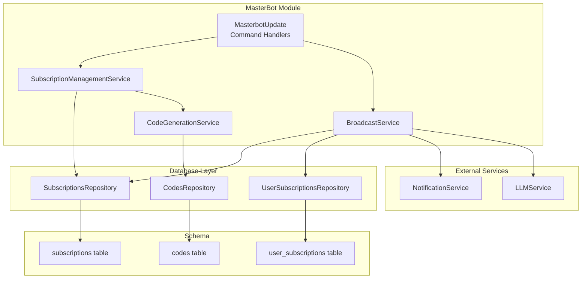
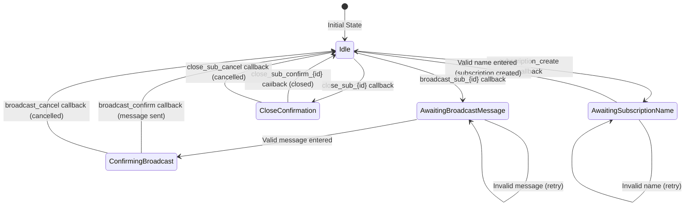
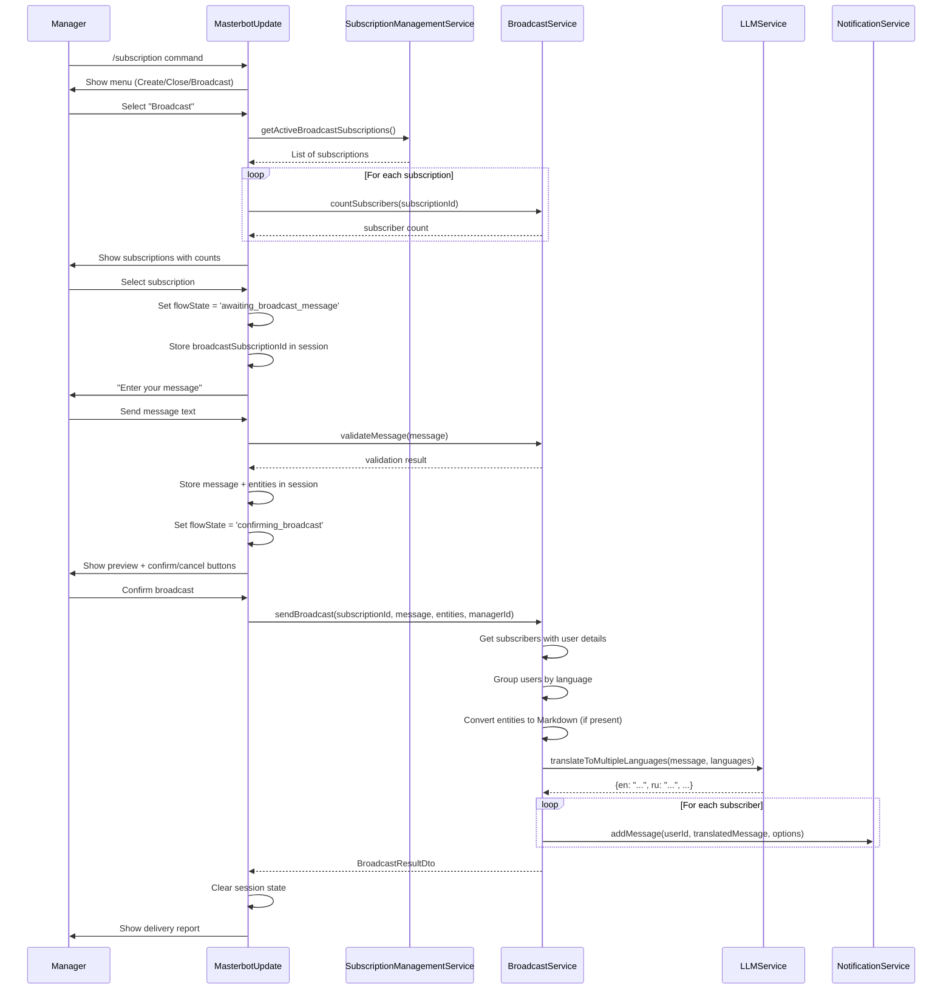
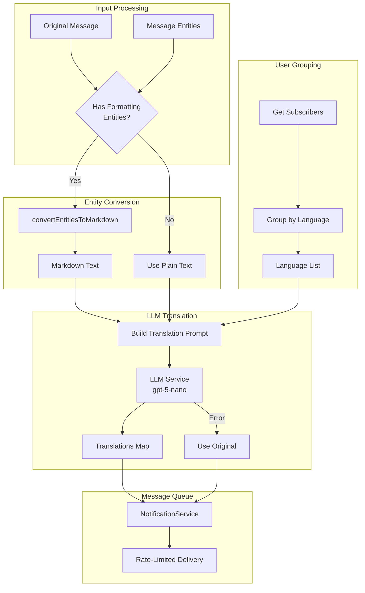
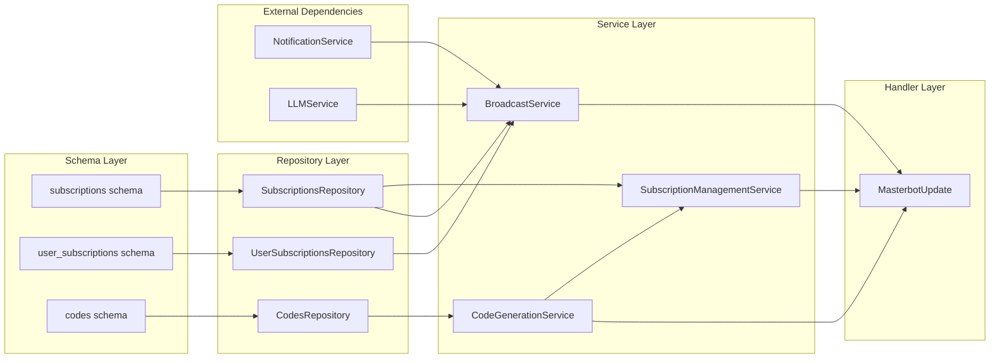

# Subscription Broadcast Design Document

## Overview

This design document describes the technical architecture of the Broadcast Subscriptions feature in MasterBot. The system enables managers to create custom subscription channels, send broadcast messages with automatic LLM-based translation, and manage invite codes through a Telegram bot administrative interface. This document is reverse-engineered from the existing implementation.

**Related PRD**: [docs/prd/subscription-broadcast-prd.md](../prd/subscription-broadcast-prd.md)

## Background and Context

### Prerequisite ADRs

- No formal ADRs exist for this feature (implementation predates ADR process)
- Common patterns applied: NestJS module structure, Repository pattern, Session-based state management

### Agreement Checklist

#### Scope (Implemented)
- [x] MasterBot command handlers for subscription management
- [x] Broadcast message delivery with multi-language translation
- [x] Subscription creation with dynamic type generation
- [x] Subscription closure with audit trail
- [x] Invite code generation with collision detection
- [x] Session state management for multi-step flows

#### Non-Scope (Explicitly not changing)
- [x] Core signals subscription type (`signals`)
- [x] User registration and activation flow
- [x] Payment processing
- [x] Subscription expiration management

#### Constraints
- [x] Telegram API limits: 4096 characters per message
- [x] Manager authentication required for all operations
- [x] Broadcast type pattern: `subscription_{10-char-nanoid}`

### Problem Solved

The Broadcast Subscriptions feature addresses the need for managers to:
1. Create custom broadcast channels separate from trading signals
2. Communicate with specific subscriber groups
3. Deliver messages in subscribers' preferred languages
4. Generate and distribute invite codes securely

### Requirements

#### Functional Requirements (Implemented)

1. **Subscription Management**: Create, close, and list broadcast subscriptions
2. **Broadcast Messaging**: Send messages to all active subscribers with translation
3. **Code Generation**: Generate unique invite codes with Telegram deep-links
4. **Session Flow**: Multi-step conversation flow with state persistence

#### Non-Functional Requirements

- **Performance**: Single LLM call for all language translations (O(1) complexity)
- **Reliability**: Fallback to original message on translation failure
- **Security**: Cryptographically secure code generation, manager authentication
- **Scalability**: Queue-based message delivery via NotificationService

## Acceptance Criteria (AC)

### Subscription Creation
- [x] Manager enters `/subscription` command and selects "Create subscription"
- [x] System prompts for subscription name
- [x] Name validation: 3-50 characters, alphanumeric + spaces only
- [x] System generates unique `subscription_{nanoid}` type
- [x] System creates initial invite code automatically
- [x] Manager receives confirmation with subscription details

### Subscription Closure
- [x] Manager can close only broadcast subscriptions (not signals)
- [x] System records `closedBy` (manager telegramId) and `closedAt` timestamp
- [x] Confirmation dialog shown before closure

### Broadcast Messaging
- [x] Shows subscription list with active subscriber counts
- [x] Filters out subscriptions with 0 subscribers
- [x] Validates message: 1-4096 characters
- [x] Shows message preview before sending
- [x] Preserves Markdown formatting via entity conversion
- [x] Translates to all subscriber languages in single LLM call
- [x] Falls back to original message on translation failure

### Code Generation
- [x] 15-character alphanumeric codes (uppercase + digits)
- [x] Uses crypto.randomBytes for secure generation
- [x] Collision detection with 10 retry attempts
- [x] Returns Telegram deep-link URL format

## Existing Codebase Analysis

### Implementation Path Mapping

| Type | Path | Description |
|------|------|-------------|
| Existing | `libs/masterbot/src/masterbot.update.ts` | Main command and action handlers |
| Existing | `libs/masterbot/src/services/subscription-management.service.ts` | Subscription CRUD operations |
| Existing | `libs/masterbot/src/services/broadcast.service.ts` | Message translation and delivery |
| Existing | `libs/masterbot/src/services/code-generation.service.ts` | Invite code generation |
| Existing | `libs/masterbot/src/constants.ts` | Callback action constants |
| Existing | `libs/masterbot/src/interfaces/user-context.interface.ts` | Session type definitions |
| Existing | `libs/masterbot/src/dto/*.ts` | Data transfer objects |
| Existing | `libs/masterbot/src/utils/entity-converter.ts` | Telegram entity to Markdown conversion |
| Existing | `libs/db/src/schema/subscriptions.ts` | Subscription schema and helpers |
| Existing | `libs/db/src/repositories/subscriptions.repository.ts` | Subscription database operations |
| Existing | `libs/db/src/repositories/user-subscriptions.repository.ts` | User-subscription relationship operations |

### Integration Points

| Integration Target | Invocation Method | Description |
|-------------------|-------------------|-------------|
| NotificationService | Method call | Queue-based message delivery |
| LLMService | generateObject API | Multi-language translation |
| SubscriptionsRepository | Dependency injection | Database operations |
| UserSubscriptionsRepository | Dependency injection | Subscriber queries |
| CodesRepository | Dependency injection | Code management |

## Design

### Architecture Overview



### Session State Machine



### Session State Definition

```typescript
interface SessionState {
  // Current flow state
  flowState?:
    | 'awaiting_subscription_name'
    | 'awaiting_broadcast_message'
    | 'confirming_broadcast'
    | null;

  // Command context identifier
  commandContext?: string | null;

  // Broadcast flow data
  broadcastSubscriptionId?: number | null;
  broadcastMessage?: string | null;
  broadcastMessageEntities?: MessageEntity[] | null;
}
```

### Broadcast Message Flow



### Translation Pipeline



### Translation Request Schema

```typescript
// Dynamic schema for multi-language translation response
const translationSchema = z.object({}).catchall(z.string());

// Example translation prompt
const prompt = `Translate the following message to multiple languages.

IMPORTANT RULES:
- Preserve ALL Markdown formatting (bold **text**, italic *text*, code blocks)
- Preserve ALL emojis EXACTLY as they are
- Preserve ALL links and their structure [text](url)
- Maintain the SAME message structure and layout
- Only translate the actual text content

Target languages: English, Russian, Spanish, ...

Original message:
${message}

Return a JSON object with language codes as keys and translated messages as values.`;

// LLM call
const translations = await llmService.generateObject({
  model: 'gpt-5-nano',
  schema: translationSchema,
  prompt: translationPrompt,
  temperature: 0.3,
});
```

### Manager Action Handlers

```mermaid
flowchart TB
    subgraph Commands["Slash Commands"]
        CMD1[/subscription]
        CMD2[/code]
        CMD3[/stats]
        CMD4[/help]
    end

    subgraph SubscriptionMenu["Subscription Menu Actions"]
        A1[subscription_create]
        A2[subscription_close]
        A3[subscription_broadcast]
    end

    subgraph CloseFlow["Close Subscription Flow"]
        C1["close_sub_{id}"]
        C2["close_sub_confirm_{id}"]
        C3[close_sub_cancel]
    end

    subgraph BroadcastFlow["Broadcast Flow"]
        B1["broadcast_sub_{id}"]
        B2[broadcast_confirm]
        B3[broadcast_cancel]
    end

    subgraph CodeFlow["Code Generation Flow"]
        G1["subscription_{id}"]
    end

    CMD1 --> SubscriptionMenu
    CMD2 --> G1

    A1 --> |Set flowState| TEXT[Text Handler]
    A2 --> C1
    A3 --> B1

    C1 --> C2
    C1 --> C3

    B1 --> |Set flowState| TEXT
    TEXT --> |confirming_broadcast| B2
    TEXT --> |confirming_broadcast| B3
```

### Main Components

#### MasterbotUpdate

- **Responsibility**: Command and callback action handlers, session management
- **Interface**: Telegraf decorators (`@Command`, `@Action`, `@On`)
- **Dependencies**: SubscriptionManagementService, BroadcastService, CodesRepository

```typescript
@Update()
export class MasterbotUpdate {
  // Command handlers
  @Start() onStart(ctx: UserContext)
  @Command('subscription') onSubscriptionMenu(ctx: UserContext)
  @Command('code') onCode(ctx: UserContext)

  // Subscription management actions
  @Action('subscription_create') onCreateSubscription(ctx: UserContext)
  @Action('subscription_close') onCloseSubscription(ctx: UserContext)
  @Action('subscription_broadcast') onBroadcast(ctx: UserContext)

  // Multi-step flow handlers
  @On('text') onText(ctx: UserContext)

  // Helper methods
  private ensureSession(ctx: UserContext): void
  private handleSubscriptionNameInput(ctx: UserContext): Promise<void>
  private handleBroadcastMessageInput(ctx: UserContext): Promise<void>
}
```

#### SubscriptionManagementService

- **Responsibility**: Subscription CRUD operations with type validation
- **Interface**: Create, close, list broadcast subscriptions
- **Dependencies**: SubscriptionsRepository, CodeGenerationService

```typescript
@Injectable()
export class SubscriptionManagementService {
  // CRITICAL: All operations filter by broadcast type
  async createSubscription(name: string, managerId: number): Promise<CreateSubscriptionResult>
  async closeSubscription(subscriptionId: number, managerId: number): Promise<void>
  async getActiveBroadcastSubscriptions(): Promise<SubscriptionDto[]>
  async getAllBroadcastSubscriptions(): Promise<SubscriptionDto[]>
  async getSubscriptionById(id: number): Promise<SubscriptionDto | null>
  validateSubscriptionName(name: string): boolean
}
```

#### BroadcastService

- **Responsibility**: Message translation and delivery orchestration
- **Interface**: Validate, translate, and send broadcast messages
- **Dependencies**: UserSubscriptionsRepository, SubscriptionsRepository, NotificationService, LLMService

```typescript
@Injectable()
export class BroadcastService {
  async countSubscribers(subscriptionId: number): Promise<number>
  validateMessage(message: string): MessageValidationResult
  async sendBroadcast(
    subscriptionId: number,
    message: string,
    entities: MessageEntity[] | undefined,
    managerId: number,
  ): Promise<BroadcastResultDto>

  private groupUsersByLanguage(subscribers): Map<string, Array<...>>
  private translateMessagesForLanguages(message, usersByLang): Promise<Map<string, string>>
  private translateToMultipleLanguages(message, targetLanguages): Promise<Translations>
}
```

#### CodeGenerationService

- **Responsibility**: Secure invite code generation with collision detection
- **Interface**: Generate codes, validate codes, build invite URLs
- **Dependencies**: CodesRepository

```typescript
@Injectable()
export class CodeGenerationService {
  async generateUniqueCode(subscriptionId: number, managerId: number): Promise<CodeDto>
  async validateCode(code: string): Promise<boolean>
  getInviteUrl(code: string, botUsername: string): string
  private generateRandomCode(length: number): string
}
```

### Type Definitions

```typescript
// Subscription type generation
function generateBroadcastSubscriptionType(): string {
  return `subscription_${nanoid(10)}`;
}

function isBroadcastSubscription(type: string): boolean {
  return type.startsWith('subscription_');
}

// Session state
interface UserContext extends Context {
  manager?: Manager;
  session: Context['session'] & {
    flowState?: string | null;
    commandContext?: string | null;
    broadcastSubscriptionId?: number | null;
    broadcastMessage?: string | null;
    broadcastMessageEntities?: MessageEntity[] | null;
  };
}

// DTOs
interface CreateSubscriptionResult {
  subscription: SubscriptionDto;
  code: CodeDto;
}

interface BroadcastResultDto {
  recipientCount: number;
  queuedCount: number;
  errorCount: number;
  queuedIds: string[];
  errors: string[];
}

interface MessageValidationResult {
  valid: boolean;
  error?: string;
}
```

### Data Contracts

#### SubscriptionManagementService

```yaml
createSubscription:
  Input:
    name: string (3-50 chars, alphanumeric + spaces)
    managerId: number (Telegram ID)
  Output:
    CreateSubscriptionResult { subscription, code }
  On Error: throw Error with message

closeSubscription:
  Input:
    subscriptionId: number
    managerId: number
  Preconditions:
    - Subscription must exist
    - Subscription must be broadcast type (not 'signals')
  Output: void
  On Error: throw Error

getActiveBroadcastSubscriptions:
  Input: none
  Output: SubscriptionDto[] (only type LIKE 'subscription_%')
  Guarantees: Never returns signals subscription
```

#### BroadcastService

```yaml
sendBroadcast:
  Input:
    subscriptionId: number
    message: string (1-4096 chars)
    entities: MessageEntity[] | undefined
    managerId: number
  Preconditions:
    - Subscription must exist
    - Message must be valid
  Output:
    BroadcastResultDto { recipientCount, queuedCount, errorCount, ... }
  On Error: throw Error

translateToMultipleLanguages:
  Input:
    message: string
    targetLanguages: string[] (ISO 639-1 codes)
  Output:
    Record<string, string> (language code -> translated message)
  On Error: throw error (caller handles fallback)
```

### Entity Conversion Logic

```typescript
// Supported entity types for Markdown conversion
const formattingTypes = [
  'bold',        // **text**
  'italic',      // *text*
  'code',        // `text`
  'pre',         // ```language\ncode\n```
  'text_link',   // [text](url)
  'underline',   // __text__
  'strikethrough', // ~~text~~
];

// Conversion process
function convertEntitiesToMarkdown(text: string, entities: MessageEntity[]): string {
  // Sort entities by offset in reverse order (to avoid offset shifts)
  const sortedEntities = [...entities].sort((a, b) => b.offset - a.offset);

  for (const entity of sortedEntities) {
    // Extract entity text and apply Markdown syntax
    // Replace in reverse order to maintain offsets
  }

  return result;
}
```

### Error Handling

| Error Type | Location | Handling Strategy |
|------------|----------|-------------------|
| Invalid subscription name | SubscriptionManagementService | Return validation error message |
| Subscription not found | All services | throw Error('Subscription not found') |
| Cannot close signals | SubscriptionManagementService | throw Error with specific message |
| Message validation failed | BroadcastService | Return { valid: false, error: '...' } |
| Translation failure | BroadcastService | Log error, fallback to original message |
| Code generation collision | CodeGenerationService | Retry up to 10 times, then throw |
| Session data loss | MasterbotUpdate | Show error, reset session state |

### Logging and Monitoring

```typescript
// BroadcastService logging
logger.log(`Broadcasting message to ${subscribers.length} subscribers for subscription ${subscriptionId}`);
logger.debug(`Users grouped by language: ${Array.from(usersByLang.keys()).join(', ')}`);
logger.log(`Successfully translated to ${languages.length} languages in one call`);
logger.error(`Translation failed for all languages, using original message as fallback:`, error);
logger.log(`Broadcast queued: ${result.queuedCount} messages, ${result.errorCount} errors`);

// Manager action logging via MasterbotService
logManagerAction(manager, 'SUBSCRIPTION_CREATED', { subscriptionId, subscriptionName });
logManagerAction(manager, 'SUBSCRIPTION_CLOSED', { subscriptionId });
logManagerAction(manager, 'BROADCAST_SENT', { subscriptionId, queuedCount, errorCount, hasFormatting });
logManagerAction(manager, 'CODE_GENERATED', { subscriptionId, subscriptionName, generatedCode });
```

## Implementation Plan

### Implementation Approach

**Selected Approach**: Vertical Slice (Feature-driven)
**Selection Reason**: Each feature (create/close/broadcast/code) was implemented as a complete vertical slice across all layers (handler -> service -> repository), enabling incremental delivery and testing.

### Technical Dependencies



### Integration Points

**Integration Point 1: Subscription Creation**
- Components: MasterbotUpdate -> SubscriptionManagementService -> SubscriptionsRepository
- Verification: Create subscription, verify in database, verify code created

**Integration Point 2: Broadcast Message Delivery**
- Components: BroadcastService -> LLMService -> NotificationService
- Verification: Send broadcast, verify translations generated, verify messages queued

**Integration Point 3: Subscriber Query**
- Components: BroadcastService -> UserSubscriptionsRepository -> users join
- Verification: Query returns correct active subscribers with language preferences

## Test Strategy

### Unit Tests

- SubscriptionManagementService: Name validation, type generation
- BroadcastService: Message validation, user grouping by language
- CodeGenerationService: Code format, collision detection logic
- Entity converter: All entity types converted correctly

### Integration Tests

- Subscription creation with automatic code generation
- Broadcast delivery with translation fallback
- Session state persistence across message handlers

### E2E Tests

- Full subscription creation flow via Telegram commands
- Full broadcast flow with preview and confirmation
- Code generation and deep-link format verification

## Security Considerations

1. **Manager Authentication**: All commands require valid manager context
2. **Type Validation**: Broadcast operations validate subscription type to prevent signals interference
3. **Secure Code Generation**: Uses `crypto.randomBytes` for cryptographically secure codes
4. **Input Validation**: Name length, message length, character restrictions
5. **Audit Trail**: All closure actions recorded with manager ID and timestamp

## Future Extensibility

1. **Scheduled Broadcasts**: Add scheduling capability for delayed message delivery
2. **Message Templates**: Pre-defined templates with variable substitution
3. **Analytics Dashboard**: Delivery statistics, engagement metrics
4. **Media Support**: Images, documents, and other media types in broadcasts
5. **A/B Testing**: Multiple message variants for testing effectiveness

## Callback Action Reference

```typescript
const CALLBACK_ACTIONS = {
  // Subscription menu
  SUBSCRIPTION_PREFIX: 'subscription_',
  SUBSCRIPTION_CREATE: 'subscription_create',
  SUBSCRIPTION_CLOSE: 'subscription_close',
  SUBSCRIPTION_BROADCAST: 'subscription_broadcast',

  // Close subscription flow
  CLOSE_SUB_PREFIX: 'close_sub_',
  CLOSE_SUB_CONFIRM: 'close_sub_confirm_',
  CLOSE_SUB_CANCEL: 'close_sub_cancel',

  // Broadcast flow
  BROADCAST_SUB_PREFIX: 'broadcast_sub_',
  BROADCAST_CONFIRM: 'broadcast_confirm',
  BROADCAST_CANCEL: 'broadcast_cancel',

  // Menu navigation
  MENU_STATS: 'menu_stats',
  MENU_CODE: 'menu_code',
  MENU_HELP: 'menu_help',
  MENU_MAIN: 'menu_main',
};
```

## Risks and Mitigation

| Risk | Impact | Probability | Mitigation |
|------|--------|-------------|------------|
| LLM translation failure | Medium | Low | Fallback to original message |
| Code collision | Low | Very Low | 10 retry attempts with crypto random |
| Session data loss | Medium | Low | Defensive session initialization |
| Accidental signals closure | High | Low | Type validation blocks signals subscription closure |
| Rate limiting by Telegram | Medium | Medium | Queue-based delivery via NotificationService |
| Translation quality issues | Low | Medium | Low temperature (0.3), explicit preservation rules |

## References

- PRD: [docs/prd/subscription-broadcast-prd.md](../prd/subscription-broadcast-prd.md)
- Schema: `libs/db/src/schema/subscriptions.ts`
- Schema: `libs/db/src/schema/codes.ts`
- Service: `libs/masterbot/src/services/subscription-management.service.ts`
- Service: `libs/masterbot/src/services/broadcast.service.ts`
- Service: `libs/masterbot/src/services/code-generation.service.ts`
- Handler: `libs/masterbot/src/masterbot.update.ts`
- Constants: `libs/masterbot/src/constants.ts`
- Entity Converter: `libs/masterbot/src/utils/entity-converter.ts`

## Update History

| Date | Version | Changes | Author |
|------|---------|---------|--------|
| 2025-11-25 | 1.0 | Initial version (reverse-engineered from implementation) | Claude |
