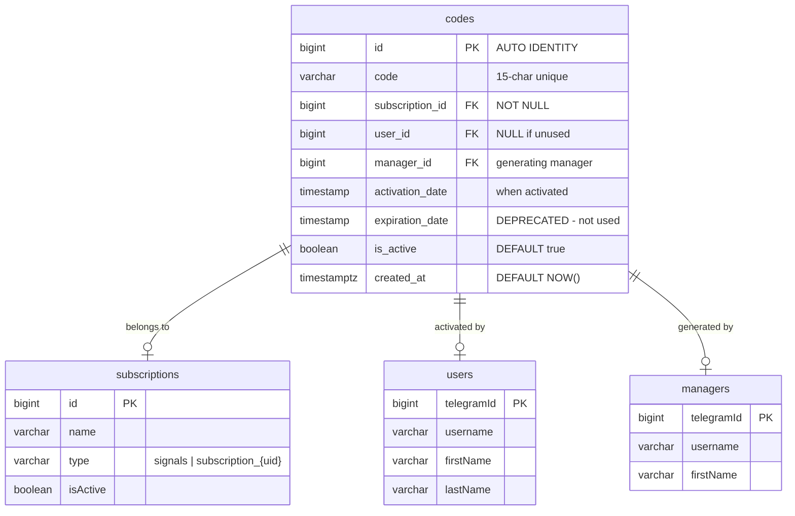
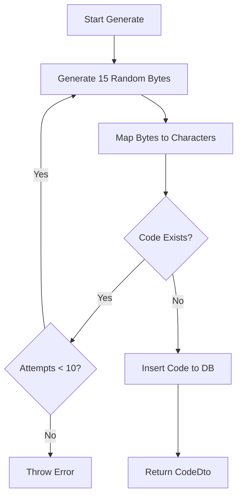
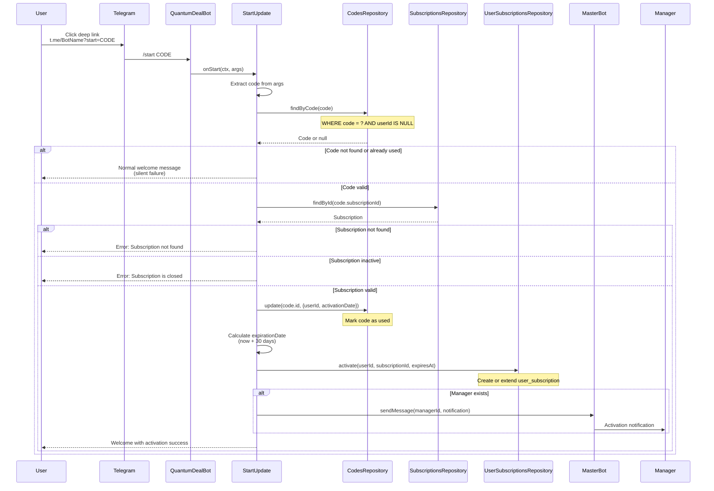
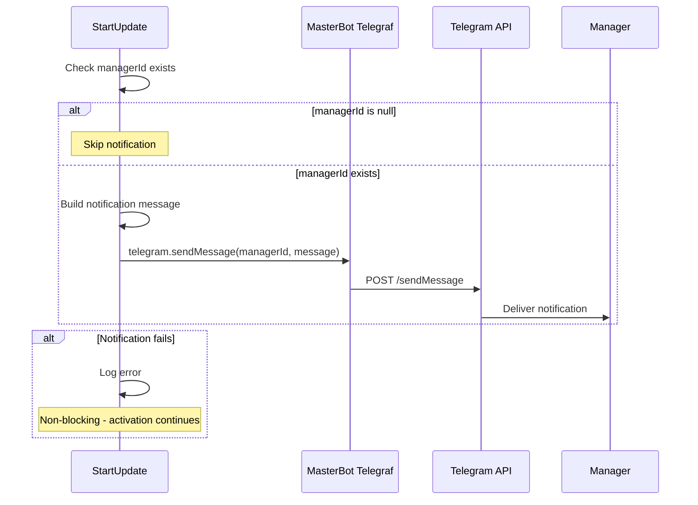
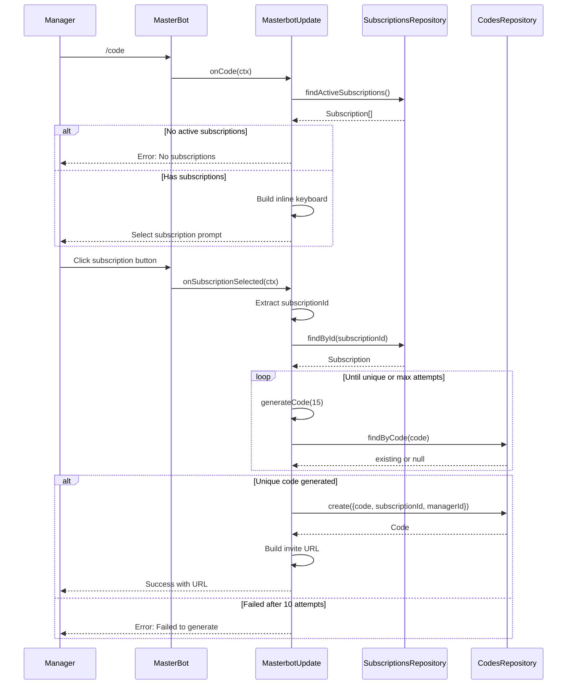
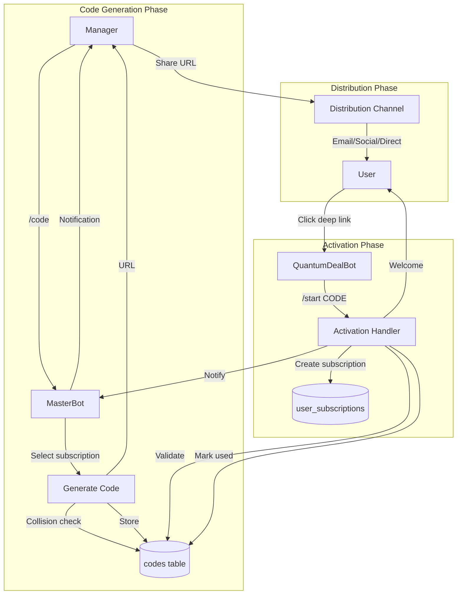
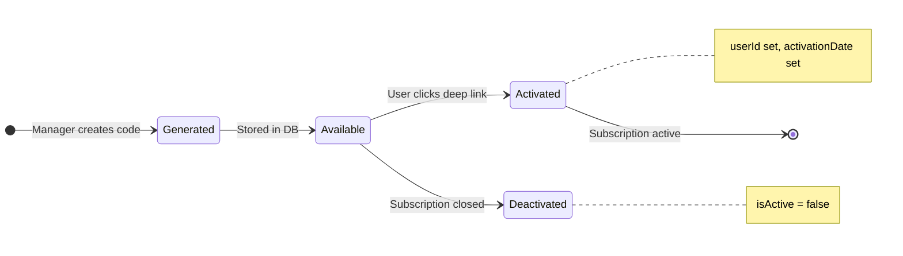

# Design Document: Code Activation System

## Document Information

| Field | Value |
|-------|-------|
| **Status** | Accepted (Implemented) |
| **Created** | 2025-11-25 |
| **Last Updated** | 2025-11-25 |
| **Mode** | Reverse-engineered from implementation |
| **Related PRD** | [subscription-codes-prd.md](../prd/subscription-codes-prd.md) |

## Overview

This Design Document describes the technical architecture of the Code Activation System - a subscription code generation and activation mechanism that enables managers to create unique invite codes and users to activate subscriptions through Telegram deep links. The system was reverse-engineered from the existing implementation to document its architecture.

### Scope

**In Scope:**
- Code generation algorithm with collision detection
- Code activation flow via deep links
- Manager notification mechanism
- Database schema for codes table
- Integration with subscription system

**Out of Scope:**
- Subscription core infrastructure (see subscription-core-design.md)
- Payment processing
- Trial subscription logic (see subscription-trial-prd.md)
- Broadcast subscription logic (see subscription-broadcast-design.md)

---

## Architecture Overview

### High-Level Architecture Diagram

```mermaid
graph TB
    subgraph "Code Generation (MasterBot)"
        MC[/code Command]
        CGS[CodeGenerationService]
        MBU[MasterbotUpdate]
    end

    subgraph "Code Activation (Bot)"
        SU[StartUpdate]
        DL[Deep Link Handler]
    end

    subgraph "Repository Layer"
        CR[CodesRepository]
        SR[SubscriptionsRepository]
        USR[UserSubscriptionsRepository]
        UR[UsersRepository]
    end

    subgraph "Notification"
        MN[Manager Notification]
        MB[MasterBot API]
    end

    subgraph "Database"
        CT[(codes)]
        ST[(subscriptions)]
        UST[(user_subscriptions)]
        UT[(users)]
    end

    MC --> MBU
    MBU --> CR
    MBU --> SR
    CGS --> CR

    DL --> SU
    SU --> CR
    SU --> SR
    SU --> USR
    SU --> UR
    SU --> MN
    MN --> MB

    CR --> CT
    SR --> ST
    USR --> UST
    UR --> UT
```

### Technology Stack

| Layer | Technology | Purpose |
|-------|------------|---------|
| ORM | Drizzle ORM | Type-safe database operations |
| Database | PostgreSQL (Neon Serverless) | Data persistence |
| Framework | NestJS | Dependency injection, module system |
| Language | TypeScript | Type safety, schema inference |
| Crypto | Node.js `crypto.randomBytes()` | Secure random code generation |
| Bot | Telegraf / @quantumdeal/telegraf | Telegram bot integration |

---

## Component Architecture

### Database Schema Design



### Schema Implementation

**Location:** `libs/db/src/schema/codes.ts`

```typescript
export const codes = pgTable('codes', {
  id: bigint('id', { mode: 'number' }).primaryKey().generatedAlwaysAsIdentity(),
  code: varchar('code').notNull(),
  subscriptionId: bigint('subscription_id', { mode: 'number' })
    .notNull()
    .references(() => subscriptions.id),
  userId: bigint('user_id', { mode: 'number' }).references(
    () => users.telegramId,
  ),
  managerId: bigint('manager_id', { mode: 'number' }).references(
    () => managers.telegramId,
  ),
  activationDate: timestamp('activation_date'),
  expirationDate: timestamp('expiration_date'),
  isActive: boolean('is_active').notNull().default(true),
  createdAt: timestamp('created_at', { withTimezone: true })
    .defaultNow()
    .notNull(),
});

export type Code = typeof codes.$inferSelect;
export type NewCode = typeof codes.$inferInsert;
```

### Code States

```mermaid
stateDiagram-v2
    [*] --> Available: Code Created
    Available --> Activated: User activates via deep link
    Available --> Deactivated: Manual deactivation
    Activated --> Deactivated: Subscription closed
    Deactivated --> [*]

    state Available {
        note: "userId IS NULL, isActive = true"
    }
    state Activated {
        note: "userId IS NOT NULL, isActive = true"
    }
    state Deactivated {
        note: "isActive = false"
    }
```

| State | userId | isActive | Description |
|-------|--------|----------|-------------|
| Available | NULL | true | Ready for activation |
| Activated | NOT NULL | true | Used by a user |
| Deactivated | * | false | Manually disabled or subscription closed |

---

## Code Generation Algorithm

### Algorithm Overview

The code generation uses cryptographically secure random bytes to create 15-character alphanumeric codes with collision detection.



### Code Format Specification

- **Character Set**: `ABCDEFGHIJKLMNOPQRSTUVWXYZ0123456789` (36 characters)
- **Length**: 15 characters
- **Entropy**: 36^15 = ~2.2 x 10^23 combinations
- **Pattern**: Random distribution via `crypto.randomBytes()`
- **Example**: `A7K2M9X4P1N6C3B8`

### Implementation Details

**Location:** `libs/masterbot/src/services/code-generation.service.ts`

```typescript
@Injectable()
export class CodeGenerationService {
  constructor(private readonly codesRepository: CodesRepository) {}

  async generateUniqueCode(
    subscriptionId: number,
    managerId: number,
  ): Promise<CodeDto> {
    const maxRetries = 10;

    for (let attempt = 0; attempt < maxRetries; attempt++) {
      const code = this.generateRandomCode(15);

      // Check if code already exists (any status)
      const existing = await this.codesRepository.findOneBy(
        eq(codes.code, code),
      );

      if (!existing) {
        const created = await this.codesRepository.create({
          code,
          subscriptionId,
          managerId,
          isActive: true,
        });
        return this.mapToDto(created);
      }
    }
    throw new Error('Failed to generate unique code after 10 attempts');
  }

  private generateRandomCode(length: number): string {
    const chars = 'ABCDEFGHIJKLMNOPQRSTUVWXYZ0123456789';
    const bytes = crypto.randomBytes(length);
    let result = '';

    for (let i = 0; i < length; i++) {
      result += chars[bytes[i] % chars.length];
    }
    return result;
  }
}
```

### Collision Detection Design

The collision detection follows a check-before-insert pattern:

1. **Generation**: Create random 15-character code
2. **Uniqueness Check**: Query database for any code with matching string (regardless of status)
3. **Retry Logic**: On collision, regenerate up to 10 times
4. **Failure Mode**: Throw error if unique code cannot be generated

**Collision Probability Analysis:**
- Keyspace: 36^15 = 2.21 x 10^23
- With 1 million existing codes: P(collision) = 4.5 x 10^-18 per attempt
- P(10 consecutive collisions) = (4.5 x 10^-18)^10 = practically impossible

---

## Code Activation Flow

### Sequence Diagram



### Deep Link Integration

**Deep Link Format:**
```
https://t.me/{botUsername}?start={code}
```

**Example:**
```
https://t.me/QuantumDealBot?start=A7K2M9X4P1N6C3B8
```

**Handler Location:** `libs/bot/src/commands/start/start.update.ts`

```typescript
@Start()
async onStart(
  @Ctx() ctx: UserContext,
  @Message('text', new SplitCommandPipe())
  args: [string, string | undefined, string[] | undefined] | undefined,
): Promise<void> {
  const user = ctx.user;
  const [, code] = args ?? [];

  // Process activation if code provided
  const { welcomeMessage, codeActivated, trialEligible } =
    await this.handleStart(user, code, statistics);
}
```

### Activation Logic

**Location:** `libs/bot/src/commands/start/start.update.ts` (method: `activateCode`)

```typescript
private async activateCode(
  user: UserWithSubscriptions,
  code: string,
): Promise<{
  user: UserWithSubscriptions;
  activatedSubscription?: {
    subscription: Subscription;
    expiresAt: Date;
  };
}> {
  // Step 1: Find available code (validates userId IS NULL)
  const $code = await this.codesRepository.findByCode(code);
  if (!$code) {
    return { user }; // Silent failure - code not found or already used
  }

  // Step 2: Validate subscription
  const subscription = await this.subscriptionsRepository.findById(
    $code.subscriptionId,
  );
  if (!subscription) {
    throw new Error('Subscription not found');
  }
  if (!subscription.isActive) {
    throw new Error('This subscription is closed');
  }

  // Step 3: Mark code as used
  await this.codesRepository.update($code.id, {
    userId: user.telegramId,
    activationDate: new Date(),
  });

  // Step 4: Create subscription (30 days)
  const expirationDate = new Date();
  expirationDate.setDate(expirationDate.getDate() + 30);

  await this.userSubscriptionsRepository.activate(
    user.telegramId,
    subscription.id,
    expirationDate,
  );

  // Step 5: Notify manager
  if ($code.managerId) {
    await this.sendManagerNotification(
      $code.managerId,
      user,
      subscription,
      expirationDate,
      $code.code,
    );
  }

  return {
    user,
    activatedSubscription: { subscription, expiresAt: expirationDate },
  };
}
```

---

## Manager Notification Flow

### Notification Sequence



### Notification Message Format

```
✅ *Subscription Activated*

👤 User: @username
📋 Subscription: Subscription Name
🏷️ Type: signals subscription / broadcast group
📅 Valid until November 25, 2025
🎫 Code: `A7K2M9X4P1N6C3B8`
```

### Implementation

**Location:** `libs/bot/src/commands/start/start.update.ts` (method: `sendManagerNotification`)

```typescript
private async sendManagerNotification(
  managerId: number,
  user: UserWithSubscriptions,
  subscription: Subscription,
  expirationDate: Date,
  code: string,
): Promise<void> {
  const subscriptionType = isBroadcastSubscription(subscription.type)
    ? 'broadcast group'
    : 'signals subscription';

  const userName = user.username
    ? `@${user.username}`
    : user.firstName || `User ${user.telegramId}`;

  const expirationText = expirationDate
    ? `until ${expirationDate.toLocaleDateString('en-US', {
        year: 'numeric',
        month: 'long',
        day: 'numeric'
      })}`
    : 'permanently';

  const managerMessage =
    `✅ *Subscription Activated*\n\n` +
    `👤 User: ${userName}\n` +
    `📋 Subscription: ${subscription.name}\n` +
    `🏷️ Type: ${subscriptionType}\n` +
    `📅 Valid ${expirationText}\n` +
    `🎫 Code: \`${code}\``;

  try {
    await this.masterbot.telegram.sendMessage(managerId, managerMessage, {
      parse_mode: 'Markdown',
    });
  } catch (error) {
    this.logger.error(
      `Failed to send manager notification to ${managerId}`,
      error,
    );
    // Non-blocking: activation continues even if notification fails
  }
}
```

---

## Code Generation Command Flow (MasterBot)

### /code Command Sequence



### Implementation Details

**Location:** `libs/masterbot/src/masterbot.update.ts`

#### /code Command Handler

```typescript
@Command('code')
async onCode(@Ctx() ctx: UserContext): Promise<void> {
  const manager = ctx.manager;
  if (!manager) {
    await ctx.reply(MASTERBOT_CONSTANTS.MESSAGES.AUTH_REQUIRED);
    return;
  }

  // Get all active subscriptions
  const activeSubscriptions =
    await this.subscriptionsRepository.findActiveSubscriptions();

  if (activeSubscriptions.length === 0) {
    await ctx.reply('❌ Нет активных подписок.');
    return;
  }

  // Build inline keyboard with subscription options
  const subscriptionButtons = activeSubscriptions.map((subscription) => [
    {
      text: subscription.name,
      callback_data: `subscription_${subscription.id}`,
    },
  ]);

  await ctx.reply('🎫 *Select your subscription option*', {
    parse_mode: 'Markdown',
    reply_markup: { inline_keyboard: subscriptionButtons },
  });
}
```

#### Subscription Selection Handler

```typescript
@Action(/^subscription_(\d+)$/)
async onSubscriptionSelected(@Ctx() ctx: UserContext): Promise<void> {
  const manager = ctx.manager;
  const me = await this.bot.telegram.getMe();

  // Extract subscription ID from callback data
  const subscriptionId = parseInt(
    callbackData.replace('subscription_', ''),
    10,
  );

  // Verify subscription exists
  const subscription = await this.subscriptionsRepository.findById(subscriptionId);
  if (!subscription) {
    await ctx.reply('❌ Subscription not found.');
    return;
  }

  // Generate unique code with retry logic
  let code: string;
  let isUnique = false;
  let attempts = 0;
  const maxAttempts = 10;

  while (!isUnique && attempts < maxAttempts) {
    code = this.generateCode();
    const existingCode = await this.codesRepository.findByCode(code);
    if (!existingCode) {
      isUnique = true;
    }
    attempts++;
  }

  if (!isUnique) {
    await ctx.reply('❌ Failed to generate unique code.');
    return;
  }

  // Save code to database
  await this.codesRepository.create({
    code: code!,
    subscriptionId,
    managerId: manager.telegramId,
  });

  // Build and send invite URL
  const codeUrl = `https://t.me/${me.username}?start=${code!}`;
  await ctx.sendMessage(`✅ Code URL:\n\`${codeUrl}\``, {
    parse_mode: 'Markdown',
  });
}
```

---

## Data Flow Diagrams

### Complete Code Lifecycle



### Code State Transitions



---

## Repository API Specifications

### CodesRepository

**Location:** `libs/db/src/repositories/codes.repository.ts`

| Method | Signature | Description |
|--------|-----------|-------------|
| `findByCode` | `(code: string) => Promise<Code \| null>` | Find available (unused) code by string |
| `findBySubscription` | `(subscriptionId: number) => Promise<Code[]>` | All codes for subscription |
| `findActiveCodesBySubscription` | `(subscriptionId: number) => Promise<Code[]>` | Active codes for subscription |
| `findUnusedActiveCodesBySubscription` | `(subscriptionId: number) => Promise<Code[]>` | Available (unused) active codes |
| `findActivatedCodesBySubscription` | `(subscriptionId: number) => Promise<Code[]>` | Used codes for subscription |
| `activateCode` | `(codeId, userId, activationDate?, expirationDate?) => Promise<Code \| null>` | Mark code as used |
| `deactivateCode` | `(id: number) => Promise<Code \| null>` | Disable single code |
| `deactivateCodesBySubscription` | `(subscriptionId: number) => Promise<void>` | Disable all subscription codes |

### Key Query Patterns

#### findByCode - Find Available Code

```typescript
public async findByCode(code: string) {
  const condition = and(
    eq(this.table.code, code),
    isNull(this.table.userId)  // Only unused codes
  );
  return this.findOneBy(condition);
}
```

**Important:** This method returns `null` for already-activated codes (where `userId IS NOT NULL`), implementing silent failure for reuse attempts.

#### activateCode - Mark as Used

```typescript
async activateCode(
  codeId: number,
  userId: number,
  activationDate?: Date,
  expirationDate?: Date,
): Promise<Code | null> {
  return this.update(codeId, {
    userId,
    activationDate: activationDate || new Date(),
    expirationDate,  // Optional, not currently used
  });
}
```

---

## CodeGenerationService API

**Location:** `libs/masterbot/src/services/code-generation.service.ts`

| Method | Signature | Description |
|--------|-----------|-------------|
| `generateUniqueCode` | `(subscriptionId: number, managerId: number) => Promise<CodeDto>` | Generate and store unique code |
| `validateCode` | `(code: string) => Promise<boolean>` | Check if code exists and is active |
| `getInviteUrl` | `(code: string, botUsername: string) => string` | Generate Telegram invite URL |

### CodeDto

```typescript
export class CodeDto {
  id: number;
  code: string;
  subscriptionId: number;
  managerId: number;
  isActive: boolean;
  createdAt: Date;
}
```

---

## Integration Points

### Integration Point Map

```yaml
Integration Point 1:
  Existing Component: StartUpdate.onStart()
  Integration Method: Command parameter parsing via SplitCommandPipe
  Impact Level: High (Process Flow Change)
  Required Test Coverage: Deep link activation verification

Integration Point 2:
  Existing Component: UserSubscriptionsRepository.activate()
  Integration Method: Direct service call
  Impact Level: Medium (Data Creation)
  Required Test Coverage: Subscription creation and extension

Integration Point 3:
  Existing Component: MasterBot Telegraf instance
  Integration Method: Bot injection via @InjectBot
  Impact Level: Low (Notification only)
  Required Test Coverage: Manager notification delivery

Integration Point 4:
  Existing Component: SubscriptionsRepository.findActiveSubscriptions()
  Integration Method: Direct service call
  Impact Level: Low (Read-only)
  Required Test Coverage: Subscription list retrieval
```

---

## Error Handling

### Error Categories

| Error Type | Handler | User Experience |
|------------|---------|-----------------|
| Code not found | Silent failure | Normal welcome message |
| Code already used | Silent failure | Normal welcome message |
| Subscription not found | Throw Error | Error shown to user |
| Subscription closed | Throw Error | Error shown to user |
| Manager notification failure | Log and continue | Activation succeeds |
| Code generation failure (10 retries) | Throw Error | Error shown to manager |

### Silent Failure Design

The system uses silent failure for invalid/used codes to prevent:
1. Code enumeration attacks
2. Poor user experience from error messages
3. Information leakage about valid codes

```typescript
// Silent failure implementation
const $code = await this.codesRepository.findByCode(code);
if (!$code) {
  return { user }; // Return without error, show normal welcome
}
```

---

## Security Considerations

### Code Security

1. **Entropy**: 36^15 combinations provide sufficient entropy against brute force
2. **Cryptographic Randomness**: Uses `crypto.randomBytes()` for generation
3. **Single-Use**: Codes can only be activated once (`userId` check)
4. **Silent Failure**: Invalid codes don't reveal existence information

### Manager Authentication

- Managers are authenticated via MasterBot middleware
- Only authenticated managers can generate codes
- Manager ID is stored with each code for attribution

### Audit Trail

| Event | Recorded Data |
|-------|---------------|
| Code generated | managerId, subscriptionId, createdAt |
| Code activated | userId, activationDate |
| Code deactivated | isActive = false |

---

## File Locations

| Component | Path |
|-----------|------|
| **Schema** | |
| codes | `libs/db/src/schema/codes.ts` |
| **Repository** | |
| CodesRepository | `libs/db/src/repositories/codes.repository.ts` |
| **Services** | |
| CodeGenerationService | `libs/masterbot/src/services/code-generation.service.ts` |
| **Handlers** | |
| StartUpdate (activation) | `libs/bot/src/commands/start/start.update.ts` |
| MasterbotUpdate (generation) | `libs/masterbot/src/masterbot.update.ts` |
| **DTOs** | |
| CodeDto | `libs/masterbot/src/dto/code.dto.ts` |

---

## Known Issues and Limitations

### Issue 1: Duplicate Code Generation Logic

**Description:** Code generation logic exists in two places:
1. `CodeGenerationService.generateUniqueCode()` - Service pattern (uses `findOneBy(eq(codes.code, code))`)
2. `MasterbotUpdate.onSubscriptionSelected()` - Inline implementation (uses `findByCode(code)`)

**Impact:** Code duplication and potential bug. The inline implementation uses `findByCode()` which only checks for unused codes (`userId IS NULL`). This means if a code was previously activated, the inline implementation could generate a new code with the same string, creating duplicate code values in the database.

**Severity:** Low - The collision probability is extremely low (36^15 combinations), but the bug exists.

**Recommendation:** Consolidate to use only `CodeGenerationService` which correctly checks for ANY existing code regardless of activation status.

### Issue 2: expirationDate Field Unused

**Description:** The `codes.expirationDate` field exists in schema but is never used.

**Current Behavior:** Codes don't expire; validity is controlled by:
- `isActive` flag
- Subscription's `isActive` status

**Recommendation:** Remove field in future migration or implement code expiration if needed

### Issue 3: findByCode Query Design

**Description:** The `findByCode` repository method serves two distinct purposes with different query requirements:

1. **Code Activation** (in `StartUpdate.activateCode()`):
   - Query: `and(eq(codes.code, code), isNull(codes.userId))`
   - Purpose: Find only UNUSED codes for activation
   - Behavior: Correct - returns null for already-activated codes (silent failure)

2. **Code Generation Collision Check**:
   - `CodeGenerationService`: Uses `findOneBy(eq(codes.code, code))` - finds ANY code (correct)
   - `MasterbotUpdate` inline: Uses `findByCode(code)` - finds only UNUSED codes (incorrect, see Issue 1)

**Impact:** The inline implementation in `MasterbotUpdate` has a potential bug (documented in Issue 1). The `CodeGenerationService` implementation is correct.

---

## Acceptance Criteria Verification

Based on PRD functional requirements:

| Requirement | Status | Verification |
|-------------|--------|--------------|
| FR-001: 15-char alphanumeric code | Implemented | `generateRandomCode(15)` |
| FR-002: Collision detection (10 retries) | Implemented | `maxRetries = 10` loop |
| FR-003: Persistent storage | Implemented | `codesRepository.create()` |
| FR-004: isActive flag | Implemented | Schema default `true` |
| FR-005: Subscription binding | Implemented | `subscriptionId` FK |
| FR-006: Manager attribution | Implemented | `managerId` FK |
| FR-007: Invite URL generation | Implemented | `getInviteUrl()` |
| FR-008: userId IS NULL validation | Implemented | `findByCode()` query |
| FR-009: Activation marking | Implemented | `activateCode()` |
| FR-010: Subscription creation | Implemented | `userSubscriptionsRepository.activate()` |
| FR-011: Manager notification | Implemented | `sendManagerNotification()` |
| FR-012: Subscription validation | Implemented | `findById()` + `isActive` check |
| FR-013: Deep link support | Implemented | `SplitCommandPipe` parsing |
| FR-014: Subscription extension | Implemented | `activate()` handles existing |
| FR-015: Silent failure | Implemented | Return without error |
| FR-016: Batch deactivation | Implemented | `deactivateCodesBySubscription()` |
| FR-017: Code statistics | Implemented | Repository query methods |
| FR-018: Subscription selection UI | Implemented | Inline keyboard |

---

## References

- PRD: [subscription-codes-prd.md](../prd/subscription-codes-prd.md)
- Related Design: [subscription-core-design.md](./subscription-core-design.md)
- Telegraf Documentation: https://telegraf.js.org/
- Telegram Deep Links: https://core.telegram.org/bots/features#deep-linking
- Node.js Crypto: https://nodejs.org/api/crypto.html

---

## Revision History

| Version | Date | Author | Changes |
|---------|------|--------|---------|
| 1.0.0 | 2025-11-25 | AI Assistant | Initial reverse-engineered documentation |
| 1.0.1 | 2025-11-25 | AI Assistant | Audit: Updated Issue 1 and Issue 3 to document potential bug in inline code generation using incorrect collision check query |
