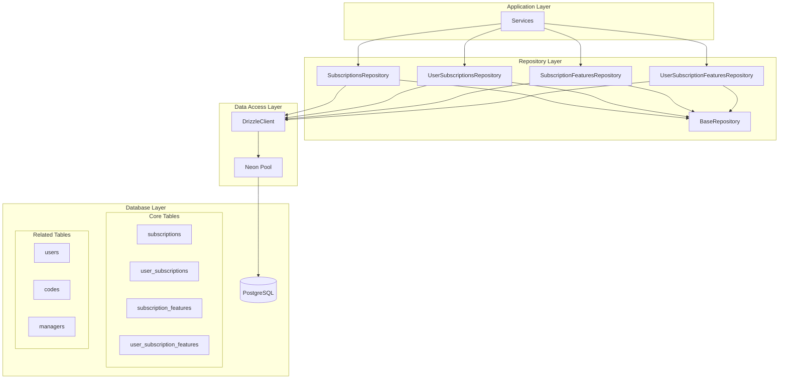
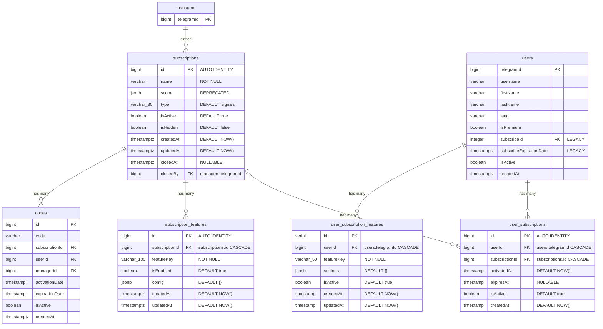
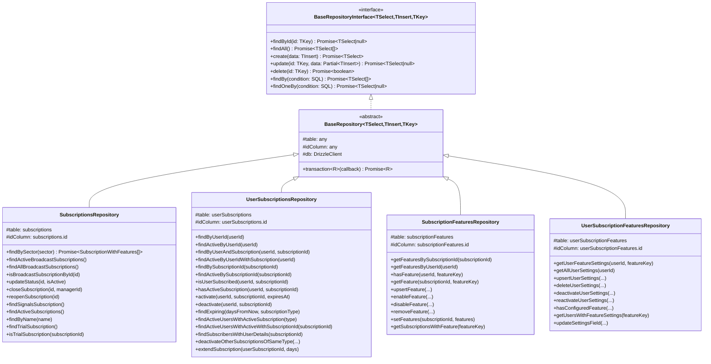
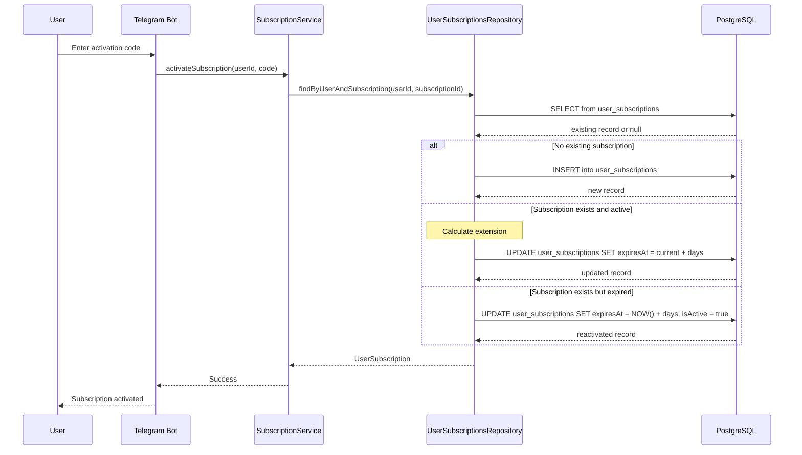
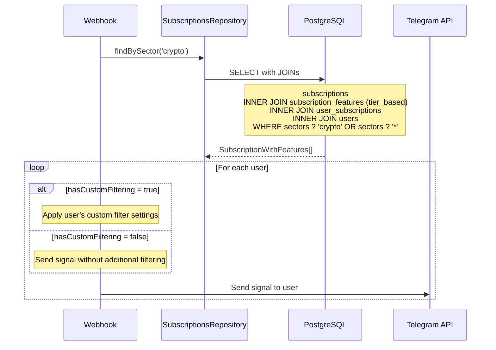
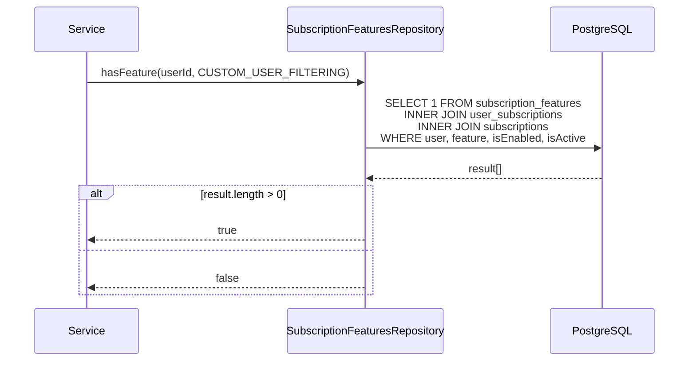
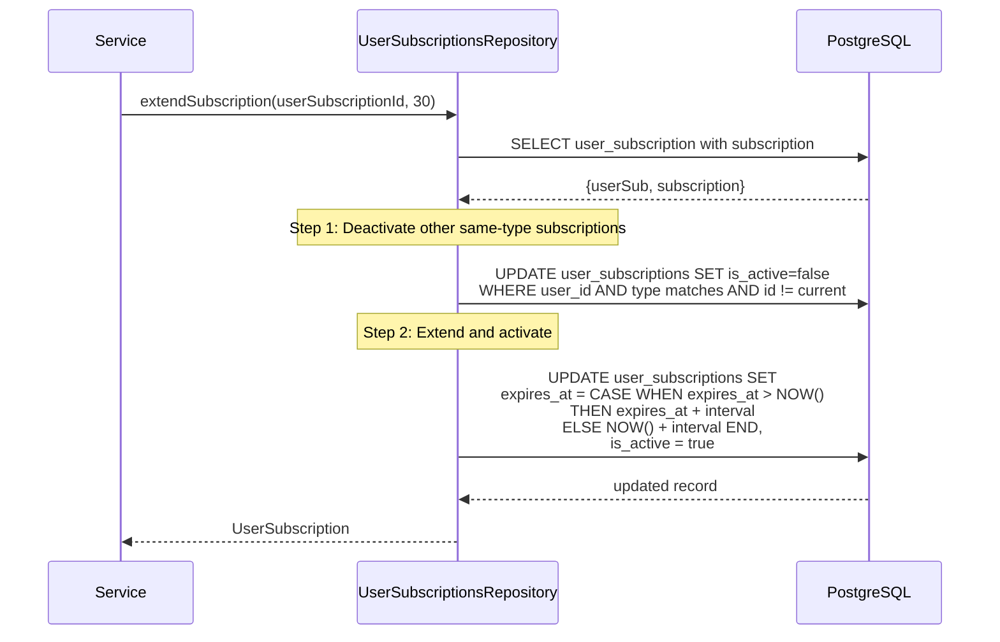
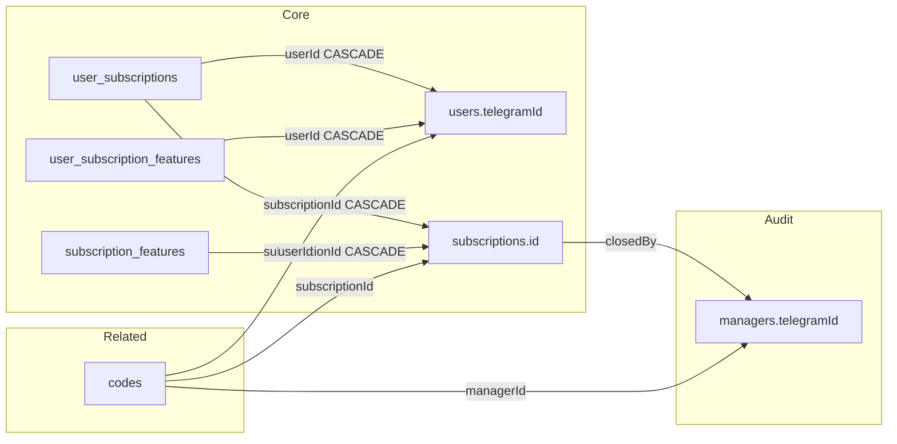

# Design Document: Core Subscription Infrastructure

## Document Information

| Field | Value |
|-------|-------|
| **Status** | Accepted (Implemented) |
| **Created** | 2025-11-25 |
| **Last Updated** | 2025-11-25 |
| **Mode** | Reverse-engineered from implementation |
| **Related PRD** | [subscription-core-prd.md](../prd/subscription-core-prd.md) |

## Overview

This Design Document describes the technical architecture of the Core Subscription Infrastructure - a flexible subscription management system that enables many-to-many user-subscription relationships with feature flags support. The system was reverse-engineered from the existing implementation to document its architecture.

### Scope

**In Scope:**
- Database schema design (4 tables)
- Repository pattern implementation (4 repositories + base)
- Feature flags system architecture
- Subscription types (signals/broadcast)
- User-subscription relationship management

**Out of Scope:**
- Business requirements (see PRD)
- Payment processing
- Telegram bot commands
- Signal delivery logic

---

## Architecture Overview

### High-Level Architecture Diagram



### Technology Stack

| Layer | Technology | Purpose |
|-------|------------|---------|
| ORM | Drizzle ORM | Type-safe database operations |
| Database | PostgreSQL (Neon Serverless) | Data persistence |
| Framework | NestJS | Dependency injection, module system |
| Language | TypeScript | Type safety, schema inference |
| ID Generation | nanoid | Unique broadcast subscription UIDs |

---

## Component Architecture

### Database Schema Design



### Schema Implementation Details

#### subscriptions.ts
**Location:** `libs/db/src/schema/subscriptions.ts`

```typescript
// Key type definitions
export const SubscriptionType = {
  SIGNALS: 'signals',
} as const;

// Helper functions
export function generateSubscriptionUID(): string // nanoid(10)
export function generateBroadcastSubscriptionType(): string // 'subscription_{uid}'
export function isBroadcastSubscription(type: string): boolean // type.startsWith('subscription_')

// Inferred types
export type Subscription = typeof subscriptions.$inferSelect;
export type NewSubscription = typeof subscriptions.$inferInsert;
```

#### user-subscriptions.ts
**Location:** `libs/db/src/schema/user-subscriptions.ts`

Core many-to-many relationship table replacing:
- `users.subscribeId` (legacy one-to-one)
- `codes.userId/activationDate/expirationDate` (legacy activation data)

#### subscription-features.ts
**Location:** `libs/db/src/schema/subscription-features.ts`

```typescript
export enum FeatureFlag {
  TIER_BASED_FILTERING = 'tier_based_filtering',
  CUSTOM_USER_FILTERING = 'custom_user_filtering',
}

export type FeatureConfig = Record<string, unknown>;
```

**Unique Constraint:** `uq_subscription_feature(subscription_id, feature_key)`

#### user-subscription-features.ts
**Location:** `libs/db/src/schema/user-subscription-features.ts`

```typescript
export type UserFeatureSettings = Record<string, unknown>;
// Example: { symbols: ['GBPUSD.a', 'EURUSD.a'] }
```

**Unique Constraint:** `unique_user_feature(user_id, feature_key)`

---

## Repository Pattern Architecture

### BaseRepository Design

**Location:** `libs/db/src/repositories/base.repository.ts`



### Dependency Injection

All repositories use NestJS dependency injection with the `DRIZZLE_CLIENT` token:

```typescript
@Injectable()
export class SubscriptionsRepository extends BaseRepository<...> {
  constructor(@Inject(DRIZZLE_CLIENT) db: DrizzleClient) {
    super(db);
  }
}
```

**Provider:** `libs/db/src/database.provider.ts`
- Creates `NeonDatabase<typeof schema>` client
- Uses `@neondatabase/serverless` Pool
- Configured with `snake_case` naming convention

---

## Data Flow Diagrams

### Subscription Activation Flow



### Sector-based Signal Filtering Flow



### Feature Flag Check Flow



### Subscription Extension Flow



---

## Technical Decisions and Rationale

### TD-001: Many-to-Many Architecture

**Decision:** Replace one-to-one `users.subscribeId` with `user_subscriptions` junction table

**Rationale:**
- Users can have multiple simultaneous subscriptions (signals + multiple broadcasts)
- Each subscription can have independent expiration dates
- Historical subscription data preserved for analytics

**Trade-offs:**
- More complex queries with JOINs
- Migration required from legacy model
- (+) Greater flexibility for future subscription types

### TD-002: Feature Flags via Separate Table

**Decision:** Store features in `subscription_features` table with JSONB config instead of columns on `subscriptions`

**Rationale:**
- New features can be added without schema migration
- Features can be enabled/disabled per subscription independently
- JSONB config allows feature-specific parameters (e.g., `sectors: ['crypto']`)

**Implementation:**
```typescript
enum FeatureFlag {
  TIER_BASED_FILTERING = 'tier_based_filtering',
  CUSTOM_USER_FILTERING = 'custom_user_filtering',
}
```

### TD-003: User-Level Feature Settings

**Decision:** Separate `user_subscription_features` table for user-specific configurations

**Rationale:**
- Users customize features differently (e.g., different symbol filters)
- Settings preserved on subscription downgrade (soft delete with `isActive`)
- Decouples subscription-level feature grants from user-level preferences

### TD-004: Subscription Type Pattern

**Decision:** Use string pattern `'signals'` | `'subscription_{nanoid}'` for type discrimination

**Rationale:**
- Clear distinction between primary signals and broadcast channels
- Unique broadcast types prevent collisions
- Simple helper function `isBroadcastSubscription()` for type checking

**Implementation:**
```typescript
export function isBroadcastSubscription(type: string): boolean {
  return type.startsWith('subscription_');
}
```

### TD-005: Cascade Deletion Strategy

**Decision:** Use `onDelete: 'cascade'` for all foreign keys in subscription tables

**Rationale:**
- Automatic cleanup of child records
- No orphaned user_subscriptions or features
- Consistent data integrity

**Tables affected:**
- `user_subscriptions.userId` -> `users.telegramId`
- `user_subscriptions.subscriptionId` -> `subscriptions.id`
- `subscription_features.subscriptionId` -> `subscriptions.id`
- `user_subscription_features.userId` -> `users.telegramId`

### TD-006: Soft Delete Pattern

**Decision:** Use `isActive` boolean flag instead of hard deletion

**Rationale:**
- Preserve historical data for analytics
- Enable subscription reactivation
- Audit trail for subscription lifecycle

**Applied to:**
- `subscriptions.isActive` - subscription availability
- `user_subscriptions.isActive` - user's subscription status
- `subscription_features.isEnabled` - feature availability
- `user_subscription_features.isActive` - user settings availability

### TD-007: Timestamp Handling Inconsistency

**Known Issue:** Mixed timestamp strategies across tables

| Table | Timestamps |
|-------|-----------|
| subscriptions | `WITH TIME ZONE` |
| subscription_features | `WITH TIME ZONE` |
| user_subscriptions | WITHOUT TIME ZONE |
| user_subscription_features | WITHOUT TIME ZONE |

**Mitigation:** Application layer handles timezone conversion when necessary.

### TD-008: Legacy Field Deprecation

**Deprecated Fields:**
- `subscriptions.scope` - Replaced by `subscription_features.config.sectors`
- `users.subscribeId` - Replaced by `user_subscriptions` table
- `users.subscribeExpirationDate` - Replaced by `user_subscriptions.expiresAt`

**Migration Path:** Legacy fields remain for backward compatibility; new code uses `user_subscriptions` as authoritative source.

---

## API Specifications

### SubscriptionsRepository

| Method | Signature | Description |
|--------|-----------|-------------|
| `findById` | `(id: number) => Promise<Subscription \| null>` | Inherited from BaseRepository |
| `findByName` | `(name: string) => Promise<Subscription \| null>` | Find subscription by name |
| `findSignalsSubscription` | `() => Promise<Subscription \| null>` | Find primary signals subscription |
| `findTrialSubscription` | `() => Promise<Subscription \| null>` | Find subscription with `is_trial` feature |
| `findActiveSubscriptions` | `() => Promise<Subscription[]>` | Find all active, non-hidden subscriptions |
| `findActiveBroadcastSubscriptions` | `() => Promise<Subscription[]>` | Find all active subscriptions |
| `findAllBroadcastSubscriptions` | `() => Promise<Subscription[]>` | Find subscriptions with `subscription_%` type |
| `findBySector` | `(sector: string) => Promise<SubscriptionWithFeatures[]>` | Find users with tier-based filtering for sector |
| `updateStatus` | `(id: number, isActive: boolean) => Promise<Subscription \| null>` | Soft delete/restore |
| `closeSubscription` | `(id: number, managerId: number) => Promise<Subscription \| null>` | Close with audit trail |
| `reopenSubscription` | `(id: number) => Promise<Subscription \| null>` | Reopen closed subscription |
| `isTrialSubscription` | `(subscriptionId: number) => Promise<boolean>` | Check trial status |
| `isBroadcastSubscriptionById` | `(id: number) => Promise<boolean>` | Check broadcast type |

### SubscriptionWithFeatures Interface

```typescript
interface SubscriptionWithFeatures {
  // Subscription fields
  subscriptionId: number;
  subscriptionName: string;
  subscriptionIsActive: boolean;

  // Feature flag
  hasCustomFiltering: boolean;

  // User fields
  userId: number;
  userTelegramId: string;
  userFirstName: string;
  userLastName: string | null;
  userUsername: string | null;
  userLang: string | null;

  // UserSubscription fields
  userSubscriptionId: number;
  userSubscriptionActivatedAt: Date;
  userSubscriptionExpiresAt: Date | null;
  userSubscriptionEndDate: Date | null; // Backward compatibility alias
  userSubscriptionIsActive: boolean;
}
```

### UserSubscriptionsRepository

| Method | Signature | Description |
|--------|-----------|-------------|
| `findByUserId` | `(userId: number) => Promise<UserSubscription[]>` | All subscriptions for user |
| `findActiveByUserId` | `(userId: number) => Promise<UserSubscription[]>` | Active, non-expired subscriptions |
| `findByUserAndSubscription` | `(userId, subscriptionId) => Promise<UserSubscription \| null>` | Specific user-subscription |
| `findActiveByUserIdWithSubscription` | `(userId: number) => Promise<Array<{userSubscription, subscription}>>` | With full subscription details |
| `findBySubscriptionId` | `(subscriptionId: number) => Promise<UserSubscription[]>` | All users for subscription |
| `findActiveBySubscriptionId` | `(subscriptionId: number) => Promise<Array<{user, userSubscription}>>` | Active users with details |
| `isUserSubscribed` | `(userId, subscriptionId) => Promise<boolean>` | Check existence (any status) |
| `hasActiveSubscription` | `(userId, subscriptionId) => Promise<boolean>` | Check active status |
| `activate` | `(userId, subscriptionId, expiresAt?) => Promise<UserSubscription>` | Activate or extend |
| `deactivate` | `(userId, subscriptionId) => Promise<void>` | Soft delete |
| `findExpiring` | `(daysFromNow, subscriptionType?) => Promise<Array<{user, subscription, userSubscription}>>` | Expiring in N days |
| `findActiveUsersWithActiveSubscription` | `(subscriptionType?) => Promise<Array<{user, subscription, userSubscription}>>` | All active with type filter |
| `findActiveUsersWithActiveWithSubscriptionId` | `(subscriptionId: number) => Promise<Array<{user, subscription, userSubscription}>>` | Active by subscription ID |
| `findSubscribersWithUserDetails` | `(subscriptionId: number) => Promise<Array<{user, userSubscription}>>` | Subscribers with user info |
| `deactivateOtherSubscriptionsOfSameType` | `(userId, keepId, subscriptionType) => Promise<void>` | Deactivate competing subscriptions |
| `extendSubscription` | `(userSubscriptionId, additionalDays) => Promise<UserSubscription \| null>` | Extend and reactivate |

### SubscriptionFeaturesRepository

| Method | Signature | Description |
|--------|-----------|-------------|
| `getFeaturesBySubscriptionId` | `(subscriptionId: number) => Promise<SubscriptionFeature[]>` | Enabled features for subscription |
| `getFeaturesByUserId` | `(userId: number) => Promise<SubscriptionFeature[]>` | All enabled features for user |
| `hasFeature` | `(userId, featureKey: FeatureFlag) => Promise<boolean>` | Check if user has feature |
| `getFeature` | `(subscriptionId, featureKey) => Promise<SubscriptionFeature \| null>` | Get feature with config |
| `upsertFeature` | `(subscriptionId, featureKey, isEnabled?, config?) => Promise<SubscriptionFeature>` | Create or update |
| `enableFeature` | `(subscriptionId, featureKey, config?) => Promise<SubscriptionFeature>` | Enable feature |
| `disableFeature` | `(subscriptionId, featureKey) => Promise<void>` | Soft delete |
| `removeFeature` | `(subscriptionId, featureKey) => Promise<void>` | Hard delete |
| `setFeatures` | `(subscriptionId, features[]) => Promise<void>` | Replace all features (atomic) |
| `getSubscriptionsWithFeature` | `(featureKey) => Promise<number[]>` | Subscription IDs with feature |

### UserSubscriptionFeaturesRepository

| Method | Signature | Description |
|--------|-----------|-------------|
| `getUserFeatureSettings` | `(userId, featureKey) => Promise<UserSubscriptionFeature \| null>` | Active settings |
| `getAllUserSettings` | `(userId: number) => Promise<UserSubscriptionFeature[]>` | All active settings |
| `upsertUserSettings` | `(userId, featureKey, settings) => Promise<UserSubscriptionFeature>` | Create or update |
| `deleteUserSettings` | `(userId, featureKey) => Promise<void>` | Hard delete |
| `deactivateUserSettings` | `(userId, featureKey) => Promise<void>` | Soft delete (preserve) |
| `reactivateUserSettings` | `(userId, featureKey) => Promise<void>` | Restore from soft delete |
| `hasConfiguredFeature` | `(userId, featureKey) => Promise<boolean>` | Check if settings exist |
| `getUsersWithFeatureSettings` | `(featureKey) => Promise<number[]>` | User IDs with active settings |
| `updateSettingsField` | `(userId, featureKey, path[], value) => Promise<void>` | Partial JSONB update |

---

## Database Indexes and Constraints

### Unique Constraints

| Constraint Name | Table | Columns | Purpose |
|-----------------|-------|---------|---------|
| `uq_subscription_feature` | subscription_features | (subscription_id, feature_key) | One feature per subscription |
| `unique_user_feature` | user_subscription_features | (user_id, feature_key) | One settings per user-feature |

### Foreign Key Relationships



---

## File Locations

| Component | Path |
|-----------|------|
| **Schema Files** | |
| subscriptions | `libs/db/src/schema/subscriptions.ts` |
| user-subscriptions | `libs/db/src/schema/user-subscriptions.ts` |
| subscription-features | `libs/db/src/schema/subscription-features.ts` |
| user-subscription-features | `libs/db/src/schema/user-subscription-features.ts` |
| users | `libs/db/src/schema/users.ts` |
| codes | `libs/db/src/schema/codes.ts` |
| **Repository Files** | |
| BaseRepository | `libs/db/src/repositories/base.repository.ts` |
| SubscriptionsRepository | `libs/db/src/repositories/subscriptions.repository.ts` |
| UserSubscriptionsRepository | `libs/db/src/repositories/user-subscriptions.repository.ts` |
| SubscriptionFeaturesRepository | `libs/db/src/repositories/subscription-features.repository.ts` |
| UserSubscriptionFeaturesRepository | `libs/db/src/repositories/user-subscription-features.repository.ts` |
| **Infrastructure** | |
| Database Provider | `libs/db/src/database.provider.ts` |

---

## Known Issues and Limitations

### Issue 1: findActiveBroadcastSubscriptions() Bug
**Location:** `SubscriptionsRepository.findActiveBroadcastSubscriptions()`

**Current Behavior:** Returns ALL active subscriptions (no type filter)
```typescript
async findActiveBroadcastSubscriptions(): Promise<Subscription[]> {
  return this.findBy(and(eq(this.table.isActive, true)));
}
```

**Expected Behavior:** Should filter by `type LIKE 'subscription_%'`

**Impact:** Low - method name and JSDoc comment are misleading but not causing functional issues

**Note:** The JSDoc comment in the repository incorrectly states "CRITICAL: Filters by type LIKE 'subscription_%'" but the implementation does not include this filter. The `findAllBroadcastSubscriptions()` method correctly filters by type.

### Issue 2: Timestamp Inconsistency
**Description:** Mixed `WITH TIME ZONE` and `WITHOUT TIME ZONE` across tables

**Affected Tables:**
- `subscriptions` - WITH TIME ZONE
- `subscription_features` - WITH TIME ZONE
- `user_subscriptions` - WITHOUT TIME ZONE
- `user_subscription_features` - WITHOUT TIME ZONE

**Recommendation:** Standardize to `WITH TIME ZONE` in future migration

### Issue 3: Legacy Fields Coexistence
**Description:** Old subscription model fields still exist in `users` table

**Fields:**
- `users.subscribeId` (integer type, while `subscriptions.id` is bigint)
- `users.subscribeExpirationDate`

**Status:** Deprecated but maintained for backward compatibility

**Note:** The `subscribeId` field is defined as `integer` while `subscriptions.id` is `bigint`. This type mismatch is acceptable since the field is deprecated and the new `user_subscriptions` table uses proper `bigint` references.

---

## Revision History

| Version | Date | Author | Changes |
|---------|------|--------|---------|
| 1.0.0 | 2025-11-25 | AI Assistant | Initial reverse-engineered documentation |
| 1.0.1 | 2025-11-25 | AI Assistant | Audit: Enhanced Known Issues with JSDoc mismatch note; Added type mismatch note for legacy subscribeId field |

---

## References

- PRD: [subscription-core-prd.md](../prd/subscription-core-prd.md)
- Drizzle ORM Documentation: https://orm.drizzle.team/
- NestJS Documentation: https://docs.nestjs.com/
- Neon Serverless: https://neon.tech/docs/
