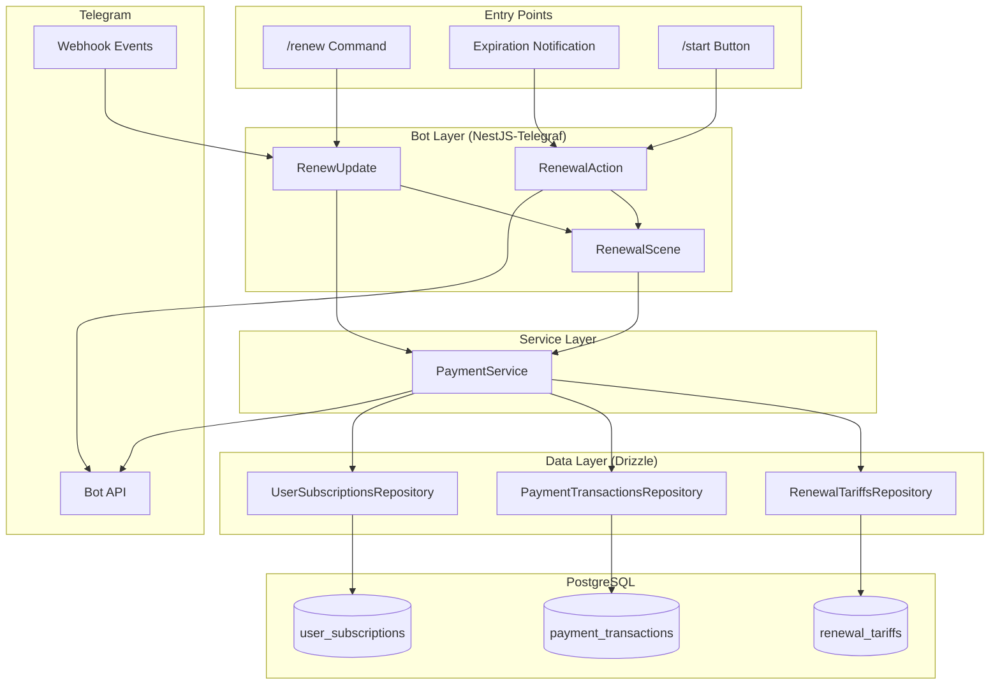
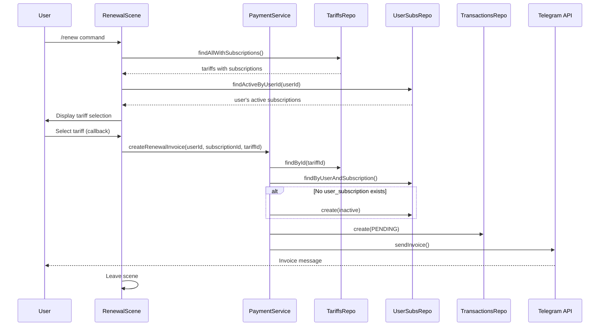
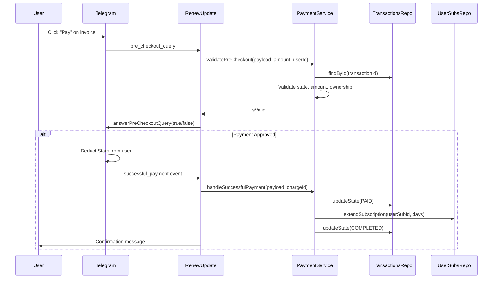
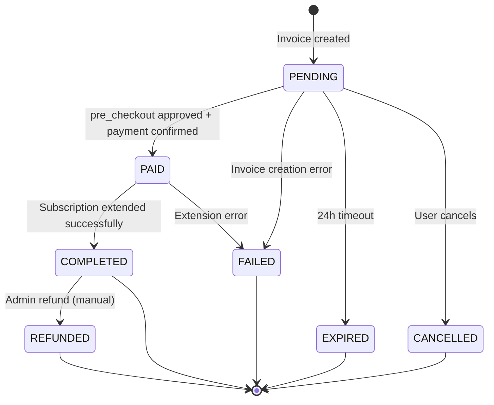

# Subscription Renewal Design Document

## Overview

This document describes the technical design of the Subscription Renewal feature, which enables users to extend their trading signal subscriptions via Telegram Stars payment. The system provides a complete payment lifecycle management using Telegraf Scenes for UI, a payment state machine for transaction tracking, and flexible tariff configuration.

**Note**: This is a reverse-engineered design document from existing implementation. Code is the source of truth.

## Background and Context

### Related PRD

- `docs/prd/subscription-renewal-prd.md` - Product requirements and user stories

### Prerequisite ADRs

- None (feature implemented before ADR process was established)
- Common technical patterns follow existing codebase conventions

### Agreement Checklist

#### Scope (Implemented)
- [x] /renew command opens renewal scene
- [x] Scene displays tariffs grouped by subscription
- [x] Telegram Stars invoice creation and payment processing
- [x] Payment state machine with full lifecycle tracking
- [x] Subscription extension logic (active extension / expired reactivation)
- [x] Multi-language support (8 languages)
- [x] One-click renewal from expiration notifications

#### Non-Scope (Handled Elsewhere)
- [x] Expiration notifications (handled in subscription-signals)
- [x] Core subscription infrastructure (subscription-core)
- [x] Tariff management (admin/seeding operations)
- [x] Refund processing (admin-initiated)

#### Constraints
- Telegram Stars (XTR) as currency with empty provider_token
- Invoice expiration: 24 hours (Telegram limitation)
- Payment irreversibility: Stars payments cannot be auto-refunded

### Problem Solved

Enable seamless subscription renewal for trading signal subscribers:
1. **Multiple entry points**: /renew command, expiration notification button, /start button
2. **Flexible pricing**: Configurable tariffs with discount support
3. **Native payment**: Telegram Stars integration for in-app payments
4. **Full audit trail**: Complete payment lifecycle tracking

## Acceptance Criteria (AC)

Based on PRD functional requirements (FR-001 to FR-020):

### Scene Entry
- [x] AC-001: /renew command opens renewal scene (FR-001)
- [x] AC-002: Scene displays all available tariffs grouped by subscription (FR-002)
- [x] AC-003: Tariff buttons show period, price, and discount badge (FR-003, FR-016)
- [x] AC-004: Current subscriptions displayed with expiry dates (FR-004)
- [x] AC-005: Hidden subscriptions (trial) excluded from display (FR-019)

### Payment Flow
- [x] AC-006: Tariff selection creates Telegram Stars invoice (FR-005)
- [x] AC-007: Pre-checkout validation verifies transaction integrity (FR-006)
- [x] AC-008: Successful payment extends subscription (FR-007)

### Extension Logic
- [x] AC-009: Active subscription extended from current expiry date (FR-008)
- [x] AC-010: Expired subscription reactivated from current date (FR-009)
- [x] AC-011: Automatic user_subscription creation for new purchases (FR-020)

### State Management
- [x] AC-012: Payment state machine tracks full lifecycle (FR-010)
- [x] AC-013: Transaction audit trail with timestamps (FR-011)

### User Experience
- [x] AC-014: Multi-language UI support (8 languages) (FR-012)
- [x] AC-015: Cancel option exits renewal flow (FR-013)
- [x] AC-016: Error handling with user-friendly messages (FR-014)
- [x] AC-017: One-click renewal from notifications (FR-015)
- [x] AC-018: Open renewal scene from /start button (FR-018)

## Existing Codebase Analysis

### Implementation Path Mapping

| Type | Path | Description |
|------|------|-------------|
| Existing | `libs/bot/src/commands/renew/renewal.scene.ts` | Telegraf Scene for renewal UI |
| Existing | `libs/bot/src/commands/renew/renew.update.ts` | Command and webhook handlers |
| Existing | `libs/bot/src/actions/renewal/renewal.action.ts` | One-click renewal actions |
| Existing | `libs/bot/src/services/payment.service.ts` | Payment business logic |
| Existing | `libs/bot/src/commands/renew/renewal.i18n.ts` | Multi-language messages |
| Existing | `libs/db/src/schema/renewal-tariffs.ts` | Tariff table schema |
| Existing | `libs/db/src/schema/payment-transactions.ts` | Transaction table schema |
| Existing | `libs/db/src/repositories/renewal-tariffs.repository.ts` | Tariff data access |
| Existing | `libs/db/src/repositories/payment-transactions.repository.ts` | Transaction data access |
| Existing | `libs/db/src/repositories/user-subscriptions.repository.ts` | Subscription extension |

### Integration Points

| Integration Target | Connection Method | Purpose |
|-------------------|------------------|---------|
| user_subscriptions | Repository call | Subscription extension |
| subscriptions | JOIN query | Tariff grouping by subscription |
| users | Repository call | Language preference |
| Telegram Bot API | telegraf.sendInvoice | Invoice creation |
| Telegram Webhook | @On('pre_checkout_query') | Payment validation |
| Telegram Webhook | @On('successful_payment') | Payment processing |

## Design

### Architecture Overview



### Component Responsibilities

#### 1. RenewalScene (Telegraf Scene)

**File**: `libs/bot/src/commands/renew/renewal.scene.ts`

**Responsibility**: Manage renewal UI flow using Telegraf Scene pattern

**Scene ID**: `renewal`

**Scene Flow**:
```
@SceneEnter → showAllTariffs() → User selects tariff → onSelectTariff() → @SceneLeave
                                                    ↓
                                              onCancel() → @SceneLeave
```

**Key Methods**:

| Method | Decorator | Description |
|--------|-----------|-------------|
| `onSceneEnter()` | `@SceneEnter()` | Entry point - loads and displays tariffs |
| `showAllTariffs()` | private | Renders tariffs grouped by subscription |
| `onSelectTariff()` | `@Action(/^renew_select_tariff:/)` | Handles tariff selection |
| `onCancel()` | `@Action('renew_cancel')` | Handles cancellation |

**Callback Data Format**:
```
renew_select_tariff:{userId}:{subscriptionId}:{tariffId}
```

#### 2. RenewUpdate (Update Handler)

**File**: `libs/bot/src/commands/renew/renew.update.ts`

**Responsibility**: Handle /renew command and Telegram payment webhooks

**Decorators**: `@Update()`, `@UseInterceptors(ResponseTimeInterceptor)`, `@UseFilters(TelegrafExceptionFilter)`

**Key Methods**:

| Method | Decorator | Description |
|--------|-----------|-------------|
| `onRenew()` | `@Command('renew')` | Opens renewal scene |
| `onPreCheckoutQuery()` | `@On('pre_checkout_query')` | Validates payment before processing |
| `onSuccessfulPayment()` | `@On('successful_payment')` | Processes completed payment |

#### 3. RenewalAction (Action Handler)

**File**: `libs/bot/src/actions/renewal/renewal.action.ts`

**Responsibility**: Handle callback actions from notifications and buttons

**Key Methods**:

| Method | Decorator | Description |
|--------|-----------|-------------|
| `handleRenewNow()` | `@Action(/^renew_now:(\d+):(\d+)$/)` | One-click renewal from notification |
| `handleOpenRenewalScene()` | `@Action('open_renewal_scene')` | Opens scene from /start button |

**Callback Data Formats**:
```
renew_now:{userSubscriptionId}:{subscriptionId}
open_renewal_scene
```

#### 4. PaymentService

**File**: `libs/bot/src/services/payment.service.ts`

**Responsibility**: Payment business logic and Telegram invoice integration

**Dependencies**:
- `@InjectBot('QuantumDealBot')` - Telegraf bot instance
- `PaymentTransactionsRepository` - Transaction persistence
- `RenewalTariffsRepository` - Tariff lookup
- `UserSubscriptionsRepository` - Subscription extension
- `SubscriptionsRepository` - Subscription details
- `UsersRepository` - User language preference

**Key Methods**:

| Method | Description |
|--------|-------------|
| `createRenewalInvoice()` | Creates transaction, sends invoice to user |
| `validatePreCheckout()` | Validates payment before Stars deduction |
| `handleSuccessfulPayment()` | Extends subscription after payment |

### Data Flow

#### Renewal Flow (Scene-based)



#### Payment Processing Flow



### Payment State Machine



**State Definitions** (`PaymentState` enum):

| State | Description | Timestamp Field |
|-------|-------------|-----------------|
| `PENDING` | Invoice created, awaiting payment | `createdAt` |
| `PAID` | Payment confirmed, Stars deducted | `paidAt` |
| `COMPLETED` | Subscription extended | `completedAt` |
| `FAILED` | Payment or processing failed | `failedAt` |
| `REFUNDED` | Admin refund issued | `refundedAt` |
| `EXPIRED` | Invoice expired (24h) | `expiredAt` |
| `CANCELLED` | User cancelled | `cancelledAt` |

### Type Definitions

#### Invoice Payload

```typescript
/**
 * Stored in Telegram invoice payload field
 * Parsed during pre_checkout and successful_payment
 */
interface RenewalInvoicePayload {
  type: 'renewal';           // Payload type identifier
  version: number;           // Schema version (currently 1)
  transactionId: number;     // payment_transactions.id
  userSubscriptionId: number; // user_subscriptions.id
  tariffId: number;          // renewal_tariffs.id
  timestamp: number;         // Creation timestamp (ms)
}
```

#### Tariff with Subscription

```typescript
/**
 * Tariff data joined with subscription info
 * Used for grouped display in scene
 */
interface TariffWithSubscription extends RenewalTariff {
  subscription: {
    id: number;
    name: string;
  };
}
```

### Data Contracts

#### PaymentService.createRenewalInvoice

```yaml
Input:
  Type: "(userId: number, subscriptionId: number, tariffId: number)"
  Preconditions:
    - tariffId must reference active tariff
    - tariff.subscriptionId must equal subscriptionId
  Validation:
    - Tariff existence and isActive check
    - Subscription match validation

Output:
  Type: "Promise<{ transactionId: number; invoiceMessageId: number }>"
  Guarantees:
    - Transaction created with PENDING state
    - Invoice sent to user chat
  On Error:
    - Transaction marked as FAILED with reason
    - Error thrown (BadRequestException or original error)

Side Effects:
  - Creates payment_transaction record
  - Creates user_subscription if not exists (isActive: false)
  - Sends Telegram invoice message
```

#### PaymentService.validatePreCheckout

```yaml
Input:
  Type: "(payload: RenewalInvoicePayload, amount: number, userId: number)"
  Preconditions:
    - payload.type === 'renewal'
    - payload.transactionId exists

Output:
  Type: "Promise<boolean>"
  Guarantees:
    - Returns true only if ALL validations pass
  On Error:
    - Returns false (no exceptions)

Validation Checks:
  1. Payload structure (type === 'renewal')
  2. Transaction exists
  3. Transaction state === PENDING
  4. Amount matches transaction.amountStars
  5. User owns transaction
  6. User subscription exists
```

#### PaymentService.handleSuccessfulPayment

```yaml
Input:
  Type: "(payload: RenewalInvoicePayload, telegramChargeId: string, providerChargeId?: string)"
  Preconditions:
    - Pre-checkout validation passed
    - Transaction exists

Output:
  Type: "Promise<void>"
  Guarantees:
    - Transaction state progression: PENDING -> PAID -> COMPLETED
    - Subscription extended by periodDays
  On Error:
    - Transaction marked as FAILED with reason
    - Error re-thrown

State Transitions:
  1. PENDING -> PAID (paidAt set, chargeId stored)
  2. extendSubscription() called
  3. PAID -> COMPLETED (completedAt set)
```

### Subscription Extension Logic

**File**: `libs/db/src/repositories/user-subscriptions.repository.ts`

**Method**: `extendSubscription(userSubscriptionId, additionalDays)`

```sql
-- Extension logic (simplified)
UPDATE user_subscriptions
SET expires_at = CASE
    WHEN expires_at > NOW()
    THEN expires_at + INTERVAL 'N days'  -- Active: extend from current expiry
    ELSE NOW() + INTERVAL 'N days'       -- Expired: extend from now
END,
is_active = true  -- Reactivate if expired
WHERE id = userSubscriptionId
```

**Additional Behavior**:
- Calls `deactivateOtherSubscriptionsOfSameType()` before extension
- Ensures only one active subscription of each type (signals vs broadcast)

### Tariff System Design

#### Schema: renewal_tariffs

| Column | Type | Description |
|--------|------|-------------|
| id | bigint | Primary key (auto-generated) |
| subscription_id | bigint | FK to subscriptions |
| period_days | integer | Extension period (1-3650) |
| price_stars | integer | Price in Telegram Stars |
| display_name | varchar(100) | UI display text |
| discount_percent | integer | Optional discount badge (nullable) |
| is_active | boolean | Soft delete flag |
| sort_order | integer | Display ordering |

**Unique Constraint**: `(subscription_id, period_days)`

#### Display Logic

```typescript
// Discount display in scene
if (tariff.discountPercent) {
  // Calculate original price
  const originalPrice = Math.round(
    tariff.priceStars / (1 - tariff.discountPercent / 100)
  );
  // Strikethrough + discount badge
  priceText = `${strikethrough(originalPrice)} ${tariff.priceStars}⭐ -${tariff.discountPercent}%`;
} else {
  priceText = `${tariff.priceStars}⭐`;
}
```

#### Query Pattern

```typescript
// findAllWithSubscriptions()
// - Joins with subscriptions for name
// - Filters: isActive = true, subscription.isHidden = false
// - Orders by: sortOrder, periodDays
```

### Error Handling

| Error Scenario | Handler | Response |
|----------------|---------|----------|
| No user context | Scene/Action | Reply message + leave scene |
| Invalid tariff | PaymentService | BadRequestException |
| Invoice creation fails | PaymentService | Transaction marked FAILED, error thrown |
| Pre-checkout validation fails | RenewUpdate | answerPreCheckoutQuery(false, message) |
| Payment processing fails | PaymentService | Transaction marked FAILED |
| Extension fails | PaymentService | Transaction marked FAILED |

### Internationalization

**File**: `libs/bot/src/commands/renew/renewal.i18n.ts`

**Supported Languages**: ru, en, uk, hi, fr, kk, uz, tg

**Message Categories**:
- Scene entry/exit messages
- Tariff display formatting
- Payment processing indicators
- Success/error confirmations
- Date/period formatting (`formatDays()` with pluralization)

**Usage Pattern**:
```typescript
const lang = ctx.user?.lang || 'en';
const message = getRenewalMessage(lang, 'selectTariffHeader');
```

### Integration Point Map

```yaml
Integration Point 1:
  Name: Renewal Scene Entry
  Existing Components:
    - RenewUpdate.onRenew()
    - RenewalAction.handleOpenRenewalScene()
  Integration Method: ctx.scene.enter('renewal')
  Impact Level: Low (Read-only)
  Test Coverage: Scene opens with correct tariff display

Integration Point 2:
  Name: Invoice Creation
  Existing Component: PaymentService.createRenewalInvoice()
  Integration Method: Repository calls + Telegram API
  Impact Level: High (Creates records, sends message)
  Test Coverage: Transaction created, invoice sent

Integration Point 3:
  Name: Payment Validation
  Existing Component: PaymentService.validatePreCheckout()
  Integration Method: Telegram webhook + Repository query
  Impact Level: Medium (Read-only with state check)
  Test Coverage: All validation scenarios

Integration Point 4:
  Name: Subscription Extension
  Existing Component: UserSubscriptionsRepository.extendSubscription()
  Integration Method: SQL UPDATE with conditional logic
  Impact Level: High (Modifies subscription state)
  Test Coverage: Active extension, expired reactivation
```

## Implementation Notes

### Telegram Stars Integration

```typescript
// Invoice creation
await this.bot.telegram.sendInvoice(userId, {
  title: 'Subscription Name',
  description: 'Period description',
  payload: JSON.stringify(payload),
  provider_token: '', // Empty for Telegram Stars
  currency: 'XTR',    // Telegram Stars currency code
  prices: [{ label: 'Tariff name', amount: priceStars }],
});
```

### Callback Query Pattern

Scene uses `@Action` decorators with regex patterns:

```typescript
// Pattern: renew_select_tariff:{userId}:{subscriptionId}:{tariffId}
@Action(/^renew_select_tariff:(\d+):(\d+):(\d+)$/)
async onSelectTariff(@Ctx() ctx: Context & UserContext): Promise<void> {
  const match = (ctx as any).match;
  const userId = parseInt(match[1]);
  const subscriptionId = parseInt(match[2]);
  const tariffId = parseInt(match[3]);
  // ...
}
```

### User Context Extension

Bot uses extended context with user data:

```typescript
interface UserContext extends Context {
  user?: User;  // Populated by middleware
  scene: Scenes.SceneContextScene<UserContext>;
}
```

## Test Strategy

### Unit Tests

| Component | Test Focus |
|-----------|------------|
| PaymentService | Invoice payload creation, validation logic |
| Repository methods | Query correctness, state transitions |
| I18n | Message retrieval, pluralization |

### Integration Tests

| Scenario | Components | Verification |
|----------|------------|--------------|
| Full renewal flow | Scene + PaymentService + Repos | Transaction created, invoice sent |
| Pre-checkout validation | PaymentService + Repos | Correct accept/reject decisions |
| Subscription extension | PaymentService + UserSubsRepo | Expiry date calculation |

### E2E Tests

| Scenario | Steps | Expected Result |
|----------|-------|-----------------|
| New purchase | /renew -> select tariff -> pay | Subscription created and active |
| Active renewal | /renew -> select tariff -> pay | Expiry extended from current |
| Expired renewal | /renew -> select tariff -> pay | Reactivated from current date |
| One-click renewal | Click notification button -> pay | Same as /renew flow |

## Security Considerations

1. **User Verification**: Transaction ownership validated in pre-checkout
2. **Amount Validation**: Invoice amount compared to transaction record
3. **State Validation**: Only PENDING transactions can proceed to PAID
4. **Ownership Check**: Users can only renew their own subscriptions

## Risks and Mitigation

| Risk | Impact | Probability | Mitigation |
|------|--------|-------------|------------|
| Telegram payment outage | High | Low | Preserve transaction state, show retry message |
| Duplicate payment processing | High | Low | State machine prevents PENDING->PAID transition twice |
| User subscription deleted mid-payment | Medium | Very Low | Pre-checkout checks subscription existence |
| Tariff deactivated during selection | Low | Low | Tariff validation during invoice creation |
| Database transaction failure | High | Very Low | Atomic operations, state rollback on error |

## References

- PRD: `docs/prd/subscription-renewal-prd.md`
- Core Infrastructure: `docs/prd/subscription-core-prd.md`
- Signals PRD: `docs/prd/subscription-signals-prd.md`
- [Telegram Stars Documentation](https://core.telegram.org/bots/api#payments)
- [NestJS-Telegraf Scenes](https://github.com/bukhalo/nestjs-telegraf)

## Update History

| Date | Version | Changes | Author |
|------|---------|---------|--------|
| 2025-11-25 | 1.0 | Initial reverse-engineered design document | AI |
