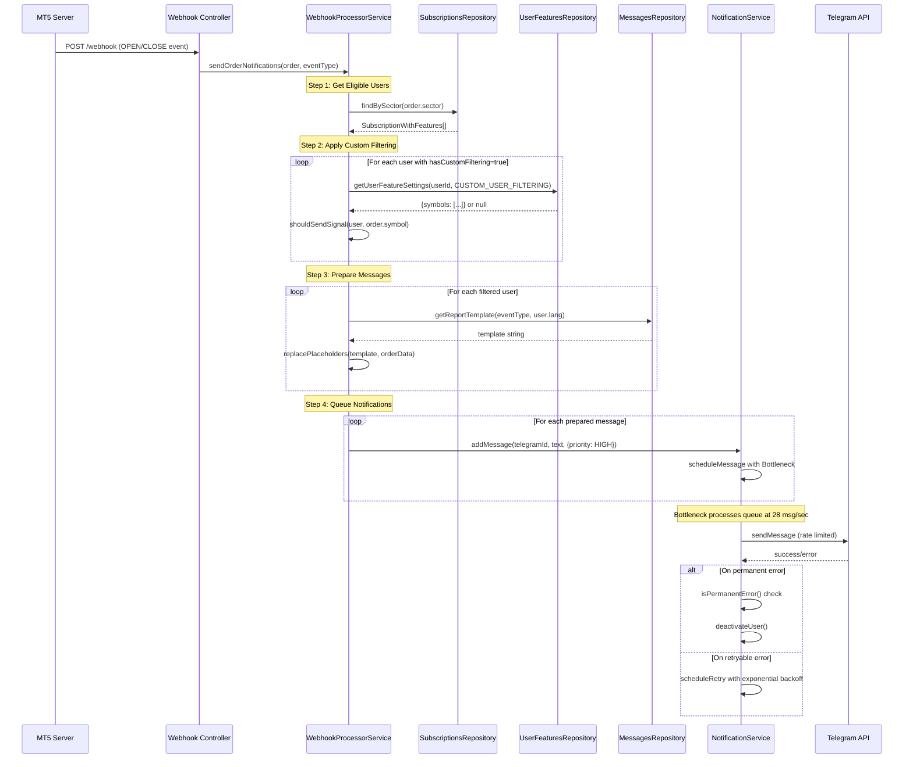
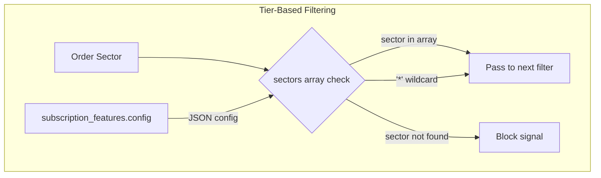
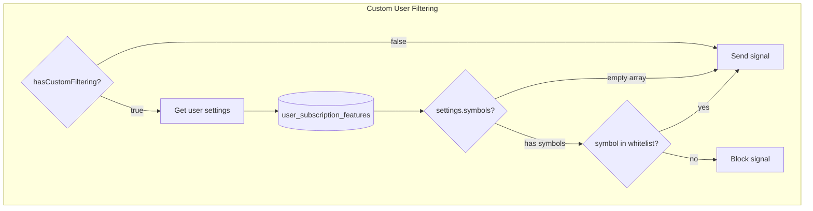
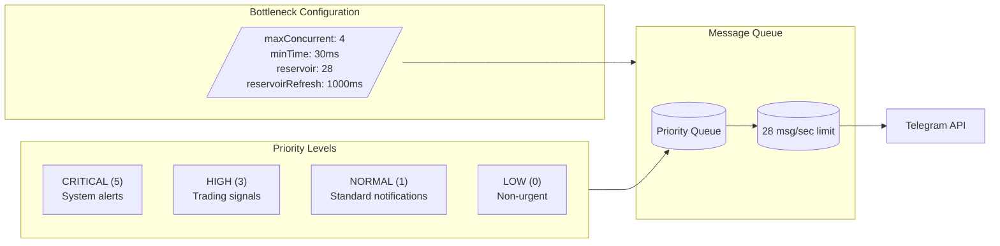
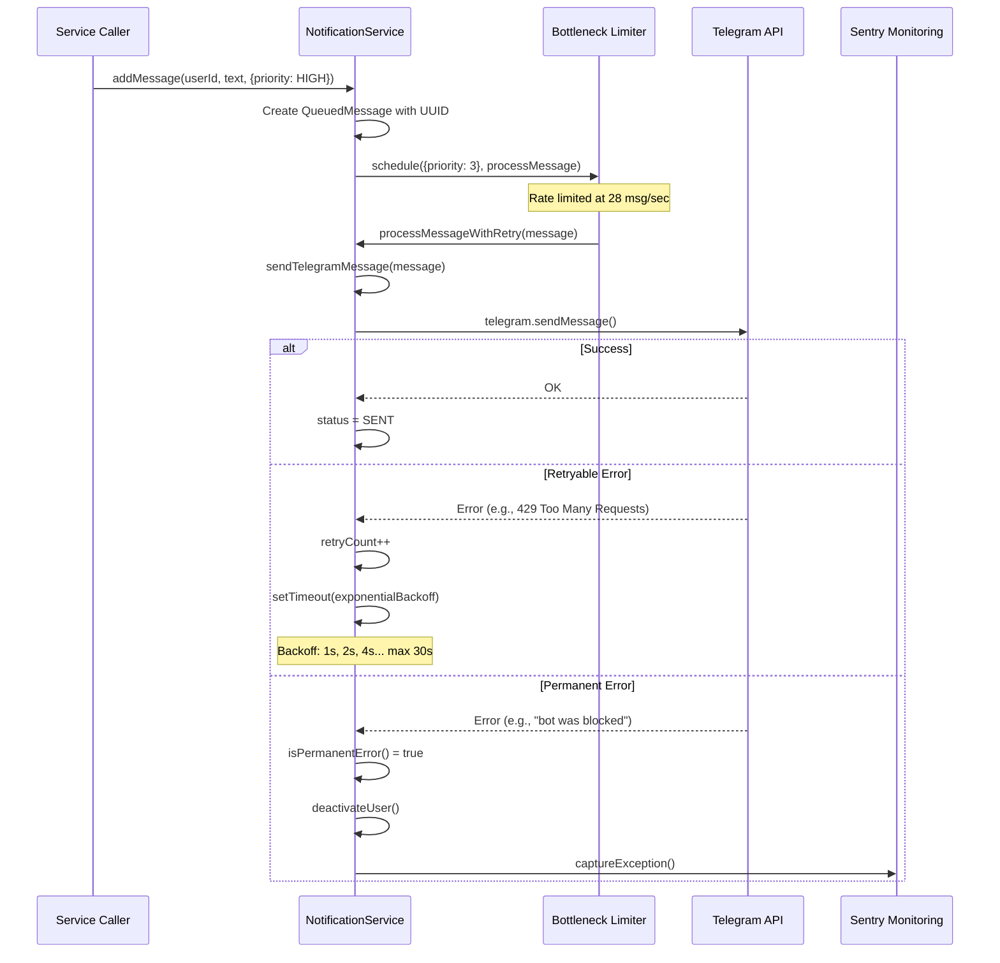
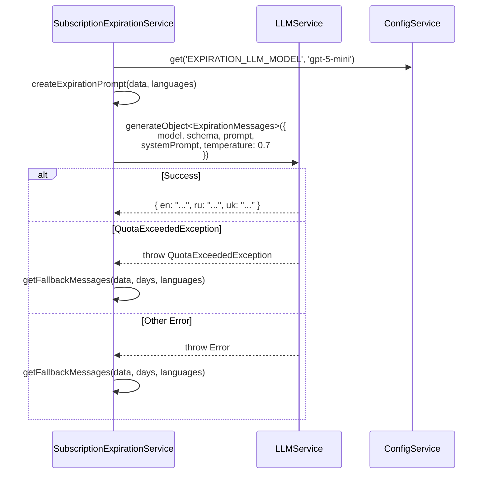
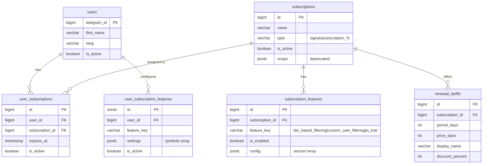

# Design Document: Signals Subscription Feature

## Overview

This document describes the technical architecture of the Signals Subscription feature - the core product offering that delivers real-time MT5 trading signals to subscribers via Telegram.

**Document Type**: Reverse-engineered from existing implementation
**Related PRD**: `docs/prd/subscription-signals-prd.md`
**Status**: Accepted (Implementation Complete)
**Last Updated**: 2025-11-25

## Existing Codebase Analysis

### Implementation Path Mapping

| Component | Path | Type |
|-----------|------|------|
| Signal Processing | `libs/bot/src/services/webhook.service.ts` | Existing |
| Notification Queue | `libs/bot/src/services/notification.service.ts` | Existing |
| Expiration Service | `libs/bot/src/services/subscription-expiration.service.ts` | Existing |
| Instrument Filter | `libs/bot/src/services/instrument-filter.service.ts` | Existing |
| Renewal Scene | `libs/bot/src/commands/renew/renewal.scene.ts` | Existing |
| Renewal Action | `libs/bot/src/actions/renewal/renewal.action.ts` | Existing |
| Subscriptions Repository | `libs/db/src/repositories/subscriptions.repository.ts` | Existing |
| User Subscriptions Repository | `libs/db/src/repositories/user-subscriptions.repository.ts` | Existing |
| User Features Repository | `libs/db/src/repositories/user-subscription-features.repository.ts` | Existing |

### Integration Points

| Integration Point | Connection Type | Direction |
|-------------------|-----------------|-----------|
| MT5 Webhook Controller | HTTP POST | Inbound |
| NotificationService | Service Injection | Internal |
| SubscriptionsRepository | Database Query | Outbound |
| LLMService | External API | Outbound |
| Telegram Bot API | External API | Outbound |

## Architecture Overview

### High-Level Architecture Diagram

```mermaid
flowchart TB
    subgraph ExternalSystems["External Systems"]
        MT5[MT5 Server]
        TG_API[Telegram Bot API]
        LLM[LLM Service<br/>gpt-5-mini]
    end

    subgraph BotApplication["Bot Application"]
        subgraph WebhookLayer["Webhook Processing Layer"]
            WHC[Webhook Controller]
            WPS[WebhookProcessorService]
        end

        subgraph FilteringLayer["Filtering Layer"]
            TBF[Tier-based Filtering<br/>subscription_features.config.sectors]
            CUF[Custom User Filtering<br/>user_subscription_features.settings]
            IFS[InstrumentFilterService]
        end

        subgraph NotificationLayer["Notification Layer"]
            NS[NotificationService]
            BN[Bottleneck Queue<br/>28 msg/sec]
            PM[Priority Manager<br/>CRITICAL|HIGH|NORMAL|LOW]
        end

        subgraph ExpirationLayer["Expiration Layer"]
            CRON[Cron Job<br/>10:00 Moscow]
            SES[SubscriptionExpirationService]
            MSG_GEN[LLM Message Generator]
        end

        subgraph RenewalLayer["Renewal Layer"]
            RS[RenewalScene]
            RA[RenewalAction]
            PS[PaymentService]
        end
    end

    subgraph Database["PostgreSQL Database"]
        SUBS[(subscriptions)]
        USER_SUBS[(user_subscriptions)]
        SUB_FEAT[(subscription_features)]
        USER_FEAT[(user_subscription_features)]
        MESSAGES[(messages)]
        TARIFFS[(renewal_tariffs)]
        USERS[(users)]
    end

    MT5 -->|HTTP POST| WHC
    WHC --> WPS
    WPS --> TBF
    TBF -->|sectors check| SUBS
    TBF -->|user lookup| USER_SUBS
    TBF -->|feature flags| SUB_FEAT
    TBF --> CUF
    CUF --> USER_FEAT
    CUF --> IFS
    WPS -->|template lookup| MESSAGES
    WPS --> NS
    NS --> BN
    NS --> PM
    BN -->|rate limited| TG_API

    CRON --> SES
    SES --> USER_SUBS
    SES --> MSG_GEN
    MSG_GEN --> LLM
    SES --> NS

    RS --> TARIFFS
    RS --> USER_SUBS
    RA --> PS
    PS -->|Stars invoice| TG_API
```

## Signal Delivery Pipeline

### Sequence Diagram: Signal Processing Flow



### Data Flow: Order to Notification

```yaml
Input:
  Source: MT5 Server
  Format: MergedOrder object
  Key Fields:
    - ticketId: number (position identifier)
    - symbol: string (e.g., "EURUSD.a")
    - sector: string (crypto|forex|stocks)
    - orderType: string (BUY|SELL)
    - openPrice: number
    - closePrice: number (for CLOSE events)
    - profit: number (for CLOSE events)
    - stopLoss: number
    - takeProfit: number

Processing:
  1. Sector-based filtering via subscription_features.config.sectors
  2. Custom user filtering via user_subscription_features.settings.symbols
  3. Message template lookup by (eventType, language)
  4. Placeholder replacement

Output:
  Destination: Telegram Bot API
  Format: MarkdownV2 formatted message
  Priority: HIGH (Bottleneck priority 3)
```

## Filtering System Architecture

### Tier-Based Filtering (System-Controlled)



**Database Schema**:
```sql
-- subscription_features table
SELECT config->'sectors' FROM subscription_features
WHERE feature_key = 'tier_based_filtering'
AND subscription_id = ?;

-- Example config values:
-- Trial:    { "sectors": ["forex"] }
-- Standard: { "sectors": ["*"] }
-- VIP:      { "sectors": ["*"] }
```

### Custom User Filtering (User-Controlled)



**Fail-Open Design**: On any error during custom filtering, signals are delivered (not blocked):
```typescript
// From webhook.service.ts shouldSendSignal()
catch (error) {
  // On error, fail open (send signal to avoid missing important signals)
  logger.error('Error checking custom filtering, defaulting to SEND');
  return true;
}
```

### Filter System Data Contract

```typescript
// Input: User filtering decision
interface FilteringInput {
  user: NotificationUser;
  symbol: string;
  sector: string;
}

// NotificationUser includes filtering flag
interface NotificationUser {
  userId: number;
  telegramId: number;
  firstName: string | null;
  lastName: string | null;
  username: string | null;
  lang: string | null;
  subscriptionId: number;
  hasCustomFiltering: boolean;  // Feature flag from subscription_features
}

// User feature settings storage
interface UserFeatureSettings {
  symbols?: string[];  // Whitelist of allowed symbols
}

// Output: Filtered users list
type FilteringOutput = NotificationUser[];
```

## Rate Limiting Architecture

### Bottleneck Queue Configuration



### Message Flow Through Queue



### Permanent Error Detection

Errors that trigger user deactivation (no retry):
```typescript
const permanentErrors = [
  'chat not found',
  'bot was blocked by the user',
  'user is deactivated',
  'bot was kicked from the group chat',
  'bot was kicked from the supergroup chat',
  'chat was deleted',
  'group chat was upgraded to a supergroup',
  'bot is not a member of the supergroup chat',
  'bot is not a member of the channel chat',
  'user not found',
  'invalid user_id specified',
  "forbidden: bot can't send messages to the user",
  'forbidden: bot was blocked by the user',
];
```

## Expiration Notifications Architecture

### Cron Job Flow

```mermaid
flowchart TD
    subgraph CronSchedule["Cron Configuration"]
        CONFIG[/"EXPIRATION_CHECK_CRON: 0 0 10 * * *<br/>EXPIRATION_CHECK_TIMEZONE: Europe/Moscow<br/>EXPIRATION_WARNING_DAYS: 7,3,0"/]
    end

    subgraph ExpirationFlow["Expiration Check Flow"]
        START([Cron Trigger: 10:00 Moscow])
        START --> DAYS[Parse warning days: 7, 3, 0]

        DAYS --> LOOP{For each day}
        LOOP --> FIND[findExpiring(daysFromNow, 'signals')]
        FIND --> USERS[(Expiring Users)]

        USERS --> LANGS[Collect unique languages]
        LANGS --> GEN{LLM Available?}

        GEN -->|Yes| LLM_GEN[LLM generates multi-lang messages]
        GEN -->|No/Quota| FALLBACK[Use fallback templates]

        LLM_GEN --> SEND
        FALLBACK --> SEND

        SEND[sendNotificationToUser]
        SEND --> TRIAL{Is trial?}
        TRIAL -->|Yes| BTN_CHOOSE[Button: Choose Plan]
        TRIAL -->|No| BTN_RENEW[Buttons: Renew + Change Plan]

        BTN_CHOOSE --> NS[NotificationService]
        BTN_RENEW --> NS

        LOOP -->|Next day| LOOP
    end
```

### LLM Message Generation



### Expiration Message Data Contract

```typescript
// LLM Input Schema (Zod validation)
const expirationMessagesSchema = z.object({}).catchall(z.string());

// Example output
interface ExpirationMessages {
  [languageCode: string]: string;
  // e.g., { en: "Your subscription expires...", ru: "..." }
}

// Notification Data
interface ExpirationNotificationData {
  readonly subscriptionName: string;
  readonly daysRemaining: number;  // 7, 3, or 0
  readonly expirationDate: string; // Formatted date
}

// Fallback Message Template (hardcoded)
const FALLBACK_MESSAGES: Record<number, ExpirationMessages> = {
  7: { en: "...", ru: "...", uk: "..." },
  3: { en: "...", ru: "...", uk: "..." },
  0: { en: "...", ru: "...", uk: "..." },
};
```

## Renewal System Architecture

### Renewal Flow Diagram

```mermaid
flowchart TD
    subgraph EntryPoints["Entry Points"]
        EXP_BTN[Expiration Notification Button]
        CMD[/renew Command]
        START_BTN[Start Message Button]
    end

    subgraph RenewalScene["Renewal Scene"]
        ENTER[Scene Enter]
        SHOW_TARIFFS[Show All Tariffs]
        SELECT_TARIFF[Select Tariff]
        CREATE_INV[Create Invoice]
    end

    subgraph RenewalAction["Renewal Action"]
        RENEW_NOW[One-Click Renew]
        VERIFY[Verify Ownership]
        SEND_INV[Send Stars Invoice]
    end

    subgraph Payment["Payment Processing"]
        TG_STARS[Telegram Stars Payment]
        PS[PaymentService]
        EXTEND[extendSubscription]
    end

    EXP_BTN -->|"renew_now:{id}:{id}"| RENEW_NOW
    EXP_BTN -->|"open_renewal_scene"| ENTER
    CMD --> ENTER
    START_BTN -->|"open_renewal_scene"| ENTER

    ENTER --> SHOW_TARIFFS
    SHOW_TARIFFS --> SELECT_TARIFF
    SELECT_TARIFF --> CREATE_INV
    CREATE_INV --> TG_STARS

    RENEW_NOW --> VERIFY
    VERIFY --> SEND_INV
    SEND_INV --> TG_STARS

    TG_STARS -->|successful_payment| PS
    PS --> EXTEND
    EXTEND --> DB[(user_subscriptions<br/>expiresAt += periodDays)]
```

### Renewal Tariff Data Structure

```sql
-- renewal_tariffs table
CREATE TABLE renewal_tariffs (
  id BIGSERIAL PRIMARY KEY,
  subscription_id BIGINT REFERENCES subscriptions(id),
  period_days INTEGER NOT NULL,      -- Days to extend (1-3650)
  price_stars INTEGER NOT NULL,      -- Telegram Stars price
  display_name VARCHAR(100),         -- Localized display name
  discount_percent INTEGER,          -- Optional discount badge
  sort_order INTEGER DEFAULT 0,      -- Display order
  is_active BOOLEAN DEFAULT true,
  created_at TIMESTAMPTZ DEFAULT NOW()
);
```

## Integration Boundary Contracts

### MT5 Webhook Input Contract

```yaml
Boundary Name: MT5 Webhook Receiver
  Input:
    Method: POST
    Path: /api/webhook/mt5
    Body: MergedOrder object (JSON)
    Required Fields: ticketId, symbol, sector, orderType, eventType
  Output:
    Sync: HTTP 200 OK (immediate acknowledgment)
    Async: Notifications queued for delivery
  On Error:
    - Invalid payload: HTTP 400 Bad Request
    - Processing error: HTTP 500, error logged to Sentry
```

### Telegram API Output Contract

```yaml
Boundary Name: Telegram Message Delivery
  Input:
    userId: number (Telegram chat ID)
    message: string (MarkdownV2 formatted)
    options: { parse_mode, reply_markup }
  Output:
    Async: Message delivered to user
  On Error:
    - Rate limit (429): Bottleneck handles backoff
    - Permanent error: User deactivated, logged to Sentry
    - Transient error: Retry up to 3 times with exponential backoff
```

### LLM Service Contract

```yaml
Boundary Name: LLM Message Generation
  Input:
    model: string (gpt-5-mini)
    schema: Zod schema for validation
    prompt: string (formatted request)
    systemPrompt: string (behavior instructions)
    temperature: number (0.7)
  Output:
    Async: ExpirationMessages object with language keys
  On Error:
    - QuotaExceededException: Use fallback templates
    - API Error: Use fallback templates, log warning
```

## Database Schema Relationships



## Change Impact Map

```yaml
Change Target: WebhookProcessorService.sendOrderNotifications()
Direct Impact:
  - libs/bot/src/services/webhook.service.ts
  - libs/bot/src/services/notification.service.ts
Indirect Impact:
  - Message delivery timing
  - Queue statistics
No Ripple Effect:
  - Database schema
  - User settings
  - Expiration notifications

Change Target: NotificationService rate limiting
Direct Impact:
  - libs/bot/src/services/notification.service.ts
  - Bottleneck configuration
Indirect Impact:
  - All message delivery (signals, expirations, etc.)
  - Telegram API rate compliance
No Ripple Effect:
  - Business logic
  - Filtering decisions

Change Target: Custom filtering logic
Direct Impact:
  - libs/bot/src/services/webhook.service.ts (shouldSendSignal)
  - libs/bot/src/services/instrument-filter.service.ts
  - libs/db/src/repositories/user-subscription-features.repository.ts
Indirect Impact:
  - Signal delivery to VIP users
No Ripple Effect:
  - Tier-based filtering
  - Non-VIP users
```

## Configuration Reference

### Environment Variables

| Variable | Default | Description |
|----------|---------|-------------|
| `EXPIRATION_CHECK_ENABLED` | `true` | Enable/disable expiration cron |
| `EXPIRATION_CHECK_CRON` | `0 0 10 * * *` | Cron expression (10:00 daily) |
| `EXPIRATION_CHECK_TIMEZONE` | `Europe/Moscow` | Timezone for cron |
| `EXPIRATION_WARNING_DAYS` | `7,3,0` | Warning day thresholds |
| `EXPIRATION_LLM_MODEL` | `gpt-5-mini` | LLM model for notifications |

### Bottleneck Configuration

| Parameter | Value | Purpose |
|-----------|-------|---------|
| `maxConcurrent` | 4 | Parallel message sends |
| `minTime` | 30ms | Minimum time between messages |
| `reservoir` | 28 | Messages per second cap |
| `reservoirRefreshInterval` | 1000ms | Reservoir refresh rate |

### Message Priority Mapping

| Application Priority | Bottleneck Priority | Use Case |
|---------------------|---------------------|----------|
| CRITICAL | 5 | System alerts |
| HIGH | 3 | Trading signals (webhooks) |
| NORMAL | 1 | Standard notifications |
| LOW | 0 | Non-urgent messages |

## Non-Functional Requirements

### Performance

- **Signal Delivery Latency**: < 5 seconds from MT5 event to Telegram delivery
- **Rate Limiting**: 28 messages/second to comply with Telegram API limits
- **Concurrent Processing**: 4 parallel message sends
- **Custom Filtering**: Parallel execution for all users

### Reliability

- **Retry Logic**: Up to 3 retries with exponential backoff (1s, 2s, 4s, max 30s)
- **Fail-Open Filtering**: On custom filter error, signals are delivered
- **Fallback Templates**: Hardcoded templates when LLM unavailable
- **Permanent Error Handling**: Auto-deactivation prevents repeated failures

### Monitoring

- **Sentry Integration**: Error tracking for delivery failures
- **Breadcrumbs**: Message scheduling and processing events
- **Queue Statistics**: Available via `getQueueStatus()`

## Acceptance Criteria (Implemented)

### Signal Delivery
- [x] Trading signals delivered to eligible subscribers within 5 seconds
- [x] Tier-based filtering respects subscription_features.config.sectors
- [x] Wildcard `*` grants access to all sectors
- [x] Custom filtering blocks signals not in user's whitelist
- [x] Empty whitelist = receive all tier signals (default behavior)

### Rate Limiting
- [x] Messages processed at max 28/second
- [x] High-priority messages (signals) processed before low-priority
- [x] Exponential backoff on transient errors
- [x] User deactivation on permanent delivery errors

### Expiration Notifications
- [x] Cron job runs at 10:00 Moscow daily
- [x] Warnings sent at 7, 3, and 0 days before expiration
- [x] LLM generates personalized multi-language messages
- [x] Fallback templates used when LLM unavailable
- [x] Trial subscriptions show "Choose Plan" button
- [x] Regular subscriptions show "Renew" + "Change Plan" buttons

### Renewal Flow
- [x] One-click renewal from expiration notification
- [x] Tariff selection scene with discount display
- [x] Telegram Stars payment integration
- [x] Subscription extension calculated correctly (adds to current expiry)

## References

- PRD: `docs/prd/subscription-signals-prd.md`
- Core Infrastructure PRD: `docs/prd/subscription-core-prd.md`
- Bottleneck Library: https://github.com/SGrondin/bottleneck
- Telegram Bot API Rate Limits: https://core.telegram.org/bots/faq#my-bot-is-hitting-limits-how-do-i-avoid-this

---

**Document Version**: 1.0.0
**Created**: 2025-11-25
**Author**: Reverse-engineered from implementation
