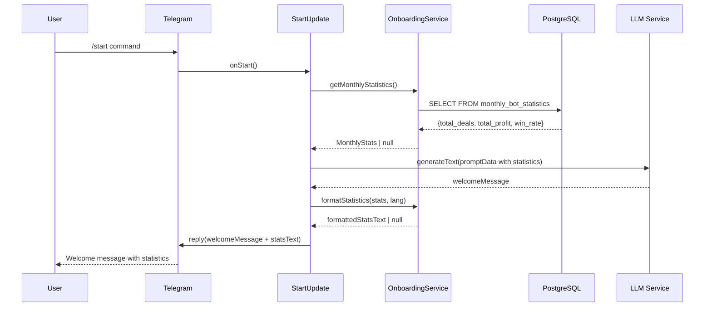
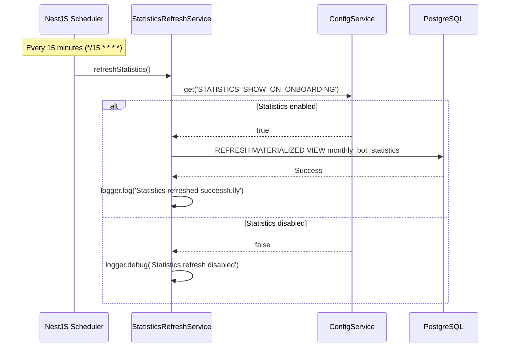
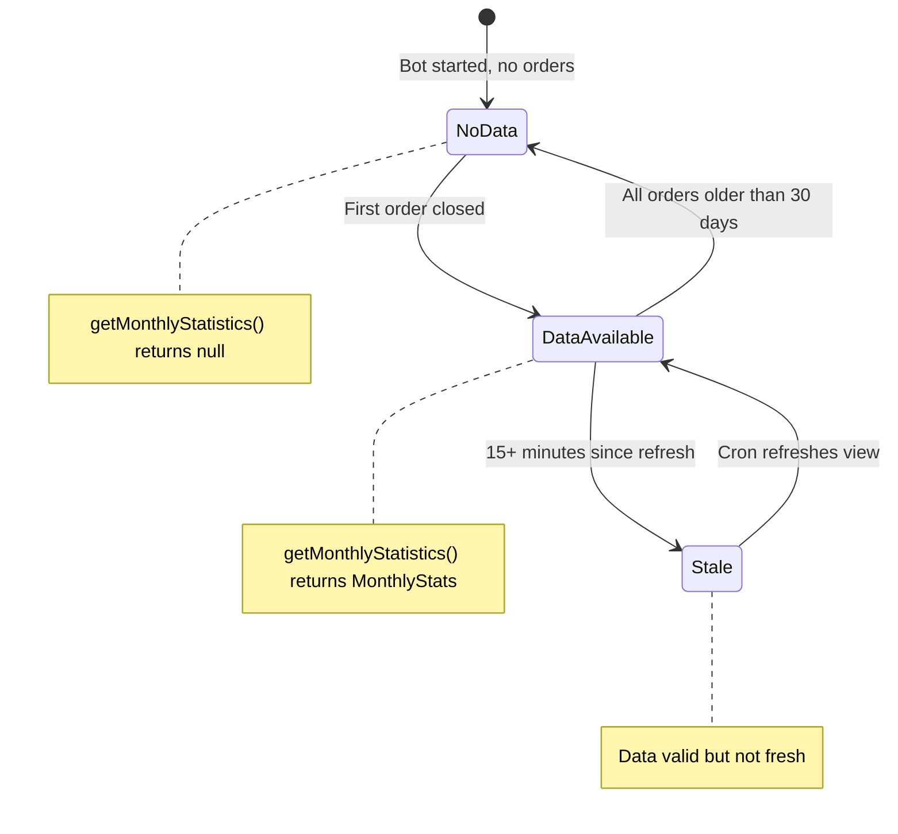
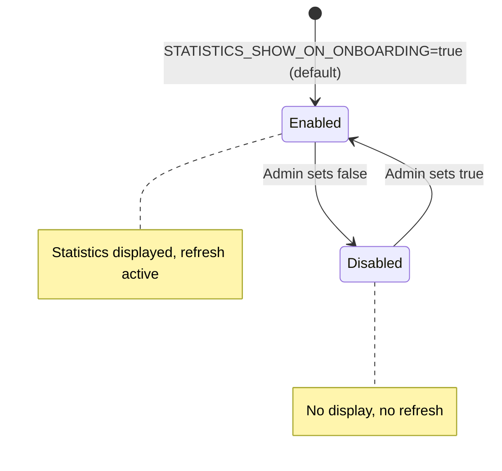
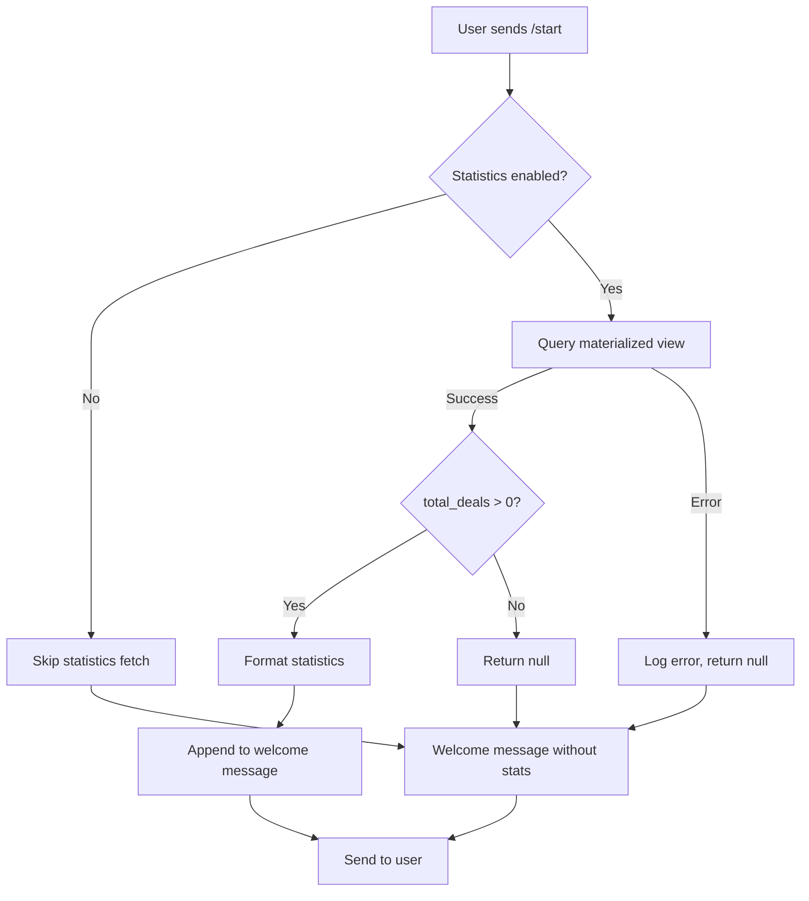

# Design Document: Onboarding Statistics

## Document Metadata

| Property | Value |
|----------|-------|
| **Status** | Implemented (Reverse-engineered) |
| **Version** | 1.0.0 |
| **Created** | 2025-11-25 |
| **PRD Reference** | `docs/prd/subscription-statistics-prd.md` |
| **Mode** | Reverse-engineer (code is source of truth) |

---

## 1. Overview

### 1.1 Purpose

This design document describes the Onboarding Statistics feature that displays aggregated monthly trading statistics (total deals, profit, win rate) to new users during bot onboarding. The feature builds user trust by demonstrating bot performance through real data.

### 1.2 Agreement Checklist

| Agreement | Design Reflection |
|-----------|------------------|
| Scope: Monthly statistics aggregation and display | Materialized view + OnboardingService |
| Scope: 8-language support | formatStatistics() with language templates |
| Scope: 15-minute refresh interval | StatisticsRefreshService with @Cron |
| Scope: Graceful fallback | null return pattern throughout |
| Non-scope: Real-time statistics | Materialized view with lag acceptable |
| Non-scope: User-specific statistics | Aggregate only, no PII |
| Constraint: <10ms query time | Materialized view caching |
| Constraint: Non-blocking refresh | Background cron job |

### 1.3 Prerequisite ADRs

None - This feature uses existing patterns established in the codebase:
- NestJS service architecture
- Drizzle ORM for database access
- PostgreSQL materialized views

---

## 2. Architecture

### 2.1 Architecture Diagram

```mermaid
flowchart TB
    subgraph Database["PostgreSQL Database"]
        OT[orders table]
        MV[monthly_bot_statistics<br/>Materialized View]
    end

    subgraph Services["NestJS Services"]
        SRS[StatisticsRefreshService]
        OS[OnboardingService]
    end

    subgraph Presentation["Presentation Layer"]
        SU[StartUpdate<br/>/start command]
        WP[Welcome Prompt<br/>LLM System Prompt]
        I18N[start.i18n.ts<br/>Translations]
    end

    subgraph External["External Systems"]
        TG[Telegram Bot API]
        LLM[LLM Service<br/>GPT-5-mini]
    end

    OT -->|Source data| MV
    SRS -->|REFRESH MATERIALIZED VIEW| MV
    MV -->|SELECT query| OS
    OS -->|getMonthlyStatistics()| SU
    OS -->|formatStatistics()| SU
    SU -->|Statistics context| LLM
    LLM -->|Generated message| SU
    I18N -->|Fallback translations| SU
    SU -->|sendMessage| TG
```

### 2.2 Data Flow Diagram



### 2.3 Cron Refresh Flow



---

## 3. Existing Codebase Analysis

### 3.1 Implementation File Mapping

| Component | File Path | Purpose |
|-----------|-----------|---------|
| **OnboardingService** | `libs/bot/src/services/onboarding.service.ts` | Query and format statistics |
| **StatisticsRefreshService** | `libs/bot/src/services/statistics-refresh.service.ts` | Cron-based view refresh |
| **Drizzle Schema** | `libs/db/src/schema/statistics.ts` | TypeScript schema definition |
| **SQL Migration** | `libs/db/migrations/20251101094100_create_monthly_statistics_view.sql` | View creation |
| **StartUpdate** | `libs/bot/src/commands/start/start.update.ts` | Integration point |
| **Welcome Prompt** | `libs/bot/src/commands/start/welcome.ts` | LLM system prompt |
| **i18n** | `libs/bot/src/commands/start/start.i18n.ts` | Fallback translations |
| **Orders Schema** | `libs/db/src/schema/orders.ts` | Source data schema |
| **BotModule** | `libs/bot/src/bot.module.ts` | Service registration |

### 3.2 Similar Functionality Search

**Search Results**: No duplicate implementations found.
- Statistics aggregation: Only in `monthly_bot_statistics` view
- Onboarding service: Only `OnboardingService` handles statistics
- **Decision**: This is the canonical implementation

---

## 4. Technical Design

### 4.1 Materialized View Architecture

The core of the statistics system is a PostgreSQL materialized view that pre-aggregates trading data:

```sql
CREATE MATERIALIZED VIEW monthly_bot_statistics AS
SELECT
  COUNT(*)::int as total_deals,
  COALESCE(SUM(profit), 0)::numeric as total_profit,
  COALESCE(
    COUNT(CASE WHEN profit > 0 THEN 1 END)::float / NULLIF(COUNT(*), 0),
    0
  ) as win_rate,
  COUNT(DISTINCT account)::int as active_traders,
  CURRENT_DATE - INTERVAL '30 days' as period_start,
  NOW() as last_updated
FROM orders
WHERE created_at >= CURRENT_DATE - INTERVAL '30 days'
  AND close_time IS NOT NULL;
```

**Design Rationale**:
- **30-day rolling window**: Relevant timeframe for user decision-making
- **Closed orders only**: Ensures profit data is final (no open position P&L fluctuation)
- **Single row output**: Optimized for fast single-value lookups
- **Materialized for performance**: <10ms query time vs ~100ms for real-time aggregation

### 4.2 Interface Definitions

#### MonthlyStats Interface

```typescript
export interface MonthlyStats {
  totalDeals: number;      // Total closed deals in 30 days
  totalProfit: number;     // Sum of all profits (USD)
  winRate: number;         // Win percentage (0-100)
}
```

#### OnboardingService API

```typescript
@Injectable()
export class OnboardingService {
  // Query statistics from materialized view
  async getMonthlyStatistics(): Promise<MonthlyStats | null>;

  // Format statistics for display in user's language
  formatStatistics(stats: MonthlyStats | null, language: string): string | null;
}
```

#### StatisticsRefreshService API

```typescript
@Injectable()
export class StatisticsRefreshService {
  // Cron job: runs every 15 minutes
  @Cron('*/15 * * * *')
  async refreshStatistics(): Promise<void>;

  // Manual refresh for testing/admin
  async manualRefresh(): Promise<void>;
}
```

### 4.3 Data Aggregation Flow

```mermaid
flowchart LR
    subgraph Input["Source Data"]
        O[orders table<br/>All closed orders]
    end

    subgraph Filter["Filtering"]
        F1[created_at >= 30 days ago]
        F2[close_time IS NOT NULL]
    end

    subgraph Aggregation["Aggregation"]
        A1[COUNT(*) -> total_deals]
        A2[SUM(profit) -> total_profit]
        A3[COUNT(profit>0)/COUNT(*) -> win_rate]
    end

    subgraph Transform["Service Transform"]
        T1[win_rate * 100<br/>decimal to percentage]
        T2[Number() conversion<br/>string to number]
    end

    subgraph Output["Output"]
        MS[MonthlyStats]
    end

    O --> F1 --> F2 --> A1 & A2 & A3 --> T1 & T2 --> MS
```

### 4.4 Multi-language Formatting

The `formatStatistics()` method supports 8 languages with consistent emoji usage:

| Language | Code | Template Structure |
|----------|------|-------------------|
| English | en | `Our Community This Month: Total Profit: $X, Successful Deals: Y, Win Rate: Z%` |
| Russian | ru | `Naше сообщество за месяц: Общая прибыль: $X, Успешных сделок: Y, Винрейт: Z%` |
| Ukrainian | uk | `Наша спільнота за місяць: ...` |
| Hindi | hi | `इस महीने हमारा समुदाय: ...` |
| French | fr | `Notre communaute ce mois: ...` |
| Kazakh | kk | `Біздің қауымдастық осы айда: ...` |
| Uzbek | uz | `Bizning jamiyat bu oyda: ...` |
| Tajik | tg | `Ҷомеаи мо дар ин моҳ: ...` |

**Number Formatting**:
- Thousands separator: `toLocaleString('en-US')` (e.g., 1,234)
- Currency: `$` prefix with rounded value
- Percentage: One decimal place (e.g., 78.5%)

---

## 5. Integration Point Map

### 5.1 Integration Points

```yaml
Integration Point 1:
  Existing Component: StartUpdate.onStart()
  Integration Method: Service injection and method call
  Impact Level: Medium (adds new data source to existing flow)
  Required Test Coverage: Statistics fetch and fallback behavior

Integration Point 2:
  Existing Component: LLM Welcome Prompt
  Integration Method: Statistics added to prompt context
  Impact Level: Low (read-only, optional data)
  Required Test Coverage: Prompt generation with/without statistics

Integration Point 3:
  Existing Component: BotModule providers
  Integration Method: Service registration
  Impact Level: Low (standard NestJS DI)
  Required Test Coverage: Module imports correctly

Integration Point 4:
  Existing Component: Database (PostgreSQL)
  Integration Method: Materialized view creation via migration
  Impact Level: High (new database object)
  Required Test Coverage: View exists and refreshes correctly
```

### 5.2 Integration Boundary Contracts

```yaml
OnboardingService.getMonthlyStatistics():
  Input: None
  Output: MonthlyStats | null (async)
  On Error: Returns null, logs error

OnboardingService.formatStatistics():
  Input: stats (MonthlyStats | null), language (string, default 'en')
  Output: string | null (sync)
  On Error: Returns English template for unknown language

StatisticsRefreshService.refreshStatistics():
  Input: None
  Output: void (async)
  On Error: Logs error, does not throw (background job)

monthly_bot_statistics view:
  Input: orders table data
  Output: Single row with aggregated statistics
  On Error: Empty result if no data matches criteria
```

---

## 6. Change Impact Map

```yaml
Change Target: Onboarding Statistics Feature
Direct Impact:
  - libs/bot/src/services/onboarding.service.ts (new service)
  - libs/bot/src/services/statistics-refresh.service.ts (new service)
  - libs/db/src/schema/statistics.ts (new schema)
  - libs/db/migrations/20251101094100_*.sql (new migration)
  - libs/bot/src/commands/start/start.update.ts (integration)
  - libs/bot/src/commands/start/welcome.ts (prompt update)
  - libs/bot/src/bot.module.ts (service registration)
  - libs/db/src/schema/index.ts (export addition)

Indirect Impact:
  - Welcome message content (includes statistics section)
  - Database storage (new materialized view ~1KB)
  - Cron scheduler load (one job every 15 minutes)

No Ripple Effect:
  - Other bot commands (/lang, /filter, /renew)
  - Order processing flow
  - Subscription management
  - User registration
```

---

## 7. Data Contracts

### 7.1 Database to Service

| Database Column | Type | Service Field | Transformation |
|----------------|------|---------------|----------------|
| `total_deals` | int | `totalDeals` | `Number()` cast |
| `total_profit` | numeric | `totalProfit` | `Number()` cast |
| `win_rate` | real (0-1) | `winRate` | `* 100` (percentage) |
| `active_traders` | int | (not exposed) | - |
| `period_start` | timestamp | (not exposed) | - |
| `last_updated` | timestamp | (not exposed) | - |

### 7.2 Service to Presentation

```typescript
// Input to formatStatistics
interface FormatInput {
  stats: MonthlyStats | null;
  language: string; // 'en' | 'ru' | 'uk' | 'hi' | 'fr' | 'kk' | 'uz' | 'tg'
}

// Output from formatStatistics
type FormatOutput = string | null;

// Example output (English)
"Our Community This Month:
Total Profit: $12,345
Successful Deals: 156
Win Rate: 78.5%"
```

---

## 8. State Transitions

### 8.1 Statistics Availability States



### 8.2 Configuration States



---

## 9. Error Handling

### 9.1 Error Scenarios

| Scenario | Component | Behavior | User Impact |
|----------|-----------|----------|-------------|
| View query fails | OnboardingService | Returns null, logs error | No statistics shown |
| View refresh fails | StatisticsRefreshService | Logs error, continues | Stale data (still valid) |
| No deals in 30 days | OnboardingService | Returns null | No statistics shown |
| Unknown language | formatStatistics | Falls back to English | English statistics |
| Config service fails | Both services | Uses default (true) | Normal operation |

### 9.2 Graceful Degradation Flow



---

## 10. Implementation Approach

### 10.1 Strategy Selection

**Selected**: Horizontal Slice (Foundation-driven)

**Rationale**:
- Database layer (materialized view) must exist before service layer
- Service layer must exist before integration with StartUpdate
- Each layer can be independently verified

### 10.2 Implementation Phases

| Phase | Components | Verification Level |
|-------|-----------|-------------------|
| 1. Database | Migration, Drizzle schema | L3: Build success |
| 2. Services | OnboardingService, StatisticsRefreshService | L2: Unit tests pass |
| 3. Integration | StartUpdate, welcome prompt | L1: E2E functional |

---

## 11. Acceptance Criteria

### 11.1 Functional Acceptance Criteria

| ID | Criterion | Verification Method |
|----|-----------|---------------------|
| AC-01 | Statistics display total deals, profit, and win rate | Manual: Send /start, verify display |
| AC-02 | Statistics refresh every 15 minutes | Log inspection: Verify cron execution |
| AC-03 | Statistics query completes in <10ms | Metric: Response time logging |
| AC-04 | 8 languages supported | Manual: Test each language code |
| AC-05 | Graceful fallback when disabled | Config test: Set false, verify no stats |
| AC-06 | Graceful fallback when no data | Database: Clear orders, verify no stats |
| AC-07 | Win rate shown as percentage (0-100) | Manual: Verify display format |

### 11.2 Non-Functional Acceptance Criteria

| ID | Criterion | Target | Verification |
|----|-----------|--------|--------------|
| NFR-01 | Query response time | <10ms | Performance logging |
| NFR-02 | Refresh duration | <100ms | Performance logging |
| NFR-03 | View storage size | <1KB | Database inspection |
| NFR-04 | No blocking on refresh | No user impact | Concurrent request test |

---

## 12. Configuration

### 12.1 Environment Variables

| Variable | Type | Default | Description |
|----------|------|---------|-------------|
| `STATISTICS_SHOW_ON_ONBOARDING` | boolean | `true` | Enable/disable statistics display |

### 12.2 Cron Configuration

| Job | Schedule | Description |
|-----|----------|-------------|
| `refreshStatistics` | `*/15 * * * *` | Every 15 minutes |

---

## 13. References

### 13.1 Implementation Files

- **OnboardingService**: `libs/bot/src/services/onboarding.service.ts`
- **StatisticsRefreshService**: `libs/bot/src/services/statistics-refresh.service.ts`
- **Schema**: `libs/db/src/schema/statistics.ts`
- **Migration**: `libs/db/migrations/20251101094100_create_monthly_statistics_view.sql`
- **StartUpdate**: `libs/bot/src/commands/start/start.update.ts`
- **Welcome Prompt**: `libs/bot/src/commands/start/welcome.ts`
- **i18n**: `libs/bot/src/commands/start/start.i18n.ts`
- **Orders Schema**: `libs/db/src/schema/orders.ts`
- **BotModule**: `libs/bot/src/bot.module.ts`

### 13.2 Related Documentation

- **PRD**: `docs/prd/subscription-statistics-prd.md`

---

## Appendix A: SQL View Details

### Full Migration SQL

```sql
CREATE MATERIALIZED VIEW monthly_bot_statistics AS
SELECT
  COUNT(*)::int as total_deals,
  COALESCE(SUM(profit), 0)::numeric as total_profit,
  COALESCE(
    COUNT(CASE WHEN profit > 0 THEN 1 END)::float / NULLIF(COUNT(*), 0),
    0
  ) as win_rate,
  COUNT(DISTINCT account)::int as active_traders,
  CURRENT_DATE - INTERVAL '30 days' as period_start,
  NOW() as last_updated
FROM orders
WHERE created_at >= CURRENT_DATE - INTERVAL '30 days'
  AND close_time IS NOT NULL;

CREATE INDEX IF NOT EXISTS idx_monthly_bot_statistics_period
  ON monthly_bot_statistics(period_start);
```

### Refresh Command

```sql
REFRESH MATERIALIZED VIEW monthly_bot_statistics;
```

---

## Appendix B: Service Implementation Details

### OnboardingService Query

```typescript
const result = await this.db.execute<{
  total_deals: number;
  total_profit: string;
  win_rate: number;
}>(sql`
  SELECT
    total_deals,
    total_profit,
    win_rate
  FROM monthly_bot_statistics
  LIMIT 1
`);
```

### Cron Decorator Usage

```typescript
@Cron('*/15 * * * *')
async refreshStatistics(): Promise<void> {
  await this.db.execute(sql`
    REFRESH MATERIALIZED VIEW monthly_bot_statistics
  `);
}
```

---

**Document Version**: 1.0.0
**Created**: 2025-11-25
**Status**: Implemented (Reverse-engineered from code)
