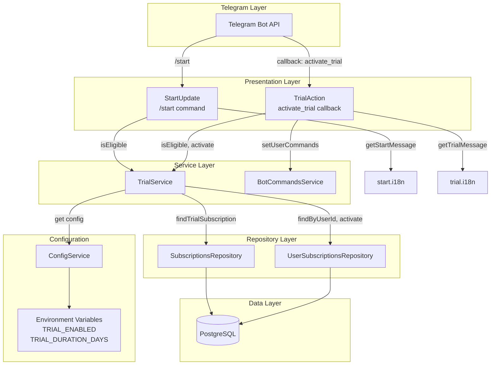
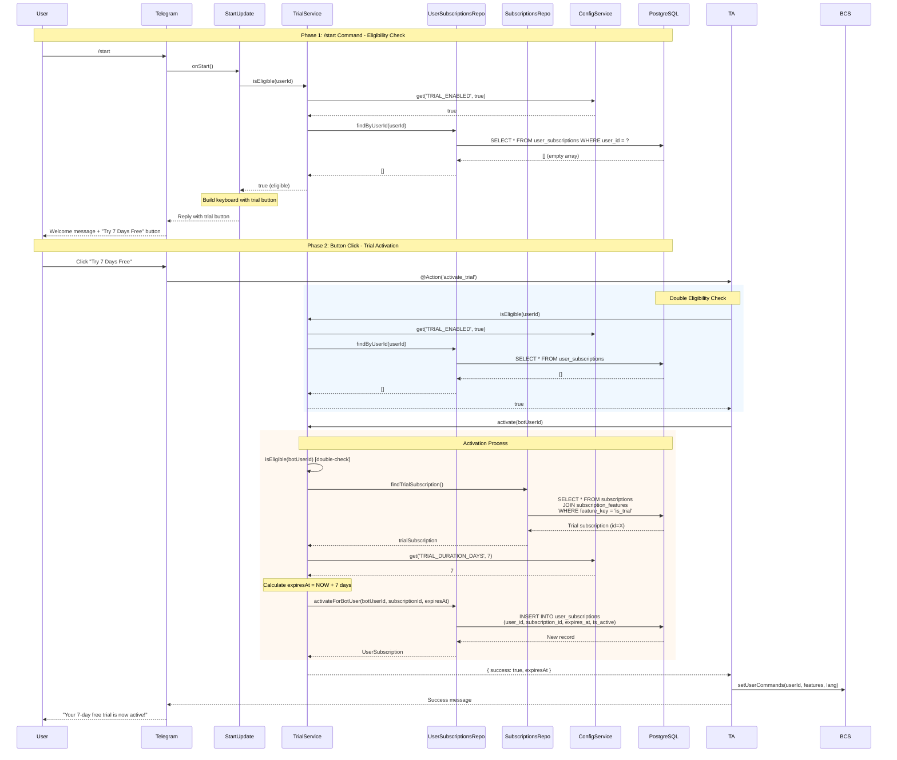
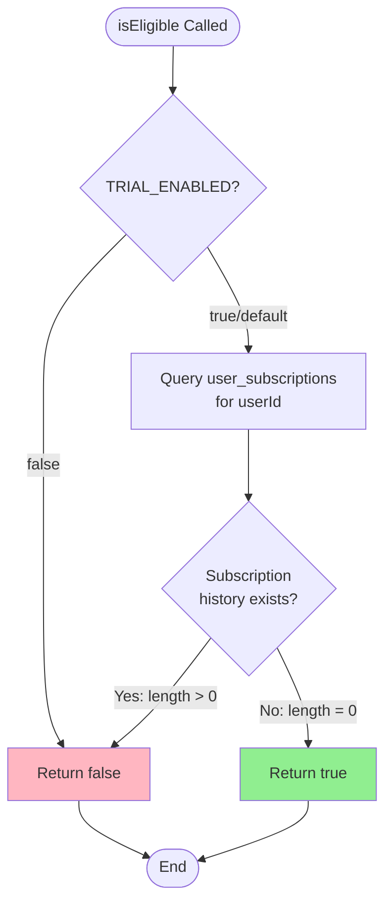
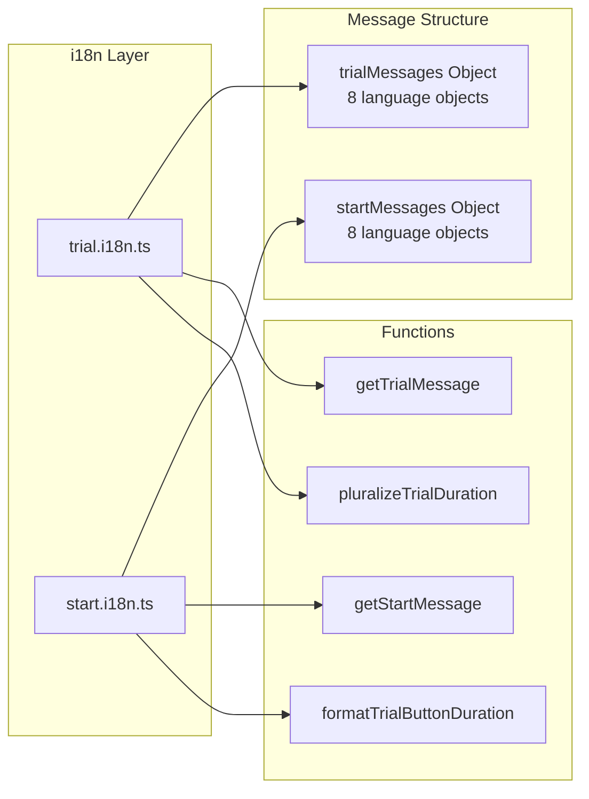
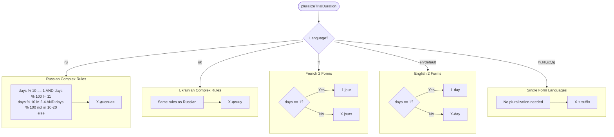
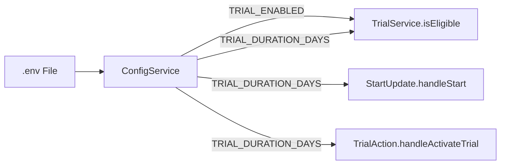
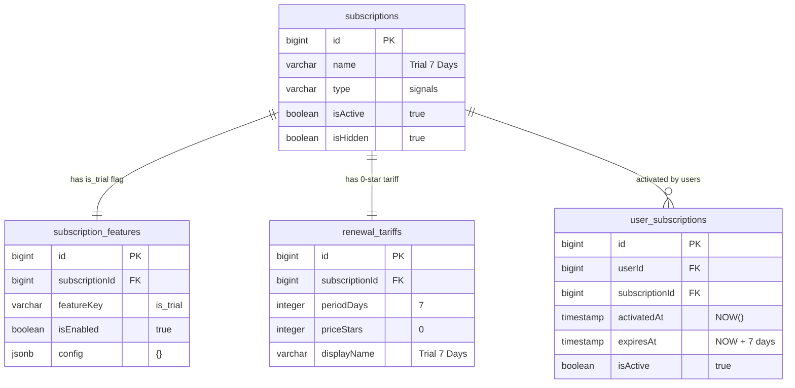
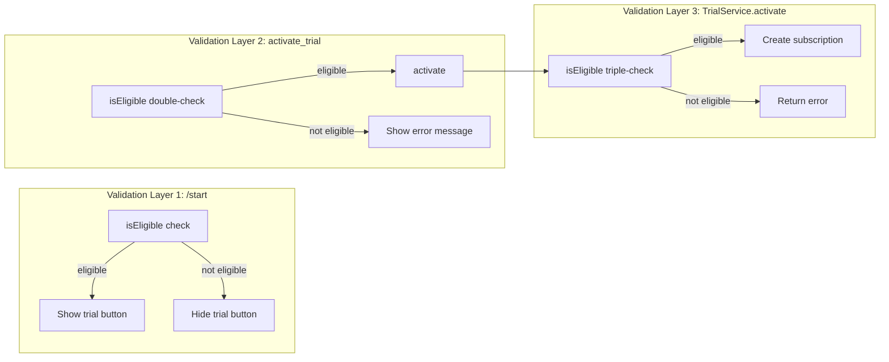
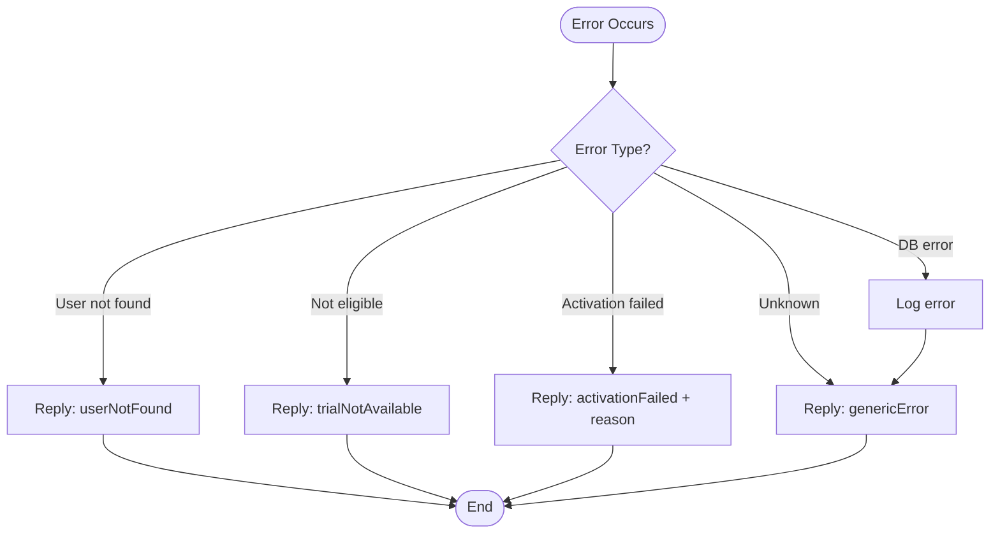

# Design Document: Trial Subscription System

## Document Information

| Field | Value |
|-------|-------|
| **Status** | Accepted (Implemented) |
| **Created** | 2025-11-25 |
| **Last Updated** | 2025-11-25 |
| **Mode** | Reverse-engineered from implementation |
| **Related PRD** | [subscription-trial-prd.md](../prd/subscription-trial-prd.md) |
| **Related Design Doc** | [subscription-core-design.md](./subscription-core-design.md) |

## Overview

This Design Document describes the technical implementation of the Trial Subscription System - a feature that enables new users to experience premium trading signals for a configurable period (default 7 days) before committing to a paid subscription. The system was reverse-engineered from the existing implementation.

### Scope

**In Scope:**
- Trial activation flow (service layer)
- Eligibility check logic
- Integration with `/start` command
- i18n (internationalization) system design
- Configuration management via environment variables

**Out of Scope:**
- Core subscription infrastructure (see [subscription-core-design.md](./subscription-core-design.md))
- Payment processing
- Trial expiration notifications (not implemented)
- Database schema design (uses existing subscription infrastructure)

---

## Existing Codebase Analysis

### Implementation File Paths

| Component | Path | Role |
|-----------|------|------|
| Trial Service | `libs/bot/src/services/trial.service.ts` | Business logic for eligibility and activation |
| Trial Action | `libs/bot/src/actions/trial/trial.action.ts` | Callback handler for `activate_trial` button |
| Trial i18n | `libs/bot/src/actions/trial/trial.i18n.ts` | Multi-language messages for trial feature |
| Start Command | `libs/bot/src/commands/start/start.update.ts` | `/start` handler with trial eligibility check |
| Start i18n | `libs/bot/src/commands/start/start.i18n.ts` | Multi-language messages for start command buttons |
| Subscriptions Repository | `libs/db/src/repositories/subscriptions.repository.ts` | `findTrialSubscription()` method |
| User Subscriptions Repository | `libs/db/src/repositories/user-subscriptions.repository.ts` | `findByUserId()`, `activate()` methods |

### Integration Points

| Integration Point | Existing Component | Integration Method | Impact Level |
|-------------------|--------------------|--------------------|--------------|
| `/start` command | `StartUpdate` | Method call to `TrialService.isEligible()` | Medium |
| Callback handling | NestJS/Telegraf | `@Action('activate_trial')` decorator | Low |
| Subscription activation | `UserSubscriptionsRepository.activate()` | Direct call | Medium |
| Trial subscription lookup | `SubscriptionsRepository.findTrialSubscription()` | Direct call | Low |
| Bot commands update | `BotCommandsService.setUserCommands()` | Direct call after activation | Low |

### Similar Functionality Search

- **Subscription activation by code**: Found in `StartUpdate.activateCode()` - uses same `userSubscriptionsRepository.activate()` pattern
- **Eligibility check pattern**: No similar pattern - trial eligibility is unique (checks for zero subscription history)
- **i18n pattern**: Uses project-wide pattern with message objects and getter functions

**Decision**: Use existing activation infrastructure, implement new eligibility check logic.

---

## Architecture Overview

### Component Architecture Diagram



### Data Flow: Trial Activation Flow



### Eligibility Check Logic



### Integration with /start Command

```mermaid
flowchart TD
    subgraph StartCommand["/start Command Handler"]
        direction TB
        Start([User sends /start]) --> ExtractCode[Extract code from args]
        ExtractCode --> GetStats[Fetch monthly statistics]
        GetStats --> HandleStart[handleStart]

        subgraph HandleStartMethod["handleStart()"]
            ActivateCode{Code provided?}
            ActivateCode -->|Yes| ProcessCode[activateCode]
            ActivateCode -->|No| SkipCode[Skip code processing]
            ProcessCode --> CheckEligibility
            SkipCode --> CheckEligibility

            CheckEligibility[trialService.isEligible] --> GenerateWelcome[Generate welcome via LLM]
        end

        HandleStart --> BuildResponse
    end

    subgraph BuildResponse["Build Response"]
        direction TB
        CreateKeyboard[Create inline keyboard]

        CheckTrialEligible{trialEligible?}
        CheckTrialEligible -->|Yes| AddTrialButton[Add "Try X Days Free" button<br/>callback_data: activate_trial]
        CheckTrialEligible -->|No| SkipTrialButton[Skip trial button]

        AddTrialButton --> AddCommonButtons
        SkipTrialButton --> AddCommonButtons

        AddCommonButtons[Add "View Plans" + "Change Language" buttons]
        AddCommonButtons --> SendReply[Send reply with keyboard]
    end

    CreateKeyboard --> CheckTrialEligible
```

---

## i18n System Design

### Architecture Overview



### Supported Languages

| Code | Language | Pluralization Forms | Example (7 days) |
|------|----------|---------------------|------------------|
| `en` | English | 2 forms (1, N) | "7-day" |
| `ru` | Russian | 3 forms (1, 2-4, 5+) | "7-дневная" |
| `uk` | Ukrainian | 3 forms (1, 2-4, 5+) | "7-денну" |
| `hi` | Hindi | 1 form | "7-दिन का" |
| `fr` | French | 2 forms (1, N) | "7 jours" |
| `kk` | Kazakh | 1 form | "7 күндік" |
| `uz` | Uzbek | 1 form | "7 kunlik" |
| `tg` | Tajik | 1 form | "7-рӯзаи" |

### Message Types

#### Trial Messages (trial.i18n.ts)

| Key | Type | Description |
|-----|------|-------------|
| `userNotFound` | `string` | Callback query response when user not in context |
| `trialNotAvailable` | `string` | Error when user is not eligible |
| `activationFailed` | `(error: string) => string` | Error with reason |
| `genericError` | `string` | Generic error fallback |
| `trialActivated` | `(duration: number, expiryDate: string) => string` | Success message |

#### Start Messages (start.i18n.ts)

| Key | Type | Description |
|-----|------|-------------|
| `tryFreeTrialButton` | `(duration: number) => string` | Trial button label |
| `viewPlansButton` | `string` | Plans button label |
| `changeLangButton` | `string` | Language button label |
| `welcomeNew` | `string` | LLM fallback for new users |
| `welcomeWithSubscriptions` | `(count: number) => string` | LLM fallback with subscriptions |
| `welcomeWithActivation` | `string` | LLM fallback after code activation |

### Pluralization Logic



---

## Configuration Management

### Environment Variables

| Variable | Type | Default | Description |
|----------|------|---------|-------------|
| `TRIAL_ENABLED` | `boolean` | `true` | Global trial system toggle |
| `TRIAL_DURATION_DAYS` | `number` | `7` | Trial period duration |

### Configuration Flow



### Configuration Access Pattern

```typescript
// Pattern used throughout the codebase
const trialEnabled = this.configService.get<boolean>('TRIAL_ENABLED', true);
const durationDays = this.configService.get<number>('TRIAL_DURATION_DAYS', 7);
```

**Note**: Default values ensure the trial system works without explicit configuration.

---

## Data Model

### Trial Subscription Identification

The trial subscription is identified by the `is_trial` feature flag, not by name or type.



### Trial Subscription Query

```sql
-- SubscriptionsRepository.findTrialSubscription()
SELECT s.*
FROM subscriptions s
INNER JOIN subscription_features sf ON sf.subscription_id = s.id
WHERE sf.feature_key = 'is_trial' AND sf.is_enabled = true
LIMIT 1;
```

---

## API Specifications

### TrialService

**Location:** `libs/bot/src/services/trial.service.ts`

| Method | Signature | Description |
|--------|-----------|-------------|
| `isEligible` | `(botUserId: number) => Promise<boolean>` | Check if user can activate trial (botUserId = bot_users.id) |
| `activate` | `(botUserId: number) => Promise<{ success: boolean; expiresAt?: Date; error?: string }>` | Activate trial for user (botUserId = bot_users.id) |

#### isEligible(botUserId) Implementation

```typescript
async isEligible(botUserId: number): Promise<boolean> {
  // 1. Check TRIAL_ENABLED config (default: true)
  const trialEnabled = this.configService.get<boolean>('TRIAL_ENABLED', true);
  if (!trialEnabled) return false;

  // 2. Check subscription history for this bot-user
  const existing = await this.userSubscriptionsRepository.findByBotUserId(botUserId);
  return existing.length === 0;
}
```

#### activate(botUserId) Implementation

```typescript
async activate(botUserId: number): Promise<Result> {
  // 1. Double-check eligibility
  if (!await this.isEligible(botUserId)) {
    return { success: false, error: 'Trial already used or not enabled' };
  }

  // 2. Find trial subscription by feature flag
  const trialSubscription = await this.subscriptionsRepository.findTrialSubscription();
  if (!trialSubscription) {
    return { success: false, error: 'Trial not available' };
  }

  // 3. Calculate expiration
  const durationDays = this.configService.get<number>('TRIAL_DURATION_DAYS', 7);
  const expiresAt = new Date();
  expiresAt.setDate(expiresAt.getDate() + durationDays);

  // 4. Create user_subscription record (using botUserId = bot_users.id)
  await this.userSubscriptionsRepository.activateForBotUser(botUserId, trialSubscription.id, expiresAt);

  return { success: true, expiresAt };
}
```

### TrialAction

**Location:** `libs/bot/src/actions/trial/trial.action.ts`

| Method | Decorator | Description |
|--------|-----------|-------------|
| `handleActivateTrial` | `@Action('activate_trial')` | Handle trial activation callback |

#### handleActivateTrial Flow

1. Answer callback query immediately (UX)
2. Send typing indicator (UX)
3. Double-check eligibility
4. Activate trial via TrialService
5. Update bot commands menu
6. Format and send success message

### SubscriptionsRepository (Trial-related methods)

**Location:** `libs/db/src/repositories/subscriptions.repository.ts`

| Method | Signature | Description |
|--------|-----------|-------------|
| `findTrialSubscription` | `() => Promise<Subscription \| null>` | Find subscription with `is_trial` feature flag |
| `isTrialSubscription` | `(subscriptionId: number) => Promise<boolean>` | Check if subscription is trial |

---

## Integration Boundary Contracts

### TrialService -> UserSubscriptionsRepository

```yaml
Boundary Name: Trial Eligibility Check
  Input: userId (number)
  Output: Promise<UserSubscription[]> (sync via Promise)
  On Error: Propagate database errors to caller
```

```yaml
Boundary Name: Trial Activation
  Input: userId (number), subscriptionId (number), expiresAt (Date)
  Output: Promise<UserSubscription> (sync via Promise)
  On Error: Propagate database errors; caller handles retry
```

### TrialService -> SubscriptionsRepository

```yaml
Boundary Name: Trial Subscription Lookup
  Input: None
  Output: Promise<Subscription | null> (sync via Promise)
  On Error: Return null, log error; caller shows "Trial not available"
```

### StartUpdate -> TrialService

```yaml
Boundary Name: Eligibility Check for UI
  Input: userId (number)
  Output: Promise<boolean> (sync via Promise)
  On Error: Return false (fail-safe: don't show trial button)
```

### TrialAction -> TrialService

```yaml
Boundary Name: Trial Activation Action
  Input: userId (number)
  Output: Promise<{ success: boolean; expiresAt?: Date; error?: string }>
  On Error: Return { success: false, error: message }
```

---

## Change Impact Map

```yaml
Change Target: Trial Subscription System
Direct Impact:
  - libs/bot/src/services/trial.service.ts (core logic)
  - libs/bot/src/actions/trial/trial.action.ts (callback handler)
  - libs/bot/src/actions/trial/trial.i18n.ts (messages)
  - libs/bot/src/commands/start/start.update.ts (eligibility check, button rendering)
  - libs/bot/src/commands/start/start.i18n.ts (button labels)
  - libs/db/src/repositories/subscriptions.repository.ts (findTrialSubscription)

Indirect Impact:
  - User experience (new button in /start)
  - Bot commands menu (updated after activation)
  - LLM prompt (includes trialEligible and trialDuration)

No Ripple Effect:
  - Signal delivery logic
  - Payment processing
  - Other subscription types
  - Core subscription infrastructure
  - Database schema (uses existing tables)
```

---

## Security Considerations

### Single Trial Policy

| Security Measure | Implementation |
|------------------|----------------|
| Eligibility check | `findByUserId(userId).length === 0` |
| Double validation | Checked in both `/start` and `activate_trial` handler |
| No reset mechanism | No API to reset trial eligibility |

### Validation Points



**Note**: Three-layer validation prevents race conditions and manipulation attempts.

---

## Error Handling

### Error Flow



### Error Messages by Scenario

| Scenario | Error Key | User Message (EN) |
|----------|-----------|-------------------|
| User not in context | `userNotFound` | "User not found" |
| Already used trial | `trialNotAvailable` | "Trial is no longer available..." |
| Trial subscription missing | `activationFailed` | "Failed to activate trial: Trial not available" |
| Database error | `genericError` | "An error occurred. Please try again later." |

---

## Technical Decisions

### TD-T001: Feature Flag for Trial Identification

**Decision**: Use `is_trial` feature flag instead of subscription name/type matching.

**Rationale**:
- Decouples trial identification from display name
- Allows changing trial subscription name without code changes
- Consistent with existing feature flag system

**Trade-offs**:
- (+) Flexibility in naming and configuration
- (-) Requires JOIN query to find trial subscription

### TD-T002: Zero Subscription History for Eligibility

**Decision**: User is eligible only if they have zero records in `user_subscriptions`.

**Rationale**:
- Simple, unambiguous rule
- Prevents trial abuse via multiple subscriptions
- Any subscription (trial, paid, broadcast) disqualifies from trial

**Trade-offs**:
- (+) Simple implementation
- (+) Strong abuse prevention
- (-) No trial for users who had any subscription before
- (-) No trial reset capability

### TD-T003: Double Validation Pattern

**Decision**: Check eligibility twice (in `/start` and in `activate_trial` handler).

**Rationale**:
- Prevents race conditions
- Handles edge case where user clicks button after eligibility changed
- Defense in depth

**Trade-offs**:
- (+) Robust against timing attacks
- (-) Extra database query per activation

### TD-T004: Configuration-based Duration

**Decision**: Trial duration via `TRIAL_DURATION_DAYS` environment variable.

**Rationale**:
- Easy A/B testing of different durations
- No code deployment for duration changes
- Per-environment configuration possible

**Trade-offs**:
- (+) Flexibility
- (-) Runtime configuration vs compile-time safety

### TD-T005: Separate i18n Files

**Decision**: Separate `trial.i18n.ts` and `start.i18n.ts` files.

**Rationale**:
- Single responsibility principle
- Trial messages are feature-specific
- Start messages are command-specific (includes non-trial buttons)

**Trade-offs**:
- (+) Clear separation of concerns
- (+) Easy to locate messages
- (-) Some duplication in pluralization logic

---

## Testing Considerations

### Unit Test Scenarios

| Component | Test Scenario |
|-----------|---------------|
| TrialService.isEligible | TRIAL_ENABLED=false returns false |
| TrialService.isEligible | User with subscriptions returns false |
| TrialService.isEligible | User without subscriptions returns true |
| TrialService.activate | Returns error when not eligible |
| TrialService.activate | Returns error when trial subscription not found |
| TrialService.activate | Creates subscription with correct expiration |
| pluralizeTrialDuration | Russian pluralization rules |
| pluralizeTrialDuration | French pluralization rules |
| getTrialMessage | Returns English fallback for unknown language |

### Integration Test Scenarios

| Scenario | Expected Behavior |
|----------|-------------------|
| New user /start | Trial button visible |
| User with subscription /start | Trial button not visible |
| Trial button click (eligible) | Trial activated, success message |
| Trial button click (not eligible) | Error message shown |
| Trial activation | Bot commands menu updated |

---

## File Locations Summary

| Component | Path |
|-----------|------|
| **Service Layer** | |
| TrialService | `libs/bot/src/services/trial.service.ts` |
| **Action Layer** | |
| TrialAction | `libs/bot/src/actions/trial/trial.action.ts` |
| **i18n Layer** | |
| Trial i18n | `libs/bot/src/actions/trial/trial.i18n.ts` |
| Start i18n | `libs/bot/src/commands/start/start.i18n.ts` |
| **Command Layer** | |
| StartUpdate | `libs/bot/src/commands/start/start.update.ts` |
| **Repository Layer** | |
| SubscriptionsRepository | `libs/db/src/repositories/subscriptions.repository.ts` |
| UserSubscriptionsRepository | `libs/db/src/repositories/user-subscriptions.repository.ts` |
| **Database Migration** | |
| Trial Seed | `libs/db/migrations/20251101094200_seed_trial_subscription.sql` |

---

## Acceptance Criteria (From PRD)

### Implemented Criteria

| ID | Criterion | Implementation |
|----|-----------|----------------|
| FR-T001 | Trial eligibility check | `TrialService.isEligible()` |
| FR-T002 | Global trial enable/disable | `TRIAL_ENABLED` env var |
| FR-T003 | Configurable trial duration | `TRIAL_DURATION_DAYS` env var |
| FR-T004 | One-click trial activation | `activate_trial` callback button |
| FR-T005 | Trial identified by `is_trial` flag | `findTrialSubscription()` |
| FR-T006 | Trial subscription is hidden | `is_hidden=true` in DB |
| FR-T007 | Zero-cost renewal tariff | `price_stars=0` in DB |
| FR-T008 | Trial button shown only to eligible users | `trialEligible` check in `onStart()` |
| FR-T009 | Multi-language support (8 languages) | `trial.i18n.ts`, `start.i18n.ts` |
| FR-T010 | Success message with expiration date | `trialActivated` message |
| FR-T011 | Bot commands menu update | `botCommandsService.setUserCommands()` |
| FR-T012 | Double eligibility check | Check in both `/start` and callback |

### Not Implemented

| ID | Criterion | Status |
|----|-----------|--------|
| FR-T013 | Trial reminder notifications | Not implemented |
| FR-T014 | Trial extension capability | Not implemented |
| FR-T015 | Analytics tracking | Not implemented |
| FR-T016 | Trial referral bonuses | Not implemented |

---

## Revision History

| Version | Date | Author | Changes |
|---------|------|--------|---------|
| 1.0.0 | 2025-11-25 | AI Assistant | Initial reverse-engineered documentation |

---

## References

- PRD: [subscription-trial-prd.md](../prd/subscription-trial-prd.md)
- Core Design: [subscription-core-design.md](./subscription-core-design.md)
- NestJS Documentation: https://docs.nestjs.com/
- Telegraf Documentation: https://telegraf.js.org/
