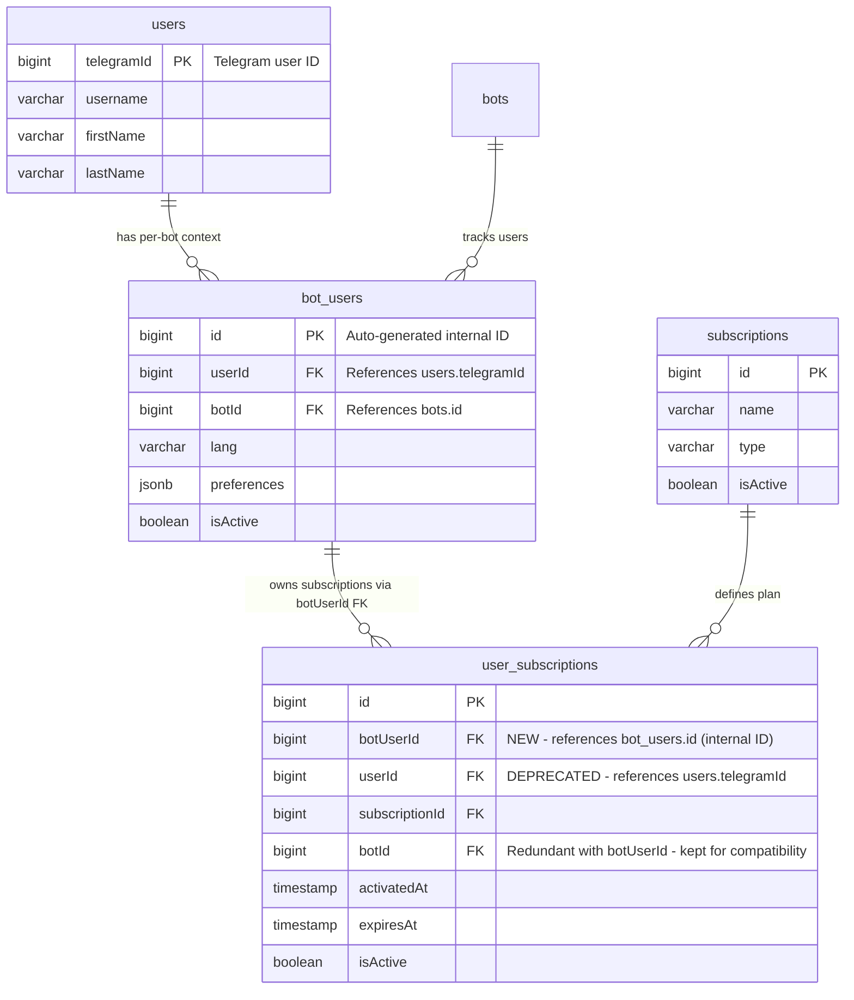
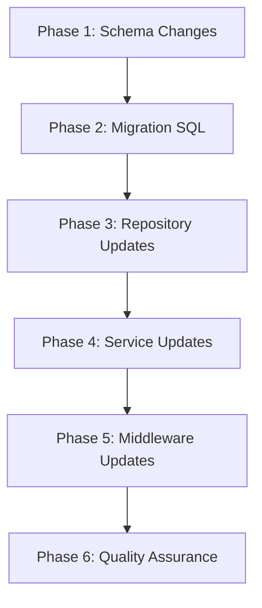

# User Subscriptions Migration to bot_users Design Document

## Overview

This design document details the migration of `user_subscriptions` to use `botUserId` as the **primary foreign key** referencing `bot_users.id`. This fundamentally changes the subscription model: subscriptions are now uniquely identified by bot_user (which represents a user+bot combination), not by the global user identity.

The migration enables per-bot subscription isolation, corrects trial eligibility logic, and aligns the subscription model with the multi-bot architecture established in ADR-004.

**Key Design Decision**: `botUserId` references `bot_users.id` (the internal auto-generated ID), NOT `telegramId`. This means:
- Each subscription belongs to a specific bot_user record
- The `bot_users` table already has a unique constraint on `(userId, botId)` ensuring one bot_user per user+bot combination
- The old `userId` column (which referenced `users.telegramId`) will be deprecated

## Background and Context

### Prerequisite ADRs

- **ADR-004**: Multi-Bot Database Architecture - Defines `bot_users` table and per-bot user patterns
- **ADR-008**: Partner Bot Flow Architecture - Uses `user_subscriptions` for trial management
- **ADR-009**: User Subscriptions Migration from users to bot_users - Architecture decisions for this migration

### Agreement Checklist

#### Scope
- [x] Add `botUserId` column to `user_subscriptions` table as FK to `bot_users.id`
- [x] `botUserId` references `bot_users.id` (internal ID), NOT `users.telegramId`
- [x] Update `UserSubscriptionsRepository` methods to use `botUserId`
- [x] Update middleware to pass `botUser.id` to subscription operations
- [x] Update services to use per-bot subscription queries
- [x] Create migration SQL with orphan handling
- [x] Update tests for new column

#### Non-Scope (Explicitly not changing)
- [x] `users` table structure - remains unchanged
- [x] `bot_users` table structure - remains unchanged
- [x] Existing `codes` table relationships
- [x] Subscription notification message content
- [x] Payment flow logic

#### Constraints
- [x] Parallel operation: No (Big-bang migration with downtime acceptable)
- [x] Backward compatibility: Temporary (userId kept for rollback capability)
- [x] Performance measurement: Not required (simple FK change)

### Problem to Solve

The current subscription system ties subscriptions to global user identity (`users.telegramId`) rather than bot-specific user context (`bot_users.id`). This creates:

1. **No Per-Bot Subscription Isolation**: A user's subscription history is global across all bots
2. **Trial Eligibility Logic Flaw**: `TrialService.isEligible()` checks for ANY subscription history across ALL bots
3. **Subscription Queries Require Join**: To get bot-specific subscriptions, queries must join through `bot_users`
4. **Inconsistent Data Model**: `bot_users` represents per-bot user context, but subscriptions don't follow this pattern

### Current Challenges

```
Current State:
users (telegramId: PK)
    ^
    |-- user_subscriptions.userId (FK)
    |
bot_users (id: PK, userId: FK -> users.telegramId, botId: FK -> bots.id)
```

**Problems**:
- User A interacting with Bot1 and Bot2 has ONE shared subscription history
- Trial activated on Bot1 blocks trial on Bot2 (incorrect behavior)
- Queries for "subscriptions for user X on Bot Y" require complex joins

### Requirements

#### Functional Requirements

1. **FR-1**: Add `botUserId` column to `user_subscriptions` as FK referencing `bot_users.id` (the internal auto-generated ID, not telegramId)
2. **FR-2**: Migrate all existing subscriptions to have valid `botUserId` values
3. **FR-3**: Auto-create `bot_users` records for orphaned subscriptions
4. **FR-4**: Update all repository methods to query by `botUserId`
5. **FR-5**: Preserve `userId` column for rollback capability

#### Non-Functional Requirements

- **Performance**: No measurable performance impact (simple FK change, index added)
- **Scalability**: Migration handles any number of existing records
- **Reliability**: Zero data loss during migration
- **Maintainability**: Clear deprecation path for old `userId` column

## Acceptance Criteria (AC)

### Phase 1: Schema Changes
- [ ] **AC-1.1**: `user_subscriptions.botUserId` column exists in database
- [ ] **AC-1.2**: Foreign key constraint references `bot_users.id` with CASCADE delete
- [ ] **AC-1.3**: Index `idx_user_subscriptions_bot_user` exists on `botUserId`
- [ ] **AC-1.4**: TypeScript types reflect new column

### Phase 2: Migration Execution
- [ ] **AC-2.1**: All existing subscriptions have non-null `botUserId` values
- [ ] **AC-2.2**: Orphaned subscriptions have corresponding `bot_users` records created
- [ ] **AC-2.3**: `botUserId` values correctly map to existing `bot_users(userId, botId)` pairs
- [ ] **AC-2.4**: Migration is idempotent (can be re-run safely)
- [ ] **AC-2.5**: Verify seed migration `20251126200000_seed_default_bot.sql` has already created `bot_users` records for all existing users before running this migration (prerequisite check)

### Phase 3: Repository Updates
- [ ] **AC-3.1**: `findByBotUserId(botUserId)` returns subscriptions for specific bot-user
- [ ] **AC-3.2**: `findActiveByBotUserId(botUserId)` returns only active, non-expired subscriptions
- [ ] **AC-3.3**: `activate(botUserId, subscriptionId, expiresAt)` creates subscription with `botUserId`
- [ ] **AC-3.4**: `isEligible(botUserId)` checks subscription history per bot-user, not globally
- [ ] **AC-3.5**: Existing methods with `userId` parameter are deprecated with warnings

### Phase 4: Service Updates
- [ ] **AC-4.1**: `TrialService.isEligible()` accepts `botUserId` parameter
- [ ] **AC-4.2**: `TrialService.activate()` creates subscription with `botUserId`
- [ ] **AC-4.3**: `SubscriptionExpirationService` queries by `botUserId` when available
- [ ] **AC-4.4**: `ReminderSchedulerService.findExpiredTrials()` uses `botUserId` for filtering

### Phase 5: Middleware Updates
- [ ] **AC-5.1**: Both bot and partner-bot middleware pass `botUser.id` to subscription operations
- [ ] **AC-5.2**: Context includes `botUser` with valid `id` for all subscription operations

### Phase 6: Quality Assurance
- [ ] **AC-6.1**: All unit tests pass with new `botUserId` parameter
- [ ] **AC-6.2**: All integration tests pass with actual database
- [ ] **AC-6.3**: TypeScript build succeeds with no type errors
- [ ] **AC-6.4**: Biome lint/format checks pass

## Existing Codebase Analysis

### Implementation Path Mapping

| Type | Path | Description |
|------|------|-------------|
| Existing | `libs/db/src/schema/user-subscriptions.ts` | Current schema with `userId` column |
| Existing | `libs/db/src/repositories/user-subscriptions.repository.ts` | Repository with 15+ methods using `userId` |
| Existing | `libs/bot/src/services/trial.service.ts` | Trial service using `userId` for eligibility |
| Existing | `libs/bot/src/services/subscription-expiration.service.ts` | Expiration service querying by `userId` |
| Existing | `libs/partner-bot/src/services/reminder-scheduler.service.ts` | Reminder service using `botId` filter |
| Existing | `libs/bot/src/middleware/user-management.middleware.ts` | Loads subscriptions by `userId` |
| Existing | `libs/partner-bot/src/middleware/user-management.middleware.ts` | Loads subscriptions by `userId` |
| Existing | `libs/db/migrations/20251126200000_seed_default_bot.sql` | Creates `bot_users` for existing users |
| New | `libs/db/migrations/YYYYMMDDHHMMSS_user_subscriptions_bot_user_id.sql` | Migration SQL |

### Similar Functionality Search

**Search performed**: `Grep: "botUserId" --type ts` and `Grep: "bot_user_id" --type sql`

**Result**: No existing implementations found. This is a new column addition.

**Decision**: Proceed with new implementation following existing design philosophy.

### Integration Points

| Integration Point | Existing Component | Change Required |
|-------------------|-------------------|-----------------|
| Schema → Repository | `user-subscriptions.ts` → `UserSubscriptionsRepository` | Add column, update methods |
| Repository → TrialService | `UserSubscriptionsRepository` → `TrialService` | Change parameter from `userId` to `botUserId` |
| Repository → ExpirationService | `UserSubscriptionsRepository` → `SubscriptionExpirationService` | Pass `botUserId` where available |
| Repository → ReminderService | `UserSubscriptionsRepository` → `ReminderSchedulerService` | Already uses `botId`, needs `botUserId` |
| Middleware → Repository | `UserManagementMiddleware` → `UserSubscriptionsRepository` | Pass `botUser.id` instead of `user.telegramId` |

## Design

### Change Impact Map

```yaml
Change Target: user_subscriptions.userId -> botUserId migration
Direct Impact:
  - libs/db/src/schema/user-subscriptions.ts (add botUserId column)
  - libs/db/src/repositories/user-subscriptions.repository.ts (update 15+ methods)
  - libs/bot/src/services/trial.service.ts (change parameter types)
  - libs/bot/src/services/subscription-expiration.service.ts (update queries)
  - libs/partner-bot/src/services/reminder-scheduler.service.ts (update query)
  - libs/bot/src/middleware/user-management.middleware.ts (pass botUser.id)
  - libs/partner-bot/src/middleware/user-management.middleware.ts (pass botUser.id)
  - libs/db/src/repositories/__tests__/user-subscriptions.repository.spec.ts (update tests)
Indirect Impact:
  - Trial eligibility now per-bot (behavior change)
  - Subscription queries now bot-scoped (data access pattern)
No Ripple Effect:
  - users table structure
  - bot_users table structure
  - codes table
  - subscriptions table
  - Payment flows (already per-bot)
  - Signal broadcasting (uses separate queries)
```

### Architecture Overview

**Key Relationship Change**: `user_subscriptions.botUserId` now references `bot_users.id` (the internal auto-generated ID), creating a direct link to the bot-specific user context. This replaces the old pattern where `user_subscriptions.userId` referenced `users.telegramId`.



**ID Clarification**:
- `bot_users.id`: Auto-generated internal ID (1, 2, 3, ...)
- `bot_users.userId`: References `users.telegramId` (large Telegram IDs like 123456789)
- `user_subscriptions.botUserId`: References `bot_users.id` (the internal ID, NOT telegramId)

### Data Flow

```
Before Migration:
  ctx.from.id (telegramId)
    → UsersRepository.upsert()
    → user.telegramId
    → UserSubscriptionsRepository.findByUserId(telegramId)
    → Subscriptions for ALL bots

After Migration:
  ctx.from.id (telegramId)
    → UsersRepository.upsert()
    → user.telegramId
    → BotUsersRepository.findOrCreate(telegramId, botId)
    → botUser.id
    → UserSubscriptionsRepository.findByBotUserId(botUserId)
    → Subscriptions for THIS bot only
```

### Integration Points List

| Integration Point | Location | Old Implementation | New Implementation | Switching Method |
|-------------------|----------|-------------------|-------------------|------------------|
| Trial eligibility | `TrialService.isEligible()` | `findByUserId(userId)` | `findByBotUserId(botUserId)` | Parameter change |
| Trial activation | `TrialService.activate()` | `activate(userId, ...)` | `activate(botUserId, ...)` | Parameter change |
| Subscription loading | `UserManagementMiddleware` | `findActiveByUserIdWithSubscription(telegramId)` | `findActiveByBotUserIdWithSubscription(botUserId)` | Method addition |
| Expiration check | `SubscriptionExpirationService` | `findExpiring(days, type)` | No change (joins handle) | Query modification |
| Reminder service | `ReminderSchedulerService` | `findExpiredTrials(botId)` | `findExpiredTrials(botId)` (uses botUserId internally) | Query modification |

### Main Components

#### Component 1: Schema Changes (`user-subscriptions.ts`)

- **Responsibility**: Define `user_subscriptions` table structure with both columns
- **Interface**: Drizzle schema definition
- **Dependencies**: `bot_users` table for FK reference

**Critical Design Point**: `botUserId` references `bot_users.id` (the auto-generated internal ID), NOT `users.telegramId`. This enables direct lookup of subscription ownership through the `bot_users` table which represents the user+bot combination.

```typescript
// Import bot_users schema for FK reference
import { botUsers } from './bot-users';

// New column definition - FK to bot_users.id (internal ID)
botUserId: bigint('bot_user_id', { mode: 'number' })
  .references(() => botUsers.id, { onDelete: 'cascade' }),
  // Note: Initially nullable, made NOT NULL after migration
  // References bot_users.id which is auto-generated (1, 2, 3, ...)
  // NOT referencing users.telegramId

// Deprecated column (keep for rollback)
userId: bigint('user_id', { mode: 'number' })
  .references(() => users.telegramId, { onDelete: 'cascade' }),
  // @deprecated Use botUserId. Will be removed in future migration.
```

#### Component 2: Migration SQL

- **Responsibility**: Migrate existing data, create missing `bot_users`, populate `botUserId`
- **Interface**: Drizzle-kit generated + enhanced SQL
- **Dependencies**: Existing `bot_users` records from seed migration

##### Drizzle-kit Migration Workflow

**Step 1: Modify Drizzle Schema**
First, update the schema in `libs/db/src/schema/user-subscriptions.ts` to add the `botUserId` column with proper FK reference to `bot_users.id`.

**Step 2: Generate Migration**
Run `pnpm drizzle-kit generate` to auto-generate the migration SQL file.

**Step 3: Enhance Generated Migration**
The generated migration will only contain the basic column addition and constraint. Manually enhance it to handle:
- Orphan record creation (subscriptions without corresponding `bot_users`)
- Data population (mapping existing subscriptions to `bot_users` records)
- Prerequisite verification (AC-2.5 seed migration check)

##### Migration SQL

```sql
-- Phase 1: Add nullable column
ALTER TABLE user_subscriptions ADD COLUMN bot_user_id BIGINT;

-- Phase 2: Create missing bot_users (handles orphans)
INSERT INTO bot_users (user_id, bot_id, is_active, created_at, updated_at)
SELECT DISTINCT us.user_id, us.bot_id, true, NOW(), NOW()
FROM user_subscriptions us
LEFT JOIN bot_users bu ON bu.user_id = us.user_id AND bu.bot_id = us.bot_id
WHERE bu.id IS NULL AND us.bot_id IS NOT NULL;

-- Phase 3: Populate bot_user_id
UPDATE user_subscriptions us
SET bot_user_id = bu.id
FROM bot_users bu
WHERE us.user_id = bu.user_id AND us.bot_id = bu.bot_id;

-- Phase 4: Add FK constraint
ALTER TABLE user_subscriptions
ADD CONSTRAINT fk_user_subscriptions_bot_user
FOREIGN KEY (bot_user_id) REFERENCES bot_users(id) ON DELETE CASCADE;

-- Phase 5: Create index
CREATE INDEX idx_user_subscriptions_bot_user ON user_subscriptions(bot_user_id);

-- Phase 6: Make NOT NULL (after verification)
-- ALTER TABLE user_subscriptions ALTER COLUMN bot_user_id SET NOT NULL;
```

#### Component 3: Repository Updates (`UserSubscriptionsRepository`)

- **Responsibility**: Provide data access methods using `botUserId`
- **Interface**: New methods with `botUserId` parameter, deprecated old methods
- **Dependencies**: Drizzle ORM, `bot_users` table

### Type Definitions

**Important**: `botUserId` references `bot_users.id` which is an auto-generated internal ID, NOT a telegramId. The `bot_users` table structure is:
- `id` (PK): Auto-generated identity, used as FK target
- `userId` (FK): References `users.telegramId`
- `botId` (FK): References `bots.id`
- Unique constraint on `(userId, botId)` ensures one bot_user per user+bot combination

```typescript
// Updated schema types (after migration)
export const userSubscriptions = pgTable(
  'user_subscriptions',
  {
    id: bigint('id', { mode: 'number' }).primaryKey().generatedAlwaysAsIdentity(),

    // NEW: Primary FK to bot-specific user context
    // References bot_users.id (auto-generated internal ID, NOT telegramId)
    // This replaces the old userId which referenced users.telegramId
    botUserId: bigint('bot_user_id', { mode: 'number' })
      .notNull()
      .references(() => botUsers.id, { onDelete: 'cascade' }),

    // DEPRECATED: Old reference to users.telegramId
    // Keep for rollback capability only. Will be removed in future migration.
    userId: bigint('user_id', { mode: 'number' })
      .references(() => users.telegramId, { onDelete: 'cascade' }),

    subscriptionId: bigint('subscription_id', { mode: 'number' })
      .notNull()
      .references(() => subscriptions.id, { onDelete: 'cascade' }),

    // Note: botId becomes redundant with botUserId (bot_users already has botId)
    // Kept for backward compatibility and direct bot filtering queries
    botId: bigint('bot_id', { mode: 'number' })
      .references(() => bots.id, { onDelete: 'cascade' }),

    activatedAt: timestamp('activated_at').notNull().defaultNow(),
    expiresAt: timestamp('expires_at'),
    isActive: boolean('is_active').notNull().default(true),
    createdAt: timestamp('created_at').defaultNow().notNull(),
  },
  (table) => [
    index('idx_user_subscriptions_bot').on(table.botId),
    index('idx_user_subscriptions_user_bot').on(table.userId, table.botId),
    index('idx_user_subscriptions_bot_user').on(table.botUserId),
  ],
);

export type UserSubscription = typeof userSubscriptions.$inferSelect;
export type NewUserSubscription = typeof userSubscriptions.$inferInsert;
```

### Interface Change Matrix

| Existing Method | New Method | Conversion Required | Compatibility Method |
|----------------|------------|-------------------|---------------------|
| `findByUserId(userId)` | `findByBotUserId(botUserId)` | Yes | Add new method, deprecate old |
| `findActiveByUserId(userId)` | `findActiveByBotUserId(botUserId)` | Yes | Add new method, deprecate old |
| `findByUserAndSubscription(userId, subId)` | `findByBotUserAndSubscription(botUserId, subId)` | Yes | Add new method, deprecate old |
| `findActiveByUserIdWithSubscription(userId)` | `findActiveByBotUserIdWithSubscription(botUserId)` | Yes | Add new method, deprecate old |
| `isUserSubscribed(userId, subId)` | `isBotUserSubscribed(botUserId, subId)` | Yes | Add new method, deprecate old |
| `hasActiveSubscription(userId, subId)` | `hasActiveSubscriptionByBotUser(botUserId, subId)` | Yes | Add new method, deprecate old |
| `activate(userId, subId, expiresAt)` | `activateForBotUser(botUserId, subId, expiresAt)` | Yes | Add new method, deprecate old |
| `deactivate(userId, subId)` | `deactivateForBotUser(botUserId, subId)` | Yes | Add new method, deprecate old |
| `findExpiredTrials(botId)` | `findExpiredTrials(botId)` | No | Uses botUserId in query |
| `findExpiring(days, type)` | `findExpiring(days, type)` | No | Already joins correctly |
| `findActiveUsersWithActiveSubscription(type)` | No change needed | No | Global query still valid |

### Data Contract

#### UserSubscriptionsRepository.activateForBotUser

```yaml
Input:
  Type: { botUserId: number, subscriptionId: number, expiresAt?: Date }
  Preconditions:
    - botUserId references existing bot_users.id
    - subscriptionId references existing subscriptions.id
  Validation: FK constraints enforce referential integrity

Output:
  Type: UserSubscription
  Guarantees:
    - Returns created or updated subscription record
    - botUserId is set to provided value
    - isActive is true
    - activatedAt is updated to current timestamp
  On Error: Throws AppError with appropriate code

Invariants:
  - botUserId is always non-null for new records
  - Subscription can be extended if already exists and active
```

### Error Handling

| Error Type | Condition | Handling |
|------------|-----------|----------|
| FK Violation | Invalid `botUserId` | Return error, log warning |
| Migration Failure | SQL execution error | Rollback transaction, restore backup |
| Orphan Record | No matching `bot_users` | Auto-create `bot_users` record |
| Null `botId` | Legacy subscription without bot | Skip in migration, handle in cleanup |

### Logging and Monitoring

- **Migration Logging**: Log count of records processed at each phase
- **Repository Logging**: Deprecation warnings for old methods
- **Service Logging**: Log trial eligibility checks with `botUserId` context

## Implementation Plan

### Implementation Approach

**Selected Approach**: Horizontal Slice (Foundation-driven)
**Selection Reason**: Schema changes must be complete before repository updates, repository updates before service changes. Each layer depends on the previous layer's completion.

### Technical Dependencies and Implementation Order



#### Required Implementation Order

1. **Phase 1: Schema Changes** (L3 Verification)
   - Technical Reason: TypeScript types must exist before repository code
   - Dependent Elements: Repository, Services, Middleware
   - Files: `libs/db/src/schema/user-subscriptions.ts`
   - Verification: `npm run build` succeeds

2. **Phase 2: Migration SQL** (L1 Verification)
   - Technical Reason: Database must have column before application uses it
   - Prerequisites: Schema changes committed
   - Files: `libs/db/migrations/YYYYMMDDHHMMSS_user_subscriptions_bot_user_id.sql`
   - Verification: Migration runs successfully on dev database

3. **Phase 3: Repository Updates** (L2 Verification)
   - Technical Reason: Data access layer must be complete before services
   - Prerequisites: Schema and migration complete
   - Files: `libs/db/src/repositories/user-subscriptions.repository.ts`
   - Verification: Unit tests pass

4. **Phase 4: Service Updates** (L2 Verification)
   - Technical Reason: Business logic requires repository methods
   - Prerequisites: Repository updates complete
   - Files:
     - `libs/bot/src/services/trial.service.ts`
     - `libs/bot/src/services/subscription-expiration.service.ts`
     - `libs/partner-bot/src/services/reminder-scheduler.service.ts`
   - Verification: Service tests pass

5. **Phase 5: Middleware Updates** (L1 Verification)
   - Technical Reason: User context must include `botUser.id`
   - Prerequisites: Service updates complete
   - Files:
     - `libs/bot/src/middleware/user-management.middleware.ts`
     - `libs/partner-bot/src/middleware/user-management.middleware.ts`
   - Verification: E2E flow works in development

6. **Phase 6: Quality Assurance** (L1 Verification)
   - Technical Reason: Final validation before merge
   - Prerequisites: All phases complete
   - Files: All test files
   - Verification: `npm run check:all` passes

### Integration Points

**Integration Point 1: Schema → Repository**
- Components: `user-subscriptions.ts` → `UserSubscriptionsRepository`
- Verification: TypeScript compilation succeeds, all method signatures valid

**Integration Point 2: Repository → TrialService**
- Components: `UserSubscriptionsRepository` → `TrialService`
- Verification: Trial eligibility check returns correct results per bot

**Integration Point 3: Middleware → Repository**
- Components: `UserManagementMiddleware` → `UserSubscriptionsRepository`
- Verification: User context includes correct subscriptions for current bot

### Migration Strategy

**Pre-Migration Checklist**:
1. Create database backup
2. Verify `bot_users` records exist (from seed migration `20251126200000`)
3. Stop application (maintenance window)

**Migration Execution**:
1. Run Drizzle migration
2. Verify all `bot_user_id` values populated
3. Verify FK constraint active
4. Verify index created

**Post-Migration Validation**:
```sql
-- Verify no NULL bot_user_id (except legacy without botId)
SELECT COUNT(*) FROM user_subscriptions WHERE bot_user_id IS NULL AND bot_id IS NOT NULL;
-- Expected: 0

-- Verify FK integrity
SELECT COUNT(*) FROM user_subscriptions us
LEFT JOIN bot_users bu ON us.bot_user_id = bu.id
WHERE us.bot_user_id IS NOT NULL AND bu.id IS NULL;
-- Expected: 0
```

**Rollback Strategy**:
1. If critical issues discovered, redeploy previous application version
2. Application will use `userId` column (still populated)
3. Investigate and fix issues
4. Re-deploy with fixes

## Test Strategy

### Basic Test Design Policy

Each acceptance criterion maps to at least one test case:
- AC-1.x → Schema validation tests
- AC-2.x → Migration validation queries
- AC-3.x → Repository unit tests
- AC-4.x → Service unit tests
- AC-5.x → Integration tests
- AC-6.x → Quality check commands

### Unit Tests

**Repository Tests** (`user-subscriptions.repository.spec.ts`):
```typescript
describe('UserSubscriptionsRepository', () => {
  describe('findByBotUserId', () => {
    it('should return subscriptions for specific bot user', async () => {
      // Arrange: Create mock with botUserId
      // Act: Call findByBotUserId
      // Assert: Returns only subscriptions for that botUserId
    });
  });

  describe('activateForBotUser', () => {
    it('should create subscription with botUserId', async () => {
      // Arrange: Valid botUserId, subscriptionId
      // Act: Call activateForBotUser
      // Assert: Created subscription has correct botUserId
    });

    it('should extend existing subscription for bot user', async () => {
      // Arrange: Existing active subscription
      // Act: Call activateForBotUser with new expiresAt
      // Assert: Subscription extended, not duplicated
    });
  });
});
```

**Service Tests** (`trial.service.spec.ts`):
```typescript
describe('TrialService', () => {
  describe('isEligible', () => {
    it('should check eligibility per bot user', async () => {
      // Arrange: User with subscription on Bot1, no subscription on Bot2
      // Act: Check eligibility for Bot2's botUserId
      // Assert: Returns true (eligible for trial on Bot2)
    });
  });
});
```

### Integration Tests

**Database Integration** (if `user-subscriptions.repository.int.spec.ts` exists):
```typescript
describe('UserSubscriptionsRepository Integration', () => {
  it('should create subscription with valid botUserId FK', async () => {
    // Use real database connection
    // Verify FK constraint enforced
  });
});
```

### E2E Tests

**Flow Verification**:
1. New user starts Bot1 → Eligible for trial
2. User activates trial on Bot1 → Subscription created with Bot1's botUserId
3. Same user starts Bot2 → Still eligible for trial (different bot)
4. User activates trial on Bot2 → Separate subscription with Bot2's botUserId

### Performance Tests

Not required per ADR-009 Decision 3 (simple FK change with acceptable downtime).

## Security Considerations

- No new security concerns introduced
- FK constraints ensure referential integrity
- Existing authentication/authorization unchanged
- No sensitive data exposed in new column

## Future Extensibility

### Cleanup Migration (Future)

After validation period (1-2 weeks post-deployment):
1. Drop `userId` column
2. Drop associated `idx_user_subscriptions_user_bot` index
3. Remove deprecated repository methods
4. Update TypeScript types

```sql
-- Future cleanup migration
ALTER TABLE user_subscriptions DROP COLUMN user_id;
DROP INDEX IF EXISTS idx_user_subscriptions_user_bot;
```

## Alternative Solutions

### Alternative 1: Create New Table

- **Overview**: Create `bot_user_subscriptions` table with new schema
- **Advantages**: Clean slate design, no deprecated columns
- **Disadvantages**: Over-engineering, requires complete repository rewrite, longer migration
- **Reason for Rejection**: Problem is just FK target change; new table adds unnecessary complexity

### Alternative 2: In-Place Column Modification

- **Overview**: Rename `userId` to `botUserId`, change FK target in one step
- **Advantages**: Single column, no deprecated columns
- **Disadvantages**: Data loss risk, no rollback path, requires perfect data
- **Reason for Rejection**: Too risky for production data; no recovery option if migration fails

## Risks and Mitigation

| Risk | Impact | Probability | Mitigation |
|------|--------|-------------|------------|
| Migration fails mid-execution | High | Low | Use transaction, restore from backup |
| Orphan records without `bot_users` | Medium | Medium | Auto-create `bot_users` in migration |
| Performance degradation | Low | Low | Add index on `botUserId` |
| Deprecated method usage | Medium | Medium | Log warnings, gradual transition |
| Rollback needed post-deploy | Medium | Low | Keep `userId` column populated |

## References

- [ADR-009: User Subscriptions Migration](../adr/ADR-009-user-subscriptions-bot-users-migration.md)
- [ADR-004: Multi-Bot Database Architecture](../adr/ADR-004-multi-bot-architecture.md)
- [ADR-008: Partner Bot Flow Architecture](../adr/ADR-008-partner-bot-flow-architecture.md)
- [Seed Migration: Default Bot](../../libs/db/migrations/20251126200000_seed_default_bot.sql)
- [Drizzle ORM Documentation](https://orm.drizzle.team/)
- [PostgreSQL FK Migration Best Practices](https://www.heroku.com/blog/planning-your-postgresql-migration/)

## Update History

| Date | Version | Changes | Author |
|------|---------|---------|--------|
| 2025-12-02 | 1.0 | Initial version | Claude Code Design Agent |
| 2025-12-02 | 1.1 | Clarified `botUserId` as FK to `bot_users.id` (internal ID, not telegramId); Added Drizzle-kit workflow documentation (ISSUE-001); Added AC-2.5 for seed migration verification (ISSUE-003); Enhanced ER diagram and type definitions with ID clarification | Claude Code Design Agent |
