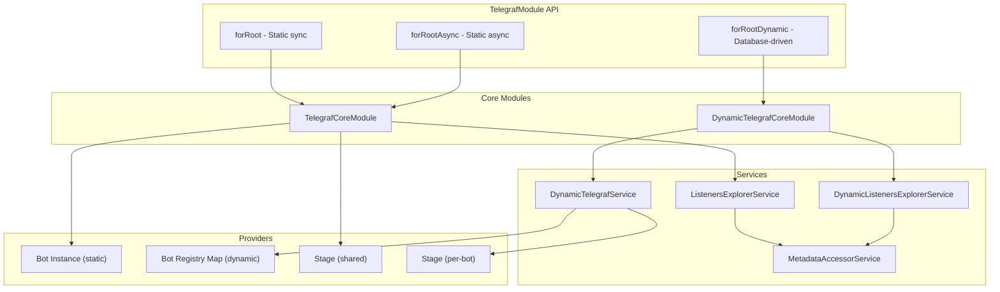
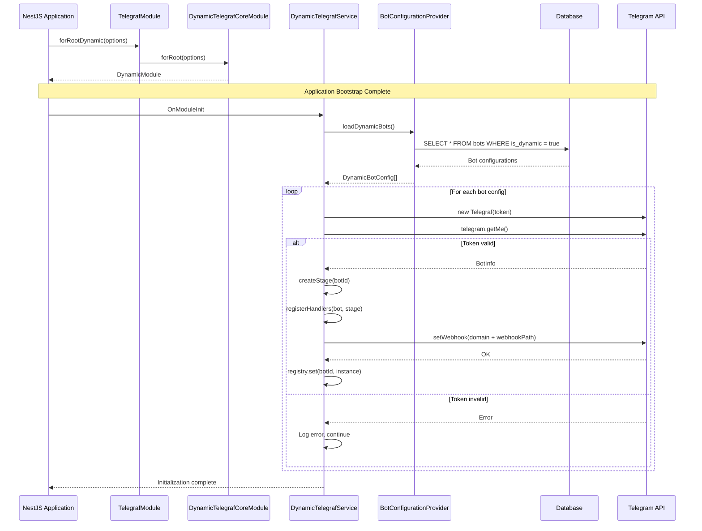

# Dynamic Telegraf Module Design Document

## Document Information

| Attribute | Value |
|-----------|-------|
| **Feature** | Dynamic Telegraf Module (`forRootDynamic()`) |
| **Status** | Draft |
| **Created** | 2025-11-27 |
| **Last Updated** | 2025-11-27 |
| **Author** | Claude Code Design Agent |
| **Version** | 1.0.0 |

---

## Overview

This design document specifies the technical implementation of the `forRootDynamic()` method in `@libs/telegraf`, enabling database-driven dynamic bot loading as an extension to the existing NestJS Telegraf integration module.

---

## Background and Context

### Prerequisite ADRs

| ADR | Title | Relevance |
|-----|-------|-----------|
| [ADR-006](../adr/ADR-006-dynamic-telegraf-module-loading.md) | Dynamic Telegraf Module Loading Pattern | Decision: `forRootDynamic()` method (Option A selected) |
| [ADR-004](../adr/ADR-004-multi-bot-architecture.md) | Multi-Bot Database Architecture | Database schema, bot settings structure |
| [ADR-005](../adr/ADR-005-telegram-bot-framework.md) | Telegram Bot Framework Selection | Telegraf.js + nest-telegraf as framework |

### Agreement Checklist

#### Scope
- [x] New `forRootDynamic()` static method in `TelegrafModule`
- [x] New `DynamicTelegrafCoreModule` for dynamic bot management
- [x] New `DynamicTelegrafService` for bot registry and lifecycle
- [x] New interfaces for dynamic module options
- [x] New `BotConfigurationProvider` interface for database abstraction
- [x] Per-bot Stage instance isolation
- [x] Shared handler registration pattern
- [x] Graceful shutdown handling

#### Non-Scope (Explicitly not changing)
- [x] Existing `forRoot()` method - remains unchanged
- [x] Existing `forRootAsync()` method - remains unchanged
- [x] Existing `TelegrafCoreModule` - remains unchanged
- [x] Existing `ListenersExplorerService` - remains unchanged for static bots
- [x] Database schema implementation (handled in separate design doc)

#### Constraints
- [x] Backward compatibility: Required - existing bots must continue working
- [x] Loading mode: Application startup only (no hot-reload for MVP)
- [x] Handler scope: Hybrid (shared default + per-bot override)
- [x] Stage management: Per-bot Stage instances

### Problem to Solve

Adding new Telegram bots currently requires code changes:
1. Adding environment variable for new bot token
2. Creating dedicated NestJS module for bot handlers
3. Adding `TelegrafModule.forRootAsync()` registration in `AppModule`
4. Restarting the application

**Target State**: Add new bots by simply inserting a database record + application restart, WITHOUT code changes.

### Current Challenges

1. **Tight Coupling**: Bot configuration embedded in code via `forRootAsync()`
2. **Decorator Dependency**: Handlers rely on nest-telegraf decorators (`@Update`, `@Start`, etc.)
3. **Shared Stage**: Single `Scenes.Stage` instance shared across all bots
4. **No Dynamic Loading**: No mechanism to load bot configurations from database

### Requirements

#### Functional Requirements (from PRD)

| Requirement | Description |
|-------------|-------------|
| FR-020 | New `forRootDynamic()` method in TelegrafModule |
| FR-021-028 | Load bots from database at startup via OnModuleInit |
| FR-030-035 | Hybrid handler registration (shared by default, per-bot override) |
| FR-040-044 | Per-bot Stage/Scene isolation |
| FR-050-054 | Bot lifecycle management with graceful shutdown |

#### Non-Functional Requirements

- **Performance**: Bot initialization < 5 seconds per bot
- **Reliability**: Failed bot initialization does not block other bots
- **Scalability**: Support up to 100 dynamic bots per application instance
- **Maintainability**: Clear separation between static and dynamic bot code paths

---

## Acceptance Criteria (AC)

### AC-1: forRootDynamic() Coexistence
- [ ] `forRootDynamic()` can be imported alongside `forRootAsync()` in the same application
- [ ] Static bots registered via `forRootAsync()` continue working unchanged
- [ ] No conflicts between static and dynamic bot providers

### AC-2: Database Loading
- [ ] `DynamicTelegrafService.onModuleInit()` queries `BotConfigurationProvider.loadDynamicBots()`
- [ ] Each active dynamic bot configuration results in a Telegraf instance creation
- [ ] Bot tokens are validated via `telegram.getMe()` before webhook setup

### AC-3: Per-bot Stage Isolation
- [ ] Each dynamic bot receives its own `Scenes.Stage` instance
- [ ] Scene registration is scoped to the bot's Stage
- [ ] Conversation state does not leak between bots

### AC-4: Handler Registration
- [ ] Shared handlers are registered on all dynamic bots
- [ ] Per-bot handlers can target specific bots via metadata
- [ ] Handlers receive `botId` and `botSettings` context

### AC-5: Fault Isolation
- [ ] Failed bot initialization logs error and continues with remaining bots
- [ ] Static bots continue operating if dynamic bot loading fails
- [ ] Error count reported in initialization summary

### AC-6: Graceful Shutdown
- [ ] `OnApplicationShutdown` deletes webhooks for all dynamic bots
- [ ] All bot instances are properly stopped
- [ ] No orphaned webhooks after application shutdown

### AC-7: Webhook Routing
- [ ] Each dynamic bot uses its stored `webhookPath` for webhook configuration
- [ ] `handleUpdate(webhookPath, update)` routes to correct bot instance
- [ ] Unknown webhook paths are handled gracefully (return OK to prevent Telegram retries)

---

## Existing Codebase Analysis

### Implementation Path Mapping

| Type | Path | Description |
|------|------|-------------|
| Existing | `libs/telegraf/src/telegraf.module.ts` | TelegrafModule with `forRoot()`, `forRootAsync()` |
| Existing | `libs/telegraf/src/telegraf-core.module.ts` | Core module for static bot providers |
| Existing | `libs/telegraf/src/services/listeners-explorer.service.ts` | Handler registration for static bots |
| Existing | `libs/telegraf/src/interfaces/telegraf-options.interface.ts` | Options interfaces |
| **New** | `libs/telegraf/src/dynamic-telegraf-core.module.ts` | Core module for dynamic bot providers |
| **New** | `libs/telegraf/src/services/dynamic-telegraf.service.ts` | Bot registry and lifecycle management |
| **New** | `libs/telegraf/src/services/dynamic-listeners-explorer.service.ts` | Handler registration for dynamic bots |
| **New** | `libs/telegraf/src/interfaces/dynamic-telegraf-options.interface.ts` | Dynamic module options interfaces |
| Modify | `libs/telegraf/src/telegraf.module.ts` | Add `forRootDynamic()` method |
| Modify | `libs/telegraf/src/index.ts` | Export new modules and interfaces |

### Similar Functionality Search Results

**Search conducted:**
- `Grep: "forRootDynamic" --type ts` - Not found (new functionality)
- `Grep: "DynamicTelegrafService" --type ts` - Found in `libs/framework/src/dynamic-telegraf/` (different location)
- `Grep: "BotConfigurationProvider" --type ts` - Not found

**Decision**: The existing `libs/framework/src/dynamic-telegraf/` implementation is a separate approach. This design follows ADR-006 to implement within `@libs/telegraf` using the `forRootDynamic()` pattern.

### Existing Module Structure Analysis

```typescript
// Current TelegrafModule API
TelegrafModule.forRoot(options: TelegrafModuleOptions): DynamicModule
TelegrafModule.forRootAsync(options: TelegrafModuleAsyncOptions): DynamicModule

// Proposed Addition
TelegrafModule.forRootDynamic(options: TelegrafDynamicModuleOptions): DynamicModule
```

**Key Observations from Current Implementation:**

1. **`TelegrafCoreModule.forRootAsync()`** creates:
   - `TELEGRAF_MODULE_OPTIONS` provider
   - `TELEGRAF_BOT_NAME` provider
   - Bot instance provider via `createBotFactory`
   - `telegrafStageProvider` (shared Stage)
   - `telegrafAllBotsProvider` (global bot map)

2. **`ListenersExplorerService`** performs:
   - Module scanning via `DiscoveryService`
   - Update class detection (`@Update` decorator)
   - Scene registration (`@Scene`, `@Wizard` decorators)
   - Handler binding to Telegraf instance

3. **Stage Management**:
   - Single `Scenes.Stage` instance per `TelegrafCoreModule`
   - Registered as `TELEGRAF_STAGE` provider
   - Shared across all handlers in the module

---

## Design

### Change Impact Map

```yaml
Change Target: @libs/telegraf module - Add forRootDynamic() capability

Direct Impact:
  - libs/telegraf/src/telegraf.module.ts (add forRootDynamic method)
  - libs/telegraf/src/index.ts (add exports)
  - New files: dynamic-telegraf-core.module.ts, dynamic-telegraf.service.ts, etc.

Indirect Impact:
  - Application modules importing TelegrafModule (new method available)
  - Bot handler modules (can use shared handler pattern)

No Ripple Effect:
  - Existing forRoot() and forRootAsync() usage
  - Existing static bot handlers with decorators
  - Existing TelegrafCoreModule internals
  - External webhook controllers (separate concern)
```

### Architecture Overview



### Data Flow



### Integration Points List

| Integration Point | Location | Old Implementation | New Implementation | Switching Method |
|-------------------|----------|-------------------|-------------------|------------------|
| Module Registration | `TelegrafModule` | N/A (new) | `forRootDynamic()` | New static method |
| Bot Configuration | N/A | N/A | `BotConfigurationProvider` interface | DI injection |
| Handler Registration | `ListenersExplorerService` | Decorator-based | `DynamicListenersExplorerService` | Programmatic |
| Stage Management | `telegrafStageProvider` | Shared singleton | Per-bot Stage instances | Factory pattern |
| Update Handling | N/A | N/A | `DynamicTelegrafService.handleUpdate()` | Service method |

### Main Components

#### Component 1: TelegrafDynamicModuleOptions

- **Responsibility**: Configuration interface for `forRootDynamic()`
- **Interface**: Defines bot provider, shared handlers, webhooks
- **Dependencies**: NestJS ModuleMetadata

#### Component 2: DynamicTelegrafCoreModule

- **Responsibility**: NestJS dynamic module for dynamic bot infrastructure
- **Interface**: `forRoot(options)` static method
- **Dependencies**: DiscoveryModule, ConfigModule, BotConfigurationProvider

#### Component 3: DynamicTelegrafService

- **Responsibility**: Bot registry, lifecycle management, update routing
- **Interface**: `getBot()`, `getAllBots()`, `handleUpdate()`, `getBotCount()`
- **Dependencies**: BotConfigurationProvider, ConfigService, DynamicListenersExplorerService

#### Component 4: DynamicListenersExplorerService

- **Responsibility**: Register handlers on dynamic bot instances
- **Interface**: `registerHandlers(bot, botId, stage)`
- **Dependencies**: MetadataAccessorService, ModulesContainer

#### Component 5: BotConfigurationProvider

- **Responsibility**: Abstract interface for loading bot configurations
- **Interface**: `loadDynamicBots(): Promise<DynamicBotConfig[]>`
- **Dependencies**: Database repository (implemented by consumer)

---

## Type Definitions

### TelegrafDynamicModuleOptions

```typescript
// libs/telegraf/src/interfaces/dynamic-telegraf-options.interface.ts

import { ModuleMetadata, Type } from '@nestjs/common/interfaces'
import { Middleware, Context } from 'telegraf'

/**
 * Configuration for a single dynamic bot loaded from database
 */
export interface DynamicBotConfig {
  /** Database record ID */
  id: number
  /** Bot token from BotFather */
  token: string
  /** Bot display name for logging */
  name: string
  /** Telegram bot username (without @) */
  username: string | null
  /** Unique webhook path (e.g., '/dynamic/brand1') */
  webhookPath: string
  /** Whether the bot is active and should be loaded */
  isActive: boolean
  /** Bot-specific settings (feature flags, defaults) */
  settings?: BotSettings | null
}

/**
 * Bot settings structure (from PRD)
 */
export interface BotSettings {
  features: {
    trialEnabled: boolean
    paymentsEnabled: boolean
    signalsEnabled: boolean
    broadcastEnabled: boolean
  }
  defaults: {
    subscriptionDays: number
    trialDays: number
    language: string
  }
  ui?: {
    welcomeImage?: string
    brandColor?: string
  }
}

/**
 * Interface for services that provide bot configurations from database
 * Must be implemented by the consuming application
 */
export interface BotConfigurationProvider {
  /**
   * Load all active dynamic bot configurations from database
   * Called once during OnModuleInit
   */
  loadDynamicBots(): Promise<DynamicBotConfig[]>
}

/**
 * Injection token for BotConfigurationProvider
 */
export const BOT_CONFIGURATION_PROVIDER = 'BOT_CONFIGURATION_PROVIDER'

/**
 * Options for TelegrafModule.forRootDynamic()
 */
export interface TelegrafDynamicModuleOptions
  extends Pick<ModuleMetadata, 'imports'> {
  /**
   * Service class that implements BotConfigurationProvider interface
   * Used to load bot configurations from database
   */
  botConfigProvider: Type<BotConfigurationProvider>

  /**
   * Modules containing shared handlers for dynamic bots
   * These handlers are scanned and registered on each dynamic bot
   */
  sharedHandlerModules: Function[]

  /**
   * Webhook domain for dynamic bots
   * Combined with bot's webhookPath to form full webhook URL
   * Example: 'https://api.example.com'
   */
  webhookDomain: string

  /**
   * Global middlewares applied to all dynamic bots
   * Example: session middleware, logging middleware
   */
  globalMiddlewares?: ReadonlyArray<Middleware<Context>>

  /**
   * Optional: Factory for creating bot-specific middlewares
   * Called for each bot during initialization
   */
  middlewareFactory?: (botConfig: DynamicBotConfig) => Middleware<Context>[]

  /**
   * Optional: Telegraf options applied to all dynamic bot instances
   */
  telegrafOptions?: Partial<Telegraf.Options<Context>>
}

/**
 * Async options for TelegrafModule.forRootDynamic()
 * Supports useFactory, useClass, useExisting patterns
 */
export interface TelegrafDynamicModuleAsyncOptions
  extends Pick<ModuleMetadata, 'imports'> {
  /**
   * Service class that implements BotConfigurationProvider
   */
  botConfigProvider: Type<BotConfigurationProvider>

  /**
   * Modules containing shared handlers
   */
  sharedHandlerModules: Function[]

  /**
   * Factory function for creating options
   */
  useFactory?: (
    ...args: unknown[]
  ) => Promise<TelegrafDynamicModuleOptions> | TelegrafDynamicModuleOptions

  /**
   * Dependencies to inject into useFactory
   */
  inject?: unknown[]
}
```

### DynamicBotInstance

```typescript
// libs/telegraf/src/interfaces/dynamic-telegraf-options.interface.ts

import { Telegraf, Context, Scenes } from 'telegraf'

/**
 * Represents a running dynamic bot instance
 * Stored in DynamicTelegrafService registry
 */
export interface DynamicBotInstance {
  /** Database record ID */
  botId: number
  /** Bot name for logging */
  name: string
  /** Telegraf bot instance */
  bot: Telegraf<Context>
  /** Per-bot Stage instance for scene management */
  stage: Scenes.Stage<Scenes.SceneContext>
  /** Configured webhook path */
  webhookPath: string
  /** Bot settings from database */
  settings: BotSettings | null
  /** Telegram bot username (populated after getMe()) */
  username: string
}

/**
 * Result of bot initialization attempt
 */
export interface BotInitResult {
  success: boolean
  botId: number
  name: string
  username?: string
  error?: string
}

/**
 * Statistics about dynamic bot initialization
 */
export interface DynamicBotStats {
  total: number
  successful: number
  failed: number
  bots: Array<{
    botId: number
    name: string
    status: 'running' | 'failed'
    error?: string
  }>
}
```

### Injection Tokens

```typescript
// libs/telegraf/src/telegraf.constants.ts (additions)

/** Injection token for DynamicTelegrafService */
export const DYNAMIC_TELEGRAF_SERVICE = 'DYNAMIC_TELEGRAF_SERVICE'

/** Injection token for dynamic module options */
export const DYNAMIC_TELEGRAF_MODULE_OPTIONS = 'DYNAMIC_TELEGRAF_MODULE_OPTIONS'

/** Injection token for BotConfigurationProvider */
export const BOT_CONFIGURATION_PROVIDER = 'BOT_CONFIGURATION_PROVIDER'

/** Prefix for dynamic bot webhook paths */
export const DYNAMIC_WEBHOOK_PREFIX = '/dynamic'
```

---

## Data Contract

### BotConfigurationProvider Input/Output

```yaml
Input:
  Type: None (method takes no parameters)
  Preconditions: Database connection established
  Validation: Provider implementation responsibility

Output:
  Type: Promise<DynamicBotConfig[]>
  Guarantees:
    - Returns array (may be empty)
    - Each config has required fields: id, token, name, webhookPath, isActive
    - Only active bots returned (isActive = true, isDynamic = true)
  On Error: Throws exception (caught by DynamicTelegrafService)

Invariants:
  - Token format validated by Telegram API (not by provider)
  - webhookPath uniqueness enforced by database constraint
```

### DynamicTelegrafService.handleUpdate

```yaml
Input:
  Type: { webhookPath: string, update: Update }
  Preconditions:
    - webhookPath starts with DYNAMIC_WEBHOOK_PREFIX
    - update is valid Telegram Update object
  Validation: webhookPath lookup in registry

Output:
  Type: Promise<boolean>
  Guarantees:
    - true if update was routed to a bot
    - false if no bot found for webhookPath
  On Error:
    - Logs error
    - Returns false (does not throw)

Invariants:
  - Always returns (never hangs)
  - Update handling errors caught and logged
```

---

## Integration Boundary Contracts

### Boundary 1: Application -> DynamicTelegrafModule

```yaml
Boundary Name: Module Registration
  Input: TelegrafDynamicModuleOptions
  Output: DynamicModule (sync)
  On Error: Throws at module registration time
```

### Boundary 2: DynamicTelegrafService -> BotConfigurationProvider

```yaml
Boundary Name: Bot Configuration Loading
  Input: None
  Output: Promise<DynamicBotConfig[]> (async)
  On Error: Exception propagated, logged, initialization continues with empty list
```

### Boundary 3: DynamicTelegrafService -> Telegram API

```yaml
Boundary Name: Bot Validation and Webhook Setup
  Input: Bot token, webhook URL
  Output: BotInfo (async), void for webhook
  On Error: Per-bot error logged, bot skipped, other bots continue
```

### Boundary 4: Webhook Controller -> DynamicTelegrafService

```yaml
Boundary Name: Update Routing
  Input: { webhookPath: string, update: Update }
  Output: Promise<boolean> (async)
  On Error: Returns false, logs warning
```

---

## State Transitions and Invariants

### DynamicTelegrafService State Machine

```yaml
State Definition:
  - Initial State: UNINITIALIZED (service created, no bots loaded)
  - LOADING: OnModuleInit called, loading bots from database
  - READY: Bots loaded and running
  - SHUTTING_DOWN: OnApplicationShutdown called
  - STOPPED: All bots stopped

State Transitions:
  UNINITIALIZED -> OnModuleInit -> LOADING
  LOADING -> Bots loaded -> READY
  READY -> OnApplicationShutdown -> SHUTTING_DOWN
  SHUTTING_DOWN -> Cleanup complete -> STOPPED

System Invariants:
  - Bot registry only modified during LOADING or SHUTTING_DOWN
  - handleUpdate() only processes updates in READY state
  - Webhook paths are unique across all registered bots
```

### Per-bot State Machine

```yaml
State Definition:
  - CREATING: Telegraf instance being created
  - VALIDATING: Token validation via getMe()
  - CONFIGURING: Handlers and webhooks being set up
  - RUNNING: Bot ready to receive updates
  - STOPPING: Bot being shut down
  - FAILED: Initialization failed

State Transitions:
  CREATING -> new Telegraf() -> VALIDATING
  VALIDATING -> getMe() success -> CONFIGURING
  VALIDATING -> getMe() failure -> FAILED
  CONFIGURING -> setWebhook() success -> RUNNING
  CONFIGURING -> setWebhook() failure -> FAILED
  RUNNING -> shutdown -> STOPPING
  STOPPING -> deleteWebhook() -> (removed from registry)
```

---

## Implementation Plan

### Implementation Approach

**Selected Approach**: Vertical Slice (Feature-driven)

**Selection Reason**:
- Each component delivers testable functionality
- `forRootDynamic()` is a self-contained feature
- Can be tested independently of database implementation
- Early value delivery: basic bot loading works before advanced features

### Technical Dependencies and Implementation Order

#### Phase 1: Interface Definitions (L3: Build Success)
1. **`dynamic-telegraf-options.interface.ts`**
   - Technical Reason: Types required by all other components
   - Dependent Elements: DynamicTelegrafCoreModule, DynamicTelegrafService

2. **Constants additions to `telegraf.constants.ts`**
   - Technical Reason: Injection tokens needed for DI
   - Dependent Elements: All new modules and services

#### Phase 2: Core Module Infrastructure (L3: Build Success)
1. **`DynamicTelegrafCoreModule`**
   - Technical Reason: NestJS module structure required before services
   - Prerequisites: Interface definitions
   - Dependent Elements: TelegrafModule.forRootDynamic()

2. **`DynamicTelegrafService` (stub)**
   - Technical Reason: Service must exist for module to compile
   - Prerequisites: DynamicTelegrafCoreModule

#### Phase 3: Service Implementation (L2: Test Operation)
1. **`DynamicTelegrafService` full implementation**
   - Technical Reason: Core bot loading and lifecycle logic
   - Prerequisites: Interface definitions, stub exists

2. **`DynamicListenersExplorerService`**
   - Technical Reason: Handler registration for dynamic bots
   - Prerequisites: DynamicTelegrafService, MetadataAccessorService

#### Phase 4: Module Integration (L1: Functional Operation)
1. **`TelegrafModule.forRootDynamic()` method**
   - Technical Reason: Public API entry point
   - Prerequisites: DynamicTelegrafCoreModule complete

2. **Index exports update**
   - Technical Reason: Public API exposure
   - Prerequisites: All modules and interfaces complete

### Integration Points

**Integration Point 1: forRootDynamic() -> DynamicTelegrafCoreModule**
- Components: TelegrafModule -> DynamicTelegrafCoreModule
- Verification: Module imports without errors, providers registered

**Integration Point 2: DynamicTelegrafService -> BotConfigurationProvider**
- Components: Service -> Application repository
- Verification: Mock provider returns configs, service creates bots

**Integration Point 3: DynamicTelegrafService -> Telegram API**
- Components: Service -> Telegraf -> Telegram
- Verification: Mock Telegram API, verify getMe() and setWebhook() calls

**Integration Point 4: External Controller -> DynamicTelegrafService**
- Components: Webhook controller -> handleUpdate()
- Verification: Mock update routed to correct bot instance

---

## Component Specifications

### 1. TelegrafModule Extension

```typescript
// libs/telegraf/src/telegraf.module.ts

import { Module, DynamicModule } from '@nestjs/common'
import { TelegrafCoreModule } from './telegraf-core.module'
import { DynamicTelegrafCoreModule } from './dynamic-telegraf-core.module'
import {
  TelegrafModuleOptions,
  TelegrafModuleAsyncOptions,
  TelegrafDynamicModuleOptions,
} from './interfaces'

@Module({})
export class TelegrafModule {
  /**
   * Synchronous static bot configuration
   * @param options Bot configuration options
   */
  public static forRoot(options: TelegrafModuleOptions): DynamicModule {
    return {
      module: TelegrafModule,
      imports: [TelegrafCoreModule.forRoot(options)],
      exports: [TelegrafCoreModule],
    }
  }

  /**
   * Asynchronous static bot configuration
   * @param options Async configuration options
   */
  public static forRootAsync(
    options: TelegrafModuleAsyncOptions,
  ): DynamicModule {
    return {
      module: TelegrafModule,
      imports: [TelegrafCoreModule.forRootAsync(options)],
      exports: [TelegrafCoreModule],
    }
  }

  /**
   * Dynamic bot loading from database
   *
   * Creates a DynamicTelegrafCoreModule that:
   * 1. Loads bot configurations from BotConfigurationProvider at startup
   * 2. Creates Telegraf instances for each active bot
   * 3. Registers shared handlers on each bot
   * 4. Sets up webhooks
   * 5. Provides bot registry for update routing
   *
   * @param options Dynamic module configuration
   * @returns DynamicModule for NestJS registration
   *
   * @example
   * ```typescript
   * TelegrafModule.forRootDynamic({
   *   botConfigProvider: BotsRepository,
   *   sharedHandlerModules: [SharedHandlersModule],
   *   webhookDomain: process.env.WEBHOOK_DOMAIN,
   *   imports: [DbModule],
   * })
   * ```
   */
  public static forRootDynamic(
    options: TelegrafDynamicModuleOptions,
  ): DynamicModule {
    return {
      module: TelegrafModule,
      imports: [DynamicTelegrafCoreModule.forRoot(options)],
      exports: [DynamicTelegrafCoreModule],
    }
  }
}
```

### 2. DynamicTelegrafCoreModule

```typescript
// libs/telegraf/src/dynamic-telegraf-core.module.ts

import {
  DynamicModule,
  Global,
  Module,
  Provider,
} from '@nestjs/common'
import { DiscoveryModule } from '@nestjs/core'
import {
  TelegrafDynamicModuleOptions,
  BOT_CONFIGURATION_PROVIDER,
} from './interfaces'
import {
  DYNAMIC_TELEGRAF_MODULE_OPTIONS,
} from './telegraf.constants'
import { DynamicTelegrafService } from './services/dynamic-telegraf.service'
import { DynamicListenersExplorerService } from './services/dynamic-listeners-explorer.service'
import { MetadataAccessorService } from './services'

/**
 * Core module for dynamic bot loading infrastructure
 *
 * This module is marked as @Global to allow DynamicTelegrafService
 * to be injected anywhere in the application for update routing.
 */
@Global()
@Module({
  imports: [DiscoveryModule],
  providers: [MetadataAccessorService],
})
export class DynamicTelegrafCoreModule {
  /**
   * Create dynamic module with bot configuration provider
   */
  public static forRoot(
    options: TelegrafDynamicModuleOptions,
  ): DynamicModule {
    const optionsProvider: Provider = {
      provide: DYNAMIC_TELEGRAF_MODULE_OPTIONS,
      useValue: options,
    }

    const botConfigProviderProvider: Provider = {
      provide: BOT_CONFIGURATION_PROVIDER,
      useClass: options.botConfigProvider,
    }

    return {
      module: DynamicTelegrafCoreModule,
      imports: [
        ...(options.imports || []),
        ...options.sharedHandlerModules,
      ],
      providers: [
        optionsProvider,
        botConfigProviderProvider,
        DynamicTelegrafService,
        DynamicListenersExplorerService,
      ],
      exports: [
        DynamicTelegrafService,
        DYNAMIC_TELEGRAF_MODULE_OPTIONS,
      ],
    }
  }
}
```

### 3. DynamicTelegrafService

```typescript
// libs/telegraf/src/services/dynamic-telegraf.service.ts

import {
  Injectable,
  Logger,
  Inject,
  OnModuleInit,
  OnApplicationShutdown,
} from '@nestjs/common'
import { Telegraf, Context, Scenes } from 'telegraf'
import { Update } from 'telegraf/types'
import {
  TelegrafDynamicModuleOptions,
  BotConfigurationProvider,
  DynamicBotConfig,
  DynamicBotInstance,
  BotInitResult,
  DynamicBotStats,
  BOT_CONFIGURATION_PROVIDER,
} from '../interfaces'
import {
  DYNAMIC_TELEGRAF_MODULE_OPTIONS,
} from '../telegraf.constants'
import { DynamicListenersExplorerService } from './dynamic-listeners-explorer.service'

/**
 * DynamicTelegrafService
 *
 * Manages dynamically loaded Telegram bots from database.
 * Implements OnModuleInit to load bots at application startup
 * and OnApplicationShutdown for graceful cleanup.
 *
 * Key responsibilities:
 * - Load active dynamic bots from database via BotConfigurationProvider
 * - Create and configure Telegraf instances per bot
 * - Create per-bot Stage instances for scene isolation
 * - Register shared handlers on each bot
 * - Set up webhooks with Telegram API
 * - Route incoming updates to correct bot instance
 * - Graceful shutdown (delete webhooks, stop bots)
 */
@Injectable()
export class DynamicTelegrafService
  implements OnModuleInit, OnApplicationShutdown
{
  private readonly logger = new Logger(DynamicTelegrafService.name)

  /** Map of botId -> DynamicBotInstance for O(1) lookup */
  private readonly bots = new Map<number, DynamicBotInstance>()

  /** Map of webhookPath -> botId for fast routing */
  private readonly webhookPathIndex = new Map<string, number>()

  /** Initialization statistics */
  private stats: DynamicBotStats = {
    total: 0,
    successful: 0,
    failed: 0,
    bots: [],
  }

  constructor(
    @Inject(DYNAMIC_TELEGRAF_MODULE_OPTIONS)
    private readonly options: TelegrafDynamicModuleOptions,
    @Inject(BOT_CONFIGURATION_PROVIDER)
    private readonly botConfigProvider: BotConfigurationProvider,
    private readonly listenersExplorer: DynamicListenersExplorerService,
  ) {}

  /**
   * Initialize all dynamic bots on application startup
   */
  async onModuleInit(): Promise<void> {
    this.logger.log('Initializing dynamic bots...')

    try {
      const results = await this.loadAndInitializeBots()

      this.stats = {
        total: results.length,
        successful: results.filter((r) => r.success).length,
        failed: results.filter((r) => !r.success).length,
        bots: results.map((r) => ({
          botId: r.botId,
          name: r.name,
          status: r.success ? 'running' : 'failed',
          error: r.error,
        })),
      }

      this.logger.log(
        `Dynamic bots initialized: ${this.stats.successful} success, ${this.stats.failed} failed`
      )

      // Log failures for debugging
      for (const result of results.filter((r) => !r.success)) {
        this.logger.error(
          `Failed to start bot "${result.name}" (ID: ${result.botId}): ${result.error}`
        )
      }
    } catch (error) {
      this.logger.error('Critical error during dynamic bot initialization', error)
      // Don't throw - allow app to start with static bots only
    }
  }

  /**
   * Graceful shutdown - stop all bots and delete webhooks
   */
  async onApplicationShutdown(signal?: string): Promise<void> {
    this.logger.log(
      `Application shutting down (signal: ${signal}), stopping ${this.bots.size} dynamic bots...`
    )

    const stopPromises: Promise<void>[] = []

    for (const [botId, instance] of this.bots) {
      stopPromises.push(this.stopBot(botId, instance))
    }

    const results = await Promise.allSettled(stopPromises)

    const failures = results.filter((r) => r.status === 'rejected')
    if (failures.length > 0) {
      this.logger.warn(`${failures.length} bots failed to stop cleanly`)
    }

    this.bots.clear()
    this.webhookPathIndex.clear()

    this.logger.log('All dynamic bots stopped')
  }

  /**
   * Load bot configurations and initialize each bot
   */
  private async loadAndInitializeBots(): Promise<BotInitResult[]> {
    const configs = await this.botConfigProvider.loadDynamicBots()
    const results: BotInitResult[] = []

    for (const config of configs) {
      if (!config.isActive) {
        this.logger.debug(`Skipping inactive bot: ${config.name}`)
        continue
      }

      const result = await this.initializeBot(config)
      results.push(result)
    }

    return results
  }

  /**
   * Initialize a single bot instance
   */
  private async initializeBot(config: DynamicBotConfig): Promise<BotInitResult> {
    const { id, name, token, webhookPath, settings } = config

    try {
      // Create Telegraf instance with optional global options
      const bot = new Telegraf<Context>(token, this.options.telegrafOptions)

      // Validate token by calling getMe()
      const botInfo = await bot.telegram.getMe()
      const username = botInfo.username

      // Log username mismatch if detected
      if (config.username && config.username !== username) {
        this.logger.warn(
          `Bot "${name}": username mismatch - DB: ${config.username}, Telegram: ${username}`
        )
      }

      // Create per-bot Stage instance
      const stage = new Scenes.Stage<Scenes.SceneContext>([])

      // Apply global middlewares
      if (this.options.globalMiddlewares) {
        for (const middleware of this.options.globalMiddlewares) {
          bot.use(middleware)
        }
      }

      // Apply bot-specific middlewares from factory
      if (this.options.middlewareFactory) {
        const botMiddlewares = this.options.middlewareFactory(config)
        for (const middleware of botMiddlewares) {
          bot.use(middleware)
        }
      }

      // Apply stage middleware
      bot.use(stage.middleware())

      // Register shared handlers using DynamicListenersExplorerService
      await this.listenersExplorer.registerHandlers(bot, id, stage, settings)

      // Setup global error handler
      bot.catch((err, ctx) => {
        this.logger.error(
          `Error in bot "${name}" (${username}): ${err.message}`,
          err.stack
        )
      })

      // Setup webhook
      await this.setupWebhook(bot, webhookPath, name)

      // Store bot instance
      const instance: DynamicBotInstance = {
        botId: id,
        name,
        bot,
        stage,
        webhookPath,
        settings: settings ?? null,
        username,
      }

      this.bots.set(id, instance)
      this.webhookPathIndex.set(webhookPath, id)

      this.logger.log(`Dynamic bot started: "${name}" (@${username})`)

      return { success: true, botId: id, name, username }
    } catch (error) {
      const errorMessage = error instanceof Error ? error.message : String(error)
      // Mask token in error messages
      const safeError = errorMessage.replace(/\d+:[A-Za-z0-9_-]+/g, '***:****')
      return { success: false, botId: id, name, error: safeError }
    }
  }

  /**
   * Setup webhook for a bot
   */
  private async setupWebhook(
    bot: Telegraf<Context>,
    webhookPath: string,
    botName: string
  ): Promise<void> {
    const webhookUrl = `${this.options.webhookDomain}${webhookPath}`

    await bot.telegram.setWebhook(webhookUrl, {
      allowed_updates: ['message', 'callback_query', 'inline_query'],
    })

    this.logger.debug(`Webhook set for "${botName}": ${webhookUrl}`)
  }

  /**
   * Stop a single bot and delete its webhook
   */
  private async stopBot(
    botId: number,
    instance: DynamicBotInstance
  ): Promise<void> {
    try {
      await instance.bot.telegram.deleteWebhook()
      this.logger.debug(`Webhook deleted for bot "${instance.name}"`)
    } catch (error) {
      this.logger.error(
        `Error deleting webhook for bot "${instance.name}":`,
        error
      )
    }
  }

  // ==================== Public API ====================

  /**
   * Handle incoming webhook update
   *
   * Routes the update to the correct bot instance based on webhook path.
   * Returns true if handled, false if no bot found.
   *
   * @param webhookPath - Full webhook path (e.g., '/dynamic/signal')
   * @param update - Telegram update object
   * @returns true if update was routed to a bot, false otherwise
   */
  async handleUpdate(webhookPath: string, update: Update): Promise<boolean> {
    const botId = this.webhookPathIndex.get(webhookPath)

    if (botId === undefined) {
      this.logger.warn(`No bot found for webhook path: ${webhookPath}`)
      return false
    }

    const instance = this.bots.get(botId)

    if (!instance) {
      this.logger.error(
        `Bot ID ${botId} found in index but not in registry`
      )
      return false
    }

    try {
      await instance.bot.handleUpdate(update)
      return true
    } catch (error) {
      this.logger.error(
        `Error handling update for bot "${instance.name}":`,
        error
      )
      return false
    }
  }

  /**
   * Get a bot instance by database ID
   */
  getBot(botId: number): Telegraf<Context> | undefined {
    return this.bots.get(botId)?.bot
  }

  /**
   * Get a bot instance by webhook path
   */
  getBotByWebhookPath(webhookPath: string): Telegraf<Context> | undefined {
    const botId = this.webhookPathIndex.get(webhookPath)
    if (botId === undefined) return undefined
    return this.bots.get(botId)?.bot
  }

  /**
   * Get all running dynamic bot instances
   * Returns a copy to prevent external modification
   */
  getAllBots(): Map<number, DynamicBotInstance> {
    return new Map(this.bots)
  }

  /**
   * Get count of running dynamic bots
   */
  getBotCount(): number {
    return this.bots.size
  }

  /**
   * Get initialization statistics
   */
  getStats(): DynamicBotStats {
    return { ...this.stats }
  }

  /**
   * Check if a bot exists and is running
   */
  hasBot(botId: number): boolean {
    return this.bots.has(botId)
  }
}
```

### 4. DynamicListenersExplorerService

```typescript
// libs/telegraf/src/services/dynamic-listeners-explorer.service.ts

import { Injectable, Logger, Inject } from '@nestjs/common'
import { ModulesContainer } from '@nestjs/core'
import { InstanceWrapper } from '@nestjs/core/injector/instance-wrapper'
import { Module } from '@nestjs/core/injector/module'
import { MetadataScanner } from '@nestjs/core/metadata-scanner'
import { ExternalContextCreator } from '@nestjs/core/helpers/external-context-creator'
import { ParamMetadata } from '@nestjs/core/helpers/interfaces'
import { Telegraf, Context, Composer, Scenes } from 'telegraf'
import { MetadataAccessorService } from './metadata-accessor.service'
import { BaseExplorerService } from './base-explorer.service'
import { TelegrafParamsFactory } from '../factories/telegraf-params-factory'
import {
  PARAM_ARGS_METADATA,
  DYNAMIC_TELEGRAF_MODULE_OPTIONS,
} from '../telegraf.constants'
import { TelegrafContextType } from '../execution-context'
import {
  TelegrafDynamicModuleOptions,
  BotSettings,
  ListenerMetadata,
} from '../interfaces'

/**
 * DynamicListenersExplorerService
 *
 * Explores shared handler modules and registers handlers on dynamic bot instances.
 * Similar to ListenersExplorerService but works with programmatic registration
 * instead of decorator-based bot injection.
 */
@Injectable()
export class DynamicListenersExplorerService extends BaseExplorerService {
  private readonly logger = new Logger(DynamicListenersExplorerService.name)
  private readonly telegrafParamsFactory = new TelegrafParamsFactory()

  constructor(
    @Inject(DYNAMIC_TELEGRAF_MODULE_OPTIONS)
    private readonly options: TelegrafDynamicModuleOptions,
    private readonly modulesContainer: ModulesContainer,
    private readonly metadataAccessor: MetadataAccessorService,
    private readonly metadataScanner: MetadataScanner,
    private readonly externalContextCreator: ExternalContextCreator,
  ) {
    super()
  }

  /**
   * Register handlers from shared handler modules on a dynamic bot
   *
   * @param bot - Telegraf instance to register handlers on
   * @param botId - Database bot ID for handler filtering
   * @param stage - Per-bot Stage instance for scene registration
   * @param settings - Bot settings for conditional handler registration
   */
  async registerHandlers(
    bot: Telegraf<Context>,
    botId: number,
    stage: Scenes.Stage<Scenes.SceneContext>,
    settings: BotSettings | null
  ): Promise<void> {
    const modules = this.getModules(
      this.modulesContainer,
      this.options.sharedHandlerModules
    )

    // Register @Update decorated classes (global handlers)
    this.registerUpdates(modules, bot, botId, settings)

    // Register @Composer decorated classes (stage middlewares)
    this.registerComposers(modules, stage)

    // Register @Scene and @Wizard decorated classes
    this.registerScenes(modules, stage, botId)

    this.logger.debug(`Handlers registered for bot ID ${botId}`)
  }

  /**
   * Register @Update decorated handlers on the bot
   */
  private registerUpdates(
    modules: Module[],
    bot: Telegraf<Context>,
    botId: number,
    settings: BotSettings | null
  ): void {
    const updates = this.flatMap<InstanceWrapper>(modules, (instance) =>
      this.filterUpdates(instance)
    )

    for (const wrapper of updates) {
      // Check for bot-specific handler targeting
      const targetBotId = this.metadataAccessor.getBotTargetMetadata(
        wrapper.metatype as Function
      )

      // Skip handler if it targets a different bot
      if (targetBotId !== undefined && targetBotId !== botId) {
        continue
      }

      // Check feature flags for conditional handlers
      if (!this.shouldRegisterHandler(wrapper, settings)) {
        continue
      }

      this.registerListeners(bot, wrapper)
    }
  }

  /**
   * Register @Composer decorated classes as stage middlewares
   */
  private registerComposers(
    modules: Module[],
    stage: Scenes.Stage<Scenes.SceneContext>
  ): void {
    const composers = this.flatMap<InstanceWrapper>(modules, (instance) =>
      this.filterComposers(instance)
    )

    for (const wrapper of composers) {
      const composer = new Composer()
      this.registerListeners(composer, wrapper)
      stage.use(composer)
    }
  }

  /**
   * Register @Scene and @Wizard decorated classes
   */
  private registerScenes(
    modules: Module[],
    stage: Scenes.Stage<Scenes.SceneContext>,
    botId: number
  ): void {
    const scenes = this.flatMap<InstanceWrapper>(modules, (wrapper) =>
      this.filterScenes(wrapper)
    )

    const sceneIds = new Set<string>()

    for (const wrapper of scenes) {
      const sceneMetadata = this.metadataAccessor.getSceneMetadata(
        wrapper.instance.constructor
      )

      if (!sceneMetadata) continue

      const { sceneId, type, options } = sceneMetadata

      // Prevent duplicate scene IDs
      if (sceneIds.has(sceneId)) {
        this.logger.warn(
          `Duplicate scene ID "${sceneId}" detected for bot ${botId}, skipping`
        )
        continue
      }
      sceneIds.add(sceneId)

      // Create scene based on type
      const scene =
        type === 'base'
          ? new Scenes.BaseScene<Scenes.SceneContext>(sceneId, options || {})
          : new Scenes.WizardScene<Scenes.WizardContext>(sceneId, options || {})

      // Register scene on stage
      stage.register(scene)

      // Register listeners on scene
      if (type === 'base') {
        this.registerListeners(scene, wrapper)
      } else {
        this.registerWizardListeners(
          scene as Scenes.WizardScene<Scenes.WizardContext>,
          wrapper
        )
      }
    }
  }

  /**
   * Check if handler should be registered based on feature flags
   */
  private shouldRegisterHandler(
    wrapper: InstanceWrapper,
    settings: BotSettings | null
  ): boolean {
    const featureFlag = this.metadataAccessor.getFeatureFlagMetadata(
      wrapper.metatype as Function
    )

    if (!featureFlag) return true // No feature flag = always register
    if (!settings?.features) return false // Has flag but no settings = skip

    const features = settings.features as Record<string, boolean>
    return features[featureFlag] === true
  }

  /**
   * Filter for @Update decorated classes
   */
  private filterUpdates(
    wrapper: InstanceWrapper
  ): InstanceWrapper<unknown> | undefined {
    const { instance } = wrapper
    if (!instance) return undefined

    const isUpdate = this.metadataAccessor.isUpdate(
      wrapper.metatype as Function
    )
    return isUpdate ? wrapper : undefined
  }

  /**
   * Filter for @Composer decorated classes
   */
  private filterComposers(
    wrapper: InstanceWrapper
  ): InstanceWrapper<unknown> | undefined {
    const { instance } = wrapper
    if (!instance) return undefined

    const isComposer = this.metadataAccessor.isComposer(
      wrapper.metatype as Function
    )
    return isComposer ? wrapper : undefined
  }

  /**
   * Filter for @Scene or @Wizard decorated classes
   */
  private filterScenes(
    wrapper: InstanceWrapper
  ): InstanceWrapper<unknown> | undefined {
    const { instance } = wrapper
    if (!instance) return undefined

    const isScene = this.metadataAccessor.isScene(
      wrapper.metatype as Function
    )
    return isScene ? wrapper : undefined
  }

  /**
   * Register listener methods from a handler class
   */
  private registerListeners(
    composer: Composer<Context>,
    wrapper: InstanceWrapper<unknown>
  ): void {
    const { instance } = wrapper
    const prototype = Object.getPrototypeOf(instance)

    this.metadataScanner.scanFromPrototype(instance, prototype, (name) =>
      this.registerIfListener(composer, instance, prototype, name)
    )
  }

  /**
   * Register wizard step listeners
   */
  private registerWizardListeners(
    wizard: Scenes.WizardScene<Scenes.WizardContext>,
    wrapper: InstanceWrapper<unknown>
  ): void {
    const { instance } = wrapper
    const prototype = Object.getPrototypeOf(instance)

    type WizardMetadata = { step: number; methodName: string }
    const wizardSteps: WizardMetadata[] = []
    const basicListeners: string[] = []

    this.metadataScanner.scanFromPrototype(
      instance,
      prototype,
      (methodName) => {
        const methodRef = prototype[methodName]
        const metadata = this.metadataAccessor.getWizardStepMetadata(methodRef)
        if (!metadata) {
          basicListeners.push(methodName)
          return undefined
        }
        wizardSteps.push({ step: metadata.step, methodName })
      }
    )

    // Register basic listeners first
    for (const methodName of basicListeners) {
      this.registerIfListener(wizard, instance, prototype, methodName)
    }

    // Group and sort wizard steps
    const group = wizardSteps
      .sort((a, b) => a.step - b.step)
      .reduce<Record<number, WizardMetadata[]>>(
        (prev, cur) => ({
          ...prev,
          [cur.step]: [...(prev[cur.step] || []), cur],
        }),
        {}
      )

    // Create step middleware
    wizard.steps = Object.values(group).map((stepsMetadata) => {
      const composer = new Composer()
      for (const stepMethod of stepsMetadata) {
        this.registerIfListener(
          composer,
          instance,
          prototype,
          stepMethod.methodName,
          [{ method: 'use', args: [] }]
        )
      }
      return composer.middleware()
    })
  }

  /**
   * Register a single listener method if it has listener metadata
   */
  private registerIfListener(
    composer: Composer<Context>,
    instance: unknown,
    prototype: Record<string, unknown>,
    methodName: string,
    defaultMetadata?: ListenerMetadata[]
  ): void {
    const methodRef = prototype[methodName] as Function
    const metadata =
      this.metadataAccessor.getListenerMetadata(methodRef) || defaultMetadata

    if (!metadata || metadata.length < 1) return

    const listenerCallbackFn = this.createContextCallback(
      instance as Record<string, unknown>,
      prototype,
      methodName
    )

    for (const { method, args } of metadata) {
      const composerMethod = composer[method as keyof Composer<Context>]
      if (typeof composerMethod !== 'function') {
        this.logger.warn(`Unknown composer method: ${method}`)
        continue
      }

      ;(composerMethod as Function).call(
        composer,
        ...args,
        async (ctx: Context, next: () => Promise<void>): Promise<void> => {
          const result = await listenerCallbackFn(ctx, next)
          if (result) {
            await ctx.reply(String(result))
          }
        }
      )
    }
  }

  /**
   * Create context callback using NestJS external context creator
   */
  createContextCallback<T extends Record<string, unknown>>(
    instance: T,
    prototype: Record<string, unknown>,
    methodName: string
  ) {
    const paramsFactory = this.telegrafParamsFactory
    const methodRef = prototype[methodName] as (...args: unknown[]) => unknown

    return this.externalContextCreator.create<
      Record<number, ParamMetadata>,
      TelegrafContextType
    >(
      instance,
      methodRef,
      methodName,
      PARAM_ARGS_METADATA,
      paramsFactory,
      undefined,
      undefined,
      undefined,
      'telegraf'
    )
  }
}
```

### 5. MetadataAccessorService Extensions

```typescript
// libs/telegraf/src/services/metadata-accessor.service.ts (additions)

import {
  BOT_TARGET_METADATA,
  FEATURE_FLAG_METADATA,
} from '../telegraf.constants'

// Add to existing MetadataAccessorService class:

/**
 * Get bot target metadata (for per-bot handler filtering)
 * Returns undefined if handler should apply to all bots
 */
getBotTargetMetadata(target: Function): number | undefined {
  if (!target) return undefined
  return this.reflector.get(BOT_TARGET_METADATA, target)
}

/**
 * Get feature flag metadata (for conditional handler registration)
 * Returns undefined if handler has no feature flag requirement
 */
getFeatureFlagMetadata(target: Function): string | undefined {
  if (!target) return undefined
  return this.reflector.get(FEATURE_FLAG_METADATA, target)
}
```

### 6. New Decorators

```typescript
// libs/telegraf/src/decorators/core/for-bot.decorator.ts

import { SetMetadata } from '@nestjs/common'
import { BOT_TARGET_METADATA } from '../../telegraf.constants'

/**
 * Decorator to target a handler to a specific dynamic bot
 *
 * @param botId - Database ID of the target bot
 *
 * @example
 * ```typescript
 * @Update()
 * @ForBot(5) // Only registered on bot with ID 5
 * export class BrandSpecificUpdate {
 *   @Start()
 *   async onStart(@Ctx() ctx) { ... }
 * }
 * ```
 */
export const ForBot = (botId: number) =>
  SetMetadata(BOT_TARGET_METADATA, botId)
```

```typescript
// libs/telegraf/src/decorators/core/requires-feature.decorator.ts

import { SetMetadata } from '@nestjs/common'
import { FEATURE_FLAG_METADATA } from '../../telegraf.constants'

/**
 * Decorator to conditionally register handler based on bot feature flag
 *
 * @param featureKey - Key from BotSettings.features
 *
 * @example
 * ```typescript
 * @Update()
 * @RequiresFeature('paymentsEnabled')
 * export class PaymentUpdate {
 *   @Command('pay')
 *   async onPay(@Ctx() ctx) { ... }
 * }
 * ```
 */
export const RequiresFeature = (featureKey: string) =>
  SetMetadata(FEATURE_FLAG_METADATA, featureKey)
```

---

## Error Handling

### Error Categories

| Error Type | Source | Handling Strategy |
|------------|--------|-------------------|
| Database Connection | BotConfigurationProvider | Log error, continue with empty list, app starts |
| Invalid Token | Telegram API (getMe) | Log error, skip bot, continue with others |
| Webhook Setup Failure | Telegram API (setWebhook) | Log error, skip bot, continue with others |
| Handler Registration Error | DynamicListenersExplorerService | Log error, skip handler, continue |
| Update Handling Error | Bot.handleUpdate() | Log error, return OK to Telegram |
| Shutdown Error | deleteWebhook() | Log warning, continue shutdown |

### Error Response Pattern

```typescript
// Always return OK to Telegram to prevent retry storms
async handleUpdate(webhookPath: string, update: Update): Promise<boolean> {
  try {
    // ... routing logic
  } catch (error) {
    this.logger.error(`Error handling update: ${error.message}`, error.stack)
    return false // Still returns, no throw
  }
}
```

### Token Masking

```typescript
// Always mask tokens in error messages and logs
const safeError = errorMessage.replace(/\d+:[A-Za-z0-9_-]+/g, '***:****')
```

---

## Test Strategy

### Unit Tests

| Component | Test Focus | Mocks Required |
|-----------|------------|----------------|
| DynamicTelegrafService | Bot loading, registry, lifecycle | BotConfigurationProvider, Telegraf |
| DynamicListenersExplorerService | Handler registration | MetadataAccessorService, ModulesContainer |
| TelegrafModule.forRootDynamic | Module creation | None (integration) |

### Integration Tests

| Scenario | Verification |
|----------|--------------|
| forRootDynamic + forRootAsync coexistence | Both module types load without conflict |
| Bot loading from mock provider | Correct number of bots created |
| Handler registration | Handlers respond to commands |
| Graceful shutdown | Webhooks deleted, no errors |

### E2E Tests

| Scenario | Verification |
|----------|--------------|
| Full bot lifecycle | Load -> Receive update -> Respond -> Shutdown |
| Multi-bot routing | Updates routed to correct bot |
| Error recovery | Failed bot does not affect others |

---

## Security Considerations

1. **Token Storage**: Tokens stored in database (plain text per ADR-004 Decision 4)
2. **Token Masking**: Tokens never logged in full, always masked with asterisks
3. **Webhook Validation**: Rely on Telegram's built-in webhook security
4. **Bot Isolation**: Each bot has independent Telegraf instance
5. **Error Messages**: Sensitive data stripped from error responses

---

## Future Extensibility

### Hot-Reload Support (Post-MVP)

```typescript
// Future API addition to DynamicTelegrafService
async reloadBot(botId: number): Promise<BotInitResult> {
  const existing = this.bots.get(botId)
  if (existing) {
    await this.stopBot(botId, existing)
    this.bots.delete(botId)
    this.webhookPathIndex.delete(existing.webhookPath)
  }
  const config = await this.botConfigProvider.getBotById(botId)
  return this.initializeBot(config)
}

async addBot(botId: number): Promise<BotInitResult> {
  const config = await this.botConfigProvider.getBotById(botId)
  return this.initializeBot(config)
}

async removeBot(botId: number): Promise<void> {
  const existing = this.bots.get(botId)
  if (existing) {
    await this.stopBot(botId, existing)
    this.bots.delete(botId)
    this.webhookPathIndex.delete(existing.webhookPath)
  }
}
```

### Database Polling (Post-MVP)

```typescript
// Scheduled job to check for new bots
@Cron('*/5 * * * *')
async pollForNewBots(): Promise<void> {
  const configs = await this.botConfigProvider.loadDynamicBots()
  for (const config of configs) {
    if (config.isActive && !this.bots.has(config.id)) {
      await this.initializeBot(config)
    }
  }
}
```

---

## Risks and Mitigation

| Risk | Impact | Probability | Mitigation |
|------|--------|-------------|------------|
| Invalid token crashes app | High | Low | Per-bot try-catch, skip failed bots |
| Memory exhaustion with many bots | Medium | Low | Monitor memory, limit bot count |
| Webhook conflicts | High | Low | Unique webhookPath constraint in DB |
| Handler registration failures | Medium | Medium | Log errors, continue with other handlers |
| Shutdown takes too long | Low | Medium | Parallel webhook deletion, timeout |

---

## References

- [NestJS Dynamic Modules Documentation](https://docs.nestjs.com/fundamentals/dynamic-modules)
- [nestjs-telegraf Multiple Bots Documentation](https://nestjs-telegraf.0x467.com/extras/multiple-bots)
- [Telegraf.js Documentation](https://telegraf.js.org/)
- [ADR-006: Dynamic Telegraf Module Loading Pattern](../adr/ADR-006-dynamic-telegraf-module-loading.md)
- [PRD: Multi-Bot Database Architecture v1.3.0](../prd/multi-bot-architecture-prd.md)

---

## Update History

| Date | Version | Changes | Author |
|------|---------|---------|--------|
| 2025-11-27 | 1.0.0 | Initial design document | Claude Code Design Agent |
