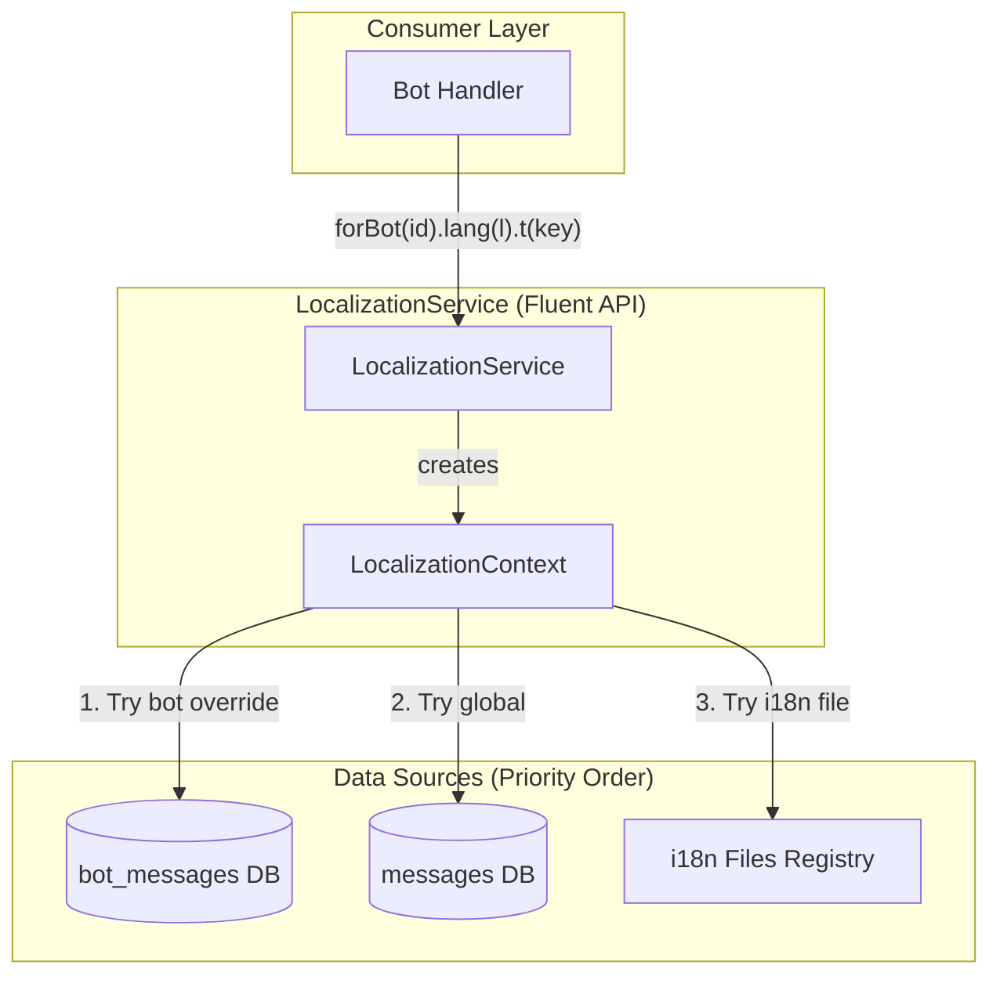
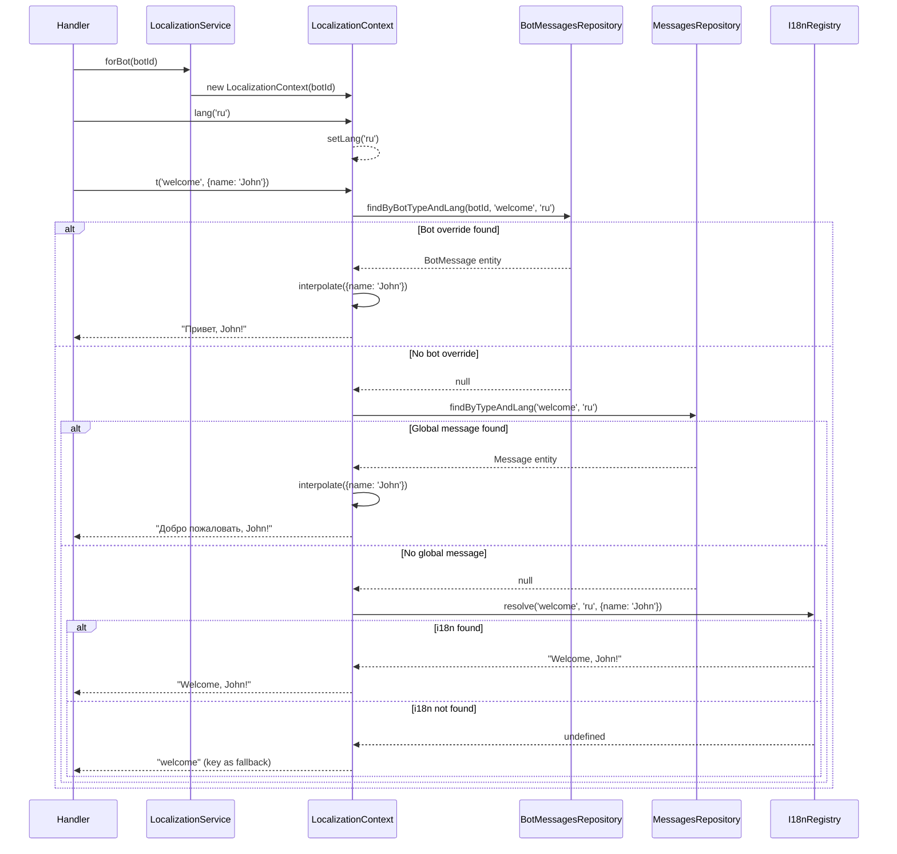

# LocalizationService Design Document

## Overview

Centralized localization service for the framework library that provides a unified translation resolution mechanism with cascading fallback hierarchy: bot-specific overrides (DB) -> global messages (DB) -> hardcoded i18n files. Implements a fluent API pattern `forBot(id).lang(l).t(key, params?)` for ergonomic usage across all bot handlers.

## Background and Context

### Prerequisite ADRs

- **ADR-004 (Decision 3)**: Message Override Strategy - establishes the global defaults + per-bot overrides pattern
- **ADR-005**: Telegram Bot Framework Selection - confirms Telegraf.js + nest-telegraf stack

### Agreement Checklist

#### Scope
- [x] Create LocalizationService with fluent API in `libs/framework/src/localization/`
- [x] Integrate with existing BotMessagesRepository and MessagesRepository
- [x] Import existing i18n files as final fallback
- [x] Support template variable interpolation (`{name}` -> value)
- [x] NestJS Injectable service with DI support

#### Non-Scope (Explicitly not changing)
- [ ] Existing BotMessagesRepository implementation (will use as-is)
- [ ] Existing MessagesRepository implementation (will use as-is)
- [ ] Existing i18n files (will import, not modify)
- [ ] Database schema (no changes required)
- [ ] Caching layer (explicitly not implementing per user decision)

#### Constraints
- [ ] Parallel operation: No (new service)
- [ ] Backward compatibility: Yes (existing code can continue using repositories directly)
- [ ] Performance measurement: Not required (simple DB queries per user decision)

### Problem to Solve

Currently, translation resolution is scattered across multiple patterns:
1. **Direct repository calls**: Components call `BotMessagesRepository.resolveMessage()` directly
2. **Hardcoded i18n functions**: Functions like `getRenewalMessage()`, `getStartMessage()`, `getTrialMessage()` scattered in bot modules
3. **Inconsistent API**: Different calling patterns for DB vs hardcoded translations

This leads to:
- Duplicated fallback logic
- Inconsistent error handling
- No unified entry point for translations
- Difficulty adding new translation sources

### Current Challenges

1. **Fragmented Translation Sources**:
   - `bot_messages` table (bot-specific)
   - `messages` table (global)
   - Multiple i18n files (`start.i18n.ts`, `trial.i18n.ts`, `renewal.i18n.ts`)

2. **Inconsistent APIs**:
   - Repository: `await repo.resolveMessage(botId, type, lang)`
   - i18n: `getStartMessage(lang, key, ...args)`

3. **Missing Type Safety**: i18n functions use `any[]` for variadic arguments

4. **No Template Interpolation**: DB messages don't support `{variable}` placeholders

### Requirements

#### Functional Requirements

1. **FR-1**: Resolve translation keys with cascading fallback: bot_messages -> messages -> i18n file
2. **FR-2**: Provide fluent API: `localizationService.forBot(botId).lang('ru').t('key', params)`
3. **FR-3**: Support language fallback: requested lang -> 'en'
4. **FR-4**: Support template variable interpolation: `{name}` replaced with provided value
5. **FR-5**: Integrate with existing i18n files as final fallback

#### Non-Functional Requirements

- **Performance**: Direct DB queries without caching (per user decision)
- **Scalability**: Service is stateless, scales horizontally with app instances
- **Reliability**: Always returns a message (hardcoded fallback as last resort)
- **Maintainability**: Clean separation of concerns, testable components

## Acceptance Criteria (AC)

- [ ] **AC-1**: Service resolves keys from bot_messages table when override exists for (botId, type, lang)
- [ ] **AC-2**: Service falls back to messages table when no bot override exists
- [ ] **AC-3**: Service falls back to registered i18n file when key not in database
- [ ] **AC-4**: Language fallback: when requested lang not found, service tries 'en'
- [ ] **AC-5**: Fluent API works: `localizationService.forBot(1).lang('ru').t('welcome')` returns translated string
- [ ] **AC-6**: Template interpolation: `t('greeting', { name: 'John' })` replaces `{name}` with "John"
- [ ] **AC-7**: Service is injectable via NestJS DI in any module importing FrameworkModule
- [ ] **AC-8**: TypeScript type safety for registered i18n file keys
- [ ] **AC-9**: Function-based i18n messages (with parameters) are properly invoked
- [ ] **AC-10**: When all fallbacks fail, returns key as-is (never throws)

## Existing Codebase Analysis

### Implementation Path Mapping

| Type | Path | Description |
|------|------|-------------|
| Existing | `libs/db/src/repositories/bot-messages.repository.ts` | Bot-specific message overrides with `resolveMessage()` |
| Existing | `libs/db/src/repositories/messages.repository.ts` | Global messages repository |
| Existing | `libs/bot/src/commands/start/start.i18n.ts` | Start command translations |
| Existing | `libs/bot/src/actions/trial/trial.i18n.ts` | Trial feature translations |
| Existing | `libs/bot/src/commands/renew/renewal.i18n.ts` | Renewal scene translations |
| Existing | `libs/partner-bot/src/i18n/renewal.i18n.ts` | Partner bot renewal translations |
| New | `libs/framework/src/localization/localization.service.ts` | Main service with fluent API |
| New | `libs/framework/src/localization/localization.module.ts` | NestJS module |
| New | `libs/framework/src/localization/interfaces.ts` | Types and interfaces |
| New | `libs/framework/src/localization/index.ts` | Barrel export |
| Modified | `libs/framework/src/framework.module.ts` | Add LocalizationModule import |
| Modified | `libs/framework/src/index.ts` | Export localization module |

### Integration Points

- **Integration Target**: BotMessagesRepository, MessagesRepository
- **Invocation Method**: DI injection, direct method calls
- **i18n Files**: Dynamic import/registration at module initialization

### Similar Functionality Search Results

**Found**: `BotMessagesRepository.resolveMessage()` already implements the DB fallback hierarchy (bot_messages -> messages -> hardcoded). The new LocalizationService will wrap this with:
1. Fluent API layer
2. i18n file integration as additional fallback
3. Template interpolation support

**Decision**: Use existing repository implementation (Pattern 5 compliance: use existing, don't duplicate)

## Design

### Change Impact Map

```yaml
Change Target: Framework localization infrastructure
Direct Impact:
  - libs/framework/src/localization/*.ts (new files)
  - libs/framework/src/framework.module.ts (import addition)
  - libs/framework/src/index.ts (export addition)
Indirect Impact:
  - Bot handlers can optionally migrate to fluent API
  - i18n files become registrable fallbacks
No Ripple Effect:
  - Existing direct repository usage continues to work
  - Database schema unchanged
  - Existing i18n functions remain functional
```

### Interface Change Matrix

| Existing Method | New Method | Conversion Required | Adapter Required | Compatibility Method |
|----------------|------------|-------------------|------------------|---------------------|
| `BotMessagesRepository.resolveMessage(botId, type, lang)` | `LocalizationService.forBot(botId).lang(lang).t(key, params)` | No | Not Required | Non-breaking addition, existing code unchanged |
| `BotMessagesRepository.findByBotTypeAndLang(botId, type, lang)` | (used internally by LocalizationService) | No | Not Required | Parallel usage - service uses method directly |
| `MessagesRepository.findByTypeAndLang(type, lang)` | (used internally by LocalizationService) | No | Not Required | Parallel usage - service uses method directly |
| `getStartMessage(lang, key, ...args)` (i18n function) | `LocalizationService.forBot(null).lang(lang).t(key, params)` | No | Not Required | Optional migration, existing functions remain |

**Note**: This is a non-breaking addition. All existing repository methods and i18n functions continue to work. The new LocalizationService provides an optional unified API that consumers can adopt incrementally.

### Architecture Overview



### Data Flow



**Note**: LocalizationService injects both `BotMessagesRepository` and `MessagesRepository` directly, using `findByBotTypeAndLang()` and `findByTypeAndLang()` methods respectively. This allows the service to detect "not found" (null) results and implement the full fallback chain, rather than relying on `resolveMessage()` which always returns a string.

### Integration Points List

| Integration Point | Location | Old Implementation | New Implementation | Switching Method |
|-------------------|----------|-------------------|-------------------|------------------|
| Message Resolution | Bot handlers | Direct `BotMessagesRepository.resolveMessage()` | `localizationService.forBot(id).lang(l).t(key)` | Optional migration |
| i18n Access | Scattered i18n functions | `getStartMessage(lang, key)` | `localizationService.forBot(null).lang(l).t(key)` | Optional migration |
| DI Injection | Framework module | N/A | `LocalizationService` provider | NestJS DI |

### Main Components

#### Component 1: LocalizationService

- **Responsibility**: Entry point for fluent API, manages i18n file registry
- **Interface**:
  ```typescript
  interface LocalizationService {
    forBot(botId: number | null): LocalizationContext
    registerI18n(namespace: string, messages: I18nMessages): void
  }
  ```
- **Dependencies**: BotMessagesRepository, MessagesRepository, i18n registry (internal Map)

#### Component 2: LocalizationContext

- **Responsibility**: Fluent builder that holds bot/lang context and resolves translations
- **Interface**:
  ```typescript
  interface LocalizationContext {
    lang(langCode: string): LocalizationContext
    t(key: string, params?: Record<string, unknown>): Promise<string>
  }
  ```
- **Dependencies**: BotMessagesRepository (injected), MessagesRepository (injected), i18n registry (reference)
- **Fallback Chain Implementation**:
  1. Query `botMessagesRepo.findByBotTypeAndLang(botId, key, lang)` - returns entity or null
  2. If null, query `messagesRepo.findByTypeAndLang(key, lang)` - returns entity or null
  3. If null, lookup registered i18n file
  4. If not found, return key itself

#### Component 3: I18nRegistry

- **Responsibility**: Stores registered i18n message maps, resolves from hardcoded files
- **Interface**:
  ```typescript
  interface I18nRegistry {
    register(namespace: string, messages: I18nMessages): void
    resolve(key: string, lang: string, params?: Record<string, unknown>): string | undefined
  }
  ```
- **Dependencies**: None (pure data store)

### Type Definitions

```typescript
/**
 * Supported language codes
 */
type LangCode = 'en' | 'ru' | 'uk' | 'hi' | 'fr' | 'kk' | 'uz' | 'tg'

/**
 * i18n message value - can be string or function for parameterized messages
 */
type I18nMessageValue = string | ((...args: unknown[]) => string)

/**
 * Messages for a single language
 */
type I18nLanguageMessages = Record<string, I18nMessageValue>

/**
 * Complete i18n messages structure (all languages)
 */
type I18nMessages = Record<LangCode, I18nLanguageMessages>

/**
 * Parameters for template interpolation
 */
type InterpolationParams = Record<string, unknown>

/**
 * Fluent context interface for chaining
 */
interface ILocalizationContext {
  lang(langCode: string): ILocalizationContext
  t(key: string, params?: InterpolationParams): Promise<string>
}

/**
 * Main service interface
 */
interface ILocalizationService {
  forBot(botId: number | null): ILocalizationContext
  registerI18n(namespace: string, messages: I18nMessages): void
}

/**
 * Registration options for i18n files
 */
interface I18nRegistrationOptions {
  namespace: string
  messages: I18nMessages
}
```

### Data Contract

#### LocalizationContext.t()

```yaml
Input:
  Type: (key: string, params?: Record<string, unknown>) => Promise<string>
  Preconditions:
    - key is non-empty string
    - params keys match placeholders in message template (if provided)
  Validation: None (graceful degradation)

Output:
  Type: Promise<string>
  Guarantees:
    - Always returns a string (never throws)
    - If all fallbacks fail, returns the key itself
  On Error: Returns key as fallback, logs warning

Invariants:
  - Resolution order: bot_messages -> messages -> i18n -> key
  - Language fallback: requested lang -> 'en'
```

### Error Handling

| Error Scenario | Handling Strategy | User Impact |
|----------------|-------------------|-------------|
| DB connection error | Catch, log error, fall back to i18n | Transparent fallback |
| Key not in DB | Expected behavior, try i18n | None |
| Key not in i18n | Return key itself | Visible key (debug indicator) |
| Invalid lang code | Fall back to 'en' | English message shown |
| Interpolation param missing | Leave placeholder as-is `{key}` | Visible placeholder |

### Logging and Monitoring

```typescript
// Log levels for localization events
Logger.debug: 'Resolved translation', { key, lang, source: 'db|i18n' }
Logger.debug: 'Language fallback', { from: lang, to: 'en', key }
Logger.warn: 'Translation not found, using key', { key, lang, botId }
Logger.error: 'DB error during translation resolution', { error, key }
```

## Implementation Plan

### Implementation Approach

**Selected Approach**: Vertical Slice (Feature-driven)
**Selection Reason**:
- Single feature with clear boundaries
- All layers (service, types, module) needed together for functionality
- Low inter-feature dependencies
- Immediate user value upon completion

### Technical Dependencies and Implementation Order

#### Required Implementation Order

1. **interfaces.ts** (Foundation)
   - Technical Reason: Types must exist before implementation
   - Dependent Elements: All other files depend on type definitions
   - Verification: L3 (Build success)

2. **localization.service.ts** (Core)
   - Technical Reason: Main business logic, depends on types
   - Prerequisites: interfaces.ts, BotMessagesRepository
   - Verification: L2 (Unit tests)

3. **localization.module.ts** (Integration)
   - Technical Reason: NestJS wiring, depends on service
   - Prerequisites: localization.service.ts
   - Verification: L2 (Integration test)

4. **index.ts** (Export)
   - Technical Reason: Barrel export for clean imports
   - Prerequisites: All above files
   - Verification: L3 (Build success)

5. **framework.module.ts modification** (Final Integration)
   - Technical Reason: Expose service to consumers
   - Prerequisites: localization module complete
   - Verification: L1 (E2E functional test)

### Integration Points

**Integration Point 1: Repository Integration**
- Components: LocalizationService -> BotMessagesRepository
- Verification: Unit test with mocked repository returns expected fallback chain

**Integration Point 2: Module Export**
- Components: FrameworkModule -> LocalizationService
- Verification: Integration test: inject LocalizationService in test module

**Integration Point 3: i18n File Registration**
- Components: Bot modules -> LocalizationService.registerI18n()
- Verification: E2E test: registered i18n messages resolve correctly

### Migration Strategy

**Approach**: Non-breaking addition
1. New service added alongside existing patterns
2. Existing code continues to work unchanged
3. Optional migration path for handlers to adopt fluent API
4. No deprecation timeline (both approaches supported)

## Test Strategy

### Basic Test Design Policy

Tests derive directly from acceptance criteria:
- AC-1 to AC-3: Test fallback hierarchy
- AC-4: Test language fallback
- AC-5 to AC-6: Test fluent API and interpolation
- AC-7 to AC-10: Integration and edge cases

### Unit Tests

**Target Coverage**: 80%+ for localization.service.ts

```typescript
describe('LocalizationService', () => {
  describe('forBot().lang().t()', () => {
    it('returns bot_messages override when exists')
    it('falls back to global messages when no bot override')
    it('falls back to i18n when not in DB')
    it('returns key when all fallbacks fail')
    it('applies language fallback to en when lang not found')
  })

  describe('interpolation', () => {
    it('replaces {placeholder} with param values')
    it('leaves {placeholder} when param not provided')
    it('handles multiple placeholders')
  })

  describe('i18n registry', () => {
    it('registers namespace messages')
    it('resolves function-based messages with args')
    it('returns undefined for unregistered keys')
  })
})
```

### Integration Tests

```typescript
describe('LocalizationModule', () => {
  it('provides LocalizationService via DI')
  it('injects BotMessagesRepository dependency')
  it('resolves translations through full fallback chain')
})
```

### E2E Tests

```typescript
describe('LocalizationService E2E', () => {
  it('resolves translation in real bot handler context')
  it('handles concurrent translation requests')
})
```

## Security Considerations

- **No user input in keys**: Translation keys should be static strings, not user-provided
- **Safe interpolation**: Only replace known placeholders, don't execute code
- **No sensitive data logging**: Avoid logging translation params that might contain PII

## Future Extensibility

1. **Caching Layer**: Can be added as decorator/wrapper without changing API
2. **Pluralization Support**: Can extend `t()` signature with count parameter
3. **Namespace Scoping**: Can add `namespace(ns)` to fluent chain
4. **Hot Reload**: Could add file watcher for i18n files in development
5. **Translation Management UI**: Service provides foundation for admin UI

## Alternative Solutions

### Alternative 1: Extend BotMessagesRepository

- **Overview**: Add fluent API directly to existing repository
- **Advantages**: No new service, simpler architecture
- **Disadvantages**:
  - Violates single responsibility (repository + presentation)
  - Cannot integrate i18n files naturally
  - Harder to test independently
- **Reason for Rejection**: Mixing persistence and presentation concerns

### Alternative 2: Use i18next Library

- **Overview**: Adopt i18next for all translations, sync from DB
- **Advantages**: Industry standard, rich feature set
- **Disadvantages**:
  - Adds external dependency
  - Requires DB sync mechanism
  - Over-engineering for current needs
  - Different mental model from existing code
- **Reason for Rejection**: Unnecessary complexity, existing patterns sufficient

### Alternative 3: Static i18n Files Only

- **Overview**: Move all translations to files, remove DB lookup
- **Advantages**: Simpler, faster (no DB), type-safe
- **Disadvantages**:
  - Loses per-bot customization (critical for multi-brand)
  - Requires deployment for message changes
  - Conflicts with ADR-004 Decision 3
- **Reason for Rejection**: Breaks business requirement for bot-specific messages

## Risks and Mitigation

| Risk | Impact | Probability | Mitigation |
|------|--------|-------------|------------|
| DB query adds latency | Low | Medium | Monitor query time, cache if needed later |
| Type safety gaps in i18n | Medium | Low | Use strict typing, avoid `any` |
| Memory growth from registry | Low | Low | Limit registered namespaces, lazy load |
| Breaking existing code | High | Low | Non-breaking addition, thorough testing |

## Integration Boundary Contracts

```yaml
Boundary Name: LocalizationContext -> BotMessagesRepository
  Input: (botId: number, type: string, lang: string)
  Output: Promise<BotMessage | null> (entity or null if not found)
  On Error: Throws exception (caught by LocalizationContext)
  Method: findByBotTypeAndLang()

Boundary Name: LocalizationContext -> MessagesRepository
  Input: (type: MessageType, lang: string)
  Output: Promise<Message | null> (entity or null if not found)
  On Error: Throws exception (caught by LocalizationContext)
  Method: findByTypeAndLang()

Boundary Name: LocalizationContext -> I18nRegistry
  Input: (key: string, lang: string, params?: Record<string, unknown>)
  Output: string | undefined (sync lookup)
  On Error: Returns undefined (no exceptions)

Boundary Name: Handler -> LocalizationService
  Input: forBot(botId).lang(langCode).t(key, params?)
  Output: Promise<string> (always resolves, never rejects)
  On Error: Returns key as fallback string
```

## References

- [Fluent Interface Pattern in TypeScript](https://shaky.sh/fluent-interfaces-in-typescript/) - TypeScript fluent API patterns
- [Simple TypeScript Fluent Builder](https://medium.com/@bananicabananica/simple-typescript-fluent-builder-bf7232639058) - Builder pattern implementation
- [Beyond Basics: Fluent Interface Design Pattern](https://samuelkollat.hashnode.dev/beyond-basics-streamline-your-typescript-code-with-fluent-interface-design-pattern) - Design considerations
- ADR-004: Multi-Bot Database Architecture (internal)
- ADR-005: Telegram Bot Framework Selection (internal)

## Update History

| Date | Version | Changes | Author |
|------|---------|---------|--------|
| 2025-12-09 | 1.0 | Initial version | Claude Code |
| 2025-12-09 | 1.1 | Design fixes: (1) Updated Data Flow diagram to show both BotMessagesRepository and MessagesRepository with full fallback chain using findByBotTypeAndLang/findByTypeAndLang methods; (2) Added Interface Change Matrix section per documentation-criteria.md; (3) Updated component dependencies to inject both repositories for proper "not found" detection; (4) Simplified language fallback in Data Contract to just 'en' (removed "any available"); (5) Updated Integration Boundary Contracts to reflect both repository methods | Claude Code |
