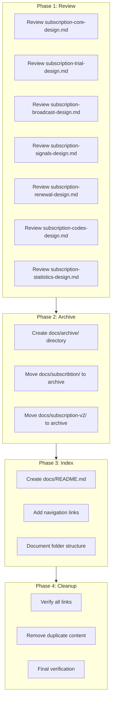
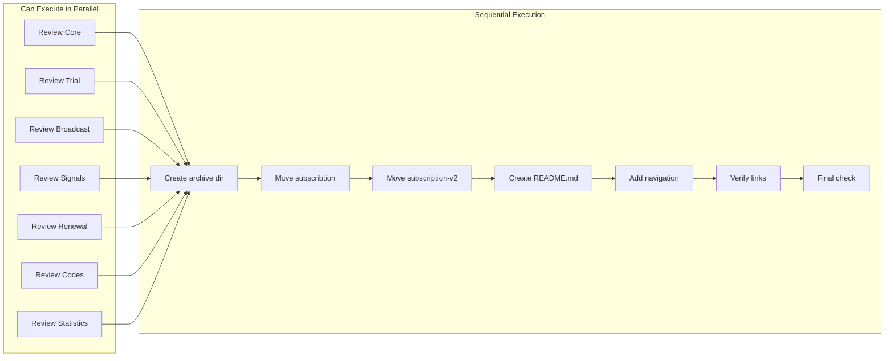

# Work Plan: Subscription Documentation Reorganization

Created Date: 2025-11-25
Type: documentation
Estimated Duration: 1 day
Estimated Impact: ~25 documentation files
Related Issue/PR: N/A

## Related Documents

- PRD Files (7 documents):
  - `docs/prd/subscription-core-prd.md`
  - `docs/prd/subscription-trial-prd.md`
  - `docs/prd/subscription-broadcast-prd.md`
  - `docs/prd/subscription-signals-prd.md`
  - `docs/prd/subscription-renewal-prd.md`
  - `docs/prd/subscription-codes-prd.md`
  - `docs/prd/subscription-statistics-prd.md`

- Design Doc Files (7 documents):
  - `docs/design/subscription-core-design.md`
  - `docs/design/subscription-trial-design.md`
  - `docs/design/subscription-broadcast-design.md`
  - `docs/design/subscription-signals-design.md`
  - `docs/design/subscription-renewal-design.md`
  - `docs/design/subscription-codes-design.md`
  - `docs/design/subscription-statistics-design.md`

- Old Documentation for Archiving:
  - `docs/subscribtion/` (9 files)
  - `docs/subscription-v2/` (7 files)

## Objective

Complete the subscription documentation reorganization by:
1. Conducting review of Design Docs for quality and consistency
2. Archiving old documentation while preserving access
3. Creating documentation index for easy navigation
4. Cleaning up obsolete/duplicate content

## Background

The subscription system documentation has evolved through multiple iterations:
- **v1 (docs/subscribtion/)**: Original broadcast feature documentation (typo in folder name preserved for backward compatibility tracking)
- **v2 (docs/subscription-v2/)**: Enhanced subscription system documentation
- **Current (docs/prd/ and docs/design/)**: Newly created PRD and Design Doc structure following project documentation standards

This work plan completes the migration to the new documentation structure.

## Phase Structure Diagram



## Task Dependency Diagram



## Risks and Countermeasures

### Technical Risks
- **Risk**: Broken links after moving documentation
  - **Impact**: Medium - Users cannot find referenced documentation
  - **Countermeasure**: Document all current links before moving, verify all links after reorganization

- **Risk**: Loss of valuable historical context from old docs
  - **Impact**: Low - Archive preserves all content
  - **Countermeasure**: Archive rather than delete, maintain clear archive structure

### Schedule Risks
- **Risk**: Review process takes longer than expected
  - **Impact**: Low - Documentation changes can be done incrementally
  - **Countermeasure**: Parallelize independent review tasks

## Implementation Phases

### Phase 1: Design Document Review (Estimated commits: 7)
**Purpose**: Ensure all Design Docs meet quality standards and are consistent

#### Tasks
- [ ] Task 1.1: Review `subscription-core-design.md` via document-reviewer
- [ ] Task 1.2: Review `subscription-trial-design.md` via document-reviewer
- [ ] Task 1.3: Review `subscription-broadcast-design.md` via document-reviewer
- [ ] Task 1.4: Review `subscription-signals-design.md` via document-reviewer
- [ ] Task 1.5: Review `subscription-renewal-design.md` via document-reviewer
- [ ] Task 1.6: Review `subscription-codes-design.md` via document-reviewer
- [ ] Task 1.7: Review `subscription-statistics-design.md` via document-reviewer

#### Phase Completion Criteria
- [ ] All 7 Design Docs reviewed
- [ ] Critical issues addressed in each document
- [ ] Documents are consistent in format and style

#### Operational Verification Procedures
1. Execute document-reviewer for each Design Doc
2. Record issues found and resolution status
3. Verify cross-references between PRD and Design Doc are valid

---

### Phase 2: Archive Old Documentation (Estimated commits: 2)
**Purpose**: Move legacy documentation to archive while preserving content

#### Tasks
- [ ] Task 2.1: Create `docs/archive/` directory
- [ ] Task 2.2: Move `docs/subscribtion/` to `docs/archive/subscribtion/`
- [ ] Task 2.3: Move `docs/subscription-v2/` to `docs/archive/subscription-v2/`
- [ ] Task 2.4: Add archive README explaining content and historical context

#### Files to Archive

**From docs/subscribtion/** (9 files):
| File | Content Description | Archive Note |
|------|---------------------|--------------|
| README.md | Broadcast feature overview | Superseded by subscription-broadcast-design.md |
| architecture.md | Technical architecture | Superseded by subscription-core-design.md |
| database-schema.md | DB schema documentation | Superseded by subscription-core-design.md |
| api-flows.md | Command flows | Reference for historical context |
| implementation-plan.md | Original implementation plan | Completed, historical reference |
| code-examples.md | Reference code patterns | May contain useful patterns |
| user-context-dto.md | DTO structure | Integrated into design docs |
| manager-notifications.md | Notification system | Integrated into design docs |
| rollout-plan.md | Deployment plan | Completed, historical reference |

**From docs/subscription-v2/** (7 files):
| File | Content Description | Archive Note |
|------|---------------------|--------------|
| README.md | v2 overview | Superseded by new PRD/Design docs |
| architecture-and-implementation.md | Service architecture | Partially superseded |
| database-schema.md | Schema changes | Integrated into design docs |
| user-guide.md | User flows | Partially integrated |
| telegram-api-reference.md | Telegram API reference | Useful reference, may keep |
| OPTIMIZATION-SUMMARY.md | Performance notes | Historical reference |
| migrations/20250131_create_statistics_view.sql | SQL migration | Keep for reference |

#### Phase Completion Criteria
- [ ] `docs/archive/` directory created
- [ ] All files from `docs/subscribtion/` moved to `docs/archive/subscribtion/`
- [ ] All files from `docs/subscription-v2/` moved to `docs/archive/subscription-v2/`
- [ ] Archive README created with context

#### Operational Verification Procedures
1. Verify all 16 files are in archive location
2. Verify original directories are empty or removed
3. Verify archive README explains content organization

---

### Phase 3: Create Documentation Index (Estimated commits: 1)
**Purpose**: Create central navigation point for subscription documentation

#### Tasks
- [ ] Task 3.1: Create `docs/README.md` with documentation structure overview
- [ ] Task 3.2: Add links to all PRD documents
- [ ] Task 3.3: Add links to all Design documents
- [ ] Task 3.4: Add reference to archive location
- [ ] Task 3.5: Document folder structure and conventions

#### Documentation Index Structure

```markdown
# Quantum Deal Documentation

## Subscription System Documentation

### PRD Documents (Product Requirements)
- [Core Infrastructure](prd/subscription-core-prd.md) - Base subscription system
- [Trial System](prd/subscription-trial-prd.md) - Free trial functionality
- [Broadcast](prd/subscription-broadcast-prd.md) - Manager broadcast feature
- [Signals](prd/subscription-signals-prd.md) - Trading signals delivery
- [Renewal](prd/subscription-renewal-prd.md) - Subscription renewal flow
- [Codes](prd/subscription-codes-prd.md) - Activation codes system
- [Statistics](prd/subscription-statistics-prd.md) - Usage statistics

### Design Documents (Technical Implementation)
- [Core Infrastructure](design/subscription-core-design.md)
- [Trial System](design/subscription-trial-design.md)
- [Broadcast](design/subscription-broadcast-design.md)
- [Signals](design/subscription-signals-design.md)
- [Renewal](design/subscription-renewal-design.md)
- [Codes](design/subscription-codes-design.md)
- [Statistics](design/subscription-statistics-design.md)

### Other Documentation
- [Feature Flags](feature-flags/) - Feature flag system
- [Bot Commands](bot-commands/) - Telegram bot commands
- [Renewal](renewal/) - Renewal system (legacy)

### Archive
- [Legacy Documentation](archive/) - Historical documentation
```

#### Phase Completion Criteria
- [ ] `docs/README.md` created
- [ ] All 7 PRD links verified working
- [ ] All 7 Design Doc links verified working
- [ ] Archive section documented

#### Operational Verification Procedures
1. Open README.md and click each link
2. Verify all links resolve correctly
3. Verify structure is intuitive and navigable

---

### Phase 4: Quality Assurance (Required) (Estimated commits: 1)
**Purpose**: Final verification and cleanup

#### Tasks
- [ ] Task 4.1: Verify all internal links in PRD documents
- [ ] Task 4.2: Verify all internal links in Design documents
- [ ] Task 4.3: Check for duplicate content between new docs and archive
- [ ] Task 4.4: Remove any temporary files
- [ ] Task 4.5: Update .gitignore if needed for archive
- [ ] Task 4.6: Final documentation structure review

#### Phase Completion Criteria
- [ ] All document links verified working
- [ ] No orphaned files in docs folder
- [ ] Documentation structure is clean and navigable
- [ ] Archive is properly organized

#### Operational Verification Procedures
1. Run link checker across all documentation
2. Review docs/ folder structure for cleanliness
3. Verify archive contains all historical content
4. Confirm new documentation is complete

---

## Completion Criteria

- [ ] All phases completed
- [ ] Each phase's operational verification procedures executed
- [ ] All 7 Design Docs reviewed via document-reviewer
- [ ] Old documentation archived (16 files)
- [ ] Documentation index created (docs/README.md)
- [ ] All links verified working
- [ ] User review approval obtained

## Progress Tracking

### Phase 1: Design Document Review
- Start: YYYY-MM-DD HH:MM
- Complete: YYYY-MM-DD HH:MM
- Notes:
  - subscription-core-design.md: [ ] Reviewed
  - subscription-trial-design.md: [ ] Reviewed
  - subscription-broadcast-design.md: [ ] Reviewed
  - subscription-signals-design.md: [ ] Reviewed
  - subscription-renewal-design.md: [ ] Reviewed
  - subscription-codes-design.md: [ ] Reviewed
  - subscription-statistics-design.md: [ ] Reviewed

### Phase 2: Archive Old Documentation
- Start: YYYY-MM-DD HH:MM
- Complete: YYYY-MM-DD HH:MM
- Notes: [Files moved count, any issues]

### Phase 3: Create Documentation Index
- Start: YYYY-MM-DD HH:MM
- Complete: YYYY-MM-DD HH:MM
- Notes: [Any special remarks]

### Phase 4: Quality Assurance
- Start: YYYY-MM-DD HH:MM
- Complete: YYYY-MM-DD HH:MM
- Notes: [Link verification results, cleanup actions]

## Notes

### Typo in Original Folder Name
The folder `docs/subscribtion/` contains a typo (should be `subscription`). This is preserved in the archive path `docs/archive/subscribtion/` for historical accuracy and to prevent confusion in version control history.

### Archive Access
Archived documentation remains accessible for:
- Historical reference
- Understanding system evolution
- Code archaeology when debugging legacy features

### Documentation Conventions
All new documentation follows the conventions defined in:
- `docs/rules/documentation-criteria.md`
- PRD template: `docs/prd/template.md`
- Design Doc template: `docs/design/template.md`

### Files to Potentially Keep Outside Archive
Consider keeping `docs/subscription-v2/telegram-api-reference.md` in main docs if frequently referenced, as it contains useful Telegram API documentation not fully integrated into Design Docs.
