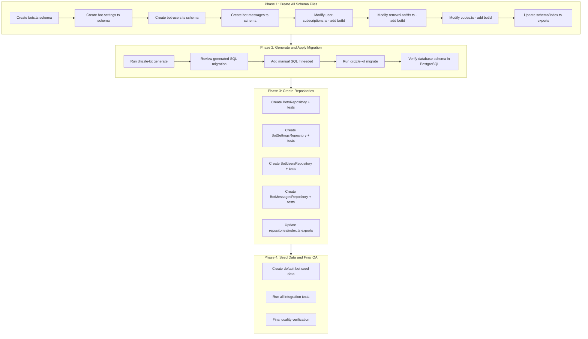
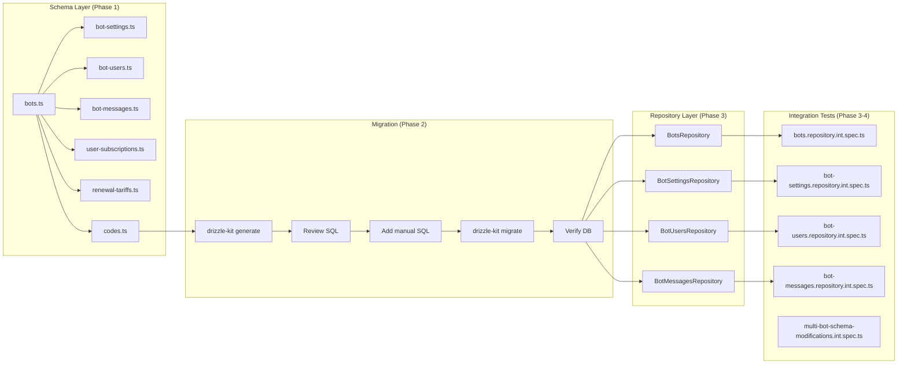

# Work Plan: Multi-Bot Database Schema (Phase 1)

## Document Information

| Attribute | Value |
|-----------|-------|
| **Feature** | Multi-Bot Database Schema |
| **Status** | In Progress |
| **Created** | 2025-11-26 |
| **Design Doc** | [multi-bot-database-schema.md](../design/multi-bot-database-schema.md) |
| **ADR Reference** | [ADR-004: Multi-Bot Database Architecture](../adr/ADR-004-multi-bot-architecture.md) |

---

## Scope Summary

### In Scope (Phase 1 - Database Schema)
- **New Tables**: bots, bot_settings, bot_users, bot_messages
- **Modified Tables**: user_subscriptions, renewal_tariffs, codes (add botId)
- **New Repositories**: BotsRepository, BotSettingsRepository, BotUsersRepository, BotMessagesRepository
- **Migration**: Drizzle workflow (schema first, then migration)

### Out of Scope (Phase 2 - Deferred)
- DynamicTelegrafModule
- Dynamic webhook routing
- Runtime bot loading
- Shared handlers architecture

---

## Phase Structure Diagram



---

## Task Dependency Diagram



---

## Key Implementation Notes

### Drizzle Workflow Requirements

**IMPORTANT**: Follow this exact order:
1. **ALL schema files must be created/modified BEFORE running `drizzle-kit generate`**
2. `drizzle-kit generate` creates migration based on diff between current schema and database
3. Review generated SQL - may need to manually add:
   - Partial unique index for `user_subscriptions` (FR-012) - Drizzle does not support this declaratively
   - Custom constraints if needed
4. Only AFTER migration is applied, create repositories

### Manual SQL Additions Required

The following must be added manually to the generated migration file:

```sql
-- FR-012: Partial unique index - prevents duplicate active subscriptions per user+subscription+bot
-- Drizzle cannot generate this automatically
CREATE UNIQUE INDEX uq_user_subscriptions_active
  ON user_subscriptions(user_id, subscription_id, bot_id)
  WHERE is_active = true;
```

---

## Phase 1: Create All Schema Files

**Objective**: Create all new Drizzle schema files and modify existing ones BEFORE migration
**Verification Level**: L3 (Build success, TypeScript compilation)

### Task 1.1: Create bots.ts schema
- [x] **Implementation**
  - [x] Create `libs/db/src/schema/bots.ts`
  - [x] Define bots pgTable with all columns per Design Doc Section 1.1
  - [x] Export Bot and NewBot types using $inferSelect/$inferInsert
  - [x] Verify TypeScript compiles without errors

**File**: `libs/db/src/schema/bots.ts`

**Acceptance Criteria** (from Design Doc AC-1):
- bots table created with all columns: id, token, name, username, webhookPath, isDynamic, isActive, createdAt, updatedAt
- name column has UNIQUE constraint
- id uses bigint with generatedAlwaysAsIdentity()

---

### Task 1.2: Create bot-settings.ts schema
- [x] **Implementation**
  - [x] Create `libs/db/src/schema/bot-settings.ts`
  - [x] Define BotSettings and PaymentSettings interfaces
  - [x] Define DEFAULT_BOT_SETTINGS constant
  - [x] Define botSettings pgTable with FK to bots
  - [x] Export types: BotSettingsRecord, NewBotSettingsRecord

**File**: `libs/db/src/schema/bot-settings.ts`

**Acceptance Criteria** (from Design Doc AC-1):
- bot_settings table created with FK to bots
- botId column has UNIQUE constraint (1:1 relationship)
- CASCADE delete configured
- JSONB column with correct default value

---

### Task 1.3: Create bot-users.ts schema
- [x] **Implementation**
  - [x] Create `libs/db/src/schema/bot-users.ts`
  - [x] Define BotUserPreferences and BotUserState interfaces
  - [x] Define botUsers pgTable with FKs to users and bots
  - [x] Add composite unique constraint on (userId, botId)
  - [x] Export types: BotUser, NewBotUser

**File**: `libs/db/src/schema/bot-users.ts`

**Acceptance Criteria** (from Design Doc AC-1):
- bot_users table created with unique constraint on (userId, botId)
- FKs reference users and bots tables with CASCADE
- JSONB columns for preferences and state

---

### Task 1.4: Create bot-messages.ts schema
- [x] **Implementation**
  - [x] Create `libs/db/src/schema/bot-messages.ts`
  - [x] Define botMessages pgTable with FK to bots
  - [x] Add composite unique constraint on (botId, type, lang)
  - [x] Export types: BotMessage, NewBotMessage

**File**: `libs/db/src/schema/bot-messages.ts`

**Acceptance Criteria** (from Design Doc AC-1):
- bot_messages table created with composite unique constraint
- FK references bots table with CASCADE

---

### Task 1.5: Modify user-subscriptions.ts - add botId column
- [x] **Implementation**
  - [x] Add import for bots schema
  - [x] Add botId column with nullable FK to bots.id
  - [x] Add CASCADE on delete
  - [x] Add index idx_user_subscriptions_bot
  - [x] Add composite index idx_user_subscriptions_user_bot
  - [x] Verify existing UserSubscription type includes new field

**File**: `libs/db/src/schema/user-subscriptions.ts`

**Acceptance Criteria** (from Design Doc AC-2):
- user_subscriptions.bot_id column added with FK constraint
- Column is nullable for backward compatibility
- Indexes created for bot-scoped queries

**Note**: Partial unique index (FR-012) will be added manually in Phase 2

---

### Task 1.6: Modify renewal-tariffs.ts - add botId column
- [x] **Implementation**
  - [x] Add import for bots schema
  - [x] Add botId column with nullable FK to bots.id
  - [x] Update unique constraint to include botId: (subscriptionId, periodDays, botId)
  - [x] Add index idx_renewal_tariffs_bot
  - [x] Verify existing RenewalTariff type includes new field

**File**: `libs/db/src/schema/renewal-tariffs.ts`

**Acceptance Criteria** (from Design Doc AC-2):
- renewal_tariffs.bot_id column added (nullable for global tariffs)
- Unique constraint updated to (subscriptionId, periodDays, botId)
- Index created for bot-specific tariff lookup

---

### Task 1.7: Modify codes.ts - add botId column
- [x] **Implementation**
  - [x] Add import for bots schema
  - [x] Add botId column with nullable FK to bots.id
  - [x] Add CASCADE on delete
  - [x] Add index idx_codes_bot
  - [x] Verify existing Code type includes new field

**File**: `libs/db/src/schema/codes.ts`

**Acceptance Criteria** (from Design Doc AC-2):
- codes.bot_id column added with FK constraint
- Column is nullable for backward compatibility
- Index created for bot-scoped code lookup

---

### Task 1.8: Update schema/index.ts exports
- [x] **Implementation**
  - [x] Add exports for bots, botSettings, botUsers, botMessages
  - [x] Add named table exports for Drizzle queries
  - [x] Verify all imports resolve correctly

**File**: `libs/db/src/schema/index.ts`

**Acceptance Criteria**:
- All new schemas exported and accessible via `import { bots, ... } from '@quantum-deal/db/schema'`

---

### Phase 1 Completion Criteria
- [x] All 4 new schema files created
- [x] All 3 existing schema files modified
- [x] TypeScript compilation succeeds (`pnpm build`)
- [ ] No lint errors (`pnpm lint`)
- [x] schema/index.ts exports all new tables
- [ ] **DO NOT run drizzle-kit yet** - proceed to Phase 2

**Test Resolution Progress**: Phase 1 = Schema foundation only (tests in Phase 3/4)

---

## Phase 2: Generate and Apply Migration

**Objective**: Generate Drizzle migration from schema diff and apply to database
**Verification Level**: L2 (Migration applies successfully)

### Task 2.1: Run drizzle-kit generate
- [x] **Implementation**
  - [x] Ensure all Phase 1 schema changes are complete
  - [x] Run `pnpm drizzle-kit generate` to create migration
  - [x] Verify migration file created in `libs/db/migrations/` directory

**Command**: `pnpm db:generate`

**Output**: Migration file `libs/db/migrations/20251126190521_young_falcon.sql`

---

### Task 2.2: Review generated SQL migration file
- [x] **Review Steps**
  - [x] Open generated migration file
  - [x] Verify CREATE TABLE statements for: bots, bot_settings, bot_users, bot_messages
  - [x] Verify ALTER TABLE statements for: user_subscriptions, renewal_tariffs, codes
  - [x] Verify all FK constraints are correct
  - [x] Verify all indexes are created
  - [x] Check unique constraints are properly defined

**Files**: `libs/db/migrations/20251126190521_young_falcon.sql`

**Review Results**:
- All 4 CREATE TABLE statements verified correct
- All 3 ALTER TABLE statements verified correct
- All 8 FK constraints verified with CASCADE delete
- All 4+ indexes created (idx_codes_bot, idx_renewal_tariffs_bot, idx_user_subscriptions_bot, idx_user_subscriptions_user_bot)
- All unique constraints properly defined (bots_name_unique, bot_settings_bot_id_unique, uq_bot_users_user_bot, uq_bot_messages_bot_type_lang, uq_renewal_tariff_subscription_period_bot)
- Partial unique index for FR-012 CONFIRMED MISSING (expected - must be added in Task 2.3)

---

### Task 2.3: Add manual SQL if needed
- [x] **Implementation**
  - [x] Add partial unique index for user_subscriptions (FR-012):
    ```sql
    CREATE UNIQUE INDEX uq_user_subscriptions_active
      ON user_subscriptions(user_id, subscription_id, bot_id)
      WHERE is_active = true;
    ```
  - [x] Add any other custom constraints Drizzle could not generate
  - [x] Add comments explaining manual additions

**Note**: Drizzle does not support partial indexes declaratively, so this MUST be added manually.

---

### Task 2.4: Run drizzle-kit migrate
- [x] **Implementation**
  - [x] Ensure database connection is configured
  - [x] Run `pnpm drizzle-kit migrate` to apply migration
  - [x] Verify migration completes without errors
  - [x] Check migration recorded in drizzle migrations table

**Command**: `pnpm db:migrate`

**Result**: Migration `20251126190521_young_falcon.sql` applied successfully. Recorded in `_journal.json` at index 20.

---

### Task 2.5: Verify database schema in PostgreSQL
- [x] **Verification Steps**
  - [x] Connect to database with psql or database client
  - [x] Verify new tables exist:
    ```sql
    SELECT table_name FROM information_schema.tables
    WHERE table_schema = 'public'
    AND table_name IN ('bots', 'bot_settings', 'bot_users', 'bot_messages');
    ```
  - [x] Verify columns added to existing tables:
    ```sql
    SELECT column_name FROM information_schema.columns
    WHERE table_name = 'user_subscriptions' AND column_name = 'bot_id';
    ```
  - [x] Verify FK constraints: `\d+ bot_settings`
  - [x] Verify indexes: `\di` in psql
  - [x] Verify partial unique index exists:
    ```sql
    SELECT indexname, indexdef FROM pg_indexes
    WHERE indexname = 'uq_user_subscriptions_active';
    ```

**Verification Results** (2025-11-26):
- All 4 new tables exist: bots, bot_settings, bot_users, bot_messages
- All 3 modified tables have bot_id column (nullable, bigint)
- All 6 FK constraints reference bots(id) with CASCADE delete
- All required indexes created: idx_codes_bot, idx_renewal_tariffs_bot, idx_user_subscriptions_bot, idx_user_subscriptions_user_bot
- Partial unique index uq_user_subscriptions_active verified with correct WHERE clause

---

### Phase 2 Completion Criteria
- [x] Migration file generated
- [x] Manual SQL additions made (partial unique index)
- [x] Migration applied to database
- [x] All new tables exist in database
- [x] All new columns exist in modified tables
- [x] All FK constraints properly configured
- [x] All indexes created including partial unique index

**Test Resolution Progress**: Phase 2 = Database ready for repository implementation

---

## Phase 3: Create Repositories

**Objective**: Implement repository classes for new tables with integration tests
**Verification Level**: L2 (Test operation) - Tests implemented alongside
**Prerequisite**: Phase 2 complete (migration applied)

### Task 3.1: Create BotsRepository with integration tests
- [x] **Implementation**
  - [x] Create `libs/db/src/repositories/bots.repository.ts`
  - [x] Extend BaseRepository with proper generics
  - [x] Implement findActiveDynamic() with settings JOIN
  - [x] Implement findByIdWithSettings() with LEFT JOIN
  - [x] Implement findByName(), findByUsername(), findByWebhookPath()
  - [x] Implement activate(), deactivate() methods
- [x] **Integration Test Implementation**
  - [x] Implement tests in `libs/db/src/repositories/__tests__/bots.repository.int.spec.ts`
  - [x] Test AC-1.1: Create bot with all required fields
  - [x] Test AC-1.2: Unique constraint violation on duplicate name
  - [x] Test AC-3.1: findActiveDynamic() returns correct results
  - [x] Test AC-3.2: findByIdWithSettings() JOIN operation
  - [x] Test AC-3.4: deactivate() soft delete behavior

**Files**:
- `libs/db/src/repositories/bots.repository.ts`
- `libs/db/src/repositories/__tests__/bots.repository.int.spec.ts`

**Acceptance Criteria** (from Design Doc AC-3):
- BotsRepository extends BaseRepository
- findActiveDynamic() returns active dynamic bots with settings
- findByIdWithSettings() returns joined data
- All integration tests pass

**Test Case Resolution**: 9/9 tests implemented

---

### Task 3.2: Create BotSettingsRepository with integration tests
- [x] **Implementation**
  - [x] Create `libs/db/src/repositories/bot-settings.repository.ts`
  - [x] Extend BaseRepository with proper generics
  - [x] Implement findByBotId()
  - [x] Implement upsert() for create-or-update
  - [x] Implement updateFeatureFlags() for partial JSONB updates
- [x] **Integration Test Implementation**
  - [x] Implement tests in `libs/db/src/repositories/__tests__/bot-settings.repository.int.spec.ts`
  - [x] Test AC-1.1: FK constraint enforcement
  - [x] Test AC-1.2: Unique botId constraint (1:1)
  - [x] Test AC-1.3: CASCADE delete behavior
  - [x] Test AC-3.1: findByBotId() returns correct settings
  - [x] Test AC-3.2: upsert() create and update behavior
  - [x] Test AC-3.3: updateFeatureFlags() partial merge
  - [x] Test JSONB default settings application
  - [x] Test JSONB serialization/deserialization

**Files**:
- `libs/db/src/repositories/bot-settings.repository.ts`
- `libs/db/src/repositories/__tests__/bot-settings.repository.int.spec.ts`

**Acceptance Criteria** (from Design Doc AC-3):
- BotSettingsRepository.upsert() works correctly
- updateFeatureFlags() merges partial updates
- All integration tests pass

**Test Case Resolution**: 11/11 tests implemented

---

### Task 3.3: Create BotUsersRepository with integration tests
- [x] **Implementation**
  - [x] Create `libs/db/src/repositories/bot-users.repository.ts`
  - [x] Extend BaseRepository with proper generics
  - [x] Implement findByUserAndBot()
  - [x] Implement findOrCreate() for user onboarding
  - [x] Implement findActiveUsersWithDetailsByBotId() with JOIN
  - [x] Implement resolveLanguage() with hierarchy fallback
  - [x] Implement updateLanguage(), updatePreferences(), updateState()
  - [x] Implement activate(), deactivate()
- [x] **Integration Test Implementation**
  - [x] Implement tests in `libs/db/src/repositories/__tests__/bot-users.repository.int.spec.ts`
  - [x] Test AC-1.1: Unique constraint on (userId, botId)
  - [x] Test AC-1.2: CASCADE delete behavior
  - [x] Test AC-3.1: findByUserAndBot() returns correct record
  - [x] Test AC-3.2: findOrCreate() behavior
  - [x] Test AC-3.3: findActiveUsersWithDetailsByBotId() JOIN
  - [x] Test AC-3.4: resolveLanguage() hierarchy

**Files**:
- `libs/db/src/repositories/bot-users.repository.ts`
- `libs/db/src/repositories/__tests__/bot-users.repository.int.spec.ts`

**Acceptance Criteria** (from Design Doc AC-3):
- BotUsersRepository.findOrCreate() works correctly
- resolveLanguage() returns correct hierarchy result
- All integration tests pass

**Test Case Resolution**: 22/22 tests implemented (including update methods and lifecycle tests)

---

### Task 3.4: Create BotMessagesRepository with integration tests
- [x] **Implementation**
  - [x] Create `libs/db/src/repositories/bot-messages.repository.ts`
  - [x] Extend BaseRepository with proper generics
  - [x] Implement findByBotTypeAndLang()
  - [x] Implement findAllByBotId(), findAllByType()
  - [x] Implement resolveMessage() with full hierarchy (bot override -> global -> English -> hardcoded)
  - [x] Implement upsert() for create-or-update
  - [x] Implement deleteOverride()
  - [x] Implement getHardcodedFallback() public method
- [x] **Integration Test Implementation**
  - [x] Implement tests in `libs/db/src/repositories/__tests__/bot-messages.repository.int.spec.ts`
  - [x] Test AC-1.1: Unique constraint on (botId, type, lang)
  - [x] Test AC-1.2: CASCADE delete behavior
  - [x] Test AC-3.1: resolveMessage() returns bot override
  - [x] Test AC-3.2: resolveMessage() falls back to global
  - [x] Test AC-3.3: resolveMessage() English fallback
  - [x] Test AC-3.4: resolveMessage() hardcoded fallback
  - [x] Test AC-3.5: upsert() behavior

**Files**:
- `libs/db/src/repositories/bot-messages.repository.ts`
- `libs/db/src/repositories/__tests__/bot-messages.repository.int.spec.ts`

**Acceptance Criteria** (from Design Doc AC-3):
- BotMessagesRepository.resolveMessage() follows hierarchy correctly
- All integration tests pass

**Test Case Resolution**: 14/14 tests implemented

---

### Task 3.5: Update repositories/index.ts exports
- [x] **Implementation**
  - [x] Add exports for all new repositories
  - [x] Verify all imports resolve correctly

**File**: `libs/db/src/repositories/index.ts`

**Acceptance Criteria**:
- All new repositories exported and accessible

---

### Phase 3 Completion Criteria
- [x] All 4 new repository files created
- [x] All 4 integration test files implemented
- [x] TypeScript compilation succeeds
- [x] All unit tests pass (`pnpm test`)
- [x] repositories/index.ts exports all new repositories

**Test Resolution Progress**: 56/56 tests implemented (9+11+22+14)

---

## Phase 4: Seed Data and Final QA

**Objective**: Create seed data and verify complete implementation
**Verification Level**: L1 (Functional operation) + L2 (All tests pass)

### Task 4.1: Create default bot seed data
- [ ] **Implementation**
  - [ ] Create seed script or migration for default bot
  - [ ] Insert default bot with name 'QuantumDealBot'
  - [ ] Create default bot_settings with DEFAULT_BOT_SETTINGS
  - [ ] Create bot_users entries for existing users
  - [ ] Update existing records with default botId

**Acceptance Criteria** (from Design Doc AC-4):
- Default bot created with correct settings
- All existing records can be associated with default bot

---

### Task 4.2: Run all integration tests
- [ ] **Implementation**
  - [ ] Implement tests in `libs/db/src/repositories/__tests__/multi-bot-schema-modifications.int.spec.ts`
  - [ ] Test AC-2.1: user_subscriptions with botId FK
  - [ ] Test AC-2.2: Nullable botId for backward compatibility
  - [ ] Test AC-2.3: Bot-scoped subscription queries
  - [ ] Test AC-2.4: Bot-specific and global tariffs
  - [ ] Test AC-2.5: Updated unique constraint
  - [ ] Test AC-2.6: Tariff resolution priority
  - [ ] Test AC-2.7: Codes with botId FK
  - [ ] Test AC-2.8: Bot-scoped code activation
  - [ ] Test AC-5.1: Backward compatibility for UserSubscriptionsRepository
  - [ ] Test AC-5.2: Existing code activation flow
  - [ ] Test AC-5.3: Unfiltered subscription queries
  - [ ] Test AC-4.1: CASCADE delete behavior
  - [ ] Test AC-4.2: Index usage verification

**File**: `libs/db/src/repositories/__tests__/multi-bot-schema-modifications.int.spec.ts`

**Test Case Resolution**: 13/13 tests implemented

---

### Task 4.3: Final quality verification
- [ ] **Verification Steps**
  - [ ] Run full test suite: `pnpm test`
  - [ ] Run type check: `pnpm typecheck`
  - [ ] Run lint: `pnpm lint`
  - [ ] Run build: `pnpm build`
  - [ ] Verify application starts without errors: `pnpm start:dev`
  - [ ] Verify existing bot functionality unchanged

**Acceptance Criteria** (from Design Doc AC-5):
- Existing code works without botId parameter
- Existing queries return expected results
- No breaking changes to existing API
- All tests pass (47 total: 34 + 13)

---

### Phase 4 Completion Criteria
- [ ] Default bot seed data created
- [ ] All integration tests pass (47/47)
- [ ] Application starts successfully
- [ ] Type check passes
- [ ] Lint passes
- [ ] Build succeeds

**Test Resolution Progress**: 47/47 tests resolved (all it.todo converted to implementations)

---

## E2E Verification Procedures

### Phase 1 Verification: Schema Files
```bash
# 1. Build and type check
pnpm build
pnpm typecheck

# 2. Verify schema exports
npx ts-node -e "import * as schema from './libs/db/src/schema'; console.log(Object.keys(schema))"
# Expected: includes bots, botSettings, botUsers, botMessages
```

### Phase 2 Verification: Migration Applied
```bash
# 1. Generate migration (after all schema changes)
pnpm drizzle-kit generate

# 2. Review migration file
# Open drizzle/migrations/XXXX_*.sql and verify

# 3. Apply migration
pnpm drizzle-kit migrate

# 4. Verify tables created
psql -c "SELECT table_name FROM information_schema.tables WHERE table_schema = 'public' AND table_name IN ('bots', 'bot_settings', 'bot_users', 'bot_messages');"

# 5. Verify partial unique index
psql -c "SELECT indexname, indexdef FROM pg_indexes WHERE indexname = 'uq_user_subscriptions_active';"
```

### Phase 3 Verification: Repository Operations
```bash
# 1. Run integration tests
pnpm test -- --testPathPattern="libs/db/src/repositories/__tests__"

# 2. Verify repository exports
npx ts-node -e "import * as repos from './libs/db/src/repositories'; console.log(Object.keys(repos))"
# Expected: includes BotsRepository, BotSettingsRepository, etc.
```

### Phase 4 Verification: Full Integration
```bash
# 1. Run full test suite
pnpm test

# 2. Run quality checks
pnpm typecheck
pnpm lint
pnpm build

# 3. Start application
pnpm start:dev
# Verify: Application starts without errors
```

---

## Risk Management

| Risk | Probability | Impact | Mitigation | Detection |
|------|-------------|--------|------------|-----------|
| Migration breaks existing data | Low | High | Nullable columns, review generated SQL | Integration tests for backward compatibility |
| Drizzle generates incorrect SQL | Medium | Medium | Manual review of migration file, add manual SQL | Diff review before apply |
| Partial index not supported | High | Medium | Manually add to migration file | Verify index exists after migration |
| FK constraint violations | Medium | Medium | Create bots table first in migration | Test insertion order |
| Type inference issues with JSONB | Medium | Low | Explicit $type<> annotations | TypeScript compilation |
| Repository pattern inconsistency | Low | Medium | Follow existing BaseRepository pattern | Code review against existing repos |
| Test database state conflicts | Medium | Low | Use test setup/teardown, isolated transactions | Test isolation in jest config |

---

## Summary

| Phase | Tasks | Test Cases | Status |
|-------|-------|------------|--------|
| Phase 1: Create All Schema Files | 8 | 0 (L3) | Pending |
| Phase 2: Generate and Apply Migration | 5 | 0 (L2) | Pending |
| Phase 3: Create Repositories | 5 | 34 | Pending |
| Phase 4: Seed Data and Final QA | 3 | 13 | Pending |
| **Total** | **21** | **47** | - |

### Key Milestones
1. **Schema Complete**: Phase 1 (8 tasks) - All schema files ready
2. **Migration Applied**: Phase 2 (5 tasks) - Database updated
3. **Repositories Complete**: Phase 3 (5 tasks, 34 tests)
4. **Production Ready**: Phase 4 (3 tasks, 13 tests) - All 47 tests pass

---

## Quality Checklist

- [x] Design Doc consistency verification
- [x] Phase composition based on Drizzle workflow
- [x] All requirements converted to tasks
- [x] Quality assurance exists in final phase (Phase 4)
- [x] E2E verification procedures placed at integration points
- [x] Drizzle-specific workflow documented
  - [x] Schema files created before migration
  - [x] Manual SQL additions documented (partial unique index)
  - [x] Migration review step included
  - [x] Database verification step included
- [x] Test design information reflected
  - [x] Setup tasks placed appropriately
  - [x] Risk level-based prioritization applied
  - [x] AC and test case traceability specified
  - [x] Quantitative test resolution progress indicators set for each phase

---

## Change History

| Date | Version | Changes |
|------|---------|---------|
| 2025-11-26 | 1.0.0 | Initial work plan creation |
| 2025-11-26 | 1.1.0 | Restructured phases for correct Drizzle workflow: schema first, then migration, then repositories |

### Version 1.1.0 Changes:
- **Phase 1**: Now includes ALL schema files (new + modified) - must complete before migration
- **Phase 2**: NEW - Generate and apply Drizzle migration with manual SQL additions
- **Phase 3**: Repositories moved here (after migration applied)
- **Phase 4**: Seed data and final QA
- Added documentation for manual SQL additions (partial unique index FR-012)
- Added migration review and verification steps

---

**Document Version**: 1.1.0
**Created**: 2025-11-26
**Last Updated**: 2025-11-26
