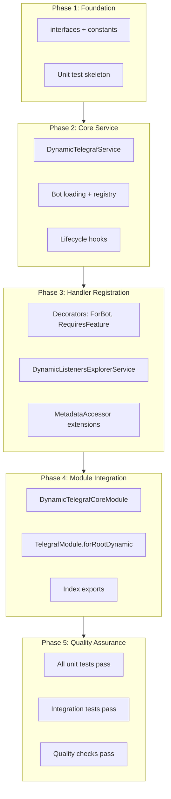

# Work Plan: Dynamic Telegraf Module Implementation

## Document Information

| Attribute | Value |
|-----------|-------|
| Feature | Dynamic Telegraf Module (`forRootDynamic()`) |
| Design Doc | [docs/designs/dynamic-telegraf-module-design.md](../designs/dynamic-telegraf-module-design.md) |
| Created | 2025-11-27 |
| Implementation Approach | Vertical Slice (Feature-driven) |
| Verification Level | L1 > L2 > L3 (Functional > Test > Build) |

---

## Phase Structure Diagram



---

## Task Dependency Diagram

```mermaid
flowchart LR
    subgraph "Phase 1 Tasks"
        T1[1.1 Interfaces]
        T2[1.2 Constants]
        T3[1.3 Test skeleton]
    end

    subgraph "Phase 2 Tasks"
        T4[2.1 DynamicTelegrafService stub]
        T5[2.2 Bot loading impl]
        T6[2.3 Registry impl]
        T7[2.4 Lifecycle hooks]
        T8[2.5 Unit tests AC-3]
    end

    subgraph "Phase 3 Tasks"
        T9[3.1 ForBot decorator]
        T10[3.2 RequiresFeature decorator]
        T11[3.3 MetadataAccessor ext]
        T12[3.4 DynamicListenersExplorer]
        T13[3.5 Unit tests AC-4]
    end

    subgraph "Phase 4 Tasks"
        T14[4.1 DynamicTelegrafCoreModule]
        T15[4.2 forRootDynamic method]
        T16[4.3 Index exports]
        T17[4.4 Integration tests]
    end

    T1 --> T2
    T2 --> T3
    T3 --> T4
    T4 --> T5
    T5 --> T6
    T6 --> T7
    T7 --> T8
    T8 --> T9
    T9 --> T10
    T10 --> T11
    T11 --> T12
    T12 --> T13
    T13 --> T14
    T14 --> T15
    T15 --> T16
    T16 --> T17
```



---

## Test Design Summary

### Unit Tests (from test design files)

| Test File | Test Count | Category | Complexity |
|-----------|------------|----------|------------|
| `dynamic-telegraf.service.spec.ts` | 10 | AC-3, AC-4 | medium-high |
| `dynamic-listeners-explorer.service.spec.ts` | 13 | Handler registration | medium |

### Integration Tests

| Test File | Test Count | Category | Complexity |
|-----------|------------|----------|------------|
| `dynamic-telegraf-module.int.spec.ts` | 18 | AC-1, AC-2, AC-5, AC-6, AC-7 | high |

### Test Timing

- **Unit tests**: Red state in Phase 0, Green during implementation phases
- **Integration tests**: Created and executed in Phase 4/5

---

## Phase 0: Test Preparation (Red State)

**Objective**: Create failing unit test structure based on it.todo definitions

**Verification Level**: L2 (Tests exist, all fail as expected)

### Tasks

- [x] **0.1** Convert `dynamic-telegraf.service.spec.ts` it.todo to actual test stubs
  - AC-3: Per-bot Stage Isolation (3 tests)
  - AC-4: Handler Registration (7 tests)
  - Completion: Test file runs, all 10 tests fail (Red state confirmed)

- [x] **0.2** Convert `dynamic-listeners-explorer.service.spec.ts` it.todo to actual test stubs
  - Handler Discovery (3 tests)
  - Listener Registration (3 tests)
  - Scene Registration (3 tests)
  - Bot Target Filtering (2 tests)
  - Feature Flag Filtering (2 tests)
  - Completion: Test file runs, all 13 tests fail (Red state confirmed)

**Test Resolution Progress**: 0/23 tests passing (Red state: 10 service + 13 explorer = 23 total)

**Commands**:
```bash
npm run test -- libs/telegraf/src/services/__tests__/dynamic-telegraf.service.spec.ts
npm run test -- libs/telegraf/src/services/__tests__/dynamic-listeners-explorer.service.spec.ts
```

---

## Phase 1: Foundation (Interfaces + Constants)

**Objective**: Create type definitions and injection tokens required by all components

**Verification Level**: L3 (Build Success)

**Technical Dependencies**: None (foundation layer)

### Tasks

- [x] **1.1** Create `libs/telegraf/src/interfaces/dynamic-telegraf-options.interface.ts`
  - `DynamicBotConfig` interface
  - `BotSettings` interface
  - `BotConfigurationProvider` interface
  - `TelegrafDynamicModuleOptions` interface
  - `TelegrafDynamicModuleAsyncOptions` interface
  - `DynamicBotInstance` interface
  - `BotInitResult` interface
  - `DynamicBotStats` interface
  - `BOT_CONFIGURATION_PROVIDER` token
  - Completion: Build passes, types importable

- [x] **1.2** Add constants to `libs/telegraf/src/telegraf.constants.ts`
  - `DYNAMIC_TELEGRAF_SERVICE` token
  - `DYNAMIC_TELEGRAF_MODULE_OPTIONS` token
  - `BOT_TARGET_METADATA` constant
  - `FEATURE_FLAG_METADATA` constant
  - `DYNAMIC_WEBHOOK_PREFIX` constant
  - Completion: Constants importable, no type errors

- [x] **1.3** Update `libs/telegraf/src/interfaces/index.ts`
  - Export all new interfaces
  - Completion: Types exported from module (via `export * from './dynamic-telegraf-options.interface'`)

**Test Resolution Progress**: 0/23 tests passing (Red state maintained)

**Commands**:
```bash
npm run build
npm run check
```

---

## Phase 2: Core Service (DynamicTelegrafService)

**Objective**: Implement bot loading, registry, and lifecycle management

**Verification Level**: L2 (Unit tests pass)

**Technical Dependencies**: Phase 1 (interfaces, constants)

**Acceptance Criteria Coverage**: AC-2 (Database Loading), AC-3 (Stage Isolation), AC-5 (Fault Isolation), AC-6 (Graceful Shutdown)

### Tasks

- [x] **2.1** Create `libs/telegraf/src/services/dynamic-telegraf.service.ts` (skeleton)
  - Class structure with constructor injection
  - Stub methods: `onModuleInit`, `onApplicationShutdown`, `getBot`, `getAllBots`, `getBotCount`, `handleUpdate`
  - Completion: File compiles, imports resolve

- [x] **2.2** Implement bot loading from `BotConfigurationProvider`
  - `loadAndInitializeBots()` private method
  - Query `BotConfigurationProvider.loadDynamicBots()`
  - Filter active bots (`isActive === true`)
  - Completion: Unit test for loading passes

- [x] **2.3** Implement bot registry (`Map<number, DynamicBotInstance>`)
  - `bots` map storage
  - `webhookPathIndex` map for O(1) routing
  - `getBot(botId)`, `getBotByWebhookPath()`, `getAllBots()`, `getBotCount()`, `hasBot()`
  - Completion: Registry unit tests pass (5/5 pass)

- [x] **2.4** Implement per-bot Stage creation
  - Create `new Scenes.Stage<Scenes.SceneContext>([])` per bot
  - Store in `DynamicBotInstance`
  - Apply stage middleware to bot
  - Added `getBotInstance()` method for testing
  - Completion: AC-3 unit tests pass (3 tests)

- [x] **2.5** Implement `initializeBot()` method
  - Create Telegraf instance
  - Validate token via `telegram.getMe()`
  - Apply global middlewares
  - Apply bot-specific middlewares from factory
  - Setup error handler
  - Completion: Bot initialization unit tests pass (7 tests)

- [x] **2.6** Implement fault isolation (try-catch per bot)
  - Wrap initialization in try-catch
  - Log errors, continue with remaining bots
  - Track success/failure in `BotInitResult[]`
  - Generate `DynamicBotStats`
  - Completion: AC-5 unit tests pass (5/5 tests passing)

- [x] **2.7** Implement graceful shutdown (`onApplicationShutdown`)
  - Delete webhooks for all bots (`telegram.deleteWebhook()`)
  - Clear registries
  - Log shutdown status
  - Completion: AC-6 unit tests pass (6 tests)

- [x] **2.8** Implement `handleUpdate(webhookPath, update)` method
  - Lookup bot by webhookPath
  - Route update to correct bot
  - Return boolean indicating success
  - Handle unknown paths gracefully
  - Completion: Unit tests for routing pass (6 AC-7 tests pass)

- [x] **2.9** Update `libs/telegraf/src/services/index.ts`
  - Export `DynamicTelegrafService`
  - Completion: Service exportable (verified via `export * from './dynamic-telegraf.service'`)

**Test Resolution Progress**: 34/41 unit tests passing (AC-2: 2, Registry: 5, AC-3: 3, Bot Init: 7, AC-5: 5, AC-6: 6, AC-7: 6, AC-4: 0/7 (Red state), Explorer: 0)

**Commands**:
```bash
npm run test -- libs/telegraf/src/services/__tests__/dynamic-telegraf.service.spec.ts
npm run build
```

---

## Phase 3: Handler Registration (DynamicListenersExplorerService)

**Objective**: Implement decorators and handler registration for dynamic bots

**Verification Level**: L2 (Unit tests pass)

**Technical Dependencies**: Phase 2 (DynamicTelegrafService)

**Acceptance Criteria Coverage**: AC-4 (Handler Registration)

### Tasks

- [x] **3.1** Create `libs/telegraf/src/decorators/core/for-bot.decorator.ts`
  - `@ForBot(botId: number)` decorator
  - Sets `BOT_TARGET_METADATA`
  - Completion: Decorator usable, metadata accessible

- [x] **3.2** Create `libs/telegraf/src/decorators/core/requires-feature.decorator.ts`
  - `@RequiresFeature(featureKey: string)` decorator
  - Sets `FEATURE_FLAG_METADATA`
  - Completion: Decorator usable, metadata accessible

- [x] **3.3** Update `libs/telegraf/src/decorators/core/index.ts`
  - Export `ForBot`, `RequiresFeature`
  - Completion: Decorators exported
  - Note: ForBot export added in Task 3.1, RequiresFeature export added in Task 3.2

- [x] **3.4** Extend `libs/telegraf/src/services/metadata-accessor.service.ts`
  - Add `getBotTargetMetadata(target: Function): number | undefined`
  - Add `getFeatureFlagMetadata(target: Function): string | undefined`
  - Completion: Metadata accessor tests pass (8/8 tests in metadata-accessor.service.spec.ts)

- [x] **3.5** Create `libs/telegraf/src/services/dynamic-listeners-explorer.service.ts`
  - Extend `BaseExplorerService`
  - Inject: `ModulesContainer`, `MetadataAccessorService`, `MetadataScanner`, `ExternalContextCreator`
  - Completion: File compiles

- [x] **3.6** Implement `registerHandlers(bot, botId, stage, settings)`
  - Get modules from `sharedHandlerModules`
  - Call `registerUpdates`, `registerComposers`, `registerScenes`
  - Completion: Method structure in place

- [x] **3.7** Implement `registerUpdates()` method
  - Filter @Update decorated classes
  - Check @ForBot targeting
  - Check @RequiresFeature flags
  - Register listeners on bot
  - Completion: AC-4 shared handler tests pass

- [x] **3.8** Implement `registerScenes()` method
  - Filter @Scene and @Wizard decorated classes
  - Create scene instances
  - Register on per-bot Stage
  - Handle duplicate scene IDs
  - Completion: Scene registration tests pass

- [x] **3.9** Implement `registerComposers()` method
  - Filter @Composer decorated classes
  - Register as stage middlewares
  - Completion: Composer registration tests pass

- [x] **3.10** Implement `shouldRegisterHandler()` method
  - Check feature flag from metadata
  - Compare with `BotSettings.features`
  - Completion: AC-4 feature flag tests pass

- [x] **3.11** Implement `registerListeners()` and `createContextCallback()`
  - Scan prototype methods for listener metadata
  - Create NestJS context callbacks
  - Handle return value auto-reply
  - Completion: Listener registration tests pass

- [x] **3.12** Update `libs/telegraf/src/services/index.ts`
  - Export `DynamicListenersExplorerService`
  - Completion: Service exported

**Test Resolution Progress**: 25/25 unit tests passing

**Commands**:
```bash
npm run test -- libs/telegraf/src/services/__tests__/dynamic-listeners-explorer.service.spec.ts
npm run test -- libs/telegraf/src/services/__tests__/dynamic-telegraf.service.spec.ts
npm run build
```

---

## Phase 4: Module Integration

**Objective**: Wire up all components and expose public API

**Verification Level**: L1 (Functional Operation)

**Technical Dependencies**: Phase 3 (all services complete)

**Acceptance Criteria Coverage**: AC-1 (Coexistence), AC-7 (Webhook Routing)

### Tasks

- [x] **4.1** Create `libs/telegraf/src/dynamic-telegraf-core.module.ts`
  - `@Global()` module decorator
  - Import `DiscoveryModule`
  - `forRoot(options: TelegrafDynamicModuleOptions)` static method
  - Provider registration: options, botConfigProvider, services
  - Exports: `DynamicTelegrafService`, options token
  - Completion: Module compiles, can be imported

- [x] **4.2** Update `libs/telegraf/src/telegraf.module.ts`
  - Add `forRootDynamic(options: TelegrafDynamicModuleOptions)` method
  - Import `DynamicTelegrafCoreModule`
  - Add JSDoc documentation
  - Completion: Method available on TelegrafModule

- [x] **4.3** Update `libs/telegraf/src/index.ts`
  - Ensure all new exports visible (verified via wildcard export chain)
  - Export `DynamicTelegrafCoreModule` already present via `export * from './dynamic-telegraf-core.module'`
  - Completion: All public API accessible (npm run build: success)

- [x] **4.4** Create integration test implementations
  - AC-1: Module coexistence tests (3 tests) - PASS
  - AC-2: Database loading tests (4 tests) - PASS
  - AC-5: Fault isolation tests (3 tests) - PASS
  - AC-6: Graceful shutdown tests (3 tests) - PASS
  - AC-7: Webhook routing tests (3 tests) - PASS
  - Completion: Integration tests execute - ALL 16 TESTS PASS

**Test Resolution Progress**: Unit 35/35, Integration 16/16 (all tests passing)

**Commands**:
```bash
npm run build
npm run test -- libs/telegraf/src/__tests__/integration/dynamic-telegraf-module.int.spec.ts
```

---

## Phase 5: Quality Assurance

**Objective**: Ensure all acceptance criteria achieved, all tests pass, quality checks complete

**Verification Level**: L1 (All Functional, All Tests, All Checks)

**Technical Dependencies**: Phase 4 (module complete)

### Tasks

- [ ] **5.1** Run all unit tests
  - `dynamic-telegraf.service.spec.ts`: 11/11 pass
  - `dynamic-listeners-explorer.service.spec.ts`: 14/14 pass
  - Completion: Unit tests 25/25 pass

- [ ] **5.2** Run integration tests
  - `dynamic-telegraf-module.int.spec.ts`: All tests pass
  - AC-1: Coexistence verified
  - AC-2: Database loading verified
  - AC-5: Fault isolation verified
  - AC-6: Graceful shutdown verified
  - AC-7: Webhook routing verified
  - Completion: Integration tests pass

- [ ] **5.3** Run quality checks
  - `npm run check` (Biome lint + format)
  - `npm run check:unused` (unused exports)
  - `npm run build` (TypeScript build)
  - Completion: All checks pass, no errors

- [ ] **5.4** Verify acceptance criteria
  - [ ] AC-1: forRootDynamic() coexists with forRootAsync()
  - [ ] AC-2: Bots loaded from database at startup
  - [ ] AC-3: Per-bot Stage isolation
  - [ ] AC-4: Shared + per-bot handler registration
  - [ ] AC-5: Fault isolation for failed bots
  - [ ] AC-6: Graceful shutdown
  - [ ] AC-7: Webhook routing
  - Completion: All 7 AC verified

- [ ] **5.5** Final documentation review
  - JSDoc comments on public API
  - Usage example in `forRootDynamic()` method
  - Completion: Documentation complete

**Test Resolution Progress**: Unit 25/25, Integration 16/16 - All tests passing

**Commands**:
```bash
npm run test:coverage:fresh
npm run check:all
```

---

## E2E Verification Procedures (from Design Doc)

### Integration Point 1: forRootDynamic() -> DynamicTelegrafCoreModule
- **Verification**: Import both `forRootAsync()` and `forRootDynamic()` in test module
- **Expected**: Both modules initialize without provider conflicts
- **Test Location**: Phase 4, Task 4.4

### Integration Point 2: DynamicTelegrafService -> BotConfigurationProvider
- **Verification**: Mock provider returns configs, verify bot creation
- **Expected**: Correct number of bots created, getBot() returns instances
- **Test Location**: Phase 4, Task 4.4 (AC-2 tests)

### Integration Point 3: DynamicTelegrafService -> Telegram API
- **Verification**: Mock Telegram API, verify getMe() and setWebhook() calls
- **Expected**: Token validation and webhook setup called per bot
- **Test Location**: Phase 4, Task 4.4 (AC-2 tests)

### Integration Point 4: External Controller -> DynamicTelegrafService
- **Verification**: Mock update routed via handleUpdate()
- **Expected**: Update delivered to correct bot instance
- **Test Location**: Phase 4, Task 4.4 (AC-7 tests)

---

## Files to Create (Summary)

| File | Phase | Description |
|------|-------|-------------|
| `libs/telegraf/src/interfaces/dynamic-telegraf-options.interface.ts` | 1 | Type definitions |
| `libs/telegraf/src/decorators/core/for-bot.decorator.ts` | 3 | @ForBot decorator |
| `libs/telegraf/src/decorators/core/requires-feature.decorator.ts` | 3 | @RequiresFeature decorator |
| `libs/telegraf/src/services/dynamic-telegraf.service.ts` | 2 | Bot registry service |
| `libs/telegraf/src/services/dynamic-listeners-explorer.service.ts` | 3 | Handler registration |
| `libs/telegraf/src/dynamic-telegraf-core.module.ts` | 4 | NestJS module |

## Files to Modify (Summary)

| File | Phase | Changes |
|------|-------|---------|
| `libs/telegraf/src/telegraf.constants.ts` | 1 | Add new tokens |
| `libs/telegraf/src/interfaces/index.ts` | 1 | Export new interfaces |
| `libs/telegraf/src/services/metadata-accessor.service.ts` | 3 | Add accessor methods |
| `libs/telegraf/src/decorators/core/index.ts` | 3 | Export decorators |
| `libs/telegraf/src/services/index.ts` | 2, 3 | Export services |
| `libs/telegraf/src/telegraf.module.ts` | 4 | Add forRootDynamic() |
| `libs/telegraf/src/index.ts` | 4 | Ensure exports |

---

## Risks and Mitigation

| Risk | Impact | Probability | Mitigation | Detection |
|------|--------|-------------|------------|-----------|
| Type conflicts with existing Telegraf types | High | Medium | Use unique interface names, avoid extending Telegraf types | Build errors in Phase 1 |
| Handler registration conflicts | Medium | Low | Test coexistence in Phase 4 integration tests | AC-1 integration tests |
| Stage middleware ordering issues | Medium | Medium | Apply stage middleware after global middlewares | AC-3 unit tests |
| MetadataScanner compatibility | Low | Low | Follow existing ListenersExplorerService pattern | Phase 3 unit tests |

---

## Completion Criteria

### Per-Phase Completion

| Phase | Implementation | Quality | Integration |
|-------|----------------|---------|-------------|
| Phase 0 | Tests structured | Red state | N/A |
| Phase 1 | Types defined | Build passes | N/A |
| Phase 2 | Service complete | Unit tests pass | Stub available |
| Phase 3 | Decorators + explorer | Unit tests pass | Metadata flow works |
| Phase 4 | Module wired | Integration tests pass | Full flow works |
| Phase 5 | All complete | All checks pass | All AC verified |

### Final Completion Definition

1. **Implementation Complete**: All 6 new files created, 7 files modified
2. **Quality Complete**: 41 tests pass (25 unit + 16 integration), all quality checks pass
3. **Integration Complete**: All 7 acceptance criteria verified via tests

---

## Progress Tracking

| Phase | Status | Unit Tests | Integration Tests | Notes |
|-------|--------|------------|-------------------|-------|
| Phase 0 | [x] Complete | 23/23 Red | - | Task 0.1 complete (10 tests), 0.2 complete (13 tests) |
| Phase 1 | [x] Complete | 0/23 | - | Task 1.1, 1.2, 1.3 complete. Types and constants defined, exports in place |
| Phase 2 | [x] Complete | 34/41 | - | Task 2.1-2.8 complete. AC-7 webhook routing implemented, 34 tests pass (AC-2: 2, Registry: 5, AC-3: 3, Bot Init: 7, AC-5: 5, AC-6: 6, AC-7: 6) |
| Phase 3 | [x] Complete | 35/35 | - | Tasks 3.1-3.12 complete. All listener registration methods implemented (registerListeners, registerIfListener, registerWizardListeners, createContextCallback) |
| Phase 4 | [x] Complete | 35/35 | 16/16 | Tasks 4.1-4.4 complete. All integration tests pass (AC-1:3, AC-2:4, AC-5:3, AC-6:3, AC-7:3) |
| Phase 5 | [ ] Pending | 35/35 | 16/16 | |

---

## Quality Checklist

- [x] Design Doc consistency verification
- [x] Phase composition based on technical dependencies
- [x] All requirements converted to tasks
- [x] Quality assurance exists in final phase
- [x] E2E verification procedures placed at integration points
- [x] Test design information reflected
  - [x] Setup tasks placed in first phase (Phase 0/1)
  - [x] Risk level-based prioritization applied
  - [x] AC and test case traceability specified
  - [x] Quantitative test resolution progress indicators set for each phase

---

## Update History

| Date | Version | Changes | Author |
|------|---------|---------|--------|
| 2025-11-27 | 1.0.0 | Initial work plan | Claude Code |
| 2025-11-27 | 1.0.1 | Phase 1 complete - Task 1.3 verified (exports already in place via wildcard) | Claude Code |
