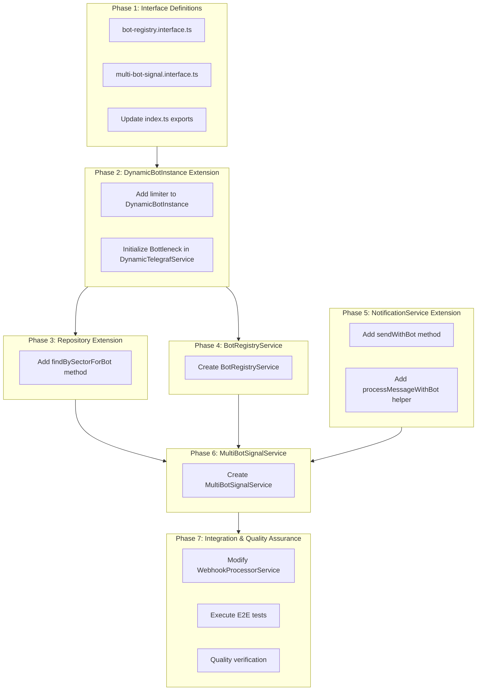
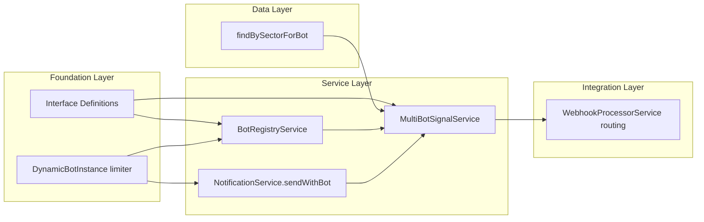

# Work Plan: Multi-Bot Signal Broadcasting

## Overview

| Attribute | Value |
|-----------|-------|
| **Feature** | Multi-Bot Signal Broadcasting |
| **Creation Date** | 2025-12-01 |
| **Status** | Planned |
| **Estimated Phases** | 7 |
| **Design Doc** | `docs/design/multi-bot-signal-broadcasting-design.md` |
| **ADR** | `docs/adr/ADR-007-multi-bot-signal-broadcasting.md` |
| **PRD** | `docs/prd/signal-broadcasting-prd.md` |

## Prerequisite ADRs

- **ADR-007**: Multi-bot signal broadcasting architecture (Per-bot Bottleneck, MultiBotSignalService orchestrator, BotRegistryService facade)
- **ADR-004**: Multi-bot database architecture
- **ADR-006**: Dynamic Telegraf module loading pattern

## Implementation Approach

**Selected**: Vertical Slice (Feature-driven)

**Rationale**:
- Multi-bot broadcasting is a complete feature with clear user value
- Minimal external dependencies outside the signal delivery path
- Can be verified end-to-end at each integration point
- Static bot continues working during development (backward compatible)

## Phase Structure Diagram

## Task Dependency Diagram

---

## Phase 1: Interface Definitions

**Objective**: Define type interfaces for multi-bot signal broadcasting
**Verification Level**: L3 (Build success)
**Technical Dependencies**: None

### Tasks

- [ ] **Task 1.1**: Create `libs/bot/src/interfaces/bot-registry.interface.ts`
  - Define `SignalCapableBot` interface (botId, name, instance, limiter, type, settings)
  - Define `BotRegistry` interface (getSignalCapableBots, getBot, hasBot)
  - **Completion Criteria**: Type exports compile, AC correspondence documented
  - **AC Support**: AC-008 (static bot inclusion), AC-001 (signal-capable bot access)

- [ ] **Task 1.2**: Create `libs/bot/src/interfaces/multi-bot-signal.interface.ts`
  - Define `BotDeliveryResult` interface (per-bot delivery stats)
  - Define `BroadcastResult` interface (aggregated multi-bot results)
  - Define `MultiBotSignal` interface (broadcastSignal, getEligibleBotCount)
  - **Completion Criteria**: Type exports compile, async failure semantics documented
  - **AC Support**: AC-007 (per-bot success/failure counts)

- [ ] **Task 1.3**: Update `libs/bot/src/interfaces/index.ts`
  - Add exports for `bot-registry.interface`
  - Add exports for `multi-bot-signal.interface`
  - **Completion Criteria**: Module exports resolve correctly

### Phase 1 Verification Criteria

- [ ] `npm run build` succeeds
- [ ] Interface types are importable from `@quantumdeal/bot/interfaces`
- [ ] No type errors in dependent modules

---

## Phase 2: DynamicBotInstance Extension

**Objective**: Add per-bot rate limiting to dynamic bot instances
**Verification Level**: L2 (Unit tests pass)
**Technical Dependencies**: Phase 1

### Tasks

- [ ] **Task 2.1**: Modify `libs/telegraf/src/interfaces/dynamic-telegraf-options.interface.ts`
  - Import `Bottleneck` type
  - Add `limiter: Bottleneck` field to `DynamicBotInstance` interface
  - **Completion Criteria**: Interface compiles, type documentation added
  - **AC Support**: AC-005 (per-bot Bottleneck limiter)

- [ ] **Task 2.2**: Modify `libs/telegraf/src/services/dynamic-telegraf.service.ts`
  - Add `bottleneckConfig` property with rate limiting configuration
  - Create Bottleneck instance in `initializeBot()` method
  - Setup limiter error handlers
  - Add limiter to `DynamicBotInstance` creation
  - Add `limiter.stop()` call in `stopBot()` method
  - **Completion Criteria**: Limiter created for each bot, graceful shutdown implemented
  - **AC Support**: AC-005 (per-bot rate limiter initialization)

### Phase 2 Integration Test Points

- [ ] Integration test: `AC-005: DynamicTelegrafService creates per-bot Bottleneck limiter during bot initialization`
- [ ] Integration test: `AC-005: Bot limiter.stop() called during bot shutdown`

### Phase 2 Verification Criteria

- [ ] Build succeeds with interface changes
- [ ] Unit tests for DynamicTelegrafService pass
- [ ] Limiter configuration matches Design Doc (28 msg/sec reservoir pattern)

---

## Phase 3: Repository Extension

**Objective**: Add bot-scoped subscription query method
**Verification Level**: L2 (Unit tests pass)
**Technical Dependencies**: Phase 1

### Tasks

- [x] **Task 3.1**: Add `findBySectorForBot()` to `libs/db/src/repositories/subscriptions.repository.ts`
  - Implement query with `botId` filter (null for static bot uses IS NULL)
  - Include `hasCustomFiltering` flag via subquery
  - Respect isActive and expiresAt filters
  - Support wildcard sector matching
  - **Completion Criteria**: Query returns only users for specified botId
  - **AC Support**: AC-003 (botId=null returns static bot users), AC-004 (botId=N returns specific bot users)

### Phase 3 Integration Test Points

- [x] Integration test: `AC-003: findBySectorForBot(sector, null) returns ONLY users with botId IS NULL`
- [x] Integration test: `AC-004: findBySectorForBot(sector, 5) returns ONLY users with botId = 5`
- [x] Integration test: `AC-003/004: findBySectorForBot excludes inactive and expired subscriptions`

### Phase 3 Verification Criteria

- [x] Unit tests for findBySectorForBot pass
- [x] Query correctly handles `botId=null` with IS NULL condition
- [x] Existing `findBySector()` method unchanged (backward compatibility)

---

## Phase 4: BotRegistryService

**Objective**: Create unified facade for static and dynamic bot access
**Verification Level**: L2 (Unit tests pass)
**Technical Dependencies**: Phase 1, Phase 2

### Tasks

- [x] **Task 4.1**: Create `libs/bot/src/services/bot-registry.service.ts`
  - Inject static bot via `@InjectBot('QuantumDealBot')`
  - Inject `DynamicTelegrafService`
  - Create static bot Bottleneck limiter in `onModuleInit()`
  - Implement `getSignalCapableBots()` combining static + dynamic bots
  - Implement `getBot(botId)` method
  - Implement `hasBot(botId)` method
  - Implement `setStaticBotSignalsEnabled()` for configuration
  - Setup limiter error handlers
  - **Completion Criteria**: Service returns unified bot list, filters by signalsEnabled
  - **AC Support**: AC-008 (static bot inclusion), AC-001 (all signal-capable bots)

- [x] **Task 4.2**: Register BotRegistryService in bot module
  - Add to providers array
  - Add to exports if needed by other modules
  - **Completion Criteria**: Service injectable in dependent services

### Phase 4 Integration Test Points

- [x] Integration test: `AC-008: getSignalCapableBots() includes static QuantumDealBot with botId=null`
- [x] Integration test: `AC-001: getSignalCapableBots() excludes dynamic bots with signalsEnabled=false`
- [x] Integration test: `AC-005: Each SignalCapableBot has its own Bottleneck limiter instance`
- [x] Integration test: `AC-005: BotRegistryService maintains separate Bottleneck limiter for static bot`

### Phase 4 Verification Criteria

- [x] Service initializes without errors
- [x] Returns both static and dynamic bots
- [x] Filters bots by `signalsEnabled` setting
- [x] Each bot has unique limiter instance

---

## Phase 5: NotificationService Extension

**Objective**: Add bot-parameterized message sending capability
**Verification Level**: L2 (Unit tests pass)
**Technical Dependencies**: Phase 2

### Tasks

- [x] **Task 5.1**: Modify `libs/bot/src/services/notification.service.ts`
  - Add `TelegrafInstance` type alias for both UserContext and Context
  - Implement `sendWithBot(bot, limiter, userId, message, options)` method
  - Implement `processMessageWithBot(bot, message)` private method
  - Implement `sendTelegramMessageWithBot(bot, message)` private method
  - Maintain message stats tracking
  - Add Sentry error capture
  - **Completion Criteria**: Messages sent via provided bot instance with provided limiter
  - **AC Support**: AC-009 (sendWithBot uses provided bot and limiter)

### Phase 5 Integration Test Points

- [x] Integration test: `AC-009: sendWithBot() schedules message with provided limiter and sends via provided bot instance`
- [x] Integration test: `AC-009: sendWithBot() returns unique message ID string for tracking`
- [x] Integration test: `AC-009: sendWithBot() logs to Sentry and updates stats on send failure`

### Phase 5 Verification Criteria

- [x] Method accepts both static (UserContext) and dynamic (Context) bot instances
- [x] Uses provided limiter, not internal limiter
- [x] Existing `addMessage()` method unchanged (backward compatibility)
- [x] Message stats correctly updated

---

## Phase 6: MultiBotSignalService

**Objective**: Create signal orchestration service
**Verification Level**: L1 (Integration tests pass)
**Technical Dependencies**: Phase 3, Phase 4, Phase 5

### Tasks

- [x] **Task 6.1**: Create `libs/bot/src/services/multi-bot-signal.service.ts`
  - Inject BotRegistryService, SubscriptionsRepository, BotMessagesRepository, NotificationService, UserSubscriptionFeaturesRepository
  - Implement `broadcastSignal(order, eventType)` orchestration method
  - Implement `getEligibleBotCount()` method
  - Implement `deliverToBot()` private method with fault isolation
  - Implement `applyCustomFiltering()` for per-user symbol filtering
  - Implement `shouldSendSignal()` based on user features
  - Implement placeholder creation and replacement helpers
  - Implement result aggregation helpers
  - **Completion Criteria**: Parallel delivery to all bots with per-bot stats
  - **AC Support**: AC-001 (broadcast to all bots), AC-002 (parallel processing), AC-006 (fault isolation), AC-007 (per-bot stats)
  - **Status**: Completed with 17/17 unit tests passing

- [ ] **Task 6.2**: Register MultiBotSignalService in bot module
  - Add to providers array
  - Add to exports
  - **Completion Criteria**: Service injectable in WebhookProcessorService

- [ ] **Task 6.3**: Update `libs/bot/src/index.ts` exports
  - Export MultiBotSignalService
  - Export BotRegistryService
  - **Completion Criteria**: Services importable from `@quantumdeal/bot`

### Phase 6 Integration Test Points

- [ ] Integration test: `AC-001: broadcastSignal() delivers signal to ALL bots with signalsEnabled=true`
- [ ] Integration test: `AC-002: broadcastSignal() processes all bots in parallel via Promise.all`
- [ ] Integration test: `AC-006: broadcastSignal() continues to other bots when one bot delivery fails`
- [ ] Integration test: `AC-007: broadcastSignal() returns BroadcastResult with perBotResults`
- [ ] Integration test: `AC-001: broadcastSignal() returns empty BroadcastResult when no signal-capable bots`
- [ ] Integration test: `AC-001: broadcastSignal() returns empty result when order has no sector`

### Phase 6 Verification Criteria

- [ ] Integration tests in `multi-bot-signal.int.spec.ts` pass
- [ ] Parallel processing verified (timing measurement)
- [ ] Fault isolation verified (one bot failure doesn't block others)
- [ ] BroadcastResult contains accurate per-bot statistics

---

## Phase 7: WebhookProcessorService Integration & Quality Assurance

**Objective**: Route signals through MultiBotSignalService and verify full system
**Verification Level**: L1 (E2E tests pass)
**Technical Dependencies**: Phase 6

### Tasks

- [x] **Task 7.1**: Modify `libs/bot/src/services/webhook.service.ts`
  - Inject MultiBotSignalService
  - Modify `sendOrderNotifications()` to route through `multiBotSignalService.broadcastSignal()`
  - Convert `BroadcastResult` to `NotificationResult` for backward compatibility
  - Add logging for multi-bot notification results
  - **Completion Criteria**: Signal events flow through MultiBotSignalService
  - **AC Support**: All ACs (full integration)

- [ ] **Task 7.2**: Execute E2E tests
  - Run `multi-bot-signal.e2e.spec.ts`
  - Verify complete signal flow from webhook to Telegram
  - **Completion Criteria**: All E2E tests pass

- [ ] **Task 7.3**: Quality verification
  - Run full test suite: `npm run test`
  - Run build: `npm run build`
  - Run lint: `npm run lint`
  - Verify no type errors
  - **Completion Criteria**: All quality checks pass

### Phase 7 E2E Test Points

- [ ] E2E test: `MT5 signal event broadcasts to all signal-capable bots and delivers to respective subscribers`
- [ ] E2E test: `User subscribed to multiple bots receives separate signal messages from each bot`
- [ ] E2E test: `AC-010: broadcastSignal() completes within 5-second SLA`
- [ ] E2E test: `AC-002: Parallel processing achieves > 80% efficiency`
- [ ] E2E test: `AC-006: Signal delivery to healthy bots succeeds when one bot fails`

### Phase 7 Verification Criteria

- [ ] All integration tests pass (16 tests in `multi-bot-signal.int.spec.ts`)
- [ ] All E2E tests pass (5 tests in `multi-bot-signal.e2e.spec.ts`)
- [ ] `npm run build` succeeds
- [ ] `npm run lint` succeeds
- [ ] `npm run test` succeeds
- [ ] Signal delivery completes within 5-second SLA

---

## Summary Metrics

| Phase | Files Created | Files Modified | Integration Tests | E2E Tests |
|-------|---------------|----------------|-------------------|-----------|
| Phase 1 | 2 | 1 | 0 | 0 |
| Phase 2 | 0 | 2 | 2 | 0 |
| Phase 3 | 0 | 1 | 3 | 0 |
| Phase 4 | 1 | 1 | 4 | 0 |
| Phase 5 | 0 | 1 | 3 | 0 |
| Phase 6 | 1 | 2 | 6 | 0 |
| Phase 7 | 0 | 1 | 0 | 5 |
| **Total** | **4** | **9** | **18** | **5** |

## Files Summary

### New Files (4)

| File | Phase | Description |
|------|-------|-------------|
| `libs/bot/src/interfaces/bot-registry.interface.ts` | 1 | SignalCapableBot and BotRegistry interfaces |
| `libs/bot/src/interfaces/multi-bot-signal.interface.ts` | 1 | BotDeliveryResult, BroadcastResult, MultiBotSignal interfaces |
| `libs/bot/src/services/bot-registry.service.ts` | 4 | Unified facade for static + dynamic bots |
| `libs/bot/src/services/multi-bot-signal.service.ts` | 6 | Signal orchestration service |

### Modified Files (9)

| File | Phase | Changes |
|------|-------|---------|
| `libs/bot/src/interfaces/index.ts` | 1 | Add interface exports |
| `libs/telegraf/src/interfaces/dynamic-telegraf-options.interface.ts` | 2 | Add limiter field |
| `libs/telegraf/src/services/dynamic-telegraf.service.ts` | 2 | Initialize Bottleneck per bot |
| `libs/db/src/repositories/subscriptions.repository.ts` | 3 | Add findBySectorForBot() |
| `libs/bot/src/services/notification.service.ts` | 5 | Add sendWithBot() method |
| `libs/bot/src/services/webhook.service.ts` | 7 | Route through MultiBotSignalService |
| `libs/bot/src/index.ts` | 6 | Add service exports |
| `libs/bot/src/bot.module.ts` | 4,6 | Register new services |

## Acceptance Criteria Traceability

| AC | Description | Phase | Test Type |
|----|-------------|-------|-----------|
| AC-001 | Signal delivers to ALL active bots with signalsEnabled=true | 6, 7 | Integration, E2E |
| AC-002 | Parallel processing via Promise.all | 6 | Integration, E2E |
| AC-003 | findBySectorForBot(sector, null) returns botId IS NULL users | 3 | Integration |
| AC-004 | findBySectorForBot(sector, N) returns botId=N users | 3 | Integration |
| AC-005 | Each bot has own Bottleneck limiter | 2, 4 | Integration |
| AC-006 | Fault isolation - one bot failure doesn't block others | 6, 7 | Integration, E2E |
| AC-007 | BroadcastResult includes per-bot stats | 6 | Integration |
| AC-008 | Static bot included when signals enabled | 4 | Integration, E2E |
| AC-009 | sendWithBot() uses provided bot and limiter | 5 | Integration |
| AC-010 | Delivery within 5 seconds | 7 | E2E |

## Risks and Mitigation

| Risk | Impact | Probability | Mitigation | Detection |
|------|--------|-------------|------------|-----------|
| Per-bot rate limit blocks queue | High | Low | Per-bot Bottleneck instances | Integration tests verify isolation |
| Memory overhead from many limiters | Medium | Low | Bottleneck lightweight (~2KB each) | Monitor memory in E2E tests |
| Database query performance | Medium | Low | Use existing indexes on (sector, botId) | Monitor query time in tests |
| Message template not found | Low | Low | Existing fallback hierarchy | Template resolution tests |
| Bot API errors | Medium | Medium | Per-user retry logic in NotificationService | E2E fault tolerance tests |

## Quality Checklist

- [x] Design Doc consistency verification
- [x] Phase composition based on technical dependencies
- [x] All requirements converted to tasks
- [x] Quality assurance exists in final phase (Phase 7)
- [x] E2E verification procedures placed at integration points
- [x] Test design information reflected
  - [x] Setup tasks (interface definitions) placed in first phase
  - [x] Risk level-based prioritization applied
  - [x] AC and test case traceability specified
  - [x] Quantitative test resolution progress indicators set for each phase

---

**Document Version**: 1.0
**Created**: 2025-12-01
**Last Updated**: 2025-12-01
