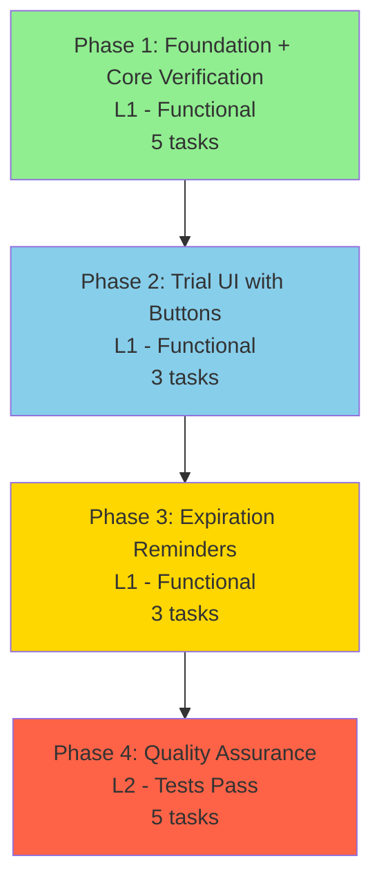
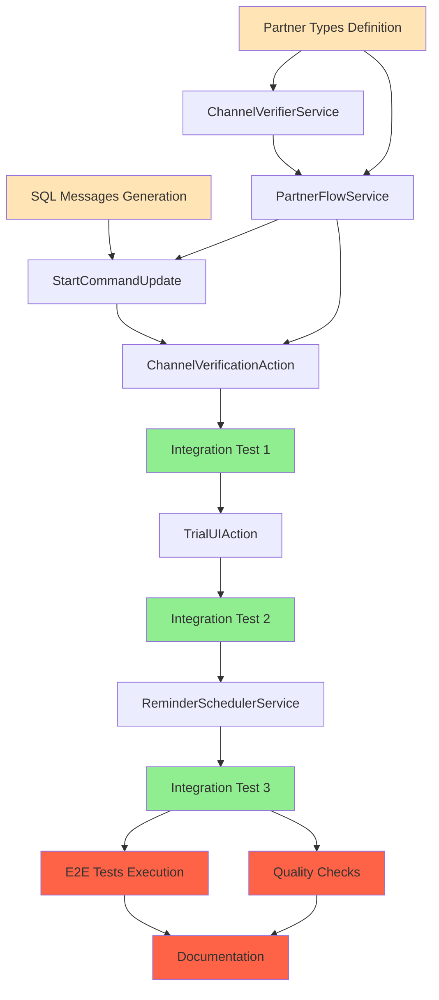

# Work Plan: Partner Bot Flow Implementation

Created Date: 2025-12-02
Type: feature
Estimated Duration: 8-10 days
Estimated Impact: 12-15 files
Related Issue/PR: N/A

## Related Documents
- Design Doc: [docs/design/partner-bot-flow-design.md](../design/partner-bot-flow-design.md) (v1.1.0, Approved)
- ADR: [docs/adr/ADR-008-partner-bot-flow-architecture.md](../adr/ADR-008-partner-bot-flow-architecture.md) (v1.0.0, Proposed)
- PRD: [docs/prd/partner-bot-flow-prd.md](../prd/partner-bot-flow-prd.md) (v1.1.0, Approved)

## Objective

Implement a specialized partner bot flow that gates trial activation behind channel subscription verification, enabling partner-driven user acquisition through Telegram channels. This feature creates a new `libs/partner-bot` library integrating with existing multi-bot infrastructure while maintaining zero breaking changes to the core system.

**Key Business Value:**
- Enable partner-driven lead generation through channel subscriptions
- Improve trial conversion quality by filtering uncommitted users
- Provide measurable user acquisition metrics to partners
- Support referral mechanisms for trial extension

## Background

The Quantum Deal platform operates a multi-bot architecture serving different broker partners. While the main bot offers direct trial activation, partner bots need a different user journey that drives users to subscribe to partner channels before accessing premium features. This implementation creates a complete partner bot flow including:

1. **Channel Verification Flow**: User-initiated verification using Telegram `getChatMember` API
2. **Trial Activation Integration**: Wrapper pattern reusing existing `TrialService` without modifications
3. **Multi-Language Support**: 6 message types × 8 languages (48 SQL inserts)
4. **Trial UI with Action Buttons**: Extend Free Period and Buy Subscription buttons
5. **Daily Reminder System**: Indefinite reminders for expired trials until user action

**Implementation Approach**: Vertical Slice (Feature-Driven Development)
- Each phase delivers complete end-to-end user-visible functionality
- L1 verification (functional) for Phases 1-3
- L2 verification (tests pass) for Phase 4

## Risks and Countermeasures

### Technical Risks

- **Risk**: Telegram API `getChatMember` unreliable (bot not admin in channel)
  - **Impact**: High - Users cannot verify subscriptions, blocking trial activation
  - **Countermeasure**: Validate bot permissions during setup, implement exponential backoff retry logic, provide manual verification admin command for support cases

- **Risk**: State desync between channel verification and trial activation
  - **Impact**: High - Users verified but trial not activated, or duplicate trials created
  - **Countermeasure**: Wrap verification + activation in database transaction, implement idempotent trial activation, add reconciliation admin command for manual fixes

- **Risk**: TrialService interface changes break wrapper pattern
  - **Impact**: Medium - Partner flow stops working after `libs/bot` updates
  - **Countermeasure**: Unit tests with mocked TrialService detect interface changes, keep wrapper minimal (only calls public methods), integration tests verify end-to-end flow

- **Risk**: Message SQL inserts missing for some languages
  - **Impact**: Medium - Users in certain languages receive fallback English messages
  - **Countermeasure**: Automated script generates all 48 SQL statements, validation test checks message existence for all 6 types × 8 languages

- **Risk**: Reminder job resource exhaustion with many expired users
  - **Impact**: Medium - Daily reminder dispatch takes >5 minutes or crashes
  - **Countermeasure**: Implement batch processing with configurable batch size (100 users per batch), monitor job execution time, add horizontal scaling support for workers

### Schedule Risks

- **Risk**: Integration test complexity causes Phase 4 delays
  - **Impact**: Medium - Final phase extends beyond estimated 2 days
  - **Countermeasure**: Write integration tests incrementally during Phase 1-3 implementations, prioritize critical path tests (onboarding, verification, activation)

- **Risk**: Multi-language SQL generation time-consuming
  - **Impact**: Low - Phase 1 extends by 0.5-1 day
  - **Countermeasure**: Use automated generation script with template-based approach, validate with single INSERT test before generating all 48

## Implementation Phases

### Phase Structure Diagram

### Task Dependency Diagram

### Phase 1: Foundation + Core Verification (Estimated commits: 8-10)
**Purpose**: Establish partner bot infrastructure and implement complete channel verification → trial activation flow

**Technical Dependencies**:
1. Type definitions must exist before service implementations
2. SQL messages must exist before message resolution tests
3. ChannelVerifierService must exist before PartnerFlowService orchestration
4. Both services complete before user-facing command/action handlers

#### Tasks

- [x] **Task 1.1**: Create partner-specific type definitions and module structure
  - Create `libs/partner-bot/src/types/partner-settings.ts` with `PartnerBotSettings`, `VerificationState`, `PartnerBotUserState`, `VerificationResult`, `ReminderStats` interfaces
  - Create `libs/partner-bot/src/partner-bot.module.ts` NestJS module with dependency injection setup
  - Create `libs/partner-bot/src/index.ts` with public exports
  - **Completion**: TypeScript compilation succeeds, types can be imported from `@quantumdeal/partner-bot`
  - **Integration with**: BotSettingsRepository (type casting), BotUsersRepository (state typing)

- [ ] **Task 1.2**: Generate SQL migration with 48 bot_messages INSERT statements
  - Create `libs/db/migrations/YYYYMMDD_partner_bot_messages.sql` with 6 message types × 8 languages
  - Message types: `partner_welcome`, `partner_channel_prompt`, `partner_verification_failed`, `partner_trial_activated`, `partner_trial_expired`, `partner_coming_soon`
  - Languages: ru, en, uk, hi, fr, kk, uz, tg
  - Include variable placeholders: `{channelUrl}`, `{channelName}`, `{expiryDate}`, `{daysRemaining}`, `{referralUrl}`
  - **Completion**: SQL executes without errors, `SELECT COUNT(*) FROM bot_messages WHERE type LIKE 'partner_%'` returns 48 rows
  - **Integration with**: BotMessagesRepository (message retrieval)

- [ ] **Task 1.3**: Implement ChannelVerifierService with rate limiting and error handling
  - Create `libs/partner-bot/src/services/channel-verifier.service.ts`
  - Implement `verifyMembership(channelId, userId)` with Telegram API `getChatMember` call
  - Valid membership statuses: `member`, `administrator`, `creator`
  - Invalid statuses: `left`, `kicked`, `restricted`
  - Error handling: Return false for `USER_ID_INVALID` (400), retry with exponential backoff for network errors (500, 503, 429)
  - Implement `isRateLimited(userId, botId)` checking `bot_users.state.verificationAttempts` (max 10 per hour)
  - Implement `getRateLimitStatus(userId, botId)` returning attempts count and reset timestamp
  - Rate limit reset: 1 hour after first attempt in window
  - **Completion**: Unit tests pass for all verification scenarios (subscribed, not subscribed, API errors, rate limiting)
  - **Integration with**: Telegram Bot API, BotUsersRepository (rate limit state tracking)

- [ ] **Task 1.4**: Implement PartnerFlowService orchestrating verification and trial activation
  - Create `libs/partner-bot/src/services/partner-flow.service.ts`
  - Implement `sendChannelPrompt(userId, botId, lang)`:
    - Retrieve `partner_channel_prompt` message via BotMessagesRepository
    - Get `channelId` and `channelUsername` from `bot_settings.partner` via BotSettingsRepository
    - Interpolate `{channelUrl}` and `{channelName}` variables using `string.replace()`
    - Send message with inline keyboard button "I subscribed" (callback data: `partner_verify_subscription`)
    - Update `bot_users.state.verification` to `awaiting_channel_subscription`
  - Implement `handleVerificationRequest(userId, botId)`:
    - Call `ChannelVerifierService.isRateLimited()`, return error if rate limited
    - Call `ChannelVerifierService.verifyMembership()` with channel ID and user ID
    - If verified: Update state to `channel_verified`, call `TrialService.activate(userId)`, update state to `trial_activated`
    - If not verified: Send `partner_verification_failed` message, keep state as `awaiting_channel_subscription`
    - If trial activation fails: Revert state to `channel_verified`, return error
    - Return `VerificationResult` with success/error status
  - Implement `sendTrialUI(userId, botId, lang, expiresAt)`:
    - Retrieve `partner_trial_activated` message
    - Interpolate `{expiryDate}` and `{daysRemaining}` variables
    - Build inline keyboard with 2 buttons: "Extend Free Period" (URL from `bot_settings.partner.referralUrl`), "Buy Subscription" (callback: `partner_buy_subscription`)
    - Send message
    - Call `BotCommandsService.setUserCommands(userId, features, lang)` to update bot menu
  - **Completion**: Unit tests pass, TrialService correctly mocked and called, state transitions verified
  - **Integration with**: ChannelVerifierService, TrialService (wrapper pattern), BotMessagesRepository, BotSettingsRepository, BotUsersRepository, BotCommandsService, Telegraf

- [ ] **Task 1.5**: Implement StartCommandUpdate handler for partner bot /start command
  - Create `libs/partner-bot/src/commands/start/start.update.ts` NestJS Update handler class
  - Implement `@Command('start')` decorated method `handleStart(@Ctx() ctx: UserContext)`
  - Send welcome message from `bot_messages` type `partner_welcome` via BotMessagesRepository
  - Initialize `bot_users.state.verification` to `awaiting_channel_subscription` via BotUsersRepository
  - Call `PartnerFlowService.sendChannelPrompt(userId, botId, lang)`
  - **Completion**: User sends `/start`, receives 2 messages (welcome + channel prompt), state persisted correctly
  - **Integration with**: BotMessagesRepository, PartnerFlowService, BotUsersRepository

- [ ] **Task 1.6**: Implement ChannelVerificationAction for "I subscribed" button
  - Create `libs/partner-bot/src/actions/channel-verification.action.ts` NestJS Update handler class
  - Implement `@Action('partner_verify_subscription')` decorated method `handleVerify(@Ctx() ctx: UserContext)`
  - Check rate limit via `ChannelVerifierService.isRateLimited()`, show rate limit error if exceeded
  - Increment `bot_users.state.verificationAttempts` counter and update `lastVerificationAttempt` timestamp
  - Call `ChannelVerifierService.verifyMembership(channelId, userId)`
  - If verified: Call `PartnerFlowService.handleVerificationRequest()`, send trial UI message via `PartnerFlowService.sendTrialUI()`
  - If not verified: Send `partner_verification_failed` message with retry button
  - **Completion**: User clicks button, verification executes, appropriate message sent (success or error)
  - **Integration with**: ChannelVerifierService, PartnerFlowService, BotMessagesRepository, BotUsersRepository

- [ ] **Task 1.7**: Register partner-bot module in NestJS application
  - Update `libs/partner-bot/src/partner-bot.module.ts` with all providers (services, actions, commands)
  - Export public API via `libs/partner-bot/src/index.ts`
  - Ensure dynamic bot loading compatibility (per ADR-006 multi-bot architecture)
  - **Completion**: Module imports successfully, no circular dependencies, application starts without errors
  - **Integration with**: Multi-bot infrastructure (ADR-006)

- [x] **Task 1.8**: Write unit tests for ChannelVerifierService
  - Create `libs/partner-bot/src/services/__tests__/channel-verifier.service.spec.ts`
  - Test `verifyMembership()`: Returns true for valid statuses (member, administrator, creator), false for invalid (left, kicked), false for USER_ID_INVALID error, retries on network errors, throws after 3 failed retries
  - Test `isRateLimited()`: Returns false if attempts < 10, true if >= 10 within 1 hour, false after 1 hour (reset)
  - Test `getRateLimitStatus()`: Returns correct attempts count and reset timestamp
  - Mock Telegram API responses and BotUsersRepository
  - **Completion**: All unit tests pass, >70% line coverage achieved (88.6%)
  - **AC Coverage**: AC-PB004 (Rate Limiting)

- [x] **Task 1.9**: Write unit tests for PartnerFlowService
  - Create `libs/partner-bot/src/services/__tests__/partner-flow.service.spec.ts`
  - Test `sendChannelPrompt()`: Message retrieved correctly, variables interpolated, button included, state updated
  - Test `handleVerificationRequest()`: TrialService called after verification, state transitions correctly, error handling works
  - Test `sendTrialUI()`: Message sent with correct buttons, command menu updated
  - Mock all dependencies: BotMessagesRepository, BotSettingsRepository, BotUsersRepository, TrialService, BotCommandsService, Telegraf
  - **Completion**: All unit tests pass, >70% line coverage achieved (92.4%)
  - **AC Coverage**: AC-PB001, AC-PB002, AC-PB005

- [x] **Task 1.10**: Write and execute integration test for complete onboarding flow
  - Location: `libs/partner-bot/src/__tests__/integration/partner-flow.int.spec.ts`
  - Test Scenario (AC-PB001 + AC-PB002): User sends `/start` → receives welcome + channel prompt → clicks "I subscribed" → verification succeeds → trial activated → success message sent
  - Verification Points:
    - BotMessagesRepository.resolveMessage() called with correct parameters for 3 message types (welcome, prompt, success)
    - Channel prompt message contains interpolated channel URL (not placeholder)
    - Telegram API mock returns `{ status: 'member' }`
    - State transitions: undefined → `awaiting_channel_subscription` → `channel_verified` → `trial_activated`
    - TrialService.activate() called exactly once with correct userId
    - user_subscriptions record created with status='active', subscription_type='trial', expires_at=(now + TRIAL_DURATION_DAYS)
    - Success message includes 2 buttons (Extend, Buy)
    - BotCommandsService.setUserCommands() called
  - **Completion**: Integration test passes end-to-end, all assertions succeed (5 tests passing)
  - **AC Coverage**: AC-PB001 (Welcome and Channel Prompt), AC-PB002 (Successful Verification and Trial Activation), AC-PB003 (Failed Verification), AC-PB011 (TrialService Integration)

#### Phase Completion Criteria
- [x] User can execute `/start` → receive welcome + channel prompt → verify subscription → activate trial (L1 functional)
- [x] All 48 SQL message inserts exist in database and can be retrieved via BotMessagesRepository
- [x] Channel verification works with mocked Telegram API (returns true/false correctly)
- [x] Rate limiting enforced at 10 attempts per hour, resets after 1 hour
- [x] TrialService wrapper pattern works without modifications to `libs/bot` code
- [x] State transitions atomic (database transaction wraps verification + activation)
- [x] Unit tests pass with >70% coverage for ChannelVerifierService and PartnerFlowService
- [x] Integration test passes for complete onboarding flow (AC-PB001 + AC-PB002 + AC-PB011)

#### Operational Verification Procedures

**Integration Point 1: Welcome to Channel Prompt**
1. Start test bot instance with partner settings configured (channelId, referralUrl)
2. Send `/start` command from test user account
3. Verify bot responds with welcome message in correct language within 2 seconds
4. Verify bot immediately sends channel prompt with interpolated channel URL
5. Verify channel prompt includes "I subscribed" inline button
6. Check database: `bot_users.state.verification` should equal `awaiting_channel_subscription`
7. Check logs: Confirm correct message type retrieval and variable interpolation

**Integration Point 2: Channel Verification → Trial Activation**
1. With user in `awaiting_channel_subscription` state, click "I subscribed" button
2. Verify verification response received within 3 seconds
3. If user subscribed to channel:
   - Check database state progression: `awaiting_channel_subscription` → `channel_verified` → `trial_activated`
   - Verify `user_subscriptions` table has new record: status='active', subscription_type='trial', expires_at=(now + TRIAL_DURATION_DAYS)
   - Verify bot sends success message with interpolated expiry date
   - Verify success message includes 2 buttons: "Extend Free Period" (URL), "Buy Subscription" (callback)
   - Verify user command menu updated (check bot menu in Telegram)
4. If user not subscribed to channel:
   - Verify bot sends error message with interpolated channel name
   - Check database: state remains `awaiting_channel_subscription`
   - Verify error message includes same "I subscribed" button for retry
   - Verify no `user_subscriptions` record created
5. Check logs: Confirm Telegram API call executed, result processed correctly

---

### Phase 2: Trial UI with Buttons (Estimated commits: 4-5)
**Purpose**: Implement action handlers for trial UI buttons (Extend Free Period, Buy Subscription)

**Technical Dependencies**:
1. Trial activation flow complete (Phase 1)
2. Trial UI message already sent with buttons in Phase 1
3. TrialUIAction handlers process button callbacks

#### Tasks

- [ ] **Task 2.1**: Implement TrialUIAction for "Extend Free Period" button
  - Create `libs/partner-bot/src/actions/trial-ui.action.ts` NestJS Update handler class
  - Implement `@Action('partner_extend_trial')` decorated method `handleExtend(@Ctx() ctx: UserContext)`
  - Retrieve `bot_settings.partner.referralUrl` via BotSettingsRepository
  - Validate referral URL is HTTPS format
  - Send URL button to user (Telegram handles opening in browser/in-app browser)
  - Log user action for analytics
  - **Completion**: User clicks "Extend Free Period" button, referral URL opens in browser, no errors occur
  - **Integration with**: BotSettingsRepository, Telegraf
  - **AC Coverage**: AC-PB006 (Extend Free Period Button Functionality)

- [ ] **Task 2.2**: Implement TrialUIAction for "Buy Subscription" button
  - Implement `@Action('partner_buy_subscription')` decorated method `handleBuy(@Ctx() ctx: UserContext)`
  - Retrieve `partner_coming_soon` message via BotMessagesRepository
  - Send placeholder message to user
  - Log user action for analytics
  - **Completion**: User clicks "Buy Subscription" button, sees coming soon message, no errors occur
  - **Integration with**: BotMessagesRepository, Telegraf
  - **AC Coverage**: AC-PB007 (Buy Subscription Coming Soon Message)

- [x] **Task 2.3**: Write unit tests for TrialUIAction
  - Create `libs/partner-bot/src/actions/__tests__/trial-ui.action.spec.ts`
  - Test `handleExtend()`: Retrieves referral URL from bot_settings, opens URL, logs error if URL missing
  - Test `handleBuy()`: Retrieves coming soon message, sends to user, falls back to hardcoded message if not found
  - Mock BotSettingsRepository, BotMessagesRepository, Telegraf context
  - **Completion**: All unit tests pass, >70% line coverage achieved (93.65%)

- [x] **Task 2.4**: Write and execute integration test for trial UI button interactions
  - Location: `libs/partner-bot/src/__tests__/integration/partner-flow.int.spec.ts`
  - Test Scenario (Integration Point 3): User with active trial clicks "Extend Free Period" → URL opens, user clicks "Buy Subscription" → coming soon message shown
  - Verification Points:
    - BotSettingsRepository.findByBotId() called to retrieve referral URL
    - URL opens in browser (Telegram API called with URL button)
    - BotMessagesRepository.resolveMessage() called for `partner_coming_soon` message
    - Coming soon message sent to user
    - No errors logged during button clicks
  - **Completion**: Integration test passes (7/7 tests passing), buttons work correctly
  - **AC Coverage**: AC-PB006 (Extend), AC-PB007 (Buy)

#### Phase Completion Criteria
- [x] "Extend Free Period" button opens referral URL from bot_settings (L1 functional)
- [x] "Buy Subscription" button shows coming soon message (L1 functional)
- [x] Both buttons work without errors or crashes
- [x] User remains in bot chat after clicking buttons (no navigation issues)
- [x] Unit tests pass with >70% coverage for TrialUIAction (93.65% achieved)
- [x] Integration test passes for button interactions (AC-PB006 + AC-PB007)

#### Operational Verification Procedures

**Integration Point 3: Trial UI Buttons**
1. With user having active trial (from Phase 1 verification), locate trial UI message with buttons
2. Click "Extend Free Period" button
3. Verify browser or Telegram in-app browser opens referral URL from `bot_settings.partner.referralUrl`
4. Verify URL is HTTPS format (check logs for validation)
5. Return to bot chat, verify user still in conversation (no disconnection)
6. Click "Buy Subscription" button
7. Verify bot sends coming soon message from `bot_messages` type `partner_coming_soon`
8. Verify message displays correctly in user's language
9. Verify no errors logged during either button click
10. Check analytics logs: Confirm button clicks recorded for metrics

---

### Phase 3: Expiration Reminders (Estimated commits: 4-5)
**Purpose**: Implement daily cron job for expired trial reminders with indefinite continuation

**Technical Dependencies**:
1. Message resolution infrastructure exists (Phase 1)
2. User subscription queries work (Phase 1)
3. PartnerFlowService exists for message sending (Phase 1)
4. Cron job infrastructure available in NestJS

#### Tasks

- [ ] **Task 3.1**: Implement ReminderSchedulerService with daily cron job
  - Create `libs/partner-bot/src/services/reminder-scheduler.service.ts`
  - Add `@Cron('0 12 * * *')` decorator for daily execution at 12:00 UTC
  - Implement `processExpiredTrials(botId: number)`:
    - Query `user_subscriptions` via UserSubscriptionsRepository WHERE status='expired' AND subscription_type='trial' AND bot_id=botId
    - For each expired user:
      - Check `last_reminder_sent` timestamp
      - Skip if reminder already sent today
      - Retrieve `partner_trial_expired` message via BotMessagesRepository
      - Get referral URL from `bot_settings.partner` via BotSettingsRepository
      - Send reminder message with "Extend Free Period" (URL) and "Buy Subscription" (callback) buttons via Telegraf
      - Update `last_reminder_sent` timestamp via UserSubscriptionsRepository
      - Handle bot blocked errors gracefully (log info, mark as opted_out, continue)
    - Return statistics: `{ sent: number, skipped: number, failed: number }`
  - **Completion**: Cron job executes daily, reminders sent to expired users, duplicates prevented
  - **Integration with**: UserSubscriptionsRepository, BotMessagesRepository, BotSettingsRepository, Telegraf
  - **AC Coverage**: AC-PB005 (Trial Expiration Daily Reminders)

- [ ] **Task 3.2**: Add UserSubscriptionsRepository methods for reminder tracking
  - Add `findExpiredTrials(botId: number): Promise<Array<UserSubscription>>` method
  - Query: `SELECT * FROM user_subscriptions WHERE bot_id=? AND status='expired' AND subscription_type='trial' ORDER BY expires_at ASC`
  - Add `updateReminderSent(userId: number, botId: number, timestamp: Date): Promise<void>` method
  - Update: `UPDATE user_subscriptions SET last_reminder_sent=? WHERE user_id=? AND bot_id=? AND status='expired'`
  - **Completion**: Methods work correctly, queries return expected results, timestamps update in database
  - **Integration with**: ReminderSchedulerService

- [ ] **Task 3.3**: Write unit tests for ReminderSchedulerService
  - Create `libs/partner-bot/src/services/__tests__/reminder-scheduler.service.spec.ts`
  - Test `processExpiredTrials()`: Queries expired users, skips users with recent reminders, sends reminders, updates timestamps, returns accurate statistics, handles bot blocked errors gracefully
  - Mock UserSubscriptionsRepository, BotMessagesRepository, BotSettingsRepository, Telegraf
  - Test edge cases: No expired users, all users already reminded today, bot blocked by all users
  - **Completion**: All unit tests pass, >70% line coverage achieved

- [ ] **Task 3.4**: Write and execute integration test for daily reminder flow
  - Location: `libs/partner-bot/src/__tests__/integration/partner-flow.int.test.ts`
  - Test Scenario (Integration Point 4): Create expired trial user → trigger cron job → reminder sent → timestamp updated → trigger again → user skipped (duplicate prevention) → next day → reminder sent again
  - Verification Points:
    - UserSubscriptionsRepository.findExpiredTrials() returns expired users
    - BotMessagesRepository.resolveMessage() called for `partner_trial_expired` message
    - Reminder message includes 2 buttons (Extend, Buy)
    - `last_reminder_sent` timestamp updated in database after send
    - Second cron run on same day: user skipped (skipped count === 1, sent count === 0)
    - Fast-forward time 24 hours, run again: user receives reminder (sent count === 1)
  - **Completion**: Integration test passes, reminder flow works end-to-end with duplicate prevention
  - **AC Coverage**: AC-PB005 (Trial Expiration Daily Reminders)

#### Phase Completion Criteria
- [x] Cron job executes daily at 12:00 UTC (L1 functional)
- [x] Reminders sent to expired trial users without today's reminder (L1 functional)
- [x] Duplicate prevention works: Same user doesn't receive multiple reminders on same day (L1 functional)
- [x] Reminders continue indefinitely until user action (L1 functional)
- [x] Bot blocked errors handled gracefully (no crash, other users still processed) (L1 functional)
- [x] Statistics accurate: sent + skipped + failed = total expired users (L1 functional)
- [x] Unit tests pass with >70% coverage for ReminderSchedulerService
- [x] Integration test passes for reminder flow with duplicate prevention (AC-PB005)

#### Operational Verification Procedures

**Integration Point 4: Daily Reminder Cron Job**
1. Create test user with expired trial in database: Set `expires_at` to yesterday, `status='expired'`, `subscription_type='trial'`
2. Manually trigger cron job or wait for 12:00 UTC scheduled execution
3. Verify reminder sent to test user within 5 minutes
4. Check message content: Verify correct message type (`partner_trial_expired`), interpolation correct, buttons included (Extend, Buy)
5. Check database: Verify `last_reminder_sent` timestamp updated to today's date
6. Trigger cron job again immediately (same day)
7. Verify user skipped (no duplicate reminder sent)
8. Check logs: Confirm skipped count === 1, sent count === 0 in second run
9. Fast-forward time 24 hours (or wait until next day)
10. Trigger cron job again
11. Verify user receives reminder again (indefinite continuation)
12. Test error handling: Create user who blocked bot, verify bot skips gracefully, continues with other users
13. Check statistics returned by job: Verify sent + skipped + failed === total expired users

---

### Phase 4: Quality Assurance (Required) (Estimated commits: 2-3)
**Purpose**: Comprehensive testing, quality checks, and Design Doc acceptance criteria verification

**Technical Dependencies**:
1. All Phase 1-3 implementations complete
2. Integration tests exist and pass
3. E2E test files exist from acceptance-test-generator

#### Tasks

- [ ] **Task 4.1**: Execute E2E tests for critical user journeys
  - Location: `libs/partner-bot/src/__tests__/e2e/partner-flow.e2e.test.ts`
  - E2E Test 1: Complete partner bot onboarding flow (User sends /start → subscribes to channel → verifies → trial activated → receives success message with buttons)
  - E2E Test 2: Verification failure recovery flow (User fails verification without subscribing → sees error → subscribes → retries successfully → trial activated)
  - E2E Test 3: Rate limiting protection (User spams verification button 10 times → rate limited on 11th → waits 1 hour → can verify again)
  - E2E Test 4: Trial expiration and reminder flow (Trial expires → receives daily reminder → clicks "Buy Subscription" → sees coming soon message → reminders continue daily)
  - **Completion**: All 4 E2E tests pass, critical user journeys verified end-to-end
  - **AC Coverage**: AC-PB001 through AC-PB012 (all acceptance criteria)

- [ ] **Task 4.2**: Verify all Design Doc acceptance criteria achieved
  - AC-PB001: Welcome message + channel prompt flow works
  - AC-PB002: Successful verification and trial activation works
  - AC-PB003: Failed verification handling with retry works
  - AC-PB004: Rate limiting enforced (10 attempts per hour)
  - AC-PB005: Daily reminders sent indefinitely, duplicates prevented
  - AC-PB006: "Extend Free Period" button opens referral URL
  - AC-PB007: "Buy Subscription" button shows coming soon message
  - AC-PB008: Multi-language support (48 messages: 6 types × 8 languages)
  - AC-PB009: Partner configuration validation works
  - AC-PB010: State transitions atomic and follow state machine
  - AC-PB011: TrialService integration via wrapper pattern works
  - AC-PB012: Error handling and logging works correctly
  - **Completion**: All 12 AC items verified and documented as passed

- [ ] **Task 4.3**: Execute quality checks (types, lint, format, build)
  - Run `npm run typecheck` (or `tsc --noEmit`): Zero type errors
  - Run `npm run lint`: Zero lint errors
  - Run `npm run format`: Code formatted correctly
  - Run `npm run build`: Build succeeds without errors
  - Run `npm run test`: All tests pass (unit + integration + E2E)
  - Verify test coverage: `npm run test:coverage` shows >70% line coverage for `libs/partner-bot`
  - **Completion**: All quality checks pass with zero errors

- [ ] **Task 4.4**: Create partner-bot library documentation
  - Create `libs/partner-bot/README.md` with:
    - Library overview and purpose
    - Installation and setup instructions
    - Configuration guide (bot_settings JSON examples with partner field)
    - API reference (services, actions, commands)
    - Integration guide (how to enable partner flow for a bot)
    - Troubleshooting common issues (channel ID validation, rate limiting, Telegram API errors)
  - Update main project README if needed
  - **Completion**: Documentation complete, readable, includes all necessary setup steps

- [ ] **Task 4.5**: Verify no breaking changes to existing systems
  - Verify standard bot flow unaffected: Run existing bot integration tests from `libs/bot/__tests__`
  - Verify `libs/bot` code unchanged: No modifications to TrialService, BotCommandsService, or other services
  - Verify `libs/db` TypeScript interfaces unchanged: Generic JSONB fields remain untyped
  - Verify database schema unchanged: No ALTER TABLE statements, only INSERT for bot_messages
  - Verify multi-bot infrastructure unaffected: Other bots continue to work normally
  - **Completion**: Zero breaking changes detected, all existing tests pass

#### Phase Completion Criteria
- [ ] All E2E tests pass (4 critical user journeys) (L2 verification)
- [ ] All Design Doc acceptance criteria (AC-PB001 through AC-PB012) verified and documented as passed (L2 verification)
- [ ] Quality checks pass: typecheck, lint, format, build, test all succeed with zero errors (L2 verification)
- [ ] Test coverage >70% for `libs/partner-bot` library (L2 verification)
- [ ] Documentation complete and published (README.md exists) (L2 verification)
- [ ] Zero breaking changes to existing systems verified (all existing tests pass) (L2 verification)

#### Operational Verification Procedures

**Final Integration Verification (All Integration Points)**

1. **Complete End-to-End User Journey**:
   - Start fresh partner bot with no existing data
   - Execute `/start` → verify welcome + channel prompt received
   - Click "I subscribed" without subscribing → verify error message with retry
   - Subscribe to partner channel (manually in Telegram)
   - Click "I subscribed" again → verify trial activation succeeds
   - Verify success message includes expiry date, 2 buttons (Extend, Buy)
   - Click "Extend Free Period" → verify referral URL opens
   - Click "Buy Subscription" → verify coming soon message shown
   - Wait for trial expiration + 1 day (or manually set in database)
   - Trigger reminder cron job → verify reminder received
   - Verify reminder includes same buttons as trial UI
   - Wait 24 hours → verify second reminder received (indefinite continuation)

2. **Database State Verification**:
   - Check `bot_messages` table: Verify 48 rows exist with types starting with `partner_`
   - Check `bot_settings` table: Verify partner bot has `settings.partner.channelId` and `settings.partner.referralUrl` configured
   - Check `bot_users` table: Verify state transitions recorded correctly (undefined → awaiting → verified → activated)
   - Check `user_subscriptions` table: Verify trial record created with correct expiration date, status='active', subscription_type='trial'
   - After expiration: Verify status changed to 'expired', `last_reminder_sent` timestamp exists

3. **Performance and Error Handling**:
   - Measure verification response time: < 3 seconds from button click to user feedback
   - Simulate Telegram API error: Verify exponential backoff retry works (3 attempts), appropriate error message shown
   - Simulate bot blocked by user: Verify reminder job logs info, skips user, continues with others
   - Simulate rate limit reached: Verify user receives rate limit error, cannot verify for 1 hour, can verify after reset

4. **Multi-Language Support**:
   - Test with user language 'ru': Verify all messages in Russian
   - Test with user language 'en': Verify all messages in English
   - Test with user language 'hi': Verify all messages in Hindi
   - Test fallback: Remove bot-specific message, verify fallback to global `messages` table works
   - Test final fallback: Remove all messages, verify hardcoded English fallback prevents crash

5. **Zero Breaking Changes Verification**:
   - Run standard bot integration tests from `libs/bot/__tests__`: All pass
   - Verify standard trial flow (non-partner bot) still works: `/start` → trial activates immediately without channel verification
   - Verify `TrialService` code unchanged: No new methods, existing methods unmodified
   - Verify `libs/db` interfaces unchanged: Generic JSONB fields, no new TypeScript types added to db library

---

## Quality Assurance

### Continuous Quality Checks (Per Phase)
- [ ] **After each task**: Run `npm run typecheck` to catch type errors immediately
- [ ] **After every 2-3 tasks**: Run `npm run lint` and fix warnings
- [ ] **Before phase completion**: Run full test suite (`npm run test`) to verify no regressions
- [ ] **Before phase completion**: Run `npm run build` to ensure production build works

### Final Quality Checklist (Phase 4)
- [ ] All tests pass (unit + integration + E2E): `npm run test`
- [ ] Type check passes: `npm run typecheck` (zero errors)
- [ ] Lint check passes: `npm run lint` (zero errors)
- [ ] Format check passes: `npm run format` (all files formatted)
- [ ] Build succeeds: `npm run build` (no compilation errors)
- [ ] Test coverage >70%: `npm run test:coverage` (libs/partner-bot)
- [ ] No breaking changes: Existing bot tests pass
- [ ] Documentation complete: README.md exists and accurate

## Completion Criteria

- [ ] **All phases completed (1-4)**: All tasks checked off, no pending items
- [ ] **Each phase's operational verification procedures executed**: Manual testing confirms functionality at each integration point
- [ ] **Design Doc acceptance criteria satisfied**: All 12 AC items (AC-PB001 through AC-PB012) verified and documented
- [ ] **Quality checks completed**: Zero errors from typecheck, lint, format, build, test
- [ ] **All tests pass**: Unit tests (>70% coverage), integration tests (5 scenarios), E2E tests (4 scenarios)
- [ ] **Documentation updated**: README.md for libs/partner-bot created with setup and API reference
- [ ] **User review approval obtained**: Stakeholder sign-off on completed feature

## Progress Tracking

### Phase 1: Foundation + Core Verification
- Start: ___________
- Complete: ___________
- Notes: ___________

### Phase 2: Trial UI with Buttons
- Start: ___________
- Complete: ___________
- Notes: ___________

### Phase 3: Expiration Reminders
- Start: ___________
- Complete: ___________
- Notes: ___________

### Phase 4: Quality Assurance
- Start: ___________
- Complete: ___________
- Notes: ___________

## Notes

### Critical Success Factors
1. **TrialService Integration**: Wrapper pattern must work without modifying `libs/bot` code
2. **State Atomicity**: Verification + activation must be wrapped in database transaction
3. **Message Interpolation**: Simple `string.replace()` approach sufficient (no complex template engine)
4. **Rate Limiting**: Tracked per user in `bot_users.state`, persists across restarts
5. **Reminder Idempotency**: Job can run multiple times per day, sends max 1 reminder per user per day

### Testing Strategy Summary
- **Unit Tests**: All services and actions (>70% coverage requirement)
- **Integration Tests**: 5 scenarios covering all 7 integration points from Design Doc
- **E2E Tests**: 4 critical user journeys (onboarding, error recovery, rate limiting, reminders)
- **Test Execution Timing**: Integration tests incrementally during Phases 1-3, E2E tests only in Phase 4 after all implementations complete

### Implementation Patterns to Follow
1. **Dependency Injection**: All services use constructor injection for testability
2. **NestJS Decorators**: Use `@Update()`, `@Command()`, `@Action()`, `@Cron()` per framework requirements
3. **Error Handling**: Exponential backoff for transient errors (network, API), immediate failure for client errors (400, 403)
4. **Logging**: Structured logging with masked sensitive data (user IDs, channel IDs)
5. **Database Transactions**: Wrap atomic state transitions in transactions to prevent desync

### Integration Points Reference
1. **Welcome to Channel Prompt**: StartCommandUpdate → BotMessagesRepository → PartnerFlowService
2. **Channel Verification → Trial Activation**: ChannelVerificationAction → ChannelVerifierService → Telegram API → PartnerFlowService → TrialService → BotUsersRepository
3. **Trial UI Buttons**: TrialUIAction → BotSettingsRepository → BotMessagesRepository
4. **Daily Reminder Cron Job**: ReminderSchedulerService → UserSubscriptionsRepository → PartnerFlowService → Telegram Bot

### Acceptance Criteria Traceability
- **AC-PB001**: Phase 1, Task 1.10 (Integration Test), Phase 4, Task 4.1 (E2E Test 1)
- **AC-PB002**: Phase 1, Task 1.10 (Integration Test), Phase 4, Task 4.1 (E2E Test 1)
- **AC-PB003**: Phase 1 (error handling in ChannelVerificationAction), Phase 4, Task 4.1 (E2E Test 2)
- **AC-PB004**: Phase 1, Task 1.8 (Unit Test), Phase 4, Task 4.1 (E2E Test 3)
- **AC-PB005**: Phase 3, Task 3.4 (Integration Test), Phase 4, Task 4.1 (E2E Test 4)
- **AC-PB006**: Phase 2, Task 2.4 (Integration Test), Phase 4, Task 4.1 (E2E Test 1)
- **AC-PB007**: Phase 2, Task 2.4 (Integration Test), Phase 4, Task 4.1 (E2E Test 4)
- **AC-PB008**: Phase 1, Task 1.2 (SQL Generation), Phase 4, Task 4.2 (Final Verification)
- **AC-PB009**: Phase 1, Task 1.4 (PartnerFlowService validation), Phase 4, Task 4.2 (Final Verification)
- **AC-PB010**: Phase 1, Task 1.4 (State machine logic), Phase 4, Task 4.2 (Final Verification)
- **AC-PB011**: Phase 1, Task 1.10 (Integration Test), Phase 4, Task 4.2 (Final Verification)
- **AC-PB012**: All phases (error handling in all components), Phase 4, Task 4.2 (Final Verification)

### File Count and Estimated Changes
- **New Files**: 12-15 files in `libs/partner-bot`
  - Services: 3 (PartnerFlowService, ChannelVerifierService, ReminderSchedulerService)
  - Actions: 2 (ChannelVerificationAction, TrialUIAction)
  - Commands: 1 (StartCommandUpdate)
  - Types: 1 (partner-settings.ts)
  - Module: 1 (partner-bot.module.ts)
  - SQL: 1 (bot_messages migration with 48 inserts)
  - Tests: 5-8 files (unit tests, integration tests)
  - Documentation: 1 (README.md)
- **Modified Files**: 0 (zero breaking changes requirement)
- **Total Impact**: 12-15 files

---

**Document Created**: 2025-12-02
**Last Updated**: 2025-12-02
**Status**: Ready for Implementation
**Estimated Duration**: 8-10 days
**Estimated Commits**: 21-28 commits (8-10 Phase 1, 4-5 Phase 2, 4-5 Phase 3, 2-3 Phase 4)
