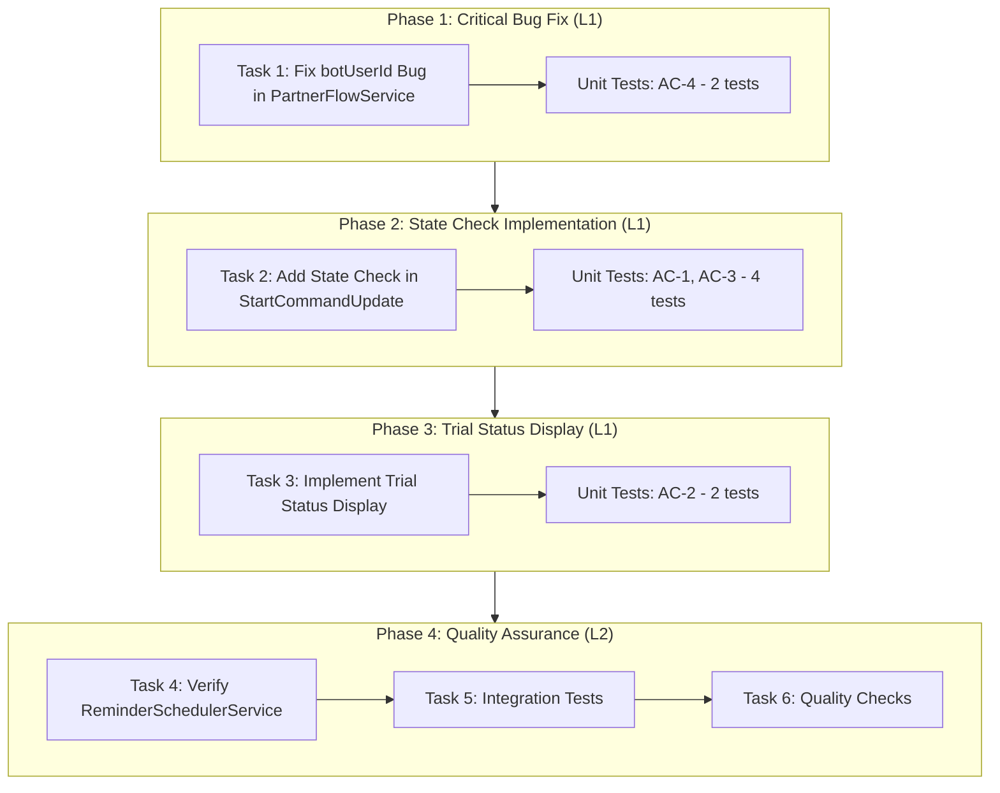
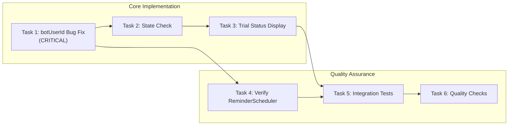

# Work Plan: Partner Bot Flow Improvements

**Document Version:** 1.0.0
**Created:** 2025-12-04
**Status:** Proposed
**Scale:** Medium (4-5 files)
**Implementation Mode:** Vertical Slice (Feature-Driven)
**Related Documents:** partner-bot-flow-improvements-design.md v1.1.0

---

## Overview

This work plan defines the implementation tasks for partner bot flow improvements including:
1. Critical bug fix: `botUserId` migration in `PartnerFlowService`
2. State-aware `/start` command handling
3. Trial status button display
4. Unit and integration test implementation

## Phase Structure Diagram



## Task Dependency Diagram



---

## Phase 1: Critical Bug Fix

### Task 1: Fix botUserId Bug in PartnerFlowService

**Priority:** CRITICAL
**Verification Level:** L1 (Functional Operation)
**Acceptance Criteria:** AC-4

**Files:**
- `libs/partner-bot/src/services/partner-flow.service.ts`

**Implementation Steps:**
- [ ] Add `BotUsersRepository` dependency injection (if not present)
- [ ] Modify `handleVerificationRequest()` to resolve `botUser` via `botUsersRepository.findByUserAndBot(userId, botId)`
- [ ] Add null check for `botUser` with appropriate error return
- [ ] Change `trialService.activate(userId)` to `trialService.activate(botUser.id)`
- [ ] Add debug logging to verify correct `botUserId` value

**Unit Tests (2 tests):**
- [ ] `partner-flow.service.spec.ts`: AC-4 - should call TrialService.activate with botUser.id (bot_users.id) not userId (telegramId)
- [ ] `partner-flow.service.spec.ts`: AC-4 - should return error when botUser cannot be resolved for trial activation

**Quality Check:**
```bash
npm run check
npm run build
npm test -- libs/partner-bot/src/services/__tests__/partner-flow.service.spec.ts
```

**Completion Criteria:**
- [ ] Implementation complete: `handleVerificationRequest()` passes `botUser.id` to `trialService.activate()`
- [ ] Quality complete: 2 unit tests passing
- [ ] Integration ready: No breaking changes to method signature

---

## Phase 2: State Check Implementation

### Task 2: Add State Check in StartCommandUpdate

**Priority:** High
**Verification Level:** L1 (Functional Operation)
**Acceptance Criteria:** AC-1, AC-3, AC-6

**Dependencies:** Task 1 (correct trial activation required for status check)

**Files:**
- `libs/partner-bot/src/commands/start/start.update.ts`

**Implementation Steps:**
- [ ] Add `UserSubscriptionsRepository` dependency injection
- [ ] Add state check at start of `handleStart()` method
- [ ] Implement `trial_activated` state branch:
  - Check active subscription via `userSubscriptionsRepository.findActiveByBotUserId(ctx.botUser.id)`
  - If active: call `sendTrialStatus()` (implemented in Task 3)
  - If expired: continue with welcome flow
- [ ] Implement `awaiting_channel_subscription` state branch:
  - Skip welcome message
  - Call `partnerFlowService.sendChannelPrompt()` directly
  - Preserve verification attempt counter (no state reset)
- [ ] Implement default branch (undefined/trial_expired):
  - Send welcome message
  - Initialize state
  - Call `sendChannelPrompt()`
- [ ] Use `ctx.botUser.state` from middleware context (no extra DB query)

**Unit Tests (4 tests):**
- [ ] `start.update.spec.ts`: AC-1 - should show trial status message when user has trial_activated state with active subscription
- [ ] `start.update.spec.ts`: AC-1/AC-3 - should re-send channel prompt without welcome when user has awaiting_channel_subscription state
- [ ] `start.update.spec.ts`: AC-1 - should show welcome message and channel prompt when user has no state or trial_expired
- [ ] `start.update.spec.ts`: AC-1 - should use ctx.botUser.state from context without extra DB query

**Quality Check:**
```bash
npm run check
npm run build
npm test -- libs/partner-bot/src/commands/start/__tests__/start.update.spec.ts
```

**Completion Criteria:**
- [ ] Implementation complete: State check branches correctly route user flow
- [ ] Quality complete: 4 unit tests passing
- [ ] Integration ready: Works with existing middleware context

---

## Phase 3: Trial Status Display

### Task 3: Implement Trial Status Display

**Priority:** Medium
**Verification Level:** L1 (Functional Operation)
**Acceptance Criteria:** AC-2

**Dependencies:** Task 2 (state check calls sendTrialStatus)

**Files:**
- `libs/partner-bot/src/commands/start/start.update.ts`
- `libs/partner-bot/src/actions/trial-ui.action.ts`

**Implementation Steps:**
- [ ] Add private method `sendTrialStatus(ctx, botUser, lang)` to StartCommandUpdate:
  - Calculate remaining time (days or hours)
  - Format display text: "Trial: X days remaining" or "Trial: Y hours remaining"
  - Resolve `partner_trial_status` message from `botMessagesRepository`
  - Send message with inline keyboard button (callback_data: `partner_trial_status`)
- [ ] Add `@Action('partner_trial_status')` handler to TrialUIAction:
  - Acknowledge callback query (`ctx.answerCbQuery()`)
  - No additional action (informational button)

**Unit Tests (2 tests):**
- [ ] `start.update.spec.ts`: AC-2 - should show trial button with days remaining when >= 1 day left
- [ ] `start.update.spec.ts`: AC-2 - should show trial button with hours remaining when < 1 day left

**Quality Check:**
```bash
npm run check
npm run build
npm test -- libs/partner-bot/src/commands/start/__tests__/start.update.spec.ts
npm test -- libs/partner-bot/src/actions/__tests__/trial-ui.action.spec.ts
```

**Completion Criteria:**
- [ ] Implementation complete: Trial status displays with correct remaining time
- [ ] Quality complete: 2 unit tests passing
- [ ] Integration ready: Button callback handler registered

---

## Phase 4: Quality Assurance

### Task 4: Verify ReminderSchedulerService (VERIFICATION ONLY)

**Priority:** Low
**Verification Level:** L3 (Build Success)
**Acceptance Criteria:** AC-5
**Status:** COMPLETED

**Dependencies:** Task 1 (understand correct botUserId pattern)

**Files:**
- `libs/partner-bot/src/services/reminder-scheduler.service.ts`

**Implementation Steps:**
- [x] Review `processExpiredTrials()` method
- [x] Verify `botUser.id` usage for subscription operations (N/A - service only reads, no subscription writes)
- [x] Verify `botUser.userId` usage for Telegram API calls (Line 196: `sendMessage(botUser.userId, message)`)
- [x] Document findings (no changes to production code; test mock data updated to match current return type)

**Verification Results:**
- **Production code is CORRECT**: `ReminderSchedulerService` correctly uses:
  - `botUser.userId` for Telegram API calls (Line 196)
  - `botUser.lang` for language resolution (Line 189)
- **Test mock data was outdated**: Updated test mocks from `user` property to `botUser` property to match current `findExpiredTrials()` return type
- **All 3 tests now pass**

**Completion Criteria:**
- [x] Implementation complete: Code review completed
- [x] Quality complete: Existing tests still pass (after mock data structure update)
- [x] Integration ready: Confirmed correct botUserId pattern

### Task 5: Run Integration Tests

**Priority:** High
**Verification Level:** L2 (Test Operation)
**Acceptance Criteria:** All AC (AC-1 through AC-6)

**Dependencies:** Tasks 1, 2, 3, 4

**Files:**
- `libs/partner-bot/src/__tests__/integration/partner-flow-improvements.int.spec.ts`

**Implementation Steps:**
- [ ] Implement integration test: AC-4 - handleVerificationRequest passes botUser.id to TrialService.activate()
- [ ] Implement integration test: AC-4 - handleVerificationRequest returns error when botUser cannot be resolved
- [ ] Implement integration test: AC-1 - /start with trial_activated state shows trial status message
- [ ] Implement integration test: AC-1/AC-3 - /start with awaiting_channel_subscription re-sends channel prompt
- [ ] Implement integration test: AC-1 - /start with no state shows welcome and channel prompt
- [ ] Implement integration test: AC-6 - ctx.botUser available in handlers with correct id and state

**Test Resolution Progress:** 0/6 -> 6/6

**Quality Check:**
```bash
npm test -- libs/partner-bot/src/__tests__/integration/partner-flow-improvements.int.spec.ts
```

**Completion Criteria:**
- [ ] Implementation complete: All 6 integration tests implemented
- [ ] Quality complete: All integration tests passing
- [ ] Integration ready: Full flow verified

### Task 6: Final Quality Checks

**Priority:** High
**Verification Level:** L2 (Test Operation)

**Dependencies:** Task 5

**Quality Check Commands:**
```bash
# Full quality check suite
npm run check           # Biome (lint + format)
npm run check:unused    # Detect unused exports
npm run build           # TypeScript build
npm test                # All tests
npm run test:coverage   # Coverage measurement
npm run check:all       # Overall integrated check
```

**Completion Criteria:**
- [ ] All linting checks pass
- [ ] No unused exports
- [ ] Build succeeds without errors
- [ ] All unit tests pass (10 new tests)
- [ ] All integration tests pass (6 tests)
- [ ] Coverage meets 70% threshold

---

## Test Summary

### Unit Tests to Implement/Update

| File | AC | Test Description | Status |
|------|----|--------------------|--------|
| `partner-flow.service.spec.ts` | AC-4 | TrialService.activate receives botUser.id | Pending |
| `partner-flow.service.spec.ts` | AC-4 | Error when botUser cannot be resolved | Pending |
| `start.update.spec.ts` | AC-1 | trial_activated shows status | Pending |
| `start.update.spec.ts` | AC-1/AC-3 | awaiting_channel_subscription re-sends prompt | Pending |
| `start.update.spec.ts` | AC-1 | No state shows welcome + prompt | Pending |
| `start.update.spec.ts` | AC-1 | Uses ctx.botUser without extra DB query | Pending |
| `start.update.spec.ts` | AC-2 | Days remaining display | Pending |
| `start.update.spec.ts` | AC-2 | Hours remaining display | Pending |

**Total Unit Tests:** 8 new tests

### Integration Tests to Implement

| File | AC | Test Description | Status |
|------|----|--------------------|--------|
| `partner-flow-improvements.int.spec.ts` | AC-4 | botUserId passed to TrialService | Pending |
| `partner-flow-improvements.int.spec.ts` | AC-4 | Error on botUser resolution failure | Pending |
| `partner-flow-improvements.int.spec.ts` | AC-1 | trial_activated shows status | Pending |
| `partner-flow-improvements.int.spec.ts` | AC-1/AC-3 | awaiting state re-sends prompt | Pending |
| `partner-flow-improvements.int.spec.ts` | AC-1 | No state shows welcome | Pending |
| `partner-flow-improvements.int.spec.ts` | AC-6 | ctx.botUser available | Pending |

**Total Integration Tests:** 6 tests

---

## Risk Assessment

| Risk | Impact | Probability | Mitigation |
|------|--------|-------------|------------|
| `ctx.botUser` not available in context | High | Low | Fall back to database resolution, add error logging |
| State check adds latency | Low | Low | Use cached `ctx.botUser.state`, no extra DB query |
| Incorrect botUserId still passed | High | Low | Add logging to verify correct value, unit tests |
| Breaking existing tests | Medium | Medium | Update tests to match new behavior before implementation |

---

## E2E Verification Procedures (from Design Doc)

### Integration Point 1: botUserId Fix
- Components: `PartnerFlowService` -> `BotUsersRepository` -> `TrialService`
- Verification:
  1. Add debug log showing `botUser.id` value passed to `TrialService`
  2. Verify value is small integer (1, 2, 3) not large telegramId
  3. Check `user_subscriptions.bot_user_id` in database after activation

### Integration Point 2: State Check Flow
- Components: `StartCommandUpdate` -> `ctx.botUser` -> `UserSubscriptionsRepository`
- Verification:
  1. Test `/start` with user in `trial_activated` state - should show status
  2. Test `/start` with user in `awaiting_channel_subscription` - should show prompt
  3. Test `/start` with new user - should show welcome + prompt

---

## Progress Tracking

### Phase Completion

- [ ] Phase 1: Critical Bug Fix (Task 1)
- [ ] Phase 2: State Check Implementation (Task 2)
- [ ] Phase 3: Trial Status Display (Task 3)
- [ ] Phase 4: Quality Assurance (Tasks 4, 5, 6)

### Test Resolution Progress

| Phase | Tests | Resolved |
|-------|-------|----------|
| Phase 1 | 2 unit | 0/2 |
| Phase 2 | 4 unit | 0/4 |
| Phase 3 | 2 unit | 0/2 |
| Phase 4 | 6 integration | 0/6 |
| **Total** | **14** | **0/14** |

### Quality Checklist

- [ ] Design Doc consistency verification
- [ ] Phase composition based on technical dependencies
- [ ] All requirements converted to tasks
- [ ] Quality assurance exists in final phase
- [ ] E2E verification procedures placed at integration points
- [ ] Test design information reflected
  - [ ] Risk level-based prioritization applied (AC-4 first)
  - [ ] AC and test case traceability specified
  - [ ] Quantitative test resolution progress indicators set for each phase

---

## Update History

| Date | Version | Changes | Author |
|------|---------|---------|--------|
| 2025-12-04 | 1.0.0 | Initial version | Claude Code |
