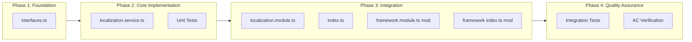
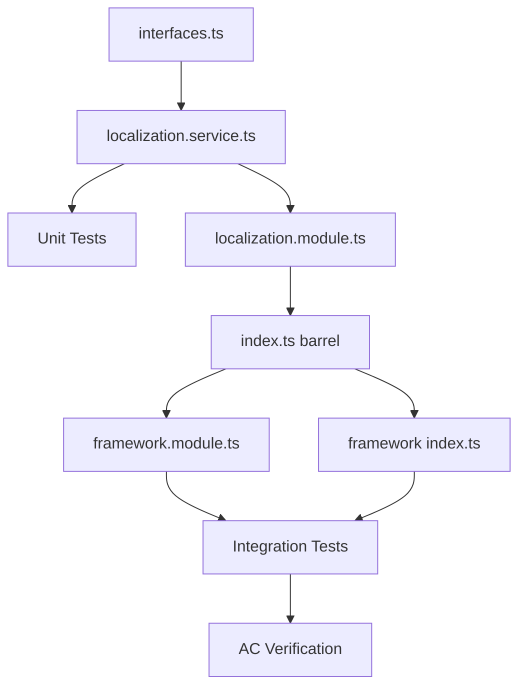

# Work Plan: LocalizationService Implementation

## Overview

| Item | Value |
|------|-------|
| Feature | LocalizationService with Fluent API |
| Scale | Medium (4-5 new files, 2 modifications) |
| Implementation Approach | Vertical Slice (Feature-driven) |
| Design Document | `docs/designs/localization-service.md` |
| Created | 2025-12-09 |

## Phase Structure Diagram

## Task Dependency Diagram

---

## Phase 1: Foundation (Types and Interfaces)

### Task 1.1: Create type definitions and interfaces
- [x] Create `libs/framework/src/localization/interfaces.ts`
- [x] Define `LangCode`, `I18nMessageValue`, `I18nLanguageMessages`, `I18nMessages` types
- [x] Define `InterpolationParams` type
- [x] Define `ILocalizationContext` interface
- [x] Define `ILocalizationService` interface
- [x] Define `I18nRegistrationOptions` interface

**Files**:
- `libs/framework/src/localization/interfaces.ts` (new)

**Verification**: L3 (Build success - `npm run build`)

**Completion Criteria**:
- [x] Implementation Complete: All type definitions from Design Doc created
- [x] Quality Complete: TypeScript compiles without errors
- [x] Integration Complete: Types exportable (verified in Task 3.1)

**AC Coverage**: AC-8 (TypeScript type-safe)

---

## Phase 2: Core Implementation

### Task 2.1: Implement LocalizationService with fluent API
- [x] Create `libs/framework/src/localization/localization.service.ts`
- [x] Implement `LocalizationService` class with NestJS `@Injectable()`
- [x] Implement `forBot(botId: number | null)` method returning `LocalizationContext`
- [x] Implement `registerI18n(namespace: string, messages: I18nMessages)` method
- [x] Implement internal I18nRegistry (Map-based storage)
- [x] Implement `LocalizationContext` class with:
  - `lang(langCode: string)` method (fluent chaining)
  - `t(key: string, params?: InterpolationParams)` method (translation resolution)
- [x] Implement fallback hierarchy: bot_messages -> messages -> i18n -> key
- [x] Implement language fallback: requested lang -> 'en'
- [x] Implement template interpolation: `{placeholder}` replacement
- [x] Implement function-based i18n message invocation
- [x] Inject `BotMessagesRepository` and `MessagesRepository` via DI
- [x] Add logging (debug/warn/error levels per Design Doc)

**Files**:
- `libs/framework/src/localization/localization.service.ts` (new)

**Dependencies**: Task 1.1 (interfaces.ts), BotMessagesRepository, MessagesRepository

**Verification**: L2 (Unit tests pass)

**Completion Criteria**:
- [x] Implementation Complete: Service implements full fluent API
- [x] Quality Complete: Type check, lint pass
- [x] Integration Complete: Repository injection verified via tests

**AC Coverage**: AC-1, AC-2, AC-3, AC-4, AC-5, AC-6, AC-9, AC-10

### Task 2.2: Create unit tests for LocalizationService
- [x] Create `libs/framework/src/localization/__tests__/localization.service.spec.ts`
- [x] Test `forBot().lang().t()` returns bot_messages override when exists (AC-1)
- [x] Test fallback to global messages when no bot override (AC-2)
- [x] Test fallback to i18n when not in DB (AC-3)
- [x] Test returns key when all fallbacks fail (AC-10)
- [x] Test language fallback to 'en' when lang not found (AC-4)
- [x] Test `{placeholder}` replacement with param values (AC-6)
- [x] Test placeholder left as-is when param not provided
- [x] Test multiple placeholder handling
- [x] Test `registerI18n()` registers namespace messages
- [x] Test function-based i18n messages with args (AC-9)
- [x] Test returns undefined for unregistered keys
- [x] Mock BotMessagesRepository and MessagesRepository

**Files**:
- `libs/framework/src/localization/__tests__/localization.service.spec.ts` (new)

**Dependencies**: Task 2.1 (localization.service.ts)

**Verification**: L2 (All unit tests pass - `npm run test`)

**Completion Criteria**:
- [x] Implementation Complete: All test cases from Design Doc implemented
- [x] Quality Complete: Tests pass, coverage >= 80%
- [x] Integration Complete: Mocked dependencies work correctly

---

## Phase 3: Integration

### Task 3.1: Create NestJS module and exports
- [x] Create `libs/framework/src/localization/localization.module.ts`
- [x] Import `DbModule` for repository access
- [x] Provide `LocalizationService`
- [x] Export `LocalizationService`
- [x] Create `libs/framework/src/localization/index.ts` (barrel export)
- [x] Export all from `interfaces.ts`
- [x] Export `LocalizationService` from service file
- [x] Export `LocalizationModule` from module file

**Files**:
- `libs/framework/src/localization/localization.module.ts` (new)
- `libs/framework/src/localization/index.ts` (new)

**Dependencies**: Task 2.1 (localization.service.ts)

**Verification**: L3 (Build success)

**Completion Criteria**:
- [x] Implementation Complete: Module configured with providers/exports
- [x] Quality Complete: Build passes
- [x] Integration Complete: Clean import paths via barrel

### Task 3.2: Integrate into FrameworkModule
- [x] Modify `libs/framework/src/framework.module.ts`
  - Import `LocalizationModule`
  - Re-export `LocalizationModule` or add to exports
- [x] Modify `libs/framework/src/index.ts`
  - Add `export * from './localization'`

**Files**:
- `libs/framework/src/framework.module.ts` (modify)
- `libs/framework/src/index.ts` (modify)

**Dependencies**: Task 3.1 (localization module and index)

**Verification**: L2 (Integration test - service injectable)

**Completion Criteria**:
- [x] Implementation Complete: LocalizationService available via FrameworkModule
- [x] Quality Complete: Build passes
- [x] Integration Complete: Can inject LocalizationService in consuming modules

**AC Coverage**: AC-7 (NestJS DI compatible)

---

## Phase 4: Quality Assurance

### Task 4.1: Create integration tests
- [ ] Create `libs/framework/src/localization/__tests__/localization.module.int.spec.ts`
- [ ] Test LocalizationService is injectable via NestJS DI (AC-7)
- [ ] Test BotMessagesRepository dependency is properly injected
- [ ] Test MessagesRepository dependency is properly injected
- [ ] Test full fallback chain with test database or mocks

**Files**:
- `libs/framework/src/localization/__tests__/localization.module.int.spec.ts` (new)

**Dependencies**: Task 3.2 (framework integration)

**Verification**: L2 (Integration tests pass)

**Completion Criteria**:
- [ ] Implementation Complete: Integration tests cover DI and fallback chain
- [ ] Quality Complete: All tests pass
- [ ] Integration Complete: Service works in real NestJS context

### Task 4.2: Final acceptance criteria verification
- [ ] Run full test suite: `npm run test`
- [ ] Run type check: `npm run type-check` (or `tsc --noEmit`)
- [ ] Run lint: `npm run lint`
- [ ] Run build: `npm run build`
- [ ] Verify all acceptance criteria:

| AC | Description | Status |
|----|-------------|--------|
| AC-1 | bot_messages override returned when exists | [ ] |
| AC-2 | messages fallback when no bot_messages | [ ] |
| AC-3 | i18n file fallback when no DB entries | [ ] |
| AC-4 | Language fallback to 'en' | [ ] |
| AC-5 | Fluent API works correctly | [ ] |
| AC-6 | Template interpolation works | [ ] |
| AC-7 | NestJS DI compatible | [ ] |
| AC-8 | TypeScript type-safe | [ ] |
| AC-9 | Function-based i18n messages work | [ ] |
| AC-10 | Never throws, returns key as last resort | [ ] |

**Verification**: L1 (Full functional verification)

**Completion Criteria**:
- [ ] Implementation Complete: All code implemented per Design Doc
- [ ] Quality Complete: All quality checks pass (test, type, lint, build)
- [ ] Integration Complete: All AC verified and passing

---

## E2E Verification Procedures (from Design Doc)

### Integration Point 1: Repository Integration
- **Components**: LocalizationService -> BotMessagesRepository, MessagesRepository
- **Verification**: Unit test with mocked repository returns expected fallback chain
- **Phase**: Phase 2 (Task 2.2)

### Integration Point 2: Module Export
- **Components**: FrameworkModule -> LocalizationService
- **Verification**: Integration test: inject LocalizationService in test module
- **Phase**: Phase 4 (Task 4.1)

### Integration Point 3: i18n File Registration
- **Components**: Bot modules -> LocalizationService.registerI18n()
- **Verification**: Unit test: registered i18n messages resolve correctly
- **Phase**: Phase 2 (Task 2.2)

---

## Risk Management

| Risk | Impact | Probability | Mitigation | Detection |
|------|--------|-------------|------------|-----------|
| Repository method signature mismatch | Medium | Low | Verify existing repo methods before implementation | Build errors |
| Circular dependency in module imports | Medium | Low | Use forwardRef if needed | Runtime errors |
| Type safety gaps in i18n messages | Medium | Low | Strict typing, avoid `any` | Type check |

---

## File Summary

### New Files (4)
1. `libs/framework/src/localization/interfaces.ts`
2. `libs/framework/src/localization/localization.service.ts`
3. `libs/framework/src/localization/localization.module.ts`
4. `libs/framework/src/localization/index.ts`

### Test Files (2)
1. `libs/framework/src/localization/__tests__/localization.service.spec.ts`
2. `libs/framework/src/localization/__tests__/localization.module.int.spec.ts`

### Modified Files (2)
1. `libs/framework/src/framework.module.ts`
2. `libs/framework/src/index.ts`

---

## Progress Tracking

| Phase | Status | Started | Completed |
|-------|--------|---------|-----------|
| Phase 1: Foundation | [x] Complete | 2025-12-09 | 2025-12-09 |
| Phase 2: Core Implementation | [x] Complete | 2025-12-09 | 2025-12-09 |
| Phase 3: Integration | [x] Complete | 2025-12-09 | 2025-12-09 |
| Phase 4: Quality Assurance | [ ] Pending | | |

---

## Notes

- **No caching**: Per user decision, simple DB queries without caching layer
- **Non-breaking addition**: Existing repository usage and i18n functions continue to work
- **Optional migration**: Consumers can adopt fluent API incrementally
