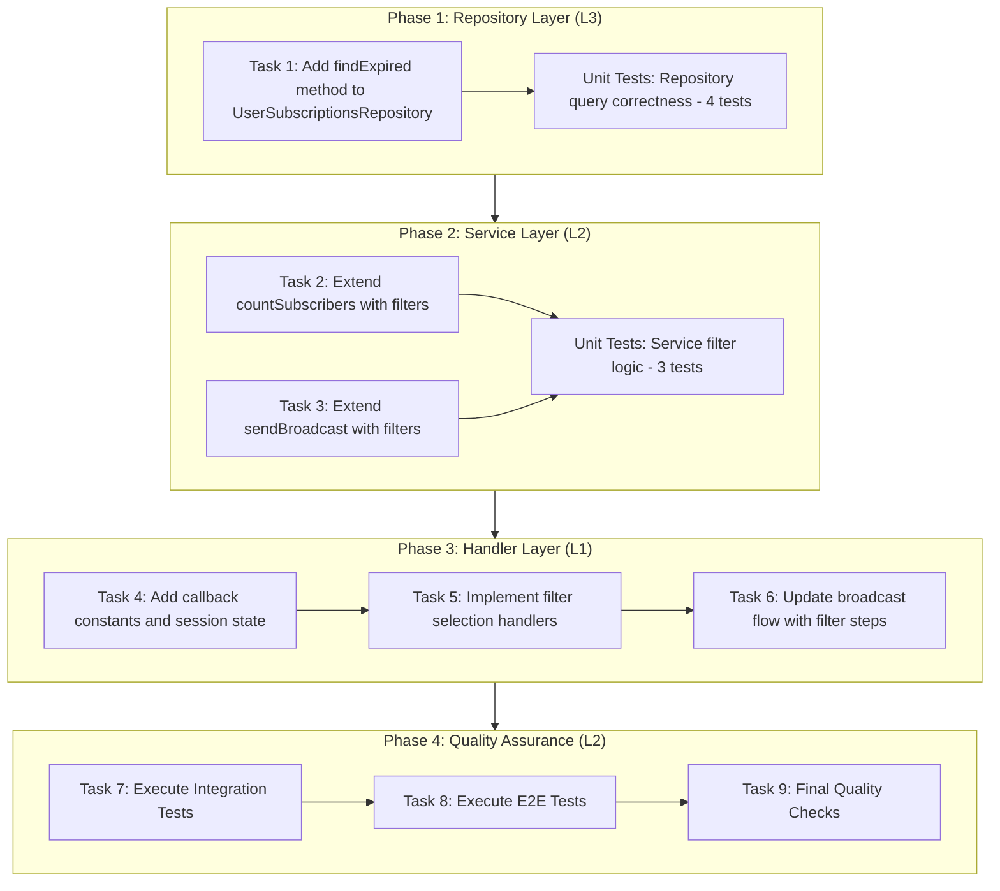
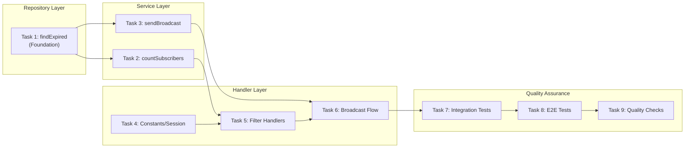

# Work Plan: Broadcast Filter Extension Implementation

**Created Date:** 2026-01-09
**Type:** feature
**Estimated Duration:** 2-3 days
**Estimated Impact:** 5 files
**Scale:** Medium (3-5 files)
**Implementation Mode:** Vertical Slice (Feature-Driven)

## Related Documents

- **Design Doc:** [docs/design/broadcast-filter-extension-design.md](../design/broadcast-filter-extension-design.md)
- **Integration Tests:** [libs/masterbot/src/services/__tests__/broadcast-filter.int.spec.ts](../../libs/masterbot/src/services/__tests__/broadcast-filter.int.spec.ts)
- **E2E Tests:** [libs/masterbot/src/__tests__/e2e/broadcast-filter-flow.e2e.spec.ts](../../libs/masterbot/src/__tests__/e2e/broadcast-filter-flow.e2e.spec.ts)
- **Prerequisite ADRs:**
  - ADR-004-multi-bot-architecture.md
  - ADR-COMMON-multi-bot-context.md
  - ADR-COMMON-message-resolution.md

## Objective

Extend the MasterBot broadcast functionality with two new filtering capabilities:
1. **Expired Subscription Filter**: Broadcast to users whose signals subscriptions have expired (re-engagement mechanism)
2. **Bot-specific Filter**: Broadcast to users of a specific bot or all bots

## Background

### Current State
- Broadcast targets only active subscribers (`isActive = true AND expiresAt >= NOW()`)
- No filtering by bot (sends to all subscribers regardless of bot)
- No ability to combine filters for targeted campaigns

### Target State
- Manager can choose Active OR Expired signals subscribers
- Manager can choose All bots OR specific bot
- Filters can be combined (e.g., expired subscribers of a specific bot)
- Preview shows selected filters and recipient count

## Phase Structure Diagram



## Task Dependency Diagram



---

## Risks and Countermeasures

### Technical Risks

| Risk | Impact | Probability | Mitigation |
|------|--------|-------------|------------|
| Performance degradation for large expired user sets | Medium | Low | Add database index, implement pagination if needed |
| Session state complexity increase | Low | Medium | Clear session reset on cancel, defensive initialization |
| Filter state loss during long flows | Medium | Low | Store filters early, validate before send |
| Backward compatibility regression | High | Low | Extensive testing of default (no filter) flow |

### Rollback Considerations

1. **Database Index Removal**: `DROP INDEX IF EXISTS idx_user_subscriptions_expired;`
2. **Session State Clearing**: Reset filter-related fields (`broadcastFilterStatus`, `broadcastFilterBotId`)
3. **Handler Level Bypass**: Skip filter selection, proceed directly to message input
4. **Full Code Rollback**: Revert files in reverse order (handler -> service -> repository)

---

## Phase 1: Repository Layer (L3 Verification)

### Task 1: Add findExpired method to UserSubscriptionsRepository

**Priority:** High (Foundation)
**Verification Level:** L3 (Build Success)
**Acceptance Criteria:** AC1 (Expired Subscription Filter)
**Pattern Reference:** `findExpiring` method (line 67-113) in `user-subscriptions.repository.ts`

**Files:**
- `libs/db/src/repositories/user-subscriptions.repository.ts`

**Implementation Steps:**
- [x] Add `findExpired(subscriptionType?, botId?, subscriptionId?)` method following `findExpiring` pattern
- [x] Implement Drizzle ORM conditions:
  - `isActive = false` (contrast to `findExpiring` which uses `isActive = true`)
  - `expiresAt IS NOT NULL`
  - `expiresAt < NOW()` (contrast to `findExpiring` date check)
  - `bot_users.is_active = true` (only active bot users)
- [x] Add optional `subscriptionType` filter (same logic as `findExpiring`)
- [x] Add optional `botId` filter
- [x] Add optional `subscriptionId` filter (new: not in `findExpiring`)
- [x] Return consistent shape: `Array<{ botUser, subscription, userSubscription }>`

**Unit Tests to Create (4 tests):**
- [x] `findExpired` returns only expired subscriptions with correct return shape
- [x] `findExpired` with `subscriptionType=signals` returns only signals subscriptions
- [x] `findExpired` with `botId` returns only that bot's expired subscribers
- [x] `findExpired` with `subscriptionId` returns only that subscription's expired users

**Integration Test Resolution:** 4/8 repository tests

**Quality Check:**
```bash
npm run check
npm run build
npm test -- libs/db/src/repositories/__tests__/user-subscriptions.repository.spec.ts
```

**Completion Criteria:**
- [x] Implementation complete: `findExpired` method follows `findExpiring` pattern exactly
- [x] Quality complete: Build succeeds, unit tests pass (5 tests: 4 core + 1 empty array)
- [x] Integration ready: Return type consistent with `findExpiring`

---

## Phase 2: Service Layer (L2 Verification)

### Task 2: Extend countSubscribers with filter parameters

**Priority:** High
**Verification Level:** L2 (Test Operation)
**Acceptance Criteria:** AC1, AC2, AC3
**Dependencies:** Task 1 (Repository `findExpired` method)

**Files:**
- `libs/masterbot/src/services/broadcast.service.ts`

**Implementation Steps:**
- [x] Extend `countSubscribers` method signature:
  ```typescript
  async countSubscribers(
    subscriptionId: number,
    filterStatus?: 'active' | 'expired',
    filterBotId?: number | null,
  ): Promise<number>
  ```
- [x] Add conditional logic:
  - `filterStatus = 'active'` (default): Use existing `findActiveBySubscriptionId`
  - `filterStatus = 'expired'`: Call `findExpired` with appropriate parameters
- [x] Handle `filterBotId` parameter for bot filtering

**Unit Tests to Create (part of 3 service tests):**
- [x] `countSubscribers` without filters returns active subscriber count (backward compatibility)
- [x] `countSubscribers` with `filterStatus='expired'` calls `findExpired`
- [x] `countSubscribers` with combined filters returns correct count

**Integration Test Resolution:** AC5, AC1, AC3 coverage

**Quality Check:**
```bash
npm run check
npm run build
npm test -- libs/masterbot/src/services/__tests__/broadcast.service.spec.ts
```

**Completion Criteria:**
- [x] Implementation complete: `countSubscribers` supports filter parameters
- [x] Quality complete: Unit tests pass, backward compatibility verified
- [x] Integration ready: Default behavior identical to pre-filter implementation

### Task 3: Extend sendBroadcast with filter parameters

**Priority:** High
**Verification Level:** L2 (Test Operation)
**Acceptance Criteria:** AC1, AC2, AC3
**Dependencies:** Task 1, Task 2

**Files:**
- `libs/masterbot/src/services/broadcast.service.ts`

**Implementation Steps:**
- [x] Extend `sendBroadcast` method signature:
  ```typescript
  async sendBroadcast(
    subscriptionId: number,
    message: string,
    entities: MessageEntity[] | undefined,
    managerId: number,
    filterStatus?: 'active' | 'expired',
    filterBotId?: number | null,
  ): Promise<BroadcastResultDto>
  ```
- [x] Add conditional logic to query appropriate subscribers:
  - `filterStatus = 'active'`: Use existing subscriber query
  - `filterStatus = 'expired'`: Use `findExpired` with filters
- [x] Add logging: `Broadcast filter: status=${filterStatus}, botId=${filterBotId || 'all'}`

**Unit Tests to Create:**
- [x] `sendBroadcast` with filter parameters respects filter selection
- [x] `sendBroadcast` without filters works identically to existing implementation

**Quality Check:**
```bash
npm run check
npm run build
npm test -- libs/masterbot/src/services/__tests__/broadcast.service.spec.ts
```

**Completion Criteria:**
- [x] Implementation complete: `sendBroadcast` supports filter parameters
- [x] Quality complete: Unit tests pass
- [x] Integration ready: Works with extended `countSubscribers`

---

## Phase 3: Handler Layer (L1 Verification)

### Task 4: Add callback constants and session state fields

**Priority:** Medium
**Verification Level:** L3 (Build Success)
**Acceptance Criteria:** AC1, AC2, AC4
**Dependencies:** None (can run in parallel with Phase 2)

**Files:**
- `libs/masterbot/src/constants.ts`
- `libs/masterbot/src/interfaces/user-context.interface.ts`

**Implementation Steps:**

**Constants:**
- [x] Add filter callback constants:
  ```typescript
  BROADCAST_FILTER_ACTIVE: 'broadcast_filter_active',
  BROADCAST_FILTER_EXPIRED: 'broadcast_filter_expired',
  BROADCAST_BOT_ALL: 'broadcast_bot_all',
  BROADCAST_BOT_PREFIX: 'broadcast_bot_',  // broadcast_bot_{id}
  ```

**Session State:**
- [x] Add new flow states to `flowState` type:
  ```typescript
  | 'selecting_status_filter'
  | 'selecting_bot_filter'
  ```
- [x] Add filter fields to session state:
  ```typescript
  broadcastFilterStatus?: 'active' | 'expired' | null;
  broadcastFilterBotId?: number | null;
  ```

**Quality Check:**
```bash
npm run check
npm run build
```

**Completion Criteria:**
- [x] Implementation complete: Constants and types defined
- [x] Quality complete: Build succeeds, type check passes
- [x] Integration ready: Types available for handler implementation

### Task 5: Implement filter selection handlers

**Priority:** High
**Verification Level:** L1 (Functional Operation)
**Acceptance Criteria:** AC1, AC2, AC4
**Dependencies:** Task 4 (Constants/Session state)

**Files:**
- `libs/masterbot/src/masterbot.update.ts`

**Implementation Steps:**
- [x] Add handler for `broadcast_filter_active` callback:
  - Set `session.broadcastFilterStatus = 'active'`
  - Set `session.flowState = 'selecting_bot_filter'`
  - Show bot selection keyboard
- [x] Add handler for `broadcast_filter_expired` callback:
  - Set `session.broadcastFilterStatus = 'expired'`
  - Set `session.flowState = 'selecting_bot_filter'`
  - Show bot selection keyboard
- [x] Add handler for `broadcast_bot_all` callback:
  - Set `session.broadcastFilterBotId = null`
  - Set `session.flowState = 'awaiting_broadcast_message'`
  - Send "Enter your message" prompt
- [x] Add handler for `broadcast_bot_{id}` callback:
  - Parse bot ID from callback data
  - Validate bot exists via `botsRepository.findById()`
  - Set `session.broadcastFilterBotId = botId`
  - Set `session.flowState = 'awaiting_broadcast_message'`
  - Send "Enter your message" prompt
- [x] Implement `showStatusFilterKeyboard()` helper method
- [x] Implement `showBotFilterKeyboard()` helper method (calls `botsRepository.findAllActive()`)

**Quality Check:**
```bash
npm run check
npm run build
npm test -- libs/masterbot/src/__tests__/masterbot.update.spec.ts
```

**Completion Criteria:**
- [x] Implementation complete: All filter callbacks handled
- [x] Quality complete: Handlers properly update session state
- [x] Integration ready: Bot list retrieved from `BotsRepository`

### Task 6: Update broadcast flow with filter steps

**Priority:** High
**Verification Level:** L1 (Functional Operation)
**Acceptance Criteria:** AC1, AC2, AC3, AC4, AC5
**Dependencies:** Task 2, Task 3, Task 5

**Files:**
- `libs/masterbot/src/masterbot.update.ts`

**Implementation Steps:**
- [x] Modify `onBroadcastSubscriptionSelected` handler:
  - After storing `subscriptionId`, set `flowState = 'selecting_status_filter'`
  - Show status filter keyboard (Active/Expired)
- [x] Update message input handler to pass filters to `countSubscribers`:
  ```typescript
  const count = await broadcastService.countSubscribers(
    subscriptionId,
    session.broadcastFilterStatus,
    session.broadcastFilterBotId,
  );
  ```
- [x] Update preview message to show filter selections:
  - Target: Active/Expired subscribers
  - Bot: All bots / [Bot Name]
  - Recipients: N users
- [x] Update broadcast confirmation handler:
  ```typescript
  await broadcastService.sendBroadcast(
    subscriptionId,
    message,
    entities,
    managerId,
    session.broadcastFilterStatus,
    session.broadcastFilterBotId,
  );
  ```
- [x] Initialize filter defaults in session: `broadcastFilterStatus = null`, `broadcastFilterBotId = null`
- [x] Reset filter state on cancel or flow completion

**Quality Check:**
```bash
npm run check
npm run build
npm test -- libs/masterbot/src/__tests__/masterbot.update.spec.ts
```

**Completion Criteria:**
- [x] Implementation complete: Filter selection integrated into broadcast flow
- [x] Quality complete: All handlers work correctly
- [x] Integration ready: Full flow operational with filters

---

## Phase 4: Quality Assurance (L2 Verification)

### Task 7: Execute Integration Tests

**Priority:** High
**Verification Level:** L2 (Test Operation)
**Acceptance Criteria:** AC1, AC3, AC5
**Dependencies:** Tasks 1-6 complete

**Files:**
- `libs/masterbot/src/services/__tests__/broadcast-filter.int.spec.ts`

**Implementation Steps:**
- [ ] Resolve `it.todo`: AC5 - countSubscribers without filters returns active subscriber count
- [ ] Resolve `it.todo`: AC1 - countSubscribers with filterStatus=expired calls findExpired
- [ ] Resolve `it.todo`: AC3 - countSubscribers with combined filters returns correct count
- [ ] Resolve `it.todo`: AC1 - findExpired returns correct shape
- [ ] Resolve `it.todo`: AC1 - findExpired with subscriptionType=signals filter
- [ ] Resolve `it.todo`: AC2 - findExpired with botId filter
- [ ] Resolve `it.todo`: AC1 - findExpired with subscriptionId filter
- [ ] Resolve `it.todo`: AC2 - findAllActive returns active bots

**Test Resolution Progress:** 0/8 -> 8/8

**Quality Check:**
```bash
npm test -- libs/masterbot/src/services/__tests__/broadcast-filter.int.spec.ts
```

**Completion Criteria:**
- [ ] Implementation complete: All 8 integration tests implemented and passing
- [ ] Quality complete: No failing tests
- [ ] Integration ready: Service layer fully verified

### Task 8: Execute E2E Tests

**Priority:** High
**Verification Level:** L1 (Functional Operation)
**Acceptance Criteria:** All AC (AC1-AC5)
**Dependencies:** Task 7 complete

**Files:**
- `libs/masterbot/src/__tests__/e2e/broadcast-filter-flow.e2e.spec.ts`

**Implementation Steps:**
- [x] Resolve `it.todo`: User Journey - Manager sends broadcast to expired subscribers only
- [x] Resolve `it.todo`: User Journey - Manager sends broadcast with combined filters
- [x] Resolve `it.todo`: Default broadcast flow works identically (backward compatibility)
- [x] Resolve `it.todo`: Error handling - No expired subscribers found

**Test Resolution Progress:** 4/4 -> 4/4

**Quality Check:**
```bash
npm test -- libs/masterbot/src/__tests__/e2e/broadcast-filter-flow.e2e.spec.ts
```

**Completion Criteria:**
- [x] Implementation complete: All 4 E2E tests implemented and passing
- [x] Quality complete: Full user journeys verified
- [x] Integration ready: End-to-end functionality confirmed

### Task 9: Final Quality Checks

**Priority:** High
**Verification Level:** L2 (Test Operation)
**Acceptance Criteria:** All AC achieved
**Dependencies:** Tasks 7, 8

**Quality Check Commands:**
```bash
# Full quality check suite
npm run check           # Biome (lint + format)
npm run check:unused    # Detect unused exports
npm run build           # TypeScript build
npm test                # All tests
npm run test:coverage   # Coverage measurement
npm run check:all       # Overall integrated check
```

**Completion Criteria:**
- [ ] All linting checks pass
- [ ] No unused exports
- [ ] Build succeeds without errors
- [ ] All unit tests pass
- [ ] All integration tests pass (8 tests)
- [ ] All E2E tests pass (4 tests)
- [ ] Coverage meets 70% threshold
- [ ] Design Doc acceptance criteria verified

---

## Operational Verification Procedures (from Design Doc)

### Integration Point 1: Repository -> Service

**Components:** `UserSubscriptionsRepository` -> `BroadcastService`

**Verification:**
1. Add debug log in `findExpired` showing query parameters
2. Verify return shape matches `findExpiring` exactly
3. Confirm `countSubscribers` uses correct repository method based on `filterStatus`

### Integration Point 2: Service -> Handler

**Components:** `BroadcastService` -> `MasterbotUpdate`

**Verification:**
1. Verify session state correctly tracks filter selections
2. Confirm `sendBroadcast` receives filter parameters from session
3. Check preview count matches actual recipient list

### Integration Point 3: Handler -> User

**Components:** `MasterbotUpdate` -> Telegram UI

**Verification:**
1. Status filter keyboard displays correctly: "Active subscribers" / "Expired subscribers"
2. Bot filter keyboard shows all active bots with names
3. Preview message shows filter descriptions and accurate count
4. Broadcast confirmation uses correct filter parameters

---

## Test Summary

### Unit Tests to Implement

| File | AC | Test Description | Status |
|------|----|--------------------|--------|
| `user-subscriptions.repository.spec.ts` | AC1 | findExpired returns correct shape | **Done** |
| `user-subscriptions.repository.spec.ts` | AC1 | findExpired with subscriptionType filter | **Done** |
| `user-subscriptions.repository.spec.ts` | AC2 | findExpired with botId filter | **Done** |
| `user-subscriptions.repository.spec.ts` | AC1 | findExpired with subscriptionId filter | **Done** |
| `user-subscriptions.repository.spec.ts` | AC1 | findExpired returns empty array | **Done** |
| `broadcast.service.spec.ts` | AC5 | countSubscribers backward compatibility | **Done** |
| `broadcast.service.spec.ts` | AC1 | countSubscribers with expired filter | **Done** |
| `broadcast.service.spec.ts` | AC3 | countSubscribers with combined filters | **Done** |

**Total Unit Tests:** 7 new tests

### Integration Tests (from generated file)

| File | AC | Test Description | Status |
|------|----|--------------------|--------|
| `broadcast-filter.int.spec.ts` | AC5 | countSubscribers backward compatibility | **Done** |
| `broadcast-filter.int.spec.ts` | AC1 | countSubscribers with expired filter | **Done** |
| `broadcast-filter.int.spec.ts` | AC3 | Combined filter count | **Done** |
| `broadcast-filter.int.spec.ts` | AC1 | findExpired return shape | it.todo |
| `broadcast-filter.int.spec.ts` | AC1 | findExpired subscriptionType filter | it.todo |
| `broadcast-filter.int.spec.ts` | AC2 | findExpired botId filter | it.todo |
| `broadcast-filter.int.spec.ts` | AC1 | findExpired subscriptionId filter | it.todo |
| `broadcast-filter.int.spec.ts` | AC2 | findAllActive bots | it.todo |

**Total Integration Tests:** 8 tests

### E2E Tests (from generated file)

| File | AC | Test Description | Status |
|------|----|--------------------|--------|
| `broadcast-filter-flow.e2e.spec.ts` | AC1,AC4 | Expired subscribers broadcast (all bots) | **Pass** |
| `broadcast-filter-flow.e2e.spec.ts` | AC1-4 | Combined filters broadcast | **Pass** |
| `broadcast-filter-flow.e2e.spec.ts` | AC5 | Default flow backward compatibility | **Pass** |
| `broadcast-filter-flow.e2e.spec.ts` | Edge | No expired subscribers handling | **Pass** |

**Total E2E Tests:** 4 tests (4 passing)

---

## Quality Checklist

- [ ] Design Doc consistency verification
- [ ] Phase composition based on technical dependencies
- [ ] All requirements converted to tasks
- [ ] Quality assurance exists in final phase
- [ ] E2E verification procedures placed at integration points
- [ ] Test design information reflected
  - [ ] Setup tasks placed in first phase
  - [ ] Risk level-based prioritization applied
  - [ ] AC and test case traceability specified
  - [ ] Quantitative test resolution progress indicators set for each phase

---

## Progress Tracking

### Phase Completion

- [x] Phase 1: Repository Layer (Task 1)
- [x] Phase 2: Service Layer (Tasks 2, 3)
- [x] Phase 3: Handler Layer (Tasks 4, 5, 6)
- [ ] Phase 4: Quality Assurance (Tasks 7, 8, 9)

### Test Resolution Progress

| Phase | Tests | Resolved |
|-------|-------|----------|
| Phase 1 | 4 unit | 5/5 (4 core + 1 empty) |
| Phase 2 | 6 unit (Task 2 + Task 3) | 12/12 (6 countSubscribers + 6 sendBroadcast) |
| Phase 3 | Handler tests | 31/31 (Task 5: 23 + Task 6: 8) |
| Phase 4 | 5 integration + 4 E2E | 4/9 (E2E complete) |
| **Total** | **19+** | **52/56+** |

### Phase 1
- Start: 2026-01-09 12:15
- Complete: 2026-01-09 12:22
- Notes: `findExpired` method implemented following `findExpiring` pattern. 5 unit tests added and passing. Build succeeds.

### Phase 2 - Task 2
- Start: 2026-01-09 12:25
- Complete: 2026-01-09 12:35
- Notes: `countSubscribers` extended with filter parameters. 6 unit tests passing (3 unit + 3 integration). Build succeeds. Backward compatibility verified.

### Phase 2 - Task 3
- Start: 2026-01-09 14:43
- Complete: 2026-01-09 14:47
- Notes: `sendBroadcast` extended with filter parameters. 6 new unit tests (3 filter tests + 2 backward compatibility + 1 logging). All 12 broadcast service tests pass. Build succeeds.

### Phase 3 - Task 5
- Start: 2026-01-09 15:05
- Complete: 2026-01-09 15:30
- Notes: Filter selection handlers implemented: `onBroadcastFilterActive`, `onBroadcastFilterExpired`, `onBroadcastBotAll`, `onBroadcastBotSelected`. Helper methods `showStatusFilterKeyboard()` and `showBotFilterKeyboard()` created. `BotsRepository` injected into MasterbotUpdate. 23 unit tests added and passing. Build succeeds.

### Phase 3 - Task 6
- Start: 2026-01-09 21:15
- Complete: 2026-01-09 21:25
- Notes: Updated broadcast flow to integrate filter selection. Modified `onBroadcastSubscriptionSelected` to show status filter keyboard. Updated `handleBroadcastMessageInput` to pass filters to `countSubscribers`. Updated preview message to show filter selections (Target/Bot/Recipients). Updated `onBroadcastConfirm` to pass filters to `sendBroadcast`. Added filter defaults to `ensureSession`. Reset filter state on cancel/completion. 8 new unit tests added. All 31 handler tests pass. Build succeeds.

### Phase 4 - Task 8 (E2E Tests)
- Start: 2026-01-09 15:38
- Complete: 2026-01-09 15:42
- Notes: All 4 E2E tests implemented and passing. Tests cover: expired subscribers broadcast (all bots), combined filters (expired + specific bot), backward compatibility (active subscribers default flow), and error handling (no expired subscribers found). Full user journeys verified.

---

## Completion Criteria

- [ ] All phases completed
- [ ] Each phase's operational verification procedures executed
- [ ] Design Doc acceptance criteria satisfied (AC1-AC5)
- [ ] Staged quality checks completed (zero errors)
- [ ] All tests pass (19+ tests)
- [ ] Coverage meets 70% threshold
- [ ] Backward compatibility verified (AC5)
- [ ] User review approval obtained

---

## Update History

| Date | Version | Changes | Author |
|------|---------|---------|--------|
| 2026-01-09 | 1.0.0 | Initial version | Claude Code |
