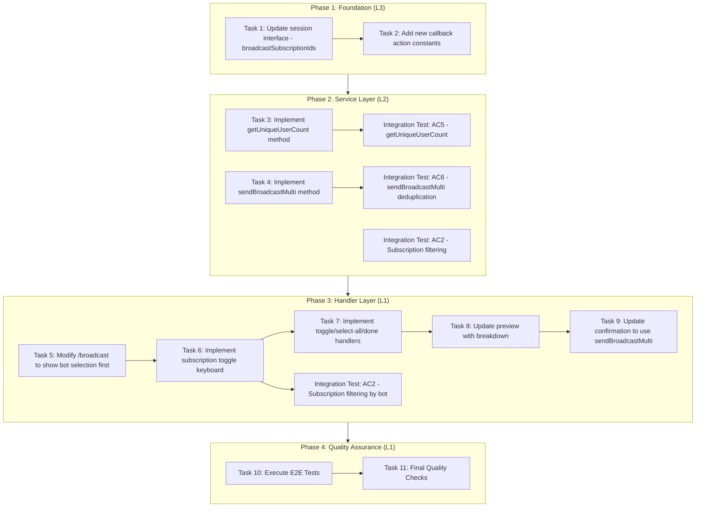
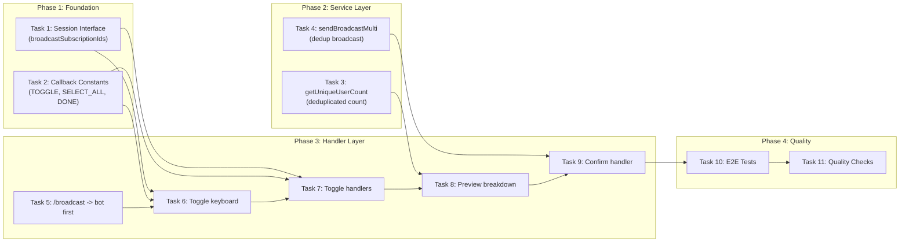

# Work Plan: Broadcast Flow Redesign Implementation

**Created Date:** 2026-01-12
**Type:** feature
**Estimated Duration:** 2-3 days
**Estimated Impact:** 6 files
**Scale:** Medium (3-5 files)
**Implementation Mode:** Vertical Slice (Feature-Driven)

## Related Documents

- **Design Doc:** [docs/design/broadcast-flow-redesign-design.md](../design/broadcast-flow-redesign-design.md)
- **Integration Tests:** [libs/masterbot/src/__tests__/broadcast-flow-redesign.int.test.ts](../../libs/masterbot/src/__tests__/broadcast-flow-redesign.int.test.ts)
- **E2E Tests:** [libs/masterbot/src/__tests__/e2e/broadcast-flow-redesign.e2e.spec.ts](../../libs/masterbot/src/__tests__/e2e/broadcast-flow-redesign.e2e.spec.ts)
- **Prerequisite ADRs:**
  - ADR-004-multi-bot-architecture.md
  - ADR-COMMON-multi-bot-context.md
  - ADR-COMMON-signal-broadcasting.md
- **Related Design Docs:**
  - broadcast-filter-extension-design.md (previous filter extension - provides base patterns)
  - subscription-broadcast-design.md (original broadcast foundation)

## Objective

Redesign the MasterBot `/broadcast` command flow to:
1. Start with bot selection immediately after command (instead of subscription)
2. Allow multiple subscription selection with toggle buttons
3. Show unique user count with per-subscription breakdown in preview
4. Deduplicate users when broadcasting to multiple subscriptions

## Background

### Current State (from previous broadcast-filter-extension)
- Flow: /broadcast -> subscription -> status -> bot -> message -> confirmation
- Single subscription selection only
- Subscription shown before bot selection is made

### Target State
- Flow: /broadcast -> bot -> subscriptions (multiple) -> status -> message -> confirmation
- Multiple subscriptions can be selected via toggle UI
- Preview shows deduplicated user count with breakdown
- Users in multiple subscriptions receive message only once

## Phase Structure Diagram



## Task Dependency Diagram



---

## Risks and Countermeasures

### Technical Risks

| Risk | Impact | Probability | Mitigation |
|------|--------|-------------|------------|
| Session array state complexity | Medium | Medium | Clear initialization, defensive null checks |
| Keyboard button limit exceeded | Low | Low | Pagination for many subscriptions (deferred) |
| Deduplication query performance | Medium | Low | Use efficient SQL with DISTINCT |
| User confusion with new flow order | Medium | Medium | Clear UI labels, help text in messages |
| Backward compatibility with single subscription | Low | Low | sendBroadcastMulti handles single-element arrays |

### Schedule Risks

| Risk | Impact | Probability | Mitigation |
|------|--------|-------------|------------|
| Complex toggle state management | Medium | Medium | Start with simpler implementation, iterate |
| Integration test complexity | Low | Medium | Use existing test patterns from broadcast-filter |

---

## Phase 1: Foundation (L3 Verification)

**Purpose:** Establish type definitions and constants required for multi-subscription flow

### Task 1: Update session interface with broadcastSubscriptionIds

**Priority:** High (Foundation)
**Verification Level:** L3 (Build Success)
**Acceptance Criteria:** Supports AC3 (Multiple Subscription Selection)
**Pattern Reference:** Existing `broadcastFilterStatus` and `broadcastFilterBotId` session fields

**Files:**
- `libs/masterbot/src/interfaces/user-context.interface.ts`

**Implementation Steps:**
- [x] Add `broadcastSubscriptionIds?: number[] | null` to session state
- [x] Add `'selecting_subscriptions'` to flowState union type
- [x] Keep deprecated `broadcastSubscriptionId` for transition compatibility

**Completion Criteria:**
- [x] Implementation complete: New session fields defined
- [x] Quality complete: Build succeeds, type check passes
- [x] Integration ready: Types available for handler implementation

### Task 2: Add new callback action constants

**Priority:** High (Foundation)
**Verification Level:** L3 (Build Success)
**Acceptance Criteria:** Supports AC3 (Multiple Subscription Selection UI)

**Files:**
- `libs/masterbot/src/constants.ts`

**Implementation Steps:**
- [ ] Add `BROADCAST_SUB_TOGGLE_PREFIX: 'broadcast_sub_toggle_'` constant
- [ ] Add `BROADCAST_SUB_SELECT_ALL: 'broadcast_sub_select_all'` constant
- [ ] Add `BROADCAST_SUB_DONE: 'broadcast_sub_done'` constant

**Completion Criteria:**
- [ ] Implementation complete: Constants defined
- [ ] Quality complete: Build succeeds
- [ ] Integration ready: Constants available for handlers

#### Phase 1 Quality Check
```bash
npm run check
npm run build
```

#### Phase 1 Completion Criteria
- [x] Session interface updated with `broadcastSubscriptionIds` array type
- [ ] All new callback constants defined
- [x] Type checking passes without errors (for Task 1)

---

## Phase 2: Service Layer (L2 Verification)

**Purpose:** Implement service methods for multi-subscription user counting and broadcasting

### Task 3: Implement getUniqueUserCount method

**Priority:** High
**Verification Level:** L2 (Test Operation)
**Acceptance Criteria:** AC5 (Preview with User Count Breakdown)
**Dependencies:** None (independent service method)

**Files:**
- `libs/masterbot/src/services/broadcast.service.ts`

**Implementation Steps:**
- [x] Add `getUniqueUserCount(subscriptionIds: number[], filterStatus: 'active' | 'expired', filterBotId: number | null)` method
- [x] Query subscribers for each subscription using existing `findSubscribersWithUserDetails` or equivalent
- [x] Deduplicate users by `botUser.userId` to get unique count
- [x] Calculate per-subscription breakdown (raw counts, may overlap)
- [x] Return `{ total: number, breakdown: Array<{subscriptionId, name, count}> }`

**Data Contract (from Design Doc):**
```yaml
Input:
  subscriptionIds: number[] (at least 1)
  filterStatus: 'active' | 'expired'
  filterBotId: number | null
Output:
  UserCountBreakdown { total, breakdown }
Guarantees:
  - total = count of unique users (deduplicated by userId)
  - breakdown[].count may overlap (user in multiple subs)
  - sum(breakdown[].count) >= total
```

**Unit Tests to Create:**
- [x] `getUniqueUserCount` with single subscription returns correct total
- [x] `getUniqueUserCount` with multiple subscriptions returns deduplicated total
- [x] `getUniqueUserCount` returns correct breakdown per subscription
- [x] `getUniqueUserCount` handles filterStatus correctly
- [x] `getUniqueUserCount` handles filterBotId correctly

**Integration Test (AC5):**
- [ ] Resolve `it.todo('AC5: getUniqueUserCount returns deduplicated total with per-subscription breakdown')`

**Completion Criteria:**
- [x] Implementation complete: Method returns accurate deduplicated counts
- [x] Quality complete: Unit tests pass
- [ ] Integration ready: Can be called from handler layer

### Task 4: Implement sendBroadcastMulti method

**Priority:** High
**Verification Level:** L2 (Test Operation)
**Acceptance Criteria:** AC6 (Broadcast Execution with Deduplication)
**Dependencies:** Task 3 (for consistent deduplication logic)

**Files:**
- `libs/masterbot/src/services/broadcast.service.ts`

**Implementation Steps:**
- [x] Add `sendBroadcastMulti(subscriptionIds: number[], message: string, entities: MessageEntity[] | undefined, managerId: number, filterStatus: 'active' | 'expired', filterBotId: number | null)` method
- [x] Collect users from all subscriptions
- [x] Deduplicate by `botUser.userId` (same logic as getUniqueUserCount)
- [x] Send message to each unique user only once
- [x] Return `BroadcastResultDto` with deduplicated counts

**Data Contract (from Design Doc):**
```yaml
Input:
  subscriptionIds: number[]
  message: string (1-4096 chars)
  entities: MessageEntity[] | undefined
  managerId: number
  filterStatus: 'active' | 'expired'
  filterBotId: number | null
Output:
  BroadcastResultDto
Guarantees:
  - Each user receives message at most once (deduplication)
  - Result reflects deduplicated count
```

**Unit Tests to Create:**
- [x] `sendBroadcastMulti` deduplicates users across subscriptions
- [x] `sendBroadcastMulti` works with single subscription (backward compatible)
- [x] `sendBroadcastMulti` respects filterStatus parameter
- [x] `sendBroadcastMulti` respects filterBotId parameter
- [x] `sendBroadcastMulti` calls NotificationService with unique user list

**Integration Test (AC6):**
- [ ] Resolve `it.todo('AC6: sendBroadcastMulti deduplicates users across multiple subscriptions')`

**Completion Criteria:**
- [x] Implementation complete: Users receive message at most once
- [x] Quality complete: Unit tests pass, deduplication verified
- [ ] Integration ready: Can be called from confirmation handler

#### Phase 2 Quality Check
```bash
npm run check
npm run build
npm test -- libs/masterbot/src/services/__tests__/broadcast.service.spec.ts
```

#### Phase 2 Completion Criteria
- [ ] `getUniqueUserCount` method implemented and tested
- [ ] `sendBroadcastMulti` method implemented and tested
- [ ] Integration tests AC5 and AC6 resolved (Red -> Green)
- [ ] All unit tests pass

---

## Phase 3: Handler Layer (L1 Verification)

**Purpose:** Implement new broadcast flow with bot-first selection and multi-subscription toggle UI

### Task 5: Modify /broadcast to show bot selection first

**Priority:** High
**Verification Level:** L1 (Functional Operation)
**Acceptance Criteria:** AC1 (Bot Selection First)
**Dependencies:** None (modifies existing handler)

**Files:**
- `libs/masterbot/src/broadcast.update.ts`

**Implementation Steps:**
- [x] Modify `onBroadcastCommand` handler to show bot selection keyboard immediately
- [x] Reuse existing `showBotFilterKeyboard()` helper (from broadcast-filter-extension)
- [x] Set `flowState = 'selecting_bot_filter'` (repurposed as FIRST step)
- [x] Clear any previous session state for clean start

**Completion Criteria:**
- [x] Implementation complete: /broadcast shows bot list first
- [x] Quality complete: Handler correctly updates session state
- [x] Integration ready: Bot selection triggers subscription list

### Task 6: Implement subscription toggle keyboard

**Priority:** High
**Verification Level:** L1 (Functional Operation)
**Acceptance Criteria:** AC2 (Subscription Filtering by Bot), AC3 (Multiple Selection)
**Dependencies:** Task 1 (session state), Task 2 (constants)

**Files:**
- `libs/masterbot/src/broadcast.update.ts`

**Implementation Steps:**
- [ ] Modify bot selection handler (`onBroadcastBotSelected`) to show subscription toggle keyboard
- [ ] Set `flowState = 'selecting_subscriptions'`
- [ ] Implement `showSubscriptionToggleKeyboard()` helper method:
  - Query subscriptions with `subscriptionsRepository.findActiveSubscriptions()`
  - For each subscription, call `countSubscribers(subId, 'active', botId)` to get count for selected bot
  - Filter out subscriptions with count=0 (unless ALL are 0, then show all - fallback)
  - Build toggle buttons: `[v] Sub Name (N users)` or `[ ] Sub Name (N users)`
  - Add "Select All" button
  - Add "Done" and "Cancel" buttons
- [ ] Initialize `ctx.session.broadcastSubscriptionIds = []`

**UI Specification (from Design Doc):**
```
Select subscriptions for broadcast:
Bot: QuantumDealBot

[ ] Premium Signals (45 users)
[v] Basic Signals (120 users)
[v] Free Tier (230 users)

[Select All]
[Done]  [Cancel]
```

**Integration Test (AC2):**
- [ ] Resolve `it.todo('AC2: Subscription filtering shows only subscriptions with subscribers for selected bot')`

**Completion Criteria:**
- [ ] Implementation complete: Toggle keyboard displays correctly
- [ ] Quality complete: Counts shown per selected bot
- [ ] Integration ready: Toggle state ready for handlers

### Task 7: Implement toggle/select-all/done handlers

**Priority:** High
**Verification Level:** L1 (Functional Operation)
**Acceptance Criteria:** AC3 (Multiple Subscription Selection)
**Dependencies:** Task 6 (keyboard)

**Files:**
- `libs/masterbot/src/broadcast.update.ts`

**Implementation Steps:**
- [ ] Implement `onBroadcastSubscriptionToggle` handler for `broadcast_sub_toggle_{id}`:
  - Parse subscription ID from callback data
  - Toggle: if ID in array, remove; if not in array, add
  - Refresh keyboard to show updated checkmarks
- [ ] Implement `onBroadcastSelectAll` handler for `broadcast_sub_select_all`:
  - Set `broadcastSubscriptionIds` to all displayed subscription IDs
  - Refresh keyboard with all checkmarks
- [ ] Implement `onBroadcastSubscriptionsDone` handler for `broadcast_sub_done`:
  - Validate `broadcastSubscriptionIds.length >= 1`
  - If empty, show warning "Please select at least one subscription"
  - If valid, proceed to status filter: `flowState = 'selecting_status_filter'`
  - Show status filter keyboard (existing `showStatusFilterKeyboard()`)

**Unit Tests to Create:**
- [ ] Toggle handler adds subscription ID to array
- [ ] Toggle handler removes existing subscription ID from array
- [ ] Select all sets all subscription IDs
- [ ] Done handler validates at least one selection
- [ ] Done handler shows warning when no selection

**Completion Criteria:**
- [ ] Implementation complete: All toggle handlers work correctly
- [ ] Quality complete: Session array maintained correctly
- [ ] Integration ready: Proceeds to status filter on Done

### Task 8: Update preview with breakdown

**Priority:** High
**Verification Level:** L1 (Functional Operation)
**Acceptance Criteria:** AC5 (Preview with User Count Breakdown)
**Dependencies:** Task 3 (getUniqueUserCount), Task 7 (selection complete)

**Files:**
- `libs/masterbot/src/broadcast.update.ts`

**Implementation Steps:**
- [ ] Modify preview generation in message handler:
  - Call `getUniqueUserCount(subscriptionIds, filterStatus, filterBotId)`
  - Build preview message with breakdown:
    ```
    Broadcast Preview

    Bot: QuantumDealBot
    Target: Active subscribers
    Subscriptions:
      - Basic Signals: 120 users
      - Free Tier: 230 users

    Total recipients: 312 unique users
    (38 users in both subscriptions)

    Message:
    [Message content here]

    Send this message?
    ```
  - Add Send and Cancel buttons

**Completion Criteria:**
- [ ] Implementation complete: Preview shows breakdown
- [ ] Quality complete: Deduplication info displayed
- [ ] Integration ready: Confirmation uses correct data

### Task 9: Update confirmation to use sendBroadcastMulti

**Priority:** High
**Verification Level:** L1 (Functional Operation)
**Acceptance Criteria:** AC6 (Broadcast Execution)
**Dependencies:** Task 4 (sendBroadcastMulti), Task 8 (preview)

**Files:**
- `libs/masterbot/src/broadcast.update.ts`

**Implementation Steps:**
- [ ] Modify `onBroadcastConfirm` handler:
  - Call `sendBroadcastMulti(subscriptionIds, message, entities, managerId, filterStatus, filterBotId)`
  - Display delivery report with deduplicated count
  - Clear session state after completion
- [ ] Handle edge case: result shows deduplicated queued count

**Completion Criteria:**
- [ ] Implementation complete: Broadcast sent to unique users
- [ ] Quality complete: Result shows correct count
- [ ] Integration ready: Flow complete

#### Phase 3 Quality Check
```bash
npm run check
npm run build
npm test -- libs/masterbot/src/__tests__/broadcast.update.spec.ts
```

#### Phase 3 Completion Criteria
- [ ] Bot selection shown first on /broadcast
- [ ] Subscription toggle keyboard implemented
- [ ] All toggle handlers working correctly
- [ ] Preview shows breakdown with deduplication info
- [ ] Confirmation uses sendBroadcastMulti
- [ ] Integration test AC2 resolved

---

## Phase 4: Quality Assurance (L1 Verification)

**Purpose:** Full system verification and quality gates

### Task 10: Execute E2E Tests

**Priority:** High
**Verification Level:** L1 (Functional Operation)
**Acceptance Criteria:** All AC (AC1-AC6)
**Dependencies:** Tasks 1-9 complete

**Files:**
- `libs/masterbot/src/__tests__/e2e/broadcast-flow-redesign.e2e.spec.ts`

**Implementation Steps:**
- [ ] Resolve `it.todo('User Journey: Manager broadcasts to multiple subscriptions with deduplicated recipients')`:
  - Setup: Bot with overlapping subscribers in multiple subscriptions
  - Flow: /broadcast -> bot -> toggle 2 subs -> done -> status -> message -> confirm
  - Verify: Total unique recipients, breakdown shown, deduplication works
  - Verify: Delivery report shows deduplicated count

**E2E Test Coverage:**
| Test | AC Coverage | Status |
|------|-------------|--------|
| Multi-subscription broadcast journey | AC1-AC6 | it.todo |
| Bot with no subscribers fallback | AC2 | it.todo (edge case) |
| Single subscription selection | AC3, AC6 | it.todo (edge case) |

**Completion Criteria:**
- [ ] Primary E2E test passes (User Journey)
- [ ] Edge case tests documented (may be deferred if ROI < 70)
- [ ] Full flow verified end-to-end

### Task 11: Final Quality Checks

**Priority:** High
**Verification Level:** L2 (Test Operation)
**Acceptance Criteria:** All AC achieved
**Dependencies:** Task 10

**Quality Check Commands:**
```bash
# Full quality check suite
npm run check           # Biome (lint + format)
npm run check:unused    # Detect unused exports
npm run build           # TypeScript build
npm test                # All tests
npm run test:coverage   # Coverage measurement
npm run check:all       # Overall integrated check
```

**Completion Criteria:**
- [ ] All linting checks pass
- [ ] No unused exports
- [ ] Build succeeds without errors
- [ ] All unit tests pass
- [ ] All integration tests pass (3 tests)
- [ ] All E2E tests pass (1-3 tests)
- [ ] Coverage meets 70% threshold
- [ ] Design Doc acceptance criteria verified (AC1-AC6)

---

## Operational Verification Procedures (from Design Doc)

### Integration Point 1: Bot Selection -> Subscription Selection

**Components:** `BroadcastUpdate` (bot selection) -> `showSubscriptionToggleKeyboard`

**Verification:**
1. After bot selection, `broadcastFilterBotId` stored in session
2. Subscription keyboard shows counts filtered by selected bot
3. Subscriptions with 0 count for bot are excluded (or fallback to all if none)

### Integration Point 2: Subscription Selection -> Status Filter

**Components:** `BroadcastUpdate` (done handler) -> Status filter keyboard

**Verification:**
1. `broadcastSubscriptionIds` array has at least 1 element
2. Warning shown if array empty
3. Status filter keyboard displays after valid selection

### Integration Point 3: Preview Calculation

**Components:** `BroadcastService.getUniqueUserCount` -> Preview message

**Verification:**
1. Total unique users calculated correctly (deduplicated)
2. Per-subscription breakdown shown
3. Overlap count shown ("N users in both subscriptions")

### Integration Point 4: Broadcast Execution

**Components:** `BroadcastService.sendBroadcastMulti` -> NotificationService

**Verification:**
1. NotificationService called with deduplicated user list
2. Result shows correct queued count (deduplicated)
3. Session cleared after completion

---

## Test Summary

### Unit Tests to Implement

| File | Task | AC | Test Description | Status |
|------|------|----|--------------------|--------|
| `broadcast.service.spec.ts` | 3 | AC5 | getUniqueUserCount single subscription | Pending |
| `broadcast.service.spec.ts` | 3 | AC5 | getUniqueUserCount multiple subscriptions deduplicated | Pending |
| `broadcast.service.spec.ts` | 3 | AC5 | getUniqueUserCount returns breakdown | Pending |
| `broadcast.service.spec.ts` | 4 | AC6 | sendBroadcastMulti deduplicates users | Pending |
| `broadcast.service.spec.ts` | 4 | AC6 | sendBroadcastMulti single subscription | Pending |
| `broadcast.update.spec.ts` | 7 | AC3 | Toggle handler adds subscription | Pending |
| `broadcast.update.spec.ts` | 7 | AC3 | Toggle handler removes subscription | Pending |
| `broadcast.update.spec.ts` | 7 | AC3 | Select all sets all IDs | Pending |
| `broadcast.update.spec.ts` | 7 | AC3 | Done validates selection | Pending |

**Total Unit Tests:** ~9 new tests

### Integration Tests (from generated file)

| File | AC | Test Description | Status |
|------|----|--------------------|--------|
| `broadcast-flow-redesign.int.test.ts` | AC2 | Subscription filtering by selected bot | it.todo |
| `broadcast-flow-redesign.int.test.ts` | AC5 | getUniqueUserCount deduplicated with breakdown | it.todo |
| `broadcast-flow-redesign.int.test.ts` | AC6 | sendBroadcastMulti deduplication | it.todo |
| `broadcast-flow-redesign.int.test.ts` | AC3 | Toggle handlers session array management | it.todo |

**Total Integration Tests:** 4 tests

### E2E Tests (from generated file)

| File | AC | Test Description | Status |
|------|----|--------------------|--------|
| `broadcast-flow-redesign.e2e.spec.ts` | AC1-6 | Complete multi-subscription broadcast journey | it.todo |
| `broadcast-flow-redesign.e2e.spec.ts` | AC2 | Bot with no subscribers fallback | it.todo (edge) |
| `broadcast-flow-redesign.e2e.spec.ts` | AC3,6 | Single subscription selection | it.todo (edge) |

**Total E2E Tests:** 1-3 tests (primary + edge cases)

---

## Quality Checklist

- [ ] Design Doc consistency verification
- [ ] Phase composition based on technical dependencies
- [ ] All requirements converted to tasks
- [ ] Quality assurance exists in final phase
- [ ] E2E verification procedures placed at integration points
- [ ] Test design information reflected
  - [ ] Setup tasks placed in first phase
  - [ ] Risk level-based prioritization applied (core functionality first)
  - [ ] AC and test case traceability specified
  - [ ] Quantitative test resolution progress indicators set for each phase

---

## Progress Tracking

### Phase Completion

- [ ] Phase 1: Foundation (Tasks 1, 2)
- [ ] Phase 2: Service Layer (Tasks 3, 4)
- [ ] Phase 3: Handler Layer (Tasks 5, 6, 7, 8, 9)
- [ ] Phase 4: Quality Assurance (Tasks 10, 11)

### Test Resolution Progress

| Phase | Tests | Resolved |
|-------|-------|----------|
| Phase 1 | Type checking only | 0/0 (L3) |
| Phase 2 | 9 unit + 3 integration | 0/12 |
| Phase 3 | Handler tests + 1 integration | 0/10+ |
| Phase 4 | 1-3 E2E | 0/3 |
| **Total** | **~25** | **0/25** |

### Phase 1
- Start: 2026-01-12 18:10
- Task 1 Complete: 2026-01-12 18:20
- Notes: Task 1 (Session interface) completed. broadcastSubscriptionIds field added, flowState extended, deprecation comment added. Also updated ensureSession() in broadcast.update.ts.

### Phase 2
- Start: 2026-01-12 20:20
- Task 3 Complete: 2026-01-12 20:30
- Notes: Task 3 (getUniqueUserCount) completed. Method implemented with deduplication using Set, 5 unit tests pass. Export added for UserCountBreakdown interface.

### Phase 3
- Start: 2026-01-12 20:50
- Task 5 Complete: 2026-01-12 20:55
- Notes: Task 5 (Modify /broadcast to show bot selection first) completed. onBroadcastCommand modified to clear session state, set flowState='selecting_bot_filter', and call new showBotSelectionKeyboardReply() method. Build and lint pass.

### Phase 4
- Start: YYYY-MM-DD HH:MM
- Complete: YYYY-MM-DD HH:MM
- Notes: [E2E tests pass, quality gates met]

---

## Completion Criteria

- [ ] All phases completed
- [ ] Each phase's operational verification procedures executed
- [ ] Design Doc acceptance criteria satisfied (AC1-AC6):
  - [ ] AC1: Bot selection shown first after /broadcast
  - [ ] AC2: Subscription filtering by bot with fallback behavior
  - [ ] AC3: Multiple subscription toggle selection
  - [ ] AC4: Status filter step works after subscription selection
  - [ ] AC5: Preview shows unique count with breakdown
  - [ ] AC6: Broadcast execution deduplicates users
- [ ] Staged quality checks completed (zero errors)
- [ ] All tests pass (~25 tests)
- [ ] Coverage meets 70% threshold
- [ ] User review approval obtained

---

## Notes

- This work plan builds on the existing broadcast-filter-extension implementation
- Session state `broadcastSubscriptionId` (singular) is kept for backward compatibility but deprecated
- The `selecting_bot_filter` flow state is repurposed as the FIRST step instead of after subscription
- Edge case E2E tests (ROI < 70) may be deferred if time constrained

---

## Update History

| Date | Version | Changes | Author |
|------|---------|---------|--------|
| 2026-01-12 | 1.0.0 | Initial version | Claude Code |
