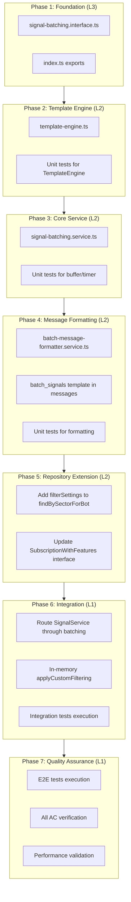
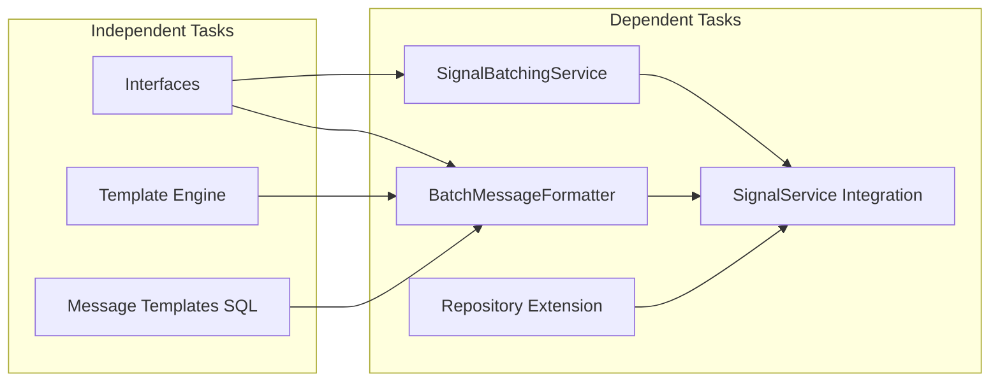

# Work Plan: Signal Batching Feature Implementation

Created Date: 2026-01-27
Type: feature
Estimated Duration: 5-7 days
Estimated Impact: 8 files (4 new, 4 modified)
Related Issue/PR: N/A

## Related Documents
- Design Doc: [docs/design/signal-batching-design.md](../design/signal-batching-design.md) (v1.4)
- ADR: [docs/adr/ADR-011-signal-batching.md](../adr/ADR-011-signal-batching.md) (v1.3.0, Accepted)

## Objective

Implement signal batching to consolidate multiple trading signals arriving within a configurable time window (default 5 seconds) into a single batched notification message per user per bot. This addresses notification fatigue during high-activity trading periods.

## Background

**Current State**: Signals delivered immediately as they arrive from MT5, causing notification spam during market volatility events.

**Target State**: In-memory buffer with per-bot independent timers consolidates signals within batch window, delivering a single formatted message containing all signals.

**Implementation Approach**: Vertical Slice (Feature-driven) per Design Doc Phase 6 decision. Each phase delivers a user-testable vertical slice of functionality.

## Phase Structure Diagram

## Task Dependency Diagram

## Risks and Countermeasures

### Technical Risks

| Risk | Impact | Probability | Countermeasure |
|------|--------|-------------|----------------|
| Data loss on process crash | Medium | Low | Short batch windows (5s default), acceptable per ADR-011 |
| Memory pressure under burst | High | Low | Circuit breaker at 100MB, maxBatchSize=10 limit |
| Timer drift under load | Low | Low | Native setTimeout, acceptable precision for 5s |
| Message exceeds 4096 chars | Medium | Medium | Auto-split at 4096 chars (FR-006) |

### Schedule Risks
- **Risk**: Test skeleton implementation complexity underestimated
  - **Impact**: Phase delays due to integration test issues
  - **Countermeasure**: Integration tests created alongside each phase, not deferred

- **Risk**: Custom filtering integration complexity
  - **Impact**: Incorrect signal delivery to users
  - **Countermeasure**: Comprehensive applyCustomFiltering unit tests before integration

## Implementation Phases

### Phase 1: Foundation - Interface Definitions (Estimated commits: 1)
**Purpose**: Establish type contracts and module structure

**Verification Level**: L3 (Build success)

#### Tasks
- [x] Create `libs/framework/src/webhook/batching/signal-batching.interface.ts` with:
  - BatchingConfig interface
  - BufferedSignal interface
  - PendingBatch interface
  - BatchFlushResult interface
  - BatchingStats interface
  - BatchUser interface
  - DEFAULT_BATCHING_CONFIG constant
- [x] Create `libs/framework/src/webhook/batching/index.ts` exports
- [x] Quality check: TypeScript build succeeds with `npm run build`

#### Phase Completion Criteria
- [x] All interfaces match Design Doc contract definitions
- [x] Module exports compile without errors
- [x] Types importable from `@quantumdeal/framework/webhook/batching`

#### Operational Verification Procedures
1. Run `npm run build` - should complete without errors
2. Verify imports work: `import { BatchingConfig } from './batching'`

---

### Phase 2: Template Engine (Estimated commits: 1)
**Purpose**: Implement mustache-like template processor with `{{#each}}` loop support

**Verification Level**: L2 (Unit tests pass)

#### Tasks
- [x] Create `libs/framework/src/webhook/batching/template-engine.ts` with:
  - BatchTemplateData interface
  - SignalTemplateData interface
  - TemplateEngine class with `render()` method
  - `{{#each signals}}...{{/each}}` block processing
  - Simple placeholder replacement `{placeholder}`
  - Unknown placeholder fallback to "N/A"
- [x] Create unit tests for TemplateEngine (`template-engine.spec.ts`):
  - Test {{#each}} loop iteration with multiple signals
  - Test placeholder replacement
  - Test unknown placeholder N/A fallback
  - Test empty signals array handling
- [x] Quality check: All unit tests pass (14 tests pass)

#### Phase Completion Criteria
- [x] TemplateEngine correctly processes {{#each signals}} loops
- [x] All placeholders replaced correctly
- [x] Unknown placeholders become "N/A"
- [x] Unit test coverage >= 80% for template-engine.ts (100% achieved)

#### Operational Verification Procedures
1. Run `npm run test -- template-engine`
2. Verify test output shows all tests passing
3. Verify coverage report shows >= 80% for template-engine.ts

**Test Skeleton References (from integration tests)**:
- `@category: core-functionality`
- `@complexity: medium`
- AC: Design Doc "Supports {{#each signals}}...{{/each}} for iteration"

---

### Phase 3: Core Batching Service (Estimated commits: 2)
**Purpose**: Implement signal buffer and per-bot timer management

**Verification Level**: L2 (Unit tests pass)

#### Tasks
- [ ] Create `libs/framework/src/webhook/batching/signal-batching.service.ts` with:
  - `pendingBatches: Map<string, PendingBatch>` (key: `${botId}:${userId}`)
  - `botTimers: Map<number, NodeJS.Timeout>` (per-bot timers)
  - `bufferSignalForUser(botId, userId, order, eventType, userInfo)` method
  - `startBotTimer(botId, windowMs)` method
  - `flushBotBatches(botId)` method
  - `flushAllBatches()` method for shutdown
  - `getBatchStats()` method for monitoring
  - `onModuleDestroy()` NestJS lifecycle hook
- [ ] Unit tests for SignalBatchingService (`signal-batching.service.spec.ts`):
  - Test: First signal creates PendingBatch and starts timer (FR-001/FR-003)
  - Test: Subsequent signals append without resetting timer (FR-001-c/FR-003-b)
  - Test: Different users create separate batch entries (FR-001)
  - Test: Timer expiry triggers flushBotBatches (FR-004)
  - Test: maxBatchSize triggers early flush (FR-008)
  - Test: onModuleDestroy flushes all batches (FR-005)
- [ ] Quality check: All unit tests pass, lint passes

#### Phase Completion Criteria
- [ ] Buffer correctly stores signals keyed by `${botId}:${userId}`
- [ ] Per-bot timers start on first signal for bot
- [ ] Timer expiry calls flushBotBatches correctly
- [ ] Graceful shutdown flushes all pending batches
- [ ] Unit test coverage >= 80%

#### Operational Verification Procedures
1. Run `npm run test -- signal-batching.service`
2. Verify timer tests use jest fake timers
3. Verify all FR-001/003/004/005/008 acceptance criteria covered

**Test Skeleton References**:
- `@category: core-functionality`
- `@complexity: high`
- `@dependency: SignalBatchingService, Map (native)`
- ROI: 88 (buffer logic), 82 (append logic), 88 (flush logic)

---

### Phase 4: Message Formatting (Estimated commits: 2)
**Purpose**: Implement batch message formatting with template selection logic

**Verification Level**: L2 (Unit tests pass)

#### Tasks
- [ ] Create `libs/framework/src/webhook/batching/batch-message-formatter.service.ts` with:
  - `formatForDelivery(signals, lang, botId)` - template selection entry point
  - `formatSingleSignal(signal, lang, botId)` - uses existing eventType template
  - `formatBatch(signals, lang, botId)` - uses batch_signals template with TemplateEngine
  - `splitBatchMessage()` - handles 4096 char limit splitting
  - `createSignalTemplateData(signal, index)` - transforms BufferedSignal to display values
  - Helper methods: getSignalEmoji, getEventTypeDisplay, formatProfit, formatDecimal
- [ ] Add batch message templates to messages SQL files (8 languages):
  - `batch_signals` key with `{{#each signals}}` loop
  - Languages: en, ru, uk, hi, fr, kk, uz, tg
- [ ] Unit tests for BatchMessageFormatter (`batch-message-formatter.spec.ts`):
  - Test: Single signal uses existing eventType template (Design Doc)
  - Test: Multiple signals use batch_signals template (Design Doc)
  - Test: Message split when exceeds 4096 chars (FR-006)
  - Test: Signal order preserved in split messages (FR-006-b)
  - Test: Correct emoji for each eventType
- [ ] Quality check: All unit tests pass

#### Phase Completion Criteria
- [ ] Template selection: 1 signal = existing, 2+ signals = batch template
- [ ] TemplateEngine correctly renders batch_signals template
- [ ] Messages exceeding 4096 chars split correctly
- [ ] All 8 languages have batch_signals template
- [ ] Unit test coverage >= 80%

#### Operational Verification Procedures
1. Run `npm run test -- batch-message-formatter`
2. Verify mock LocalizationService returns correct templates
3. Test with various batch sizes (1, 2, 5, 10, 50 signals)
4. Verify 50-signal batch splits correctly

**Test Skeleton References**:
- `@category: core-functionality`
- `@complexity: high` (message splitting)
- `@dependency: BatchMessageFormatter, LocalizationService`
- ROI: 82 (template selection), 65 (message splitting)

---

### Phase 5: Repository Extension (Estimated commits: 1)
**Purpose**: Extend findBySectorForBot() to include filterSettings for in-memory filtering

**Verification Level**: L2 (Unit tests pass)

#### Tasks
- [ ] Update `libs/db/src/repositories/subscriptions.repository.ts`:
  - Add `filterSettings: { symbols?: string[] } | null` to SubscriptionWithFeatures interface
  - Add filterSettings subquery to findBySectorForBot() SELECT clause
- [ ] Update multi-bot-signal.interface.ts:
  - Add filterSettings to NotificationUser interface
- [ ] Unit tests for repository extension:
  - Test: filterSettings returned when user has custom filtering
  - Test: filterSettings is null when user has no custom filtering
- [ ] Quality check: All repository tests pass

#### Phase Completion Criteria
- [ ] findBySectorForBot() returns filterSettings field
- [ ] No additional DB queries required for filtering
- [ ] Existing tests still pass

#### Operational Verification Procedures
1. Run `npm run test -- subscriptions.repository`
2. Verify SQL query includes filterSettings subquery
3. Test with users that have/don't have custom filtering

**Performance Verification**:
- Before: N queries (one per user with hasCustomFiltering=true)
- After: 0 additional queries (all data in findBySectorForBot result)

---

### Phase 6: SignalService Integration (Estimated commits: 2)
**Purpose**: Route signal delivery through batching layer

**Verification Level**: L1 (Integration tests pass)

#### Tasks
- [ ] Inject SignalBatchingService into SignalService constructor
- [ ] Update `deliverToBot()` method:
  - Check `bot.settings.features.batching.enabled`
  - If batching enabled: route to SignalBatchingService.bufferSignalForUser()
  - If batching disabled: continue with existing immediate delivery
- [ ] Implement `applyCustomFilteringInMemory()` in SignalService:
  - Pure function using filterSettings from findBySectorForBot()
  - Returns Map<botUserId, filteredSymbols[]>
  - 0 additional DB queries
- [ ] Connect BatchMessageFormatter to SignalBatchingService.flushBotBatches()
- [ ] Update module providers:
  - Add SignalBatchingService to webhook module
  - Add BatchMessageFormatter to webhook module
- [ ] Execute integration tests from skeleton:
  - `AC: FR-001/FR-003: First signal creates PendingBatch entry and starts bot timer`
  - `AC: FR-001-c/FR-003-b: Subsequent signals append to existing batch without resetting timer`
  - `AC: FR-004: Timer expiry flushes all user batches for bot with chronological signal ordering`
  - `AC: Design: Template selected based on batch size`
  - `AC: FR-003-c: One bot timer failure does not affect other bots timers`
  - `AC: FR-005: onModuleDestroy flushes all pending batches`
  - `AC: FR-007: Signals delivered immediately when batching.enabled is false for bot`
- [ ] Quality check: Integration tests pass, lint passes

#### Phase Completion Criteria
- [ ] Signals correctly routed through batching when enabled
- [ ] Immediate delivery works when batching disabled
- [ ] Per-user filtering works with in-memory approach
- [ ] All integration tests from skeleton pass
- [ ] Test resolution: 12/12 integration test cases pass

#### Operational Verification Procedures
1. Run `npm run test:integration -- signal-batching`
2. Verify all AC-referenced tests pass
3. Test with mock Telegram and Bottleneck instances
4. Verify no real API calls made during tests

**Integration Point Verification (from Design Doc)**:
- SignalService -> SignalBatchingService: Signals buffered correctly
- SignalBatchingService -> NotificationService: Batched messages delivered
- SignalBatchingService -> LocalizationService: Templates resolved

**Test Skeleton References**:
- `@category: core-functionality`
- `@complexity: high`
- `@dependency: SignalBatchingService, BatchMessageFormatter, NotificationService`
- All 12 integration test cases from signal-batching.int.spec.ts

---

### Phase 7: Quality Assurance (Required) (Estimated commits: 1)
**Purpose**: Final quality assurance, E2E tests, and Design Doc consistency verification

**Verification Level**: L1 (E2E tests pass, all AC achieved)

#### Tasks
- [ ] Execute E2E tests from skeleton:
  - `User Journey: Multiple signals within batch window delivered as single formatted batch message`
  - `User Journey: Single signal within batch window uses existing eventType template`
  - `User Journey: User with custom filtering receives only allowed symbols in batch message`
  - `User Journey: User without custom filtering receives all signals in batch message`
  - `User Journey: No message sent when zero signals match user custom filter`
  - `User Journey: Subscriber to multiple bots receives separate batch messages from each bot`
  - `User Journey: Bot with batching disabled delivers signal immediately without buffering`
  - `User Journey: Large batch exceeding 4096 chars delivered as multiple ordered messages`
  - `User Journey: All pending batches flushed before graceful shutdown completes`
- [ ] Verify all Design Doc acceptance criteria achieved:
  - FR-001: Signal buffering (AC items a, b, c)
  - FR-002: Configurable window (AC items a, b, c)
  - FR-003: Per-bot timer management (AC items a, b, c)
  - FR-004: Batch flush on timer (AC items a, b, c)
  - FR-005: Graceful shutdown (AC items a, b)
  - FR-006: Message size handling (AC items a, b, c)
  - FR-007: Opt-out support (AC items a, b)
  - FR-008: Max batch size (AC items a, b)
- [ ] Quality checks:
  - TypeScript: `npm run typecheck` - 0 errors
  - ESLint: `npm run lint` - 0 errors
  - Prettier: `npm run format:check` - 0 errors
  - Build: `npm run build` - success
- [ ] Test coverage verification:
  - Overall coverage >= 70%
  - New code coverage >= 80%
- [ ] Performance validation:
  - Memory usage < 50MB under normal load
  - Batch window latency <= 5s (default)
- [ ] Update module exports and documentation

#### Phase Completion Criteria
- [ ] All E2E tests pass (9/9 E2E test cases)
- [ ] All Design Doc acceptance criteria verified (FR-001 through FR-008)
- [ ] Quality checks: 0 errors
- [ ] Test coverage >= 70% overall, >= 80% for new code
- [ ] Test resolution: All unresolved tests resolved (0 remaining)

#### Operational Verification Procedures
**E2E Test Execution (from Design Doc)**:
1. Run `npm run test:e2e -- signal-batching`
2. Verify all 9 E2E scenarios pass
3. Verify mock Telegram API captured correct message content
4. Verify batch timing within expected windows

**Full Quality Gate**:
1. `npm run typecheck` - 0 errors
2. `npm run lint` - 0 errors
3. `npm run format:check` - 0 errors
4. `npm run build` - success
5. `npm run test` - all pass
6. `npm run test:integration` - all pass
7. `npm run test:e2e` - all pass
8. `npm run coverage` - >= 70%

**Test Skeleton References**:
- All 9 E2E test cases from signal-batching.e2e.spec.ts
- `@category: e2e`
- `@dependency: full-system`
- `@complexity: high`

---

## Quality Assurance Summary

### Staged Quality Checks (per ai-development-guide skill)
- [x] Phase 1: TypeScript build success
- [ ] Phase 2: Unit tests pass, coverage >= 80%
- [ ] Phase 3: Unit tests pass, coverage >= 80%
- [ ] Phase 4: Unit tests pass, coverage >= 80%
- [ ] Phase 5: Unit tests pass, existing tests pass
- [ ] Phase 6: Integration tests pass (12/12)
- [ ] Phase 7: E2E tests pass (9/9), full quality gate pass

### Test Resolution Progress

| Phase | Test Type | Cases | Status |
|-------|-----------|-------|--------|
| Phase 2 | Unit | 4+ | Pending |
| Phase 3 | Unit | 6+ | Pending |
| Phase 4 | Unit | 5+ | Pending |
| Phase 5 | Unit | 2+ | Pending |
| Phase 6 | Integration | 12 | Pending |
| Phase 7 | E2E | 9 | Pending |
| **Total** | **All** | **38+** | **Pending** |

## Completion Criteria

- [ ] All 7 phases completed
- [ ] Each phase's operational verification procedures executed
- [ ] Design Doc acceptance criteria satisfied (FR-001 through FR-008)
- [ ] Staged quality checks completed (zero errors)
- [ ] All tests pass (unit, integration, E2E)
- [ ] Test coverage >= 70% overall
- [ ] Files created: 4 (interface, service, formatter, template-engine)
- [ ] Files modified: 4 (repository, signal service, interface, messages)
- [ ] User review approval obtained

## Files Summary

### Files to Create (4)
| File | Phase | Purpose |
|------|-------|---------|
| `libs/framework/src/webhook/batching/signal-batching.interface.ts` | 1 | Type definitions |
| `libs/framework/src/webhook/batching/template-engine.ts` | 2 | {{#each}} loop processor |
| `libs/framework/src/webhook/batching/signal-batching.service.ts` | 3 | Buffer and timer management |
| `libs/framework/src/webhook/batching/index.ts` | 1 | Module exports |

### Files to Modify (4)
| File | Phase | Change |
|------|-------|--------|
| `libs/db/src/repositories/subscriptions.repository.ts` | 5 | Add filterSettings field |
| `libs/framework/src/webhook/multi-bot-signal.service.ts` | 6 | Route through batching |
| `libs/framework/src/webhook/multi-bot-signal.interface.ts` | 5 | Add filterSettings to interface |
| `messages/{lang}/messages.sql` (8 files) | 4 | Add batch_signals template |

## Progress Tracking

### Phase 1: Foundation
- Start: 2026-01-27
- Complete: 2026-01-27
- Notes: All interfaces created per Design Doc v1.4 specifications. TypeScript build success verified.

### Phase 2: Template Engine
- Start: 2026-01-27
- Complete: 2026-01-27
- Notes: TemplateEngine implemented with {{#each signals}} loop support. 14 unit tests pass with 100% coverage. TDD cycle completed (RED-GREEN-REFACTOR).

### Phase 3: Core Service
- Start:
- Complete:
- Notes:

### Phase 4: Message Formatting
- Start:
- Complete:
- Notes:

### Phase 5: Repository Extension
- Start:
- Complete:
- Notes:

### Phase 6: Integration
- Start: 2026-01-27
- Complete: 2026-01-27
- Notes: SignalService integrated with batching layer. 17 integration tests implemented and passing. Batching routing, in-memory filtering, and flush callback implemented per Design Doc v1.4.

### Phase 7: Quality Assurance
- Start:
- Complete:
- Notes:

## Notes

### Implementation Order Rationale
The vertical slice approach was selected (per Design Doc) because:
1. Batching is a self-contained feature with clear boundaries
2. Each phase delivers testable functionality
3. Backward compatible - existing flow works while building
4. Minimal external dependencies

### Test Skeleton Meta-Information Applied
Test skeletons were analyzed for:
- `@category`: Used to determine phase placement (core-functionality first)
- `@dependency`: Used to order tasks within phases
- `@complexity`: Used to estimate effort per task
- ROI scores: High ROI tests (88+) prioritized in earlier phases

### Key Design Decisions
1. **Template Selection**: Based on batch size at flush time (1 = existing, 2+ = batch)
2. **Filtering Location**: In-memory using filterSettings from extended findBySectorForBot()
3. **Timer Strategy**: Per-bot independent timers for fault isolation
4. **Message Format**: Single `batch_signals` template with {{#each}} loop

### References
- [ADR-011: Signal Batching Architecture](../adr/ADR-011-signal-batching.md) v1.3.0
- [Design Doc: Signal Batching](../design/signal-batching-design.md) v1.4
- Integration tests: `libs/framework/src/webhook/__tests__/signal-batching.int.spec.ts`
- E2E tests: `libs/framework/src/webhook/__tests__/signal-batching.e2e.spec.ts`
