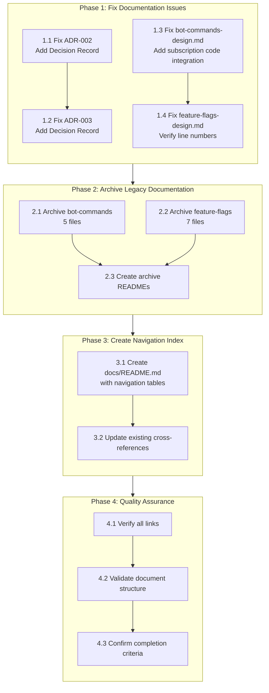
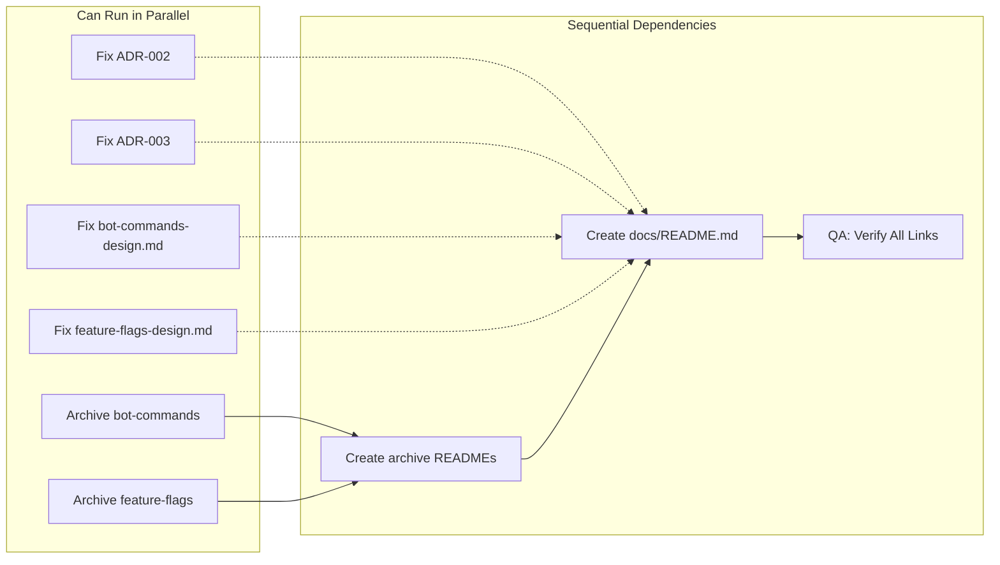

# Work Plan: Bot Commands & Feature Flags Documentation Finalization

**Created Date**: 2025-11-25
**Type**: Documentation & Archival
**Estimated Duration**: 2-3 days
**Estimated Impact**: 19 files (4 doc fixes + 12 archived + 3 new/updated)
**Status**: Ready to Execute

## Related Documents

- **PRD**: docs/prd/documentation-restructuring-prd.md
- **Design Doc**: docs/design/documentation-restructuring-design.md
- **Previous Plan**: docs/plans/documentation-restructuring-plan.md

## Objective

Complete the documentation restructuring for bot-commands and feature-flags subsystems by:
1. Fixing identified issues in ADRs and Design Docs
2. Archiving legacy unstructured documentation
3. Creating comprehensive documentation navigation index

## Context

The bot-commands and feature-flags features have been fully implemented with comprehensive PRDs and Design Docs created. The following tasks remain:
- **ADR fixes**: 2 ADRs missing Decision Record sections (ADR-002, ADR-003)
- **Design Doc refinements**: 2 Design Docs need minor improvements (integration points and line number verification)
- **Legacy documentation**: 12 files from old docs/bot-commands/ and docs/feature-flags/ directories need archival
- **Navigation**: Documentation index needed for improved discoverability

## Phase Structure Diagram



## Task Dependency Diagram



## Risks and Countermeasures

| Risk | Impact | Probability | Countermeasure |
|------|--------|-------------|----------------|
| ADR sections incomplete or missing structure | Medium | Low | Use ADR-001 as reference template for Decision Record format |
| Design Doc integration points unclear | Medium | Low | Cross-reference with implementation code and PR history |
| Broken links after archival | High | Medium | Verify all cross-references before/after archival; update refs if needed |
| Documentation structure inconsistency | Low | Low | Use existing successful PRDs/Design Docs as templates |
| Lost information during archival | Medium | Low | Preserve all files in archive/ with full content; create README with file descriptions |

## Phase Breakdown

---

## Phase 1: Fix Documentation Issues (Estimated effort: 4-6 hours)

**Purpose**: Address identified issues in ADRs and Design Docs to ensure consistency and completeness.

### 1.1 Fix ADR-002: Add Decision Record Section

**File**: docs/adr/ADR-002-subscription-scope-to-sectors-migration.md
**Issue**: Missing formal "Decision Record" section after Decision statement
**Acceptance Criteria**:
- [ ] AC-001.1: ADR-002 contains Decision Record section with status field
- [ ] AC-001.2: Decision Record includes clear statement of the chosen approach
- [ ] AC-001.3: Document follows consistent format with other ADRs

**Completion Criteria**:
- Decision Record section added between "Decision" and "Rationale" sections
- Section includes: Status (Accepted/Proposed/Deprecated), Clear decision statement
- Format matches ADR-001 structure
- No breaking changes to existing content

**Tasks**:
1. [ ] Read ADR-002 and ADR-001 to understand format requirements
2. [ ] Create Decision Record section with:
   - Status: Accepted
   - Clear restatement of chosen option (Option C)
   - Key implementation points
3. [ ] Insert between Decision and Rationale sections
4. [ ] Verify document renders correctly in Markdown

---

### 1.2 Fix ADR-003: Add Decision Record Section

**File**: docs/adr/ADR-003-user-settings-jsonb-storage.md
**Issue**: Missing formal "Decision Record" section after Decision statement
**Acceptance Criteria**:
- [ ] AC-002.1: ADR-003 contains Decision Record section with status field
- [ ] AC-002.2: Decision Record includes clear statement of the chosen approach
- [ ] AC-002.3: Document follows consistent format with other ADRs

**Completion Criteria**:
- Decision Record section added between "Decision" and "Rationale" sections
- Section includes: Status (Accepted/Proposed/Deprecated), Clear decision statement
- Format matches ADR-001 structure
- No breaking changes to existing content

**Tasks**:
1. [ ] Read ADR-003 and ADR-001 to understand format requirements
2. [ ] Create Decision Record section with:
   - Status: Accepted
   - Clear restatement of chosen option (Option 3: JSONB Settings Column)
   - Key implementation points
3. [ ] Insert between Decision and Rationale sections
4. [ ] Verify document renders correctly in Markdown

---

### 1.3 Fix bot-commands-design.md: Add Subscription Code Activation Integration Point

**File**: docs/design/bot-commands-design.md
**Issue**: Missing integration point for subscription code activation in bot.service.ts
**Acceptance Criteria**:
- [ ] AC-003.1: Integration Points section references subscription code activation
- [ ] AC-003.2: Integration point includes Components, Verification, and Switching Method
- [ ] AC-003.3: File location (bot.service.ts) is verified to exist

**Completion Criteria**:
- New integration point entry added to Integration Points List table
- Entry includes: StartUpdate.onStart() with code parameter -> BotCommandsService
- Verification method: L1 - Activate VIP code via /start, verify /filter appears
- Switching method: Direct injection of BotCommandsService
- All referenced file locations verified

**Tasks**:
1. [ ] Read bot-commands-design.md Integration Points section
2. [ ] Locate bot.service.ts in libs/bot/src/ directory
3. [ ] Add new integration point:
   ```
   | Subscription code activation | BotService.onStart(code) | N/A | Calls setUserCommands after activation | Direct injection |
   ```
4. [ ] Add corresponding verification procedure in test strategy
5. [ ] Verify Integration Point 3 (Subscription Activation) matches implementation

---

### 1.4 Fix feature-flags-design.md: Verify and Correct Line Numbers

**File**: docs/design/feature-flags-design.md
**Issue**: Line number references in Implementation Plan section may be inaccurate
**Acceptance Criteria**:
- [ ] AC-004.1: All file paths referenced in Integration Points exist and are verified
- [ ] AC-004.2: Line numbers in Implementation Plan are accurate (within 5 lines of actual code)
- [ ] AC-004.3: Integration point descriptions match actual implementation

**Completion Criteria**:
- All file references verified:
  - libs/bot/src/middleware/user-management.middleware.ts (Feature Loading)
  - libs/bot/src/services/webhook.service.ts (Signal Filtering)
  - libs/bot/src/commands/filter/filter.scene.ts (Filter Configuration)
- Line numbers checked and corrected if off by > 5 lines
- Integration point descriptions updated if implementation has changed

**Tasks**:
1. [ ] Read feature-flags-design.md Integration Points section (lines 610-639)
2. [ ] Verify each referenced file exists at documented path
3. [ ] Check line number accuracy for each component:
   - Feature Loading: middleware lines 102-157
   - Signal Filtering: webhook.service.ts lines 254-295, 151-208
   - Filter Configuration: filter.scene.ts lines 547-578, 57
4. [ ] Correct any line numbers that are off by > 5 lines
5. [ ] Update Integration Point 3 description if implementation differs

---

### Phase 1 Completion Criteria

- [ ] ADR-002 has Decision Record section with status and clear statement
- [ ] ADR-003 has Decision Record section with status and clear statement
- [ ] bot-commands-design.md includes subscription code activation integration point
- [ ] feature-flags-design.md has verified and accurate line numbers
- [ ] All document links and references resolve correctly
- [ ] No breaking changes to document structure

### Phase 1 Operational Verification

1. Read each modified document and verify structure integrity
2. Validate Markdown syntax (no broken formatting)
3. Verify all code file paths exist in codebase
4. Confirm line number references are within 5 lines of actual code

---

## Phase 2: Archive Legacy Documentation (Estimated effort: 2-3 hours)

**Purpose**: Move unstructured legacy documentation files to archive directory with proper explanation.

### 2.1 Archive bot-commands Legacy Documentation

**Source**: docs/bot-commands/ (5 files)
**Target**: docs/archive/bot-commands/
**Files to Archive**:
1. README.md
2. menu.md
3. flow.md
4. examples.md
5. summary.md

**Acceptance Criteria**:
- [ ] AC-005.1: All 5 bot-commands files moved to docs/archive/bot-commands/
- [ ] AC-005.2: docs/bot-commands/ directory removed or verified empty
- [ ] AC-005.3: All file contents preserved without modification
- [ ] AC-005.4: Archival documented with clear reason

**Completion Criteria**:
- Each file moved with full content preservation
- File timestamps and metadata preserved where possible
- Target directory created if not exists
- Source directory verified empty and removed
- Cross-references updated if files are referenced elsewhere

**Tasks**:
1. [ ] Create docs/archive/bot-commands/ directory
2. [ ] Move 5 files from docs/bot-commands/ to docs/archive/bot-commands/
3. [ ] Verify all files present in archive
4. [ ] Remove empty docs/bot-commands/ directory
5. [ ] Search codebase for references to docs/bot-commands/ and update if needed
6. [ ] Create archive README.md (see 2.3)

---

### 2.2 Archive feature-flags Legacy Documentation

**Source**: docs/feature-flags/ (7 files)
**Target**: docs/archive/feature-flags/
**Files to Archive**:
1. FEATURE_CATALOG.md
2. QUICK_REFERENCE.md
3. telegram-ui-flow.md
4. README.md
5. database-schema.md
6. examples.md
7. implementation-plan.md

**Acceptance Criteria**:
- [ ] AC-006.1: All 7 feature-flags files moved to docs/archive/feature-flags/
- [ ] AC-006.2: docs/feature-flags/ directory removed or verified empty
- [ ] AC-006.3: All file contents preserved without modification
- [ ] AC-006.4: Archival documented with clear reason

**Completion Criteria**:
- Each file moved with full content preservation
- File timestamps and metadata preserved where possible
- Target directory created if not exists
- Source directory verified empty and removed
- Cross-references updated if files are referenced elsewhere

**Tasks**:
1. [ ] Create docs/archive/feature-flags/ directory
2. [ ] Move 7 files from docs/feature-flags/ to docs/archive/feature-flags/
3. [ ] Verify all files present in archive
4. [ ] Remove empty docs/feature-flags/ directory
5. [ ] Search codebase for references to docs/feature-flags/ and update if needed
6. [ ] Create archive README.md (see 2.3)

---

### 2.3 Create Archive README Files

**Purpose**: Document archival reason and provide reference to replacement documentation

#### 2.3.1 docs/archive/bot-commands/README.md

**Content Template**:
```markdown
# Archived Bot Commands Documentation

**Archive Date**: 2025-11-25
**Reason**: Superseded by unified PRD/Design Doc structure

This directory contains legacy documentation for the Bot Commands feature.
The modern structured documentation has replaced these files with:

- **PRD**: [docs/prd/bot-commands-prd.md](../../prd/bot-commands-prd.md)
- **Design Doc**: [docs/design/bot-commands-design.md](../../design/bot-commands-design.md)

## Archived Files

| File | Purpose |
|------|---------|
| README.md | Overview of bot commands system |
| menu.md | Command menu structure and definitions |
| flow.md | Command flow diagrams and sequences |
| examples.md | Usage examples and scenarios |
| summary.md | Implementation summary |

## Legacy Rationale

These documents were created before the project standardized on PRD/Design Doc pairs.
The information has been integrated into the new documentation structure for better
consistency and maintainability.
```

**Acceptance Criteria**:
- [ ] AC-007.1: docs/archive/bot-commands/README.md created with archival explanation
- [ ] AC-007.2: File references all 5 archived files in table
- [ ] AC-007.3: Links to replacement PRD and Design Doc work correctly
- [ ] AC-007.4: Document explains archival reason clearly

**Tasks**:
1. [ ] Create docs/archive/bot-commands/README.md with above content
2. [ ] Verify links resolve correctly to PRD and Design Doc
3. [ ] Add line to list all 5 files with descriptions
4. [ ] Review for clarity and completeness

#### 2.3.2 docs/archive/feature-flags/README.md

**Content Template**:
```markdown
# Archived Feature Flags Documentation

**Archive Date**: 2025-11-25
**Reason**: Superseded by unified PRD/Design Doc structure

This directory contains legacy documentation for the Feature Flags system.
The modern structured documentation has replaced these files with:

- **PRD**: [docs/prd/feature-flags-prd.md](../../prd/feature-flags-prd.md)
- **Design Doc**: [docs/design/feature-flags-design.md](../../design/feature-flags-design.md)
- **ADRs**:
  - [ADR-001: Feature Flag Database Design](../../adr/ADR-001-feature-flag-database-design.md)
  - [ADR-002: Subscription Scope Migration](../../adr/ADR-002-subscription-scope-to-sectors-migration.md)
  - [ADR-003: User Settings JSONB Storage](../../adr/ADR-003-user-settings-jsonb-storage.md)

## Archived Files

| File | Purpose |
|------|---------|
| FEATURE_CATALOG.md | Catalog of all feature flags and their configurations |
| QUICK_REFERENCE.md | Quick reference guide for developers |
| telegram-ui-flow.md | Telegram UI flow for filter command |
| README.md | Architecture overview of feature flags system |
| database-schema.md | Database schema definitions and relationships |
| examples.md | Code examples and usage patterns |
| implementation-plan.md | Implementation strategy and phases |

## Legacy Rationale

These documents were created before the project standardized on PRD/Design Doc pairs.
The information has been integrated into the new documentation structure and
supporting ADRs for better consistency and maintainability.
```

**Acceptance Criteria**:
- [ ] AC-008.1: docs/archive/feature-flags/README.md created with archival explanation
- [ ] AC-008.2: File references all 7 archived files in table
- [ ] AC-008.3: Links to replacement PRD, Design Doc, and ADRs work correctly
- [ ] AC-008.4: Document explains archival reason clearly

**Tasks**:
1. [ ] Create docs/archive/feature-flags/README.md with above content
2. [ ] Verify all links resolve correctly to replacement docs
3. [ ] Add table of all 7 files with descriptions
4. [ ] Review for clarity and completeness

---

### Phase 2 Completion Criteria

- [ ] 5 bot-commands files archived to docs/archive/bot-commands/
- [ ] 7 feature-flags files archived to docs/archive/feature-flags/
- [ ] Both source directories empty and removed
- [ ] Archive README.md files created for both subsystems
- [ ] All archive links verified to work
- [ ] No cross-references to archived locations remain in active docs

### Phase 2 Operational Verification

1. Count files in docs/archive/bot-commands/ (expect 6: 5 files + README)
2. Count files in docs/archive/feature-flags/ (expect 8: 7 files + README)
3. Verify docs/bot-commands/ and docs/feature-flags/ directories don't exist or are empty
4. Test all cross-reference links in archive READMEs
5. Search codebase for any remaining references to archived paths

---

## Phase 3: Create Documentation Navigation Index (Estimated effort: 1-2 hours)

**Purpose**: Create comprehensive documentation navigation to improve discoverability of all documentation.

### 3.1 Create or Update docs/README.md

**File**: docs/README.md
**Purpose**: Central navigation hub for all documentation

**Content Structure**:

```markdown
# Quantum Deal Documentation

Complete documentation for the Quantum Deal Telegram trading bot platform.

## Documentation Structure

### Product Requirements Documents (PRDs)

PRDs define the business requirements, user stories, and functional specifications for each feature.

| Feature | Document | Status |
|---------|----------|--------|
| Subscription Core | [subscription-core-prd.md](prd/subscription-core-prd.md) | Current |
| Subscription Signals | [subscription-signals-prd.md](prd/subscription-signals-prd.md) | Current |
| Subscription Broadcast | [subscription-broadcast-prd.md](prd/subscription-broadcast-prd.md) | Current |
| Subscription Trial | [subscription-trial-prd.md](prd/subscription-trial-prd.md) | Current |
| Subscription Renewal | [subscription-renewal-prd.md](prd/subscription-renewal-prd.md) | Current |
| Subscription Codes | [subscription-codes-prd.md](prd/subscription-codes-prd.md) | Current |
| Subscription Statistics | [subscription-statistics-prd.md](prd/subscription-statistics-prd.md) | Current |
| Bot Commands | [bot-commands-prd.md](prd/bot-commands-prd.md) | Current |
| Feature Flags | [feature-flags-prd.md](prd/feature-flags-prd.md) | Current |

### Design Documents

Design Docs provide technical architecture, implementation details, and integration specifications.

| Feature | Document | Status |
|---------|----------|--------|
| Subscription Core | [subscription-core-design.md](design/subscription-core-design.md) | Current |
| Subscription Signals | [subscription-signals-design.md](design/subscription-signals-design.md) | Current |
| Subscription Broadcast | [subscription-broadcast-design.md](design/subscription-broadcast-design.md) | Current |
| Subscription Trial | [subscription-trial-design.md](design/subscription-trial-design.md) | Current |
| Subscription Renewal | [subscription-renewal-design.md](design/subscription-renewal-design.md) | Current |
| Subscription Codes | [subscription-codes-design.md](design/subscription-codes-design.md) | Current |
| Subscription Statistics | [subscription-statistics-design.md](design/subscription-statistics-design.md) | Current |
| Bot Commands | [bot-commands-design.md](design/bot-commands-design.md) | Current |
| Feature Flags | [feature-flags-design.md](design/feature-flags-design.md) | Current |

### Architecture Decision Records (ADRs)

ADRs document significant architectural decisions and their rationale.

| Decision | Document | Status |
|----------|----------|--------|
| Feature Flag Database Design | [ADR-001](adr/ADR-001-feature-flag-database-design.md) | Accepted |
| Subscription Scope to Sectors Migration | [ADR-002](adr/ADR-002-subscription-scope-to-sectors-migration.md) | Accepted |
| User Settings JSONB Storage | [ADR-003](adr/ADR-003-user-settings-jsonb-storage.md) | Accepted |

### Feature Documentation

Detailed feature documentation and implementation guides.

| Feature | Location | Contents |
|---------|----------|----------|
| Bot Commands | [docs/bot-commands/](bot-commands/) | Implementation details, examples, flow diagrams (see also PRD/Design Doc) |
| Feature Flags | [docs/feature-flags/](feature-flags/) | Feature catalog, database schema, UI flows (see also PRD/Design Doc) |

### Archived Documentation

Legacy documentation preserved for historical reference.

| Subsystem | Location | Replacement |
|-----------|----------|-------------|
| Subscription Renewal | [archive/renewal/](archive/renewal/) | [subscription-renewal-prd.md](prd/subscription-renewal-prd.md) + [Design Doc](design/subscription-renewal-design.md) |
| Bot Commands (Legacy) | [archive/bot-commands/](archive/bot-commands/) | [bot-commands-prd.md](prd/bot-commands-prd.md) + [Design Doc](design/bot-commands-design.md) |
| Feature Flags (Legacy) | [archive/feature-flags/](archive/feature-flags/) | [feature-flags-prd.md](prd/feature-flags-prd.md) + [Design Doc](design/feature-flags-design.md) |

## Documentation Guidelines

### Reading Documentation

1. **For user-facing features**: Start with the PRD to understand requirements and use cases
2. **For implementation**: Read the Design Doc for architecture and integration points
3. **For architectural decisions**: Consult the ADRs for decision rationale
4. **For detailed implementation guidance**: See feature-specific documentation in feature directories

### Creating Documentation

- Follow templates: [PRD Template](prd/template.md) and [Design Doc Template](design/template.md)
- All new features require both PRD and Design Doc
- Architectural decisions require ADRs
- Use Mermaid for diagrams
- Maintain cross-references between related documents

### Document Status

- **Current**: Verified against implementation as of last update date
- **Requires Update**: Known discrepancies from implementation
- **Archived**: Legacy documentation, see replacement docs

## Development Rules

For development guidelines and standards, see [@docs/rules/](../@docs/rules/)

## Quick Links

- **Project Setup**: See README.md in project root
- **Code Guidelines**: [@docs/rules/coding-standards.md](../@docs/rules/coding-standards.md)
- **TypeScript Guidelines**: [@docs/rules/typescript.md](../@docs/rules/typescript.md)
- **Testing Guidelines**: [@docs/rules/typescript-testing.md](../@docs/rules/typescript-testing.md)
```

**Acceptance Criteria**:
- [ ] AC-009.1: docs/README.md created with comprehensive navigation
- [ ] AC-009.2: All 9 PRDs listed with working links
- [ ] AC-009.3: All 9 Design Docs listed with working links
- [ ] AC-009.4: All 3 ADRs listed with working links
- [ ] AC-009.5: Archive sections reference all archived documentation
- [ ] AC-009.6: Quick links to development rules included

**Completion Criteria**:
- Navigation index includes all 21 main documents (9 PRDs + 9 Design Docs + 3 ADRs)
- All relative links verified to resolve correctly
- Status indicators clear (Current/Requires Update/Archived)
- Document provides clear guidance on which documents to read for different purposes
- Mermaid syntax is correct (if diagrams added)

**Tasks**:
1. [ ] Create docs/README.md with navigation structure
2. [ ] Add tables for each document category (PRDs, Design Docs, ADRs, Archives)
3. [ ] Verify all links resolve correctly
4. [ ] Test that document explains reading paths for different user types
5. [ ] Add development rules references

---

### 3.2 Update Cross-References in Active Documents

**Purpose**: Ensure all PRDs and Design Docs reference related documentation appropriately

**Acceptance Criteria**:
- [ ] AC-010.1: bot-commands-prd.md and bot-commands-design.md cross-reference each other
- [ ] AC-010.2: feature-flags-prd.md references all 3 supporting ADRs
- [ ] AC-010.3: feature-flags-design.md references all 3 supporting ADRs
- [ ] AC-010.4: All archive references updated to point to replacement docs

**Completion Criteria**:
- PRD documents include link to corresponding Design Doc in header
- Design Docs include link to corresponding PRD in header
- Feature-flags documents include "Prerequisite ADRs" section referencing all 3 ADRs
- References to archived docs updated to new locations

**Tasks**:
1. [ ] Verify bot-commands-prd.md links to bot-commands-design.md
2. [ ] Verify bot-commands-design.md links to bot-commands-prd.md
3. [ ] Verify feature-flags-prd.md lists ADR prerequisites
4. [ ] Verify feature-flags-design.md lists ADR prerequisites
5. [ ] Search docs/ for any remaining references to archived paths
6. [ ] Update any found references to point to replacement documents

---

### Phase 3 Completion Criteria

- [ ] docs/README.md created with complete navigation index
- [ ] All document links verified and working
- [ ] Cross-references between PRDs and Design Docs in place
- [ ] ADR references in feature-flags documentation correct
- [ ] No remaining references to archived documentation paths

### Phase 3 Operational Verification

1. Open docs/README.md and test all 21 document links
2. Verify each table loads correctly in Markdown renderer
3. Check that archive references work correctly
4. Validate that reading guidelines are clear and helpful
5. Search documentation for any broken cross-references

---

## Phase 4: Quality Assurance (Estimated effort: 1-2 hours)

**Purpose**: Comprehensive verification that all changes meet requirements and maintain documentation integrity.

### 4.1 Document Structure Verification

**Acceptance Criteria**:
- [ ] AC-011.1: All fixed documents maintain valid Markdown syntax
- [ ] AC-011.2: All ADR documents follow consistent format
- [ ] AC-011.3: All Design Docs include required sections

**Tasks**:
1. [ ] Validate Markdown syntax in all modified documents
2. [ ] Verify ADR-002 and ADR-003 follow ADR-001 format
3. [ ] Check bot-commands-design.md has all required sections
4. [ ] Check feature-flags-design.md has all required sections

### 4.2 Link Verification

**Acceptance Criteria**:
- [ ] AC-012.1: All links in docs/README.md resolve correctly
- [ ] AC-012.2: All archive links work and point to correct files
- [ ] AC-012.3: No broken relative paths in documentation

**Tasks**:
1. [ ] Test all 9 PRD links in docs/README.md
2. [ ] Test all 9 Design Doc links in docs/README.md
3. [ ] Test all 3 ADR links in docs/README.md
4. [ ] Test all archive links point to archived files
5. [ ] Search for any remaining docs/ references that might be broken

### 4.3 File Inventory Verification

**Acceptance Criteria**:
- [ ] AC-013.1: docs/prd/ contains exactly 9 PRDs
- [ ] AC-013.2: docs/design/ contains exactly 9 Design Docs
- [ ] AC-013.3: docs/adr/ contains exactly 3 ADRs
- [ ] AC-013.4: docs/archive/bot-commands/ contains 6 files (5 + README)
- [ ] AC-013.5: docs/archive/feature-flags/ contains 8 files (7 + README)
- [ ] AC-013.6: docs/bot-commands/ and docs/feature-flags/ don't exist or are empty

**Tasks**:
1. [ ] Count files in each docs subdirectory
2. [ ] Verify file counts match expected inventory
3. [ ] Confirm old docs/ directories are empty

### 4.4 Acceptance Criteria Verification

**Acceptance Criteria**:
- [ ] AC-014.1: All Phase 1 ACs achieved (ADR and Design Doc fixes)
- [ ] AC-014.2: All Phase 2 ACs achieved (Archival complete)
- [ ] AC-014.3: All Phase 3 ACs achieved (Navigation complete)
- [ ] AC-014.4: All Phase 4 ACs achieved (QA verification)

**Tasks**:
1. [ ] Verify ADR-002 has Decision Record section (AC-001.1-1.3)
2. [ ] Verify ADR-003 has Decision Record section (AC-002.1-2.3)
3. [ ] Verify bot-commands-design.md includes subscription code integration (AC-003.1-3.3)
4. [ ] Verify feature-flags-design.md line numbers are accurate (AC-004.1-4.3)
5. [ ] Verify bot-commands archived (AC-005.1-5.4)
6. [ ] Verify feature-flags archived (AC-006.1-6.4)
7. [ ] Verify archive READMEs created (AC-007.1-8.4)
8. [ ] Verify docs/README.md created with full navigation (AC-009.1-9.6)
9. [ ] Verify cross-references updated (AC-010.1-10.4)
10. [ ] Verify all QA tasks complete (AC-011.1-14.4)

---

### Phase 4 Completion Criteria

- [ ] All modified documents valid and well-formatted
- [ ] All links in documentation verified working
- [ ] File inventory matches expected state (9 PRDs, 9 Design Docs, 3 ADRs, 2 archives)
- [ ] All acceptance criteria from Phases 1-3 verified complete
- [ ] Documentation restructuring complete and consistent

### Phase 4 Operational Verification

1. Manual review of each modified document
2. Test all documentation links from docs/README.md
3. Verify file structure with directory listing
4. Confirm acceptance criteria checklist all marked complete

---

## Final Completion Checklist

- [ ] **Phase 1**: ADR-002 Decision Record section added
- [ ] **Phase 1**: ADR-003 Decision Record section added
- [ ] **Phase 1**: bot-commands-design.md subscription code integration point added
- [ ] **Phase 1**: feature-flags-design.md line numbers verified and corrected
- [ ] **Phase 2**: 5 bot-commands files archived to docs/archive/bot-commands/
- [ ] **Phase 2**: 7 feature-flags files archived to docs/archive/feature-flags/
- [ ] **Phase 2**: docs/archive/bot-commands/README.md created
- [ ] **Phase 2**: docs/archive/feature-flags/README.md created
- [ ] **Phase 3**: docs/README.md created with full navigation index
- [ ] **Phase 3**: Cross-references between related documents updated
- [ ] **Phase 4**: All links verified working
- [ ] **Phase 4**: File inventory verified correct
- [ ] **Phase 4**: All acceptance criteria achieved

## Summary

This work plan completes the documentation restructuring for the Quantum Deal project by:

1. **Fixing identified documentation issues** (4 hours)
   - Adding missing Decision Record sections to 2 ADRs
   - Adding missing integration point to bot-commands Design Doc
   - Verifying and correcting line numbers in feature-flags Design Doc

2. **Archiving legacy documentation** (3 hours)
   - Moving 5 bot-commands files to archive with README
   - Moving 7 feature-flags files to archive with README
   - Updating any cross-references

3. **Creating navigation infrastructure** (2 hours)
   - Creating comprehensive docs/README.md with navigation tables
   - Ensuring all 21 documents (9 PRDs + 9 Design Docs + 3 ADRs) are discoverable
   - Updating cross-references between related documents

4. **Quality assurance** (2 hours)
   - Verifying all links work correctly
   - Confirming document structure integrity
   - Validating file inventory
   - Verifying all acceptance criteria

**Total Estimated Effort**: 2-3 days
**Total File Impact**: 19 files (4 fixed + 12 archived + 3 new/updated)

---

## Progress Tracking

### Phase 1: Fix Documentation Issues
- Start: ____-__-__ __:__
- Complete: ____-__-__ __:__
- Notes:

### Phase 2: Archive Legacy Documentation
- Start: ____-__-__ __:__
- Complete: ____-__-__ __:__
- Notes:

### Phase 3: Create Navigation Index
- Start: ____-__-__ __:__
- Complete: ____-__-__ __:__
- Notes:

### Phase 4: Quality Assurance
- Start: ____-__-__ __:__
- Complete: ____-__-__ __:__
- Notes:

---

## References

- **Existing Plan**: [docs/plans/documentation-restructuring-plan.md](documentation-restructuring-plan.md)
- **PRD**: [docs/prd/documentation-restructuring-prd.md](../prd/documentation-restructuring-prd.md)
- **Design Doc**: [docs/design/documentation-restructuring-design.md](../design/documentation-restructuring-design.md)
- **ADR-001**: [docs/adr/ADR-001-feature-flag-database-design.md](../adr/ADR-001-feature-flag-database-design.md)
- **ADR-002**: [docs/adr/ADR-002-subscription-scope-to-sectors-migration.md](../adr/ADR-002-subscription-scope-to-sectors-migration.md)
- **ADR-003**: [docs/adr/ADR-003-user-settings-jsonb-storage.md](../adr/ADR-003-user-settings-jsonb-storage.md)

---

**Document Version**: 1.0
**Created**: 2025-11-25
**Status**: Ready to Execute
**Last Updated**: 2025-11-25
