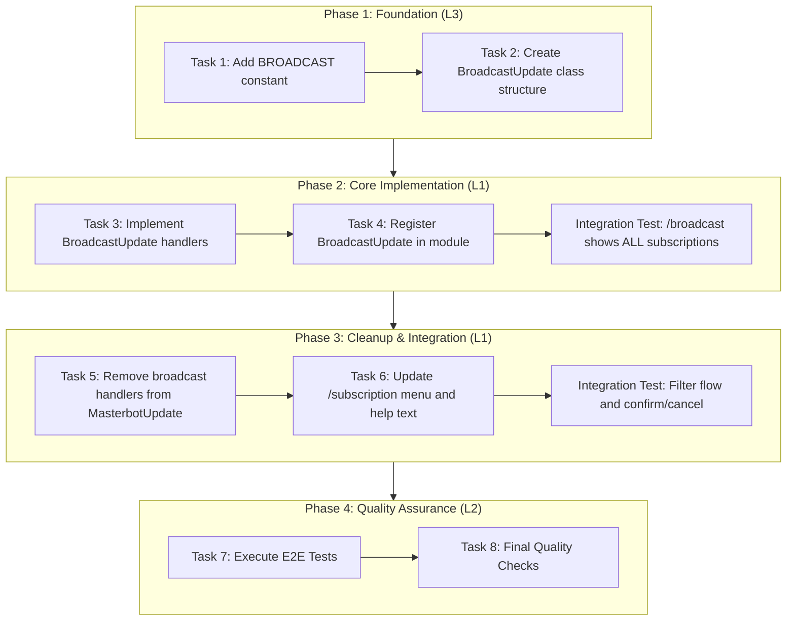
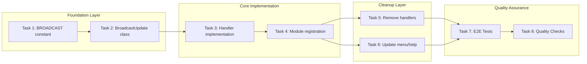

# Work Plan: Broadcast Command Extraction Implementation

**Created Date:** 2026-01-09
**Type:** refactor
**Estimated Duration:** 1-2 days
**Estimated Impact:** 4 files
**Scale:** Medium (3-5 files)
**Implementation Mode:** Vertical Slice (Feature-Driven)

## Related Documents

- **Design Doc:** [docs/design/broadcast-command-extraction-design.md](../design/broadcast-command-extraction-design.md)
- **Integration Tests:** [libs/masterbot/src/__tests__/broadcast.integration.spec.ts](../../libs/masterbot/src/__tests__/broadcast.integration.spec.ts)
- **E2E Tests:** [libs/masterbot/src/__tests__/e2e/broadcast-command.e2e.spec.ts](../../libs/masterbot/src/__tests__/e2e/broadcast-command.e2e.spec.ts)

## Objective

Extract broadcast functionality from `/subscription` command into a dedicated `/broadcast` command. This refactoring achieves:
1. **Separation of Concerns**: Subscription management vs. message broadcasting
2. **Extended Reach**: Enable broadcasts to ALL subscription types (signals + broadcast) instead of only broadcast-type subscriptions
3. **Maintainability**: Reduce `masterbot.update.ts` file size by ~400 lines

## Background

### Current State
- `masterbot.update.ts` is 1362 lines, mixing subscription management and broadcasting
- Broadcast functionality is accessed via `/subscription` menu ("Send message" button)
- Broadcast targets only `getActiveBroadcastSubscriptions()` - excludes signals subscribers (main user base)

### Target State
- New `/broadcast` command handled by `BroadcastUpdate` class
- `/subscription` command handles only subscription create/close
- Broadcast shows ALL active subscriptions via `findActiveSubscriptions()`
- Clear separation of responsibilities

## Phase Structure Diagram



## Task Dependency Diagram



---

## Risks and Countermeasures

### Technical Risks

| Risk | Impact | Probability | Mitigation |
|------|--------|-------------|------------|
| Session state conflicts between BroadcastUpdate and MasterbotUpdate | High | Low | Reuse existing session types exactly, both check flowState |
| Text handler duplication (both classes register @On('text')) | Medium | Medium | Each class checks flowState before handling, no conflicts |
| Missing handler extraction | High | Low | Comprehensive method list in design doc, verify each extraction |
| Regression in /subscription create/close flows | Medium | Low | Test flows after broadcast removal |

### Rollback Considerations

1. **Immediate Rollback**: Revert all 4 files to restore original state
2. **Partial Rollback**: Remove BroadcastUpdate from module, restore handlers to MasterbotUpdate
3. **Session State**: No changes to session types - fully backward compatible

---

## Phase 1: Foundation (L3 Verification)

**Purpose**: Establish constants and class structure for BroadcastUpdate

### Task 1: Add BROADCAST command constant

**Priority:** High (Foundation)
**Verification Level:** L3 (Build Success)
**Acceptance Criteria:** Code Organization - BROADCAST command constant added
**Estimated Time:** 5 min

**Files:**
- `libs/masterbot/src/constants.ts`

**Implementation Steps:**
- [ ] Add `BROADCAST: '/broadcast'` to `MASTERBOT_CONSTANTS.COMMANDS`

**Quality Check:**
```bash
npm run check
npm run build
```

**Completion Criteria:**
- [ ] Implementation complete: BROADCAST constant defined
- [ ] Quality complete: Build succeeds, type check passes
- [ ] Integration ready: Constant available for handler decorator

### Task 2: Create BroadcastUpdate class structure

**Priority:** High
**Verification Level:** L3 (Build Success)
**Acceptance Criteria:** Code Organization - broadcast.update.ts file exists
**Dependencies:** Task 1
**Estimated Time:** 15 min

**Files:**
- `libs/masterbot/src/broadcast.update.ts` (NEW)

**Implementation Steps:**
- [ ] Create new file `broadcast.update.ts`
- [ ] Define `BroadcastUpdate` class with:
  - `@Update()` decorator
  - `@UseInterceptors(ResponseTimeInterceptor)`
  - `@UseFilters(TelegrafExceptionFilter)`
- [ ] Add constructor with required dependencies:
  - `@InjectBot(BotName) bot: Telegraf<UserContext>`
  - `broadcastService: BroadcastService`
  - `subscriptionsRepository: SubscriptionsRepository`
  - `botsRepository: BotsRepository`
  - `masterbotService: MasterbotService`
- [ ] Add `ensureSession(ctx)` helper method (copy from MasterbotUpdate)
- [ ] Define method stubs for all handlers (empty implementations)

**Pattern Reference:** Follow `MasterbotUpdate` class structure exactly

**Quality Check:**
```bash
npm run check
npm run build
```

**Completion Criteria:**
- [ ] Implementation complete: Class structure defined with all method stubs
- [ ] Quality complete: Build succeeds (stubs can be empty)
- [ ] Integration ready: Ready for handler implementation

---

## Phase 2: Core Implementation (L1 Verification)

**Purpose**: Implement BroadcastUpdate handlers and register in module

### Task 3: Implement BroadcastUpdate handlers

**Priority:** High
**Verification Level:** L1 (Functional Operation)
**Acceptance Criteria:** AC1-4 (New /broadcast command, filter flow, preview, confirm/cancel)
**Dependencies:** Task 2
**Estimated Time:** 30 min

**Files:**
- `libs/masterbot/src/broadcast.update.ts`

**Implementation Steps:**

**Command Handler:**
- [ ] Implement `@Command('broadcast') onBroadcastCommand()`:
  - Call `subscriptionsRepository.findActiveSubscriptions()` (NOT getActiveBroadcastSubscriptions)
  - For each subscription, get subscriber count via `broadcastService.countSubscribers()`
  - Filter out subscriptions with 0 subscribers
  - Show inline keyboard with subscription buttons: `{name} ({count})`

**Subscription Selection:**
- [ ] Implement `@Action(/^broadcast_sub_(\d+)$/) onBroadcastSubscriptionSelected()`:
  - Store subscriptionId in session
  - Show status filter keyboard via `showStatusFilterKeyboard()`

**Status Filter Handlers:**
- [ ] Implement `@Action('broadcast_filter_active') onBroadcastFilterActive()`:
  - Store `broadcastFilterStatus = 'active'` in session
  - Show bot filter keyboard via `showBotFilterKeyboard()`
- [ ] Implement `@Action('broadcast_filter_expired') onBroadcastFilterExpired()`:
  - Store `broadcastFilterStatus = 'expired'` in session
  - Show bot filter keyboard via `showBotFilterKeyboard()`

**Bot Filter Handlers:**
- [ ] Implement `@Action('broadcast_bot_all') onBroadcastBotAll()`:
  - Store `broadcastFilterBotId = null` in session
  - Set flowState to `awaiting_broadcast_message`
  - Send message input prompt
- [ ] Implement `@Action(/^broadcast_bot_(\d+)$/) onBroadcastBotSelected()`:
  - Parse bot ID from callback
  - Validate bot exists
  - Store `broadcastFilterBotId` in session
  - Set flowState to `awaiting_broadcast_message`
  - Send message input prompt

**Confirm/Cancel Handlers:**
- [ ] Implement `@Action('broadcast_confirm') onBroadcastConfirm()`:
  - Extract all parameters from session
  - Call `broadcastService.sendBroadcast()` with filter parameters
  - Log via `masterbotService.logManagerAction()`
  - Clear session state
  - Show success message with delivery stats
- [ ] Implement `@Action('broadcast_cancel') onBroadcastCancel()`:
  - Clear session state
  - Reply with cancellation message

**Text Handler:**
- [ ] Implement `@On('text') onText()`:
  - Check flowState is `awaiting_broadcast_message`
  - Call `handleBroadcastMessageInput(ctx)`
- [ ] Implement `handleBroadcastMessageInput()`:
  - Validate message
  - Get subscriber count with filters
  - Show preview with subscription name, target status, target bot, recipient count
  - Show confirm/cancel buttons
  - Set flowState to `confirming_broadcast`

**Helper Methods:**
- [ ] Implement `showStatusFilterKeyboard()`:
  - Show "Active subscribers" / "Expired subscribers" buttons
- [ ] Implement `showBotFilterKeyboard()`:
  - Get active bots from `botsRepository.findAllActive()`
  - Show "All bots" button
  - Show individual bot buttons

**Unit Tests to Create:**
- [ ] `onBroadcastCommand` returns ALL subscription types
- [ ] `onBroadcastCommand` excludes subscriptions with 0 subscribers
- [ ] Filter selection handlers update session correctly
- [ ] `onBroadcastConfirm` calls sendBroadcast with filter parameters

**Quality Check:**
```bash
npm run check
npm run build
npm test -- libs/masterbot/src/__tests__/broadcast.update.spec.ts
```

**Completion Criteria:**
- [ ] Implementation complete: All handlers implemented following MasterbotUpdate patterns
- [ ] Quality complete: Unit tests pass
- [ ] Integration ready: Handlers respond to Telegram commands/callbacks

### Task 4: Register BroadcastUpdate in module

**Priority:** High
**Verification Level:** L1 (Functional Operation)
**Acceptance Criteria:** Code Organization - BroadcastUpdate registered in masterbot.module.ts
**Dependencies:** Task 3
**Estimated Time:** 5 min

**Files:**
- `libs/masterbot/src/masterbot.module.ts`

**Implementation Steps:**
- [ ] Import `BroadcastUpdate` from `./broadcast.update`
- [ ] Add `BroadcastUpdate` to `providers` array

**Integration Test (Task 3 + 4):**
```
npm test -- libs/masterbot/src/__tests__/broadcast.integration.spec.ts --testNamePattern="AC1"
```

Resolve: `it.todo('AC1: /broadcast command shows ALL subscription types (signals and broadcast) with subscriber counts')`

**Quality Check:**
```bash
npm run check
npm run build
npm test -- libs/masterbot/src/__tests__/masterbot.module.spec.ts
```

**Completion Criteria:**
- [ ] Implementation complete: BroadcastUpdate registered as provider
- [ ] Quality complete: Module compiles, /broadcast command responds
- [ ] Integration ready: New command fully operational

#### Phase 2 Operational Verification

1. Start bot in development mode
2. Send `/broadcast` command
3. Verify list shows ALL subscription types including signals
4. Verify each subscription shows subscriber count
5. Select a subscription, verify status filter keyboard appears

---

## Phase 3: Cleanup & Integration (L1 Verification)

**Purpose**: Remove broadcast code from MasterbotUpdate and update menus

### Task 5: Remove broadcast handlers from MasterbotUpdate

**Priority:** High
**Verification Level:** L1 (Functional Operation)
**Acceptance Criteria:** Code Organization - MasterbotUpdate no longer contains broadcast handlers
**Dependencies:** Task 4 (BroadcastUpdate fully working)
**Estimated Time:** 15 min

**Files:**
- `libs/masterbot/src/masterbot.update.ts`

**Implementation Steps (Remove ~400 lines):**

**Handlers to Remove:**
- [ ] Remove `onBroadcast` handler (lines 648-718)
- [ ] Remove `onBroadcastSubscriptionSelected` handler (lines 720-789)
- [ ] Remove `onBroadcastConfirm` handler (lines 791-875)
- [ ] Remove `onBroadcastCancel` handler (lines 877-892)
- [ ] Remove `onBroadcastFilterActive` handler (lines 900-923)
- [ ] Remove `onBroadcastFilterExpired` handler (lines 929-952)
- [ ] Remove `onBroadcastBotAll` handler (lines 958-985)
- [ ] Remove `onBroadcastBotSelected` handler (lines 991-1062)
- [ ] Remove `showStatusFilterKeyboard` helper (lines 1067-1093)
- [ ] Remove `showBotFilterKeyboard` helper (lines 1099-1133)
- [ ] Remove `handleBroadcastMessageInput` handler (lines 1217-1361)

**Update Text Handler:**
- [ ] Modify `onText` to remove `awaiting_broadcast_message` handling:
  - Keep only `awaiting_subscription_name` handling
  - Remove broadcast message flow condition

**Verify Create/Close Flows Work:**
- [ ] Run existing subscription create tests
- [ ] Run existing subscription close tests

**Quality Check:**
```bash
npm run check
npm run build
npm test -- libs/masterbot/src/__tests__/masterbot.update.spec.ts
```

**Completion Criteria:**
- [ ] Implementation complete: All broadcast handlers removed (~400 lines)
- [ ] Quality complete: No dead code, build succeeds
- [ ] Integration ready: /subscription flows still work

### Task 6: Update /subscription menu and help text

**Priority:** Medium
**Verification Level:** L1 (Functional Operation)
**Acceptance Criteria:**
- Removed /subscription Broadcast Option - menu shows only Create and Close
- Backward Compatibility - help text updated
**Dependencies:** Task 5
**Estimated Time:** 10 min

**Files:**
- `libs/masterbot/src/masterbot.update.ts`

**Implementation Steps:**

**Update Menu:**
- [ ] Modify `onSubscriptionMenu`:
  - Remove "Send message" / broadcast button
  - Keep only: "Create subscription", "Close subscription"
  - Update menu text to reflect subscription management only

**Update Help:**
- [ ] Modify `onHelp`:
  - Add `/broadcast - Send message to subscribers` to help text
  - Ensure /subscription description reflects management-only

**Integration Test (Task 5 + 6):**
```
npm test -- libs/masterbot/src/__tests__/broadcast.integration.spec.ts --testNamePattern="AC2|AC4"
```

Resolve:
- `it.todo('AC2: BroadcastUpdate handles complete filter selection flow')`
- `it.todo('AC4: Broadcast confirm triggers sendBroadcast with all filter parameters from session')`
- `it.todo('AC: /subscription menu shows only Create and Close buttons')`

**Quality Check:**
```bash
npm run check
npm run build
npm test -- libs/masterbot/src/__tests__/masterbot.update.spec.ts
```

**Completion Criteria:**
- [ ] Implementation complete: Menu updated, help text updated
- [ ] Quality complete: Tests pass
- [ ] Integration ready: Clear separation visible to users

#### Phase 3 Operational Verification

1. Send `/subscription` command
2. Verify menu shows only "Create subscription" and "Close subscription"
3. Verify no "Send message" button present
4. Send `/help` command
5. Verify `/broadcast` mentioned in help
6. Create a test subscription (verify create flow works)
7. Complete a broadcast via `/broadcast` (verify full flow)

---

## Phase 4: Quality Assurance (L2 Verification)

**Purpose**: Execute E2E tests and final quality checks

### Task 7: Execute E2E Tests

**Priority:** High
**Verification Level:** L1 (Functional Operation)
**Acceptance Criteria:** All AC verified end-to-end
**Dependencies:** Tasks 5, 6 complete
**Estimated Time:** 20 min

**Files:**
- `libs/masterbot/src/__tests__/e2e/broadcast-command.e2e.spec.ts`

**Implementation Steps:**

**Resolve E2E Tests:**
- [ ] Resolve `it.todo('User Journey: Manager broadcasts to signals subscribers via /broadcast command')`
  - Test complete flow: /broadcast -> select signals -> status filter -> bot filter -> message -> confirm
  - Verify signals subscribers receive message
- [ ] Resolve `it.todo('User Journey: /subscription for management, /broadcast for messaging')`
  - Test /subscription shows only Create and Close
  - Test /broadcast provides broadcast functionality

**E2E Test Resolution Progress:** 0/2 -> 2/2

**Quality Check:**
```bash
npm test -- libs/masterbot/src/__tests__/e2e/broadcast-command.e2e.spec.ts
```

**Completion Criteria:**
- [ ] Implementation complete: All 2 E2E tests implemented and passing
- [ ] Quality complete: Full user journeys verified
- [ ] Integration ready: End-to-end functionality confirmed

### Task 8: Final Quality Checks

**Priority:** High
**Verification Level:** L2 (Test Operation)
**Acceptance Criteria:** All Design Doc acceptance criteria achieved
**Dependencies:** Task 7
**Estimated Time:** 15 min

**Quality Check Commands:**
```bash
# Full quality check suite
npm run check           # Biome (lint + format)
npm run check:unused    # Detect unused exports
npm run build           # TypeScript build
npm test                # All tests
npm run test:coverage   # Coverage measurement
npm run check:all       # Overall integrated check
```

**Design Doc Acceptance Criteria Verification:**

**New /broadcast Command:**
- [ ] `/broadcast` command responds with list of ALL active subscriptions
- [ ] List includes signals subscription (if active)
- [ ] List includes all broadcast-type subscriptions with subscribers
- [ ] Each subscription shows subscriber count
- [ ] Subscriptions with 0 subscribers are filtered out

**Broadcast Filter Flow:**
- [ ] After subscription selection, status filter keyboard appears (Active/Expired)
- [ ] After status selection, bot filter keyboard appears (All bots / Specific bot)
- [ ] After bot selection, message input prompt appears
- [ ] Message preview shows subscription name, target status, target bot, recipient count
- [ ] Confirm/Cancel buttons work correctly

**Removed /subscription Broadcast Option:**
- [ ] `/subscription` menu shows only "Create subscription" and "Close subscription"
- [ ] "Send message" button is removed from subscription menu

**Code Organization:**
- [ ] `broadcast.update.ts` file exists with `BroadcastUpdate` class
- [ ] `BroadcastUpdate` is registered in `masterbot.module.ts`
- [ ] `BROADCAST` command constant added to `constants.ts`
- [ ] `MasterbotUpdate` no longer contains broadcast handlers
- [ ] All broadcast-related session state is properly managed in `BroadcastUpdate`

**Backward Compatibility:**
- [ ] Existing subscription create flow works unchanged
- [ ] Existing subscription close flow works unchanged
- [ ] Code generation via `/code` works unchanged

**Completion Criteria:**
- [ ] All linting checks pass
- [ ] No unused exports
- [ ] Build succeeds without errors
- [ ] All unit tests pass
- [ ] All integration tests pass (4 tests)
- [ ] All E2E tests pass (2 tests)
- [ ] Coverage meets 70% threshold
- [ ] Design Doc acceptance criteria verified

---

## Test Summary

### Integration Tests (from file)

| File | AC | Test Description | Status |
|------|----|--------------------|--------|
| `broadcast.integration.spec.ts` | AC1 | /broadcast shows ALL subscription types with counts | it.todo |
| `broadcast.integration.spec.ts` | AC2 | BroadcastUpdate handles filter selection flow | it.todo |
| `broadcast.integration.spec.ts` | AC4 | Broadcast confirm triggers sendBroadcast with filters | it.todo |
| `broadcast.integration.spec.ts` | Menu | /subscription shows only Create and Close | it.todo |

**Total Integration Tests:** 4 tests

### E2E Tests (from file)

| File | AC | Test Description | Status |
|------|----|--------------------|--------|
| `broadcast-command.e2e.spec.ts` | AC1-4 | Manager broadcasts to signals via /broadcast | it.todo |
| `broadcast-command.e2e.spec.ts` | Separation | /subscription for management, /broadcast for messaging | it.todo |

**Total E2E Tests:** 2 tests

---

## Operational Verification Procedures (from Design Doc)

### Integration Point 1: BroadcastUpdate Registration

**Components:** BroadcastUpdate -> MasterbotModule

**Verification:**
1. Verify module compiles with BroadcastUpdate provider
2. Verify `/broadcast` command responds (bot started)
3. Verify no duplicate handler errors in logs

### Integration Point 2: Subscription List (ALL types)

**Components:** BroadcastUpdate -> SubscriptionsRepository

**Verification:**
1. Call `findActiveSubscriptions()` (not getActiveBroadcastSubscriptions)
2. Verify signals subscription appears in list
3. Verify subscriber counts are accurate

### Integration Point 3: Session State Sharing

**Components:** BroadcastUpdate <-> Telegraf Session

**Verification:**
1. Verify flowState transitions correctly
2. Verify filter parameters persist through flow
3. Verify session clears on cancel/completion

---

## Quality Checklist

- [ ] Design Doc consistency verification
- [ ] Phase composition based on technical dependencies
- [ ] All requirements converted to tasks
- [ ] Quality assurance exists in final phase
- [ ] E2E verification procedures placed at integration points
- [ ] Test design information reflected
  - [ ] Integration tests created and executed with each phase
  - [ ] E2E tests executed only in final phase
  - [ ] AC and test case traceability specified
  - [ ] Quantitative test resolution progress indicators set for each phase

---

## Progress Tracking

### Phase Completion

- [ ] Phase 1: Foundation (Tasks 1, 2)
- [ ] Phase 2: Core Implementation (Tasks 3, 4)
- [ ] Phase 3: Cleanup & Integration (Tasks 5, 6)
- [ ] Phase 4: Quality Assurance (Tasks 7, 8)

### Test Resolution Progress

| Phase | Tests | Resolved |
|-------|-------|----------|
| Phase 1 | 0 | N/A (foundation) |
| Phase 2 | 1 integration | 0/1 |
| Phase 3 | 3 integration | 0/3 |
| Phase 4 | 2 E2E | 0/2 |
| **Total** | **6** | **0/6** |

### Phase 1
- Start:
- Complete:
- Notes:

### Phase 2
- Start:
- Complete:
- Notes:

### Phase 3
- Start:
- Complete:
- Notes:

### Phase 4
- Start:
- Complete:
- Notes:

---

## Completion Criteria

- [ ] All phases completed
- [ ] Each phase's operational verification procedures executed
- [ ] Design Doc acceptance criteria satisfied
- [ ] Staged quality checks completed (zero errors)
- [ ] All tests pass (6 tests: 4 integration + 2 E2E)
- [ ] Coverage meets 70% threshold
- [ ] Backward compatibility verified (subscription create/close, /code)
- [ ] User review approval obtained

---

## Notes

### Key Implementation Differences from Original

1. **Subscription Query**: Use `findActiveSubscriptions()` instead of `getActiveBroadcastSubscriptions()` to include ALL subscription types (signals + broadcast)

2. **File Organization**: BroadcastUpdate is a separate class file, reducing MasterbotUpdate by ~400 lines

3. **Command Entry Point**: `/broadcast` command instead of button in `/subscription` menu

### Text Handler Coexistence

Both `MasterbotUpdate` and `BroadcastUpdate` register `@On('text')` handlers. This works correctly because:
- Each handler checks `flowState` before processing
- `awaiting_subscription_name` -> MasterbotUpdate handles
- `awaiting_broadcast_message` -> BroadcastUpdate handles
- Other states -> Neither handles

---

## Update History

| Date | Version | Changes | Author |
|------|---------|---------|--------|
| 2026-01-09 | 1.0.0 | Initial version | Claude Code |
