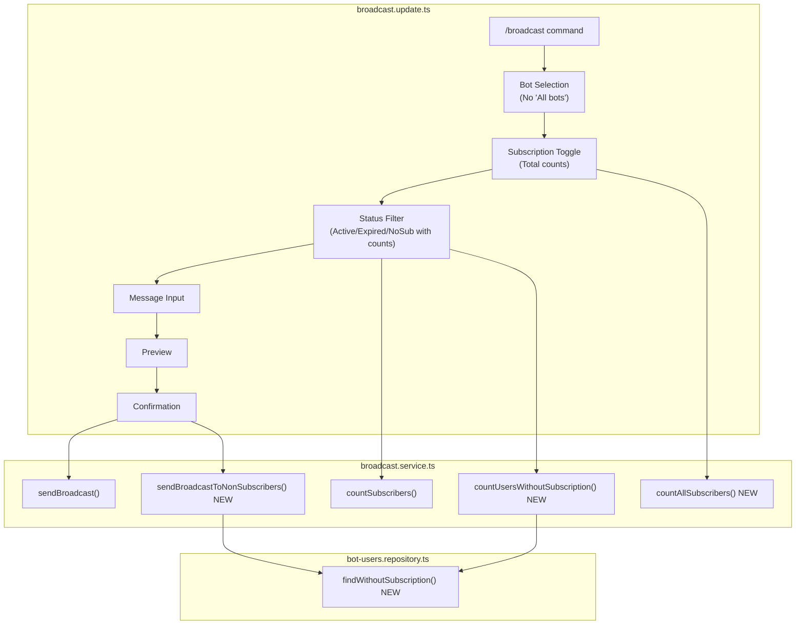

# Broadcast Enhancements Design Document

## Overview

This design document specifies enhancements to the MasterBot `/broadcast` command to improve targeting capabilities and UI clarity. The changes include removing "All bots" option, adding support for users without any subscription, and displaying user counts in filter buttons.

## Background and Context

### Prerequisite ADRs

- ADR-004-multi-bot-architecture.md: Multi-bot context handling
- ADR-COMMON-multi-bot-context.md: Bot-specific user relationships
- ADR-COMMON-signal-broadcasting.md: Broadcasting patterns

### Related Design Docs

- broadcast-flow-redesign-design.md: Current bot-first flow (in progress)
- broadcast-filter-extension-design.md: Status filter patterns

### Agreement Checklist

#### Scope
- [x] Remove "All bots" button from bot selection keyboard
- [x] Remove `onBroadcastBotAll` handler and related logic
- [x] Add new status filter option for users without subscription
- [x] Show subscriber counts in status filter buttons
- [x] Show total user count (not just active) when selecting subscriptions

#### Non-Scope (Explicitly not changing)
- [x] Overall broadcast flow structure (bot -> subscription -> status -> message)
- [x] Subscription toggle selection mechanism
- [x] Message preview and confirmation flow
- [x] Broadcast execution and deduplication logic

#### Constraints
- [x] Parallel operation: No (sequential changes)
- [x] Backward compatibility: Yes (session state)
- [x] Performance measurement: Not required

### Problem to Solve

1. **"All bots" option confusion**: The "All bots" option bypasses subscription selection entirely, leading to an inconsistent flow where managers might accidentally broadcast to all users without proper targeting.

2. **Missing targeting for non-subscribers**: Currently, managers cannot target users who have never activated any subscription. This is valuable for conversion/onboarding campaigns.

3. **Unclear button counts**: Status filter buttons show only text without counts, making it difficult for managers to understand the target audience size before selection.

4. **Misleading subscription counts**: Subscription selection shows only "active" subscriber counts, but managers need to see total users (all statuses) to understand full reach.

### Current Challenges

1. `onBroadcastBotAll` handler sets `flowState = 'awaiting_broadcast_message'` directly, skipping subscription and status filter selection.

2. No repository method exists to find bot users who have no records in `user_subscriptions` table.

3. `showStatusFilterKeyboard()` displays static button text without dynamic counts.

4. `showSubscriptionToggleKeyboard()` calls `countSubscribers(subId, 'active', botId)`, showing only active users.

### Requirements

#### Functional Requirements

1. **FR1**: Remove "All bots" option from bot selection
2. **FR2**: Add "Without subscription" status filter option for users who NEVER had any subscription
3. **FR3**: Display subscriber count in each status filter button
4. **FR4**: Display total user count (all statuses) for each subscription in toggle keyboard

#### Non-Functional Requirements

- **Performance**: Count queries should complete within 500ms for up to 10,000 users
- **Maintainability**: Reuse existing repository patterns for new queries

## Acceptance Criteria (AC)

- [ ] **AC1**: "All bots" button is not displayed in bot selection keyboard
  - When: Manager types `/broadcast` command
  - Then: Bot selection keyboard shows only specific bot buttons and cancel
  - Verify: `showBotSelectionKeyboardReply()` does not include "All bots" button

- [ ] **AC2**: `onBroadcastBotAll` handler is removed
  - When: Build and tests run
  - Then: No handler for `BROADCAST_BOT_ALL` callback action exists
  - Verify: Action constant may remain for backward compatibility but handler is removed

- [ ] **AC3**: "Without subscription" status filter option is available
  - When: Manager reaches status filter step
  - Then: Three options shown: "Active (N)", "Expired (M)", "Without subscription (K)"
  - Verify: Button for `BROADCAST_FILTER_NO_SUBSCRIPTION` callback exists

- [ ] **AC4**: Status filter buttons display subscriber counts
  - When: Manager views status filter keyboard
  - Then: Each button shows count in format "Status (count)"
  - Example: "Active (45)" / "Expired (12)" / "Without subscription (8)"
  - Verify: Counts match actual database query results

- [ ] **AC5**: Subscription toggle keyboard shows total user counts
  - When: Manager views subscription selection after bot selection
  - Then: Each subscription shows total users, not just active
  - Example: "Premium (120 users)" includes active + expired
  - Verify: Count includes all users with any subscription record for that subscription

- [ ] **AC6**: "Without subscription" broadcast executes correctly
  - When: Manager selects "Without subscription" and sends broadcast
  - Then: Message sent only to bot users with NO records in user_subscriptions
  - Verify: Users with any subscription (active or expired) are excluded

## Existing Codebase Analysis

### Implementation Path Mapping

| Type | Path | Description |
|------|------|-------------|
| Existing | libs/masterbot/src/broadcast.update.ts | Broadcast handlers (line 246-273: onBroadcastBotAll) |
| Existing | libs/masterbot/src/services/broadcast.service.ts | countSubscribers, sendBroadcast methods |
| Existing | libs/masterbot/src/constants.ts | BROADCAST_BOT_ALL constant |
| Existing | libs/db/src/repositories/user-subscriptions.repository.ts | Subscription queries |
| Existing | libs/db/src/repositories/bot-users.repository.ts | Bot user queries |
| New | libs/db/src/repositories/bot-users.repository.ts | findUsersWithoutSubscription method |

### Integration Points

1. **Bot Selection Keyboard**
   - Integration Target: `showBotSelectionKeyboardReply()` in broadcast.update.ts
   - Current: Includes "All bots" button
   - Change: Remove "All bots" button

2. **Status Filter Keyboard**
   - Integration Target: `showStatusFilterKeyboard()` in broadcast.update.ts
   - Current: Static button text
   - Change: Dynamic counts + new "Without subscription" option

3. **Subscription Toggle Keyboard**
   - Integration Target: `showSubscriptionToggleKeyboard()` in broadcast.update.ts
   - Current: Calls `countSubscribers(subId, 'active', botId)`
   - Change: Call new method for total count

4. **Broadcast Service**
   - Integration Target: `BroadcastService`
   - Current: `sendBroadcast` and `sendBroadcastMulti` handle active/expired
   - Change: Add support for 'no_subscription' status

## Design

### Change Impact Map

```yaml
Change Target: Broadcast command flow
Direct Impact:
  - libs/masterbot/src/broadcast.update.ts (bot keyboard, status keyboard, handlers)
  - libs/masterbot/src/services/broadcast.service.ts (count methods, send methods)
  - libs/masterbot/src/constants.ts (new callback action constant)
  - libs/db/src/repositories/bot-users.repository.ts (new query method)
Indirect Impact:
  - Session state interpretation (new filter status value)
  - UI text formatting (button labels)
No Ripple Effect:
  - Message preview flow
  - Confirmation flow
  - Notification service
  - Translation service
```

### Architecture Overview



### Data Flow

```
1. Bot Selection (UNCHANGED except remove "All bots")
   /broadcast -> showBotSelectionKeyboardReply()
   -> [Bot buttons only, no "All bots"]
   -> user selects bot
   -> ctx.session.broadcastFilterBotId = botId

2. Subscription Selection (CHANGE: Total counts + "Without subscription" option)
   onBroadcastBotSelected()
   -> showSubscriptionToggleKeyboard()
   -> countAllSubscribers(subId, botId) [NEW - counts all statuses]
   -> display "Sub Name (N users)" where N = total
   -> NEW: Add "Without subscription (M)" button where M = countUsersWithoutSubscription(botId)

   BRANCHING:
   - If user selects subscriptions -> proceed to step 3 (Status Filter)
   - If user selects "Without subscription" -> SKIP step 3, go directly to step 4

3. Status Filter (CHANGE: Counts in buttons) - SKIPPED if "Without subscription" selected
   onBroadcastSubscriptionsDone()
   -> showStatusFilterKeyboard()
   -> countSubscribers(subIds, 'active', botId) for active count
   -> countSubscribers(subIds, 'expired', botId) for expired count
   -> display buttons: "Active (N)" / "Expired (M)"
   NOTE: "Without subscription" is selected at step 2, not here

4. No Subscription Broadcast Flow (NEW)
   onBroadcastFilterNoSubscription() - triggered from step 2 "Without subscription" button
   -> ctx.session.broadcastFilterStatus = 'no_subscription'
   -> ctx.session.broadcastSubscriptionIds = [] (explicitly cleared)
   -> flowState = 'awaiting_broadcast_message'
   -> [Message input, preview, confirmation unchanged]
   -> sendBroadcastToNonSubscribers(botId, message, ...) [NEW]
```

**Important Flow Clarification**:
- "Without subscription" option is shown at subscription selection step (step 2)
- When selected, it SKIPS the status filter step entirely (step 3)
- This is because "without subscription" users don't have any subscription status (active/expired)
- The flow becomes: Bot Selection -> "Without subscription" -> Message Input -> Preview -> Confirm

### Integration Points List

| Integration Point | Location | Old Implementation | New Implementation | Switching Method |
|-------------------|----------|-------------------|-------------------|------------------|
| Bot selection keyboard | `showBotSelectionKeyboardReply()` | Includes "All bots" button | Remove "All bots" button | Direct modification |
| Status filter keyboard | `showStatusFilterKeyboard()` | Static text buttons | Buttons with counts + "Without subscription" | Direct modification |
| Subscription counts | `showSubscriptionToggleKeyboard()` | `countSubscribers(subId, 'active', botId)` | `countAllSubscribers(subId, botId)` | New method |
| No-subscription handler | N/A | Does not exist | New `onBroadcastFilterNoSubscription()` | Add handler |
| No-subscription send | N/A | Does not exist | `sendBroadcastToNonSubscribers()` | New method |

### Main Components

#### Component 1: BotUsersRepository.findWithoutSubscription()

- **Responsibility**: Find bot users who have no records in user_subscriptions table
- **Interface**:
  ```typescript
  async findWithoutSubscription(
    botId: number
  ): Promise<Array<{ botUser: BotUser }>>
  ```
- **Dependencies**: bot_users table, user_subscriptions table (LEFT JOIN exclusion)

#### Component 2: BroadcastService.countUsersWithoutSubscription()

- **Responsibility**: Count bot users without any subscription for display in UI
- **Interface**:
  ```typescript
  async countUsersWithoutSubscription(botId: number): Promise<number>
  ```
- **Dependencies**: BotUsersRepository.findWithoutSubscription

#### Component 3: BroadcastService.countAllSubscribers()

- **Responsibility**: Count all subscribers (active + expired) for a subscription/bot
- **Interface**:
  ```typescript
  async countAllSubscribers(
    subscriptionId: number,
    filterBotId?: number | null
  ): Promise<number>
  ```
- **Dependencies**: UserSubscriptionsRepository

#### Component 4: BroadcastService.sendBroadcastToNonSubscribers()

- **Responsibility**: Send broadcast to users without any subscription
- **Interface**:
  ```typescript
  async sendBroadcastToNonSubscribers(
    botId: number,
    message: string,
    entities: MessageEntity[] | undefined,
    managerId: number
  ): Promise<BroadcastResultDto>
  ```
- **Dependencies**: BotUsersRepository.findWithoutSubscription, NotificationService

### Type Definitions

```typescript
// Required imports for new methods
import { BotUser } from '@quantumdeal/db';
import { BroadcastResultDto } from '../dto';
import type { MessageEntity } from 'telegraf/types';

// Session filter status extension (broadcast.update.ts context)
// Extend existing broadcastFilterStatus to include 'no_subscription'
type BroadcastFilterStatus = 'active' | 'expired' | 'no_subscription';

// New callback action constant
// libs/masterbot/src/constants.ts
BROADCAST_FILTER_NO_SUBSCRIPTION: 'broadcast_filter_no_subscription',

// Return types for new methods
type FindWithoutSubscriptionResult = Array<{ botUser: BotUser }>;
type CountResult = Promise<number>;
type SendBroadcastResult = Promise<BroadcastResultDto>;
```

### Data Contract

#### findWithoutSubscription

```yaml
Input:
  botId: number (required, valid bot ID)

Output:
  Array<{ botUser: BotUser }>

Guarantees:
  - Returns only active bot users (bot_users.isActive = true)
  - Excludes users with ANY record in user_subscriptions for this bot
  - Returns users specific to the given botId

On Error: Empty array if no matching users
```

#### countUsersWithoutSubscription

```yaml
Input:
  botId: number (required)

Output:
  number (count >= 0)

Guarantees:
  - Count matches findWithoutSubscription result length

On Error: Returns 0
```

#### countAllSubscribers

```yaml
Input:
  subscriptionId: number (required)
  filterBotId: number | null (optional bot filter)

Output:
  number (count >= 0)

Guarantees:
  - Counts all user_subscriptions records regardless of isActive status
  - Filters by botId if provided

On Error: Returns 0
```

### State Transitions and Invariants

```yaml
State Definition:
  broadcastFilterStatus: 'active' | 'expired' | 'no_subscription' | null

State Transitions:
  selecting_status_filter + BROADCAST_FILTER_ACTIVE -> 'active', awaiting_broadcast_message
  selecting_status_filter + BROADCAST_FILTER_EXPIRED -> 'expired', awaiting_broadcast_message
  selecting_status_filter + BROADCAST_FILTER_NO_SUBSCRIPTION -> 'no_subscription', awaiting_broadcast_message

System Invariants:
  - When broadcastFilterStatus = 'no_subscription', broadcastSubscriptionIds is ignored
  - When broadcastFilterStatus = 'active' or 'expired', broadcastSubscriptionIds must have >= 1 element
```

### Error Handling

| Error | Handler | User Message |
|-------|---------|--------------|
| Bot not found | onBroadcastBotSelected | "Bot not found" |
| No users without subscription | countUsersWithoutSubscription returns 0 | Button shows "(0)" |
| Database query failure | Log error, return empty/0 | "Error loading data" |

### Edge Cases

#### Zero Non-Subscribers
- **Scenario**: All bot users have at least one subscription record
- **Handling**: Button shows "(0)", broadcast sends to nobody if selected
- **UI Behavior**: Allow selection but show warning at confirmation step: "No recipients found"

#### User Subscribes During Flow
- **Scenario**: User activates subscription between filter selection and broadcast execution
- **Handling**: Query runs at send time, user is correctly excluded from "Without subscription" group
- **Note**: This is expected behavior, no special handling needed

#### Deleted Subscription Records
- **Scenario**: user_subscriptions records manually deleted from database
- **Handling**: Users with deleted records appear as "without subscription" (technically correct)
- **Note**: They have no current subscription record, so this is accurate

#### Race Condition on Counts
- **Scenario**: Count displayed in button differs from actual send count
- **Handling**: Counts are informational only; final recipient list is determined at send time
- **Note**: Warning shown if recipient count differs significantly (>10%)

### Logging and Monitoring

```typescript
// Log filter selection
this.logger.log(`Broadcast filter: status=${filterStatus}, botId=${botId}`);

// Log no-subscription broadcast
this.logger.log(`Broadcasting to ${count} users without subscription for bot ${botId}`);
```

## Implementation Plan

### Implementation Approach

**Selected Approach**: Vertical Slice (Feature-Driven)
**Selection Reason**: Each requirement is independent and can be verified in isolation. Changes span all layers but are focused on specific features.

### Technical Dependencies and Implementation Order

#### Required Implementation Order

1. **Remove "All bots" functionality (FR1, AC1-AC2)**
   - Technical Reason: Simplest change, removes code rather than adding
   - Dependent Elements: None
   - Files: broadcast.update.ts, constants.ts (optional cleanup)

2. **Add findWithoutSubscription repository method (FR2 foundation)**
   - Technical Reason: Required before service and handler implementation
   - Dependent Elements: Service layer methods depend on this
   - Files: bot-users.repository.ts

3. **Add service layer methods (FR2, FR3, FR4)**
   - Technical Reason: Required before handler implementation
   - Dependent Elements: Handler layer depends on these
   - Files: broadcast.service.ts

4. **Update showStatusFilterKeyboard with counts + no-subscription (FR2, FR3)**
   - Technical Reason: Requires service methods from step 3
   - Prerequisites: Steps 2-3 complete
   - Files: broadcast.update.ts

5. **Update showSubscriptionToggleKeyboard with total counts (FR4)**
   - Technical Reason: Requires countAllSubscribers from step 3
   - Prerequisites: Step 3 complete
   - Files: broadcast.update.ts

6. **Add onBroadcastFilterNoSubscription handler (FR2)**
   - Technical Reason: Completes FR2 feature
   - Prerequisites: Steps 2-4 complete
   - Files: broadcast.update.ts

### Integration Points

**Integration Point 1: Repository to Service**
- Components: BotUsersRepository.findWithoutSubscription -> BroadcastService
- Verification: Unit test with mocked repository

**Integration Point 2: Service to Handler**
- Components: BroadcastService.count* -> BroadcastUpdate keyboard builders
- Verification: Integration test with counts displayed in UI

**Integration Point 3: Full Flow**
- Components: /broadcast command through to message delivery
- Verification: E2E test for no-subscription broadcast

### Migration Strategy

No migration required. Changes are additive with one removal:
1. "All bots" button removal is non-breaking (unused callback action is harmless)
2. New "no_subscription" filter status is additive
3. Count display changes are UI-only

## Test Strategy

### Basic Test Design Policy

Test cases derived from acceptance criteria. Each AC has at least one test.

### Unit Tests

**AC1-AC2: Remove "All bots"**
- Test that `showBotSelectionKeyboardReply()` does not include "All bots" button
- Test that `onBroadcastBotAll` handler is removed (compile-time verification)

**AC3-AC4: Status filter with counts**
- Test `countUsersWithoutSubscription()` returns correct count
- Test `showStatusFilterKeyboard()` includes counts in button text
- Test `onBroadcastFilterNoSubscription()` sets correct session state

**AC5: Subscription total counts**
- Test `countAllSubscribers()` includes both active and expired users
- Test `showSubscriptionToggleKeyboard()` displays total counts

**AC6: No-subscription broadcast**
- Test `findWithoutSubscription()` excludes users with any subscription
- Test `sendBroadcastToNonSubscribers()` sends to correct users

### Integration Tests

- Full flow: Bot selection -> Subscription -> Status filter (with counts) -> No-subscription selected -> Broadcast
- Verify counts match actual database state

### E2E Tests

- Manager broadcasts to users without subscription, verifies delivery

## Security Considerations

- No new security concerns
- Existing authentication checks apply (manager verification)

## Future Extensibility

- Status filter buttons pattern can be extended for additional filter types
- Repository method pattern can be reused for other "exclusion" queries

## Alternative Solutions

### Alternative 1: Soft-hide "All bots" with feature flag

- **Overview**: Keep handler but hide button, controlled by feature flag
- **Advantages**: Easy rollback if needed
- **Disadvantages**: Technical debt, unused code remains
- **Reason for Rejection**: Clean removal is preferred; feature is not needed

### Alternative 2: Count queries in real-time (no caching)

- **Overview**: Query counts on every keyboard refresh
- **Advantages**: Always accurate
- **Disadvantages**: Potentially slow for large user bases
- **Reason for Rejection**: For MVP, real-time is acceptable; caching can be added later if needed

## Risks and Mitigation

| Risk | Impact | Probability | Mitigation |
|------|--------|-------------|------------|
| LEFT JOIN query performance for no-subscription | Medium | Low | Add index on user_subscriptions(bot_user_id), monitor query time |
| Count queries slow down keyboard display | Low | Low | Parallel queries, timeout handling |
| Session state inconsistency with new status | Low | Low | Clear session on flow start, validate before broadcast |

## References

- [Drizzle ORM LEFT JOIN](https://orm.drizzle.team/docs/joins#left-join)
- [Telegram inline keyboard limits](https://core.telegram.org/bots/api#inlinekeyboardmarkup)

## Update History

| Date | Version | Changes | Author |
|------|---------|---------|--------|
| 2026-01-13 | 1.0 | Initial version | Claude Code |
| 2026-01-14 | 1.1 | Bug fix: findExpired() now uses isActive=true (expired by date, not deactivated). UX: "Without subscription" button moved below Done/Cancel with 👤 icon | User + Claude Code |
