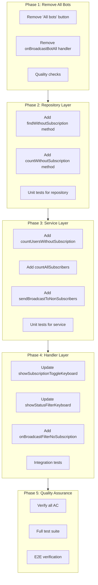
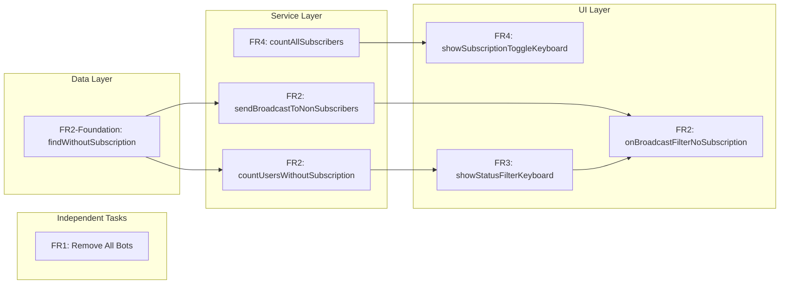

# Work Plan: Broadcast Enhancements Implementation

Created Date: 2026-01-13
Type: feature
Estimated Duration: 2 days
Estimated Impact: 4 files
Related Issue/PR: feature/messages-dispatch branch

## Related Documents
- Design Doc: [docs/plans/broadcast-enhancements-design.md]
- ADR: [docs/adr/ADR-004-multi-bot-architecture.md]

## Objective

Enhance the MasterBot `/broadcast` command to improve targeting capabilities and UI clarity:
1. Remove confusing "All bots" option that bypasses proper targeting flow
2. Add ability to target users without any subscription (for conversion campaigns)
3. Display subscriber counts in filter buttons for better audience visibility
4. Show total user counts (not just active) when selecting subscriptions

## Background

Current broadcast flow has several UX issues:
- "All bots" option skips subscription/status selection, leading to accidental mass broadcasts
- No way to target users who never activated any subscription (valuable for onboarding)
- Status filter buttons lack counts, making audience size unclear
- Subscription selection shows only active subscriber counts, not total reach

## Risks and Countermeasures

### Technical Risks
- **Risk**: LEFT JOIN query for users without subscription may be slow
  - **Impact**: Low (up to 10,000 users expected)
  - **Countermeasure**: Monitor query time, add index on user_subscriptions(bot_user_id) if needed

- **Risk**: Count queries slow down keyboard display
  - **Impact**: Low
  - **Countermeasure**: Use parallel queries, implement timeout handling if needed

### Schedule Risks
- **Risk**: Session state inconsistency with new 'no_subscription' status
  - **Impact**: Low
  - **Countermeasure**: Clear session on flow start, validate before broadcast execution

## Phase Structure Diagram



## Task Dependency Diagram



## Implementation Phases

### Phase 1: Remove "All bots" Functionality (Estimated commits: 1)
**Purpose**: Clean removal of "All bots" option to simplify broadcast flow (FR1, AC1-AC2)

**Technical Dependencies**: None (independent task)

#### Tasks
- [ ] Remove "All bots" button from `showBotSelectionKeyboardReply()` in broadcast.update.ts (line 743-747)
- [ ] Remove "All bots" button from `showBotFilterKeyboard()` in broadcast.update.ts (line 703-707)
- [ ] Remove `onBroadcastBotAll` handler method in broadcast.update.ts (lines 246-273)
- [ ] Remove `@Action(MASTERBOT_CONSTANTS.CALLBACK_ACTIONS.BROADCAST_BOT_ALL)` decorator
- [ ] Quality check: Type check, lint, build passes

#### Phase Completion Criteria
- [ ] AC1: "All bots" button is not displayed in bot selection keyboard
- [ ] AC2: `onBroadcastBotAll` handler is removed (compile-time verification)
- [ ] Build and type check pass

#### Operational Verification Procedures
1. Run `/broadcast` command
2. Verify bot selection keyboard shows only specific bot buttons and cancel
3. Verify no "All bots" button is present
4. Run `pnpm typecheck` - no errors
5. Run `pnpm build` - success

---

### Phase 2: Repository Layer - findWithoutSubscription (Estimated commits: 1)
**Purpose**: Add data layer foundation for users without subscription (FR2 foundation)

**Technical Dependencies**: None (prerequisite for Phase 3)

#### Tasks
- [x] Add `findWithoutSubscription(botId: number)` method to bot-users.repository.ts
  ```typescript
  /**
   * Find bot users who have no records in user_subscriptions table
   * Used for targeting users who never activated any subscription
   * @param botId - The bot ID to filter by
   * @returns Array of bot users without any subscription record
   */
  async findWithoutSubscription(botId: number): Promise<Array<{ botUser: BotUser }>>
  ```
- [x] Implement using LEFT JOIN with exclusion pattern:
  - Join bot_users with user_subscriptions on botUserId
  - Filter WHERE user_subscriptions.id IS NULL
  - Filter by botId and isActive = true
- [x] Add `countWithoutSubscription(botId: number)` method (optimized count)
- [x] Quality check: Type check passes

#### Phase Completion Criteria
- [x] `findWithoutSubscription` returns only active bot users with NO subscription records
- [x] `countWithoutSubscription` returns correct count matching findWithoutSubscription length
- [x] Type check passes

#### Operational Verification Procedures
1. Create test query in database with known data
2. Verify LEFT JOIN exclusion pattern works correctly
3. Run `pnpm typecheck` - no errors

---

### Phase 3: Service Layer Methods (Estimated commits: 1)
**Purpose**: Add service layer methods for counting and broadcasting (FR2, FR3, FR4)

**Technical Dependencies**: Phase 2 (repository methods)

#### Tasks
- [ ] Add `countUsersWithoutSubscription(botId: number): Promise<number>` to broadcast.service.ts
  - Delegates to BotUsersRepository.countWithoutSubscription
- [ ] Add `countAllSubscribers(subscriptionId: number, filterBotId?: number | null): Promise<number>` to broadcast.service.ts
  - Counts all subscribers regardless of isActive status (active + expired)
  - Filters by botId if provided
- [ ] Add `sendBroadcastToNonSubscribers()` method to broadcast.service.ts:
  ```typescript
  async sendBroadcastToNonSubscribers(
    botId: number,
    message: string,
    entities: MessageEntity[] | undefined,
    managerId: number
  ): Promise<BroadcastResultDto>
  ```
- [ ] Import BotUsersRepository in BroadcastService constructor
- [ ] Quality check: Type check, lint passes

#### Phase Completion Criteria
- [ ] `countUsersWithoutSubscription` returns correct count for bot users without subscriptions
- [ ] `countAllSubscribers` includes both active and expired users
- [ ] `sendBroadcastToNonSubscribers` queues messages via NotificationService
- [ ] Type check and lint pass

#### Operational Verification Procedures
1. Unit test: `countUsersWithoutSubscription` with mock repository
2. Unit test: `countAllSubscribers` includes active + expired
3. Unit test: `sendBroadcastToNonSubscribers` calls NotificationService.addMessages
4. Run `pnpm typecheck` - no errors

---

### Phase 4: Handler Layer Updates (Estimated commits: 2)
**Purpose**: Update UI keyboards and add new handler (FR2, FR3, FR4)

**Technical Dependencies**: Phase 3 (service methods)

#### Tasks

**Task 4.1: Update showSubscriptionToggleKeyboard with total counts + "Without subscription" button (FR2, FR4)**
- [ ] Modify `showSubscriptionToggleKeyboard()` in broadcast.update.ts
- [ ] Change `countSubscribers(sub.id, 'active', botId)` to `countAllSubscribers(sub.id, botId)`
- [ ] Add "Without subscription" button at the end of subscription list:
  ```typescript
  // Add "Without subscription" button
  const noSubCount = await this.broadcastService.countUsersWithoutSubscription(botId);
  buttons.push([
    Markup.button.callback(
      `[ ] Без подписки (${noSubCount} users)`,
      MASTERBOT_CONSTANTS.CALLBACK_ACTIONS.BROADCAST_FILTER_NO_SUBSCRIPTION,
    ),
  ]);
  ```

**Task 4.2: Update showStatusFilterKeyboard with counts (FR3)**
- [x] Modify `showStatusFilterKeyboard()` in broadcast.update.ts
- [x] Add count queries for active and expired:
  ```typescript
  const activeCount = await this.broadcastService.countSubscribers(subscriptionIds, 'active', botId);
  const expiredCount = await this.broadcastService.countSubscribers(subscriptionIds, 'expired', botId);
  ```
- [x] Update button text to include counts: "Active (N)" / "Expired (M)"

**Task 4.3: Add BROADCAST_FILTER_NO_SUBSCRIPTION constant (FR2)**
- [x] Add to constants.ts:
  ```typescript
  BROADCAST_FILTER_NO_SUBSCRIPTION: 'broadcast_filter_no_subscription',
  ```

**Task 4.4: Add onBroadcastFilterNoSubscription handler (FR2)**
- [x] Add new handler in broadcast.update.ts:
  ```typescript
  @Action(MASTERBOT_CONSTANTS.CALLBACK_ACTIONS.BROADCAST_FILTER_NO_SUBSCRIPTION)
  async onBroadcastFilterNoSubscription(@Ctx() ctx: UserContext): Promise<void>
  ```
- [x] Handler logic:
  - Set `ctx.session.broadcastFilterStatus = 'no_subscription'`
  - Clear `ctx.session.broadcastSubscriptionIds = []`
  - Set `ctx.session.flowState = 'awaiting_broadcast_message'`
  - Show message input prompt

**Task 4.5: Update broadcast confirmation to handle 'no_subscription' status**
- [x] Modify `onBroadcastConfirm()` to check for 'no_subscription' status
- [x] Call `sendBroadcastToNonSubscribers()` when status is 'no_subscription'

- [ ] Quality check: Type check, lint, build passes

#### Phase Completion Criteria
- [x] AC3: "Without subscription" option is available in subscription selection keyboard
- [x] AC4: Status filter buttons display subscriber counts
- [ ] AC5: Subscription toggle keyboard shows total user counts
- [x] AC6: "Without subscription" broadcast executes correctly
- [ ] Type check, lint, and build pass

#### Operational Verification Procedures
1. Test `/broadcast` command flow through subscription selection
2. Verify "Without subscription" button appears with correct count
3. Verify subscription buttons show total counts (active + expired)
4. Verify status filter buttons show counts: "Active (N)" / "Expired (M)"
5. Test "Without subscription" selection skips status filter
6. Test broadcast to non-subscribers sends messages
7. Run `pnpm typecheck` - no errors
8. Run `pnpm build` - success

---

### Phase 5: Quality Assurance (Required) (Estimated commits: 1)
**Purpose**: Overall quality assurance and Design Doc consistency verification

#### Tasks
- [ ] Verify all Design Doc acceptance criteria achieved:
  - [ ] AC1: "All bots" button not displayed
  - [ ] AC2: `onBroadcastBotAll` handler removed
  - [ ] AC3: "Without subscription" option available
  - [ ] AC4: Status filter buttons display counts
  - [ ] AC5: Subscription toggle shows total counts
  - [ ] AC6: "Without subscription" broadcast works correctly
- [ ] Quality checks:
  - [ ] `pnpm typecheck` - zero errors
  - [ ] `pnpm lint` - zero errors
  - [ ] `pnpm format:check` - passes
- [ ] Execute all tests:
  - [ ] `pnpm test` - all pass
- [ ] E2E verification:
  - [ ] Full broadcast flow with specific bot
  - [ ] Broadcast to active subscribers
  - [ ] Broadcast to expired subscribers
  - [ ] Broadcast to users without subscription
- [ ] Code review checklist:
  - [ ] No console.log statements left
  - [ ] No TODO comments remaining
  - [ ] Error handling consistent
  - [ ] Logging appropriate

#### Operational Verification Procedures (from Design Doc)
1. **Bot Selection Verification**:
   - Run `/broadcast` command
   - Verify only specific bot buttons and cancel are shown
   - Verify "All bots" button is NOT present

2. **Subscription Selection Verification**:
   - Select a bot
   - Verify subscription buttons show total user counts (e.g., "Premium (120 users)")
   - Verify "Without subscription" button shows count

3. **Status Filter Verification**:
   - Select subscriptions and click "Done"
   - Verify status filter buttons show counts: "Active (45)" / "Expired (12)"

4. **Without Subscription Flow**:
   - Start new `/broadcast` flow
   - Select a bot
   - Click "Without subscription" button
   - Verify flow skips status filter and goes to message input
   - Enter message, confirm
   - Verify broadcast sent only to users without any subscription

### Quality Assurance Checklist
- [ ] Implement staged quality checks (details: refer to @docs/rules/ai-development-guide.md)
- [ ] All tests pass
- [ ] Type check pass
- [ ] Lint check pass
- [ ] Build success

## Completion Criteria
- [ ] All phases completed
- [ ] Each phase's operational verification procedures executed
- [ ] Design Doc acceptance criteria satisfied:
  - [ ] AC1-AC2: "All bots" functionality removed
  - [ ] AC3-AC4: Status filter with counts and "Without subscription" option
  - [ ] AC5: Subscription toggle shows total counts
  - [ ] AC6: Non-subscriber broadcast works correctly
- [ ] Staged quality checks completed (zero errors)
- [ ] All tests pass
- [ ] User review approval obtained

## Progress Tracking

### Phase 1: Remove "All bots" Functionality
- Start:
- Complete:
- Notes:

### Phase 2: Repository Layer
- Start: 2026-01-13
- Complete: 2026-01-13
- Notes: Added findWithoutSubscription and countWithoutSubscription methods to BotUsersRepository using LEFT JOIN with IS NULL exclusion pattern. Build passes.

### Phase 3: Service Layer
- Start:
- Complete:
- Notes:

### Phase 4: Handler Layer
- Start:
- Complete:
- Notes:

### Phase 5: Quality Assurance
- Start:
- Complete:
- Notes:

## Files to Modify

| File | Changes |
|------|---------|
| libs/masterbot/src/broadcast.update.ts | Remove "All bots" button, remove handler, update keyboards, add new handler |
| libs/masterbot/src/services/broadcast.service.ts | Add count methods, add sendBroadcastToNonSubscribers |
| libs/masterbot/src/constants.ts | Add BROADCAST_FILTER_NO_SUBSCRIPTION constant |
| libs/db/src/repositories/bot-users.repository.ts | Add findWithoutSubscription, countWithoutSubscription |

## Notes

### Flow Clarification
- "Without subscription" option is shown at subscription selection step (step 2 in flow)
- When selected, it SKIPS the status filter step entirely
- This is because "without subscription" users don't have any subscription status to filter
- Flow: Bot Selection -> "Without subscription" -> Message Input -> Preview -> Confirm

### Session State for "Without subscription"
When "Without subscription" is selected:
- `broadcastFilterStatus = 'no_subscription'`
- `broadcastSubscriptionIds = []` (explicitly cleared)
- `flowState = 'awaiting_broadcast_message'`

### Backward Compatibility
- BROADCAST_BOT_ALL constant may remain in constants.ts for session compatibility
- No migration needed - changes are additive with one clean removal
